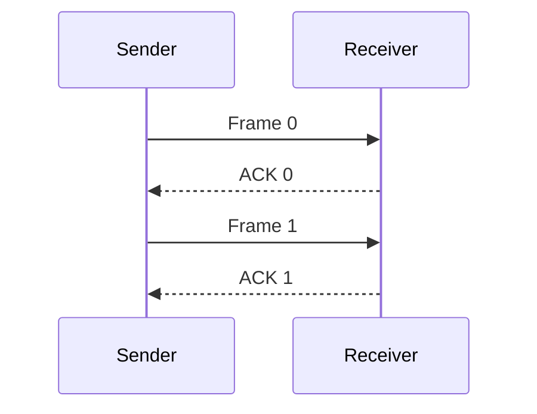
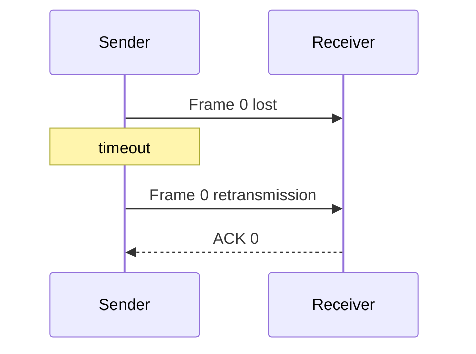
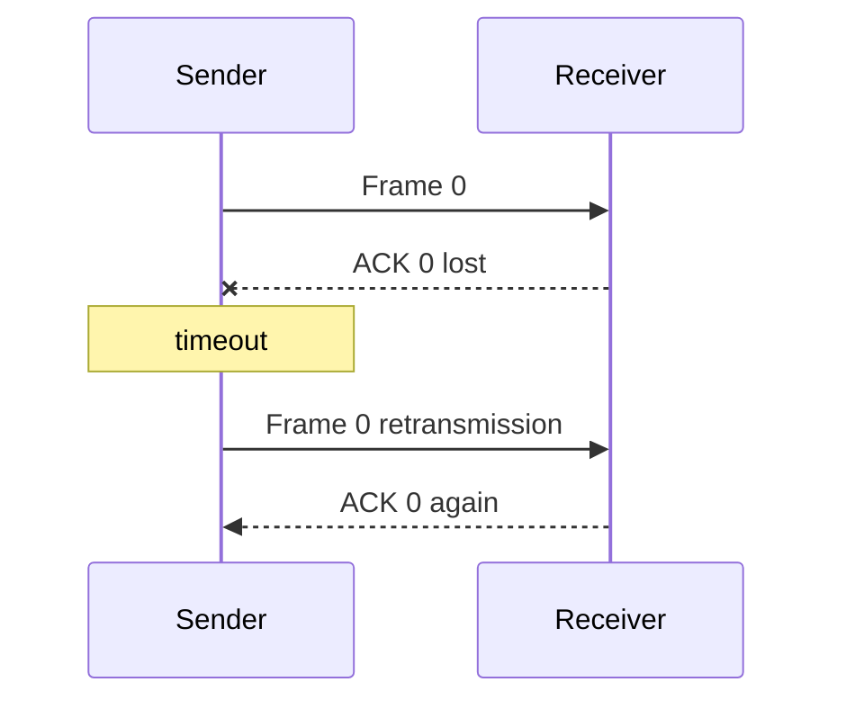
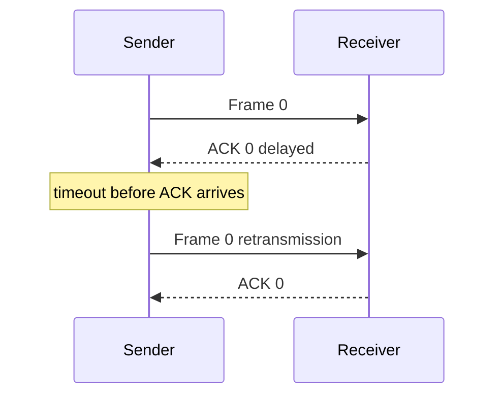
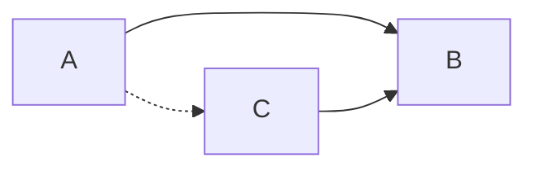

# 链路层

对应课件：`L6` `L7` `L8` `L9` `L10`

## 1. 链路层做什么

链路层负责在**同一条链路或同一局域网范围内**传送 `frame`。

这层最常与这些概念联动：

- [[概念/IP 与 MAC 地址]]
- [[概念/ARP]]
- [[概念/Router 与 Switch]]
- [[概念/Internet Checksum 与 Hamming Code]]

## 2. 数据单位与地址

| 项目 | English | 中文 |
|---|---|---|
| Data Unit | Frame | 帧 |
| Address | MAC Address | MAC 地址 / 物理地址 |

这里最重要的区别是：

- 链路层本地交付主要看 `MAC`
- 网络层跨网交付主要看 `IP`

详见 [[概念/IP 与 MAC 地址]]。

## 3. Framing 成帧

### 目的

让接收方知道：

- 一帧从哪里开始
- 一帧在哪里结束

### 常见方法

- `Byte Stuffing` 字节填充
- `Bit Stuffing` 比特填充

## 4. Error Detection / Correction 差错检测与纠错

### Parity 奇偶校验

- 简单
- 能力弱

### Checksum 校验和

- 接收端重新计算并比较
- 课件里专门讲了 `Internet Checksum` 的 1's complement 算法

### CRC 循环冗余校验

- 强检测能力
- 是考试高频点

CRC 做的是 modulo-2 division：

- 加法/减法都用 XOR
- 不产生普通算术 carry
- 接收端用同一个 generator 去除收到的 bit string
- remainder 为 `0` 表示没有检测到错误；非 0 表示 likely error

例题：

```text
received  = 11010110110010
generator = 10011
remainder = 1100
```

因为 remainder 非 0，所以 likely transmission error。

考试写除法时，只在当前最高位是 `1` 时才和 generator XOR。

### Hamming Distance 海明距离

用于分析一个编码能检测和纠正多少错误。

规则：

- `HD = d + 1` 时，最多稳定检测 `d` 位错误
- `HD = 2d + 1` 时，最多稳定纠正 `d` 位错误

### Hamming Code

课件里进一步给了标准构造和解码思路：

- 给每 4 个 data bits 加 3 个 check bits
- check bit 放在位置 `1, 2, 4, 8, ...`
- 解码时重算 check bits
- 把结果组成 syndrome
- syndrome 非 0 时，对应的二进制值就是出错位位置

详见 [[概念/Internet Checksum 与 Hamming Code]]。

### Internet Checksum

课件中的流程是：

1. 按 16-bit words 排列数据
2. checksum 字段先置 0
3. 用 1's complement arithmetic 求和
4. 有进位就回卷加回低位
5. 取反得到 checksum

接收时：

1. 连同 checksum 一起再求和
2. 再取反
3. 若结果为 0，则通过

详见 [[概念/Internet Checksum 与 Hamming Code]]。

## 5. ARQ 重传机制

详见 [[概念/ARP]] 以外，链路层还经常考的另一个缩写是 `ARQ`。

`ARQ = Automatic Repeat reQuest`

基本流程：

1. 发送方发 frame
2. 接收方正确收到后回 `ACK`
3. 发送方超时没等到 ACK 就重传

### ARQ 关注的真实问题

- timeout 如何设置
- duplicate frame 如何处理
- correctness 和 performance 如何平衡

课件在 `L9` 里把问题拆得更具体：

- timeout 不能太大，否则链路空转
- timeout 不能太小，否则会产生 `spurious resend`
- 局域网里更容易估计 timeout
- Internet 上 RTT 波动更大，timeout 更难设

### Stop-and-Wait 正常情况



Stop-and-wait 每次只允许一个 frame 在途，所以发送 10 个 frame 通常需要 10 个 ACK。

### Frame Lost



核心：sender 等不到 ACK，就认为需要重传。

### ACK Lost



风险：receiver 可能已经收过 Frame 0。必须用 sequence number 识别 duplicate，避免重复交给上层。

### Late ACK



关键：ACK 迟到和 ACK 丢失在 sender 看起来都像 timeout，所以 frame 和 ACK 都要带编号。

### Sequence Number 为什么必要

`L9` 明确指出：

- frame 和 ACK 都必须带 `sequence number`
- 否则无法区分：
  - 这是当前 frame 的 ACK
  - 还是上一个 frame 的迟到 ACK
  - 以及收到的是新 frame 还是 resend

对 `stop-and-wait` 来说，只要区分“当前 frame / 下一 frame”，通常 `1 bit` 编号就够，也就是：

- `Frame 0 / ACK 0`
- `Frame 1 / ACK 1`

### Stop-and-Wait 的限制

`L9` 还强调了 stop-and-wait 的核心限制：

- 任意时刻最多只能有 `one outstanding frame`
- sender 发完 1 个 frame 就必须等 ACK
- 在 `high bandwidth-delay product` 场景下效率很低

所以它适合：

- 简单链路
- 局域网式低时延环境

但不适合：

- 长距离高时延链路
- 高带宽链路

## 6. Multiplexing 复用

### TDM

- `Time Division Multiplexing`
- 按时间片共享链路
- 用户在固定 schedule 下轮流发送
- 单个用户是在“部分时间内高速发送”

### FDM

- `Frequency Division Multiplexing`
- 按频率段共享链路
- 不同用户占用不同 `frequency band`
- 单个用户是“持续地以较低速率发送”

### TDM vs FDM 使用场景

`L9` 对比得很直接：

- `TDM`：高瞬时速率，部分时间发送,剩下时间hold
- 
- `FDM`：低瞬时速率，但一直发送
   
更适合记成：

- `TDM/FDM` 都属于对资源的 `static division`
- 更适合：
  - 连续流量
  - 用户数相对固定


TDM 具体案例：

- [[2G]] GSM：经典 TDMA 系统。多个手机用户共享同一个频段，但按 time slot 轮流发送。
- T1/E1 digital telephone line：传统数字电话复用。多个语音通话被放进固定时间槽中轮流传输。
- Time-slotted satellite link：多个地面站按分配好的时间片向卫星发送，避免同时发射冲突。

FDM 具体案例：

- FM radio broadcasting：不同电台占用不同频率，例如 88.5 MHz、90.3 MHz、98.1 MHz，可以同时广播。
- TV broadcasting：不同电视频道占用不同频段，观众调到对应频道接收。
- Cable TV：同一根同轴电缆上传多个频道，每个频道在不同频率范围内。
- DSL broadband：电话语音、上行数据、下行数据用不同频段同时传输。
- 4G/5G OFDM：更准确说是 OFDM/OFDMA，把频谱切成很多子载波，不同用户或数据流可分配不同子载波。3G/4G/5G 不一定是纯 FDM，但有频分思想。
## 7. Multiple Access 与 Ethernet 交换

### Multiple Access 多路接入

当多个节点共享同一媒介时，需要规则决定谁何时发送。

高频术语：

- `CSMA` Carrier Sense Multiple Access
- `collision detection` 碰撞检测 详见
这些概念主要出现在经典共享媒介链路语境里。

### 802.11 / Wi-Fi 的关键点

`L9` 对无线链路强调了几件事：

- 无线节点共享同一信道
- 节点覆盖范围不同
- 节点在发送时通常不能同时听到冲突
- 所以无线更难做 `collision detection`

因此 Wi-Fi 更偏向：

- `CSMA/CA`
- 不是有线经典 Ethernet 的 `CSMA/CD`

### CSMA/CA

`Carrier Sense Multiple Access / Collision Avoidance`

基本思想：

- 先听信道是否空闲
- 空闲才发
- 如果有人在发，就等待一段随机时间后再听

课件还提到：

- 可以用 `Binary Exponential Backoff (BEB)`
- 每次冲突/失败后等待区间翻倍
- 这样更容易快速拉开竞争发送者

### Hidden Node / Exposed Node

无线网络里 carrier sensing 只能感知自己附近的信号，因此会出现两个典型问题。

Hidden node：



- A 和 C 彼此听不到
- 但 A 和 C 同时发给 B 会在 B 处 collision
- 常见缓解：RTS/CTS，让接收方 B 帮忙宣告信道预约

Exposed node：

```
B  ---->  A

C  ---->  D

```

- B 正在给 A 发，C 能听到 B
- C 误以为自己不能发给 D
- 但如果 C->D 不会干扰 A 接收，则 C 本可以发送
- 问题本质是过度保守，降低空间复用

答题时要画出节点位置和通信方向，再说明影响：hidden node 导致 collision，exposed node 导致 unnecessary silence。

### MACA / RTS-CTS

`L9` 用 `MACA` 说明隐藏节点和暴露节点的缓解方法。

流程：

1. sender 先发 `RTS` (`Request-To-Send`)
2. receiver 回 `CTS` (`Clear-To-Send`)
3. 听到 `CTS` 的节点在对应时长内保持安静
4. sender 再发送真正的 frame

作用：

- hidden node：让原本听不到 sender 的节点，也能通过 receiver 发出的 `CTS` 知道应当 defer
- exposed node：通过更明确的协商，允许互不干扰的发送并行发生

要点：

- `RTS/CTS` 本身也可能碰撞
- 但短控制帧碰撞的代价比长数据帧碰撞小得多
- 在现代 Wi-Fi 中，`RTS/CTS` 仍存在，但通常只在干扰严重、hidden node 明显或高拥塞场景下更有价值

### 802.11 还考什么

`L9` 最后一页把 Wi-Fi 放回链路层整体语境里：

- multiple access：`CSMA/CA`
- optional `RTS/CTS`
- frame 会被 `ACK`
- 错误检测常用 `32-bit CRC`
- 出错后会结合 `ARQ` 做重传

### Switched Ethernet

现代 Ethernet 更强调：

- switch
- full duplex
- buffering
- parallel forwarding

### Backward Learning 与 Spanning Tree

backward learning：交换机通过 source MAC 学习端口映射
- spanning tree：避免二层环路

更具体地说：

- switch 收到 frame 时，先看 `source MAC`
- 把 `source MAC -> incoming port` 记入 MAC table
- forwarding 时再查 `destination MAC`
- 如果交换机拓扑里有环，`spanning tree` 会阻塞部分端口，避免 frame 在二层无限循环

对应到课件可记成：

- `L9` 讲 `backward learning`
- `L10` / `review` 常把 `spanning tree` 放到 modern Ethernet 的防环机制里

### PPP / HDLC / SONET

课件在 framing 里给了具体协议例子：

- `PPP`：Point-to-Point Protocol，使用 byte stuffing
- `HDLC`：使用 bit stuffing
- `PPP` 可用于在 `SONET` 链路上传送 IP packets

这部分说明 framing 不是抽象技巧，而是实际协议里的工程实现。

## 8. Switch 交换机

详见 [[概念/Router 与 Switch#Switch 交换机]]。

这里先抓住几个点：

- switch 工作重点在链路层
- switch 主要看 MAC address
- switch 能通过 backward learning 学会“哪个 MAC 在哪个端口”
- 遇到未知目标 MAC 时会 flood
- 输出端口过载时会依赖 buffer

## 9. ARP 为什么常被误以为是纯网络层

因为 ARP 处理对象里有 `IP`，但它真正解决的问题是：

**如何把一个网络层目标，落到本地链路层可发送的 MAC 目标上。**

所以 ARP 是跨层边界的高频考点。

详见 [[概念/ARP]]。

## 10. 易错点辨析

### 易错 1：Switch 根据 IP 找下一跳

通常不对。

标准交换机主要根据 MAC 转发 frame。

### 易错 2：ARP 是为了找到远端服务器的 MAC

通常不对。

如果目标不在本地子网，ARP 找到的往往是**默认网关 default gateway 的 MAC**，不是远端服务器的 MAC。

### 易错 3：CRC 能修复所有错误

不对。

CRC 主要是强检测，不是通用纠错机制。

### 易错 4：交换式 Ethernet 就不会丢 frame

不对。

当输出端口持续拥塞时，switch buffer 仍可能溢出并丢 frame。

### 易错 5：checksum 和 CRC 是同一个东西

不对。

课件明确把 parity、checksum、CRC 分成不同机制；CRC 一般更强，checksum 更常见于 TCP/IP/UDP 一类协议。
