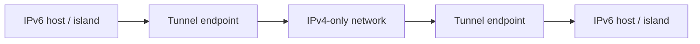

# 网络层

对应课件：`L11` `L12` `L13` `L14`

## 1. 网络层做什么

网络层的核心是：

**让 packet 能跨多个网络被送到目的地。**

它最关键的设备是：

- [[概念/Router 与 Switch#Router 路由器]]
- 

最关键的对象是：

- [[概念/IP 与 MAC 地址#IP 地址 IP Address]]

最关键的动作是：

- [[概念/Routing、Forwarding 与 Longest Prefix Match]]
- [[概念/Virtual Circuit 与 Datagram]]


## 2. 网络层关键词中英对照

| English | 中文 |
|---|---|
| Network Layer | 网络层 |
| Packet | 包 |
| Router | 路由器 |
| Routing | 路由选择 |
| Forwarding | 转发 |
| Prefix | 前缀 |
| Default Route | 默认路由 |
| DHCP | 动态主机配置协议 |
| ARP | 地址解析协议 |
| NAT | 网络地址转换 |
| MTU | 最大传输单元 |

## 3. 为什么不能只靠 Switch

交换机在局域网里很强，但不能单独支撑整个互联网。

原因：

- 扩展性差
- 广播开销大
- 难以跨异构链路层
- 不擅长全网路径决策

所以需要 router 和 IP。

## 4. IP 前缀与分层地址

IP 地址不是一串纯随机编号，它带有层次结构 `hierarchy`。

这带来两个重要后果：

1. 同一网络里的主机共享前缀
2. 路由表可以按前缀聚合，不必每个主机一条

详见 [[概念/IP 与 MAC 地址]]。

### subnet  Prefix 计算

IPv4 有 32 bits。`/n` 表示前 `n` bits 是 network prefix，剩下 `32-n` bits 是 host 部分。

公式：

- 地址总数：`2^(32-n)`
- 普通可用主机地址数：`2^(32-n) - 2`
- 第一个地址通常是 network address
- 最后一个地址通常是 broadcast address

常见例子：

| Prefix | Total addresses | Usable host addresses | Notes |
|---|---:|---:|---|
| `/24` | 256 | 254 | 选择题有时问 maximum number of IP addresses，答案是 256 |
| `/27` | 32 | 30 | 足够容纳 16 nodes |
| `/16` | 65536 | 65534 | subnet mask 是 `255.255.0.0` |

`192.162.0.0/12` 的范围：

```text
12 表示12位锁定,第二段16-12=4 位可变,对应2^4=16, 对应最近网段是160-167,所以

first address covered = 192.160.0.0
last address covered  = 192.175.255.255
```

如果题目问 usable host，则通常是 `192.160.0.1` 到 `192.175.255.254`。

## 5. Routing vs Forwarding

这是网络层第一高频概念对比。

详见 [[概念/Routing、Forwarding 与 Longest Prefix Match]]。

最简区分：

- `Routing`：决定路怎么走，偏全局
- `Forwarding`：拿到 packet 后按表发出去，偏本地
![[Pasted image 20260429215638.png]]
## 6. Longest Prefix Match

当多个前缀都匹配目标 IP 时：

- 选择最长、最具体的前缀

例如：

- `192.24.0.0/18`
- `192.24.12.0/22`

若目标落在两个范围里，应选 `/22`，因为更具体。

### Forwarding Table 例题

| Network Prefix   | Next Hop |
| ---------------- | -------- |
| `192.168.1.0/24` | Router A |
| `192.168.2.0/24` | Router B |
| `192.168.0.0/24` | Router C |
| `172.16.0.0/16`  | Router D |
| `10.0.0.0/8`     | Router E |
| `0.0.0.0/0`      | Router F |

| Destination IP  | Next Hop | Reason                              |
| --------------- | -------- | ----------------------------------- |
| `192.168.1.45`  | Router A | matches `192.168.1.0/24`            |
| `192.168.2.100` | Router B | matches `192.168.2.0/24`            |
| `172.16.35.20`  | Router D | matches `172.16.0.0/16`             |
| `10.5.8.30`     | Router E | matches `10.0.0.0/8`                |
| `192.168.0.150` | Router C | matches `192.168.0.0/24`            |
| `8.8.8.8`       | Router F | no specific match, use default `/0` |

## 7. DHCP 与 ARP 在网络层场景中的位置

### DHCP 先做什么

主机刚接入网络时，先需要拿到：

- IP address
- subnet mask
- default gateway
- DNS server

这由 [[概念/DHCP]] 负责。

### ARP 再做什么

当主机已经知道“该往哪个 IP 发”后，还需要知道本地二层应该发给谁的 MAC。

这由 [[概念/ARP]] 负责。

所以：

- DHCP 解决“我是谁、默认该找谁”
- ARP 解决“这一帧此刻该发给哪个 MAC”

## 8. NAT

详见 [[概念/Routing、Forwarding 与 Longest Prefix Match#NAT Network Address Translation]] 和 [[概念/Router 与 Switch#Router 路由器]] 的相关部分。

考试里最核心的是理解：

- NAT 常在网络边缘
- 多个私网主机共享少量公网地址
- 实际映射通常是 `IP + Port`

### NAT 表格题模板

出站时：

- 改写 source IP / source port
- destination IP / destination port 不变

入站回包时：

- source IP / source port 通常保持外部 server 的值
- destination IP / destination port 按 NAT table 从 external 映射回 internal

例：

| Internal IP | Internal Port | External IP | External Port |
|---|---:|---|---:|
| `192.168.1.15` | `8080` | `203.0.113.5` | `62001` |

```text
outgoing before NAT:
src = 192.168.1.15:8080
dst = 198.51.100.20:80

outgoing after NAT:
src = 203.0.113.5:62001 change
dst = 198.51.100.20:80 same

incoming before NAT:
src = 198.51.100.20:80
dst = 203.0.113.5:62001

incoming after NAT:
src = 198.51.100.20:80 same
dst = 192.168.1.15:8080 change
```

## 9. MTU、Fragmentation 与 ICMP

### MTU

- `Maximum Transmission Unit`
- 单条链路可承载的最大 packet 大小

### Fragmentation

- packet 太大时可能需要分片
- 会增加额外开销和复杂性
- frame 丢失会影响packet 重组导致丢包(if one fragment is lost, the destination cannot reassemble the original packet, so the entire packet is effectively lost.)

`Fragmentation` vs `Path MTU Discovery`:

- `Fragmentation`: the network/router splits oversized packets into fragments; if one fragment is lost, reassembly fails and the whole packet may be lost.
- `Path MTU Discovery`: the sender finds the **smallest** MTU along the path and sends packets that fit, avoiding fragmentation overhead and reducing loss impact.


IPv4 与 IPv6 的重点区别：

| 维度             | IPv4                   | IPv6                     |
| -------------- | ---------------------- | ------------------------ |
| 中间 router 能否分片 | 可以，若 DF bit 没阻止        | 不做分片                     |
| 谁重组            | destination host       | destination host         |
| 推荐机制           | Path MTU Discovery 也可用 | Path MTU Discovery 是核心方式 |
| 错误反馈           | ICMP                   | ICMPv6 Packet Too Big    |

为什么 fragmentation 不理想：

- router 处理负担增加
- 丢一个 fragment 会导致整个 packet 无法重组
- 分片与重组增加复杂性
- Path MTU Discovery 让源端发送合适大小，整体更可预测

### ICMP

- `Internet Control Message Protocol`
- 用于错误报告和控制辅助

这是课程里“让网络层真正能跑起来”的细节补充。

常见 ICMP 场景：

- `Destination Unreachable`
- `Fragmentation Needed / Packet Too Big`
- `Time Exceeded`，trace route 就利用 TTL 逐跳触发这类错误
- `Echo Request / Echo Reply`，ping 使用这一类消息

## 10. IPv4 与 IPv6

### IPv4

- 32-bit address
- 地址空间有限

### IPv6

- 128-bit address
- 缓解地址稀缺
- 在 IPv6 语境下，安全控制更应依赖 firewall policy，而不是把 NAT 当作默认前提

### IPv6 Tunnel

IPv4 与 IPv6 fundamentally incompatible。部署过渡期常见做法：

- dual stack：同一设备同时支持 IPv4 和 IPv6
- tunnel：把 IPv6 packet 封装在 IPv4 packet 里，穿过 IPv4-only network

地址例子：

```text
IPv4 address: 192.168.1.10
IPv6 address: 2001:db8:1:20::123
```

为什么需要 tunnel：

- IPv4 使用 32-bit 地址和 IPv4 header。
- IPv6 使用 128-bit 地址和 IPv6 header。
- IPv4-only router 不能直接理解和转发 IPv6 packet。
- 如果中间网络还没升级到 IPv6，两端 IPv6 网络就需要过渡机制。



封装过程：

```text
Original packet:
[ IPv6 header | IPv6 payload ]

Inside tunnel:
[ outer IPv4 header | inner IPv6 header | IPv6 payload ]
```

说明：

- tunnel 入口把原始 IPv6 packet 包进一个 IPv4 packet。
- IPv4-only network 只看外层 IPv4 header，把它从一个 tunnel endpoint 送到另一个 tunnel endpoint。
- tunnel 出口移除外层 IPv4 header，恢复原始 IPv6 packet。
- 对 IPv6 两端来说，tunnel 看起来像一条 logical link。

简答题句子：


Tunnelling solves the **compatibility** problem by carrying IPv6 packets through IPv4 **infrastructure**. The IPv6 packet is **encapsulated** inside an IPv4 packet between tunnel endpoints, so **intermediate** IPv4 routers only need to forward the outer IPv4 packet.


难点是配置 tunnel endpoints 和 routing。

### Narrow Waist of the Internet

`IP` 是互联网的 narrow waist：

- 上面可以跑很多 transport/application：TCP、UDP、QUIC、HTTP、DNS
- 下面可以接很多 link/physical 技术：Ethernet、Wi-Fi、fiber、cellular
- 中间共同依赖 IP packet 和 IP addressing

这个结构让互联网容易扩展：上层和下层可以相对独立演进，只要都能承载 IP。

简答题写法：


The Narrow Waist of the Internet means that many different applications and transport protocols **above**, and many different link **technologies** below, all use one common middle layer: IP. IP provides a simple packet delivery service across heterogeneous networks.

It is called a narrow waist because the middle of the architecture is **deliberately** small and common. New applications can be built above IP, and new link technologies can be added below IP, without redesigning the whole Internet.

```text
Applications: HTTP, DNS, email, streaming
Transport:    TCP, UDP, QUIC
              |
              IP
              |
Links:        Ethernet, Wi-Fi, fibre, cellular
Physical:     copper, radio, optical fibre
```

## 11. Routing Algorithm 路由算法

### Link-State Packet LSP

思路：

1. 泛洪拓扑信息 `flood`
2. 每个节点获得全局拓扑
3. 本地运行最短路算法

关键结果：

- 每个节点自行编译本地 forwarding table

### Link-State Packet

`LSP = Link-State Packet`

它描述某个 router 看到的本地拓扑状态，典型包括：

- 该 router 的身份
- 它的 **neighbours**
- 到 neighbours 的 link **cost**
- **sequence** number / age，用来识别新旧信息

Link-state routing 的两阶段：

1. Topology dissemination：节点把 LSP **flood** 出去，让大家学到完整拓扑。
2. Route computation：每个节点本地运行 Dijkstra，生成自己的 forwarding table。
3. A Link-State Packet advertises a router’s directly **connected** links and their **costs** to other routers. By **flooding** these packets, all routers **learn** the full network **topology** and can **compute** shortest-path routes.

### Dijkstra

- 从源点出发求最短路径树
- 常与 `OSPF`、`IS-IS` 联动记忆

## 12. Virtual Circuit 与 Datagram

课件在网络层服务模型中专门区分了两类：

### Virtual Circuit

- connection-oriented
- 类似旧式电话呼叫
- packet 中携带的是短 label
- label 只在本链路上有局部意义
- 同一连接的 packets 走同一路径

### Datagram

- connectionless
- 更像邮政信件
- 这就是 Internet 中 IP 的主流模型

详见 [[概念/Virtual Circuit 与 Datagram]]。

## 13. IPv6 地址配置补充

课件在 IPv6 中给了两种地址配置方式：

### Stateless Mode

- `SLAAC`
- router advertisement 提供前缀和 router 信息
- host 可基于随机数或 MAC 线索生成地址

RA prefix = 2001:db8:1:10::/64
default router = fe80::1        default gateway / next-hop router 的 link-local 地址
host interface ID = abcd:1234:5678:9abc

RA prefix + host interface ID
= 2001:db8:1:10::/64 + abcd:1234:5678:9abc
= 2001:db8:1:10:abcd:1234:5678:9abc

### Stateful Mode

- `DHCPv6`
- 过程类似 Solicit / Advertise / Request / Reply
流程是：
1. Solicit
    - 客户端先用 multicast 找可用的 DHCPv6 server
2. Advertise
    - server 回应，表示自己可以提供服务
3. Request
    - 客户端选定一个 server，并请求分配地址
4. Reply
    - server 正式返回分配结果和配置
![[Pasted image 20260429221226.png]]


## 14. 易错点辨析

### 易错 1：ARP 就是 network layer routing 的一部分

不准确。

ARP 不决定跨网路径，它解决的是本地链路交付映射。

### 易错 2：默认路由意味着“所有地址都直连”

不对。

默认路由恰恰表示“不知道更具体路径时，把流量交给默认网关”。

### 易错 3：NAT 只是改 IP，不改端口

不完整。

实际常见 NAT 要一起改 `IP + port` 才能支持多主机共享地址。

### 易错 4：IPv6 出现后，routing 的核心思想就不重要了

不对。

地址空间变了，但 prefix、forwarding、routing algorithm 的核心思想依然存在。

### 易错 5：Internet 网络层服务就是 virtual circuit

不对。

课件明确说明 Internet 主流网络层模型是 datagram，而不是 virtual circuit。
