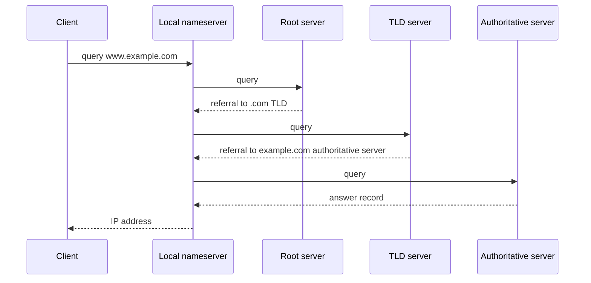

# 应用层

对应课件：`L16` `L17`

## 1. 应用层做什么

应用层是用户最直接接触到的一层，但考试往往考的不是界面，而是协议行为。

这里最重要的三组概念是：

- [[概念/DNS、HTTP 与 HTTPS#DNS Domain Name System]]
- [[概念/DNS、HTTP 与 HTTPS#HTTP HyperText Transfer Protocol]]
- [[概念/DNS、HTTP 与 HTTPS#HTTPS]]

## 2. 中英对照

| English | 中文 |
|---|---|
| Application Layer | 应用层 |
| Domain Name | 域名 |
| IP Address | IP 地址 |
| DNS Cache | DNS 缓存 |
| Request | 请求 |
| Response | 响应 |
| Web Page | 网页 |
| CDN | 内容分发网络 |

## 3. 从 URL 到网页

这是整门课最值得会讲的一条流程。

### Step 1: DNS

把域名解析成 IP。

详见 [[概念/DNS、HTTP 与 HTTPS#DNS Domain Name System]]。
``` text
Client
  |
  | 1. Query: www.example.com?
  v
Local name DNS Resolver 
  |
  | 2. Ask **root** server
  v
Root Server
  |
  | 3. Referral: ask .com **TLD** server
  v
TLD Server
  |
  | 4. Referral: ask example.com **authoritative** server
  v
Authoritative DNS Server
  |
  | 5. Answer: www.example.com = IP address
  v
Local DNS Resolver
  |
  | 6. Return IP address to local resolver saved into cache then pass to **client**
  v
Client
```
### Step 2: Transport Setup

使用 TCP 或 QUIC 建立传输通道。

详见 [[概念/TCP、UDP 与 QUIC]]。

### Step 3: HTTP Request

浏览器发请求，服务器回响应。

### Step 4: More Objects

如果页面引用图片、脚本、样式表，浏览器还会继续发更多请求。

## 4. DNS

DNS 的核心作用不是“连上网站”，而是：

**把 human-readable name 变成 network-usable address。**

它解决的是命名 `naming`，不是可靠传输。

### Nameserver Caching

- 减少重复查询
- 降低页面加载前置延迟
- 减轻上游 nameserver 压力

### Local Nameserver 查询流程

如果 local nameserver 没有缓存，它会替 client 继续查：



递归/迭代的区别：

- client 对 local nameserver 通常发 recursive query，希望它给最终答案。
- local nameserver 对 root/TLD/authoritative 常做 iterative queries，逐级拿 referral。
- local nameserver 会缓存最终答案，也可能缓存 partial answers，以降低后续延迟。

## 5. HTTP

HTTP 是典型的 request/response protocol。

它的高频考点：

- 为什么需要 persistent connection
- 为什么并行抓取更快
- HTTP/1.x、HTTP/2、HTTP/3 的方向性变化

### 方法、状态码与头部

详见 [[概念/DNS、HTTP 与 HTTPS#HTTP HyperText Transfer Protocol]]。

考试里这三类常一起出现：

- methods：客户端想做什么
- status codes：服务器结果是什么
- headers：内容、缓存、能力、上下文怎么描述

## 6. Caching 与 CDN

### Cache

- 减少重复获取
- 降低延迟

### CDN

- 把内容放到更靠近用户的位置
- 降低源站负载
- 提高访问速度

### Proxy / Caching / CDN 的差别

- 本地 cache：减少单个客户端重复获取
- proxy cache：为多个用户复用热点内容
- CDN：从网络位置上把内容移近用户

考试答题模板：

| 机制                  | 位置        | 主要收益                 |
| ------------------- | --------- | -------------------- |
| Browser/local cache | 用户设备      | 同一用户重复访问更快           |
| Proxy cache         | 用户群体和源站之间 | 多个用户共享缓存，减少外部流量      |
| CDN                 | 分布式边缘节点   | 把内容放近用户，减少 RTT 和源站压力 |
Local **caching** reduces repeated downloads for one client, **proxy** caching shares **cached** **content** among **multiple** nearby **users**, and a **CDN** improves performance by placing **replicated** **content** closer to users across the network.
proxy cache 和 CDN 都能缓存内容，但 CDN 更强调地理/网络拓扑上的靠近用户，常通过 DNS 返回不同边缘节点地址。

## 7. Dynamic vs Static

| 类型 | 含义 |
|---|---|
| Static Page | 资源内容接近文件原样 |
| Dynamic Page | 内容由程序运行生成 |

## 8. 与底层的联系

应用层不能脱离其他层单独存在：

- 名字转地址：[[概念/DNS、HTTP 与 HTTPS#DNS Domain Name System]]
- 端到端传输：[[概念/TCP、UDP 与 QUIC]]
- 跨网络送达：[[04 网络层]]
- 本地交付：[[03 链路层]]

## 9. 页面加载性能视角

课程里常把页面加载时间看成多部分叠加：

- DNS 解析
- TCP/QUIC 握手
- HTTP 请求/响应 RTT
- 内容大小和带宽
- 是否缓存命中

因此性能问题不只属于应用层，也与传输层和网络条件强相关。

## 10. 易错点辨析

### 易错 1：DNS 返回网页内容

不对。

DNS 返回的是地址信息，不是页面本身。

### 易错 2：HTTP 自己解决安全问题

不对。

安全网页通常依赖 HTTPS，也就是 HTTP 叠加 TLS。

|**Authentication**|Client verifies the server **certificate** and public key|
|**Key exchange**|Client and server establish a **shared** **session** key|
|**Confidentiality**|Data is **encrypted** so eavesdroppers cannot read it|
|**Integrity**|Data **changes** can be detected|
|**Data transfer**|Application data is **encrypted** after the handshake|
### 易错 3：应用层离硬件远，所以和 switch/router 无关

不对。

应用消息最终仍要经过 switch、router、ARP、IP forwarding 才能到达远端。

### 易错 4：HTTP 性能只取决于服务器快不快

不对。

DNS、RTT、建连成本、缓存策略、并行连接都会显著影响页面加载时间。
