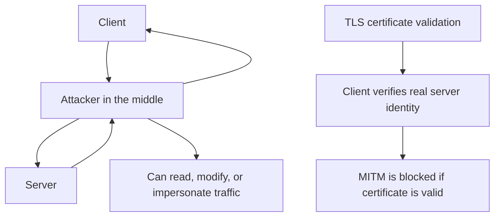

# 网络安全

对应课件：`L19` `L20`

## 1. 安全目标中英对照

| English | 中文 |
|---|---|
| Confidentiality | 保密性 |
| Integrity | 完整性 |
| Authentication | 认证性 |
| Freshness | 新鲜性 |
| Encryption | 加密 |
| Digital Signature | 数字签名 |
| MAC | 消息认证码 |
| Hash | 哈希 |

## 2. 安全目标

- 不让别人偷看 `confidentiality`   **Eavesdropping**
- 不让别人悄悄改内容 `integrity`  **Tampering**
- 确认对方身份 `authentication`  **Impersonation**
- 防止重放旧消息 `freshness`   **Replay attack**

## 2.1 Symmetric vs Asymmetric Encryption

| 维度             | Symmetric key encryption    | Asymmetric / public key encryption       |
| -------------- | --------------------------- | ---------------------------------------- |
| Key            | 双方共享同一个 secret key          | 每人有 public/private key pair              |
| 加密/解密          | 同一密钥用于加密和解密                 | public key 加密，private key 解密             |
| 速度             | 通常快，适合 bulk data            | 通常慢，适合小数据、认证、密钥交换                        |
| Key management | 难点是如何安全分发 shared secret     | public key 可公开发布，但要验证它属于谁                |
| 典型用途           | TLS session data encryption | 证书、公钥认证、协商 session key、digital signature |

对称加密的主要弱点：双方必须先安全地拥有同一个 secret key。

公钥加密缓解这个问题：任何人都可以用 Bob 的 public key 加密，只有 Bob 的 private key 能解密。但新问题是：Alice 如何确认“这个 public key 真的是 Bob 的”？这就是 certificate / PKI 要解决的问题。

TLS 的实际组合：

1. 用 public key / certificate 认证服务器并协商 secret。
2. 生成 session key。
3. 后续大量应用数据用 symmetric encryption 加密，因为更快。

## 3. HTTPS

详见 [[概念/DNS、HTTP 与 HTTPS#HTTPS]]。

考试重点不是记历史，而是理解 HTTPS 要防什么：

- eavesdropping 窃听
- tampering 篡改
- impersonation 伪装服务器

## 4. SSL/TLS

TLS 的大致作用：

1. 认证服务器身份
2. 协商密钥
3. 建立安全信道
4. 保护后续应用数据
Authentication	**Client** verifies the server **certificate** and public key
Key exchange	    Client and server **establish** a **shared** session key
Confidentiality	    Data is **encrypted** so eavesdroppers cannot read it
Integrity	            Data **changes** can be **detected**
Data transfer	    Application data is **encrypted** after the handshake
### PKI 与证书链

浏览器或 OS 通常内置一组受信任 root public keys。

服务器证书需要能沿着可信链被验证，且未被吊销 `revoked`。
![[Pasted image 20260429230648.png]]
## 5. 证书

证书解决的问题不是“加密本身”，而是：

**客户端如何相信自己拿到的公钥真的是服务器的。**

PKI uses **certificate** **authorities** and **certificate** **chains** to prove that a **public** **key** belongs to the claimed **server** identity.
## 6. DNS Security、Spoofing、Firewalls、DDoS

### DNS Security

- 课程会提 `DNSSEC`
- 重点是理解名称解析结果的可信性
- 课件里给出的关键记录类型包括：
  - `RRSIG`：records 的数字签名
  - `DNSKEY`：用于验证的公钥
  - `DS`：delegation 的公钥信息
  
- DNSSEC protects DNS **integrity** and **authenticity**.
- It helps prevent **DNS spoofing/cache poisoning**.
- It does not provide **confidentiality** because DNSSEC does not encrypt DNS queries or answers.
- HTTPS/TLS is still needed to protect the later web connection.
### Spoofing

- 指攻击者伪装成其他实体
- 这是认证机制存在的直接背景

### DNS Spoofing

课件里明确讨论了：

- 攻击者可诱使 nameserver 缓存错误 binding
- 伪造响应时要伪装成 authoritative nameserver
- 还要匹配 query ID 和 outstanding query
- 若伪造回复先被接受，真实回复之后会被丢弃

### Firewalls

- 用规则控制哪些流量被允许
- 在 IPv6 语境下尤其要理解：安全应由策略控制，而不是把 NAT 误当作安全机制本身

### DDoS

- `Distributed Denial of Service`
- 大量流量或请求耗尽目标资源
- 攻击的是可用性 **availability**

### Public Key Authentication

课件里对 SSL/TLS 认证流程的主线是：

1. client 发起连接请求
2. server 选定算法
3. server 发 certificate 和 public key
4. client 验证 certificate
5. client 生成 session key，并用 server 的 verified public key 加密发送
6. 双方切换到协商好的 cipher

## 7. VLAN、SMTP、IPS、MITM

这几个词里，`MITM`、`spoofing`、防火墙深度检查与 `L19/L20 Network Security` 直接相关；
`VLAN` 与 `SMTP` 更像是需要放回整门课上下文里理解的“安全相关概念”。

### VLAN

`VLAN = Virtual Local Area Network`

核心理解：

- 用逻辑方式把一组主机划进同一个二层广播域
- 即使它们物理上接在同一台 switch，也可以被隔离
- 不同 VLAN 之间通常不能直接二层互通，要靠 router 或三层交换机

从安全角度看：

- VLAN 常用于 `segmentation` 分段隔离
- 例如把学生网、员工网、服务器网分开
- 这样即使某一段被攻破，攻击者也不一定能直接横向移动到全部主机

易错点：

- VLAN 不是加密机制
- VLAN 主要解决的是隔离和管理，不是机密性本身
- 如果跨 VLAN 路由策略很宽松，隔离效果也会被削弱

### SMTP

`SMTP = Simple Mail Transfer Protocol`

核心作用：

- 用于发送邮件
- 常见语境是 mail client 把邮件交给 mail server，或 mail server 之间转发邮件

从安全角度看，SMTP 本身引出几个高频问题：

- 发件人地址容易被 `spoof`
- 明文传输会暴露邮件内容和凭据
- 邮件系统常被用于垃圾邮件、钓鱼 `phishing`、恶意链接传播

因此实际系统通常会叠加：

- `STARTTLS` / TLS：保护传输链路
- SPF / DKIM / DMARC：增强发件域名可信性

和本章关系：

- SMTP 说明“应用层协议本身并不天然安全”
- 它和 HTTPS 一样，往往需要额外安全机制来补认证与保密

### IPS

`IPS = Intrusion Prevention System`

和 `IDS` 的区别要分清：

- `IDS` 偏检测，发现异常后报警
- `IPS` 偏阻断，发现可疑流量后会主动丢弃、重置连接或封锁规则
An **Intrusion Prevention System (IPS)** is a network security system that monitors traffic for suspicious or malicious activity and actively blocks or prevents attacks. Unlike an **IDS**, which mainly detects and reports intrusions, an **IPS** can take action such as dropping packets, blocking IP addresses, or resetting connections.

结合 `L20` 防火墙部分可以这样理解：

- stateless firewall：只按静态规则看单个 packet
- stateful firewall：会跟踪连接状态
- 更高级的设备会“看得更深”，甚至重组应用层消息做检查
- IPS 通常就工作在这种更主动、更深入的防护位置

所以 IPS 的本质不是“看见攻击”，而是：

**在流量通过时尝试阻止攻击继续发生。**

### MITM

`MITM = Man-In-The-Middle attack`，中间人攻击。

核心模式：

1. 攻击者插到通信双方中间
2. 双方都以为自己在和合法对端通信
3. 攻击者可转发、窃听、篡改，甚至替换内容

`L20` 里和 MITM 最接近的主线是各种 `spoofing`：

- `DNS spoofing`：把名字解析到错误地址
- `IP spoofing`：伪造源 IP
- “Trudy spoofs Alice to Bob” 这类场景：伪装身份，让接收方误信来源

MITM 能造成的典型后果：

- 破坏 `confidentiality`：窃听内容
- 破坏 `integrity`：悄悄改消息
- 破坏 `authentication`：让一方误信攻击者身份

HTTPS / TLS 要防的正是这种攻击：

- 没有证书验证时，攻击者可以冒充服务器
- 有了受信证书链和正确验证后，MITM 就更难成功

## 8. 与课程其他部分的联系

- 安全网页运行在 [[概念/DNS、HTTP 与 HTTPS#HTTP HyperText Transfer Protocol]] 语义之上
- 通过 [[概念/TCP、UDP 与 QUIC#TCP Transmission Control Protocol]] 传输
- 最终仍然要走 [[04 网络层]] 和 [[03 链路层]]

## 9. 易错点辨析

### 易错 1：加密就等于认证

不对。

“别人看不懂”不等于“对方身份可信”。

### 易错 2：HTTPS 只适用于网页

不完全对。

TLS 思想可以被很多应用使用，只是网页场景最常见。

### 易错 3：DNSSEC 和 HTTPS 作用相同

不对。

- DNSSEC 保护名字解析可信性
- HTTPS 保护应用数据传输安全

### 易错 4：有了证书就等于已经完成加密通信

不对。

证书先解决“公钥是否可信”，之后还需要用它去建立后续安全会话。

### 易错 5：VLAN 等于安全

不对。

VLAN 只能提供分段隔离，不等于加密、认证或完整访问控制。

### 易错 6：SMTP 天然安全

不对。

SMTP 原始设计并不强调强安全，现实里通常要再叠加 TLS 和发件域验证机制。

### 易错 7：IDS 和 IPS 是一回事

不对。

- IDS 更偏“发现并报警”
- IPS 更偏“发现并阻止”

### 易错 8：MITM 只能读取，不能修改

不对。

真正危险之处就在于攻击者往往还能转发、替换、篡改消息。
