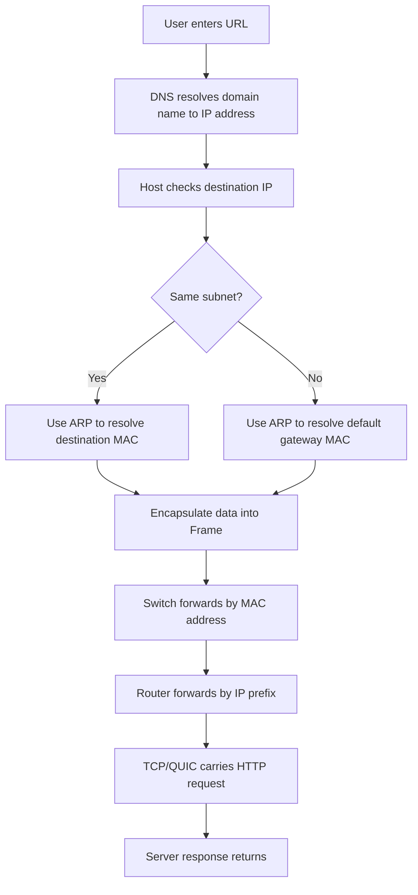

# 概念关系图

这页的目标不是替代细节，而是让你先看清“同一个概念在不同章节扮演什么角色”。

## 1. 从点击网页到收到页面

## 2. 同一概念跨章节位置

| 概念 | 在哪一层最核心 | 在别的章节里怎么出现 |
|---|---|---|
| [[概念/IP 与 MAC 地址#IP 地址 IP Address]] | 网络层 | 在 [[概念/ARP]] 中与 MAC 建立映射；在 [[概念/Router 与 Switch]] 中被 router 用于转发 |
| [[概念/IP 与 MAC 地址#MAC 地址 MAC Address]] | 链路层 | 在 [[概念/ARP]] 中被查询；在 [[概念/Router 与 Switch#Switch 交换机]] 中被 switch 学习和转发 |
| [[概念/ARP]] | 链路层 / 网络层边界 | 把网络层的 IP 目标落到链路层的 MAC 交付 |
| [[概念/DHCP]] | 应用层协议，服务网络配置 | 给主机提供 IP、mask、gateway、DNS，间接影响 ARP、routing、DNS |
| [[概念/Router 与 Switch#Router 路由器]] | 网络层 | 使用 IP、prefix、forwarding table；常与 NAT、DHCP 一起出题 |
| [[概念/Router 与 Switch#Switch 交换机]] | 链路层 | 使用 MAC address，常和 ARP、Ethernet、backward learning 一起考 |
| [[概念/TCP、UDP 与 QUIC#TCP Transmission Control Protocol]] | 传输层 | 为 [[概念/DNS、HTTP 与 HTTPS#HTTP HyperText Transfer Protocol]] 和 HTTPS 提供可靠传输 |
| [[概念/DNS、HTTP 与 HTTPS#DNS Domain Name System]] | 应用层 | 先于 HTTP 发生，是“访问网页”流程的入口 |

## 3. 一条典型考试主线

可以把一整门课压缩成下面这条链：

`Application message -> Transport segment -> IP packet -> Link frame -> Physical signal`

对应分层卡片：

- [[概念/OSI 与 TCP-IP 分层]]
- [[概念/TCP、UDP 与 QUIC]]
- [[概念/IP 与 MAC 地址]]
- [[03 链路层]]
- [[02 物理层]]

## 4. 最容易混淆的点

- `ARP` 不是 routing protocol，它不决定远程路径，只解决本地二层交付。
- `Switch` 不看 IP 前缀做转发，主要看 MAC。
- `Router` 不靠 MAC 决定跨网路径，主要看 IP 和 prefix。
- `DHCP` 给你 IP，不给你“目的地的 MAC”；MAC 仍然要靠 ARP 解析。
- `DNS` 解析的是名字到 IP，不负责建立 TCP 连接。

