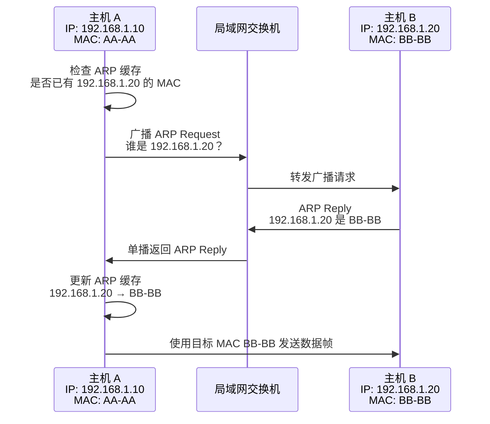
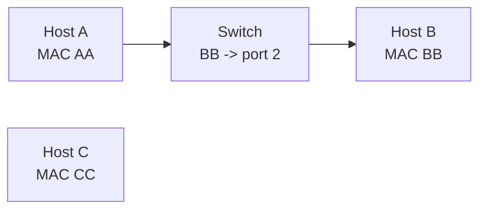
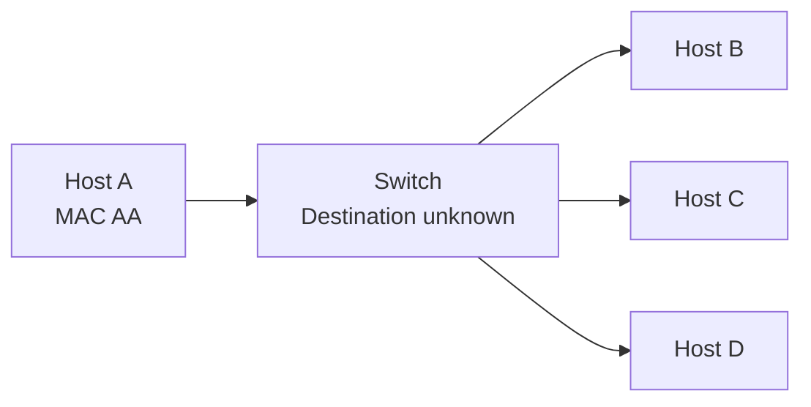
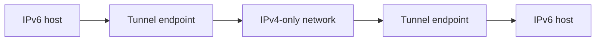

这页按 Final exam 的长题题型整理。先背模板，再回到章节笔记补概念。

## 1. Internet Checksum

步骤：

1. 把数据写成 16-bit words。
2. 用 one's complement arithmetic 相加。
3. 每次超过 `FFFF`，把 carry 回卷加到低 16 位。
4. 得到 sum 后按位取反。

例题：

```text
0001 + f4a2 = f4a3
f4a3 + c3d2 = 1b875 -> b876
b876 + a2a4 = 15b1a -> 5b1b
5b1b + f8d6 = 153f1 -> 53f2

checksum = ~53f2 = ac0d
```

常见结果：

| Words | Checksum |
|---|---:|
| `0001 f4a2 c3d2 a2a4 f8d6` | `AC0D` |
| `A9BC 45FE A9C5 53DF` | `12A0` |
| `4500 003C 1234 5678 9ABC` | `B75A` |

## 2. CRC

步骤：

1. 用 generator 对 received bit string 做 modulo-2 division。
2. 减法就是 XOR，不借位。
3. 每次当前最高位是 `1` 才 XOR generator。
4. 最后剩下 `generator length - 1` bits 是 remainder。

例题：

```text
received  = 11010110110010
generator = 10011
remainder = 1100
```

remainder 非 0，所以 likely error。

## 3. Hamming Distance

步骤：

1. 对每一对 codewords 数不同 bit 的个数。
2. 取所有 pairwise distances 的最小值作为 code space 的 Hamming Distance。
3. `HD = d + 1` 可检测 `d` 位错误。
4. `HD = 2d + 1` 可纠正 `d` 位错误。

例题：

```text
01010010
10001011
11110011
00000000
```

最小 `HD = 3`，所以可检测 `2` 位，可纠正 `1` 位。

## 4. Hamming Code Decode

7-bit Hamming Code 常用位置：

```text
positions: 1 2 3 4 5 6 7
check:     p p d p d d d
```

覆盖规则：

- `p1`: positions `1,3,5,7`
- `p2`: positions `2,3,6,7`
- `p4`: positions `4,5,6,7`

解码：

1. 重新计算各 parity group 的 XOR。
2. 组合成 syndrome。
3. syndrome 非 0 时，其值就是错误 bit 位置。
4. 翻转该 bit。
5. 抽出 positions `3,5,6,7`。

例题：

```text
received = 1010010 1110110

1010010 -> syndrome 4 -> flip bit 4 -> 1011010 -> data 1010
1110110 -> syndrome 3 -> flip bit 3 -> 1100110 -> data 0110

original data = 1010 0110
```

## 5. Delay / Latency

公式：

```text
Transmission delay = message size / bandwidth
Propagation delay  = distance / propagation speed
Latency            = transmission delay + propagation delay
BDP                = bandwidth * RTT
```

单位：

- `1 byte = 8 bits`
- `1 Mbps = 10^6 bits/s`
- `1 km = 1000 m`
- `1 s = 1000 ms`

BDP：

- `BDP = Bandwidth-Delay Product`
- 含义：链路在一个 RTT 内最多能“装下”多少数据，也就是最大 in-flight data
- 常用于判断 sliding window / TCP window 至少要多大，才能把链路跑满
- 如果 RTT 没给，但题目只给单程 propagation delay，可用 `RTT = 2 * one-way propagation delay`
- 单位通常先算成 `bits`，再除以 `8` 转成 `bytes`

```text
BDP(bits)  = bandwidth(bits/s) * RTT(s)
BDP(bytes) = BDP(bits) / 8
```

例题：

```text
1500 bytes, 10 Mbps, 3000 km, 2*10^8 m/s

Transmission = 1500*8 / 10^7 = 0.0012s = 1.2ms
Propagation  = 3000*1000 / (2*10^8) = 0.015s = 15ms
Latency      = 16.2ms
```

BDP 例题：

```text
Bandwidth = 100 Mbps
RTT       = 50 ms = 0.05 s

BDP(bits)  = 100 * 10^6 * 0.05 = 5,000,000 bits
BDP(bytes) = 5,000,000 / 8 = 625,000 bytes
           ≈ 625 KB
```

考试写法：

```text
The bandwidth-delay product is the amount of data that can be in transit on the link.
To fully utilise the link, the sender window should be at least the BDP.
```

## 6. Subnet / Prefix

公式：

```text
total addresses = 2^(32-prefix length)
usable hosts    = total addresses - 2
```

高频结果：

| Query | Answer |
|---|---|
| `/24` total addresses | `256` |
| `/24` usable hosts | `254` |
| `/16` mask | `255.255.0.0` |
| `/27` total / usable | `32 / 30` |

`192.162.0.0/12`：

```text
mask = 255.240.0.0
162 & 240 = 160
range = 192.160.0.0 - 192.175.255.255
```

## 7. Longest Prefix Match

步骤：

1. 找出所有匹配 destination IP 的 prefixes。
2. 选 prefix length 最大的项。
3. 如果没有具体匹配，使用 default route `0.0.0.0/0`。

例：

| Destination    | Next Hop                     |
| -------------- | ---------------------------- |
| `192.168.1.45` | `192.168.1.0/24` 对应 next hop |
| `8.8.8.8`      | default route                |

## 8. NAT Table

出站：

```text
internal source IP:port -> external source IP:port
destination unchanged
```

入站回包：

```text
external destination IP:port -> internal destination IP:port
source unchanged
```

例：

```text
table: 
192.168.1.15:8080 <-> 203.0.113.5:62001

outgoing after NAT:
203.0.113.5:62001 -> 198.51.100.20:80

incoming after NAT:
198.51.100.20:80 -> 192.168.1.15:8080
```

## 9. Per-hop IP / MAC / Port

规则：

- Source/Destination Port 端到端不变，除非 NAT。
- Source/Destination IP 端到端不变，除非 NAT。
- Source/Destination MAC 每一跳变化。
- destination MAC 永远是当前链路的下一跳 MAC。

答题表格可这样填：

| Link                  | Source Port | Dest Port | Source IP | Dest IP   | Source MAC          | Dest MAC            |
| --------------------- | ----------- | --------- | --------- | --------- | ------------------- | ------------------- |
| host -> gateway       | client port | `80`      | client IP | server IP | client MAC          | gateway MAC         |
| router -> router      | same        | same      | same      | same      | outgoing router MAC | next-hop router MAC |
| last router -> server | same        | same      | same      | same      | router MAC          | server MAC          |

### IP Addresses and MAC Addresses 简答题模板

题目常见问法：

`Describe the purpose of IP addresses and MAC addresses in computer networks.`

可直接背的答案：


IP addresses and MAC addresses are both used to identify devices in computer networks, but they work at different layers and have different purposes.

An **IP** address is a **logical** address used at the **network** layer. Its purpose is to identify a device's location in an IP network and allow packets to be routed across different networks. **Routers** use **destination IP** addresses and **forwarding tables** to decide the **next hop** for a packet. For example, when a host sends data to a **remote server**, the destination IP address tells the network **where** the packet should ultimately go.

A **MAC** address is a **physical** or **link-layer** address assigned to a network interface card. Its purpose is to deliver frames within the **local** **network** or local link. **Switches** use MAC addresses to forward Ethernet **frames** to the correct **port** inside a LAN.

The key difference is that the IP address is used for **end-to-end** delivery across networks, while the MAC address is used for **hop-by-hop** delivery on the local link. As a packet travels through routers, the source and destination **IP** addresses usually stay the **same**, but the source and destination **MAC** addresses **change** at each hop.

So IP addresses answer "where is the final destination?", while MAC addresses answer "who should receive this frame on the current local link?"


图示：

```text
Host A -> Router -> Server B

End-to-end packet:
Source IP      = Host A
Destination IP = Server B

First local link:
Source MAC      = Host A MAC
Destination MAC = **Router** MAC

Final local link:
Source MAC      = **Router** MAC
Destination MAC = Server B MAC
```

评分关键词：

- IP address = **logical** address
- IP works at network layer
- routers use **IP addresses / prefixes / forwarding tables**
- MAC address = physical / link-layer address
- switches use MAC addresses inside LANs
- IP is end-to-end, MAC is hop-by-hop
- MAC changes at each hop, IP usually stays the same unless NAT

### ARP 简答题模板

题目常见问法：

`Explain the purpose and operation of ARP. Provide a step-by-step explanation of ARP resolution.`



ARP is used to **map** an IP address to a MAC address on the local network. **IP** is used for **network-layer** addressing, but **Ethernet** needs a **MAC** **address** to send a frame on the local link.

The sender first checks its **ARP cache**. If no entry exists, it **broadcasts an ARP Request** asking "Who has this IP?" The **device** with that IP replies with its **MAC address**. The sender stores the **IP-to-MAC** **mapping** in its **ARP cache** and then sends the Ethernet **frame** to that MAC address.

If the destination is on **remote** network, the host uses **ARP** to find the **default gateway's MAC** address, not the remote host's MAC address.


步骤版：

1. Check ARP **cache**.
2. **Broadcast** ARP Request if no entry exists.
3. Target device sends ARP **Reply** with MAC **address**.
4. Sender caches the **mapping**.
5. Sender sends **frame** to resolved MAC address.

一句话：

```text
IP tells where the packet should go; ARP finds the next-hop MAC for the local frame.
```

## 10. Switch Backward Learning

步骤：

1. 初始 MAC table 为空。
2. switch 从 **incoming** frame 的 **source** MAC 学习。
3. 记录 **mapping**`source MAC -> incoming port`。
4. destination MAC **已知**则定向转发。
5. destination MAC **未知**则 flood。
6. 多个 switch 时，每台 switch 分别维护自己的 MAC table。

一句话：switch 看 source MAC 学习，按 destination MAC 转发。

### Ethernet Switching 简答题模板

题目常见问法：

Describe the **operation** of Ethernet switching in LANs. Explain frame forwarding and switching table learning. Use diagrams.

可直接背的答案：


**Ethernet switching** is used inside a **LAN** to forward **frames** based on **MAC addresses**. A **switch** works at the **data link layer**. It learns **host** locations by recording the **source MAC address** of **incoming** frames in a **switching/MAC table**.

When a **frame** arrives, the switch checks the **destination MAC address**:

- If known, it forwards the frame only to the correct port.
- If unknown, it **floods** the **frame** to all ports except the incoming one.

This is more efficient than a **hub**, because a hub sends every frame to all ports, while a switch usually sends frames only where needed.

图 2：backward learning

```text
Incoming frame on port 1:
**Source** MAC      = AA
Destination MAC = BB

Switch learns:
AA -> port 1
```

图 3：destination known，定向转发

```text
Switching table:
AA -> port 1
BB -> port 2
CC -> port 3

Destination MAC = BB
Action: forward only to port 2
```



图 4：destination unknown，**flood**



评分关键词：

- data link layer
- Ethernet frame
- source MAC learning
- MAC address table / switching table
- destination MAC lookup
- known destination: forward to one port
- unknown destination: flood except incoming port
- reply frame lets switch learn more entries
- more efficient than hub

## 10A. Hub / Switch / Router

简答模板：

`A hub, a switch, and a router have different roles in networking.`

`A hub` is a simple **physical** **layer** device. It does not **examine** **addresses** or make **forwarding** **decisions**. When it receives a signal, it repeats/floods it to all **connected** **ports**.  is inefficient because all devices receive the traffic.

A switch operates mainly at the **data link layer**. It forwards Ethernet frames using **MAC addresses**. Through **backward learning**, it learns which MAC address is reachable on which port, and then **forwards** frames only to the correct port when possible. This makes LAN communication more efficient than a hub.

`A router` operates at the **network** layer. It connects **different** **networks** and forwards **packets** using **IP addresses** and a **routing table**. A router **decides** the next **hop** for packets traveling between networks, while switches mainly handle communication inside a local network.

图示：

```text
Hub
PC1 ----\
PC2 ----- Hub ----- all traffic sent to all ports
PC3 ----/
```

```text
Switch
PC1 ----\
PC2 ----- Switch ----- forwards frame to correct port using MAC table
PC3 ----/
```

```text
Router
LAN 1 ---- Router ---- LAN 2 / Internet
           forwards packets between networks using IP routing
```

总结句：

`In summary, a hub repeats signals to all ports, a switch forwards frames within a LAN using MAC addresses, and a router forwards packets between different networks using IP addresses.`

## 11. ARQ Stop-and-Wait

Frame lost：

```text
Sender sends frame
Frame lost
Sender timeout
Sender retransmits
Receiver ACKs
```

ACK lost：

```text
Receiver got frame and sent ACK
ACK lost
Sender timeout
Sender retransmits same frame
Receiver uses sequence number to detect duplicate
```

Late ACK：

```text
ACK arrives after timeout
Sender may already retransmit
Sequence numbers prevent wrong ACK / duplicate delivery confusion
```

完整简答模板：

`Stop-and-wait ARQ` is a reliability mechanism in which the **sender** transmits one **frame** and then waits for an **acknowledgement** before sending the next frame. If the acknowledgement is received in time, the sender proceeds with the **next** **frame**. If **no** acknowledgement is received before the **timeout** expires, the sender **retransmits** the frame.

ARQ is related to `error detection`, not direct `error correction`. It assumes that errors can be **detected**, for example by a **checksum** or CRC. When a frame is lost, damaged, or its ACK is lost or delayed, ARQ does **not repair** the frame itself. Instead, it uses retransmission to recover from the error.

In the case of a **late** ACK, the receiver may **receive** the frame correctly and send an **ACK**, but the ACK arrives after the sender’s **timeout**. The sender then assumes the **ACK** was **lost** and **retransmits** the same frame. **Sequence** numbers are used so that the receiver can recognise the **retransmitted** frame as a duplicate and avoid delivering the same data twice.

图：

```text
Sender                                  Receiver
  |                                         |
  |---- Frame 0 --------------------------->|
  |                                         |
  |<........... ACK 0 delayed ..............|
  |                                         |
  |---- timeout --------------------------->|
  |---- retransmit Frame 0 ---------------->|
  |                                         |
  |             duplicate detected          |
  |<---- ACK 0 -----------------------------|
  |                                         |
  |---- Frame 1 --------------------------->|
```

总结句：

In summary, stop-and-wait ARQ sends one frame at a time, relies on **error** **detection** to identify problems, and uses **retransmission** rather than direct correction. A late ACK causes an unnecessary retransmission, but sequence numbers prevent incorrect duplicate delivery.

## 12. DNS Resolution

流程：

1. client asks local **nameserver**。
2. local nameserver checks **cache**。
3. if miss, ask **root server**。
4. root returns TLD **referral**。
5. ask **TLD serve**r。
6. TLD returns **authoritative** **referral**。
7. ask **authoritative server**。
8. authoritative returns record。
9. local nameserver caches and returns answer to client。

关键词：

- recursive query：client 希望 local nameserver 给最终答案。
- iterative query：server 返回 referral，让查询者继续问下一层。

## [[[13. Wireless Hidden / Exposed Node]]]

Hidden node：

- A 和 C 彼此听不到。
- A 和 C 同时发给 B，会在 B 处 collision。
- 缓解：RTS/CTS。
**Hidden terminal problem:** Two wireless **stations** cannot hear each other, but both can **communicate** with the same access **point**. If they **transmit** at the same time, a **collision** may occur at the receiver.

**RTS/CTS solution:** Before sending data, the **sender** sends an **RTS** frame. The **receiver** replies with **CTS**. Other stations that hear the CTS **defer transmission** for the reserved time, which helps prevent collisions caused by hidden nodes.

Exposed node：

- C 听到 B 在发，就误以为自己不能发。
- 但 C->D 可能不会干扰 B->A。
- 结果是本可并行发送却被迫沉默，降低吞吐。

C hears B transmitting and incorrectly assumes it must stay silent.  
> However, C’s transmission to D would not interfere with B’s transmission to A.  
> As a result, communication that could happen in parallel is unnecessarily blocked, reducing throughput.
## 14. Symmetric vs Asymmetric Encryption

**Symmetric-key cryptography** uses the **same** **secret** key for encryption and decryption. It is **fast** and suitable for **large data**, but **key distribution is difficult** because both sides must share the secret securely.

**Asymmetric-key cryptography** uses a **public key** and a **private key**. The public key can be shared openly, so **key management is easier**, but it is **slower** and more computationally **expensive**.

In practice, systems like **TLS** use **asymmetric** cryptography to **establish** trust and **exchange** a **session** key, then use **symmetric** **cryptography** for data **transfer**.


| 维度                       | Symmetric                                              | Asymmetric                                                                                                                                                |
| ------------------------ | ------------------------------------------------------ | --------------------------------------------------------------------------------------------------------------------------------------------------------- |
| concepts                 | **same** secret key for both encryption and decryption | cryptography uses a pair of keys: a public key and a private key. The public key can be shared openly, while the private key is kept secret by its owner. |
| key                      | **shared** **secret**                                  | public/private pair                                                                                                                                       |
| speed                    | fast                                                   | slower                                                                                                                                                    |
| key management           | hard to **distribute** safely                          | public key can be published                                                                                                                               |
| weakness                 | shared key setup                                       | must **authenticate** public key                                                                                                                          |
| computational complexity | easy                                                   | complex                                                                                                                                                   |

TLS 组合：

1. asymmetric / certificate 认证服务器并协商 secret。
2. 生成 session key。
3. symmetric encryption 加密后续大量数据。

## 15. MTU / Fragmentation

重点：

- Ethernet MTU 常见约 `1500 bytes`。
- IPv4 router 可以 fragment，但代价高。
- IPv6 router 不 fragment，源端负责合适大小。
- Path MTU Discovery 用 ICMP/ICMPv6 反馈找到路径最小 MTU。
	**Path MTU Discovery** is a method used to find the smallest MTU along the path between sender and receiver. The sender sets the **DF (Don’t Fragment)** bit in **packets**. If a packet is too large for a link on the path, the **router** drops it and **sends** back an **ICMP “Fragmentation Needed”** message. The **sender** then reduces **the** **packet** size and tries again until it finds the **largest** size that can pass without fragmentation.
	
答题角度：
   Fragmentation adds **processing** **overhead** at **routers** and **reassembly** **overhead** at the **destination** host.
- performance：fragmentation 增加处理和重组开销。
- router load：IPv4 router fragmentation 会增加中间路由器工作。
- network design：现代网络更偏向让 source 使用 Path MTU Discovery。

## 16. IPv6 Tunnel / Narrow Waist / QAM

IPv6 tunnel：

- 把 IPv6 packet 封装在 IPv4 packet 内。
- 用来穿越 IPv4-only network。
- 对 IPv6 两端看起来像一条 link。

IPv4 / IPv6 地址例子：

```text
IPv4: 192.168.1.10
IPv6: 2001:db8:1:20::123
```

简答题模板：


IPv4 and IPv6 are **incompatible** because they use different **packet** **header** formats and different address sizes. IPv4 uses 32-bit addresses, while IPv6 uses 128-bit addresses. Therefore, an IPv4-only router cannot directly understand and forward an IPv6 packet.

**Tunnelling** is a transition technique that allows IPv6 traffic to **cross** an IPv4-only **part** of the Internet. At the **tunnel** entry point, the original IPv6 packet is **encapsulated** inside an outer IPv4 packet. The IPv4 network **forwards** the outer IPv4 **packet** between the tunnel **endpoints**. At the tunnel exit point, the outer IPv4 **header** is **removed** and the original IPv6 packet continues to the IPv6 destination.


图：



封装结构：

```text
Original:
[ IPv6 header | payload ]

In tunnel:
[ outer IPv4 header | inner IPv6 header | payload ]
```

一句话：

`Tunnels solve the compatibility problem by carrying IPv6 packets inside IPv4 packets, so intermediate IPv4 routers only need to forward the outer IPv4 packet.`

Narrow Waist：

- IP 是共同中间层。
- 上面支持多种 transport/application。
- 下面支持多种 link/physical 技术。

简答题模板：


The Narrow Waist of the Internet means that many different **applications** and **transport** protocols **above**, and many different link **technologies** below, all meet at one common protocol layer: IP.

It is called a narrow waist because the middle of the architecture is deliberately small and common. IP provides a simple **packet** **delivery** **service** across **heterogeneous** networks.

This design makes the Internet **flexible** and **scalable**. New applications can be built above IP, and new link or physical technologies can be added below IP, without changing the whole Internet architecture.

图：

```text
Applications: HTTP, DNS, email, streaming
Transport:    TCP, UDP, QUIC
              |
              IP
              |
Links:        Ethernet, Wi-Fi, fibre, cellular
Physical:     copper, radio, optical fibre
```

QAM：

```text
QAM-16 = log2(16) = 4 bits/symbol
QAM-64 = log2(64) = 6 bits/symbol
```

	bits/symbol 增加可以提高效率，但通常需要更高 SNR。

Increasing **bits** per symbol means each symbol carries more data, so the data rate or spectral efficiency can increase without increasing **symbol** **rate**.
However, higher-order QAM has **constellation** points closer together, so it is more sensitive to **noise** and **interference**. It usually requires a higher **SNR** to decode reliably.

## 17. VLAN Port Assignment

来源定位：`L20 Network Security` 提到 VLAN/security segmentation；Final 2223 Q1A 是按访问限制给 switch ports 分配 VLAN labels。

答题思路：

1. 先把允许互相通信的设备分组。
2. 同一组设备放同一个 VLAN label。
3. 不允许互通的设备放不同 VLAN。
4. 需要访问 Internet 的组，还要让该 VLAN 能到 router/default gateway。
5. VLAN 是二层隔离；不同 VLAN 默认不能直接二层通信，除非经过 router / layer-3 switch / firewall policy。

通用模板：

```text
VLANs create separate logical LANs on the same physical switch. Devices in the same VLAN can communicate at Layer 2 as if they are on the same LAN. Devices in different VLANs are isolated unless routing or firewall rules allow inter-VLAN communication.

To assign VLAN labels, group together only the ports whose hosts are allowed to communicate. Ports that must be isolated from each other should be placed in different VLANs. If a host group needs Internet access, its VLAN must also have access to the router/default gateway.
```

评分关键词：

- logical LAN
- same physical switch, separate **broadcast** domains
- segmentation / **isolation**
- same VLAN can communicate at Layer 2
- different VLANs need routing/firewall for communication
- assign labels from communication restrictions

## 18. Link-State Packet

来源定位：`L14 The Network Layer`，`The Role of Link State Packets`，Link-State approach。

简答模板：

The main purpose of LSP flooding is to let each router build a complete view of the network, run shortest-path computation, and then create a **forwarding table** for efficient packet forwarding.

A Link-State Packet is used by a **router** in a link-state routing **algorithm** to **describe** its local **view** **of** the network **topology**. It tells other routers which **neighbours** it is connected to and the **cost** of each link.

Each router **floods** its Link-State Packets through the network. After receiving LSPs from other routers, every **router** can build a **map** of the **network topology.** It then runs a **shortest** path algorithm, such as **Dijkstra**'s algorithm, to compute its own **forwarding** table.
```

可写字段：

- router ID
- neighbour routers
- link costs
- sequence number / age，避免使用旧信息

两阶段：

```text
1. Topology dissemination: routers flood LSPs.
2. Route computation: each router runs Dijkstra and builds its forwarding table.
```

## 19. Routing vs Forwarding

来源定位：`L11 the Network Layer`，`Routing V Forwarding`。

简答模板：

```text
Routing and forwarding are related but different network-layer processes.

Routing is the process of deciding the paths that packets should take through the network. It has a more global view and uses routing algorithms, such as link-state routing, to compute routes and build forwarding tables.

Forwarding is the local action performed by a router when a packet arrives. The router looks up the destination IP address in its forwarding table, usually using longest prefix match, and sends the packet to the correct next hop.

In short, routing builds the table; forwarding uses the table.
```

评分关键词：

- routing = path computation / global process
- forwarding = local per-packet action
- forwarding table
- destination IP
- next hop
- longest prefix match

## 20. Baseband vs Passband Modulation

来源定位：`L5 The Physical Layer`，`PASSBAND MODULATION`，carrier signal，QAM。

简答模板：

```text
Baseband transmission sends the digital signal directly over the medium using signal levels or transitions to represent bits. Examples include NRZ, NRZI, Manchester encoding, and 4B/5B. It is common when the medium can carry the baseband signal directly.

Passband modulation uses a carrier signal and modifies properties of that carrier to carry data. The carrier is an oscillating signal at a chosen frequency. The sender can vary amplitude, frequency, or phase. This is useful when baseband signals do not propagate well on a medium, such as wireless or some fibre/cable systems.

The key difference is that baseband directly represents bits as signal changes, while passband first places the information onto a carrier signal.
```

可画图说明：

```text
Carrier properties that can be modified:
Amplitude  -> signal height
Frequency  -> oscillations per second
Phase      -> horizontal shift of waveform
```

典型例子：

- baseband：Manchester, NRZI, 4B/5B
- passband：radio/wireless, QAM
- QAM varies amplitude and phase

## 21. Public Key Encryption Operation

来源定位：`L19 Network Security`，`PUBLIC KEY (ASYMMETRIC) ENCRYPTION`。

简答模板：

Public key encryption uses a pair of keys: a public key and a private key. The public key can be shared openly, while the private key is kept secret by its owner.

If Alice wants to send a confidential message to Bob, Alice encrypts the message using Bob's public key. Only Bob can decrypt it, because only Bob has the matching private key.

This helps with key distribution because Alice does not need to already share a secret key with Bob. However, Alice must be sure that the public key really belongs to Bob. This is why **certificates** and **PKI** are needed in systems such as HTTPS/TLS.


图示：

```text
Alice -- encrypt with Bob's public key --> ciphertext
ciphertext -----------------------------> Bob
Bob -- decrypt with Bob's private key --> plaintext
```

弱点：

- slower than symmetric encryption
- must authenticate public key
- often used to exchange a session key, then symmetric encryption handles bulk data

## 22. NAT Box in a Home Network

来源定位：`L13 The Network Layer`，`NAT is widely used at the edges of the network, e.g., homes`。

简答模板：

```text
A Network Address Translation box is commonly used at the edge of a home network. It allows multiple private devices in the home to share one public IPv4 address when communicating with the Internet.

Inside the home, devices use private IP addresses such as 192.168.x.x. When an internal host sends traffic to the Internet, the NAT box rewrites the source private IP address and port to its public IP address and a chosen external port. It stores this mapping in a NAT table.

When the reply comes back from the Internet, the NAT box uses the external port in the NAT table to find the correct internal host, then rewrites the destination address and port back to the private address and port.
```

图示：

```text
Home PC 192.168.1.10:5001
        |
        v
NAT box public IP 203.0.113.5:62000
        |
        v
Internet server
```

优点：

- saves public IPv4 addresses
- many home hosts behind one public IP
- often combined with firewall behaviour

缺点：

- breaks simple end-to-end connectivity
- external hosts cannot easily initiate connections to internal hosts

## 23. Full-duplex vs Half-duplex

来源定位：`L10 The Link Layer` mentions full-duplex switch ports；sample/2122 考 half-duplex。

简答模板：

```text
A half-duplex link allows communication in both directions, but not at the same time. Only one side can transmit at a time. A walkie-talkie is a typical example.

A full-duplex link allows communication in both directions at the same time. Modern switched Ethernet links are commonly full-duplex.

The main difference is simultaneous transmission: full-duplex supports it, half-duplex does not.
```

表格：

| Mode | Direction | Simultaneous? | Example |
|---|---|---|---|
| Half-duplex | both directions | no | walkie-talkie |
| Full-duplex | both directions | yes | switched Ethernet |

## 24. DNS Spoofing

来源定位：`L20 Network Security`，`DNS SPOOFING`，DNSSEC。

简答模板：


DNS spoofing is an attack where an attacker causes a DNS resolver or client to accept a false DNS response. The result is that a **==domain==** name is mapped to the wrong IP address, often one controlled by the attacker.

Without DNS security, DNS replies are not strongly **authenticated**. An attacker may send a fake DNS reply that appears to come from the correct authoritative name server. If the fake reply arrives before the real reply and matches expected fields such as the query, it may be accepted and cached.

This can redirect users to a **malicious** server even though they typed the correct domain name.
```

DNSSEC 如何帮助：

```text
DNSSEC adds digital signatures to DNS records. A resolver can verify the signature using DNS public keys and a chain of trust. This helps ensure that the DNS binding returned is authentic and has not been tampered with.
```

评分关键词：

- fake DNS response
- wrong domain-to-IP binding
- cache poisoning
- lack of authentication
- DNSSEC provides authenticity and integrity

## 25. TCP Three-Way Handshake

来源定位：`L15 The Transport Layer`，`THREE-WAY HANDSHAKE`。

简答模板：

```text
TCP uses a three-way handshake to establish a connection between an active opener, usually the client, and a passive opener, usually the server.

First, the client sends a SYN segment with an initial sequence number x. Second, the server replies with SYN+ACK, choosing its own initial sequence number y and acknowledging x+1. Third, the client sends ACK y+1 back to the server.

After these three steps, both sides know that the other side is reachable and both initial sequence numbers have been synchronized. The connection state is established and data transfer can begin.
```

图示：

```text
Client                              Server
  | -------- SYN, seq=x ----------> |
  | <--- SYN, seq=y, ACK=x+1 ------ |
  | -------- ACK=y+1 -------------> |
```

为什么需要：

- confirms bidirectional reachability
- synchronizes sequence numbers
- establishes TCP state
- robust against delayed duplicates

## 26. Flow Control

来源定位：`L15 The Transport Layer`，`FLOW CONTROL`。

简答模板：


Flow control prevents the sender from **overwhelming** the receiver. A receiver has **limited buffer** space. If the sender transmits too quickly, the receiver's buffer may fill and data may be dropped.

TCP flow control uses a **receive window** advertised by the receiver. The receiver tells the sender how much buffer space is available. The sender must keep the amount of **unacknowledged** data within this advertised window.

As the application reads data from the receive buffer, more buffer space becomes available, and the receiver can advertise a larger window. If the buffer is **full**, the receiver may advertise a zero or small window, causing the sender to slow down or stop temporarily.
```

图示：
Sender                              Receiver
  |-------- Data frames ----------->|
  |                                 |  Buffer begins to fill
  |<------- ACK / Window size ------|
  |                                 |  Buffer almost full
  |<--------- Pause / 0 window -----|
  |                                 |  Sender stops sending
  |                                 |  Buffer emptied
  |<------ Window open again -------|
  |-------- Data frames ----------->|
  与 congestion control 区别：

- flow control protects receiver buffer
- congestion control protects the network
```


## 27. Private Key Weakness / Public Key Solution

来源定位：`L19 Network Security`，`Symmetric encryption is problematic`，`Public Key Encryption`。

这里的 `private key encryption` 在旧题语境里通常指 symmetric/private shared key encryption。

简答模板：

```text
The main weakness of private key or symmetric encryption is key distribution. Alice and Bob must both have the same secret key before they can communicate securely. If the key is sent over an insecure channel, an attacker may learn it.

Public key encryption helps because Bob can publish a public key while keeping his private key secret. Alice can encrypt a message or a small session key using Bob's public key, and only Bob can decrypt it using his private key.

However, public key encryption also has weaknesses. It is computationally slower than symmetric encryption, and Alice must be sure that the public key really belongs to Bob. Certificates and PKI are used to authenticate public keys.
```

常见组合：

```text
Use public key encryption to exchange/authenticate a session key.
Use symmetric encryption for the large data transfer.
```

## 28. Codeword Count

来源定位：sample 2026 Q4；link-layer coding slides discuss data bits + check bits.

题型：

`Given a message size of 12 bits and a check bit size of 4 bits, how many distinct codewords can be formed?`

做法：

```text
Total codeword length = data bits + check bits = 12 + 4 = 16 bits
Number of possible codewords = 2^16 = 65536
```

注意：

- 如果题目问 possible bit strings/codewords of total length `n+k`，答案是 `2^(n+k)`。
- 如果题目问 valid messages from only data bits，才可能是 `2^n`。

## 29. Star Topology

来源定位：`L2 Network Basics` topology。

简答模板：

```text
In a star topology, devices are connected to a central hub or switch. Most traffic passes through this central device.

Advantages are that it is easy to add or remove nodes, and faults can often be isolated to one link. The main disadvantage is dependence on the central device: if the central hub or switch fails, the network can be seriously affected.
```

高频判断：

- all network traffic passes through a central hub/switch
- easy to add new nodes
- highly dependent on central hub/switch

不要选：

- closed loop = ring
- linear sequence / main cable = bus
- every device connected to every other device = mesh

## 30. FDM

来源定位：`L9 The Link Layer`，`Frequency Division Multiplexing (FDM)`。

简答模板：

```text
Frequency Division Multiplexing is a way for multiple users or signals to share the same physical medium by dividing the available bandwidth into separate frequency bands.

Each user gets a different frequency range and can transmit at the same time at a lower rate. Examples include radio and TV channels.
```

与 TDM 对比：

| Scheme | Sharing method |
|---|---|
| FDM | users share bandwidth by using different frequency bands |
| TDM | users share time by taking turns in time slots |

sample 选择题关键词：

```text
In FDM, users/devices share bandwidth.
```

## 31. DHCP Discover

来源定位：`L12 The Network Layer` DHCP addressing；sample 2026 Q13。

简答模板：

```text
DHCP is used to automatically configure a host with network settings such as an IP address, subnet mask, default gateway, and DNS server.

When a host first joins a network, it may not yet have an IPv4 address. Therefore, the source IPv4 address in a DHCP Discover message is 0.0.0.0. The message is usually broadcast so that a DHCP server on the local network can receive it.
```

DORA：

```text
Discover -> Offer -> Request -> Acknowledge
```

高频字段：

- source IPv4 address in DHCP Discover：`0.0.0.0`
- destination IPv4 address：broadcast, often `255.255.255.255`
- DHCP uses UDP
- server port `67`, client port `68`

## 32. ICMP

来源定位：`L12 The Network Layer`，`IP ERRORS - INTERNET CONTROL MESSAGE PROTOCOL (ICMP)`；`Networks_and_Internet_Sys_(Conv)_2324 (1).pdf` Question 3C。

题目常见问法：

`Describe the role of the Internet Control Message Protocol (ICMP). Provide examples of scenarios where ICMP messages are used.`

简答模板：

```text
ICMP, Internet Control Message Protocol, is a network-layer support protocol used for error reporting and diagnostic/control messages. It is not used to carry normal application data. Instead, it helps IP report problems that occur while packets are being forwarded.

When a router or destination host cannot process or forward an IP packet, it may send an ICMP message back to the source. The ICMP message tells the sender what went wrong, for example that the destination is unreachable, the packet is too large for the next link, or the packet's TTL has expired.
```

常见场景：

| Scenario | ICMP use |
|---|---|
| `ping` | Echo Request / Echo Reply tests reachability |
| `traceroute` | TTL expires at each router, causing ICMP Time Exceeded |
| Destination unreachable | router/host reports packet cannot be delivered |
| Path MTU Discovery | packet too large / fragmentation needed feedback |

考试补充句：

```text
ICMP is part of the network layer around IP. It helps the network report errors and provide diagnostics, but it is not itself a routing algorithm and it does not make unreliable IP reliable.
```

评分关键词：

- network-layer support protocol
- error reporting
- diagnostics / control messages
- sent back to source
- destination unreachable
- TTL exceeded / traceroute
- echo request/reply / ping
- fragmentation needed / Path MTU Discovery

## 33. Proxy Caching / CDN

来源定位：`L17 The Application Layer`，`WEB CACHING`、`WEB PROXIES`、`CONTENT DELIVERY NETWORKS`；`Networks_and_Internet_Sys_(Conv)_2324 (1).pdf` Question 3D。

题目常见问法：

`Explain the term proxy caching and list two benefits of adopting a proxy caching strategy. How is this different to a content distribution network?`

简答模板：

```text
Proxy caching means placing an intermediate proxy server between clients and external web servers. Clients send requests to the proxy. If the proxy already has a fresh cached copy of the requested object, it returns the object directly. If not, it fetches the object from the origin server, forwards it to the client, and may store a copy for future requests.

Two benefits are lower latency for clients and reduced traffic to the origin server or external network. Because many users can share the same proxy cache, repeated requests for popular objects can be served locally. A proxy can also provide security checking or enforce organisational access policies.

A CDN is different because it is a distributed network of replica servers placed across the Internet. A proxy cache usually serves one organisation, ISP, or local client group, while a CDN deliberately replicates popular content at many locations and uses mechanisms such as DNS mapping to send each client to a nearby replica.
```

对比表：

| Item      | Proxy cache                                                  | CDN                                                                   |
| --------- | ------------------------------------------------------------ | --------------------------------------------------------------------- |
| Location  | intermediary near a client group / organisation / ISP        | many replicas distributed across the Internet                         |
| Main idea | shared cache for clients using that proxy                    | large-scale content replication near users                            |
| Scope     | local or organisational                                      | global / provider-managed                                             |
| Benefits  | lower latency, less external traffic, security/policy checks | lower latency, reduced origin load, scalable popular content delivery |

评分关键词：

- intermediate proxy server
- cache hit returns local/fresh copy
- cache miss fetches from origin server
- lower latency
- reduced bandwidth / reduced server load
- shared cache
- security checking / access policy
- CDN = distributed replicas
- DNS can direct clients to a nearby CDN replica
