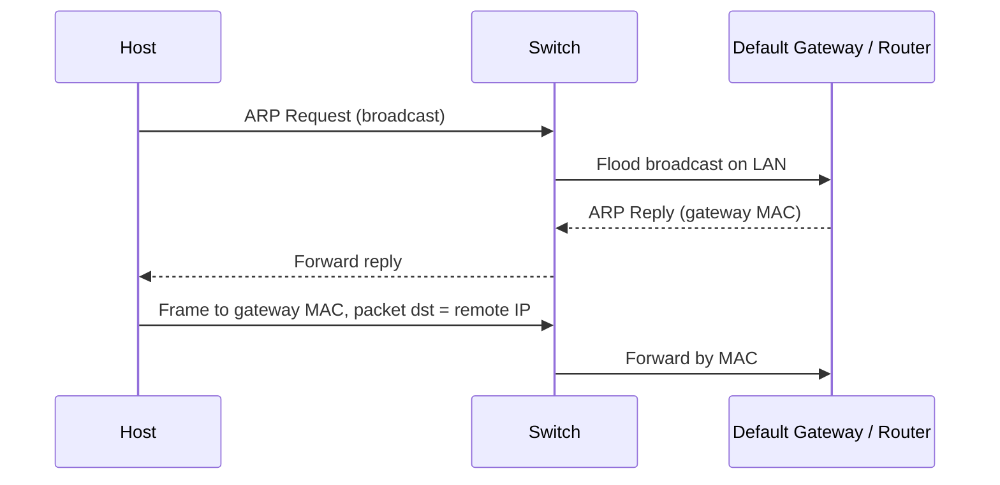

# ARP

## 1. ARP 是什么

`ARP = Address Resolution Protocol`

中文：地址解析协议

它解决的问题是：

**已知一个本地交付所需的目标 IP，如何找到应该发送给哪个 MAC 地址。**

## 2. ARP 为什么重要

ARP 是整门课最典型的“跨层联系点”之一。

它同时牵涉：

- [[概念/IP 与 MAC 地址#IP 地址 IP Address]]
- [[概念/IP 与 MAC 地址#MAC 地址 MAC Address]]
- [[概念/OSI 与 TCP-IP 分层]]
- [[概念/Router 与 Switch#Switch 交换机]]
- [[概念/Router 与 Switch#Router 路由器]]
- [[概念/DHCP]]

## 3. ARP 在哪一层

这是高频辨析点。

### 严格课程理解

- ARP 服务于 IP 的本地交付
- 但实际动作发生在本地链路环境

所以可以把它理解为：

**位于网络层与链路层边界的辅助协议。**

## 4. ARP 过程 ARP Process

### 场景 A：目标在本地子网

1. 主机知道目标 IP
2. 判断目标与自己是否同一 subnet
3. 若是，则广播 ARP Request：
   - “Who has this IP?”
4. 目标主机回复 ARP Reply：
   - “This IP is at this MAC.”
5. 发送方缓存映射并发送 frame

### 场景 B：目标不在本地子网

1. 主机知道远端目标 IP
2. 发现目标不在本地 subnet
3. 选择 default gateway
4. 广播 ARP Request 查询 default gateway 的 MAC
5. gateway 回复自己的 MAC
6. 主机把 frame 发给 gateway
7. router 再继续按 IP 转发

## 5. 图解

## 6. ARP 与 Switch、Router 的关系

### 与 Switch

- switch 看的是 frame 中的 MAC
- ARP 帮主机拿到正确的下一跳 MAC
- 没有 MAC，switch 无法完成本地二层正确交付

### 与 Router

- router 用 IP 决定跨网方向
- 但主机要先把 frame 交到 router 所在接口的 MAC
- 因此访问远端时，ARP 常常查的是 router / default gateway 的 MAC

## 7. ARP 与 DHCP 的关系

### DHCP 给什么

- IP 地址
- 子网掩码
- 默认网关
- DNS 服务器

### ARP 再补什么

- 当前下一跳对应的 MAC 地址

所以两者顺序常是：

`DHCP -> know IP/mask/gateway -> ARP -> know next-hop MAC`

## 8. ARP 与 OSI/TCP-IP 分层的关系

ARP 很适合拿来解释“层与层如何协作”：

- 应用层不关心 MAC
- 传输层也不关心 MAC
- 网络层知道目标 IP
- 链路层真正发送 frame 时需要 MAC
- ARP 正是把这两层接上

## 9. 高频易错点

### 易错 1：ARP 找的是远端网站服务器的 MAC

通常错。

跨网时先找的是默认网关的 MAC。

### 易错 2：ARP 决定 packet 的全球路径

错。

决定路径的是 routing / forwarding，不是 ARP。

### 易错 3：DHCP 已经返回了 DNS 和网关，所以不需要 ARP

错。

DHCP 给的是配置；真正发 frame 时仍需要 MAC 映射。

