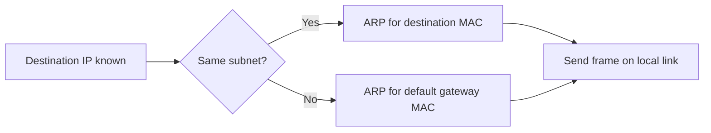

# IP 与 MAC 地址

## 1. 为什么这两个总被一起考

因为一个数据要真正发出去，通常同时需要：

- 网络层知道 `发往哪个 IP`
- 链路层知道 `当前这一跳发给哪个 MAC`

这就是 [[概念/ARP]] 的存在原因。

## 2. 中英对照

| English | 中文 |
|---|---|
| IP Address | IP 地址 / 逻辑地址 |
| MAC Address | MAC 地址 / 物理地址 / 链路层地址 |
| Prefix | 前缀 |
| Subnet | 子网 |
| Default Gateway | 默认网关 |

## 3. IP 地址 IP Address

### 定义

IP 地址是网络层使用的逻辑地址 `logical address`。

### 作用

- 标识主机在网络中的逻辑位置
- 支持跨网络路由
- 支持前缀聚合和 longest prefix match

### 相关章节

- [[04 网络层]]
- [[概念/Routing、Forwarding 与 Longest Prefix Match]]

## 4. MAC 地址 MAC Address

### 定义

MAC 地址是链路层在本地网络中识别接口的地址。

### 作用

- 用于本地二层交付
- 被 switch 学习和使用

### 相关章节

- [[03 链路层]]
- [[概念/Router 与 Switch#Switch 交换机]]

## 5. 一个最重要的区分

### IP 决定“最终目标在哪”

跨网络时，router 依据目标 IP 和 prefix 做 forwarding。

### MAC 决定“这一跳先发给谁”

当前局域网里，frame 必须先发到一个具体的 MAC。

## 6. 访问远端服务器时到底用谁

假设你要访问远端网站：

- 应用层知道域名
- DNS 解析出目标 IP
- 网络层发现目标不在本地子网
- 主机决定把 packet 交给默认网关()
- 然后通过 ARP 找默认网关的 MAC

所以：

**远端访问时，当前帧里最先重要的 MAC 往往是 default gateway 的 MAC，不是远端服务器的 MAC。**

## 7. 图解



## 8. 逐跳 IP / MAC / Port 题

这类题常问 HTTP GET 从 PC0 到 PC3，经过链路 A/B/C/D/E 时：

- Source Port
- Destination Port
- Source IP
- Destination IP
- Source MAC
- Destination MAC

核心规则：

| 字段               | 是否逐跳变化 | 原因                                   |
| ---------------- | ------ | ------------------------------------ |
| Source Port      | 通常不变   | transport endpoint 标识，除非 NAT 改写      |
| Destination Port | 通常不变   | HTTP server 常是 `80`                  |
| Source IP        | 通常不变   | end-to-end network address，除非 NAT 改写 |
| Destination IP   | 通常不变   | end-to-end network address           |
| Source MAC       | 每一跳变化  | 当前链路发送接口的 MAC                        |
| Destination MAC  | 每一跳变化  | 当前链路下一跳接口的 MAC                       |

模板：

```text
Link from host to default gateway:
src port = client port
dst port = 80
src IP   = client IP
dst IP   = server IP
src MAC  = client MAC
dst MAC  = gateway interface MAC

Link between routers:
src/dst port and IP unchanged
src MAC = outgoing router interface MAC
dst MAC = next-hop router interface MAC

Final LAN link:
src/dst port and IP unchanged
src MAC = last router interface MAC
dst MAC = destination host MAC
```

若经过 NAT，则 NAT 处之后的 source IP/source port 可能被改成 public IP/public port。

## 9. 易错点辨析

### 易错 1：有了目标 IP 就可以直接把 frame 发到远端主机

不对。

frame 只能在当前链路上传，仍需要当前这一跳的 MAC。

### 易错 2：MAC 比 IP 更“高级”

不对。

两者不是高低级关系，而是不同层次、不同作用。
