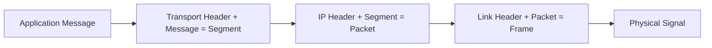

# OSI 与 TCP-IP 分层

## 1. 中英对照

| OSI | 中文 | TCP/IP 近似对应 |
|---|---|---|
| Application Layer | 应用层 | Application |
| Presentation Layer | 表示层 | 常并入 Application |
| Session Layer | 会话层 | 常并入 Application |
| Transport Layer | 传输层 | Transport |
| Network Layer | 网络层 | Internet / Network |
| Data Link Layer | 数据链路层 | Link |
| Physical Layer | 物理层 | Physical / part of Link in some models |

## 2. 本课程更常用的模型

课程更强调 Internet / TCP-IP 风格模型：

1. Application
2. Transport
3. Network
4. Link
5. Physical

## 3. 各层单位

| Layer | Unit |
|---|---|
| Application | Message |
| Transport | Segment |
| Network | Packet |
| Link | Frame |
| Physical | Bit / Signal |

## 4. 封装图

## 5. 与课程其他卡片的关系

- 网络层地址：[[概念/IP 与 MAC 地址]]
- 本地映射：[[概念/ARP]]
- 网络设备：[[概念/Router 与 Switch]]
- 传输服务：[[概念/TCP、UDP 与 QUIC]]
- 应用协议：[[概念/DNS、HTTP 与 HTTPS]]

## 6. 易错点辨析

- OSI 七层是参考模型，不等于互联网现实实现完全照搬。
- “层”是结构，“协议”是规则。
- 不同教材会把 physical 并入 link 或单独列出，考试时以课程模型为准。

