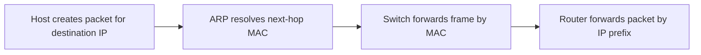

# Router 与 Switch

## 1. 为什么这两个总被一起问

因为它们都“转发数据”，但依据完全不同。

## 2. 中英对照

| English | 中文 | 主要看什么 | 核心层次 |
|---|---|---|---|
| Switch | 交换机 | MAC address | Link Layer |
| Router | 路由器 | IP address / prefix | Network Layer |

## 3. Switch 交换机

### 作用

- 在局域网内转发 frame
- 根据目标 MAC 决定输出端口

### 内部视角

- 交换机内部有 `fabric`
- 还会有输入缓冲 `input buffer` 和输出缓冲 `output buffer`
- 多个输入同时争用同一输出端口时需要缓存
- 持续过载会导致 buffer 填满，最终 frame loss

### 关键知识点

- backward learning
- MAC table
- full duplex (和 half-full duplex)
- buffering
- spanning tree

### 与 ARP 的关系

ARP 帮主机知道“发给哪个 MAC”；
switch 再依据这个 MAC 把 frame 送到正确端口。

详见 [[概念/ARP]]。

### Backward Learning 反向学习

[[交换机]]的典型学习逻辑：

1. 看进入 frame 的 `source MAC`
2. 记录“这个 MAC 出现在这个输入端口”
3. 若目标 MAC 已知，则定向转发
4. 若目标 MAC 未知，则 flood 到其他端口

所以 switch 是“看源地址学习，按目标地址转发”。

## 4. Router 路由器

### 作用

- 跨网络转发 packet
- 根据目标 IP 和 forwarding table 选择下一跳

### 关键知识点

- routing
- forwarding
- longest prefix match
- default route
- NAT
- IPv4 / IPv6
- MTU / fragmentation
- ICMP

详见 [[概念/Routing、Forwarding 与 Longest Prefix Match]]。

## 5. 一条常见路径里谁做什么

## 6. 高频比较

| 维度   | Switch  | Router      |
| ---- | ------- | ----------- |
| 主要层次 | 链路层     | 网络层         |
| 数据单位 | Frame   | Packet      |
| 关键地址 | MAC     | IP / Prefix |
| 常见角色 | 局域网内部转发 | 不同网络之间互连    |

### Hub / Bridge / Repeater / Modem 补充

| Device   | 典型层次               | 行为                                                     |
| -------- | ------------------ | ------------------------------------------------------ |
| Hub      | Physical / Link 边界 | 把收到的信号发到所有端口，不维护 MAC table                             |
| Repeater | Physical           | 再生或放大信号，延长物理距离                                         |
| Bridge   | Link               | 按 MAC 转发 frame；switch 可看成多端口 bridge                    |
| Switch   | Link               | 通过 backward learning 维护 MAC table                      |
| Router   | Network            | 查 forwarding table，按 IP prefix 选择 next hop             |
| Modem    | Physical           | modulation / demodulation，digital 与 analogue signal 转换 |

选择题关键词：

- `connect multiple networks together`：router
- `connect multiple devices within a LAN`：switch
- `broadcast to all connected devices`：hub
- `modulation and demodulation`：modem

### 多交换机 Backward Learning 答题模板

1. 所有 switch 初始 MAC table 为空。
2. frame 从某端口进入 switch 时，switch 记录 `source MAC -> incoming port`。
3. 若 `destination MAC` 已知，定向转发到对应端口。
4. 若 `destination MAC` 未知，除 incoming port 外 flood。
5. 多个 switch 时，每台 switch 都只根据自己看到的 incoming frame 独立学习。
6. 最终 MAC table 写成 `MAC address -> port/link`。

考试画图时，先沿 frame 传播路径标出每台 switch 学到的 source MAC，再判断下一次是否还需要 flood。

## 7. 易错点辨析

### 易错 1：Switch 和 router 都按 IP 决策

错。

课程里标准理解是：

- switch 主要按 MAC
- router 主要按 IP

### 易错 2：Router 不需要 MAC

不严谨。

router 在跨网决策时看 IP，但它的接口在本地链路上传帧时也离不开 MAC。

### 易错 3：ARP 只和 switch 有关，和 router 无关

错。

访问远端目标时，ARP 经常查的正是默认网关 router 的 MAC。

### 易错 4：Switch 一定不会广播

不对。

当目标 MAC 未知，或者 frame 本身就是广播时，switch 会 flood。

### 易错 5：Spanning Tree 是 router 的路由算法

不对。

Spanning Tree 主要是二层交换网络用来避免环路的机制。
