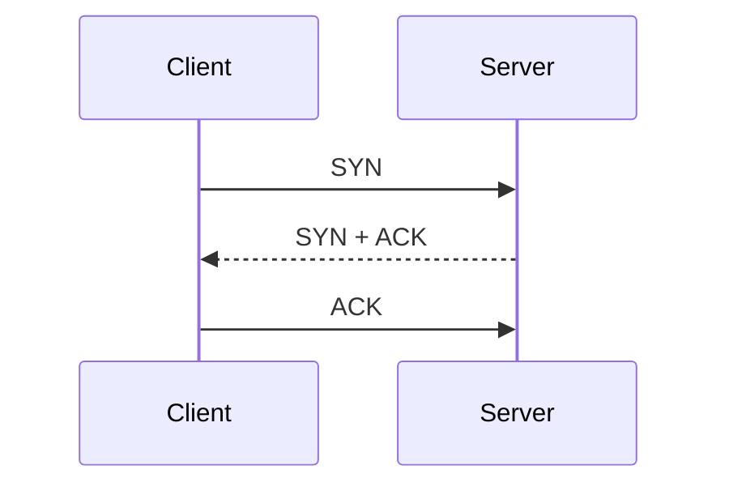

#COMP30650

## 1. TCP Transmission Control Protocol

### 特征

- 面向连接
- 可靠
- 有序
- 字节流

### 关键机制

- three-way handshake
- acknowledgement
- retransmission
- sliding window
- flow control
- sequence numbers
- connection release

### Three-Way Handshake



作用：

- 双方确认彼此可达
- 同步初始序号
- 建立连接状态

### Sequence Numbers

- 标识字节流中的位置
- 支撑可靠、有序交付
- 与 ACK、重传、窗口机制配合工作

### Sliding Window

- 允许多个 segment 同时在途
- 不必每发一个 segment 就停下来等 ACK
- 这是 TCP 提升效率的核心手段之一
![[Pasted image 20260427162355.png]]
### Flow Control

- 目标是让 sender 不要压垮 receiver
- 它关注接收端承载能力，不是全网拥塞本身
``` text

Receiver buffer size = 5000 bytes

Receiver says: **rwnd** = 5000
Sender may send up to 5000 bytes

Receiver buffer **fills**
Receiver says: rwnd = 2000
Sender must slow down

Receiver buffer **full**
Receiver says: rwnd = 0
Sender stops sending new data

Application **reads** data
Receiver says: rwnd = 3000
Sender resumes

```

### Connection Release

常见记忆法：

- `four-way close / 四次挥手`

要点是 TCP 连接是有状态的，所以关闭连接也需要双方交互同步。

## 2. UDP User Datagram Protocol

### 特征

- 无连接
- 消息导向
- 不保证可靠、有序、去重
- 头部简单、开销小

### 典型应用

- DNS
- DHCP
- VoIP

### 为什么有些应用会主动选 UDP

- 开销小
- 无需预先建连
- 应用可自己权衡时延、丢失和重排处理

## 3. QUIC

### 特征

- 运行在 UDP 之上
- 现代 Web 常见
- 常与 HTTP/3 一起出现

### 为什么课程会提 QUIC

它体现了现代网络协议设计的一个趋势：

- 应用性能优化与传输层能力正更紧密地结合

## 4. 高频对比表

| 协议 | Connection | Reliability | Ordering | Typical Use |
|---|---|---|---|---|
| TCP | Yes | Yes | Yes | Web, file transfer |
| UDP | No | No | No | DNS, VoIP, DHCP |
| QUIC | Built on UDP | Provides richer transport behavior | Modern web optimized | HTTP/3 |

### 端口与头部高频点

- HTTP server 常用 TCP port `80`
- HTTPS server 常用 TCP port `443`
- DNS query 通常由 UDP 承载，使用 port `53`
- TCP header 最小 `20 bytes`
- UDP header 是 `8 bytes`
- IPv4 header 的 `Protocol` 字段说明上层是 TCP、UDP、ICMP 等；端口不在 IPv4 header 里

## 5. 易错点辨析

- UDP 不是“错误协议”，只是服务更轻。
- TCP 的可靠性不等于应用语义自动正确。
- QUIC 不是简单地“UDP = QUIC”，它是在 UDP 上构建更多机制。
- 三次握手不只是“打招呼”，而是建立状态和同步序号。
- flow control 和 congestion control 不是同义词。
