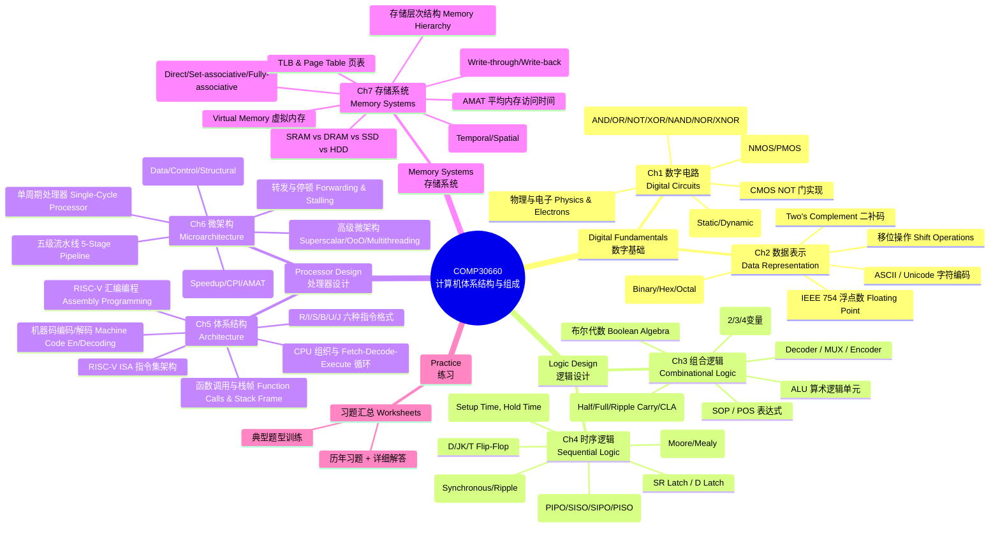
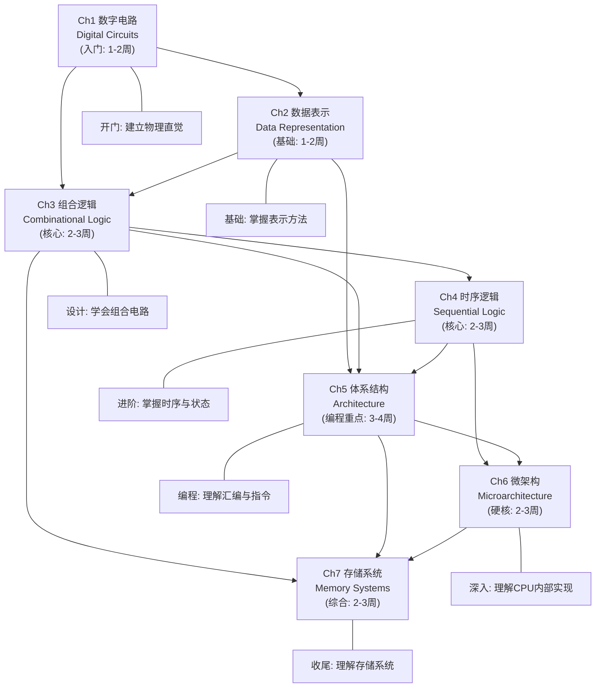
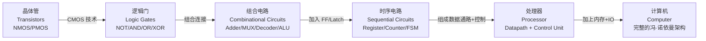
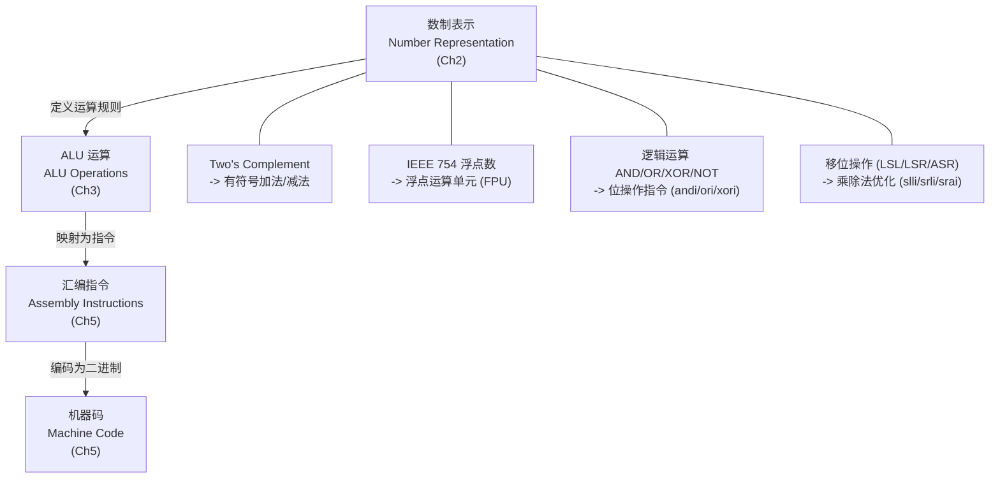
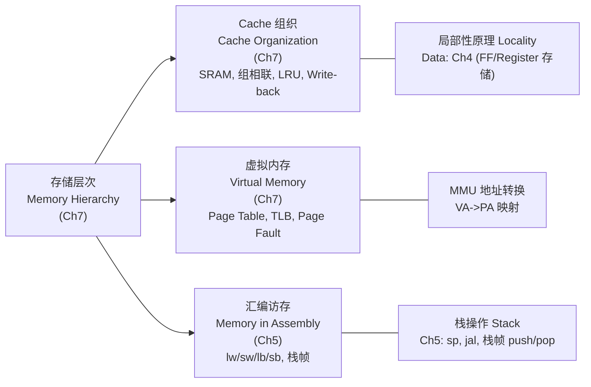
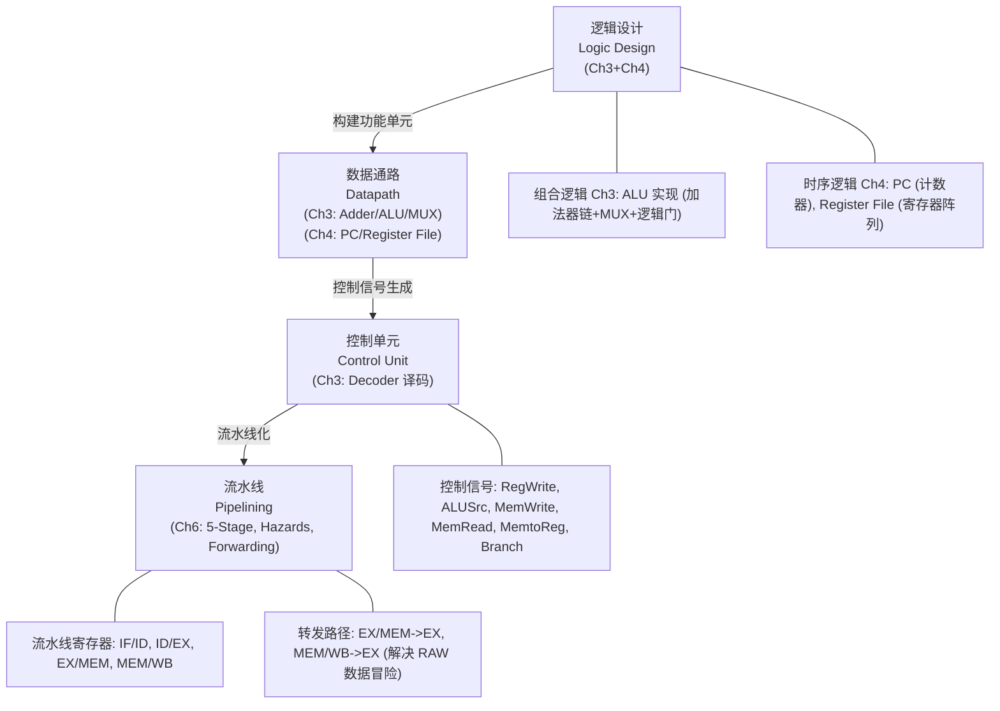

# 00 课程总览 -- COMP30660 Computer Architecture & Organisation

> **课程**: COMP30660 Computer Architecture & Organisation
> **教授**: Prof. Chris Bleakley, UCD School of Computer Science
> **学期**: Spring 2025/2026
> **参考教材**: D.M. Harris & S.L. Harris, *Digital Design and Computer Architecture, RISC-V Edition*, Morgan Kaufmann

---

## 导航目录

- [课程地图 -- 全课程结构总览](#课程地图)
- [各章要点速览](#各章要点速览)
- [学习路线 -- 推荐学习顺序与时间分配](#学习路线)
- [横向概念连线 -- 跨章节概念串讲](#横向概念连线)
- [核心公式汇总 -- 全课程公式速查](#核心公式汇总)
- [实验与工具](#实验与工具)
- [考试建议](#考试建议)
- [快速导航矩阵](#快速导航矩阵)

---

## 课程地图

---

## 各章要点速览

### [[01_数字电路_Digital_Circuits|Ch1 数字电路 (Digital Circuits)]]

> 核心主题：从物理电子到逻辑门的完整链条，建立硬件底层认知

| # | 关键概念 | 重要性 |
|---|----------|--------|
| 1 | **Design Hierarchy 十层抽象模型**：从 Physics 到 Application Software，理解 Architecture 在整体中的位置 | 建立全局认知 |
| 2 | **NMOS 与 PMOS 的互补特性**：NMOS 高电平导通 (Gate=1 -> ON)，PMOS 低电平导通 (Gate=0 -> ON)。两者互补构成 CMOS 技术基础 | 必须牢记 |
| 3 | **CMOS NOT 门的充放电过程**：充电 (0->1) 时 PMOS ON / NMOS OFF，电流 Supply -> Y；放电 (1->0) 时 NMOS ON / PMOS OFF，电流 Y -> Ground | 理解功耗来源 |
| 4 | **动态功耗 vs 静态功耗**：动态功耗由容性切换 (Capacitive Switching) 主导，与切换频率成正比；静态功耗由漏电流 (Leakage Current) 导致 | 性能分析基础 |
| 5 | **七种基本逻辑门**：NOT, AND, OR, NAND, NOR, XOR, XNOR -- NAND 是通用门 (Universal Gate)，仅用 NAND 可构建所有其他门 | 后续所有章节的基石 |

### [[02_数据表示_Data_Representation|Ch2 数据表示 (Data Representation)]]

> 核心主题：所有数据如何以二进制形式表示和运算

| # | 关键概念 | 重要性 |
|---|----------|--------|
| 1 | **Two's Complement 二补码**：现代计算机的唯一有符号数标准表示。取负方法 = Flip bits then Add 1。范围 = $-2^{N-1}$ 到 $+2^{N-1}-1$ | 高频考点 |
| 2 | **IEEE 754 单精度浮点数**：$(-1)^S \times 1.F \times 2^{E-127}$。注意隐含 leading 1、偏置指数 (Bias=127)、规范化数的条件 | 高频考点 |
| 3 | **进制转换方法**：十进制->二进制(重复除以2)、二进制->十进制(加权求和)、十六进制<->二进制(4位一组直接映射) | 基础技能 |
| 4 | **溢出检测 (Overflow)**：Two's Complement 中两个正数相加得负数 / 两个负数相加得正数即为溢出 | 易错点 |
| 5 | **逻辑移位 vs 算术移位**：逻辑右移补 0 (无符号数除法)，算术右移补符号位 (有符号数除法，保留符号) | 程序理解基础 |

### [[03_组合逻辑_Combinational_Logic|Ch3 组合逻辑 (Combinational Logic)]]

> 核心主题：无记忆的数字电路设计，从真值表到门级实现

| # | 关键概念 | 重要性 |
|---|----------|--------|
| 1 | **布尔代数简化定律**：De Morgan 定律 ("破杠换号")、分配律、吸收律、互补律。A + A'B = A + B | 化简表达式的核心工具 |
| 2 | **卡诺图 (K-map)**：图形化简化方法 (2/3/4变量)。关键：列序必须格雷码 (00,01,11,10)。分组找 Prime Implicants 和 Essential Prime Implicants | 高频考点 |
| 3 | **Full Adder 全加器**：Sum = X XOR Y XOR Cin，Cout = X.Y + X.Cin + Y.Cin。可用两个 Half Adder + OR 门实现 | 算术电路核心 |
| 4 | **Carry Lookahead Adder (CLA)**：G_i = X_i . Y_i (Generate)，P_i = X_i XOR Y_i (Propagate)。并行计算进位，O(log N) 延迟 vs Ripple Carry 的 O(N) | 速度与复杂度权衡 |
| 5 | **MUX (多路复用器)**：2:1 MUX -- Y = S'.D0 + S.D1。本质是数据选择器，ALU 中用于选择不同运算结果 | CPU 数据通路的关键组件 |

### [[04_时序逻辑_Sequential_Logic|Ch4 时序逻辑 (Sequential Logic)]]

> 核心主题：带记忆的数字电路，状态存储与时序控制

| # | 关键概念 | 重要性 |
|---|----------|--------|
| 1 | **Latch vs Flip-Flop**：Latch 是 Level-sensitive (电平敏感，Enable=1 期间透明)，Flip-Flop 是 Edge-sensitive (边沿敏感，仅时钟边沿采样) | 根本性区别 |
| 2 | **D Flip-Flop**：$Q(n+1) = D$，最常用存储元件。在时钟正边沿采样 D 输入，两沿之间 Q 不变 | 所有寄存器和 FSM 的基础 |
| 3 | **FSM 设计流程**：(1) 问题描述 -> (2) 状态图 -> (3) 状态表 -> (4) 状态编码分配 -> (5) 下一状态方程 -> (6) 输出方程 -> (7) 电路实现。Moore 输出仅取决于状态，Mealy 输出取决于状态+输入 | 时序电路设计方法论 |
| 4 | **Setup Time & Hold Time**：$t_{setup}$ 在时钟沿之前 D 必须稳定，$t_{hold}$ 在时钟沿之后 D 必须保持。违反导致亚稳态 (Metastability) | 时序分析核心 |
| 5 | **同步 vs 异步计数器**：同步计数器所有 FF 共享同一 CLK (快但硬件多)，异步/Ripple 计数器前级输出驱动下级 CLK (慢但有毛刺) | 设计权衡 |

### [[05_体系结构_Architecture|Ch5 体系结构 (Architecture)]]

> 核心主题：RISC-V 汇编编程与机器码编码，程序员视角的硬件接口

| # | 关键概念 | 重要性 |
|---|----------|--------|
| 1 | **RISC-V 汇编编程**：三操作数刚性语法 `op rd, rs1, rs2`。条件翻译用逆向逻辑 (`if a==b` -> `bne a, b, skip`)。循环三要素：初始化 + 退出条件 + 循环体+迭代 | 编程题核心 |
| 2 | **函数调用与栈帧**：`jal ra, func` / `jalr x0, 0(ra)`。s* 寄存器必须保存/恢复，t* 寄存器可随意覆盖。栈帧操作：Push (addi sp, sp, -N + sw) -> 函数体 -> Pop (lw + addi sp, sp, N) | 必考模板 |
| 3 | **六种指令格式 R/I/S/B/U/J**：R-Type=3寄存器；I-Type=2寄存器+12-bit imm；S-Type=store(imm拆分)；B-Type=分支(imm拆分4段)；U-Type=20-bit高位立即数；J-Type=跳转(imm拆分4段) | 编码/解码题核心 |
| 4 | **机器码编码 (Assembly->Hex)**：确定格式类型 -> 画位域图 -> 查 opcode/funct3/funct7/寄存器编号 -> 填入拼接 -> 4位一组转 Hex。立即数注意符号扩展和拆分规则 | 高频考题 |
| 5 | **伪指令 Pseudo Instructions**：`li` = `addi rd, x0, imm`；`la` = `auipc + addi`；`j` = `jal x0, label`；`bgt/ble` 交换操作数用 `blt/bge` 实现 | 编码前必须展开 |

### [[06_微架构_Microarchitecture|Ch6 微架构 (Microarchitecture)]]

> 核心主题：处理器内部硬件实现，单周期与流水线，冒险与性能

| # | 关键概念 | 重要性 |
|---|----------|--------|
| 1 | **单周期处理器**：每条指令一个时钟周期 (CPI=1)。时钟周期由最慢指令 (lw) 决定。各指令类型的控制信号 (RegWrite/ALUSrc/MemWrite/MemRead/MemtoReg/Branch) 必须熟练掌握 | 微架构基础 |
| 2 | **五级流水线 (IF/ID/EX/MEM/WB)**：每个周期各阶段处理不同指令，吞吐率大幅提升。流水线寄存器 (Pipeline Registers) 在阶段间传递数据和控制信号 | 现代CPU核心机制 |
| 3 | **数据冒险与转发 (Data Hazard & Forwarding)**：RAW 依赖 (add->sub) 通过从 EX/MEM 或 MEM/WB 转发到 ALU 输入解决。Load-Use Hazard (lw->sub) 需要 1 个 Stall (数据在 MEM 阶段才可用) | 冒险处理核心 |
| 4 | **控制冒险与分支预测 (Branch Hazard)**：分支结果在 EX 阶段才确定，需要预测。静态预测 (backward taken, forward not taken)；动态预测 (1-bit/2-bit 状态机) | 控制优化基础 |
| 5 | **执行时间与加速比公式**：$E_p = 4T_p + T_p \times N \times (1+S)$，$Speedup = \frac{f_p}{f_{sc}(1+S)}$。流水线相比单周期通常可获得 4-5 倍加速比 | 性能计算题 |

### [[07_存储系统_Memory_Systems|Ch7 存储系统 (Memory Systems)]]

> 核心主题：存储层次、Cache、虚拟内存，构建"既大又快"的存储系统

| # | 关键概念 | 重要性 |
|---|----------|--------|
| 1 | **存储层次结构 Memory Hierarchy**：Register -> Cache(L1/L2/L3) -> Main Memory (DRAM) -> Secondary Storage (SSD/HDD)。从上到下速度递减，容量递增，每 bit 成本递减 | 全局设计思想 |
| 2 | **局部性原理 Locality**：时间局部性 (最近访问的地址很可能再被访问) + 空间局部性 (附近地址很可能被访问)。这是 Cache 能用小容量实现高命中率的理论基础 | Cache 有效性的根本原因 |
| 3 | **组相联 Cache 地址划分**：32-bit 地址 = Tag + Set/Index + Offset。Offset bits = $\log_2$(Block_Size)；Index bits = $\log_2$(Number_of_Sets)；Tag bits = 32 - Index - Offset | 地址映射计算题 |
| 4 | **AMAT 平均内存访问时间**：$AMAT = T_{cache} + M_{cache} \times T_{main}$。多级 Cache：$AMAT = T_{L1} + M_{L1} \times (T_{L2} + M_{L2} \times T_{main})$ | 性能计算核心公式 |
| 5 | **虚拟内存 Virtual Memory**：VA->PA 通过 Page Table / TLB 转换。VPN -> PFN，Page Offset 不变。Page Fault 由 OS 处理，Dirty bit 决定 evict 时是否写回 | 操作系统接口关键 |

### [[习题汇总_Worksheets|习题汇总 (Worksheets)]]

> 核心主题：历年习题与详细解答，涵盖所有章节典型题型

| # | 内容 | 用途 |
|---|------|------|
| 1 | Two's Complement 计算与溢出判断 | 数据表示练习 |
| 2 | IEEE 754 浮点数编码/解码 | 浮点数格式掌握 |
| 3 | K-map 简化 + 布尔代数证明 | 组合逻辑设计 |
| 4 | FSM 完整设计 (状态图->状态表->电路) | 时序逻辑设计 |
| 5 | RISC-V 汇编编程 (循环/分支/函数) | 汇编编程能力 |
| 6 | Assembly <-> Machine Code 双向转换 | 编码/解码综合 |
| 7 | 流水线冒险分析与 Stall 计数 | 微架构性能分析 |
| 8 | Cache 映射与 AMAT 计算 | 存储系统计算 |

---

## 学习路线

### 推荐学习顺序与章节依赖关系

### 各阶段时间分配建议

| 阶段 | 章节 | 建议时间 | 比例 | 学习重点 |
|------|------|----------|------|----------|
| **第一阶段 (Digital Fundamentals)** | Ch1 + Ch2 | 2-3 周 | ~20% | 晶体管特性、Two's Complement 计算、IEEE 754 编解码、进制转换 |
| **第二阶段 (Logic Design)** | Ch3 + Ch4 | 3-4 周 | ~25% | 布尔代数、K-map 简化、Full Adder/CLA、D FF 特性、FSM 设计 |
| **第三阶段 (Processor Design)** | Ch5 + Ch6 | 4-5 周 | ~35% | RISC-V 汇编编程、机器码编码/解码、流水线冒险分析、性能计算 |
| **第四阶段 (Memory)** | Ch7 | 2-3 周 | ~15% | Cache 映射计算、AMAT、虚拟内存地址转换 |
| **复习冲刺** | 全部 | 1-2 周 | ~5% | 习题练习、跨章节综合题 |

> **建议**: 前两阶段建立基础后，第三阶段的 Ch5 是编程/编码题的大头（占考试比重最大），需要最多的练习时间。Ch6 和 Ch7 偏重理解与计算，公式熟记即可。

---

## 横向概念连线

### 连线 1：从晶体管到完整计算机

> **Transistors -> Logic Gates -> Combinational Circuits -> Sequential Circuits -> Processor -> Computer**

| 层级 | 本章对应 | 核心技术/元件 | 新能力 | 约束 |
|------|----------|---------------|--------|------|
| 晶体管 | [[01_数字电路_Digital_Circuits\|Ch1]] | NMOS/PMOS 的互补特性 | 可控的电子开关 | 物理尺寸、功耗、速度 |
| 逻辑门 | [[01_数字电路_Digital_Circuits\|Ch1]] | NOT/AND/OR/NAND/NOR/XOR/XNOR | 实现布尔逻辑运算 | 扇入/扇出、传播延迟 |
| 组合电路 | [[03_组合逻辑_Combinational_Logic\|Ch3]] | Adder/MUX/Decoder/ALU/比较器 | 算术与逻辑运算 | 无记忆，输出仅由当前输入决定 |
| 时序电路 | [[04_时序逻辑_Sequential_Logic\|Ch4]] | FF, Register, Counter, FSM | 状态记忆，时序控制 | 时钟约束 (setup/hold) |
| 处理器 | [[05_体系结构_Architecture\|Ch5]] + [[06_微架构_Microarchitecture\|Ch6]] | PC, Register File, ALU, Control Unit, Pipeline | 执行指令序列 | 数据/控制冒险，功耗墙 |

---

### 连线 2：数据表示驱动运算

> **Number Representation -> ALU Operations -> Assembly Instructions -> Machine Code**

**关键联系**:
- [[02_数据表示_Data_Representation|Ch2]] 中的 **Two's Complement** 直接决定了 [[03_组合逻辑_Combinational_Logic|Ch3]] 中 **加法器/减法器** 的设计（减法 = 加补码）
- [[02_数据表示_Data_Representation|Ch2]] 中的 **溢出检测规则** 在 [[05_体系结构_Architecture|Ch5]] 的 **ALU 标志位** (Carry/Overflow/Zero/Negative) 中直接体现
- [[02_数据表示_Data_Representation|Ch2]] 中的 **移位操作** 直接映射到 [[05_体系结构_Architecture|Ch5]] 的 RISC-V 指令 `slli/srli/srai`

---

### 连线 3：存储层次贯穿始终

> **Memory Hierarchy -> Cache Organization -> Virtual Memory -> Memory in Assembly (lw/sw)**

**关键联系**:
- [[04_时序逻辑_Sequential_Logic|Ch4]] 中的 **Register 和 Memory Array** 是 CPU 侧的存储基础
- [[05_体系结构_Architecture|Ch5]] 中的 **lw/sw 指令** 直接驱动 [[07_存储系统_Memory_Systems|Ch7]] 中 **Cache 的读写流程** (Hit/Miss/Write-back)
- [[05_体系结构_Architecture|Ch5]] 中的 **栈帧 (Stack Frame)** 是一种特殊的存储使用模式，通过 `sp` 寄存器和 `lw/sw` 指令操作内存
- [[07_存储系统_Memory_Systems|Ch7]] 中的 **虚拟内存** 使得每个程序看到独立的地址空间，[[05_体系结构_Architecture|Ch5]] 中的 `la` 伪指令加载的是虚拟地址

---

### 连线 4：从逻辑设计到流水线控制

> **Logic Design -> Datapath -> Control Unit -> Pipelining**

**关键联系**:
- [[03_组合逻辑_Combinational_Logic|Ch3]] 的 **ALU (加法器+MUX+逻辑运算单元)** 是 [[06_微架构_Microarchitecture|Ch6]] 数据通路的计算核心
- [[03_组合逻辑_Combinational_Logic|Ch3]] 的 **MUX** 是 [[06_微架构_Microarchitecture|Ch6]] 中数据路由和控制信号选择的基础元件
- [[03_组合逻辑_Combinational_Logic|Ch3]] 的 **Decoder** 是 [[06_微架构_Microarchitecture|Ch6]] 中 **Control Unit** 的核心组件 (opcode->控制信号)
- [[04_时序逻辑_Sequential_Logic|Ch4]] 的 **D Flip-Flop** 是 [[06_微架构_Microarchitecture|Ch6]] 中 **PC, Register File, Pipeline Registers** 的基本存储单元
- [[04_时序逻辑_Sequential_Logic|Ch4]] 的 **Setup/Hold Time** 直接决定 [[06_微架构_Microarchitecture|Ch6]] 的 **最小时钟周期** $T_{min} \ge t_{pcq} + t_{pd} + t_{setup}$

---

## 核心公式汇总

### Ch1 数字电路 (Digital Circuits)

| 公式/概念 | 表达式 | 说明 |
|-----------|--------|------|
| CMOS NOT 门行为 | A=0: PMOS ON, NMOS OFF, Y=1; A=1: PMOS OFF, NMOS ON, Y=0 | 互补开关原理 |
| 动态功耗 | $P_{dynamic} \propto f \cdot C \cdot V^2$ | 容性切换主导，与频率成正比 |
| NAND 通用性 | 所有逻辑门可用 NAND 构建 | Universal Gate |

### Ch2 数据表示 (Data Representation)

| 公式 | 表达式 | 说明 |
|------|--------|------|
| N-bit 可表示值数 | $2^N$ | 无符号整数范围 0 到 $2^N-1$ |
| Two's Complement 范围 | $-2^{N-1}$ 到 $+2^{N-1}-1$ | N-bit 有符号数范围 |
| Two's Complement 取负 | Flip all bits, then Add 1 | 核心操作 |
| Overflow 检测 | 两个正数相加得负数 OR 两个负数相加得正数 | TC 溢出判断 |
| IEEE 754 单精度 | $(-1)^S \times 1.F \times 2^{E-127}$ | 32-bit, Bias=127 |
| IEEE 754 双精度 | $(-1)^S \times 1.F \times 2^{E-1023}$ | 64-bit, Bias=1023 |
| 左移 1 位 | $\times 2$ | LSL/ASL 等价于乘以 2 |
| 右移 1 位 | $\div 2$ | LSR (无符号) / ASR (有符号) |

### Ch3 组合逻辑 (Combinational Logic)

| 公式 | 表达式 | 说明 |
|------|--------|------|
| De Morgan 定律 | $\overline{A+B} = \overline{A} \cdot \overline{B}$; $\overline{A \cdot B} = \overline{A} + \overline{B}$ | "破杠换号" |
| 吸收律 | $A + AB = A$; $A + A'B = A + B$ | 简化关键公式 |
| 互补律 | $A + A' = 1$; $A \cdot A' = 0$ | 基本定律 |
| Half Adder | Sum = $X \oplus Y$, Carry = $X \cdot Y$ | 2 输入加法 |
| Full Adder | Sum = $X \oplus Y \oplus C_{in}$, $C_{out} = X \cdot Y + X \cdot C_{in} + Y \cdot C_{in}$ | 3 输入加法 |
| CLA Generate | $G_i = X_i \cdot Y_i$ | 进位生成 |
| CLA Propagate | $P_i = X_i \oplus Y_i$ | 进位传播 |
| CLA 进位方程 | $C_{i+1} = G_i + P_i \cdot C_i$ | 超前进位核心 |
| 2:1 MUX | $Y = S' \cdot D_0 + S \cdot D_1$ | 基本选择器 |

### Ch4 时序逻辑 (Sequential Logic)

| 公式         | 表达式                                                          | 说明           |
| ---------- | ------------------------------------------------------------ | ------------ |
| D FF 特征方程  | $Q(n+1) = D$                                                 | 最简特征方程       |
| JK FF 特征方程 | $Q(n+1) = J \cdot \overline{Q(n)} + \overline{K} \cdot Q(n)$ | J=K=1 时翻转    |
| T FF 特征方程  | $Q(n+1) = T \oplus Q(n)$                                     | T=1 时翻转      |
| 时钟频率与周期    | $f = 1 / T$                                                  | $T = 1 / f$  |
| 最小时钟周期     | $T_{min} \ge t_{pcq} + t_{pd\_comb} + t_{setup}$             | 时序分析核心       |
| 最大时钟频率     | $f_{max} = 1 / T_{min}$                                      |              |
| 存储器容量      | $Capacity = 2^N \times M$ bits                               | N=地址位宽, M=字宽 |
|            |                                                              |              |

### Ch5 体系结构 (Architecture)

| 公式/规则 | 说明 |
|------------|------|
| 有效地址 = base register + offset | `lw rd, imm(rs1)` 中 `rs1 + imm` |
| 函数调用: `jal ra, func`; 返回: `jalr x0, 0(ra)` | 基本调用/返回模板 |
| 栈帧 Push: `addi sp, sp, -N` + `sw s*, offset(sp)` | s* 寄存器保存 |
| 栈帧 Pop: `lw s*, offset(sp)` + `addi sp, sp, N` | s* 寄存器恢复 |
| 伪指令展开：`li` = `addi rd, x0, imm` | Load Immediate |
| 伪指令展开：`la` = `auipc + addi` | Load Address |

### Ch6 微架构 (Microarchitecture)

| 公式 | 表达式 | 说明 |
|------|--------|------|
| 单周期执行时间 | $E_{sc} = T_{sc} \times N$ | CPI = 1 |
| 流水线执行时间 | $E_p = 4T_p + T_p \times N \times (1 + S)$ | S = Stall Rate |
| 流水线执行时间 (近似) | $E_p \approx T_p \times N \times (1 + S)$ | 大 N 忽略 4Tp |
| CPI | $CPI = 1 + S$ | 理想流水线 CPI=1 |
| 加速比 | $Speedup = \frac{T_{sc}}{T_p(1+S)} = \frac{f_p}{f_{sc}(1+S)}$ | 流水线 vs 单周期 |
| MIPS | $P_{mips} = N / (10^6 \times E)$ | 每秒百万指令 |

### Ch7 存储系统 (Memory Systems)

| 公式 | 表达式 | 说明 |
|------|--------|------|
| AMAT (单级) | $AMAT = T_{cache} + M_{cache} \times T_{main}$ | $M_{cache} = 1 - H_{cache}$ |
| AMAT (多级) | $AMAT = T_{L1} + M_{L1} \times [T_{L2} + M_{L2} \times T_{main}]$ | 两级 Cache |
| Offset bits | $\log_2(Block\_Size\_in\_bytes)$ | Block 内字节索引 |
| Index bits | $\log_2(Number\_of\_Sets)$ | Sets = Cache_Size / (Block_Size * Ways) |
| Tag bits | $Address\_Width - Index\_bits - Offset\_bits$ | 地址高位 |
| Page Offset bits | $\log_2(Page\_Size)$ | 页内偏移 |
| VPN bits | $VA\_Width - Page\_Offset\_bits$ | 虚拟页号位数 |
| PFN bits | $PA\_Width - Page\_Offset\_bits$ | 物理帧号位数 |
| Memory Stall Cycles | $Memory\_Accesses \times Miss\_Rate \times Miss\_Penalty$ | 内存停顿 |

---

## 实验与工具

### Logisim Evolution -- 数字逻辑设计

> **用途**: 本课程中所有组合逻辑和时序逻辑电路的可视化设计与仿真

| 实验内容 | 对应章节 | 关键操作 |
|----------|----------|----------|
| 基本逻辑门电路搭建与真值表验证 | [[01_数字电路_Digital_Circuits\|Ch1]] | 拖放 AND/OR/NOT 门，连接输入引脚和输出 LED，观察真值表 |
| 全加器 (Full Adder) 设计与仿真 | [[03_组合逻辑_Combinational_Logic\|Ch3]] | 用 Half Adder + OR 门实现 FA，验证 8 种输入组合 |
| Ripple Carry Adder 4-bit | [[03_组合逻辑_Combinational_Logic\|Ch3]] | 级联 4 个 FA，观察进位逐级传播延迟 |
| 2:1 / 4:1 MUX 电路设计 | [[03_组合逻辑_Combinational_Logic\|Ch3]] | NOT + AND + OR 门实现，改变选择线验证输出 |
| 3-to-8 Decoder | [[03_组合逻辑_Combinational_Logic\|Ch3]] | AND 门阵列实现，输入二进制码输出 one-hot |
| D Flip-Flop 与 Register | [[04_时序逻辑_Sequential_Logic\|Ch4]] | 4-bit Register (4个 D FF + CLK)，观察边沿触发行为 |
| 同步计数器设计 | [[04_时序逻辑_Sequential_Logic\|Ch4]] | T FF + AND 门实现 4-bit 同步计数器，验证计数序列 |
| FSM 序列检测器 ("101") | [[04_时序逻辑_Sequential_Logic\|Ch4]] | 完整 Moore/Mealy FSM 实现，D FF + 组合逻辑 |

> **提示**: Logisim Evolution 免费开源，可从 GitHub 下载。在仿真时注意观察组合逻辑的即时响应和时序逻辑的边沿触发行为之间的区别。

### RARS (RISC-V Assembler and Runtime Simulator) -- RISC-V 汇编编程

> **用途**: RISC-V 汇编程序的编写、汇编、调试与单步执行

| 实验内容 | 对应章节 | 关键操作 |
|----------|----------|----------|
| 基本算术指令编程 (add/sub/addi) | [[05_体系结构_Architecture\|Ch5]] | 写汇编程序，观察寄存器和内存变化 |
| 分支与循环实现 (beq/bne/blt/bge/j) | [[05_体系结构_Architecture\|Ch5]] | 实现 if-else, while, for 循环 |
| 数组遍历与内存操作 (lw/sw) | [[05_体系结构_Architecture\|Ch5]] | 用 lw/sw 读写数组，观察 .data 段 |
| 函数调用与栈帧 (jal/jalr/栈操作) | [[05_体系结构_Architecture\|Ch5]] | 实现嵌套函数调用，观察 sp 和栈内容 |
| 递归函数实现 | [[05_体系结构_Architecture\|Ch5]] | 阶乘/斐波那契递归，理解 ra 的保存与恢复 |
| 机器码验证 | [[05_体系结构_Architecture\|Ch5]] | 将自己编写的汇编对照 RARS 生成的机器码，验证编码正确性 |
| 单步执行与流水线可视化 | [[06_微架构_Microarchitecture\|Ch6]] | 观察每条指令在五级流水线中的执行阶段 |
| 数据冒险观察 | [[06_微架构_Microarchitecture\|Ch6]] | 写 RAW 依赖指令序列，理解 forwarding/stall 的发生条件 |

> **提示**: RARS 是 RISC-V 课程的标准工具，免费开源。建议在写汇编程序时始终开启 "Show Labels Window" 和 "Data Segment Window" 以便调试。

### 习题训练 -- 来自 [[习题汇总_Worksheets|习题汇总]]

| 题型 | 难度 | 建议练习量 |
|------|------|-----------|
| Two's Complement 计算与溢出 | 中等 | 至少 5 道独立练习 |
| IEEE 754 浮点数编解码 | 中等 | 至少 5 道 (含正数/负数/小数) |
| K-map 简化 + 布尔代数 | 中等 | 至少 5 道 (含 Don't Care) |
| Full Adder / CLA 分析与设计 | 中等 | 至少 3 道 |
| FSM 完整设计流程 | 较难 | 至少 3 道 (含 Moore 和 Mealy) |
| RISC-V 汇编编程 | 较难 | 至少 5 道 (含分支/循环/函数调用) |
| Assembly <-> Machine Code 转换 | 中等 | 至少 8 道 (覆盖所有格式 R/I/S/B/U/J) |
| 流水线冒险分析 | 较难 | 至少 3 道 (含五级流水线时空图) |
| Cache 映射与 AMAT 计算 | 中等 | 至少 5 道 (含多级 Cache) |
| Virtual Memory 地址转换 | 中等 | 至少 3 道 (含 Page Fault 处理) |

---

## 考试建议

### 考试题型分布预测

| 题型 | 预计分值 | 主要覆盖章节 | 备考策略 |
|------|----------|--------------|----------|
| 进制转换与数据表示 | ~10-15% | [[02_数据表示_Data_Representation\|Ch2]] | 熟练 Two's Complement 和 IEEE 754 的转换方法，特别注意边界情况（溢出、特殊值） |
| 组合逻辑设计 (K-map/简化) | ~15-20% | [[03_组合逻辑_Combinational_Logic\|Ch3]] | 掌握 K-map 分组技巧和布尔代数定律，注意 SOP vs POS 的选择 |
| 时序逻辑 / FSM 设计 | ~10-15% | [[04_时序逻辑_Sequential_Logic\|Ch4]] | 完整 FSM 设计流程 (状态图->电路)，特别注意 Moore vs Mealy 的输出位置 |
| RISC-V 汇编编程 | ~15-20% | [[05_体系结构_Architecture\|Ch5]] | 多练习编程模板 (分支/循环/函数/栈帧)，注意 s* vs t* 寄存器的保存约定 |
| Machine Code 编码/解码 | ~10-15% | [[05_体系结构_Architecture\|Ch5]] | 牢记六种格式的位域布局，特别注意 B/J 型立即数的拆分规则 |
| 微架构与流水线分析 | ~10-15% | [[06_微架构_Microarchitecture\|Ch6]] | 掌握控制信号表、五级流水线阶段功能、三种冒险的识别与解决 |
| Memory Hierarchy / Cache | ~10-15% | [[07_存储系统_Memory_Systems\|Ch7]] | 熟练 Cache 地址字段划分计算、AMAT 公式、虚拟内存地址转换 |
| 跨章节综合题 | ~5-10% | 全部 | 理解概念之间的联系 (如 ALU 设计 -> 指令执行 -> 流水线)，做综合习题 |

### 考试策略建议

1. **先做计算题和编码题**：Two's Complement 转换、机器码编码/解码、Cache AMAT 计算等步骤明确、不易出错，适合先拿分
2. **汇编编程题留足时间**：需要仔细考虑条件逻辑、寄存器选择、栈帧结构，建议打草稿画寄存器映射表
3. **K-map 分组注意完整性**：确保所有 1 都被至少一个 Prime Implicant 覆盖；Don't Care 条件善用但不必须全用
4. **流水线题画时空图**：五级流水线时间图 (IF-ID-EX-MEM-WB) 是分析冒险和 Stall 的最可靠工具

### 易错提醒 Top 10

| # | 易错点 | 正确理解 |
|---|--------|----------|
| 1 | K-map 列序用 00,01,10,11 而非格雷码 | 正确列序: **00, 01, 11, 10** (格雷码！) |
| 2 | `lb` vs `lbu` 扩展方式混淆 | `lb` = 符号扩展 (Sign Extend)，`lbu` = 零扩展 (Zero Extend) |
| 3 | B/J-Type 立即数拆分时按位映射错误 | 严格按格式图将各位映射到正确位置，`imm[0]` 恒为 0 |
| 4 | `bgt`/`ble` 直接编码（它们是伪指令!） | 必须先展开：`bgt rs1, rs2, label` = `blt rs2, rs1, label` |
| 5 | Latch 是 level-sensitive, FF 是 edge-sensitive | Latch 在 Enable=1 整个期间透明，FF 仅边沿采样 |
| 6 | SR Latch S=R=1 的后续状态不确定 | S=R=1 (无效) 后回到 S=R=0 时 Q 和 !Q 的值取决于哪个输入先回到 0 |
| 7 | 忘记 IEEE 754 规范化数的隐含 leading 1 | 尾数字段前面有隐式的 `1.`，非规范化数才是 `0.` |
| 8 | 流水线 Load-Use Hazard 忘记需要 1 stall | 即使有 forwarding，lw 的数据在 MEM 才可用，dependent 指令需 stall 1 周期 |
| 9 | Virtual Memory 中 Page Offset 会变 | **Page Offset 在 VA->PA 转换中完全不变！** |
| 10 | 时钟周期计算忘记加 setup time | $T_{min} \ge t_{pcq} + t_{pd\_comb} + t_{setup}$，三项缺一不可 |

### 建议复习节奏

| 距考试 | 计划 | 内容 |
|--------|------|------|
| 4 周前 | 完成全部笔记初读 | 按学习路线顺序通读 7 章笔记 + 标记难点 |
| 3 周前 | 开始习题训练 | 主攻 Ch5 汇编编程 + Ch6 性能计算 + Ch3 K-map |
| 2 周前 | 模拟考试 + 查漏补缺 | 限时做完整 past paper，找出薄弱环节针对性补强 |
| 1 周前 | 公式记忆 + 易错回顾 | 背熟所有核心公式 + 回顾 Top 10 易错提醒 |
| 考前 1 天 | 轻松回顾 | 重点看课程地图 + 横向概念连线 + 各章要点速览 |

---

## 快速导航矩阵

| | Ch1 数字电路 | Ch2 数据表示 | Ch3 组合逻辑 | Ch4 时序逻辑 | Ch5 体系结构 | Ch6 微架构 | Ch7 存储系统 | 习题 |
|---|---|---|---|---|---|---|---|---|
| **Ch1** | - | 电压->二进制 | 逻辑门->组合电路 | 晶体管->SRAM / 功耗 | IC 工艺背景 | 晶体管速度->时钟频率 | SRAM/DRAM 技术 | - |
| **Ch2** | 电压->二进制 | - | ALU 运算规则 | FF 存储 bit | 汇编编程基础 | 数据通路操作数 | 内存中的数据格式 | TC/FP |
| **Ch3** | 逻辑门->组合电路 | ALU 运算规则 | - | FF 前的组合逻辑 | Control Unit | ALU/MUX/Datapath | 地址解码器 | K-map |
| **Ch4** | 晶体管->SRAM | FF 存储 bit | FF 前的组合逻辑 | - | PC/Register File | Pipeline Registers | Memory Array | FSM |
| **Ch5** | IC 工艺背景 | 汇编编程基础 | Control Unit | PC/Register File | - | 指令执行流程 | lw/sw 指令 | 汇编 |
| **Ch6** | 晶体管速度->频率 | 数据通路操作数 | ALU/MUX/Datapath | Pipeline Registers | 指令执行流程 | - | 访存阶段 MEM | 流水线 |
| **Ch7** | SRAM/DRAM 技术 | 内存数据格式 | 地址解码器 | Memory Array | lw/sw 指令 | 访存阶段 MEM | - | Cache |

> **使用方式**: 上表展示每对章节之间的交叉知识点。例如，复习 Ch5 汇编编程时，行 Ch5 列 Ch2 提醒你需要理解数据表示 (Two's Complement/IEEE 754) 作为编程基础。

---

> **笔记创建日期**: 2026-04-30
> **维护者**: COMP30660 复习笔记系列
> **参考**: D.M. Harris & S.L. Harris, *Digital Design and Computer Architecture, RISC-V Edition*, Morgan Kaufmann
