# 01 数字电路 (Digital Circuits)

> COMP30660 Computer Architecture & Organisation
> Professor Chris Bleakley, UCD School of Computer Science

---

## 一、设计层次结构 (Design Hierarchy)

计算机系统可以从多个**抽象层 (abstraction layers)** 来理解。每一层隐藏其下层的复杂性，只向上层提供简洁的功能接口。

> **核心概念**: "An abstraction layer models the system at a specific level of detail."
> 底层描述实现细节，高层描述整体功能和结构，无需关心实现细节。

### 十层抽象层次 (从上到下)

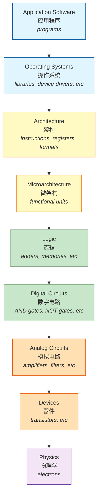

| 层次 | 中文名称 | 示例/内容 |
|------|----------|-----------|
| Application Software | 应用软件 | programs (程序) |
| Operating Systems | 操作系统 | libraries, device drivers (库、设备驱动) |
| Architecture | 架构 | instructions, registers, formats (指令、寄存器、格式) |
| Microarchitecture | 微架构 | functional units (功能单元) |
| Logic | 逻辑 | adders, memories (加法器、存储器) |
| **Digital Circuits** | **数字电路** | **AND gates, NOT gates (与门、非门)** |
| Analog Circuits | 模拟电路 | amplifiers, filters (放大器、滤波器) |
| Devices | 器件 | transistors (晶体管) |
| Physics | 物理学 | electrons (电子) |

> **本模块范围**: Digital Circuits, Logic, Microarchitecture, Architecture
> **本章范围**: Devices, Analog Circuits, Digital Circuits

**软件层 (Software)** 与 **硬件层 (Hardware)** 的分界在上表中的 Architecture 与 Microarchitecture 之间。

---

## 二、物理学基础 (Physics Basics)

### 2.1 现代计算机的本质

> 现代计算机是一台**电子机器 (electronic machine)**。
> 所有信息以**二进制值 (binary values: 0 和 1)** 表示，存储为导线上的**电压水平 (voltage levels)**。
> 计算机通过执行存储的指令来完成任务：接受输入数据，处理数据，产生输出结果。

### 2.2 原子 (Atoms)

| 粒子 | 英文 | 电荷 |
|------|------|------|
| 电子 | Electron | 负电荷 (Negative, -) |
| 质子 | Proton | 正电荷 (Positive, +) |
| 中子 | Neutron | 无电荷 (No charge) |

- 质子和中子结合在**原子核 (nucleus)** 中
- 电子绕原子核**轨道运动 (orbit the nucleus)**
- **异种电荷相吸 (different charges attract)**：+ 与 - 互相吸引
- **同种电荷相斥 (like charges repel)**：+ + 或 - - 互相排斥

> 所有物质都由原子和/或分子组成。分子由两个或多个化学键结合的原子组成。

### 2.3 电子电路 (Electronic Circuit)

**自由电子 (free electrons)** 通过导体从负电荷流向正电荷。

| 概念 | 英文 | 定义 |
|------|------|------|
| 导体 | Conductor | 允许电流容易通过的材料 (铜、铝等金属导线) |
| 绝缘体 | Insulator | 不允许电流容易通过的材料 (如空气间隙、塑料) |
| 电路 | Circuit | 由导体连接电子元件组成的网络，电流可以通过，元件控制电流以执行特定功能 |
| 电压 | Voltage (伏特, Volts) | 电路中两点之间的电荷势能差 (potential difference) |
| 电流 | Current (安培, Ampere) | 电荷流过电路的速率 (rate of charge flow) |

### 2.4 简单电路示例

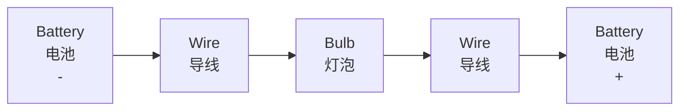

- 电池中的**化学反应**将电子从负极推出，向正极吸引，在两端产生**电压差 (voltage difference)**
- 电子流过灯泡内部的细灯丝 (filament)，灯丝具有高电阻，导致发热发光
- 灯泡亮起说明电路中有电流流动

### 2.5 电流方向约定

| 类型 | 方向 | 说明 |
|------|------|------|
| **实际电子流** (Actual electron flow) | 从负极(-) 到 正极(+) | 自由电子的实际运动方向 |
| **约定电流方向** (Conventional current flow) | 从正极(+) 到 负极(-) | 物理学中的约定定义 |

> **关键点**: 物理学中，电流的约定方向是从 + 到 -，但实际电子的移动方向是从 - 到 +。这是历史上定义的遗留问题，在电路分析中通常使用约定电流方向。

---

## 三、开关 (Switch)

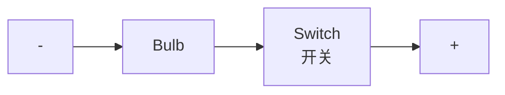

### 3.1 开关的工作原理

开关有两个**端子 (terminals)**，都永久连接在电路中。开关内部有一个**可移动的金属条 (moveable metal bar)**：

| 开关状态 | 金属条位置 | 电路状态 | 灯泡状态 | 原理 |
|----------|-----------|----------|----------|------|
| **闭合 (Closed)** | 金属条接触两端子 | 电路闭合 | 灯泡亮 | 电流可以流动 |
| **断开 (Open)** | 金属条不接触两端子 | 电路开路 | 灯泡灭 | 空气间隙作为绝缘体，阻止电流流动 |

> 在计算机中，开关是**核心要素 (switches are key)**。但计算机中的开关没有机械运动部件——只有电子移动，这就是晶体管的精妙之处。

---

## 四、电子计算机的构成 (Electronic Computer Components)

### 4.1 电源供应单元 (PSU - Power Supply Unit)

- PSU 将市电 (Mains electricity, **240V AC**) 转换为计算机使用的低电压 (**12V - 0.8V DC**)
- 如果计算机包含电池，PSU 为电池充电，电池临时存储电荷供将来使用
- PSU 和电池连接到**分立电子元件 (discrete electronic components)** 和**集成电路 (ICs)**

### 4.2 集成电路 (IC - Integrated Circuit)

> **定义**: "An integrated circuit (IC) is an electronic circuit in which many tiny components are fabricated together on a single piece of semiconductor material (usually silicon)."

- IC 也称为 **计算机芯片 (computer chip)**
- 分立元件包括: 晶体管 (transistors)、电阻 (resistors)、电容 (capacitors)、二极管 (diodes)
- 这些元件用于调节电源和电子信号

### 4.3 数据表示 (Data Representation)

在计算机集成电路中，信息通过导线上的电压水平表示。每条数据导线上暂时连接到 **Ground (地)** 或 **Supply (电源)**。

| 电压 | 电压水平 | 逻辑解释 (Logical) | 数值解释 (Numerical) |
|------|----------|-------------------|---------------------|
| **Supply** | **High (高)** | **TRUE** | **1** |
| **Ground** | **Low (低)** | **FALSE** | **0** |

> **Ground 电压 = 0V**, **Supply 电压 ≈ 1V** (现代计算机)

**示例**: 8条数据线 `0 0 1 1 0 1 1 0` 表示二进制数 00110110

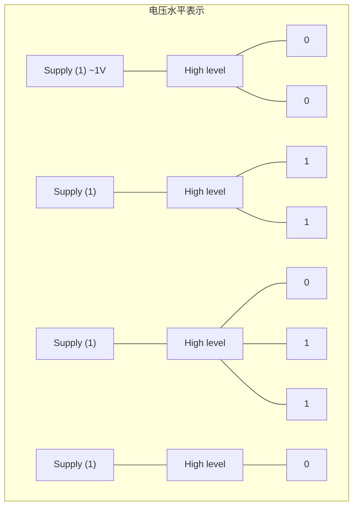

---

## 五、晶体管 (Transistors)

### 5.1 基本概念

> **定义**: "A transistor is a semiconductor device used to switch, control or amplify electrical signals or power."

在计算机中，晶体管主要用作**开关 (switches)**。

- 晶体管有三个端子: **Gate (栅极)**、**Source (源极)**、**Drain (漏极)**
- Gate 上的电压控制 Source 和 Drain 之间是否有导电连接
- 与手动开关不同，晶体管**没有移动部件**——只有电子移动

### 5.2 CMOS 技术

最广泛使用的晶体管制造技术是 **CMOS (Complementary Metal Oxide Semiconductor, 互补金属氧化物半导体)**。

CMOS 包含两种晶体管:

| 类型 | 全称 | 符号特征 |
|------|------|----------|
| **NMOS** | Negative channel Metal Oxide Semiconductor | Gate 无圆圈 |
| **PMOS** | Positive channel Metal Oxide Semiconductor | Gate 有小圆圈 (表示反相) |

### 5.3 NMOS vs PMOS 开关行为

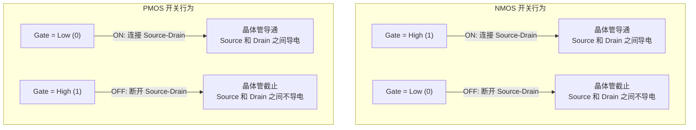

| Gate 电压 | NMOS 状态 | PMOS 状态 |
|-----------|----------|----------|
| **High (1)** | **ON** (导通) | **OFF** (截止) |
| **Low (0)** | **OFF** (截止) | **ON** (导通) |

> **关键规律**: NMOS 和 PMOS 行为恰好相反。NMOS 高电平导通，PMOS 低电平导通。这就是"互补 (complementary)"的含义。

---

## 六、NOT 门的 CMOS 实现

### 6.1 电路结构

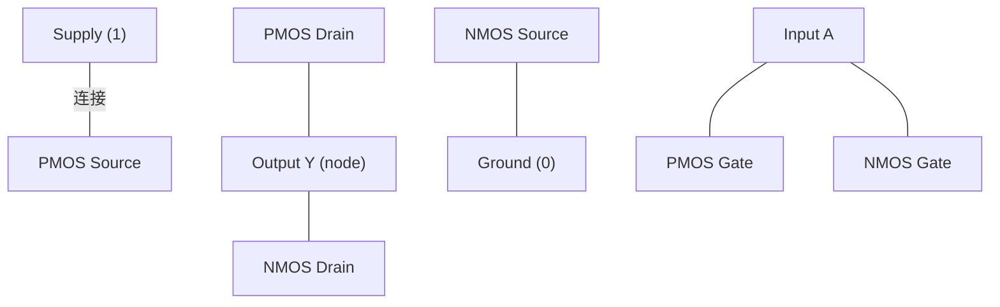

**电路连接**:
- PMOS 的 Source 连接到 **Supply (1)**
- PMOS 的 Drain 连接到输出节点 Y
- NMOS 的 Source 连接到 **Ground (0)**
- NMOS 的 Drain 连接到输出节点 Y
- 两个晶体管的 Gate 都连接到输入 A

### 6.2 当 A = 1 时 (输入高电平)

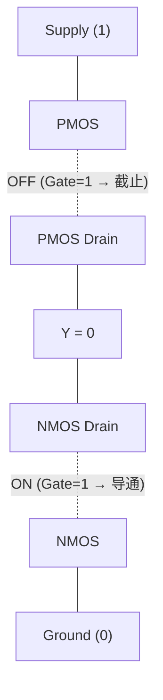

| 步骤 | 晶体管 | Gate 电压 | 结果 |
|------|--------|-----------|------|
| 1 | PMOS | Gate = 1 | PMOS **OFF** -- Source-Drain 断开 |
| 2 | NMOS | Gate = 1 | NMOS **ON** -- Source-Drain 连通 |
| 3 | -- | -- | Y 连接到 Ground → **Y = 0** |

> 输入 A=1 时，输出 Y=0

### 6.3 当 A = 0 时 (输入低电平)

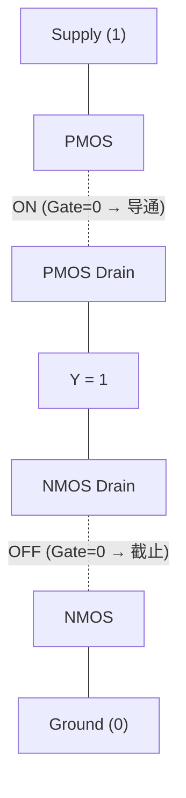

| 步骤 | 晶体管 | Gate 电压 | 结果 |
|------|--------|-----------|------|
| 1 | PMOS | Gate = 0 | PMOS **ON** -- Source-Drain 连通 |
| 2 | NMOS | Gate = 0 | NMOS **OFF** -- Source-Drain 断开 |
| 3 | -- | -- | Y 连接到 Supply → **Y = 1** |

> 输入 A=0 时，输出 Y=1

### 6.4 总结

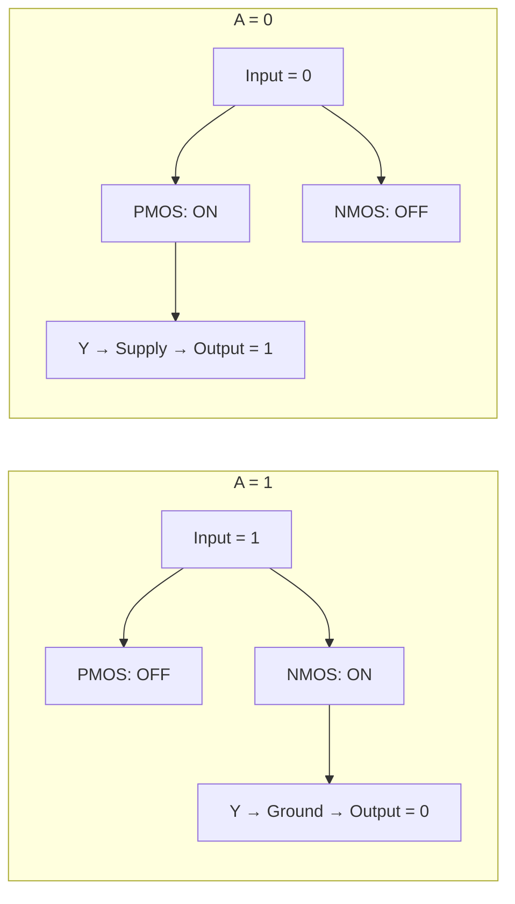

> **NOT 门功能**: 输出是输入的逻辑反转。Input=0 → Output=1; Input=1 → Output=0。

> **术语说明**: 电路图中的"导线"更正式地应称为 **nodes (节点)**。节点是两个或多个电路元件连接在一起并共享相同电势 (电压) 的点。

---

## 七、电压水平与噪声容限 (Voltage Levels & Noise Margins)

### 7.1 实际电压水平

在现实世界中，电路**不会**始终处于完美的 Ground 和 Supply 电压水平。电压变化源于:
- 制造工艺的非理想性 (non-optimal manufacture)
- 电子噪声 (electronic noise)

> 集成电路设计为在**接近 Ground 和 Supply 的电压水平**下正常工作。

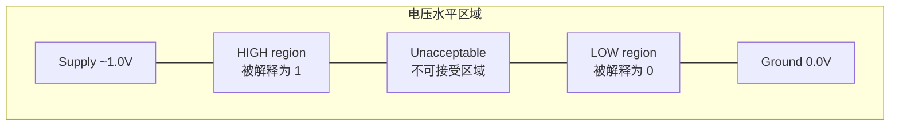

| 区域 | 电压范围 | 逻辑解释 |
|------|----------|----------|
| HIGH | 接近 Supply | **1 (TRUE)** |
| Unacceptable | 中间区域 | **不确定/不可接受** |
| LOW | 接近 Ground | **0 (FALSE)** |

> 任何接近 Supply 的电压都被视为 High (1)；任何接近 Ground 的电压都被视为 Low (0)。这种设计为信号提供了噪声容限 (noise margin)。

---

## 八、半导体与掺杂 (Semiconductors & Doping)

### 8.1 基本概念

> **半导体 (Semiconductor)**: 一种材料的导电能力可以被温度、掺杂或外加电场等因素控制的材料。

晶体管制造在**硅基板 (silicon substrate)** 表面。硅经过化学物质**掺杂 (doping)** 以创建半导体区域，并在上面层叠金属和绝缘体。

### 8.2 两种掺杂类型

| 掺杂类型 | 英文 | 掺杂原子 | 载流子 (Carriers) | 导电机制 |
|----------|------|----------|-------------------|----------|
| **n-type** | n 型 | **Donor atoms** (施主原子) -- 提供额外电子 | **自由电子 (free electrons)** | 额外电子自由移动并携带电流 |
| **p-type** | p 型 | **Acceptor atoms** (受主原子) -- 创造"空穴" | **空穴 (holes, 缺失的电子)** | 邻近电子移动填补空穴，空穴表现为可移动的正电荷载流子 |

### 8.3 掺杂浓度与导电性

| 掺杂程度 | 导电性 |
|----------|--------|
| **重掺杂 (Heavily doped)** | 极高导电性 |
| **轻掺杂 (Lightly doped)** | 中等导电性，可通过电场控制 |
| **未掺杂 (Undoped)** | 极低导电性 (近似绝缘体) |

---

## 九、NMOS 和 PMOS 的横截面结构 (Cross-Section)

### 9.1 NMOS 横截面

```
                      G (Gate / 栅极)
              ┌─────────────────────────┐
              │      绝缘体 (insulator)   │
    ┌─────────┴──────┬──────────┬───────┴─────────┐
    │   n+           │ channel  │      n+         │  ← 硅 (silicon)
    │ (重掺杂n型)    │  (沟道)   │ (重掺杂n型)      │
    └────────────────┴──────────┴─────────────────┘
              p-substrate (轻掺杂p型基板)
```

**NMOS 结构**:
- Gate 通过薄**氧化层 (oxide layer)** 与硅基板绝缘
- Source 和 Drain 连接到**重掺杂 n 型区域** (电子载流子)
- 基板是**轻掺杂 p 型** (空穴载流子)

**NMOS 工作机制**:

| Gate 电压 | 物理效果 | 结果 |
|-----------|----------|------|
| **High (1)** | 排斥空穴(+), 吸引电子(-) 到 Gate 下方基板表面 | 电子积累**反转 (invert)** p 型区域表面为 n 型导电沟道 → 电流可在 Source-Drain 之间流动 → **ON** |
| **Low (0)** | 不吸引电子载流子 | 无沟道形成 → 电流不能流动 → **OFF** |

### 9.2 PMOS 横截面

```
                      G (Gate / 栅极)
              ┌─────────────────────────┐
              │      绝缘体 (insulator)   │
    ┌─────────┴──────┬──────────┬───────┴─────────┐
    │   p+           │ channel  │      p+         │  ← n-well (n阱)
    │ (重掺杂p型)    │  (沟道)   │ (重掺杂p型)      │
    └────────────────┴──────────┴─────────────────┘
              p-substrate (p型基板)
```

**PMOS 结构**:
- Gate 通过薄**氧化层**与硅基板绝缘
- Source 和 Drain 连接到**重掺杂 p 型区域** (空穴载流子)
- 基板中有一个**轻掺杂 n 型阱 (n-well)** (电子载流子)

**PMOS 工作机制**:

| Gate 电压 | 物理效果 | 结果 |
|-----------|----------|------|
| **Low (0)** | 排斥电子(-), 吸引空穴(+) 到 Gate 下方基板表面 | 空穴积累**反转** n 型区域表面为 p 型导电沟道 → 电流可在 Source-Drain 之间流动 → **ON** |
| **High (1)** | 吸引电子，阻止空穴积累 | 无沟道形成 → 电流不能流动 → **OFF** |

### 9.3 NMOS 与 PMOS 对比总结

| 特征 | NMOS | PMOS |
|------|------|------|
| Source/Drain 掺杂 | 重掺杂 **n+** (电子载流子) | 重掺杂 **p+** (空穴载流子) |
| 基板/阱掺杂 | 轻掺杂 **p 型** (空穴载流子) | 轻掺杂 **n 型阱** (电子载流子) |
| Gate=High (1) | ✅ **ON** | ❌ OFF |
| Gate=Low (0) | ❌ OFF | ✅ **ON** |
| 导电沟道类型 | n 型沟道 (电子导电) | p 型沟道 (空穴导电) |

---

## 十、功耗 (Power Consumption)

### 10.1 两种功耗类型

| 功耗类型 | 英文 | 定义 | 发生条件 |
|----------|------|------|----------|
| **静态功耗** | Static Power | 晶体管未切换时的功耗 | 微小**漏电流 (leakage currents)** 从 Supply 流向 Ground |
| **动态功耗** | Dynamic Power | 晶体管切换时的功耗 | 晶体管状态改变时 |

### 10.2 动态功耗的两个组成部分

| 组成 | 英文 | 原因 | 特点 |
|------|------|------|------|
| **短路电流** | Short-circuit currents | NMOS 和 PMOS 短暂同时导通，电流从 Supply 直接流向 Ground | 导致高**瞬时电流 (instantaneous current)** |
| **容性切换** | Capacitive switching | 逻辑门输出变化 (0→1, 1→0) 时对寄生电容充放电 | **主导**数字电路功耗 |

### 10.3 寄生电容 (Parasitic Capacitance)

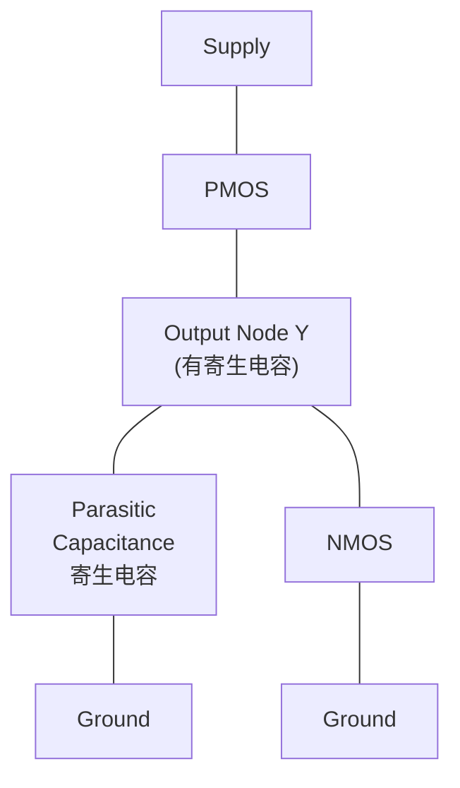

> **电容 (Capacitance)**: 元件存储单位电压电荷的能力。
> **寄生电容 (Parasitic Capacitance)**: 由于元件、电路或系统各部分之间的物理接近而存在的不期望的电容。

### 10.4 充放电过程详解

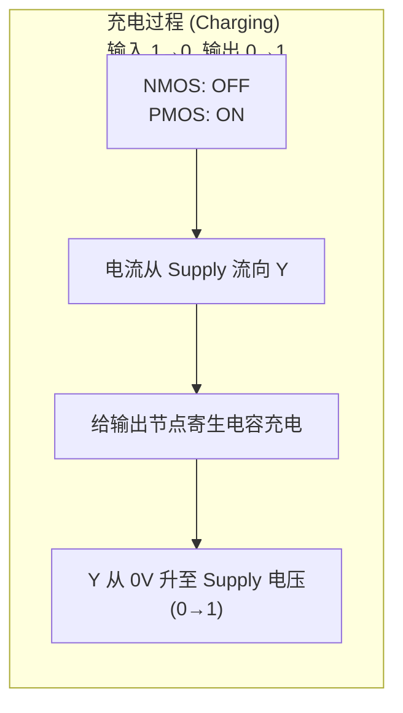

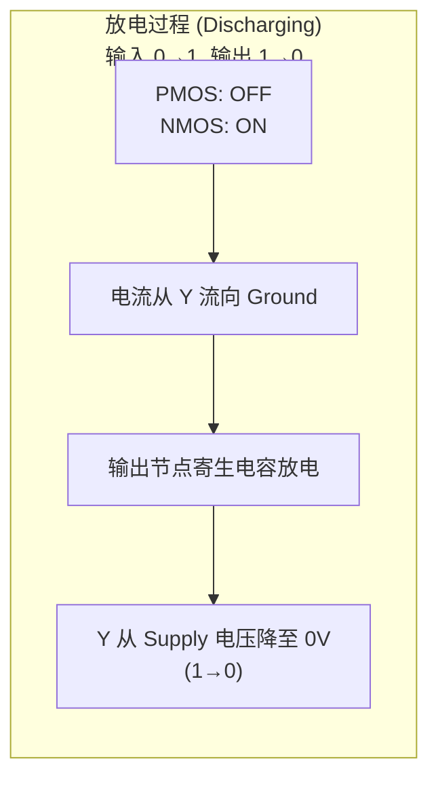

**充放电周期总结**:

| 输入变化 | NOT 门输出变化 | 相关晶体管 | 电流方向 | 电容状态 | 过程 |
|----------|---------------|-----------|----------|----------|------|
| **1 → 0** | **0 → 1** | PMOS ON, NMOS OFF | Supply → Y | **充电 (Charging)** | 给寄生电容充电，电压从 0V 升至 Supply |
| **0 → 1** | **1 → 0** | NMOS ON, PMOS OFF | Y → Ground | **放电 (Discharging)** | 寄生电容释放能量，电压从 Supply 降至 0V |

> **关键点**: 每次充放电周期都导致电流从 Supply 流向 Ground，消耗电源能量。存储在寄生电容中的能量以**热量 (heat)** 形式耗散，主要在晶体管和导线的电阻路径中。

### 10.5 充放电电压波形

```
电压
^
| Supply (1V)  ----+
|                  | \         充电: 0V → Supply
|                  |  \        (PMOS ON, 给电容充电)
|                  |   +----
|                  |        \  放电: Supply → 0V
|                  |         \ (NMOS ON, 电容放电)
| Ground (0V)  ----+----------+---------> 时间
```

---

## 十一、逻辑门 (Logic Gates)

> **定义**: "A logic gate is a basic building block of digital circuits that performs a simple logical operation."
> 逻辑门是数字电路的基本构建块，由一组晶体管实现。每个逻辑门有一个或两个输入，一个输出。
> 四种基本逻辑门: NOT, AND, OR, XOR

### 11.1 NOT 门 (非门 / 反相器 Inverter)

**符号**: `A ──[▷o]── Y`

| Input A | Output Y |
|---------|----------|
| 0 | **1** |
| 1 | **0** |

> **自然语言**: NOT 门当且仅当 (iff) 输入为 0 时输出 1。换句话说，NOT 门对输入进行**逻辑反相 (logically inverts)**。

> **布尔表达式**: Y = A̅ (或 Y = ¬A)

---

### 11.2 AND 门 (与门)

**符号**: `A ──[&]── Y`
`B ──┤`

| Input A | Input B | Output Y |
|---------|---------|----------|
| 0 | 0 | **0** |
| 0 | 1 | **0** |
| 1 | 0 | **0** |
| 1 | 1 | **1** |

> **自然语言**: AND 门当且仅当**两个输入都为 1** 时输出 1。

> **布尔表达式**: Y = A · B (或 Y = A ∧ B)

---

### 11.3 OR 门 (或门)

**符号**: `A ──[≥1]── Y`
`B ──┤`

| Input A | Input B | Output Y |
|---------|---------|----------|
| 0 | 0 | **0** |
| 0 | 1 | **1** |
| 1 | 0 | **1** |
| 1 | 1 | **1** |

> **自然语言**: OR 门当**任意一个或两个输入为 1** 时输出 1。

> **布尔表达式**: Y = A + B (或 Y = A ∨ B)

---

### 11.4 NAND 门 (与非门)

**符号**: `A ──[&o]── Y`
`B ──┤`

| Input A | Input B | Output Y |
|---------|---------|----------|
| 0 | 0 | **1** |
| 0 | 1 | **1** |
| 1 | 0 | **1** |
| 1 | 1 | **0** |

> **自然语言**: NAND 门**除非两个输入都为 1** 否则输出 1。换言之，NAND = NOT (A AND B)。

> **布尔表达式**: Y = A̅·̅B̅ (或 Y = ¬(A ∧ B))

> **重要**: NAND 门是**通用门 (universal gate)**，可以用 NAND 门构造所有其他逻辑门。

---

### 11.5 NOR 门 (或非门)

**符号**: `A ──[≥1o]── Y`
`B ──┤`

| Input A | Input B | Output Y |
|---------|---------|----------|
| 0 | 0 | **1** |
| 0 | 1 | **0** |
| 1 | 0 | **0** |
| 1 | 1 | **0** |

> **自然语言**: NOR 门当且仅当**两个输入都为 0** 时输出 1。换言之，NOR = NOT (A OR B)。

> **布尔表达式**: Y = A̅+̅B̅ (或 Y = ¬(A ∨ B))

---

### 11.6 XOR 门 (异或门)

**符号**: `A ──[=1]── Y`
`B ──┤`

| Input A | Input B | Output Y |
|---------|---------|----------|
| 0 | 0 | **0** |
| 0 | 1 | **1** |
| 1 | 0 | **1** |
| 1 | 1 | **0** |

> **自然语言**: XOR 门当且仅当**两个输入不相等**时输出 1。

> **布尔表达式**: Y = A ⊕ B

---

### 11.7 XNOR 门 (同或门 / 异或非门)

**符号**: `A ──[=1o]── Y`
`B ──┤`

| Input A | Input B | Output Y |
|---------|---------|----------|
| 0 | 0 | **1** |
| 0 | 1 | **0** |
| 1 | 0 | **0** |
| 1 | 1 | **1** |

> **自然语言**: XNOR 门当且仅当**两个输入相等**时输出 1。

> **布尔表达式**: Y = A̅⊕̅B̅ (或 Y = ¬(A ⊕ B) = A ⊙ B)

---

### 11.8 逻辑门总览

| 门类型 | 符号标识 | 输入数 | 输出为 1 的条件 | 布尔表达式 |
|--------|---------|--------|----------------|-----------|
| **NOT** | ▷o | 1 | 输入 = 0 | Y = A̅ |
| **AND** | & | 2 | 两输入都为 1 | Y = A · B |
| **OR** | ≥1 | 2 | 至少一个输入为 1 | Y = A + B |
| **NAND** | &o | 2 | 并非两输入都为 1 | Y = A̅·̅B̅ |
| **NOR** | ≥1o | 2 | 两输入都为 0 | Y = A̅+̅B̅ |
| **XOR** | =1 | 2 | 两输入不相等 | Y = A ⊕ B |
| **XNOR** | =1o | 2 | 两输入相等 | Y = A̅⊕̅B̅ |

---

## 十二、摩尔定律与晶体管缩小 (Moore's Law)

### 12.1 摩尔定律

1965 年，Intel 联合创始人 **Gordon Moore** 预测：

> **"The number of transistors in integrated circuits would double approximately every two years."**
> (集成电路中的晶体管数量大约每两年翻一番。)

60 年后，该定律仍然 (某种程度上) 成立。

### 12.2 晶体管缩小带来的好处

| 好处 | 说明 |
|------|------|
| **加速晶体管切换** | Accelerated transistor switching -- 更快的开关速度 |
| **降低晶体管功耗** | Reduced power consumption (特别是降低 Supply 电压) |
| **增加芯片晶体管数量** | Increased number of transistors on a single chip |
| → **并行指令执行** | 多晶体管使计算机能够同时执行多条指令 |
| → **增大内存容量** | Increased computer memory capacity |

> **核心结论**: 晶体管的不断缩小驱动了计算机性能的**指数级增长 (exponential growth)**。

### 12.3 令人惊叹的事实

**整个计算机**可以仅使用 **2 种晶体管 (NMOS + PMOS)** 和 **4 种基本逻辑门 (NOT, AND, OR, XOR)** 来实现。

---

## 十三、关键公式与概念速记 (Key Formulas & Quick Reference)

| 概念 | 关键内容 |
|------|----------|
| **电压 (Voltage)** | 两点之间的电荷势能差，单位: Volts (V) |
| **电流 (Current)** | 电荷流动的速率，单位: Ampere (A) |
| **约定电流方向** | 正极 (+) → 负极 (-) (与电子实际移动方向相反) |
| **实际电子流方向** | 负极 (-) → 正极 (+) |
| **Supply = High = TRUE = 1** | ≈ 1V (现代计算机) |
| **Ground = Low = FALSE = 0** | = 0V |
| **NMOS 导通条件** | Gate = High (1) |
| **PMOS 导通条件** | Gate = Low (0) |
| **n-type 载流子** | 自由电子 (electrons) |
| **p-type 载流子** | 空穴 (holes) |
| **静态功耗** | 晶体管不切换时，漏电流导致 |
| **动态功耗 (主导)** | 容性切换 (充放电寄生电容) + 短路电流 |
| **充电** | PMOS ON → 电流 Supply→Y → 电压 0→1 |
| **放电** | NMOS ON → 电流 Y→Ground → 电压 1→0 |

---

## 十四、易混淆概念辨析 (Confusing Concepts)

### 14.1 NMOS vs PMOS

| 对比维度 | NMOS | PMOS |
|----------|------|------|
| **全称** | Negative channel Metal Oxide Semiconductor | Positive channel Metal Oxide Semiconductor |
| **Gate = High (1) 时** | **ON (导通)** -- Source 和 Drain 之间导电 | **OFF (截止)** -- Source 和 Drain 之间不导电 |
| **Gate = Low (0) 时** | **OFF (截止)** | **ON (导通)** |
| **输入信号与导通关系** | 高电平 → 导通 (类似于"正逻辑开关") | 低电平 → 导通 (类似于"负逻辑开关") |
| **Source/Drain 掺杂** | 重掺杂 **n 型** (n+) | 重掺杂 **p 型** (p+) |
| **导电沟道载流子** | 电子 (electrons, 负电荷) | 空穴 (holes, 正电荷) |
| **符号特征** | Gate 无圆圈 | Gate 有小圆圈 (表示反相/低电平激活) |

> **记忆口诀**:
> - NMOS: **N**eed **High** to turn **ON** (需要高电平导通)
> - PMOS: **P**refers **Low** to turn **ON** (需要低电平导通)
> - NMOS = "高导通"，PMOS = "低导通"

### 14.2 导体 vs 绝缘体 vs 半导体

| 材料类型 | 英文 | 导电能力 | 原因 | 示例 |
|----------|------|----------|------|------|
| **导体** | Conductor | **高** -- 电流容易通过 | 有大量自由电子可移动 | 铜 (Cu)、铝 (Al) |
| **绝缘体** | Insulator | **极低** -- 电流几乎不能通过 | 几乎没有自由电子 | 空气、塑料、氧化物层 |
| **半导体** | Semiconductor | **可控** -- 导电性可被温度/掺杂/电场控制 | 导带和价带之间的能隙较小，可通过掺杂引入载流子 | 硅 (Si)、锗 (Ge) |

> **关键区别**: 半导体的导电性**不是固定的**，可以通过掺杂和电场来控制。这正是晶体管能够作为开关的基础。

### 14.3 静态功耗 vs 动态功耗

| 对比维度 | 静态功耗 (Static Power) | 动态功耗 (Dynamic Power) |
|----------|------------------------|------------------------|
| **发生条件** | 晶体管**不切换**时 (电路处于稳定状态) | 晶体管**切换**时 (状态改变) |
| **物理原因** | 微小漏电流 (leakage currents) 从 Supply 流向 Ground | (1) 短路电流 + (2) 容性切换 |
| **相对大小** | 较小 | **较大 -- 主导数字电路功耗** |
| **是否可避免** | 难以完全避免 (器件物理特性) | 与切换频率成正比 |
| **与频率关系** | 与频率无关 | **与切换频率成正比** |

> **记忆**: Static = 不动也有 (漏电); Dynamic = 动的时候有 (切换功耗)。动态功耗中包含的容性切换 (充放电) 是最大的功耗来源。

### 14.4 充电 vs 放电

| 对比维度 | 充电 (Charging) | 放电 (Discharging) |
|----------|----------------|-------------------|
| **NOT 门输入变化** | **1 → 0** | **0 → 1** |
| **NOT 门输出变化** | **0 → 1** | **1 → 0** |
| **哪个晶体管导通** | PMOS ON, NMOS OFF | NMOS ON, PMOS OFF |
| **电流路径** | **Supply → PMOS → Y** (向输出节点注入电荷) | **Y → NMOS → Ground** (从输出节点抽取电荷) |
| **电容电压变化** | 0V → Supply (电压上升) | Supply → 0V (电压下降) |
| **能量去向** | 电源能量存储在寄生电容中 | 电容中存储的能量以热量形式耗散 |

> **关键**: 一次完整的充放电周期 = 从 Supply 取能量 → 存储到电容 → 放热耗散。这就是数字电路动态功耗的根源。

### 14.5 实际电子流 vs 约定电流方向

| 对比维度 | 实际电子流 (Actual Electron Flow) | 约定电流方向 (Conventional Current Flow) |
|----------|-----------------------------------|----------------------------------------|
| **方向** | 从 **负极 (-)** 到 **正极 (+)** | 从 **正极 (+)** 到 **负极 (-)** |
| **物理基础** | 电子的实际运动方向 (电子带负电荷，被正极吸引) | 历史上的定义 (在发现电子之前，Benjamin Franklin 假设电流由正电荷携带) |
| **在电路分析中** | 较少使用 | **广泛使用** (电路符号、分析中默认使用约定方向) |
| **在物理层面** | 正确描述电子运动 | 实际上是"空穴流"的方向 |

> **考试注意**: 在电路分析中使用约定电流方向 (+ → -)，但在理解半导体物理时要知道电子的实际移动方向是 (- → +)。两者方向相反但都有效，只是视角不同。

---

## 十五、章节总结 (Chapter Summary)

### 本章涵盖主题

1. **Design Hierarchy** -- 计算机系统的十层抽象模型，从 Physics 到 Application Software
2. **Physics** -- 原子结构、电子电路、电压/电流、导体/绝缘体、开关原理
3. **Devices** -- PSU、IC、数据表示 (电压水平 = 逻辑值)、晶体管 (NMOS/PMOS)、电压水平与噪声容限
4. **How Transistors Work** -- 半导体掺杂 (n-type/p-type)、NMOS 和 PMOS 横截面与工作机制、静态功耗与动态功耗、寄生电容的充放电
5. **Logic Gates** -- NOT, AND, OR, NAND, NOR, XOR, XNOR 七种逻辑门的符号、真值表和自然语言描述
6. **Moore's Law** -- 晶体管数量每两年翻一番，驱动计算机性能指数级增长

### 核心理解

- 计算机的**全部功能**建立在两个电压水平 (0 和 1) 之上
- **两种晶体管** (NMOS + PMOS) + **四种基本逻辑门** (NOT, AND, OR, XOR) 可以构造整个计算机
- NMOS 和 PMOS 的**互补 (complementary)** 特性是 CMOS 技术的基础
- **动态功耗**由输出节点的寄生电容充放电主导

---

> 参考: D.M. Harris and S.L. Harris, *Digital Design and Computer Architecture*, RISC-V Edition, Morgan Kaufmann, Chapter 1
