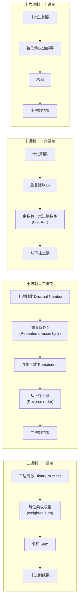
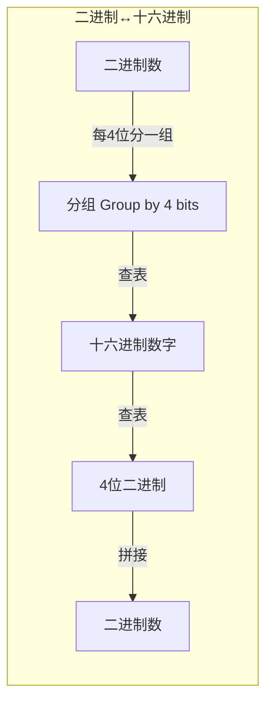
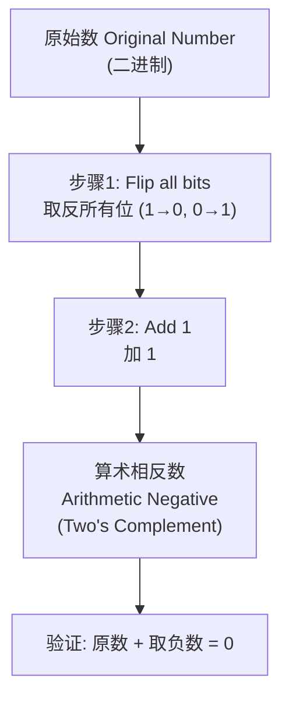
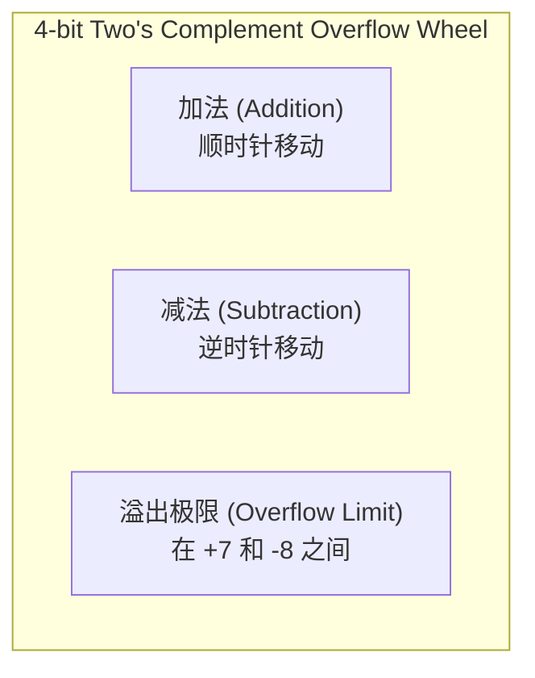
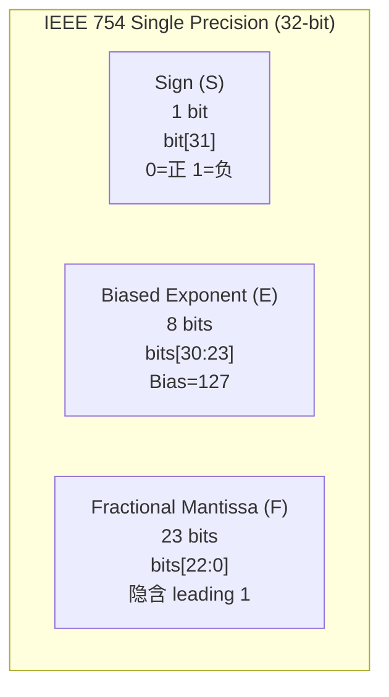

# 02 -- 数据表示 (Data Representation)

> **COMP30660 Computer Architecture & Organisation**
> **Professor Chris Bleakley, UCD School of Computer Science**

---

## 目录 (Table of Contents)

1. [二进制数 (Binary Numbers)](#二进制数)
2. [十六进制数 (Hexadecimal Numbers)](#十六进制数)
3. [浮点数 (Floating Point Numbers)](#浮点数)
4. [字符表示 (Characters)](#字符表示)
5. [显示与多媒体 (Displays & Multimedia)](#显示与多媒体)
6. [易混淆概念](#易混淆概念)
7. [高频考点](#高频考点)

---

## 二进制数 (Binary Numbers)

### 基本概念

现代计算机用 0 和 1 表示所有数据。二进制 (binary) 是以 2 为基的数制 (base-2 number system)，只使用 0 和 1 两个数字。二进制数字称为 **bit** (比特)。

**进制标记**: 在数字右下角用下标注明基 (base)，例如 $92_{10}$ 表示十进制 92。

#### 位置权重系统 (Positional Number System)

每位数字位于一列，每列有权重 (weight)。从右向左，每列的权重是前一列的 2 倍。

```
二进制 10110₂:
 2⁴    2³    2²    2¹    2⁰
 16s    8s    4s    2s    1s    ← 权重 (weights)
Sixteens Eights Fours Twos Units
  1      0     1     1     0    ← bits
```

#### 位索引 (Bit Indices)

列的权重是 2 的整数次幂，这些整数值称为**位索引** (bit index)。

- bit [2]: 对应 $2^2 = 4$ 列
- bits [3:4]: 对应 $2^3$ 和 $2^4$ 列

#### 位宽定义

| 名称 | 位数 | 示例 |
|------|------|------|
| **bit** | 1 位 | `0` 或 `1` |
| **nibble** | 4 位 | `1010` |
| **byte** | 8 位 | `1011_0100` |
| **word** | 视架构而定 | 现代计算机通常 64-bit |
| **double word** | 2 words | 128-bit (64-bit 架构中) |

> **关键概念**: 便宜的嵌入式处理器（如烤面包机中的芯片）可能只使用 8-bit words；现代计算机使用 64-bit words。

---

### $\boxed{\text{公式: N-bit 可表示的不同值数量} = 2^N}$

> 一个 N-bit word 可以表示 $2^N$ 个不同的值。

**范围**: 对于无符号整数 (unsigned integers)：
$$
\boxed{0 \text{ 到 } 2^N - 1}
$$

例如，4-bit word 可以表示 16 个值：整数 0 到 15。

---

#### 二进制计数表 (Counting in Binary)

| 1-bit | 2-bit | 3-bit | 4-bit | Decimal |
|-------|-------|-------|-------|---------|
| 0 | 00 | 000 | 0000 | 0 |
| 1 | 01 | 001 | 0001 | 1 |
| | 10 | 010 | 0010 | 2 |
| | 11 | 011 | 0011 | 3 |
| | | 100 | 0100 | 4 |
| | | 101 | 0101 | 5 |
| | | 110 | 0110 | 6 |
| | | 111 | 0111 | 7 |
| | | | 1000 | 8 |
| | | | 1001 | 9 |
| | | | 1010 | 10 |
| | | | 1011 | 11 |
| | | | 1100 | 12 |
| | | | 1101 | 13 |
| | | | 1110 | 14 |
| | | | 1111 | 15 |

---

### LSB 与 MSB

- **LSB** (Least Significant Bit) -- 最右边的位，权重 $2^0 = 1$
- **MSB** (Most Significant Bit) -- 最左边的位，权重 $2^{N-1}$

```
 1 0 1 1 0 0
 ↑         ↑
MSB       LSB
```

---

### 进制转换方法





---

### 详细计算示例: 42 的多种进制转换

#### 十进制 42 → 二进制

```
42 / 2 = 21 余 0  ← LSB
21 / 2 = 10 余 1
10 / 2 =  5 余 0
 5 / 2 =  2 余 1
 2 / 2 =  1 余 0
 1 / 2 =  0 余 1  ← MSB

从下往上读: 101010₂
验证: 32 + 8 + 2 = 42 ✓
```

> **答案: $42_{10} = 101010_2$**

#### 十进制 42 → 十六进制

```
42 / 16 = 2 余 10 → A
 2 / 16 = 0 余  2 → 2

从下往上读: 2A₁₆
验证: 2 × 16 + 10 = 42 ✓
```

> **答案: $42_{10} = 2A_{16}$**

#### 十进制 42 → 八进制 (Octal)

```
42 / 8 = 5 余 2
 5 / 8 = 0 余 5

从下往上读: 52₈
验证: 5 × 8 + 2 = 42 ✓
```

> **答案: $42_{10} = 52_8$**

#### 十六进制 → 二进制（直接映射）

每个十六进制数字对应 4 位二进制:

| Hex | Binary | Hex | Binary |
|-----|--------|-----|--------|
| 0 | 0000 | 8 | 1000 |
| 1 | 0001 | 9 | 1001 |
| 2 | 0010 | A | 1010 |
| 3 | 0011 | B | 1011 |
| 4 | 0100 | C | 1100 |
| 5 | 0101 | D | 1101 |
| 6 | 0110 | E | 1110 |
| 7 | 0111 | F | 1111 |

---

### 二进制加法 (Binary Addition)

加法规则：

- $0 + 0 = 0$ (无进位)
- $0 + 1 = 1$ (无进位)
- $1 + 0 = 1$ (无进位)
- $1 + 1 = 10_2$ (本位写 0，进位 1)
- $1 + 1 + carry = 11_2$ (本位写 1，进位 1)

**示例**: $11_{10} + 3_{10} = 14_{10}$

```
进位 (Carry):  1  1  1
              1  0  1  1   (11₁₀)
        +     0  0  1  1   (3₁₀)
        ─────────────────
              1  1  1  0   (14₁₀)
```

验证: $1110_2 = 8 + 4 + 2 = 14_{10}$ ✓

---

### 二进制减法 (Binary Subtraction)

减法通过**求补码加**实现（见 two's complement 部分）。核心思想：

> 减法 = 被减数 + 减数的 two's complement (算术取负)

---

## 有符号数表示 (Signed Number Representation)

### 符号-幅度表示法 (Sign-Magnitude)

MSB 用作符号位 (sign bit)：
- **0** = 正数 (positive)
- **1** = 负数 (negative)

其余位表示幅度 (magnitude)。

**示例** (8-bit 计算机):

```
+5₁₀  = 0_0000101_SM
       ↑        ↑
      Sign   Magnitude

-5₁₀  = 1_0000101_SM
       ↑        ↑
      Sign   Magnitude
```

#### 符号-幅度的问题

- **双重零**: 有 $0000_{SM} = +0$ 和 $1000_{SM} = -0$，浪费了一个编码
- **加减法复杂**: 需要分别处理符号位和幅度
- **N-bit 范围**: $\boxed{-2^{N-1} - 1 \text{ 到 } +2^{N-1} - 1}$（共 $2N - 1$ 个不同的整数）

---

### 一补码 (One's Complement)

**求法**: 将所有位取反 (flip all bits)，即 0 变 1，1 变 0。

- 正数的 one's complement = 其本身的二进制表示
- 负数的 one's complement = 对应正数的所有位取反

**示例** (4-bit):
- $+5_{10} = 0101$
- $-5_{10} = 1010$ (0101 所有位取反)

#### 一补码的问题

- 仍然有双重零: $0000 = +0$, $1111 = -0$
- 范围: $\boxed{-2^{N-1}-1 \text{ 到 } +2^{N-1}-1}$

---

### 二补码 (Two's Complement) -- 最重要的有符号表示法

#### 为什么使用 Two's Complement？

1. **唯一零表示**: 没有双重零问题
2. **统一的加法硬件**: 正数和负数使用相同的加法电路
3. **减法 = 加补码**: 减法通过将被减数加上减数的 two's complement 来实现

#### Two's Complement 原理

MSB 的权重设为**负数**。

**4-bit Two's Complement 权重**:

| Bit Position | bit[3] | bit[2] | bit[1] | bit[0] |
|--------------|--------|--------|--------|--------|
| Weight | $-8$ | $+4$ | $+2$ | $+1$ |

**示例: 将 $1011_{TC}$ 转为十进制**

```
 权重:  -8  +4  +2  +1
 位值:   1   0   1   1

 (-8 × 1) + (4 × 0) + (2 × 1) + (1 × 1)
 = -8 + 0 + 2 + 1
 = -5₁₀
```

> **规则**: 当 MSB=0 时，MSB 的权重为 $+2^{N-1}$，数为正；
> 当 MSB=1 时，MSB 的权重为 $-2^{N-1}$，数的整体为负。

---

#### $\boxed{\text{公式: N-bit Two's Complement 范围} = -2^{N-1} \text{ 到 } +2^{N-1}-1}$

例如 4-bit two's complement 范围: $-8$ 到 $+7$（共 16 个值，$2^4$）

#### 4-bit Two's Complement 表

| Binary | Decimal | Binary | Decimal |
|--------|---------|--------|---------|
| 1000 | -8 | 0000 | 0 |
| 1001 | -7 | 0001 | 1 |
| 1010 | -6 | 0010 | 2 |
| 1011 | -5 | 0011 | 3 |
| 1100 | -4 | 0100 | 4 |
| 1101 | -3 | 0101 | 5 |
| 1110 | -2 | 0110 | 6 |
| 1111 | -1 | 0111 | 7 |

---

#### Two's Complement 取负 (Negation)



**规则 (取负数)**: $\boxed{\text{Flip the bits, then Add One}}$

**详细示例: 求 $-42$ 的 Two's Complement (8-bit)**

```
步骤1: +42₁₀ 转换为 8-bit 二进制
  42 / 2 = 21 rem 0
  21 / 2 = 10 rem 1
  10 / 2 =  5 rem 0
   5 / 2 =  2 rem 1
   2 / 2 =  1 rem 0
   1 / 2 =  0 rem 1
  → 0010_1010₂ (8-bit, zero-padded)

步骤2: Flip all bits
  0010_1010
  ↓↓↓↓ ↓↓↓↓
  1101_0101

步骤3: Add 1
  1101_0101
+ 0000_0001
─────────────
  1101_0110  ← -42 的 Two's Complement 表示

验证:
  权重加法: -128 + 64 + 0 + 16 + 0 + 4 + 2 + 0
  = -128 + 86
  = -42 ✓
```

#### Two's Complement 减法

```
减法 = 被减数(Minuend) + 减数(Subtrahend)的 Two's Complement

示例: 5₁₀ - 3₁₀ (4-bit):
  Minuend: +5₁₀ = 0101₂
  Subtrahend: +3₁₀ = 0011₂
  求 Subtrahend 的负数: 1100 + 1 = 1101_TC

  0101 (5)
+ 1101 (-3)
──────
 10010 → 低4位 = 0010_TC = +2₁₀ ✓
 第5位忽略
```

---

### Two's Complement 溢出 (Overflow)

**定义**: 如果结果超出 word 的范围，则发生溢出。

$$
\boxed{\text{Overflow Detection (Two's Complement): 两个正数相加得负数, 或两个负数相加得正数}}
$$

**示例: $4 + 5 = 9$ (4-bit two's complement)**

```
 0100 (+4)
+0101 (+5)
───────
 1001 ← 这是 -7 (因为 MSB=1，权重为 -8)

正确答案应为 +9，但 +9 超出 4-bit two's complement 范围 (-8~+7)
溢出！结果错误 ❌
```

> **修复方法**: 扩展 word width (增加位数)，但扩展时需要**符号扩展 (sign extension)**。

**Two's Complement 溢出轮 (Overflow Wheel)**:



- 加法 = 顺时针移动
- 减法 = 逆时针移动
- 越过溢出极限 (overflow limit) 表示溢出发生
- 例如: $-1 + 3 = +2$ (不越限，正确)
- 例如: $-8 - 1$ 越过溢出极限，结果为 $+7$ (错误)

---

### 字宽扩展 (Word Width Extension)

在 Two's complement 中扩展位数时，必须**扩展符号位 (sign extension)**：

```
正数扩展 (例: 4-bit → 6-bit, +4₁₀):
     0100 (+4)   →   00_0100 (+4)
     用 0 填充左边

负数扩展 (例: 4-bit → 6-bit, -4₁₀):
     1100 (-4)   →   11_1100 (-4)
     用 1 填充左边
```

> **规则**: 正数左边填 0，负数左边填 1。

---

## 十六进制数 (Hexadecimal Numbers)

### 基本概念

- **基**: 16
- **数字**: 0-9, A-F (A=10, B=11, C=12, D=13, E=14, F=15)
- **优点**: 缩短二进制表示，1 个十六进制数字 = 4 bits

### 十六进制 ↔ 十进制

**十六进制 → 十进制**: 加权求和法 (基为 16)。

**示例: $2ED_{16}$**

```
2ED₁₆ = 2 × 16² + E × 16¹ + D × 16⁰
      = 2 × 256 + 14 × 16 + 13 × 1
      = 512 + 224 + 13
      = 749₁₀
```

**十进制 → 十六进制**: 重复除以 16 法。

**示例: $749_{10}$**

```
749 / 16 = 46 余 13 → D
 46 / 16 =  2 余 14 → E
  2 / 16 =  0 余  2 → 2

从下往上读: 2ED₁₆
```

### 十六进制 ↔ 二进制

**直接映射**: 每个十六进制数字对应 4 个二进制位。

**示例**:

- $A_{16} = 1010_2$
- $ED2_{16} = 1110\_1101\_0010_2$
- $1110_2 = E_{16}$
- $1011\_0110_2 = B6_{16}$

> **技巧**: 编程中常用下划线将二进制数每 4 位分组，如 `1_0110_0100`，便于转换为十六进制 `164₁₆`。

---

## 浮点数 (Floating Point Numbers)

### 为什么需要浮点数？

- 整数格式无法表示小数 (fractional parts)
- 整数格式无法表示非常大或非常小的数
- 浮点格式类似于科学记数法 (scientific notation)

---

### IEEE 754 单精度浮点数格式 (Single Precision, 32-bit)



| 字段 | 位数 | 说明 |
|------|------|------|
| **Sign (S)** | 1 bit (bit[31]) | 0 = 正数, 1 = 负数 |
| **Exponent (E)** | 8 bits (bits[30:23]) | 偏移指数 (biased exponent), bias = 127 |
| **Mantissa (F)** | 23 bits (bits[22:0]) | 小数尾数，隐含 leading 1 (1.F) |

$$
\boxed{\text{浮点数公式: } (-1)^S \times 1.F \times 2^{E - \text{127}}}
$$

> **关键**: 尾数 (mantissa) 前面隐含了一个 **leading 1**，即尾数的实际值为 $1.F$（对于规范化数）。
> 这被称为 **隐式前导位 (implicit leading bit)**，可以额外增加一位精度。

---

### 双精度浮点数格式 (Double Precision, 64-bit)

| 字段 | 位数 | 位置 | 说明 |
|------|------|------|------|
| **Sign (S)** | 1 bit | bit[63] | 0 = 正, 1 = 负 |
| **Exponent (E)** | 11 bits | bits[62:52] | Bias = 1023 |
| **Mantissa (F)** | 52 bits | bits[51:0] | 隐含 leading 1 |

$$
\boxed{\text{双精度公式: } (-1)^S \times 1.F \times 2^{E - \text{1023}}}
$$

---

### 浮点数转十进制方法 (Floating-Point to Decimal)

1. 按位位置将 word 分割成三个字段
2. 确定符号 (0=正, 1=负)
3. 将指数字段从无符号二进制转为十进制 (加权求和)
4. **去偏** (debias): 指数字段减 127，得到实际指数
5. 在尾数前加上前导 1 和二进制小数点 ($1.$)
6. 将尾数从二进制转为十进制 (加权求和)
7. 计算: 符号 × 尾数值 × $2^{\text{实际指数}}$

---

### 浮点数转十进制示例

**例: 评估 $0\ 10000001\ 01000000000000000000000$**

```
步骤1: 分割
  S = 0      (bit 31)
  E = 10000001 (bits 30-23)
  F = 01000000000000000000000 (bits 22-0)

步骤2: 确定符号
  S = 0 → 正数 (+)

步骤3: E 二进制 → 十进制
  10000001₂ = 128 + 1 = 129₁₀

步骤4: 去偏 (Debias)
  实际指数 = 129 - 127 = 2

步骤5: 前导 1
  尾数 = 1.01000000000000000000000₂

步骤6: 尾数二进制 → 十进制 (加权求和)
  1.01₂ = 1 + 0×½ + 1×¼ = 1 + 0.25 = 1.25₁₀

步骤7: 最终计算
  (+1) × 1.25 × 2² = 1.25 × 4 = 5.0

答案: 5.0
```

---

### 小数二进制 ↔ 十进制 (Fractional Binary)

小数点**右边**的权重是**负指数**的 2 的幂:

| 位位置 | $2^3$ | $2^2$ | $2^1$ | $2^0$ | $2^{-1}$ | $2^{-2}$ | $2^{-3}$ |
|--------|-------|-------|-------|-------|----------|----------|----------|
| 权重 | 8 | 4 | 2 | 1 | 1/2 | 1/4 | 1/8 |
| 名称 | Eights | Fours | Twos | Units | Halves | Quarters | Eighths |

**示例: $1.01_2$**

```
1.01₂ = 1 × 2⁰ + 0 × 2⁻¹ + 1 × 2⁻²
      = 1 + 0 + 0.25
      = 1.25₁₀
```

---

### 十进制小数 → 二进制

将十进制数分成**整数部分**和**小数部分**分别转换。

**整数部分**: 重复除以 2 法
**小数部分**: **重复乘以 2 法** (Repeated Multiplication by 2)

**示例: $5.75_{10}$**

```
整数部分 (5₁₀):
  5 / 2 = 2 rem 1
  2 / 2 = 1 rem 0
  1 / 2 = 0 rem 1
  → 5₁₀ = 101₂

小数部分 (0.75₁₀):
  0.75 × 2 = 1.5   → 整数位 1
  0.5  × 2 = 1.0   → 整数位 1  小数部分为0，停止
  → 0.75₁₀ = 0.11₂  (从上往下读整数位)

合并: 5.75₁₀ = 101.11₂
```

---

### 十进制 → IEEE 754 浮点数 (完整方法)

1. 确定符号位 (0=正, 1=负)
2. 将数值转为二进制
3. 规范化 (normalise) -- 使尾数以 `1.` 开头：
   - 先写为尾数 $\times 2^0$
   - 移动二进制小数点直到尾数头部恰好为 `1.`
     - 小数点左移一位 → 指数 +1
     - 小数点右移一位 → 指数 -1
4. 提取尾数，去掉 `1.` (去掉前导 1)
5. 提取指数并加偏置 (+127)
6. 将指数从十进制转二进制
7. 将各字段按固定长度编码 (补零填充)
8. (可选) 转为十六进制

---

### IEEE 754 单精度完整示例: 转换 $42.625$

```
符号位: 42.625 为正数 → S = 0

步骤2: 整数部分 42₁₀ → 二进制
  42 / 2 = 21 rem 0
  21 / 2 = 10 rem 1
  10 / 2 =  5 rem 0
   5 / 2 =  2 rem 1
   2 / 2 =  1 rem 0
   1 / 2 =  0 rem 1
  → 101010₂

小数部分 0.625₁₀ → 二进制
  0.625 × 2 = 1.25   → 1
  0.25  × 2 = 0.5    → 0
  0.5   × 2 = 1.0    → 1 (小数部分=0, 停止)
  → 0.101₂

合并: 42.625₁₀ = 101010.101₂

步骤3: 规范化
  101010.101₂ × 2⁰
  = 1.01010101₂ × 2⁵  (小数点左移5位)

步骤4: 提取尾数, 去掉 "1."
  尾数 = 01010101000000000000000  (23 bits, 右补零)

步骤5: 实际指数 = 5, 加偏移
  偏置指数 = 5 + 127 = 132₁₀

步骤6: 132₁₀ → 8-bit 二进制
  132 / 2 = 66 rem 0
   66 / 2 = 33 rem 0
   33 / 2 = 16 rem 1
   16 / 2 =  8 rem 0
    8 / 2 =  4 rem 0
    4 / 2 =  2 rem 0
    2 / 2 =  1 rem 0
    1 / 2 =  0 rem 1
  → 10000100₂

最终 IEEE 754 编码:
  S     E         F
  0  10000100  01010101000000000000000

  位[31:0]:
  0100 0010 0010 1010 1000 0000 0000 0000

  十六进制: 0x422A8000

验证:
  (-1)⁰ × (1 + 0.25 + 0.0625 + 0.015625 + 0.00390625) × 2⁵
  = 1 × 1.33203125 × 32
  = 42.625 ✓
```

---

### IEEE 754 特殊值 (Special Cases)

| Sign | Exponent | Mantissa | 含义 (Meaning) |
|------|----------|----------|----------------|
| 0 或 1 | 全 0 | 全 0 | **Zero** (正零或负零) |
| 0 或 1 | 全 0 | 任意非全 0 | **Denormalised** (非规范化数，最小的数) |
| 0 或 1 | 任意 (非全0非全1) | 任意 | **Normal numbers** (规范化数，正常浮点数) |
| 0 或 1 | 全 1 | 全 0 | **Infinity** (正无穷或负无穷) |
| 0 或 1 | 全 1 | 任意非全 0 | **NaN** (Not a Number) |

#### Denormalised Numbers (非规范化数)

- 当指数字段全为 0 时，前导隐式 1 变为 0
- 公式变为: $(-1)^S \times 0.F \times 2^{-126}$
- 用于表示比最小规范化数更接近 0 的值（渐进下溢, gradual underflow）

#### Infinity (无穷大)

- 指数全 1，尾数全 0
- 表示溢出 (overflow) 结果或被零除的结果
- 符号位区分正无穷 (+Inf) 和负无穷 (-Inf)

#### NaN (Not a Number)

- 指数全 1，尾数非全 0
- 表示无效操作的结果，如 $0/0$, $\sqrt{-1}$, $\infty - \infty$
- 尾数值可携带额外信息 (payload)

---

## 字符表示 (Character Representation)

### ASCII (American Standard Code for Information Interchange)

- 1963 年由美国标准协会发布
- 为每个文本字符分配唯一的 byte 值
- 包含可打印字符 (A-Z, a-z, 数字, 标点)
- 包含不可打印的控制字符 (换行, 退格, 回车, 响铃等)

**关键 ASCII 值**:

| Hex | Char | Hex | Char | Hex | Char |
|-----|------|-----|------|-----|------|
| 20 | SP (空格) | 41 | A | 61 | a |
| 30 | 0 | 42 | B | 62 | b |
| 31 | 1 | 4A | J | 6A | j |
| 39 | 9 | 5A | Z | 7A | z |
| 2B | + | 2D | - | 2F | / |

---

### Unicode (统一码)

ASCII 仅支持英文（128 个字符 / 7 bits）。Unicode 是为解决全球化文本表示而创建的标准。

#### UTF-8 (Unicode Transformation Format - 8-bit)

- **变长编码** (Variable-length encoding)
- 1-4 bytes 表示一个字符
- ASCII 字符仍用 1 byte (向后兼容)
- 互联网和现代系统中最广泛使用的编码

| 范围 | UTF-8 字节数 | 格式 |
|------|-------------|------|
| U+0000 to U+007F | 1 byte | `0xxxxxxx` |
| U+0080 to U+07FF | 2 bytes | `110xxxxx 10xxxxxx` |
| U+0800 to U+FFFF | 3 bytes | `1110xxxx 10xxxxxx 10xxxxxx` |
| U+10000 to U+10FFFF | 4 bytes | `11110xxx 10xxxxxx 10xxxxxx 10xxxxxx` |

#### UTF-16

- 每字符 2 或 4 bytes (大多数常用字符用 2 bytes)
- 是 Java 和 Windows 内部使用的编码格式

---

## 显示与多媒体 (Displays & Multimedia)

### RGB 颜色表示

计算机显示器由像素 (pixel) 网格组成，每个像素显示红、绿、蓝 (RGB) 三色。每种颜色的亮度用二进制数编码。

**常见 RGB 值**:

| RGB | 颜色 |
|-----|------|
| [0, 0, 0] | 黑色 (Black) |
| [255, 0, 0] | 红色 (Red) |
| [255, 165, 0] | 橙色 (Orange) |
| [255, 255, 255] | 白色 (White) |

**帧缓冲 (Frame Buffer)**: 存储整个屏幕像素值的显存。

### 颜色位深度 (Color Bit Depth)

| Bit Depth (bits per pixel) | 说明 |
|---------------------------|------|
| 8 | Standard VGA, 简单图形, GIF 图像 |
| 16 | "High color", 早期 LCD, 部分手持设备 |
| **24** | **True color**, 现代显示器标准 (每色 8 bits) |
| 30 | Deep color, 专业摄影/视频编辑 |
| 36 | 高端专业显示 / HDR |
| 48 | 超高精度, 科学成像 |

### 分辨率 (Resolution)

| 名称 | 分辨率 (像素) | 说明 |
|------|-------------|------|
| HD (720p) | 1280 x 720 | 小/预算显示器 |
| Full HD (1080p) | 1920 x 1080 | 最常见标准显示器 |
| Quad HD (1440p) | 2560 x 1440 | 高端显示器, 游戏 |
| 4K UHD | 3840 x 2160 | 高端和大屏显示 |
| 5K | 5120 x 2880 | 高端专业用途 |
| 8K UHD | 7680 x 4320 | 极高端/实验性 |

大多数现代显示器使用 **16:9** 宽高比 (aspect ratio)。

### 刷新率 (Refresh Rate)

**定义**: Refresh Rate 指每秒显示器重绘的次数，单位为 **Hertz (Hz)**。

| Refresh Rate (Hz) | 说明 |
|-------------------|------|
| 60 | 标准显示器, 办公用途 |
| 75 | 入门级游戏 |
| 120 | 高端笔记本, 游戏显示器 |
| 144 | 流行的游戏显示器 |
| 165/240/360 | 电竞赛事和高端游戏 |

### 音频 (Audio)

- 声音是气压的快速变化
- 人耳可听频率范围: 20 Hz ~ 18,000 Hz
- **采样定理 (Nyquist)**: 采样频率必须至少是最高频率的 2 倍
- 常用采样频率: **44.1 kHz** (CD 音质)
- 每样本需至少 16 bits 分辨率
- 通常录制双声道 (立体声)
- 常使用有损压缩 (如 MP3) 减小文件大小

---

## 逻辑运算 (Logical Operations)

> **注意**: PDF 文本中未显式列出逻辑运算部分，但属于数据表示的基础知识，常见于课程相关内容和考试中。

### AND (与运算)

**规则**: 两个输入都为 1 时输出才为 1。

```
  1010
& 1100
─────
  1000
```

### OR (或运算)

**规则**: 任一输入为 1 时输出即为 1。

```
  1010
| 1100
─────
  1110
```

### NOT (非运算 / 取反)

**规则**: 每位取反，0 变 1，1 变 0。

```
~ 1010
──────
  0101
```

### XOR (异或运算)

**规则**: 两个输入不同时输出为 1。

```
  1010
^ 1100
─────
  0110
```

---

## 移位操作 (Shift Operations)

> **注意**: PDF 文本中未显式列出移位操作部分，但属于数据表示的基础知识，常见于课程相关内容和考试中。

### 逻辑移位 (Logical Shift)

| 操作 | 描述 | 示例 (1011) |
|------|------|------------|
| **Logical Shift Left (LSL)** | 所有位左移, 最右补 0 | `1011` $\to$ `0110` |
| **Logical Shift Right (LSR)** | 所有位右移, 最左补 0 | `1011` $\to$ `0101` |

### 算术移位 (Arithmetic Shift)

| 操作 | 描述 | 示例 (1011 = -5 in TC) |
|------|------|------------------------|
| **Arithmetic Shift Left (ASL)** | 与逻辑左移相同, 左移补 0 | `1011` $\to$ `0110` |
| **Arithmetic Shift Right (ASR)** | 右移但**保持符号位** (最左补符号位的值) | `1011` $\to$ `1101` |

> **关键**: 算术右移保留符号，用于有符号数的除法。负数的算术右移在左边补 1，正数补 0。

### 移位与乘除法

$$\boxed{\text{左移1位 = 乘以 2 (Logical/Arithmetic Left Shift = Multiply by 2)}}$$

$$\boxed{\text{右移1位 = 除以 2 (Right Shift = Divide by 2)}}$$

- **逻辑右移** (LSR): 用于无符号数的除法
- **算术右移** (ASR): 用于有符号数 (two's complement) 的除法

---

## 定点数表示 (Fixed-Point Representation)

> **注意**: PDF 文本中未显式列出定点数部分，但属于数据表示中的一种基本方法，与浮点数形成对比。

定点数 (fixed-point) 是另一种表示小数的格式，二进制小数点固定在某个位置。

- **优点**: 硬件实现简单, 运算快
- **缺点**: 范围和精度受限 (固定的整数位和小数位数)
- 常用于 DSP (数字信号处理) 和嵌入式系统

**示例** (8-bit, 4 位整数 + 4 位小数):

```
0110.1010
↑    ↑  ↑
整数  点 小数部分 (4位)
部分
(4位)

= 0×8 + 1×4 + 1×2 + 0×1 + 1×½ + 0×¼ + 1×⅛ + 0×¹⁄₁₆
= 4 + 2 + 0.5 + 0.125
= 6.625₁₀
```

---

## 易混淆概念 (Easily Confused Concepts)

### 1. Sign-Magnitude vs One's Complement vs Two's Complement

| 特性 | Sign-Magnitude | One's Complement | Two's Complement |
|------|---------------|------------------|------------------|
| **符号表示** | MSB 存符号位 | 正数不变; 负数所有位取反 | MSB 权重为负 |
| **零的表示** | **双重零**: +0 和 -0 | **双重零**: 0000 和 1111 (4-bit) | **唯一零**: 0000 |
| **字宽扩展** | 复制符号位到新 MSB，幅度位右对齐 | 扩展符号位 | **符号扩展** (正数补0, 负数补1) |
| **加法硬件** | 需要特殊处理 | 需要环绕进位 (end-around carry) | **统一加法器**, 最简单 |
| **4-bit 范围** | $-7$ 到 $+7$ | $-7$ 到 $+7$ | **$-8$ 到 $+7$** (多一个负数) |
| **N-bit 范围** | $-(2^{N-1}-1)$ 到 $+(2^{N-1}-1)$ | $-(2^{N-1}-1)$ 到 $+(2^{N-1}-1)$ | $\mathbf{-2^{N-1}}$ **到** $\mathbf{+2^{N-1}-1}$ |
| **值的数量** | $2N-1$ | $2N-1$ | **$2^N$** (完整利用) |

> **结论**: Two's complement 是现代计算机的**唯一**标准有符号数表示，因为单一零 + 统一加法硬件 + 完整的 $2^N$ 编码空间。

---

### 2. Logical Shift vs Arithmetic Shift

| 特性 | Logical Shift (逻辑移位) | Arithmetic Shift (算术移位) |
|------|-------------------------|---------------------------|
| **左移 (Left)** | 所有位左移, 最右补 0 | **与逻辑左移完全相同**, 最右补 0 |
| **右移 (Right)** | 所有位右移, **最左补 0** | 所有位右移, **最左补符号位** (正数补0, 负数补1) |
| **适用场景** | 无符号数 (unsigned) | 有符号数 (two's complement) |
| **右移效果** | 无符号除法 | **保持符号**, 向负无穷方向取整的除法 |
| **溢出检测** | 左移后最高位不同可能溢出 | 左移溢出: 进位 != 符号位 |

**示例对比 (4-bit):

```
  Original:     1010
  Logical 右移:  0101   (补0)
  Arithmetic 右移: 1101  (补1, 因为1010是负数)
```

---

### 3. Fixed-Point vs Floating-Point

| 特性 | Fixed-Point (定点数) | Floating-Point (浮点数) |
|------|---------------------|------------------------|
| **小数点位** | 固定在某位置 | 浮动, 由指数决定 |
| **硬件复杂度** | **简单** (整数运算 + 移位) | 复杂 (需处理指数和尾数) |
| **精度** | 固定精度 | 相对精度 (约 7 位十进制/单精度) |
| **范围** | 有限 | **极大范围** (单精度约 $±3.4×10^{38}$) |
| **应用** | DSP, 嵌入式系统, GPU (部分) | 科学计算, 通用计算 |
| **速度** | 快 | 较慢 (但现代有 FPU 硬件加速) |
| **二进制结构** | 无特别字段 | 字段: Sign + Exponent + Mantissa |

---

### 4. ASCII vs Unicode

| 特性 | ASCII | Unicode |
|------|-------|---------|
| **诞生时间** | 1963 年 | 1991 年 |
| **编码长度** | 7 bits (扩展 8 bits) | 变长 (UTF-8: 1-4 bytes; UTF-16: 2-4 bytes) |
| **字符数量** | 128 个字符 | **150,000+** 字符 (持续增加) |
| **覆盖语言** | **仅英文** | **全球所有语言** + 符号/emoji |
| **UTF-8 兼容** | ASCII 是 UTF-8 的子集 (向后兼容) | -- |
| **存储效率** | 每字符 1 byte | 英文 1 byte (UTF-8), 中文 3 bytes (UTF-8) |

---

### 5. Denormalised vs Normalised Floating Point

| 特性 | Normalised (规范化数) | Denormalised (非规范化数) |
|------|---------------------|-------------------------|
| **指数字段** | 非全 0, 非全 1 | **全 0** |
| **隐含前导 1** | **有**: $1.F$ | **无**: $0.F$ |
| **实际指数** | $E - 127$ | **固定为 -126** |
| **计算公式** | $(-1)^S \times 1.F \times 2^{E-127}$ | $(-1)^S \times 0.F \times 2^{-126}$ |
| **表示范围** | 正常浮点数范围 | **最小绝对值**, 渐进下溢 (gradual underflow) |
| **出现原因** | 正常计算 | 结果太小无法用规范化数表示 |

---

## 逻辑运算与移位运算的更多示例

### 逐位逻辑运算 (Bitwise Logic)

```
示例: A = 1011_0011, B = 1100_1010

A AND B:    1011_0011
          & 1100_1010
          ───────────
            1000_0010

A OR B:     1011_0011
          | 1100_1010
          ───────────
            1111_1011

A XOR B:    1011_0011
          ^ 1100_1010
          ───────────
            0111_1001

NOT A:    ~ 1011_0011
          ───────────
            0100_1100
```

### 移位与乘除法示例

```
逻辑左移 (×2):
  0000_0101 (5₁₀)
  << 1
  ─────────
  0000_1010 (10₁₀ = 5×2) ✓

  0000_0101 (5₁₀)
  << 2
  ─────────
  0001_0100 (20₁₀ = 5×4) ✓

逻辑右移 (÷2, 无符号):
  0000_1100 (12₁₀)
  >> 1
  ─────────
  0000_0110 (6₁₀ = 12÷2) ✓

算术右移 (÷2, 有符号):
  1111_1000 (-8₁₀ in TC)
  >> 1 (ASR)
  ─────────
  1111_1100 (-4₁₀ = -8÷2) ✓

  0000_1000 (8₁₀)
  >> 1 (ASR)
  ─────────
  0000_0100 (4₁₀ = 8÷2) ✓
```

---

## 高频考点 (Exam Focus)

### 必考公式

| 公式 | 说明 |
|------|------|
| $2^N$ | N-bit 可表示的不同值数 |
| $-2^{N-1} \sim +2^{N-1}-1$ | Two's Complement 范围 |
| $(-1)^S \times 1.F \times 2^{E-127}$ | IEEE 754 单精度浮点公式 |
| $(-1)^S \times 1.F \times 2^{E-1023}$ | IEEE 754 双精度浮点公式 |
| Flip bits, then Add 1 | Two's Complement 取负数 |

### 高频题型

1. **进制转换** -- 十进制/二进制/十六进制/八进制之间的互相转换
   - 十进制 → 二进制 (重复除以 2)
   - 二进制 → 十进制 (加权求和)
   - 十进制 → 十六进制 (重复除以 16)
   - 十六进制 ↔ 二进制 (4位一组直接映射)

2. **Two's Complement 计算**
   - 给定整数，写出 N-bit two's complement 表示
   - 取负数 (Flip + Add 1)
   - 加法与溢出检测 (两个正数加出负数 / 两个负数加出正数)
   - 减法通过加上减数的 two's complement

3. **IEEE 754 浮点数转换**
   - 给定十进制数 (如 42.625)，写出单精度 IEEE 754 二进制/十六进制格式
   - 给定 IEEE 754 二进制字，转换为十进制
   - 识别特殊值: Zero (全0指数+全0尾数), Infinity (全1指数+全0尾数), NaN (全1指数+非全0尾数)

4. **溢出判断** -- Two's Complement 中判断加法是否溢出

5. **字宽扩展** -- Two's Complement 符号扩展 (sign extension)

6. **小数二进制/十进制转换** -- 整数部分用重复除法，小数部分用重复乘法

7. **Shift 操作** -- 区分逻辑移位和算术移位，以及它们与乘除法的关系

### 易错提醒

- Two's complement 的取负: **Flip then Add 1**，不是单纯取反
- IEEE 754 的指数是 **biased** (偏置)，单精度减 127，双精度减 1023
- IEEE 754 的尾数有**隐含 leading 1** (规范化数)，别忘了加回去
- 规范化浮点数要求指数非全零非全一
- Sign-magnitude 和 One's complement 有双重零 (double zero)，Two's complement 没有
- 算术右移 (ASR) 保持符号位，逻辑右移 (LSR) 补 0
- 浮点数转二进制时，小数部分用**重复乘以 2**，从上往下读整数位

---

## 总结 (Summary)

本章涵盖了计算机中数据的表示方式：

| 主题 | 核心内容 |
|------|---------|
| **二进制数** | Base-2, bit/nibble/byte/word, 重复除法转换 |
| **有符号数** | Sign-Magnitude $\to$ Two's Complement (标准), 取负, 溢出 |
| **十六进制** | Base-16, 与二进制 4-bit 直接映射 |
| **浮点数** | IEEE 754, 规范化, 去偏指数, 隐含前导1, 特殊情况 |
| **字符** | ASCII (英语), Unicode/UTF-8 (全球) |
| **显示与音频** | RGB 像素, 分辨率, 刷新率, 采样 |

> **核心思想**: 所有数据最终都表示为 0 和 1。理解和掌握如何在二进制和各种数据格式之间转换是计算机体系结构的基础。

---

## 参考文献

- D.M. Harris and S.L. Harris, *Digital Design and Computer Architecture*, RISC-V Edition, Morgan Kaufmann, Chapter 1
- COMP30660 Lecture Slides: Data Representation, Professor Chris Bleakley, UCD

---

*Created for COMP30660 Computer Architecture & Organisation review.*
