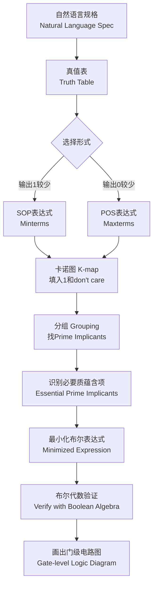
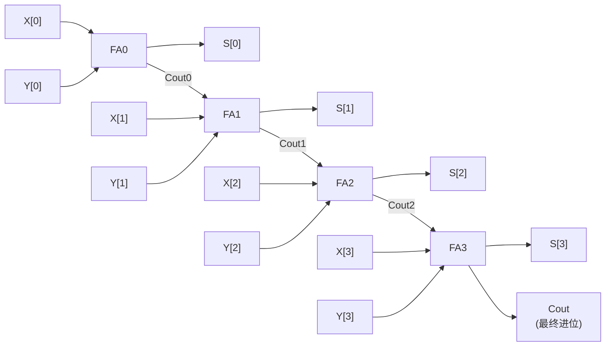
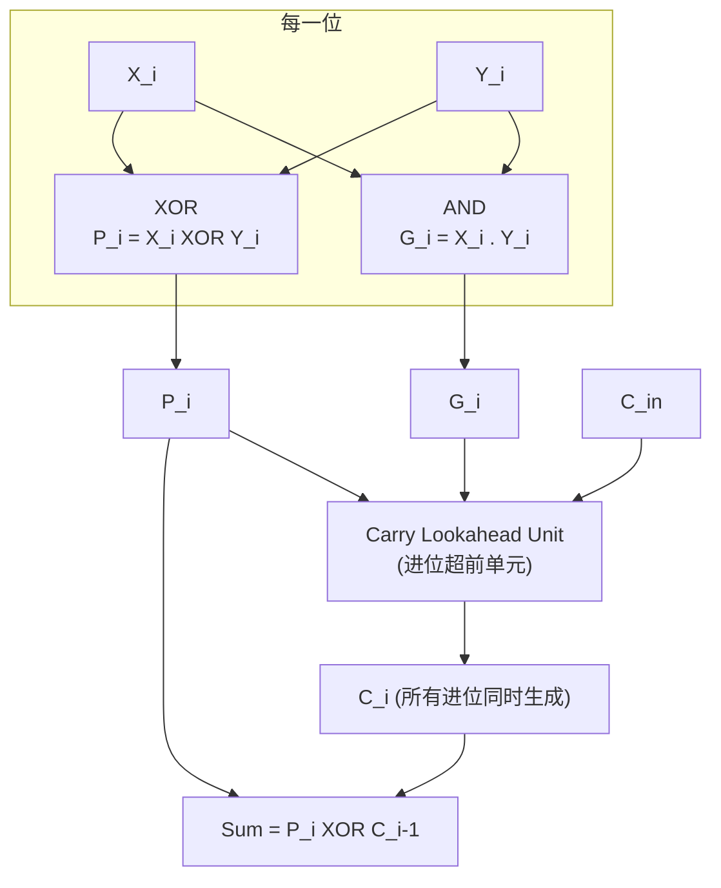

# 03 组合逻辑 (Combinational Logic)

> COMP30660 Computer Architecture & Organisation
> Professor Chris Bleakley, UCD School of Computer Science

---

## 目录

1. 逻辑电路基础 (Logic Circuits)
2. 电路规格描述 (Circuit Specification)
3. 逻辑图 (Logic Diagrams)
4. 逻辑设计 (Logic Design)
5. 布尔表达式 (Boolean Expressions)
6. 布尔代数 (Boolean Algebra)
7. 电路面积 (Circuit Area)
8. SOP与POS形式 (Sum-of-Products & Product-of-Sums)
9. 卡诺图 (Karnaugh Maps)
10. 组合电路设计流程
11. 常用逻辑电路 (Useful Logic Circuits)
12. 译码器 (Decoders)
13. 多路复用器 (Multiplexers)
14. 多路分配器 (Demultiplexers)
15. 编码器 (Encoders)
16. 算术电路 (Arithmetic Circuits)
17. ALU (Arithmetic Logic Unit)
18. 比较器 (Comparators)
19. 易混淆概念
20. 高频考点 (Exam Focus)

---

## 1. 逻辑电路基础 (Logic Circuits)

### 1.1 定义

> A logic circuit is an electronic circuit that processes digital signals (0s and 1s) using logic gates to perform a specific logical or arithmetic operation.

逻辑电路接受一组输入，产生一个或多个输出。在设计层面，输入和输出都有标签（labels），在正常操作中，所有输入和输出都具有二进制值（0 或 1）。

### 1.2 两类逻辑电路

| 类型 | 英文 | 定义 | 特点 |
|------|------|------|------|
| 组合逻辑电路 | Combinational Circuit | 输出仅取决于当前输入值 | 无记忆 (no memory) |
| 时序逻辑电路 | Sequential Circuit | 输出取决于当前和之前的输入值 | 有记忆 (has memory) |

本章专注于组合逻辑电路（Combinational Circuits）。

### 1.3 设计层次 (Design Hierarchy)

```
Application Software (程序)
    -> Operating Systems (操作系统)
        -> Architecture (架构: 指令、寄存器、格式)
            -> Microarchitecture (微架构: 功能单元)
                -> Logic (逻辑: 加法器、存储器等)
                    -> Digital Circuits (数字电路: AND gates, NOT gates等)
                        -> Analog Circuits (模拟电路: 放大器、滤波器等)
                            -> Devices (器件: 晶体管等)
                                -> Physics (物理: 电子)
```

---

## 2. 电路规格描述 (Circuit Specification)

### 2.1 自然语言规格 (Natural Language Specification)

描述电路输入和输出之间的功能关系。例如：

> The circuit has three inputs: A, B, C. The circuit has one output: Y. The output Y is 1 if and only if (iff) A=1 or (A,B,C)=(0,0,1).

自然语言规格直观但不精确，需要真值表来补充。

### 2.2 真值表 (Truth Table)

> A truth table is a table that shows all possible combinations of input values and the corresponding output values for a digital circuit.

构造方法：
1. 为每个输入和每个输出分配一列
2. 以二进制计数方式列出所有可能的输入组合（0, 1, 2, 3, ...）
3. 根据规格填入输出值

示例真值表（对应上述自然语言规格）：

| A | B | C | Y |
|---|---|---|-----|
| 0 | 0 | 0 | 0 |
| 0 | 0 | 1 | 1 |
| 0 | 1 | 0 | 0 |
| 0 | 1 | 1 | 0 |
| 1 | 0 | 0 | 1 |
| 1 | 0 | 1 | 1 |
| 1 | 1 | 0 | 1 |
| 1 | 1 | 1 | 1 |

### 2.3 时序图 (Timing Diagram)

> A timing diagram is a graphical representation that shows how digital signals change over time in a circuit or system.

时序图展示输入和输出值随时间变化的波形图。虚线标记了特定时间点上的信号值。

---

## 3. 逻辑图 (Logic Diagrams)

### 3.1 定义

> A logic diagram is a graphical representation showing how logic gates are interconnected to perform a specific logical function.

逻辑图描述电路的实现结构（implementation），而非仅仅是规格（specification）。

### 3.2 逻辑门汇总 (Logic Gates Recap)

| 门名 | 图形符号 | 布尔表达式 | 真值表 | 功能描述 |
|------|----------|-----------|--------|----------|
| NOT | 三角形+圆圈 | Y = Ā 或 Y = A' | A=0 -> Y=1; A=1 -> Y=0 | 取反 |
| AND | D形 | Y = A . B 或 Y = AB | 仅当 A=1 且 B=1 时 Y=1 | 与 |
| NAND | AND + 圆圈 | Y = \overline{A . B} | AND取反 | 与非 |
| OR | 弧形 | Y = A + B | 只要 A=1 或 B=1 则 Y=1 | 或 |
| NOR | OR + 圆圈 | Y = \overline{A + B} | OR取反 | 或非 |
| XOR | OR + 额外弧线 | Y = A \oplus B | 仅当 A != B 时 Y=1 | 异或 |
| XNOR | XOR + 圆圈 | Y = \overline{A \oplus B} 或 Y = A \odot B | 仅当 A = B 时 Y=1 | 同或 |

**NOT gate 真值表：**

| A | Y = A' |
|---|--------|
| 0 | 1 |
| 1 | 0 |

**AND gate 真值表：**

| A | B | Y = AB |
|---|---|--------|
| 0 | 0 | 0 |
| 0 | 1 | 0 |
| 1 | 0 | 0 |
| 1 | 1 | 1 |

**OR gate 真值表：**

| A | B | Y = A+B |
|---|---|--------|
| 0 | 0 | 0 |
| 0 | 1 | 1 |
| 1 | 0 | 1 |
| 1 | 1 | 1 |

**XOR gate 真值表：**

| A | B | Y = A \oplus B |
|---|---|-------------|
| 0 | 0 | 0 |
| 0 | 1 | 1 |
| 1 | 0 | 1 |
| 1 | 1 | 0 |

**NAND gate 真值表：**

| A | B | Y = \overline{AB} |
|---|---|-------------------|
| 0 | 0 | 1 |
| 0 | 1 | 1 |
| 1 | 0 | 1 |
| 1 | 1 | 0 |

**NOR gate 真值表：**

| A | B | Y = \overline{A+B} |
|---|---|---------------------|
| 0 | 0 | 1 |
| 0 | 1 | 0 |
| 1 | 0 | 0 |
| 1 | 1 | 0 |

**XNOR gate 真值表：**

| A | B | Y = A \odot B |
|---|---|-------------|
| 0 | 0 | 1 |
| 0 | 1 | 0 |
| 1 | 0 | 0 |
| 1 | 1 | 1 |

### 3.3 电子元件符号

| 元件 | 符号 | 说明 |
|------|------|------|
| POWER / SUPPLY | — | 电源 |
| GROUND | — | 接地 |
| BUFFER | — | 电压增强 |
| PIN | — | 仿真中切换0/1 |
| LED | — | Input=1时亮, Input=0时灭 |

### 3.4 逻辑图 -> 真值表的转换方法

1. 标注所有输入、输出和内部节点（internal nodes）
2. 在真值表中列出输入、输出和内部节点作为列标题
3. 列出所有可能的输入组合
4. 找到一个所有输入值都已填入但输出尚未填入的门
5. 根据该门的功能特性填充其输出列
6. 重复步骤4和5，直到所有电路输出值都已填入

---

## 4. 逻辑设计 (Logic Design)

### 4.1 设计方法

从自然语言规格出发设计电路的步骤：

1. 识别电路的输入和输出
2. 说明输入和输出的含义
3. 画出电路的真值表
4. 手动识别实现真值表的逻辑电路
5. 写出电路的布尔表达式
6. 画出电路的逻辑图

### 4.2 示例：比较两个2位数是否相等

**设计一个电路判断两个2位数是否相等：**

**Step 1 & 2 - 输入和输出：**
- 输入 A: 2位，标记为 A[1] (MSB) 和 A[0] (LSB)
- 输入 B: 2位，标记为 B[1] (MSB) 和 B[0] (LSB)
- 输出 Y: 1位
- 含义：A和B是范围0到3的整数。当A=B时Y=1，否则Y=0

**Step 3 - 真值表：**

| A[1] | A[0] | B[1] | B[0] | Y |
|------|------|------|------|---|
| 0 | 0 | 0 | 0 | 1 |
| 0 | 0 | 0 | 1 | 0 |
| 0 | 0 | 1 | 0 | 0 |
| 0 | 0 | 1 | 1 | 0 |
| 0 | 1 | 0 | 0 | 0 |
| 0 | 1 | 0 | 1 | 1 |
| 0 | 1 | 1 | 0 | 0 |
| 0 | 1 | 1 | 1 | 0 |
| 1 | 0 | 0 | 0 | 0 |
| 1 | 0 | 0 | 1 | 0 |
| 1 | 0 | 1 | 0 | 1 |
| 1 | 0 | 1 | 1 | 0 |
| 1 | 1 | 0 | 0 | 0 |
| 1 | 1 | 0 | 1 | 0 |
| 1 | 1 | 1 | 0 | 0 |
| 1 | 1 | 1 | 1 | 1 |

**Step 4-6 - 电路实现：**

XNOR门的特点是当且仅当两个输入相等时输出为1。因此：
- 用一个XNOR门判断 A[0] 和 B[0] 是否相等
- 用另一个XNOR门判断 A[1] 和 B[1] 是否相等
- 用一个AND门组合两个XNOR的结果

**布尔表达式：** `Y = (A[1] \odot B[1]) . (A[0] \odot B[0])`

只有当MSBs相等且LSBs相等时，两个数才相等。

---

## 5. 布尔表达式 (Boolean Expressions)

### 5.1 定义

> A Boolean expression is a logical statement made up of Boolean variables and logical operations.

- **变量 (Variable)**：表示逻辑值（True或False）的字母
- **逻辑运算 (Logical Operation)**：根据定义的逻辑规则，从一个或多个布尔输入确定一个布尔输出

### 5.2 布尔表达式到逻辑电路的映射

```
Y = A + B'
```

- 右侧 (RHS) 变量 (A, B) 对应电路输入
- 右侧运算符 (+, ') 对应逻辑门 (OR, NOT)
- 左侧 (LHS) 变量 (Y) 对应电路输出

### 5.3 运算优先级 (Precedence Rules)

运算优先级从高到低：

| 优先级 | 运算 | 符号 |
|--------|------|------|
| 最高 | 括号 Parentheses | (X) |
| | NOT | X' 或 X̄ |
| | AND | X.Y |
| | OR | X + Y |
| 最低 | 等于 Equals | X = Y |

**示例：** `A + B.C` 等同于 `A + (B.C)`，因为AND优先于OR

### 5.4 布尔表达式 -> 真值表的转换方法

以 `Y = A + B'` 为例：

1. 列出右侧变量作为列标题 (A, B)
2. 列出所有可能的变量值组合 (00, 01, 10, 11)
3. 找到优先级最高且尚未加入真值表的运算
4. 为识别出的运算创建并填充一列
5. 重复步骤3和4，直到所有运算都已加入真值表

**示例过程：**

| A | B | NOT B | A OR (NOT B) | Y |
|---|---|-------|--------------|---|
| 0 | 0 | 1 | 1 | 1 |
| 0 | 1 | 0 | 0 | 0 |
| 1 | 0 | 1 | 1 | 1 |
| 1 | 1 | 0 | 1 | 1 |

### 5.5 逻辑图 <-> 布尔表达式的相互转换

**逻辑图 -> 布尔表达式：**
1. 标注所有节点
2. 写出直接连接电路输出的门的布尔表达式
3. 选择当前表达式中的某个变量
4. 将该变量替换为其输入门对应的运算
5. 重复直到表达式中只包含电路输入变量
6. 根据优先级规则消除不必要的括号

**布尔表达式 -> 逻辑图：**
1. 画出与RHS变量对应的电路输入
2. 找到布尔表达式中一个所有输入都已在图中画出的门
3. 在图中画出对应的门
4. 重复2和3，直到所有运算都在图中

---

## 6. 布尔代数 (Boolean Algebra)

### 6.1 定义

> Boolean algebra is a branch of mathematics that deals with variables that have only two possible values and logical operations applied to the variables.

> Simplification means reducing a digital circuit's complexity while maintaining its functionality.

关键用途：简化逻辑电路。

**功能等效 (Functionally Equivalent)**：两个电路的真值表输入和输出列完全匹配，但结构可能不同。

### 6.2 布尔代数定律、规则和定理

#### OR规则 (OR Rules)

| 规则 | 名称 | 验证 |
|------|------|------|
| A + 1 = 1 | OR Dominance (支配律) | 任何变量OR 1，结果总是1 |
| A + 0 = A | OR Identity (恒等律) | 任何变量OR 0，结果等于本身 |
| A + A = A | OR Idempotent (幂等律) | 任何变量OR自身，结果等于本身 |

#### AND规则 (AND Rules)

| 规则 | 名称 | 验证 |
|------|------|------|
| A . 1 = A | AND Identity (恒等律) | 任何变量AND 1，结果等于本身 |
| A . 0 = 0 | AND Dominance (支配律) | 任何变量AND 0，结果总是0 |
| A . A = A | AND Idempotent (幂等律) | 任何变量AND自身，结果等于本身 |

#### 交换律 (Commutative Law)

| OR | AND |
|--------|--------|
| A + B = B + A | A . B = B . A |

输入顺序无关紧要，门的输入顺序不影响输出。

#### 结合律 (Associative Law)

| OR | AND |
|------------|-----------------|
| (A + B) + C = A + (B + C) | (A . B) . C = A . (B . C) |

门的组合顺序无关紧要。

#### 分配律 (Distributive Law)

| OR形式 | AND形式 |
|--------|---------|
| A . (B + C) = (A.B) + (A.C) | A + (B.C) = (A + B).(A + C) |

门在括号间"分配"。

#### 互补律 (Complements)

| OR互补 | AND互补 |
|--------|---------|
| A + A' = 1 | A . A' = 0 |
| A=0时，A'=1，A+A'=1 | A=0时，A'=1，A.A'=0 |
| A=1时，A'=0，A+A'=1 | A=1时，A'=0，A.A'=0 |

#### 吸收律 (Absorption)

| 形式1 | 形式2 |
|-------|-------|
| A + A.B = A | A + A'.B = A + B |
| A . (A + B) = A | A . (A' + B) = A . B |

合并等效的真值表行，消除冗余变量。

#### 归约律 (Reduction)

| OR-AND形式 | AND-OR形式 |
|------------|------------|
| A.B + A.B' = B | (A + B).(A + B') = B |

#### 德摩根定律 (De Morgan's Laws)

| 形式1 | 形式2 |
|-------|-------|
| \overline{A + B} = \overline{A} . \overline{B} | \overline{A . B} = \overline{A} + \overline{B} |

"Break the bar, change the operation" —— 取反时，AND变OR，OR变AND，同时各项取反。

#### 双重否定律 (Double Negation / Involution)

```
A'' = A
```

### 6.3 XOR相关规则

| 规则 | 表达式 |
|------|--------|
| Identity | A \oplus 0 = A |
| Self-inverse | A \oplus A = 0 |
| Commutative | A \oplus B = B \oplus A |
| Associative | (A \oplus B) \oplus C = A \oplus (B \oplus C) |
| Involution (with 1) | A \oplus 1 = A' |
| Relation to OR/AND/NOT | A \oplus B = (A.B') + (A'.B) |

### 6.4 电路简化示例

简化表达式：`A.B.C + A.B.C' + A'.B.C`

| 步骤 | 等式 | 理由 |
|------|------|------|
| 1 | = A.B.C + A.B.C' + A.B.C + A'.B.C | Repeat term（重复A.B.C项） |
| 2 | = (A + A').B.C + A.B.(C + C') | Distribution（分配律） |
| 3 | = (1).B.C + A.B.(1) | Complements（互补律，A+A'=1） |
| 4 | = B.C + A.B | Identity（恒等律） |

结果从3个三输入项变为2个两输入项，大大简化。

### 6.5 功能对等等式示例

```
(A + B).(A + C) = A + B.C
```

左侧电路（2个OR + 1个AND）面积更大，右侧电路（1个OR + 1个AND）面积更小，功能完全相同。

---

## 7. 电路面积 (Circuit Area)

### 7.1 门等效面积 (Gate Equivalent, GE)

电路成本由硅芯片表面面积决定。面积以2输入NAND门（NAND2）为基准单位计算。

| 门类型 | Gate类型 | 面积 (GE) |
|--------|----------|-----------|
| NOT | 非门 | 0.7 |
| AND | 与门 | 1.3 |
| OR | 或门 | 1.3 |
| NAND | 与非门 | 1 (基准) |
| NOR | 或非门 | 1 |
| XNOR | 同或门 | 2 |
| XOR | 异或门 | 2 |

*注：以上为2输入门的面积，NOT门为1输入。*

### 7.2 计算电路面积的方法

1. 统计电路中每种门的数量
2. 将每种门的数量乘以其GE面积
3. 将各类型的面积相加

**示例：** 比较 `Y1 = (A+B).(A+C)` 和 `Y2 = A + B.C`

| 门类型 | Y1数量 (GE) | Y2数量 (GE) |
|--------|------------|------------|
| AND | 1 x 1.3 = 1.3 | 1 x 1.3 = 1.3 |
| OR | 2 x 1.3 = 2.6 | 1 x 1.3 = 1.3 |
| **总计** | **3.9 GE** | **2.6 GE** |

Y2比Y1小约33%，更便宜。

---

## 8. SOP与POS形式 (Sum-of-Products & Product-of-Sums)

### 8.1 Sum-of-Products (SOP) —— 积之和

**定义：** SOP形式由若干乘积项（product terms / minterms）通过OR连接而成。每项包含所有输入变量（原变量或反变量）。

**从真值表推导SOP表达式：**
1. 找出所有输出Y=1的行
2. 对每一行，写出minterm：若变量=1，用原变量；若变量=0，用反变量（取反）
3. 将所有minterm用OR连接

**示例：** 以下真值表

| A | B | C | Y |
|---|---|---|---|
| 0 | 0 | 0 | 0 |
| 0 | 0 | 1 | 1 | <- Y=1，minterm = A'B'C
| 0 | 1 | 0 | 0 |
| 0 | 1 | 1 | 0 |
| 1 | 0 | 0 | 1 | <- Y=1，minterm = AB'C'
| 1 | 0 | 1 | 1 | <- Y=1，minterm = AB'C
| 1 | 1 | 0 | 1 | <- Y=1，minterm = ABC'
| 1 | 1 | 1 | 1 | <- Y=1，minterm = ABC

**SOP表达式：**
```
Y = A'B'C + AB'C' + AB'C + ABC' + ABC
```

### 8.2 Product-of-Sums (POS) —— 和之积

**定义：** POS形式由若干和项（sum terms / maxterms）通过AND连接而成。每项包含所有输入变量。

**从真值表推导POS表达式：**
1. 找出所有输出Y=0的行
2. 对每一行，写出maxterm：若变量=0，用原变量；若变量=1，用反变量
3. 将所有maxterm用AND连接

**示例：** 同上真值表，Y=0的行：

| A | B | C | Y | Maxterm |
|---|---|---|---|---------|
| 0 | 0 | 0 | 0 | A + B + C |
| 0 | 1 | 0 | 0 | A + B' + C |
| 0 | 1 | 1 | 0 | A + B' + C' |

**POS表达式：**
```
Y = (A + B + C)(A + B' + C)(A + B' + C')
```

### 8.3 SOP vs POS 比较

| 特性 | SOP | POS |
|------|-----|-----|
| 结构 | AND项用OR连接 | OR项用AND连接 |
| 关注 | Y=1的行 (minterms) | Y=0的行 (maxterms) |
| 门级实现 | AND-OR两级门 | OR-AND两级门 |
| 适用场景 | 输出1较少时 | 输出0较少时 |
| 项内规则 | 1->原变量, 0->反变量 | 0->原变量, 1->反变量 |

---

## 9. 卡诺图 (Karnaugh Maps / K-maps)

> K-map is a graphical method for simplifying Boolean expressions, especially useful for up to 4 variables.

### 9.1 2变量K-map

**结构：**

```
      B=0  B=1
A=0 | m0 | m1 |
A=1 | m2 | m3 |
```

**示例：** 简化 `Y = A'B + AB` (即 XOR)

```
      B=0  B=1
A=0 | 0  | 1  |
A=1 | 1  | 0  |
```

填入1的格子对应的minterms: A'B 和 AB'。无法进一步合并，所以 `Y = A'B + AB' = A ⊕ B`。

**示例：** 简化 `Y = A'B' + A'B + AB`

```
      B=0  B=1
A=0 | 1  | 1  |  <- 这两个1相邻，合并为 A'
A=1 | 0  | 1  |  <- 这个1与下面无相邻A=0的
```

合并：A'B' + A'B = A'(B'+B) = A'；剩下的AB无法再合并。

`Y = A' + AB` 使用吸收律进一步简化：`Y = A' + B`

### 9.2 3变量K-map

**结构（注意列顺序为00, 01, 11, 10——格雷码Gray Code）：**

```
       BC
       00  01  11  10
A=0 |    |    |    |    |
A=1 |    |    |    |    |
```

**关键：** 3变量K-map的列顺序必须是 00, 01, 11, 10（格雷码），确保相邻格之间只有1位变化。首尾列（00和10）也为相邻。

**示例：** 简化前述SOP: `Y = A'B'C + AB'C' + AB'C + ABC' + ABC`

填入K-map：
```
       BC
       00  01  11  10
A=0 |  0 | 1 | 0 | 0 |
A=1 |  1 | 1 | 1 | 1 |
```

**分组（Grouping）：**
- A=1的整行：4个1 -> 简化为 `A`
- A=0, BC=01的那个1 -> `A'B'C`

**步骤分析：**
- 第2行所有4格为1：A=1的所有组合，这是A的表达式
- 第1行第2格为1：A=0, B=0, C=1

**最终表达式：** `Y = A + A'B'C`

使用吸收律：`Y = A + B'C`（因为 `A + A'B'C = A + B'C`）

### 9.3 4变量K-map

**结构（行列均为格雷码顺序）：**

```
        CD
        00  01  11  10
AB=00 |    |    |    |    |
AB=01 |    |    |    |    |
AB=11 |    |    |    |    |
AB=10 |    |    |    |    |
```

**重要：** 行顺序也是00, 01, 11, 10（格雷码）。首尾行相邻，首尾列相邻（K-map是一个环面/torus的展开）。

**示例：** 简化 `F(A,B,C,D) = Σm(0,1,2,4,5,6,8,9,12,13,14)`

填入K-map：
```
        CD
        00  01  11  10
AB=00 | 1 | 1 | 0 | 1 |
AB=01 | 1 | 1 | 0 | 1 |
AB=11 | 1 | 1 | 0 | 1 |
AB=10 | 1 | 1 | 0 | 0 |
```

**分组：**
1. CD=00的整列（4个1，AB从00到10）= C'D'
2. CD=01的整列（4个1）= C'D
3. 上面的C'D'和C'D合并 = C'D' + C'D = C'(D'+D) = C'
4. AB=00, 01, 11的CD=10列（3个1）= 不能完美分组
5. AB=00~11且CD=00的矩形（4个1）= B'C'？需要检查

实际上更仔细地分析：
- 左上角 4x2 的矩形 = all cells where C=0 (8个1)：即 `C'`
- 右上角最下方3个1 (AB=00,01,11 and CD=10)：可以看作 `B'CD'`？需要确认

最终简化结果需要逐步检验。

### 9.4 最小化步骤 (Minimization Steps)

1. **填入K-map：** 根据真值表在对应格子中填入1（SOP情况）或0（POS情况）
2. **识别质蕴含项 (Prime Implicants)：** 将1分组为尽可能大的矩形，大小为2的幂次(1,2,4,8,...)，形状为1x1、1x2、2x2、2x4等
3. **识别必要质蕴含项 (Essential Prime Implicants)：** 有些1只能被某个prime implicant覆盖（无法被其他更大的组覆盖），这样的prime implicant是essential的
4. **覆盖所有1：** 确保所有1至少被一个组覆盖（即所有1都被包含）
5. **写出最小化表达式：** 每个分组对应一个简化项——如果某个变量在整个分组中值不变，就保留该变量；如果变化，就消除该变量

### 9.5 Prime Implicant vs Essential Prime Implicant

| 术语 | 中文 | 定义 |
|------|------|------|
| Prime Implicant | 质蕴含项 | 不能再扩大的合法分组矩形，包含2^k个相邻的1 |
| Essential Prime Implicant | 必要质蕴含项 | 至少覆盖了一个只在该分组中出现的1（即该1无法被其他prime implicant覆盖） |

**示例：**
```
       BC
       00  01  11  10
A=0 | 1 | 0 | 0 | 1 |
A=1 | 0 | 1 | 1 | 0 |
```

- 左上角A'B'C'（单个1）：1的prime implicant就是它本身，且是essential的
- 右上角A'BC'：同上
- 中间A'BC和ABC：可组成竖直2格AB'C和ABC，这是BC=11分组 -> 简化为BC

### 9.6 Don't Care条件 (Don't Care Conditions)

**定义：** 在某些电路中，某些输入组合要么不可能出现，要么我们不在意输出值。这些情况用 X 或 d 表示。

**Don't Care在K-map中的使用：**
- 在K-map中用 X 标记
- 在分组时，可以将 X 视为1（有利于形成更大的组），也可以视为0（忽略）
- 灵活使用——只有在能扩大分组、帮助简化时才使用

**示例：** BCD码中，有效值是0-9（0000到1001），1010到1111是无效输入组合。这些无效组合可以标记为don't care。

```
        CD
        00  01  11  10
AB=00 | 1 | 1 | 1 | 1 |  <- 0-3
AB=01 | 1 | 1 | 1 | 1 |  <- 4-7
AB=11 | X | X | X | X |  <- 无效，don't care
AB=10 | 1 | 1 | X | X |  <- 8,9, 无效
```

---

## 10. 组合电路设计流程



**详细步骤：**

1. **问题规格 (Problem Specification)：** 用自然语言描述电路应实现的功能
2. **真值表 (Truth Table)：** 列出所有可能的输入组合及期望的输出
3. **布尔表达式推导 (Boolean Expression Derivation)：** 从真值表写出SOP或POS表达式
4. **简化 (Simplification)：** 使用K-map或布尔代数简化表达式
5. **电路实现 (Circuit Implementation)：** 将简化后的表达式转换为逻辑门的互连

---

## 11. 常用逻辑电路 (Useful Logic Circuits)

### 11.1 N输入逻辑门 (N-Input Logic Gates)

一个N输入的AND/OR门可以由 N-1个2输入门的二叉树构建。

例如，8输入OR门：4个2输入OR -> 2个2输入OR -> 1个2输入OR（4:2:1树结构）。

### 11.2 Enable Gate（使能门）

一种对AND门的概念化思维方式：
- 一个输入视为**控制输入 (Control)**
- 另一个输入视为**数据输入 (Data)**

| Control | Data | Y | 描述 |
|---------|------|---|------|
| 0 | 0 | 0 | Disabled（禁用） |
| 0 | 1 | 0 | Disabled |
| 1 | 0 | 0 | Enabled（启用），输出=Data |
| 1 | 1 | 1 | Enabled，输出=Data |

**核心逻辑：** 当Control=1时，Y=Data；当Control=0时，Y=0。本质上就是一个AND门，但赋予了控制/数据的语义。

---

## 12. 译码器 (Decoders)

### 12.1 n-to-2^n Decoder

**定义：** n-to-2^n译码器将n位输入转换成2^n个输出。对于每个输入组合，恰好只有一个输出为1（active high），其余为0。

**2-to-4 Decoder 真值表：**

| A1 | A0 | Y3 | Y2 | Y1 | Y0 |
|----|----|----|----|----|----|
| 0 | 0 | 0 | 0 | 0 | 1 |
| 0 | 1 | 0 | 0 | 1 | 0 |
| 1 | 0 | 0 | 1 | 0 | 0 |
| 1 | 1 | 1 | 0 | 0 | 0 |

**3-to-8 Decoder 真值表：**

| A2 | A1 | A0 | Y7 | Y6 | Y5 | Y4 | Y3 | Y2 | Y1 | Y0 |
|----|----|----|----|----|----|----|----|----|----|----|
| 0 | 0 | 0 | 0 | 0 | 0 | 0 | 0 | 0 | 0 | 1 |
| 0 | 0 | 1 | 0 | 0 | 0 | 0 | 0 | 0 | 1 | 0 |
| 0 | 1 | 0 | 0 | 0 | 0 | 0 | 0 | 1 | 0 | 0 |
| 0 | 1 | 1 | 0 | 0 | 0 | 0 | 1 | 0 | 0 | 0 |
| 1 | 0 | 0 | 0 | 0 | 0 | 1 | 0 | 0 | 0 | 0 |
| 1 | 0 | 1 | 0 | 0 | 1 | 0 | 0 | 0 | 0 | 0 |
| 1 | 1 | 0 | 0 | 1 | 0 | 0 | 0 | 0 | 0 | 0 |
| 1 | 1 | 1 | 1 | 0 | 0 | 0 | 0 | 0 | 0 | 0 |

**逻辑：** `Yi = 1` 当且仅当输入编码等于 i。例如 `Y3 = A1.A0`，`Y5 = A2.A0`。

### 12.2 带Enable输入的Decoder

当Enable=0时，所有输出为0（禁用）；当Enable=1时，正常译码。

**2-to-4 Decoder with Enable：**

| Enable | A1 | A0 | Y3 | Y2 | Y1 | Y0 |
|--------|----|----|----|----|----|----|
| 0 | X | X | 0 | 0 | 0 | 0 |
| 1 | 0 | 0 | 0 | 0 | 0 | 1 |
| 1 | 0 | 1 | 0 | 0 | 1 | 0 |
| 1 | 1 | 0 | 0 | 1 | 0 | 0 |
| 1 | 1 | 1 | 1 | 0 | 0 | 0 |

---

## 13. 多路复用器 (Multiplexers / MUX)

### 13.1 定义

> A multiplexer (MUX) selects one of the data inputs based on the value of the select input and outputs the selected value.

MUX根据选择输入(select input)的值，从多个数据输入中选择一个输出。

### 13.2 2-to-1 MUX

**功能：** 当S=0时输出A，当S=1时输出B

**真值表：**

| S | A | B | Y |
|---|---|---|---|
| 0 | 0 | 0 | 0 |
| 0 | 0 | 1 | 0 |
| 0 | 1 | 0 | 1 |
| 0 | 1 | 1 | 1 |
| 1 | 0 | 0 | 0 |
| 1 | 0 | 1 | 1 |
| 1 | 1 | 0 | 0 |
| 1 | 1 | 1 | 1 |

**布尔表达式：** `Y = S'.A + S.B`

**门级实现：** 2个AND门 + 1个NOT门 + 1个OR门
- AND1：S' . A
- AND2：S . B
- OR: (S'.A) + (S.B)

### 13.3 MUX选择逻辑

```mermaid
flowchart TD
    A[数据输入 Data Inputs<br/>D0, D1, D2, ..., D_{n-1}] --> B[选择逻辑<br/>Select Logic]
    C[选择线 Select Lines<br/>S0, S1, ...] --> B
    B --> D{输出 Y}
    E["Y = D_k，其中 k = 选择线的二进制值"] --> D
```

### 13.4 4-to-1 MUX

**选择线：** S1, S0（2条选择线，选择4个输入之一）

**真值表：**

| S1 | S0 | Y |
|----|----|----|
| 0 | 0 | D0 |
| 0 | 1 | D1 |
| 1 | 0 | D2 |
| 1 | 1 | D3 |

**布尔表达式：**
```
Y = S1'.S0'.D0 + S1'.S0.D1 + S1.S0'.D2 + S1.S0.D3
```

### 13.5 8-to-1 MUX

**选择线：** S2, S1, S0（3条选择线）

| S2 | S1 | S0 | Y |
|----|----|----|----|
| 0 | 0 | 0 | D0 |
| 0 | 0 | 1 | D1 |
| 0 | 1 | 0 | D2 |
| 0 | 1 | 1 | D3 |
| 1 | 0 | 0 | D4 |
| 1 | 0 | 1 | D5 |
| 1 | 1 | 0 | D6 |
| 1 | 1 | 1 | D7 |

**布尔表达式：**
```
Y = S2'.S1'.S0'.D0 + S2'.S1'.S0.D1 + S2'.S1.S0'.D2 + S2'.S1.S0.D3
  + S2.S1'.S0'.D4 + S2.S1'.S0.D5 + S2.S1.S0'.D6 + S2.S1.S0.D7
```

**门级实现（8:1 MUX）：**
可用7个2:1 MUX按树形结构级联实现（4:2:1结构），也可直接用8个3输入AND门+1个8输入OR门实现。

---

## 14. 多路分配器 (Demultiplexers / DEMUX)

**定义：** DEMUX是MUX的反操作。它将一个输入信号路由到2^n个输出之一，由n条选择线决定。

**1-to-4 DEMUX 真值表：**

| S1 | S0 | Y3 | Y2 | Y1 | Y0 |
|----|----|----|----|----|----|
| 0 | 0 | 0 | 0 | 0 | D |
| 0 | 1 | 0 | 0 | D | 0 |
| 1 | 0 | 0 | D | 0 | 0 |
| 1 | 1 | D | 0 | 0 | 0 |

DEMUX本质上是带Enable的Decoder + 数据输入的组合。实际使用中通常用Decoder + 门来实现。

---

## 15. 编码器 (Encoders)

### 15.1 基本编码器

**定义：** Encoder是Decoder的反操作。它将2^n个输入中唯一为1的那个输入编码为n位二进制输出。

**4-to-2 Encoder 真值表：**

| D3 | D2 | D1 | D0 | A1 | A0 |
|----|----|----|----|----|----|
| 0 | 0 | 0 | 1 | 0 | 0 |
| 0 | 0 | 1 | 0 | 0 | 1 |
| 0 | 1 | 0 | 0 | 1 | 0 |
| 1 | 0 | 0 | 0 | 1 | 1 |

**逻辑：** `A1 = D2 + D3`，`A0 = D1 + D3`

### 15.2 优先编码器 (Priority Encoder)

**定义：** 当多个输入同时为1时，优先编码器输出最高优先级（通常编号最大或最小）的输入的编码。

**4-to-2 Priority Encoder（假设D3优先级最高）：**

| D3 | D2 | D1 | D0 | A1 | A0 | Valid |
|----|----|----|----|----|----|-------|
| 0 | 0 | 0 | 0 | 0 | 0 | 0 |
| 0 | 0 | 0 | 1 | 0 | 0 | 1 |
| 0 | 0 | 1 | X | 0 | 1 | 1 |
| 0 | 1 | X | X | 1 | 0 | 1 |
| 1 | X | X | X | 1 | 1 | 1 |

(X表示don't care)

Valid输出指示是否有任何输入为1。

---

## 16. 算术电路 (Arithmetic Circuits)

### 16.1 Half Adder（半加器）

**功能：** 将2个bit相加，产生Sum和Carry

**二进制加法：**
```
0 + 0 = 00
0 + 1 = 01
1 + 0 = 01
1 + 1 = 10
```

**真值表：**

| X | Y | Carry | Sum |
|---|---|-------|-----|
| 0 | 0 | 0 | 0 |
| 0 | 1 | 0 | 1 |
| 1 | 0 | 0 | 1 |
| 1 | 1 | 1 | 0 |

**布尔表达式：**
- **Carry = X . Y** （AND门 — 当两个输入都为1时才产生进位）
- **Sum = X \oplus Y** （XOR门 — 当两个输入不同时和为1）

**电路：** 1个AND门 + 1个XOR门

**门等效面积：** 1.3 (AND) + 2.0 (XOR) = 3.3 GE

### 16.2 Full Adder（全加器）

**功能：** 将3个bit相加（X, Y, Carry-In），产生Sum和Carry-Out

**真值表：**

| X | Y | Cin | Cout | Sum |
|---|---|------|------|-----|
| 0 | 0 | 0 | 0 | 0 |
| 0 | 0 | 1 | 0 | 1 |
| 0 | 1 | 0 | 0 | 1 |
| 0 | 1 | 1 | 1 | 0 |
| 1 | 0 | 0 | 0 | 1 |
| 1 | 0 | 1 | 1 | 0 |
| 1 | 1 | 0 | 1 | 0 |
| 1 | 1 | 1 | 1 | 1 |

**布尔表达式：**

**Sum = X \oplus Y \oplus Cin**

> 推导：Sum = X'.Y'.Cin + X'.Y.Cin' + X.Y'.Cin' + X.Y.Cin
>  = (X \oplus Y) \oplus Cin

**Cout = X.Y + X.Cin + Y.Cin**

> 推导：Cout = X'.Y.Cin + X.Y'.Cin + X.Y.Cin' + X.Y.Cin
>  = X.Y + X.Cin + Y.Cin（通过K-map简化或SOP化简）

### 16.3 用两个Half Adder构建Full Adder

```
     X ----+---- HA1 ----+---- HA2 ---- Sum
           |     |       |     |
     Y ----+   Sum1  Cin ----+  Sum2
                |             |
                |           Cout2
                |
              Cout1 ----+---- OR ---- Cout
                |       |
              Cout2 ----+
```

**Cout = Cout1 + Cout2**

**Sum = HA1的Sum与Cin的XOR**

这种方法非常优雅——全加器 = 两个半加器 + 一个OR门。

### 16.4 N位加法器 (N-bit Adder)

N位加法器的结构（以N位为例）：

```
X[n-1]Y[n-1]    X[3]Y[3]    X[2]Y[2]    X[1]Y[1]    X[0]Y[0]
    |               |           |           |           |
    FA      ...     FA          FA          FA          HA
    |               |           |           |           |
Cout  S[n-1]      S[3]        S[2]        S[1]        S[0]

S = X + Y
```

最低位用Half Adder（因为没有进位输入），其余位用Full Adder，高位的Cin来自低位的Cout。

### 16.5 4位加法器示例

计算 3 + 5：

```
         [3]   [2]   [1]   [0]
X         0     0     1     1    = 3
Y         0     1     0     1    = 5
Cin  +    0     1     1     1    (进位)
---------------------------------
S         1     0     0     0    = 8
```

### 16.6 Ripple Carry Adder（行波进位加法器）

**结构：** Full Adder级联，每一级的Cout连接到下一级的Cin。进位从低位到高位逐级"传播"。



**传播延迟问题 (Propagation Delay Problem)：**

Ripple Carry Adder的缺点是速度慢。因为每一位的进位依赖前一位的计算结果：
- 第0位FA产生Cout0需要 t_delay
- 第1位FA需要等待Cout0到达，再经过t_delay产生Cout1
- ...
- 第n-1位需要 n*t_delay

对于N位加法器，总延迟 = N * t_FA_delay。这是串行操作的瓶颈。

### 16.7 Carry Lookahead Adder (CLA，超前进位加法器)

**核心思想：** 不等待进位逐级传播，而是提前计算每一位的进位。

**Generate (生成) 信号：**
```
Gi = Xi . Yi
```
当Gi=1时，第i位一定会产生进位（无论Cin是多少），因为两个输入都为1。

**Propagate (传播) 信号：**
```
Pi = Xi \oplus Yi
```
当Pi=1时，第i位会将Cin传播到Cout。当Xi和Yi中恰好一个为1时，如果Cin=1，则Cout=1。

**CLA进位方程：**

```
C0 = Cin
C1 = G0 + P0.C0
C2 = G1 + P1.G0 + P1.P0.C0
C3 = G2 + P2.G1 + P2.P1.G0 + P2.P1.P0.C0
C4 = G3 + P3.G2 + P3.P2.G1 + P3.P2.P1.G0 + P3.P2.P1.P0.C0
```

**CLA逻辑流程：**



**CLA vs Ripple Carry 对比：**

| 特性 | Ripple Carry Adder | Carry Lookahead Adder |
|------|-------------------|-----------------------|
| 速度 | 慢 (O(N)延迟) | 快 (O(log N)延迟) |
| 复杂度 | 简单 (O(N)门) | 复杂 (O(N^2)门在朴素的CLA中，或O(N log N)用于层次化CLA) |
| 面积 | 小 | 大 |
| 适用场景 | 位数少、面积受限 | 位数多、对速度要求高 |
| 进位计算 | 串行逐位传播 | 并行超前计算 |

### 16.8 Half Subtractor（半减器）

**功能：** 两个1位二进制数相减

**真值表：**

| X | Y | Difference (D) | Borrow (Bout) |
|---|---|----------------|---------------|
| 0 | 0 | 0 | 0 |
| 0 | 1 | 1 | 1 |
| 1 | 0 | 1 | 0 |
| 1 | 1 | 0 | 0 |

**布尔表达式：**
- **Difference = X \oplus Y** (和Half Adder的Sum相同)
- **Borrow = X' . Y** (当X=0, Y=1时需要借位)

### 16.9 Full Subtractor（全减器）

**功能：** X - Y - Bin（考虑借位输入）

**真值表：**

| X | Y | Bin | D | Bout |
|---|---|-----|---|------|
| 0 | 0 | 0 | 0 | 0 |
| 0 | 0 | 1 | 1 | 1 |
| 0 | 1 | 0 | 1 | 1 |
| 0 | 1 | 1 | 0 | 1 |
| 1 | 0 | 0 | 1 | 0 |
| 1 | 0 | 1 | 0 | 0 |
| 1 | 1 | 0 | 0 | 0 |
| 1 | 1 | 1 | 1 | 1 |

**布尔表达式：**
- **D = X \oplus Y \oplus Bin** (和Full Adder的Sum相同)
- **Bout = X'.Y + X'.Bin + Y.Bin** (类似于Full Adder的Cout但X取反)

### 16.10 4位减法器 (4-bit Subtractor)

减法通过以下方式实现：翻转减数位然后加1。

```
X - Y = X + (NOT Y) + 1
```

因此，4位减法器 = 4个FA（Y输入经过NOT取反，最低位Cin=1）

**示例：** 7 - 3 = 4

```
         [3]   [2]   [1]   [0]
X         0     1     1     1    = 7
NOT Y     0     0     1     1    (3 = 0011, NOT = 1100)
                      +    1    Cin[0] = 1
---------------------------------
S         0     1     0     0    = 4
```

### 16.11 可编程加减法器 (Programmable Adder/Subtractor)

通过在Y输入端添加XOR门实现加法/减法的切换：

- 当**Control=0**（加法模式）：
  - XOR门传递Y的原始值（因为 Y XOR 0 = Y）
  - Cin[0] = 0
  - 执行 S = X + Y

- 当**Control=1**（减法模式）：
  - XOR门翻转Y的每一位（因为 Y XOR 1 = NOT Y）
  - Cin[0] = 1
  - 执行 S = X - Y（即 X + (NOT Y) + 1）

---

## 17. ALU (Arithmetic Logic Unit) 算术逻辑单元

### 17.1 基本概念

**定义：** ALU是CPU的核心计算单元，能够执行多种算术和逻辑运算。它接受操作数和操作选择码，产生运算结果。

**基本ALU功能：**

| 操作选择 | 算术运算 | 逻辑运算 |
|----------|----------|----------|
| ADD | A + B | — |
| SUB | A - B | — |
| AND | — | A AND B |
| OR | — | A OR B |
| XOR | — | A XOR B |
| NOT | — | NOT A |
| NAND | — | A NAND B |
| NOR | — | A NOR B |

**ALU的核心结构：**

```
操作数 A (n位) -----+----> [算术单元] ----+
                     |                    |
操作数 B (n位) -----+----> [逻辑单元] ----+----> [MUX] ----> 结果 Y (n位)
                     |                    |         |
操作选择码 ----------+----> [控制单元] ---+---------+
                                        |
状态标志 <--- [标志生成器] <-------------+
                                        Carry, Zero, Negative, Overflow
```

**ALU输出还包括状态标志位 (Status Flags)：**
- Zero (Z): 结果为0
- Carry (C): 有进位/借位
- Negative (N): 结果为负数（最高位为1）
- Overflow (V): 有符号数溢出

---

## 18. 比较器 (Comparators)

### 18.1 1位比较器 (1-bit Magnitude Comparator)

**功能：** 比较两个1位数字A和B

**输出：** 三个比较结果
- A_eq_B (A = B)：XNOR
- A_gt_B (A > B)：A AND NOT B
- A_lt_B (A < B)：NOT A AND B

**真值表：**

| A | B | A>B | A=B | A<B |
|---|---|-----|-----|-----|
| 0 | 0 | 0 | 1 | 0 |
| 0 | 1 | 0 | 0 | 1 |
| 1 | 0 | 1 | 0 | 0 |
| 1 | 1 | 0 | 1 | 0 |

**布尔表达式：**
- A_eq_B = A \odot B = A \oplus B̄
- A_gt_B = A . B̄
- A_lt_B = Ā . B

### 18.2 N位比较器 (n-bit Magnitude Comparator)

**原理：** 从最高位(MSB)开始比较，第一个不相等的位决定比较结果。

**对于4位比较器：**

从MSB到LSB比较算法：
```
A_eq_B = (A[3] == B[3]) AND (A[2] == B[2]) AND (A[1] == B[1]) AND (A[0] == B[0])

A_gt_B = (A[3] > B[3]) OR
         (A[3] == B[3] AND A[2] > B[2]) OR
         (A[3] == B[3] AND A[2] == B[2] AND A[1] > B[1]) OR
         (A[3] == B[3] AND A[2] == B[2] AND A[1] == B[1] AND A[0] > B[0])
```

**级联比较器：** 可以将多个小型比较器级联构建更大的比较器。例如用4个1位比较器构建4位比较器。

**门实现示例（2位比较器，见Logic Design章节）：**
- 用XNOR门比较每位
- 用AND门组合结果判断相等
- 对于不等的情况需要多个门的组合

---

## 19. 易混淆概念 (Easily Confused Concepts)

### 19.1 SOP vs POS：何时使用

| 对比维度 | SOP (Sum-of-Products) | POS (Product-of-Sums) |
|----------|----------------------|----------------------|
| 结构 | AND-OR | OR-AND |
| 关注点 | 输出为1的行 (minterms) | 输出为0的行 (maxterms) |
| 效率选择 | 当输出1较少时效率高 | 当输出0较少时效率高 |
| 项内规则 | 1取原变量, 0取反变量 | 0取原变量, 1取反变量 |
| 典型使用 | 多数数字电路设计 | 特定情况优化 |

**记忆口诀：** SOP看1，POS看0。SOP用minterms，POS用maxterms。

### 19.2 Half Adder vs Full Adder

| 对比维度 | Half Adder | Full Adder |
|----------|------------|------------|
| 输入数量 | 2 (X, Y) | 3 (X, Y, Cin) |
| 输出 | Sum, Carry | Sum, Cout |
| 能否处理进位输入 | 不能 | 能 |
| 用途 | 最低位加法 (无进位输入) | 多位数加法中的其他位 |
| 门电路 | 1 XOR + 1 AND | 2 XOR + 2 AND + 1 OR (或2 HA + 1 OR) |
| 加法范围 | 0+0到1+1=2 | 0+0+0到1+1+1=3 |

### 19.3 Ripple Carry vs Carry Lookahead

| 对比维度 | Ripple Carry Adder | Carry Lookahead Adder (CLA) |
|----------|-------------------|---------------------------|
| 进位计算方式 | 串行：每位等待前一位的进位 | 并行：所有位同时计算进位 |
| 速度 | O(n) 延迟 | O(log n) 延迟 |
| 门复杂度 | O(n) | O(n^2) 或 O(n log n) |
| 面积 | 小 | 大 |
| 布线 | 简单 | 复杂，高扇入扇出 (fan-in/fan-out) |
| 适用场景 | 位数少 (<=4位)，面积/功耗敏感 | 高速ALU、CPU等高性能场景 |

**核心权衡：** 速度 vs 复杂度/面积

### 19.4 Decoder vs Demultiplexer

| 对比维度 | Decoder (译码器) | Demultiplexer (多路分配器) |
|----------|-----------------|--------------------------|
| 输入 | n条地址线 | n条选择线 + 1个数据输入 |
| 输出 | 2^n个输出 | 2^n个输出 |
| 功能 | 将n位输入映射到2^n个输出中的某一个（激活的那路输出1，其余0） | 将数据输入路由到2^n个输出中的某一个 |
| 关系 | DEMUX = Decoder + Enable (数据作为Enable) | |

**本质上：** Demultiplexer = 带数据输入的Decoder。可将DEMUX视为Decoder加了个数据流。

### 19.5 MUX vs Decoder

| 对比维度 | MUX (多路复用器) | Decoder (译码器) |
|----------|-----------------|-----------------|
| 输入 | 2^n个数据 + n条选择线 | n条地址线 |
| 输出 | 1个输出 | 2^n个输出 |
| 功能 | 从多个数据输入中选择一个输出 | 将n位地址解码，激活2^n个输出中的一个 |
| 方向 | 多对一 (many-to-one) | 一对多 (one-to-many) |
| 典型用途 | 数据选择、路由 | 地址解码、存储片选 |

**关键区别：** MUX是数据选择器（从多路输入中选一路输出），Decoder是地址解码器（输入二进制码，输出one-hot编码）。

### 19.6 Combinational vs Sequential Logic（基本区別）

| 对比维度 | Combinational (组合逻辑) | Sequential (时序逻辑) |
|----------|------------------------|---------------------|
| 输出依赖 | 仅取决于当前输入 | 取决于当前输入 + 历史状态 |
| 记忆元件 | 无 | 有（Flip-flop, Latch, Register） |
| 时钟 | 不需要 | 需要时钟信号 |
| 反馈回路 | 无 | 有 |
| 例子 | AND, OR, XOR门, MUX, Decoder, Adder, ALU | Flip-flop, Counter, Register, FSM |
| 时序行为 | 即时响应（仅受门延迟影响） | 在时钟沿触发 |

> 详细内容见 Ch4 时序逻辑 (Sequential Logic)。

---

## 20. 高频考点 (Exam Focus)

### 20.1 必考知识点

1. **布尔代数简化题**
   - 使用布尔代数定律（De Morgan、Distribution、Absorption等）一步步简化表达式
   - 常见题型：给定表达式 -> 逐步简化 -> 画出门电路
   - **关键步骤必须写清楚理由**（每一步用了什么定律）

2. **真值表 -> 卡诺图 -> 简化表达式**
   - 从真值表正确填入K-map
   - 正确分组（找最大可能的分组，2^k大小矩形）
   - 写出最小化SOP表达式
   - 会识别Essential Prime Implicant

3. **全加器 (Full Adder)**
   - 真值表（8行，3输入2输出）
   - 推导Sum和Cout的表达式
   - 用两个Half Adder + OR门实现FA的结构图
   - Half Adder的设计和真值表

4. **MUX实现**
   - 2:1 MUX的真值表和布尔表达式 `Y = S'.A + S.B`
   - 用门实现2:1 MUX的电路图
   - 扩展4:1, 8:1 MUX的真值表

5. **Ripple Carry vs CLA**
   - Ripple carry的传播延迟问题和O(n)复杂度
   - CLA的Generate/Propagate概念
   - CLA进位方程的推导（至少C1, C2）
   - 速度 vs 复杂度的权衡

### 20.2 常见题型

**题型1：给定真值表，写出SOP/POS表达式并用K-map简化**

解题步骤：
1. 标注Y=1的minterms（SOP）或Y=0的maxterms（POS）
2. 填入K-map
3. 分组（最大矩形，大小为2的幂次）
4. 写出简化表达式

**示例：**

| A | B | C | Y |
|---|---|---|---|
| 0 | 0 | 0 | 0 |
| 0 | 0 | 1 | 0 |
| 0 | 1 | 0 | 1 |
| 0 | 1 | 1 | 1 |
| 1 | 0 | 0 | 1 |
| 1 | 0 | 1 | 1 |
| 1 | 1 | 0 | 0 |
| 1 | 1 | 1 | 0 |

**解答：**

1. SOP minterms (Y=1): A'BC', A'BC, AB'C', AB'C -> `Y = A'BC' + A'BC + AB'C' + AB'C`

2. K-map:
```
       BC
       00  01  11  10
A=0 |  0 | 0 | 1 | 1 |
A=1 |  1 | 1 | 0 | 0 |
```

3. 分组：
   - Group 1 (A=0, B=1, C=11和10)：覆盖 A'BC' + A'BC = A'B(C'+C) = A'B，即整行 A=0, B=1 -> A'B
   - Group 2 (A=1, B=0)：覆盖 AB'C' + AB'C = AB'(C'+C) = AB'

4. 结果：`Y = A'B + AB'` = `A XOR B`（实际上这是异或门）

**题型2：用AND-OR-NOT门实现2:1 MUX**

2:1 MUX布尔表达式：`Y = S'.D0 + S.D1`

门级实现：
- 1个NOT门 (产生 S')
- 2个AND门 (S'.D0 和 S.D1)
- 1个OR门 (组合两个AND输出)

**题型3：推导Full Adder的Sum和Cout**

Sum = X \oplus Y \oplus Cin

Cout = X.Y + X.Cin + Y.Cin

K-map验证（以Cout为例）：
```
        YCin
        00  01  11  10
X=0 |  0 | 0 | 1 | 0 |
X=1 |  0 | 1 | 1 | 1 |
```

分组：
- Group 1: X=1, YCin=01,11,10 -> X.Cin (覆盖 X.Y'.Cin + X.Y.Cin + X.Y.Cin')
- Group 2: X=1, Y=1 -> X.Y (覆盖 X.Y.Cin' + X.Y.Cin)
- Group 3: YCin=11 -> Y.Cin (覆盖 X'.Y.Cin + X.Y.Cin)

结果：Cout = X.Cin + X.Y + Y.Cin = X.Y + X.Cin + Y.Cin

**题型4：简化布尔表达式**

```
F = A.B.C + A.B.C' + A'.B.C + A.B'.C
```

使用布尔代数：
```
F = A.B.(C+C') + A'.B.C + A.B'.C      [Distribution]
F = A.B + A'.B.C + A.B'.C             [Complements: C+C'=1]
F = A.B + B.C.(A' + A) + A.B'.C ...   [另一种方法]
```

使用K-map：
```
       BC
       00  01  11  10
A=0 |  0 | 0 | 1 | 0 |
A=1 |  0 | 1 | 1 | 1 |
```

分组：
- Group 1: A=1, BC=01,11,10 (3个1: AB'C, ABC, ABC') -> 需要仔细分析
- 右上角三格不能形成完美的2^k矩形...

实际上更仔细的分组：
- AB=11 (A=1, B=1, C=X): ABC' + ABC = AB
- BC=11 (B=1, C=1, A=X): A'BC + ABC = BC
- A=1, B=0, C=1: AB'C (单独一项)

结果：`F = AB + BC + AB'C`，进一步简化为 `F = AB + BC` (当A=1时, AB'+AB = A, 所以 AB'C+ABC = AC)

### 20.3 记忆要点

1. **De Morgan's Laws:** 破杠换号（Break the bar, change the operation）
2. **K-map列序：** 格雷码 00, 01, 11, 10（不是00, 01, 10, 11！）
3. **SOP规则：** 1 -> 原变量，0 -> 反变量
4. **POS规则：** 0 -> 原变量，1 -> 反变量
5. **Half Adder：** Sum = A XOR B, Carry = A AND B
6. **Full Adder：** Sum = A XOR B XOR Cin, Cout = AB + ACin + BCin
7. **CLA公式：** Gi = Xi.Yi, Pi = Xi XOR Yi, C_{i+1} = Gi + Pi.Ci
8. **MUX：** Y = S̄.D0 + S.D1（2:1）
9. **减法：** X - Y = X + (NOT Y) + 1（补码表示）

---

## 附录：关键公式速查表

### 布尔代数定律

| 名称 | OR形式 | AND形式 |
|------|--------|---------|
| Identity | A + 0 = A | A . 1 = A |
| Dominance | A + 1 = 1 | A . 0 = 0 |
| Idempotent | A + A = A | A . A = A |
| Complements | A + A' = 1 | A . A' = 0 |
| Double Negation | A'' = A |
| Commutative | A + B = B + A | A . B = B . A |
| Associative | (A+B)+C = A+(B+C) | (AB)C = A(BC) |
| Distributive | A(B+C) = AB + AC | A+BC = (A+B)(A+C) |
| Absorption | A + AB = A | A(A+B) = A |
| | A + A'B = A + B | A(A'+B) = AB |
| Reduction | — | AB + AB' = B |
| | (A+B)(A+B') = B | — |
| De Morgan | (A+B)' = A'.B' | (AB)' = A' + B' |

### 算术电路公式

| 电路 | Sum/Difference | Carry/Borrow |
|------|---------------|--------------|
| Half Adder | S = X \oplus Y | C = X.Y |
| Full Adder | S = X \oplus Y \oplus Cin | Cout = X.Y + X.Cin + Y.Cin |
| Half Subtractor | D = X \oplus Y | Bout = X'.Y |
| Full Subtractor | D = X \oplus Y \oplus Bin | Bout = X'.Y + X'.Bin + Y.Bin |
| CLA | S_i = P_i \oplus C_i | G_i = X_i.Y_i, P_i = X_i \oplus Y_i |

### MUX与常用电路

| 电路 | 公式/特征 |
|------|----------|
| 2:1 MUX | Y = S'.D0 + S.D1 |
| 4:1 MUX | Y = S1'.S0'.D0 + S1'.S0.D1 + S1.S0'.D2 + S1.S0.D3 |
| 2-to-4 Decoder | Y0=A1'.A0', Y1=A1'.A0, Y2=A1.A0', Y3=A1.A0 |
| 2位数相等 | Y = (A[1] \odot B[1]).(A[0] \odot B[0]) |

---

*参考：D.M. Harris and S.L. Harris, Digital Design and Computer Architecture, RISC-V Edition, Morgan Kaufmann, Chapter 2*
