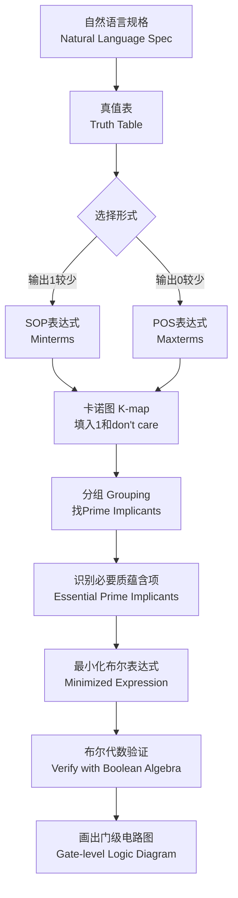

# 03 组合逻辑 (Combinational Logic)

> COMP30660 Computer Architecture & Organisation
> Professor Chris Bleakley, UCD School of Computer Science

---

## 目录

1. 逻辑电路基础 (Logic Circuits)
2. 电路规格描述 (Circuit Specification)
3. 逻辑图 (Logic Diagrams)
4. 逻辑设计 (Logic Design)
5. 布尔表达式 (Boolean Expressions)
6. 布尔代数 (Boolean Algebra)
7. 电路面积 (Circuit Area)
8. SOP与POS形式 (Sum-of-Products & Product-of-Sums)
9. 卡诺图 (Karnaugh Maps)
10. 组合电路设计流程
11. 常用逻辑电路 (Useful Logic Circuits)
12. 译码器 (Decoders)
13. 多路复用器 (Multiplexers)
14. 多路分配器 (Demultiplexers)
15. 编码器 (Encoders)
16. 算术电路 (Arithmetic Circuits)
17. ALU (Arithmetic Logic Unit)
18. 比较器 (Comparators)
19. 易混淆概念
20. 高频考点 (Exam Focus)

---

## 1. 逻辑电路基础 (Logic Circuits)

### 1.1 定义

> A logic circuit is an electronic circuit that processes digital signals (0s and 1s) using logic gates to perform a specific logical or arithmetic operation.

逻辑电路接受一组输入，产生一个或多个输出。在设计层面，输入和输出都有标签（labels），在正常操作中，所有输入和输出都具有二进制值（0 或 1）。

### 1.2 两类逻辑电路

| 类型 | 英文 | 定义 | 特点 |
|------|------|------|------|
| 组合逻辑电路 | Combinational Circuit | 输出仅取决于当前输入值 | 无记忆 (no memory) |
| 时序逻辑电路 | Sequential Circuit | 输出取决于当前和之前的输入值 | 有记忆 (has memory) |

本章专注于组合逻辑电路（Combinational Circuits）。

### 1.3 设计层次 (Design Hierarchy)

```
Application Software (程序)
    -> Operating Systems (操作系统)
        -> Architecture (架构: 指令、寄存器、格式)
            -> Microarchitecture (微架构: 功能单元)
                -> Logic (逻辑: 加法器、存储器等)
                    -> Digital Circuits (数字电路: AND gates, NOT gates等)
                        -> Analog Circuits (模拟电路: 放大器、滤波器等)
                            -> Devices (器件: 晶体管等)
                                -> Physics (物理: 电子)
```

---

## 2. 电路规格描述 (Circuit Specification)

### 2.1 自然语言规格 (Natural Language Specification)

描述电路输入和输出之间的功能关系。例如：

> The circuit has three inputs: A, B, C. The circuit has one output: Y. The output Y is 1 if and only if (iff) A=1 or (A,B,C)=(0,0,1).

自然语言规格直观但不精确，需要真值表来补充。

### 2.2 真值表 (Truth Table)

> A truth table is a table that shows all possible combinations of input values and the corresponding output values for a digital circuit.

构造方法：
1. 为每个输入和每个输出分配一列
2. 以二进制计数方式列出所有可能的输入组合（0, 1, 2, 3, ...）
3. 根据规格填入输出值

示例真值表（对应上述自然语言规格）：

| A | B | C | Y |
|---|---|---|-----|
| 0 | 0 | 0 | 0 |
| 0 | 0 | 1 | 1 |
| 0 | 1 | 0 | 0 |
| 0 | 1 | 1 | 0 |
| 1 | 0 | 0 | 1 |
| 1 | 0 | 1 | 1 |
| 1 | 1 | 0 | 1 |
| 1 | 1 | 1 | 1 |

### 2.3 时序图 (Timing Diagram)

> A timing diagram is a graphical representation that shows how digital signals change over time in a circuit or system.

时序图展示输入和输出值随时间变化的波形图。虚线标记了特定时间点上的信号值。

---

## 3. 逻辑图 (Logic Diagrams)

### 3.1 定义

> A logic diagram is a graphical representation showing how logic gates are interconnected to perform a specific logical function.

逻辑图描述电路的实现结构（implementation），而非仅仅是规格（specification）。

### 3.2 逻辑门汇总 (Logic Gates Recap)
![[Pasted Graphic 3.png]]

| 门名   | 图形符号      | 布尔表达式                                     | 真值表                    | 功能描述 |
| ---- | --------- | ----------------------------------------- | ---------------------- | ---- |
| NOT  | 三角形+圆圈    | Y = Ā 或 Y = A'                           | A=0 -> Y=1; A=1 -> Y=0 | 取反   |
| AND  | D形        | Y = A . B 或 Y = AB                        | 仅当 A=1 且 B=1 时 Y=1     | 与    |
| NAND | AND + 圆圈  | Y = \overline{A . B}                      | AND取反                  | 与非   |
| OR   | 弧形        | Y = A + B                                 | 只要 A=1 或 B=1 则 Y=1     | 或    |
| NOR  | OR + 圆圈   | Y = \overline{A + B}                      | OR取反                   | 或非   |
| XOR  | OR + 额外弧线 | Y = A \oplus B                            | 仅当 A != B 时 Y=1        | 异或   |
| XNOR | XOR + 圆圈  | Y = \overline{A \oplus B} 或 Y = A \odot B | 仅当 A = B 时 Y=1         | 同或   |

**NOT gate 真值表：**

| A | Y = A' |
|---|--------|
| 0 | 1 |
| 1 | 0 |

**AND gate 真值表：**

| A | B | Y = AB |
|---|---|--------|
| 0 | 0 | 0 |
| 0 | 1 | 0 |
| 1 | 0 | 0 |
| 1 | 1 | 1 |

**OR gate 真值表：**

| A | B | Y = A+B |
|---|---|--------|
| 0 | 0 | 0 |
| 0 | 1 | 1 |
| 1 | 0 | 1 |
| 1 | 1 | 1 |

**XOR gate 真值表：**

| A | B | Y = A \oplus B |
|---|---|-------------|
| 0 | 0 | 0 |
| 0 | 1 | 1 |
| 1 | 0 | 1 |
| 1 | 1 | 0 |

**NAND gate 真值表：**

| A | B | Y = \overline{AB} |
|---|---|-------------------|
| 0 | 0 | 1 |
| 0 | 1 | 1 |
| 1 | 0 | 1 |
| 1 | 1 | 0 |

**NOR gate 真值表：**

| A | B | Y = \overline{A+B} |
|---|---|---------------------|
| 0 | 0 | 1 |
| 0 | 1 | 0 |
| 1 | 0 | 0 |
| 1 | 1 | 0 |

**XNOR gate 真值表：**

| A | B | Y = A \odot B |
|---|---|-------------|
| 0 | 0 | 1 |
| 0 | 1 | 0 |
| 1 | 0 | 0 |
| 1 | 1 | 1 |

### 3.3 电子元件符号

| 元件 | 符号 | 说明 |
|------|------|------|
| POWER / SUPPLY | — | 电源 |
| GROUND | — | 接地 |
| BUFFER | — | 电压增强 |
| PIN | — | 仿真中切换0/1 |
| LED | — | Input=1时亮, Input=0时灭 |

### 3.4 逻辑图 -> 真值表的转换方法

1. 标注所有输入、输出和内部节点（internal nodes）
2. 在真值表中列出输入、输出和内部节点作为列标题
3. 列出所有可能的输入组合
4. 找到一个所有输入值都已填入但输出尚未填入的门
5. 根据该门的功能特性填充其输出列
6. 重复步骤4和5，直到所有电路输出值都已填入

---

## 4. 逻辑设计 (Logic Design)

### 4.1 设计方法

从自然语言规格出发设计电路的步骤：

1. 识别电路的输入和输出
2. 说明输入和输出的含义
3. 画出电路的真值表
4. 手动识别实现真值表的逻辑电路
5. 写出电路的布尔表达式
6. 画出电路的逻辑图

### 4.2 示例：比较两个2位数是否相等

**设计一个电路判断两个2位数是否相等：**

**Step 1 & 2 - 输入和输出：**
- 输入 A: 2位，标记为 A[1] (MSB) 和 A[0] (LSB)
- 输入 B: 2位，标记为 B[1] (MSB) 和 B[0] (LSB)
- 输出 Y: 1位
- 含义：A和B是范围0到3的整数。当A=B时Y=1，否则Y=0

**Step 3 - 真值表：**

| A[1] | A[0] | B[1] | B[0] | Y |
|------|------|------|------|---|
| 0 | 0 | 0 | 0 | 1 |
| 0 | 0 | 0 | 1 | 0 |
| 0 | 0 | 1 | 0 | 0 |
| 0 | 0 | 1 | 1 | 0 |
| 0 | 1 | 0 | 0 | 0 |
| 0 | 1 | 0 | 1 | 1 |
| 0 | 1 | 1 | 0 | 0 |
| 0 | 1 | 1 | 1 | 0 |
| 1 | 0 | 0 | 0 | 0 |
| 1 | 0 | 0 | 1 | 0 |
| 1 | 0 | 1 | 0 | 1 |
| 1 | 0 | 1 | 1 | 0 |
| 1 | 1 | 0 | 0 | 0 |
| 1 | 1 | 0 | 1 | 0 |
| 1 | 1 | 1 | 0 | 0 |
| 1 | 1 | 1 | 1 | 1 |

**Step 4-6 - 电路实现：**

XNOR门的特点是当且仅当两个输入相等时输出为1。因此：
- 用一个XNOR门判断 A[0] 和 B[0] 是否相等
- 用另一个XNOR门判断 A[1] 和 B[1] 是否相等
- 用一个AND门组合两个XNOR的结果

**布尔表达式：** `Y = (A[1] \odot B[1]) . (A[0] \odot B[0])`

只有当MSBs相等且LSBs相等时，两个数才相等。

---

## 5. 布尔表达式 (Boolean Expressions)

### 5.1 定义

> A Boolean expression is a logical statement made up of Boolean variables and logical operations.

- **变量 (Variable)**：表示逻辑值（True或False）的字母
- **逻辑运算 (Logical Operation)**：根据定义的逻辑规则，从一个或多个布尔输入确定一个布尔输出

### 5.2 布尔表达式到逻辑电路的映射

```
Y = A + B'
```

- 右侧 (RHS) 变量 (A, B) 对应电路输入
- 右侧运算符 (+, ') 对应逻辑门 (OR, NOT)
- 左侧 (LHS) 变量 (Y) 对应电路输出

### 5.3 运算优先级 (Precedence Rules)

运算优先级从高到低：

| 优先级 | 运算 | 符号 |
|--------|------|------|
| 最高 | 括号 Parentheses | (X) |
| | NOT | X' 或 X̄ |
| | AND | X.Y |
| | OR | X + Y |
| 最低 | 等于 Equals | X = Y |

**示例：** `A + B.C` 等同于 `A + (B.C)`，因为AND优先于OR

### 5.4 布尔表达式 -> 真值表的转换方法

以 `Y = A + B'` 为例：

1. 列出右侧变量作为列标题 (A, B)
2. 列出所有可能的变量值组合 (00, 01, 10, 11)
3. 找到优先级最高且尚未加入真值表的运算
4. 为识别出的运算创建并填充一列
5. 重复步骤3和4，直到所有运算都已加入真值表

**示例过程：**

| A | B | NOT B | A OR (NOT B) | Y |
|---|---|-------|--------------|---|
| 0 | 0 | 1 | 1 | 1 |
| 0 | 1 | 0 | 0 | 0 |
| 1 | 0 | 1 | 1 | 1 |
| 1 | 1 | 0 | 1 | 1 |

### 5.5 逻辑图 <-> 布尔表达式的相互转换

**逻辑图 -> 布尔表达式：**
1. 标注所有节点
2. 写出直接连接电路输出的门的布尔表达式
3. 选择当前表达式中的某个变量
4. 将该变量替换为其输入门对应的运算
5. 重复直到表达式中只包含电路输入变量
6. 根据优先级规则消除不必要的括号

**布尔表达式 -> 逻辑图：**
1. 画出与RHS变量对应的电路输入
2. 找到布尔表达式中一个所有输入都已在图中画出的门
3. 在图中画出对应的门
4. 重复2和3，直到所有运算都在图中

---

## 6. 布尔代数 (Boolean Algebra)

### 6.1 定义

> Boolean algebra is a branch of mathematics that deals with variables that have only two possible values and logical operations applied to the variables.

> Simplification means reducing a digital circuit's complexity while maintaining its functionality.

关键用途：简化逻辑电路。

**功能等效 (Functionally Equivalent)**：两个电路的真值表输入和输出列完全匹配，但结构可能不同。

### 6.2 布尔代数定律、规则和定理

#### OR规则 (OR Rules)

| 规则        | 名称                  | 验证              |
| --------- | ------------------- | --------------- |
| A + 1 = 1 | OR Dominance (支配律)  | 任何变量OR 1，结果总是1  |
| A + 0 = A | OR Identity (恒等律)   | 任何变量OR 0，结果等于本身 |
| A + A = A | OR Idempotent (幂等律) | 任何变量OR自身，结果等于本身 |

#### AND规则 (AND Rules)

| 规则        | 名称                   | 验证               |
| --------- | -------------------- | ---------------- |
| A . 1 = A | AND Identity (恒等律)   | 任何变量AND 1，结果等于本身 |
| A . 0 = 0 | AND Dominance (支配律)  | 任何变量AND 0，结果总是0  |
| A . A = A | AND Idempotent (幂等律) | 任何变量AND自身，结果等于本身 |

#### 交换律 (Commutative Law)

| OR | AND |
|--------|--------|
| A + B = B + A | A . B = B . A |

输入顺序无关紧要，门的输入顺序不影响输出。

#### 结合律 (Associative Law)

| OR | AND |
|------------|-----------------|
| (A + B) + C = A + (B + C) | (A . B) . C = A . (B . C) |

门的组合顺序无关紧要。

#### 分配律 (Distributive Law)

| OR形式 | AND形式 |
|--------|---------|
| A . (B + C) = (A.B) + (A.C) | A + (B.C) = (A + B).(A + C) |

门在括号间"分配"。

#### 互补律 (Complements)

| OR互补 | AND互补 |
|--------|---------|
| A + A' = 1 | A . A' = 0 |
| A=0时，A'=1，A+A'=1 | A=0时，A'=1，A.A'=0 |
| A=1时，A'=0，A+A'=1 | A=1时，A'=0，A.A'=0 |

#### 吸收律 (Absorption)

| 形式1 | 形式2 |
|-------|-------|
| A + A.B = A | A + A'.B = A + B |
| A . (A + B) = A | A . (A' + B) = A . B |

合并等效的真值表行，消除冗余变量。

#### 归约律 (Reduction)

| OR-AND形式 | AND-OR形式 |
|------------|------------|
| A.B + A.B' = B | (A + B).(A + B') = B |

#### 德摩根定律 (De Morgan's Laws)

| 形式1                                            | 形式2                                            |
| ---------------------------------------------- | ---------------------------------------------- |
| \overline{A + B} = \overline{A} . \overline{B} | \overline{A . B} = \overline{A} + \overline{B} |
| (A AND B)' = A' OR B'                          | (A OR B)' = A' AND B'<br>                      |


"Break the bar, change the operation" —— 取反时，AND变OR，OR变AND，同时各项取反。

#### 双重否定律 (Double Negation / Involution)

```
A'' = A
```

### 6.3 XOR相关规则

| 规则 | 表达式 |
|------|--------|
| Identity | A \oplus 0 = A |
| Self-inverse | A \oplus A = 0 |
| Commutative | A \oplus B = B \oplus A |
| Associative | (A \oplus B) \oplus C = A \oplus (B \oplus C) |
| Involution (with 1) | A \oplus 1 = A' |
| Relation to OR/AND/NOT | A \oplus B = (A.B') + (A'.B) |

### 6.4 电路简化示例

简化表达式：`A.B.C + A.B.C' + A'.B.C`

| 步骤  | 等式                                | 理由                      |
| --- | --------------------------------- | ----------------------- |
| 1   | = A.B.C + A.B.C' + A.B.C + A'.B.C | Repeat term（重复A.B.C项）   |
| 2   | = (A + A').B.C + A.B.(C + C')     | Distribution（分配律）       |
| 3   | = (1).B.C + A.B.(1)               | Complements（互补律，A+A'=1） |
| 4   | = B.C + A.B                       | Identity（恒等律）           |

结果从3个三输入项变为2个两输入项，大大简化。

### 6.5 功能对等等式示例

```
(A + B).(A + C) = A + B.C
```

左侧电路（2个OR + 1个AND）面积更大，右侧电路（1个OR + 1个AND）面积更小，功能完全相同。

---

## 7. 电路面积 (Circuit Area)

### 7.1 门等效面积 (Gate Equivalent, GE)

电路成本由硅芯片表面面积决定。面积以2输入NAND门（NAND2）为基准单位计算。

| 门类型  | Gate类型 | 面积 (GE) |
| ---- | ------ | ------- |
| NOT  | 非门     | 0.7     |
| AND  | 与门     | 1.3     |
| OR   | 或门     | 1.3     |
| NAND | 与非门    | 1 (基准)  |
| NOR  | 或非门    | 1       |
| XNOR | 同或门    | 2       |
| XOR  | 异或门    | 2       |

*注：以上为2输入门的面积，NOT门为1输入。*

### 7.2 计算电路面积的方法

1. 统计电路中每种门的数量
2. 将每种门的数量乘以其GE面积
3. 将各类型的面积相加

**示例：** 比较 `Y1 = (A+B).(A+C)` 和 `Y2 = A + B.C`

| 门类型 | Y1数量 (GE) | Y2数量 (GE) |
|--------|------------|------------|
| AND | 1 x 1.3 = 1.3 | 1 x 1.3 = 1.3 |
| OR | 2 x 1.3 = 2.6 | 1 x 1.3 = 1.3 |
| **总计** | **3.9 GE** | **2.6 GE** |

Y2比Y1小约33%，更便宜。

---

## ```

---

## 10. 组合电路设计流程


```mermaid
flowchart TD
    A[自然语言规格<br/>Natural Language Spec] --> B[真值表<br/>Truth Table]
    B --> C{选择形式}
    C -->|输出1较少| D[SOP表达式<br/>Minterms]
    C -->|输出0较少| E[POS表达式<br/>Maxterms]
    D --> F[卡诺图 K-map<br/>填入1和don't care]
    E --> F
    F --> G[分组 Grouping<br/>找Prime Implicants]
    G --> H[识别必要质蕴含项<br/>Essential Prime Implicants]
    H --> I[最小化布尔表达式<br/>Minimized Expression]
    I --> J[布尔代数验证<br/>Verify with Boolean Algebra]
    J --> K[画出门级电路图<br/>Gate-level Logic Diagram]
```

**详细步骤：**

1. **问题规格 (Problem Specification)：** 用自然语言描述电路应实现的功能
2. **真值表 (Truth Table)：** 列出所有可能的输入组合及期望的输出
3. **布尔表达式推导 (Boolean Expression Derivation)：** 从真值表写出SOP或POS表达式
4. **简化 (Simplification)：** 使用K-map或布尔代数简化表达式
5. **电路实现 (Circuit Implementation)：** 将简化后的表达式转换为逻辑门的互连

---

## 11. 常用逻辑电路 (Useful Logic Circuits)

### 11.1 N输入逻辑门 (N-Input Logic Gates)

一个N输入的AND/OR门可以由 N-1个2输入门的二叉树构建。

例如，8输入OR门：4个2输入OR -> 2个2输入OR -> 1个2输入OR（4:2:1树结构）。

### 11.2 Enable Gate（使能门）

一种对AND门的概念化思维方式：
- 一个输入视为**控制输入 (Control)**
- 另一个输入视为**数据输入 (Data)**

| Control | Data | Y | 描述 |
|---------|------|---|------|
| 0 | 0 | 0 | Disabled（禁用） |
| 0 | 1 | 0 | Disabled |
| 1 | 0 | 0 | Enabled（启用），输出=Data |
| 1 | 1 | 1 | Enabled，输出=Data |

**核心逻辑：** 当Control=1时，Y=Data；当Control=0时，Y=0。本质上就是一个AND门，但赋予了控制/数据的语义。

---

## 12. 译码器 (Decoders)

### 12.1 n-to-2^n Decoder

**定义：** n-to-2^n译码器将n位输入转换成2^n个输出。对于每个输入组合，恰好只有一个输出为1（active high），其余为0。

**2-to-4 Decoder 真值表：**

| A1  | A0  | Y3  | Y2  | Y1  | Y0  |
| --- | --- | --- | --- | --- | --- |
| 0   | 0   | 0   | 0   | 0   | 1   |
| 0   | 1   | 0   | 0   | 1   | 0   |
| 1   | 0   | 0   | 1   | 0   | 0   |
| 1   | 1   | 1   | 0   | 0   | 0   |

**3-to-8 Decoder 真值表：**

| A2  | A1  | A0  | Y7  | Y6  | Y5  | Y4  | Y3  | Y2  | Y1  | Y0  |
| --- | --- | --- | --- | --- | --- | --- | --- | --- | --- | --- |
| 0   | 0   | 0   | 0   | 0   | 0   | 0   | 0   | 0   | 0   | 1   |
| 0   | 0   | 1   | 0   | 0   | 0   | 0   | 0   | 0   | 1   | 0   |
| 0   | 1   | 0   | 0   | 0   | 0   | 0   | 0   | 1   | 0   | 0   |
| 0   | 1   | 1   | 0   | 0   | 0   | 0   | 1   | 0   | 0   | 0   |
| 1   | 0   | 0   | 0   | 0   | 0   | 1   | 0   | 0   | 0   | 0   |
| 1   | 0   | 1   | 0   | 0   | 1   | 0   | 0   | 0   | 0   | 0   |
| 1   | 1   | 0   | 0   | 1   | 0   | 0   | 0   | 0   | 0   | 0   |
| 1   | 1   | 1   | 1   | 0   | 0   | 0   | 0   | 0   | 0   | 0   |

**逻辑：** `Yi = 1` 当且仅当输入编码等于 i。例如 `Y3 = A1.A0`，`Y5 = A2.A0`。

### 12.2 带Enable输入的Decoder

当Enable=0时，所有输出为0（禁用）；当Enable=1时，正常译码。

**2-to-4 Decoder with Enable：**

| Enable | A1 | A0 | Y3 | Y2 | Y1 | Y0 |
|--------|----|----|----|----|----|----|
| 0 | X | X | 0 | 0 | 0 | 0 |
| 1 | 0 | 0 | 0 | 0 | 0 | 1 |
| 1 | 0 | 1 | 0 | 0 | 1 | 0 |
| 1 | 1 | 0 | 0 | 1 | 0 | 0 |
| 1 | 1 | 1 | 1 | 0 | 0 | 0 |

---

## 13. 多路复用器 (Multiplexers / MUX)

### 13.1 定义

> A multiplexer (MUX) selects one of the data inputs based on the value of the select input and outputs the selected value.

MUX根据选择输入(select input)的值，从多个数据输入中选择一个输出。

### 13.2 2-to-1 MUX

**功能：** 当S=0时输出A，当S=1时输出B

**真值表：**

| S | A | B | Y |
|---|---|---|---|
| 0 | 0 | 0 | 0 |
| 0 | 0 | 1 | 0 |
| 0 | 1 | 0 | 1 |
| 0 | 1 | 1 | 1 |
| 1 | 0 | 0 | 0 |
| 1 | 0 | 1 | 1 |
| 1 | 1 | 0 | 0 |
| 1 | 1 | 1 | 1 |

**布尔表达式：** `Y = S'.A + S.B`

**门级实现：** 2个AND门 + 1个NOT门 + 1个OR门
- AND1：S' . A
- AND2：S . B
- OR: (S'.A) + (S.B)


---

## 16. 算术电路 (Arithmetic Circuits)

### 16.1 Half Adder（半加器）
![[Pasted image 20260511145235.png|418]]
**功能：** 将2个bit相加，产生Sum和Carry

**二进制加法：**
```
0 + 0 = 00
0 + 1 = 01
1 + 0 = 01
1 + 1 = 10
```

**真值表：**

| X | Y | Carry | Sum |
|---|---|-------|-----|
| 0 | 0 | 0 | 0 |
| 0 | 1 | 0 | 1 |
| 1 | 0 | 0 | 1 |
| 1 | 1 | 1 | 0 |

**布尔表达式：**
- **Carry = X . Y** （AND门 — 当两个输入都为1时才产生进位）
- **Sum = X \oplus Y** （XOR门 — 当两个输入不同时和为1）

**电路：** 1个AND门 + 1个XOR门

**门等效面积：** 1.3 (AND) + 2.0 (XOR) = 3.3 GE

### 16.2 Full Adder（全加器）

**功能：** 将3个bit相加（X, Y, Carry-In），产生Sum和Carry-Out

**真值表：**

| X | Y | Cin | Cout | Sum |
|---|---|------|------|-----|
| 0 | 0 | 0 | 0 | 0 |
| 0 | 0 | 1 | 0 | 1 |
| 0 | 1 | 0 | 0 | 1 |
| 0 | 1 | 1 | 1 | 0 |
| 1 | 0 | 0 | 0 | 1 |
| 1 | 0 | 1 | 1 | 0 |
| 1 | 1 | 0 | 1 | 0 |
| 1 | 1 | 1 | 1 | 1 |

**布尔表达式：**


Sum = X ⊕ Y ⊕ Cin

> 推导：Sum = X'.Y'.Cin + X'.Y.Cin' + X.Y'.Cin' + X.Y.Cin
>  = (X \oplus Y) \oplus Cin

**Cout = X·Y + Cin·(X ⊕ Y)**

> 推导：Cout = X'.Y.Cin + X.Y'.Cin + X.Y.Cin' + X.Y.Cin
>  = X.Y + X.Cin + Y.Cin（通过K-map简化或SOP化简）

### 16.3 用两个Half Adder构建Full Adder
![[Pasted image 20260511145300.png|572]]

**Cout = Cout1 + Cout2**

**Sum = HA1的Sum与Cin的XOR**

这种方法非常优雅——全加器 = 两个半加器 + 一个OR门。

### 16.4 N位加法器 (N-bit Adder)

N位加法器的结构（以N位为例）：

```
X[n-1]Y[n-1]    X[3]Y[3]    X[2]Y[2]    X[1]Y[1]    X[0]Y[0]
    |               |           |           |           |
    FA      ...     FA          FA          FA          HA
    |               |           |           |           |
Cout  S[n-1]      S[3]        S[2]        S[1]        S[0]

S = X + Y
```

最低位用Half Adder（因为没有进位输入），其余位用Full Adder，高位的Cin来自低位的Cout。

### 16.5 4位加法器示例
![[Pasted image 20260511150811.png]]
计算 3 + 5：

```
         [3]   [2]   [1]   [0]
X         0     0     1     1    = 3
Y         0     1     0     1    = 5
Cin  +    0     1     1     1    (进位)
---------------------------------
S         1     0     0     0    = 8
```


### 16.10 4位减法器 (4-bit Subtractor)
![[Pasted image 20260511150928.png]]
减法通过以下方式实现：翻转减数位然后加1。

```
X - Y = X + (NOT Y) + 1
```

因此，4位减法器 = 4个FA（Y输入经过NOT取反，最低位Cin=1）

**示例：** 7 - 3 = 4

```
         [3]   [2]   [1]   [0]
X         0     1     1     1    = 7
NOT Y     0     0     1     1    (3 = 0011, NOT = 1100)
                      +    1    Cin[0] = 1
---------------------------------
S         0     1     0     0    = 4
```


---

## 17. ALU (Arithmetic Logic Unit) 算术逻辑单元

### 17.1 基本概念

**定义：** ALU是CPU的核心计算单元，能够执行多种算术和逻辑运算。它接受操作数和操作选择码，产生运算结果。

**基本ALU功能：**

| 操作选择 | 算术运算 | 逻辑运算 |
|----------|----------|----------|
| ADD | A + B | — |
| SUB | A - B | — |
| AND | — | A AND B |
| OR | — | A OR B |
| XOR | — | A XOR B |
| NOT | — | NOT A |
| NAND | — | A NAND B |
| NOR | — | A NOR B |

**ALU的核心结构：**

```
操作数 A (n位) -----+----> [算术单元] ----+
                     |                    |
操作数 B (n位) -----+----> [逻辑单元] ----+----> [MUX] ----> 结果 Y (n位)
                     |                    |         |
操作选择码 ----------+----> [控制单元] ---+---------+
                                        |
状态标志 <--- [标志生成器] <-------------+
                                        Carry, Zero, Negative, Overflow
```

**ALU输出还包括状态标志位 (Status Flags)：**
- Zero (Z): 结果为0
- Carry (C): 有进位/借位
- Negative (N): 结果为负数（最高位为1）
- Overflow (V): 有符号数溢出


---

## 附录：关键公式速查表

### 布尔代数定律

| 名称 | OR形式 | AND形式 |
|------|--------|---------|
| Identity | A + 0 = A | A . 1 = A |
| Dominance | A + 1 = 1 | A . 0 = 0 |
| Idempotent | A + A = A | A . A = A |
| Complements | A + A' = 1 | A . A' = 0 |
| Double Negation | A'' = A |
| Commutative | A + B = B + A | A . B = B . A |
| Associative | (A+B)+C = A+(B+C) | (AB)C = A(BC) |
| Distributive | A(B+C) = AB + AC | A+BC = (A+B)(A+C) |
| Absorption | A + AB = A | A(A+B) = A |
| | A + A'B = A + B | A(A'+B) = AB |
| Reduction | — | AB + AB' = B |
| | (A+B)(A+B') = B | — |
| De Morgan | (A+B)' = A'.B' | (AB)' = A' + B' |

### 算术电路公式

| 电路 | Sum/Difference | Carry/Borrow |
|------|---------------|--------------|
| Half Adder | S = X \oplus Y | C = X.Y |
| Full Adder | S = X \oplus Y \oplus Cin | Cout = X.Y + X.Cin + Y.Cin |
| Half Subtractor | D = X \oplus Y | Bout = X'.Y |
| Full Subtractor | D = X \oplus Y \oplus Bin | Bout = X'.Y + X'.Bin + Y.Bin |
### MUX与常用电路

| 电路 | 公式/特征 |
|------|----------|
| 2:1 MUX | Y = S'.D0 + S.D1 |
| 4:1 MUX | Y = S1'.S0'.D0 + S1'.S0.D1 + S1.S0'.D2 + S1.S0.D3 |
| 2-to-4 Decoder | Y0=A1'.A0', Y1=A1'.A0, Y2=A1.A0', Y3=A1.A0 |
| 2位数相等 | Y = (A[1] \odot B[1]).(A[0] \odot B[0]) |

---

*参考：D.M. Harris and S.L. Harris, Digital Design and Computer Architecture, RISC-V Edition, Morgan Kaufmann, Chapter 2*
