# 04 时序逻辑 (Sequential Logic)

> **课程**: COMP30660 Computer Architecture & Organisation
> **章节**: Ch 4 Sequential Logic (Professor Chris Bleakley, UCD)
> **参考**: Harris & Harris, Digital Design and Computer Architecture, Chapter 3

---

## 目录

1. [时序逻辑概述](#1-时序逻辑概述)
2. [基本存储单元 -- SR Latch](#2-基本存储单元----sr-latch)
3. [Gated SR Latch（门控锁存器）](#3-gated-sr-latch门控锁存器)
4. [D Latch（数据锁存器）](#4-d-latch数据锁存器)
5. [D Flip-Flop（D 触发器）](#5-d-flip-flopd-触发器)
6. [JK Flip-Flop（JK 触发器）](#6-jk-flip-flopjk-触发器)
7. [T Flip-Flop（T 触发器）](#7-t-flip-flopt-触发器)
8. [寄存器 Registers](#8-寄存器-registers)
9. [计数器 Counters](#9-计数器-counters)
10. [Memory Arrays（存储阵列）](#10-memory-arrays存储阵列)
11. [有限状态机 FSM](#11-有限状态机-fsm)
12. [时序与时序参数 Timing](#12-时序与时序参数-timing)
13. [同步 vs 异步时序电路](#13-同步-vs-异步时序电路)
14. [易混淆概念](#14-易混淆概念)
15. [FSM 设计示例：序列检测器](#15-fsm-设计示例序列检测器"101")
16. [高频考点](#16-高频考点)

---

## 1. 时序逻辑概述

### 定义

> "Sequential logic consists of logic gates which are connected together to produce a specified output for certain specified combinations of **current and previous inputs**."

- **核心特征**：时序逻辑拥有 **memory（记忆）**，输出不仅取决于当前的输入，还取决于过去的输入/历史状态。
- 组合逻辑 (Combinational Logic) 没有记忆，输出仅由当前输入决定。

### 组合逻辑 vs 时序逻辑

| 特性 | Combinational Logic | Sequential Logic |
|------|---------------------|-------------------|
| 记忆能力 | 无 (no memory) | 有 (has memory) |
| 输出依赖 | 仅当前输入 | 当前输入 + 历史状态 |
| 反馈回路 (Feedback) | 无 | 存在反馈回路 |
| 电路举例 | AND gate, Adder, MUX | Latch, Flip-Flop, Register, Counter |
| 描述方式 | 真值表 (Truth Table), 布尔表达式 | 状态表 (State Table), 状态图 (State Diagram) |

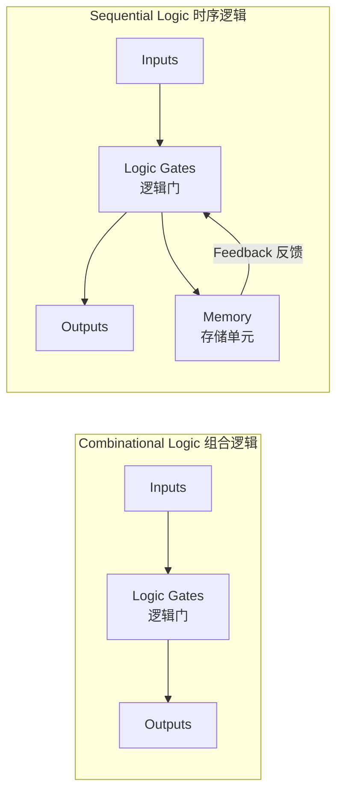

### 反馈 (Feedback)

> "Feedback is connecting a circuit's output to its input."

一个最简单的 1-bit 存储可以由两个 NOT gate（反相器）串联并加入反馈构成：

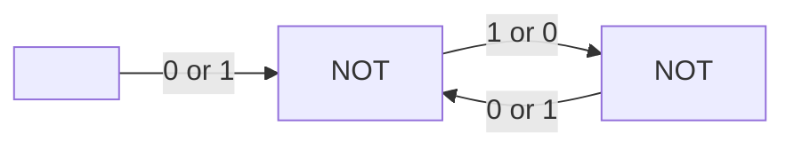

- **Bistable（双稳态）**：电路可以在两个稳定状态 (0 或 1) 之间保持任意一个。
- 问题是：**没有办法方便地改变或设置这个状态**。这就是 Latch 需要解决的核心问题。

---

## 2. 基本存储单元 -- SR Latch

> "A latch is a **level-sensitive** bistable circuit that stores one bit of data and holds its state until it is changed by an input signal."

### 2.1 SR Latch (NOR Gate Implementation)

SR Latch 使用两个交叉耦合的 NOR gate 构成：

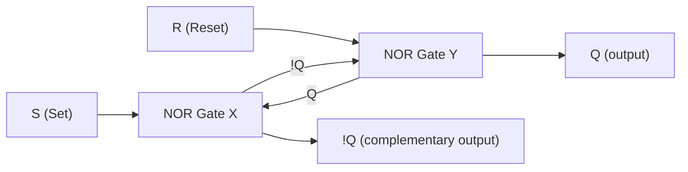

#### NOR Gate 真值表 (回顾)

| A | B | A NOR B |
|---|---|---------|
| 0 | 0 | 1 |
| 0 | 1 | 0 |
| 1 | 0 | 0 |
| 1 | 1 | 0 |

#### 工作原理（NOR 实现）

**SET 操作 (S=1, R=0):**
- S=1 使得 Gate X 输出 = 0（无论另一个输入是什么），因此 !Q = 0
- R=0 且 !Q=0，Gate Y 的两个输入都是 0，输出为 1，因此 Q = 1
- Latch 处于 **SET 状态** (Q=1, !Q=0)

**RESET 操作 (S=0, R=1):**
- R=1 使得 Gate Y 输出 = 0（无论另一个输入是什么），因此 Q = 0
- S=0 且 Q=0，Gate X 的两个输入都是 0，输出为 1，因此 !Q = 1
- Latch 处于 **RESET 状态** (Q=0, !Q=1)

**记忆模式/Memory Mode (S=0, R=0):**
- 两个 NOR gate 各有一个来自交叉耦合的输入为高电平时，维持当前状态不变
- 如果之前 SET (Q=1, !Q=0)：Gate X 输入 (S=0, Q=1)，输出 !Q=0 保持不变；Gate Y 输入 (R=0, !Q=0)，输出 Q=1 保持不变
- 如果之前 RESET (Q=0, !Q=1)：Gate X 输入 (S=0, Q=0)，输出 !Q=1 保持不变；Gate Y 输入 (R=0, !Q=1)，输出 Q=0 保持不变

**无效状态 (S=1, R=1):**
- 两个 NOR gate 输出均为 0：Q=0, !Q=0
- 这违反了互补输出的约定——**必须避免**

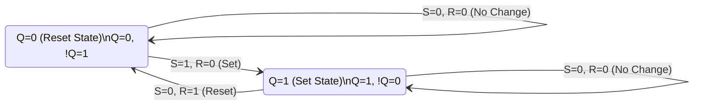

#### Characteristic Table 特性表

| S | R | State 描述 | Q(n+1) 下一状态 | !Q(n+1) | Comments |
|---|---|-----------|-----------------|----------|----------|
| 0 | 0 | 保持 No Change | Q(n) | !Q(n) | 记忆模式 Memory Mode |
| 1 | 0 | 置位 Set | 1 | 0 | 置位 |
| 0 | 1 | 复位 Reset | 0 | 1 | 复位 |
| 1 | 1 | 无效 Invalid | undefined | undefined | **禁止 (Forbidden)** |

### 2.2 SR Latch (NAND Gate Implementation)

在许多实际实现中，SR Latch 也可使用 NAND gate 构建：

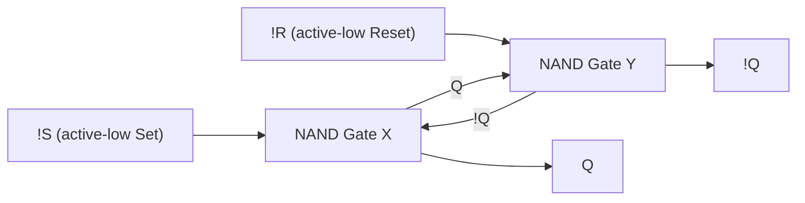

#### NAND Gate 真值表 (回顾)

| A | B | A NAND B |
|---|---|---------|
| 0 | 0 | 1 |
| 0 | 1 | 1 |
| 1 | 0 | 1 |
| 1 | 1 | 0 |

**NAND 实现的区别：**
- 输入为 **active-low**（低电平有效）：!S 和 !R
- !S = 0, !R = 1 时 SET (Q=1, !Q=0)
- !S = 1, !R = 0 时 RESET (Q=0, !Q=1)
- !S = 1, !R = 1 时 No Change
- **!S = 0, !R = 0 是禁止的无效状态**

| !S | !R | State | Q(n+1) | Comments |
|----|----|-------|--------|----------|
| 1 | 1 | 保持 | Q(n) | No Change |
| 0 | 1 | 置位 | 1 | Set |
| 1 | 0 | 复位 | 0 | Reset |
| 0 | 0 | 无效 | undefined | **Forbidden** |

---

## 3. Gated SR Latch（门控锁存器）

在基本 SR Latch 的基础上，增加一个 **Enable (E)** 信号来控制何时允许状态更新。

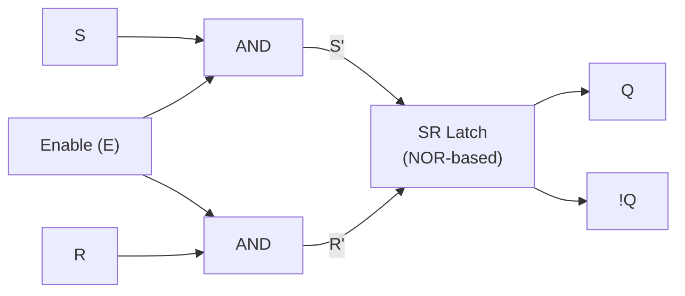

### 工作原理

- **Enable = 1 (Transparent Mode / 透明模式):**
  - AND gate 输出 = S 和 R 原值 (S' = S, R' = R)
  - SR Latch 正常响应 S 和 R 输入
  - 可以进行 Set、Reset、No Change 操作

- **Enable = 0 (Memory Mode / 记忆模式):**
  - AND gate 输出恒为 0 (S' = 0, R' = 0)
  - SR Latch 保持在 No Change 状态
  - **无论 S, R 如何变化，锁存器状态都不会改变**

### 关键特性

- **Level-Sensitive（电平敏感）**：当 E=1 的整个期间，输出会跟随输入变化
- 相比基本 SR Latch，增加了时间控制能力
- 仍然存在 S=1, R=1 的无效状态问题（当 E=1 时）

### SR Flip-Flop 与 Master-Slave 结构

**Latches are level-sensitive** whereas **flip-flops are edge-sensitive**（锁存器是电平敏感的，而触发器是边沿敏感的）。

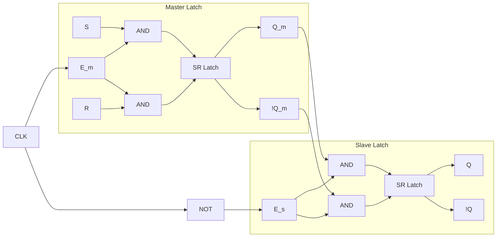

#### Master-Slave 工作过程

| 时钟阶段 | Master | Slave | 输出 Q |
|---------|--------|-------|--------|
| CLK = 1 (正电平) | **Memory Mode** (E_m = 1? 通过 NOT: E_m = 实际为 1 使能...)| **Transparent Mode** | 输出来自 Master 保存的值 |
| CLK = 0 (负电平) | **Transparent Mode** (跟踪 SR 输入) | **Memory Mode** (保持) | Q 不变 |

**简言之：**
1. **CLK 正边沿 (0->1)**：Master 进入 Memory Mode 锁存输入，Slave 进入 Transparent Mode 将 Master 的值传到输出
2. **CLK 高电平期间**：Master 锁存，Slave 透明（输出不变因 Master 输入不变）
3. **CLK 负边沿 (1->0)**：Slave 进入 Memory Mode 锁存输出，Master 进入 Transparent Mode 跟踪输入
4. **CLK 低电平期间**：Slave 锁存输出不变，Master 透明

---

## 4. D Latch（数据锁存器）

### 动机

SR Latch 的问题：当 S=1, R=1 时产生无效状态。D Latch 通过将 **R = NOT(S)** 来解决此问题，这样 S 和 R 永远不会同时为 1。

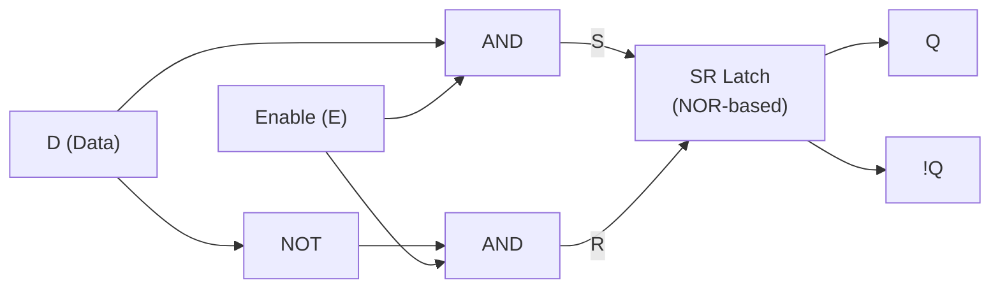

### 工作原理

- 电路确保 **S = D 且 R = !D**
- 当 S=D=1 时 R=0（合法的 Set 操作），当 S=D=0 时 R=1（合法的 Reset 操作）
- **永远不会有 S=1 且 R=1 的情况**

| E (Enable) | D | Q(n+1) | Comments |
|------------|---|--------|----------|
| 0 | X | Q(n) | Memory Mode (锁存) |
| 1 | 0 | 0 | Reset / 透明模式 |
| 1 | 1 | 1 | Set / 透明模式 |

**关键点**：D Latch 是 **level-sensitive**（电平敏感），当 E=1 时，Q 直接 = D。这仍然存在"透明"期间输入抖动会传到输出的问题。

---

## 5. D Flip-Flop（D 触发器）

> "A flip-flop is a **synchronous bistable memory device**."（触发器是同步的双稳态存储器件）

### 5.1 边沿触发机制 (Edge-Triggered)

D Flip-Flop 是 **edge-sensitive**（边沿敏感），仅在时钟边沿时采样输入。

**电路实现**：D Flip-Flop 内部使用一个 NOT gate 将 D 分为 S 和 R 输入，然后送入 Master-Slave SR Flip-Flop：

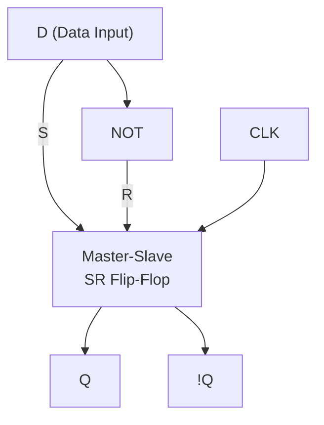

### 5.2 符号与定时图

- **三角形符号 (Triangle indicator)** 表示：输入是 **positive edge sensitive**（上升沿敏感）
- 如果有小圆圈在时钟输入端，则表示 **negative edge sensitive**（下降沿敏感）

**Positive Edge D Flip-Flop 行为：**

```
CLK:     ──┐     ┌──┐     ┌──┐     ┌──┐     ┌──┐     ┌──
           │     │  │     │  │     │  │     │  │     │
           └─────┘  └─────┘  └─────┘  └─────┘  └─────┘
D:     ────1───1────1───1────0───0────0───0────1───0───0────
                              ↑           ↑           ↑
Q:     ────────1────1───1────1───0────0───0────0───0───0───?
               ↑    ↑        ↑    ↑        ↑    ↑        ↑
            unknown  Q follows D   Q holds    Q follows D
                    at edge        until next  at edge
                                   edge
```

**关键观察：**
1. Q 仅在 CLK 的 **positive edge** (上升沿) 改变
2. Q 永远等于**上一时钟边沿时 D 的值**
3. 两个边沿之间，Q 完全不变化
4. 第一条边沿前状态为 **unknown（未知）**

### 5.3 Characteristic Table 特性表

| CLK Edge | D | Q(n+1) | Comments |
|----------|---|--------|----------|
| Positive Edge (0->1) | 0 | 0 | Reset at edge |
| Positive Edge (0->1) | 1 | 1 | Set at edge |
| Non-edge (any other time) | X | Q(n) | Hold (保持不变) |

### 5.4 Characteristic Equation 特征方程

$$Q(n+1) = D$$

这是所有触发器中最简单的特征方程——下一状态直接等于 D 输入。

### 5.5 Excitation Table 激励表

激励表描述的是：**为了实现指定的状态转换，输入需要是什么值**。

| Q(n) -> Q(n+1) | Required D |
|----------------|------------|
| 0 -> 0 | 0 |
| 0 -> 1 | 1 |
| 1 -> 0 | 0 |
| 1 -> 1 | 1 |

---

## 6. JK Flip-Flop（JK 触发器）

### 动机

SR Flip-Flop 的致命缺陷是 **S=1, R=1 时无效**，导致其无法实现 **Toggle（翻转）**——即在每个时钟边沿将状态取反。

**JK Flip-Flop** 解决了这个问题：

- **J** 对应 Set (类似 S)
- **K** 对应 Reset (类似 R)
- 当 **J=1, K=1** 时，触发器 **Toggles（翻转）** -- Q(n+1) = !Q(n)

### 6.1 Characteristic Table 特性表

| J | K | Q(n+1) | State 描述 | Comments |
|---|---|-------|----------|----------|
| 0 | 0 | Q(n) | Hold 保持 | No change -- 记忆模式 |
| 0 | 1 | 0 | Reset 复位 | Clear |
| 1 | 0 | 1 | Set 置位 | Preset |
| 1 | 1 | !Q(n) | Toggle 翻转 | **JK 独有的功能** |

### 6.2 Characteristic Equation 特征方程

$$Q(n+1) = J \cdot \overline{Q(n)} + \overline{K} \cdot Q(n)$$

推导过程：
- 当 J=1, Q=0（且 K 任意含 K=0 时无影响）时下一状态 = 1：J=1 时 Set
- 当 K=1, Q=1（且 J 任意含 J=0 时无影响）时下一状态 = 0：K=1 时 Reset

验证所有情况：
- J=0, K=0：Q(n+1) = 0 + Q(n) = Q(n) ✓
- J=0, K=1：Q(n+1) = 0 + 0 = 0 ✓
- J=1, K=0：Q(n+1) = !Q(n) + Q(n) = 1 ✓
- J=1, K=1：Q(n+1) = !Q(n) + 0 = !Q(n) ✓

### 6.3 Excitation Table 激励表

| Q(n) -> Q(n+1) | J | K |
|----------------|---|---|
| 0 -> 0 | 0 | X (don't care) |
| 0 -> 1 | 1 | X (don't care) |
| 1 -> 0 | X | 1 (don't care) |
| 1 -> 1 | X | 0 (don't care) |

**JK 激励表的灵活性**：因为有 don't care 条件，在 FSM 设计时 JK 往往可以产生更简单的电路。

---

## 7. T Flip-Flop（T 触发器）

T Flip-Flop (Toggle Flip-Flop) 是从 JK Flip-Flop 简化而来的：将 J 和 K 输入端连接在一起，构成 **T (Toggle)** 输入端。

$$J = K = T$$

### 7.1 Characteristic Table 特性表

| T | Q(n+1) | State 描述 | Comments |
|---|--------|----------|----------|
| 0 | Q(n) | Hold 保持 | No change |
| 1 | !Q(n) | Toggle 翻转 | 在每个有效边沿翻转 |

### 7.2 Characteristic Equation 特征方程

$$Q(n+1) = T \oplus Q(n) = T \cdot \overline{Q(n)} + \overline{T} \cdot Q(n)$$

这正好是 **XOR (异或)** 运算。

### 7.3 Excitation Table 激励表

| Q(n) -> Q(n+1) | Required T |
|----------------|------------|
| 0 -> 0 | 0 |
| 0 -> 1 | 1 |
| 1 -> 0 | 1 |
| 1 -> 1 | 0 |

**应用**：T Flip-Flop 主要用于计数器设计——每一位在条件满足时翻转。

---

## 8. 寄存器 Registers

> "A register stores a word of data using flip-flops."
> "A data word is a fixed-size group of bits that are processed, transferred and stored as a group."

### 8.1 基本寄存器 (Parallel Load Register)

N-bit 寄存器由 N 个 D Flip-Flop 并联组成，共享同一个 CLK 信号。

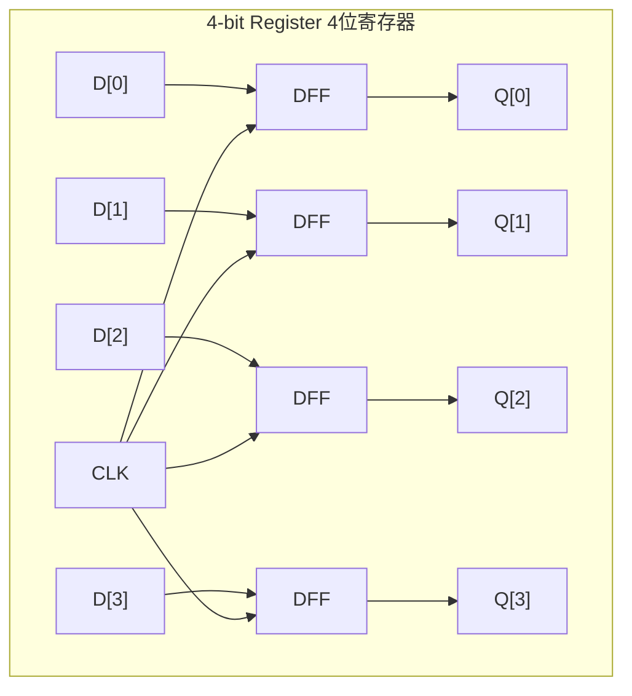

- 所有 Flip-Flop 在同一个 CLK positive edge 更新
- 一个 CLK cycle 可以存储/加载一个完整的 N-bit word
- **总线表示 (Bus Notation)**：用 `[N-1:0]` 表示 N-bit bus，用斜线 `/` 标注在线上表示 bit 宽度

### 8.2 移位寄存器 (Shift Registers)

移位寄存器可在每个时钟边沿将数据依次左右移动。共有四种配置：

#### PIPO (Parallel In, Parallel Out) -- 并入并出
- 相当于基本寄存器，同时加载/读取所有位

#### SISO (Serial In, Serial Out) -- 串入串出

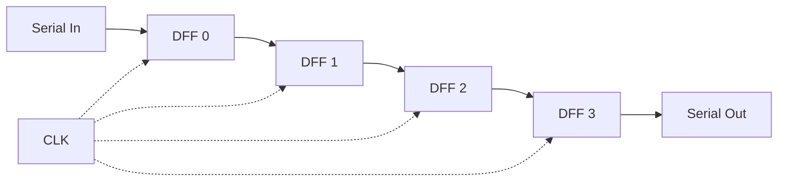

- 每个 CLK 边沿，数据向右移动一位
- 需要 N 个 clock cycle 才能完全输入/输出 N-bit 数据
- **用途**：串行通信、延迟线

#### SIPO (Serial In, Parallel Out) -- 串入并出
- 串行输入，经过 N 个 CLK 后，所有 Q 输出可并行读取
- **用途**：串行数据接收转化为并行数据

#### PISO (Parallel In, Serial Out) -- 并入串出

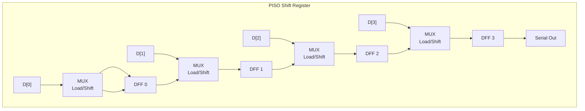

- Load=1 时并行加载数据
- Load=0 时逐位串行输出
- **用途**：并行数据转化为串行数据发送

| 移位寄存器类型 | 输入方式 | 输出方式 | 典型用途 |
|---------------|---------|---------|---------|
| SISO | 串行 1-bit | 串行 1-bit | 时间延迟 |
| SIPO | 串行 1-bit | 并行 N-bit | 串行接收器 |
| PISO | 并行 N-bit | 串行 1-bit | 串行发送器 |
| PIPO | 并行 N-bit | 并行 N-bit | 通用存储 |

---

## 9. 计数器 Counters

### 9.1 异步计数器 / 行波计数器 (Asynchronous / Ripple Counter)

异步计数器将前一级 Flip-Flop 的输出作为下一级的时钟信号。

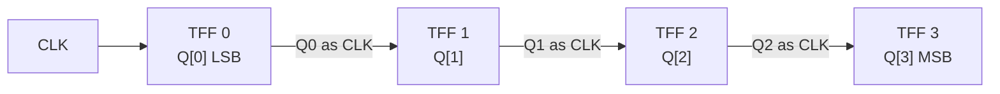

**行波计数器时序 (Ripple Counter Timing):**

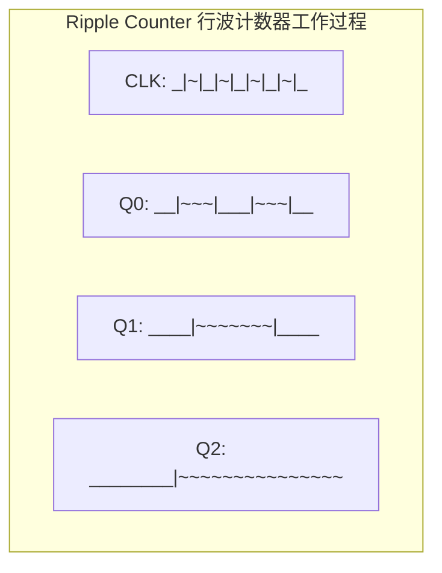

**特征：**
- 简单，用最少的门电路
- **传播延迟累积 (Accumulated propagation delay)**：每级都增加延迟
- 第 N 级需要等前 N-1 级全部翻转后才稳定
- **高频率时可能出现错误的中间状态**（瞬态 glitch）
- 也称为 **ripple counter**（行波计数器）

**16进制计数器示例：**
```
Q:  0000 -> 0001 -> 0010 -> 0011 -> ... -> 1111 -> 0000 (overflow)
```

### 9.2 同步计数器 (Synchronous Counter)

所有 Flip-Flop 共享同一个 CLK 信号，避免了 ripple 延迟问题。

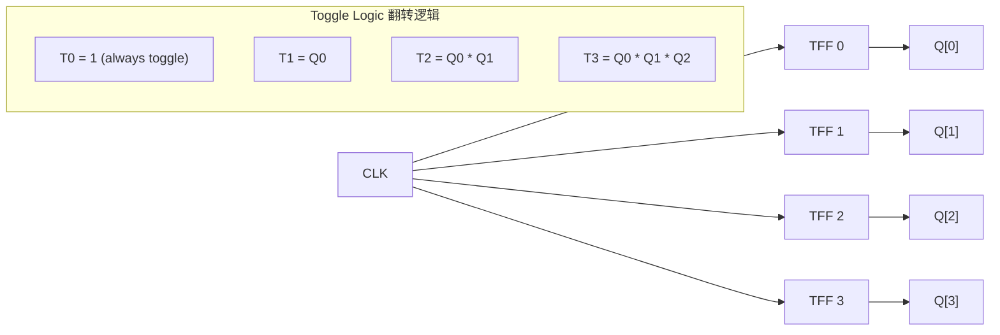

**Toggle 条件**（二进制加法计数器）：
- 第 0 位 (LSB)：每个 CLK 都翻转：T0 = 1
- 第 1 位：当 Q0 = 1 时翻转：T1 = Q0
- 第 2 位：当 Q0 = Q1 = 1 时翻转：T2 = Q0 AND Q1
- 第 k 位：当所有低位都为 1 时翻转：Tk = Q0 AND Q1 AND ... AND Q(k-1)

### 9.3 同步计数器电路

使用 D Flip-Flop 的同步计数器：

```
                   +------+
        CLK ------>|      |  4-bit Register
                   |      |  (D FFs with reset)
        +--------->|      |------+----> Q[3:0]
        |          +------+      |
        |                        |
        |   +-------+            |
        +---| +1    |<-----------+
            | Adder |
            +-------+
```

每个 CLK positive edge，Q = Q + 1。当 Q = 1111 时，下一周期溢出回到 0000。

### 9.4 加减计数器 (Up/Down Counter)

增加一个方向控制信号 **Up/Down**：

- **Up = 1**：Q = Q + 1（加法计数）
- **Up = 0**：Q = Q - 1（减法计数）

Toggle 条件在减法时变为：
- T0 = 1（always）
- T1 = !Q0（Q0=0 时翻转，即 borrow 条件）
- T2 = !Q0 AND !Q1
- ...

### 9.5 模 N 计数器 (Modulo-N Counter)

计数器从 0 计数到 N-1，遇 N 时复位为 0（不是 N-1 后自然溢出）。

**实现方法：**
- 检测到 Q = N 时触发 RESET 信号
- 例如模 10 计数器（十进制，0~9）：
  - 当 Q = 1010 (10) 时，产生 RESET 信号
  - RESET 将所有 Flip-Flop 清零

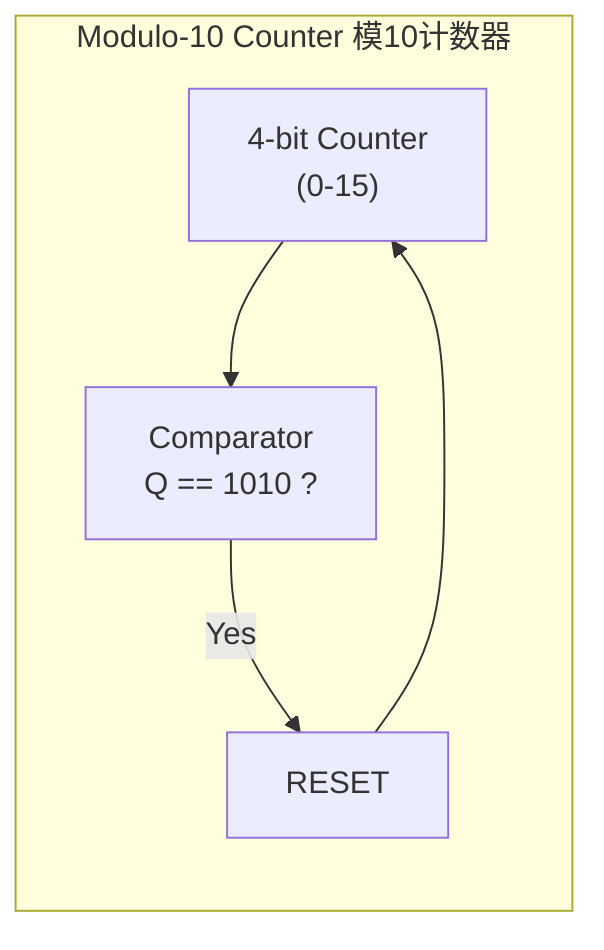

---

## 10. Memory Arrays（存储阵列）

### 10.1 基本概念

> Memory is organised as a two-dimensional array of cells. The memory reads or writes one word at a time based on its address.

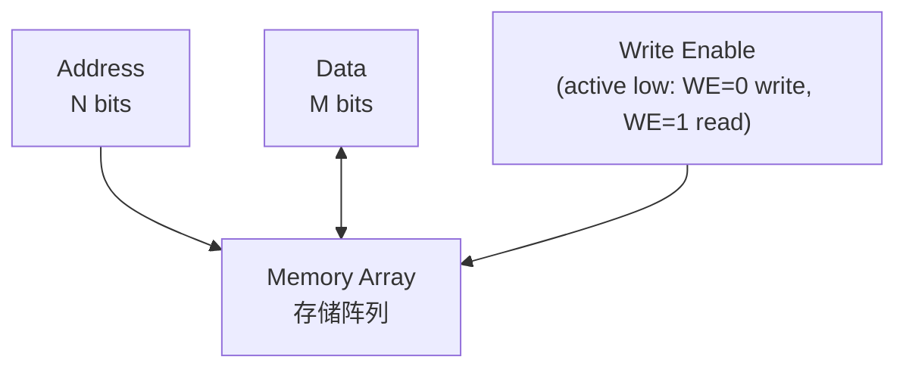

### 10.2 参数定义

| 参数 | 定义 | 公式 |
|------|------|------|
| **Depth 深度** | 行数 = 字的数量 | Depth = 2^N（N = 地址位宽）|
| **Width 宽度** | 列数 = 每个字的 bit 数 | Width = M |
| **Capacity 容量** | 总 bit 数 | Capacity = 2^N * M bits |

**示例：**
- 8-bit 地址，32-bit 字宽：
  - Depth = 2^8 = 256 行
  - Width = 32 bits
  - Capacity = 256 * 32 = 8192 bits = 1024 bytes = 1 KB

### 10.3 数据单位

**二进制制单位（IEC 1998 标准）-- Computer Science 常用：**

| 单位 | 缩写 | 大小 |
|------|------|------|
| Byte | B | 8 bits |
| Kibibyte | KiB | 1024 bytes (2^10) |
| Mebibyte | MiB | 1024 KiB (2^20) |
| Gibibyte | GiB | 1024 MiB (2^30) |
| Tebibyte | TiB | 1024 GiB (2^40) |

**十进制制单位（SI 标准 -- 硬盘厂商常用）：**

| 单位 | 缩写 | 大小 |
|------|------|------|
| Kilobyte | KB | 1000 bytes (10^3) |
| Megabyte | MB | 1000 KB (10^6) |
| Gigabyte | GB | 1000 MB (10^9) |

**考试中默认使用二进制制单位。**

### 10.4 DRAM 工作原理

> A single DRAM cell stores 1-bit using **1 transistor and 1 capacitor** (1T-1C cell).

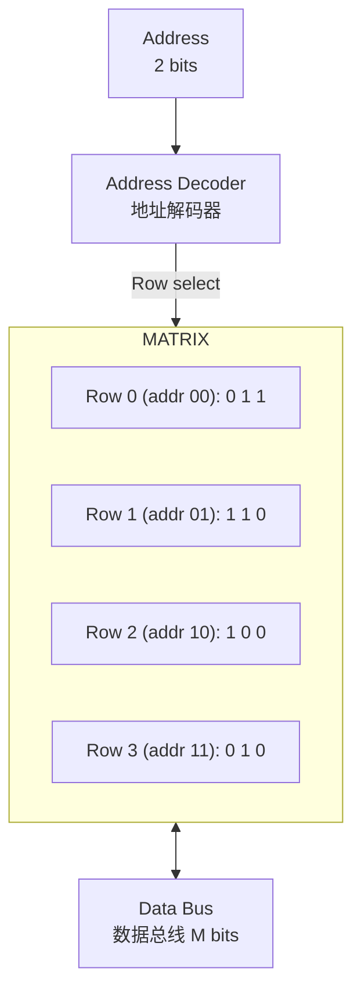

**读操作 (Read):**
- Address Decoder 激活对应地址的行（Row 信号 = 1）
- 其余行信号 = 0（deactivated）
- 被激活行的单元将其值加载到 Data Bus
- 例如：Read address 10 (2) -> 输出 "100"

**写操作 (Write):**
- Address Decoder 激活对应地址的行
- 被激活行的单元从 Data Bus 加载新值
- 其余行的单元不受影响
- 例如：Write "011" to address 00 -> Row 0 变为 "0 1 1"

### 10.5 多端口存储器 (Multi-Port Memory)

> "A memory port is an interface through which data can be read from, or written to, a memory array."

- **单端口 (Single Port)**：同一时间只能读或写一个字
- **双端口 (Dual Port)**：可同时进行两路操作（两个地址、两路数据）
- 用途：CPU Register File 通常为多端口，支持同时读两个操作数并写一个结果

### 10.6 RAM vs ROM

- **RAM (Random Access Memory)**：可以按任意顺序随机访问任意地址，可读可写
- **ROM (Read Only Memory)**：只能读，不能写
  - 注意：Random Access 指的是**可以随机顺序访问**（不是只能顺序访问）

---

## 11. 有限状态机 FSM

> Finite State Machine (FSM) 是时序电路设计的核心方法论。

### 11.1 两类 FSM

#### Moore Machine（摩尔型状态机）
- **输出仅取决于当前状态**
- Output = f(current state only)

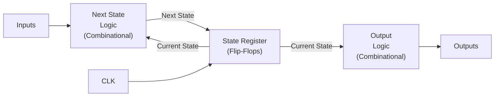

#### Mealy Machine（米利型状态机）
- **输出取决于当前状态和输入**
- Output = f(current state AND inputs)

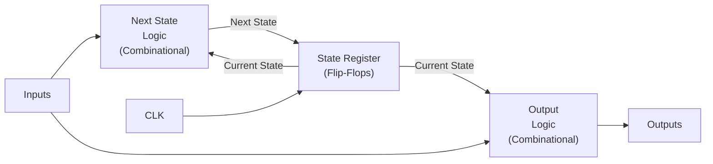

### 11.2 Moore vs Mealy 对比

| 特性 | Moore FSM | Mealy FSM |
|------|-----------|-----------|
| 输出依赖 | 仅当前状态 | 当前状态 + 当前输入 |
| 输出变化时机 | 仅在时钟边沿后 | 输入变化立即反映到输出 |
| 状态数量 | 通常更多 | 通常更少 |
| 输出时序 | 更"干净"，与时钟同步 | 可能有毛刺（glitch） |
| 复杂度 | 设计稍简单 | 设计稍复杂但更紧凑 |

### 11.3 FSM 设计流程

```mermaid
flowchart TD
    A["1. Problem Specification\n问题描述"] --> B["2. State Diagram\n状态图"]
    B --> C["3. State Table\n状态表"]
    C --> D["4. State Assignment\n状态编码分配"]
    D --> E["5. Next-State Equations\n下一状态逻辑方程"]
    E --> F["6. Output Equations\n输出方程"]
    F --> G["7. Circuit Implementation\n电路实现"]
```

**各步骤说明：**

1. **Problem Specification**：明确需要检测/识别/生成什么模式
2. **State Diagram**：画出状态和转换条件（输入 + 转换 -> 下一状态）
3. **State Table**：将状态图转化为表格形式
4. **State Assignment**：为每个状态分配二进制编码（影响电路复杂度）
5. **Next-State Equations**：使用 K-map 等方法化简下一状态的布尔方程
6. **Output Equations**：列出输出的布尔方程
7. **Circuit Implementation**：使用 Flip-Flop 和组合逻辑门实现

### 11.4 状态编码策略

| 编码方式 | 描述 | 优缺点 |
|---------|------|--------|
| **Binary** | 顺序编码：00, 01, 10, 11 | 最少 Flip-Flop，但可能复杂 |
| **Gray Code** | 相邻状态仅一位变化 | 减少毛刺 |
| **One-Hot** | 每状态一个 Flip-Flop：0001, 0010, 0100, 1000 | 简单逻辑，但 Flip-Flop 多 |
| **One-Cold** | 每状态一个 0：1110, 1101, 1011, 0111 | 某些工艺上方便 |

---

## 12. 时序与时序参数 Timing

### 12.1 时钟参数

- **Clock Period (T, 时钟周期)**：连续两个 positive edge 之间的时间
- **Clock Frequency (f, 时钟频率)**：每秒的时钟周期数
  - $f = \frac{1}{T}$（Hz）
  - $T = \frac{1}{f}$（s）
- **示例**：3 GHz -> $T = \frac{1}{3 \times 10^9} = 0.333 \times 10^{-9}$ s = **333 ps**

| 频率单位 | 符号 | 倍数 |
|---------|------|------|
| Hertz | Hz | 1 |
| Kilohertz | kHz | 10^3 |
| Megahertz | MHz | 10^6 |
| Gigahertz | GHz | 10^9 |
| Terahertz | THz | 10^12 |

| 时间单位 | 符号 | 秒数 |
|---------|------|------|
| second | s | 1 |
| millisecond | ms | 10^-3 |
| microsecond | us (mu-s) | 10^-6 |
| nanosecond | ns | 10^-9 |
| picosecond | ps | 10^-12 |
| femtosecond | fs | 10^-15 |

### 12.2 关键时序参数

```
    <── t_setup ──><─ t_hold ─>
    ─────────────┐              ┌─────────
                 │   CLK Edge   │
                 └──────────────┘
D: ──────valid──────────────change─────────
         ↑                    ↑
     t_setup 之前         t_hold 之后
     D 必须稳定           D 必须保持
```

#### Setup Time (t_setup, 建立时间)
- **定义**：在 CLK 有效边沿**之前**，D 输入必须保持稳定的最短时间
- 违反后果：可能采样到错误的值（Metastability 亚稳态）

#### Hold Time (t_hold, 保持时间)
- **定义**：在 CLK 有效边沿**之后**，D 输入必须保持稳定的最短时间
- 违反后果：同样可能导致 Metastability

#### Propagation Delay (t_pd, 传播延迟，Clock-to-Q Delay)
- **定义**：从 CLK 有效边沿到 Q 输出稳定新值的延迟时间
- 也称为 **t_cko** 或 **t_cq** (clock-to-q)

```mermaid
flowchart LR
    subgraph "Timing Window 时序窗口"
        direction LR
        S1["t_clk_to_q\nClock-to-Q Delay"]
        S2["t_setup\nSetup Time"]
        S3["t_hold\nHold Time"]
    end

    subgraph "Complete Clock Cycle"
        direction LR
        P1["CLK Edge\n时钟边沿"] -->|"t_pd"| P2["Q 更新"]
        P2 -->|"Combinational Logic\n组合逻辑延迟"| P3["Next D 稳定"]
        P3 -->|"t_setup"| P4["Next CLK Edge"]
    end
```

### 12.3 关键时序方程

**最小时钟周期 (Minimum Clock Period):**

$$T_{min} \geq t_{pd}(FF) + t_{pd}(comb) + t_{setup}$$

其中：
- $t_{pd}(FF)$：Flip-Flop 的 clock-to-q 延迟
- $t_{pd}(comb)$：组合逻辑的最大传播延迟
- $t_{setup}$：下一级 Flip-Flop 的 setup time

**最大时钟频率 (Maximum Clock Frequency):**

$$f_{max} = \frac{1}{T_{min}}$$

### 12.4 Clock Skew (时钟偏差)

- **定义**：时钟信号到达不同 Flip-Flop 的时间差
- 由于走线长度不同、负载不同导致
- **危害**：
  - 可能导致 hold time violation
  - 限制系统最大工作频率

```
CLK source ─┬──── wire 1 ──── FF1 (早到达)
            │
            └──── wire 2 ──── FF2 (晚到达, delay = skew)
                                   ↑
                              Clock Skew
```

---

## 13. 同步 vs 异步时序电路

### 13.1 同步时序电路 (Synchronous Sequential Circuits)

- **定义**：所有存储元件（Flip-Flop）共享同一个全局时钟信号
- **状态变化仅发生在有效时钟边沿**
- **优点**：
  - 设计简单、可预测
  - 容易验证和分析
  - 没有 race condition（竞争条件）
- **缺点**：
  - 时钟分布网络消耗功耗
  - 速度受限于最慢路径

### 13.2 异步时序电路 (Asynchronous Sequential Circuits)

- **定义**：不使用全局时钟，状态变化由输入信号的改变直接触发
- SR Latch 是最简单的异步电路
- **优点**：
  - 没有时钟功耗
  - 理论上更快（data-driven）
  - 没有 clock skew 问题
- **缺点**：
  - 设计非常复杂
  - 存在 race condition 和 hazard
  - 难以验证和测试

| 特性 | Synchronous 同步 | Asynchronous 异步 |
|------|-----------------|-------------------|
| 时钟信号 | 全局时钟 CLK | 无 |
| 状态变化时机 | 仅时钟边沿 | 输入变化即反应 |
| 设计复杂度 | 较低（主流方法） | 高 |
| Race Condition | 容易避免 | 主要挑战 |
| 功耗 | 有时钟功耗 | 无时钟功耗 |
| 代表器件 | D Flip-Flop, Register | SR Latch, D Latch |

---

## 14. 易混淆概念

### 14.1 Latch vs Flip-Flop

| 特性 | Latch (锁存器) | Flip-Flop (触发器) |
|------|---------------|-------------------|
| 触发方式 | **Level-sensitive** 电平敏感 | **Edge-sensitive** 边沿敏感 |
| 状态更新时机 | Enable=1 整个期间 | 仅时钟边沿瞬间 |
| 透明性 | 透明模式（Transparent） | 不透明 |
| 抗干扰 | 弱（输入 glitch 会传到输出） | 强（仅在边沿采样） |
| 功耗 | 较低 | 较高 |
| 使用场景 | 数据暂存、总线保持 | 寄存器、计数器、FSM |
| 代表器件 | SR Latch, D Latch | D FF, JK FF, T FF |
| 同步性 | 异步 (Asynchronous) | 同步 (Synchronous) |

**记忆口诀**：Latch 是透明的（门开着就看到里面），Flip-Flop 是不透明的（只有边沿那一瞬间偷看一眼）。

### 14.2 Synchronous vs Asynchronous Counter

| 特性 | Synchronous Counter 同步计数器 | Asynchronous (Ripple) Counter 异步计数器 |
|------|-------------------------------|----------------------------------------|
| CLK 连接 | 所有 FF 共享同一 CLK | 每级 FF 用前级输出作 CLK |
| 传播延迟 | 所有输出同时变化 | 逐级累积 (ripple through) |
| 速度 | 快 | 慢（等待 ripple） |
| 毛刺 (Glitch) | 无 | 有（中间状态） |
| 电路复杂度 | 较高（需要额外逻辑） | 低（简单 cascaded） |
| 最大频率 | 高 | 低 |

### 14.3 Moore vs Mealy FSM

| 特性 | Moore FSM | Mealy FSM |
|------|-----------|-----------|
| 输出取决于 | **仅当前状态** | **当前状态 + 输入** |
| 输出方程 | Output = f(state) | Output = f(state, input) |
| 输出变化时机 | 时钟边沿后 | 输入变化立即反映 |
| 状态数 | 更多 | 更少 |
| 输入响应速度 | 慢一拍 | 即时（组合逻辑路径） |

### 14.4 Combinational vs Sequential Logic

| 特性 | Combinational Logic | Sequential Logic |
|------|---------------------|-------------------|
| 记忆 | 无 | 有 |
| 输出 | 仅取决于当前输入 | 取决于当前输入和历史状态 |
| 电路结构 | 无反馈 | 有反馈回路 |
| 时间概念 | 瞬时（稳态值） | 有时序（时钟驱动状态转移） |
| 描述 | Truth Table, Boolean Eq. | State Table, State Diagram |
| 例子 | Adder, MUX, Decoder | Flip-Flop, Register, Counter |

### 14.5 SR vs JK vs D vs T Flip-Flop 综合对比

| 特性 | SR | JK | D | T |
|------|-----|-----|-----|-----|
| 输入 | S, R (异步) | J, K (同步) | D (Data) | T (Toggle) |
| 特征方程 | — | Q(n+1) = J!Q + !KQ | Q(n+1) = D | Q(n+1) = T XOR Q |
| 无效状态 | S=1, R=1 无效 | 无（Toggle） | 无 | 无 |
| Toggle 功能 | 无 | 有 (J=K=1) | 无 | 有 (T=1) |
| 电路复杂度 | 低 | 中 | 低 | 低 |
| 用途 | 基本锁存、按键消抖 | 计数器、FSM | 寄存器、数据存储 | 计数器 |
| 优点 | 简单 | 功能最全 | 最简单可靠 | 简单 toggle |
| 缺点 | 无效状态 | 稍复杂 | 无 toggle 功能 | 功能少 |

### 14.6 Setup Time vs Hold Time

| 特性 | Setup Time (t_setup) | Hold Time (t_hold) |
|------|---------------------|-------------------|
| 参考点 | CLK 边沿之前 | CLK 边沿之后 |
| 要求 | D 必须在此之前稳定 | D 必须在此之后保持稳定 |
| 违反后果 | 采样错误、亚稳态 | 采样错误、亚稳态 |
| 成因 | 组合逻辑延迟过大 | Clock skew、hold time 不足 |
| 影响 | 限制最大频率 | 限制最小延迟路径 |
| 优化方法 | 减少组合逻辑、流水线 | 增加组合逻辑延迟或行缓冲 |

**关键理解**：setup time 限制了**能跑多快**，hold time 限制了**不能跑太"快"**（组合逻辑不能太短）。

---

## 15. FSM 设计示例：序列检测器 ("101")

### 问题描述

设计一个 Mealy 型序列检测器，当检测到输入序列 **"101"** 时输出 Z=1，其余情况输出 Z=0。允许序列重叠 (overlap)。

**重叠示例**：
```
Input:  1 0 1 0 1 0 1 1 0 1
        ...检测到↓
Output: 0 0 1 0 1 0 1 0 0 1
              ↑   ↑   ↑       ↑
```

### Step 1: 状态定义

需要记住"已经看到了多少个正确的连续 bit"：

| 状态 | 含义 (Meaning) |
|------|----------------|
| S0 | 初始/复位，未匹配任何 bit (或最后一个匹配后重置) |
| S1 | 已检测到 "1" |
| S2 | 已检测到 "10" |
| S3 | 已检测到 "101" (但实际上 Mealy 不需要 S3 作为单独状态，因为输出跟着走) |

**Mealy 合并**：在 Mealy 型中，输出由转换 (transition) 产生，因此 S3 状态可以合并——检测到 101 时输出 Z=1 并同时回到下一个合适的状态。

### Step 2: State Diagram 状态图

```mermaid
stateDiagram-v2
    direction LR

    [*] --> S0
    S0 --> S1 : Input=1 / Z=0
    S0 --> S0 : Input=0 / Z=0

    S1 --> S2 : Input=0 / Z=0
    S1 --> S1 : Input=1 / Z=0

    S2 --> S0 : Input=0 / Z=0
    S2 --> S1 : Input=1 / Z=1

    note right of S2
        检测到 "101"
        输出 Z=1
        同时开始下一次检测
        (重叠: 最后的1 作为下一个序列的第一个1)
    end note
```

### Step 3: State Table 状态表

| Current State | Input X=0 | Input X=0 | Input X=1 | Input X=1 |
|:---:|:---:|:---:|:---:|:---:|
| | Next State | Output Z | Next State | Output Z |
| S0 | S0 | 0 | S1 | 0 |
| S1 | S2 | 0 | S1 | 0 |
| S2 | S0 | 0 | S1 | 1 |

### Step 4: State Assignment 状态编码

3 个状态，至少需 2 个 Flip-Flop。我们用以下编码：

| State | Q1 Q0 | Encoding |
|-------|-------|----------|
| S0 | 00 | 初始 |
| S1 | 01 | 检测到 "1" |
| S2 | 10 | 检测到 "10" |
| (未使用) | 11 | Don't care |

### Step 5: Next-State Table (展开编码)

| Q1 Q0 | X | D1 D0 (Next State) | Z |
|-------|---|---------------------|---|
| 0 0 | 0 | 0 0 (S0) | 0 |
| 0 0 | 1 | 0 1 (S1) | 0 |
| 0 1 | 0 | 1 0 (S2) | 0 |
| 0 1 | 1 | 0 1 (S1) | 0 |
| 1 0 | 0 | 0 0 (S0) | 0 |
| 1 0 | 1 | 0 1 (S1) | 1 |
| 1 1 | 0 | X X (don't care) | X |
| 1 1 | 1 | X X (don't care) | X |

### Step 6: Next-State Equations (K-map 化简)

**D1 (用 D Flip-Flop):**

| Q1\Q0,X | 00 | 01 | 11 | 10 |
|---------|----|----|----|-----|
| 0 (Q1=0) | 0 (S0,X=0) | 1 (S1,X=0) | X | 0 (S2,X=0-ish...) |

简化后：
$$D1 = \overline{Q1} \cdot Q0 \cdot \overline{X}$$

**D0:**

| Q1\Q0,X | 00 | 01 | 11 | 10 |
|---------|----|----|----|-----|
| 0 | 0 | 1 | X | X |
| 1 | 0 | 1 | X | 1 |

简化后：
$$D0 = \overline{Q1} \cdot \overline{Q0} \cdot X + \overline{Q1} \cdot Q0 \cdot X + Q1 \cdot \overline{Q0} \cdot X = \overline{Q1} \cdot X + Q1 \cdot \overline{Q0} \cdot X$$

进一步化简：
$$D0 = X \cdot (\overline{Q1} + Q1 \cdot \overline{Q0}) = X \cdot (\overline{Q1} + \overline{Q0})$$

### Step 7: Output Equation

**Z:** 仅当 Q1=1, Q0=0 (S2, 即 "10") 且 X=1 (第三个 bit 是 1) 时：

$$Z = Q1 \cdot \overline{Q0} \cdot X$$

### Step 8: Circuit Implementation 电路实现

```mermaid
flowchart TB
    X["Input X"] --> AND1["AND"]
    X --> AND2["AND"]

    subgraph FF["D Flip-Flops"]
        DFF1["DFF 1\n(D1 -> Q1)"]
        DFF0["DFF 0\n(D0 -> Q0)"]
    end

    NOTQ1["NOT"] --> AND1
    Q0Y["Q0"] --> AND1
    NOTX["NOT X"] --> AND1
    AND1 --> D1_IN["D1"]

    NOTQ1B["NOT Q1"] --> OR2["OR"]
    NOTQ0B["NOT Q0"] --> OR2
    OR2 --> ANDX["AND"]
    X --> ANDX
    ANDX --> D0_IN["D0"]

    Q1["Q1"] --> NOTQ0["NOT"]
    NOTQ0 --> ANDZ["AND"]
    X --> ANDZ
    ANDZ --> Z["Z (Output)"]

    CLK["CLK"] --> DFF1
    CLK --> DFF0
```

---

## 16. 高频考点

### 16.1 关键公式速记

| 内容 | 公式 |
|------|------|
| 时钟频率与周期关系 | $f = 1/T$，$T = 1/f$ |
| D FF 特征方程 | $Q(n+1) = D$ |
| JK FF 特征方程 | $Q(n+1) = J \cdot \overline{Q} + \overline{K} \cdot Q$ |
| T FF 特征方程 | $Q(n+1) = T \oplus Q$ |
| 最小时钟周期 | $T_{min} \geq t_{ckq} + t_{pd\_comb} + t_{setup}$ |
| 最大频率 | $f_{max} = 1/T_{min}$ |
| 存储器容量 | $Capacity = 2^N \times M$ bits |

### 16.2 典型考题类型

**类型 1：给定 SR Latch 输入波形，画出 Q 和 !Q 波形**
- 考点：理解 NOR SR Latch 的保持、置位、复位、无效状态
- 注意：S=R=1 时 Q=!Q=0（无效）；之后 S=R=0 时状态不确定
- 注意：初始状态未知时先画 unknown

**类型 2：给定 D Flip-Flop 电路，完成时序图**
- 考点：理解 positive/negative edge 触发
- Q 仅在有效边沿更新为当时 D 的值
- 两个边沿之间 Q 不变

**类型 3：给定 FSM 状态描述，画出状态图 + 状态表 + 实现电路**
- 考点：FSM 完整设计流程
- 区分 Moore (输出标在 state 里) vs Mealy (输出标在 transition 上)
- 注意重叠 (overlap) 情况的状态转换

**类型 4：给定 JK/DFF 电路，推导其状态转换序列**
- 考点：分析已有电路，推导状态机功能
- 写出每个 FF 的输入方程 -> 特征方程 -> 状态转换表 -> 状态图

**类型 5：给定 Ripple Counter 电路，分析计数序列和最大工作频率**
- 考点：Ripple 计数器的传播延迟累积
- $T_{min} = N \times t_{pd}$ (N 为 FF 级数)
- 可能问到出现的中间状态 (glitch)

**类型 6：寄存器移位操作**
- 考点：SISO/SIPO/PISO/PIPO 的操作过程
- 给定初始值和输入序列，求 N 个 CLK 后的输出值

**类型 7：时序分析计算**
- 已知 t_ckq, t_setup, t_hold, t_pd_comb
- 求最大时钟频率 f_max
- 判断是否满足时序约束（setup check / hold check）

**类型 8：SR Latch 内部结构分析**
- 给定 NOR/NAND SR Latch 电路图
- 要求逐级分析信号变化过程
- 解释为什么 S=1,R=1 是无效状态

### 16.3 常见易错点

1. **Latch 和 Flip-Flop 的混淆**：Latch 是 level-sensitive（整个电平期间都透明），FF 是 edge-sensitive（仅边沿采样）
2. **SR Latch 中 S=R=1 的处理**：NOR 实现输出 Q=!Q=0（无效），之后回到 S=R=0 时结果不确定
3. **D Flip-Flop 的 Q 在边沿之间的约束**：Q 在任何两个边沿之间绝对不会变化
4. **异步 Ripple Counter 的延迟累积**：速度 = 1 / (N * t_pd)
5. **Moore 输出标在圆圈内（state）**，**Mealy 输出标在箭头上（transition）**
6. **序列检测器的重叠 (overlap) 处理**：最常见的错误是检测完成后回 S0 而不是保留可能的匹配前缀
7. **Setup Time vs Hold Time 的区别**：setup 在边沿前，hold 在边沿后
8. **1 KB = 1024 bytes** (不是 1000 bytes, 除非题目指定使用 SI 单位)

### 16.4 快速核查表 (Quick Reference)

| 器件 | Level/Edge | 有无 Clock | 状态数 | 特征 |
|------|-----------|-----------|--------|------|
| SR Latch (NOR) | Level | 无 | 3 (Set/Reset/Hold) | Active High, S=R=1 invalid |
| SR Latch (NAND) | Level | 无 | 3 (Set/Reset/Hold) | Active Low, !S=!R=0 invalid |
| Gated SR Latch | Level | Enable | 3 | 增加时间控制 |
| D Latch | Level | Enable | 2 (0/1) | 消除无效状态 |
| D Flip-Flop | Edge | CLK | 2 (0/1) | 最常用 |
| JK Flip-Flop | Edge | CLK | 3 (0/1/Toggle) | 功能最全 |
| T Flip-Flop | Edge | CLK | 2 (Hold/Toggle) | 计数器用 |

---

*Notes prepared for COMP30660 Computer Architecture, UCD. Updated April 2026.*
