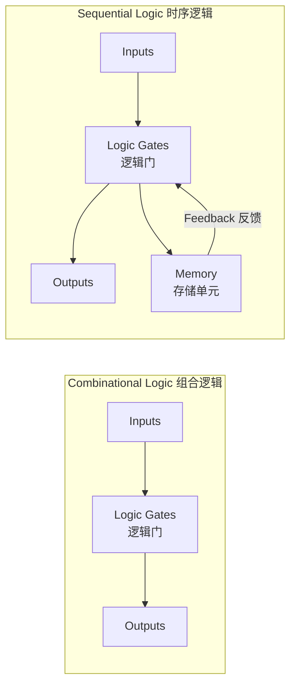
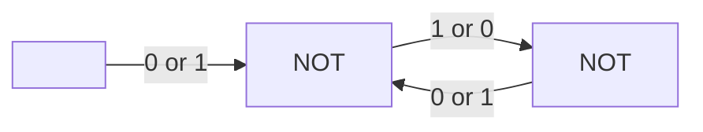
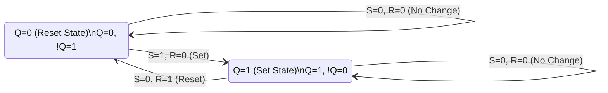
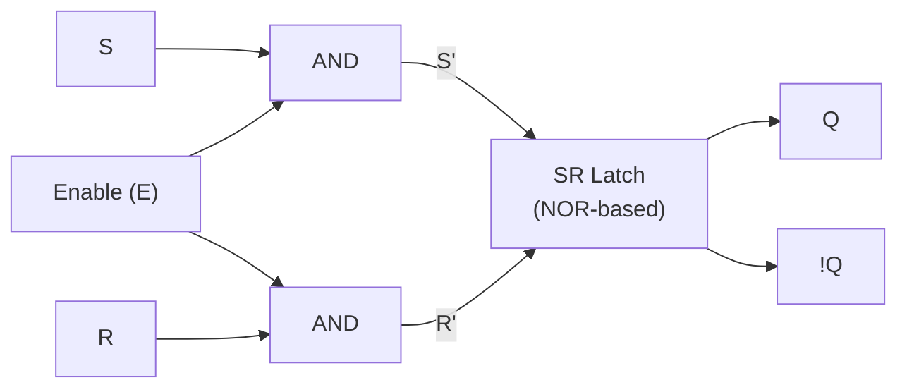
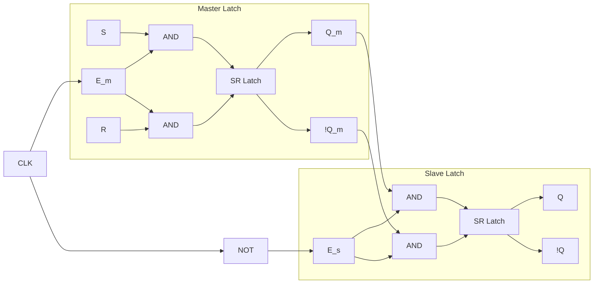
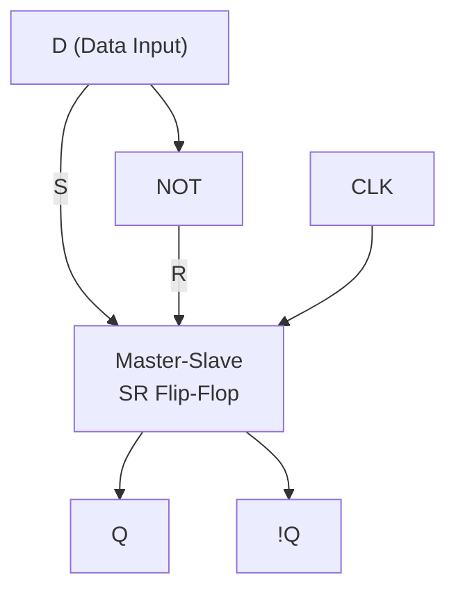
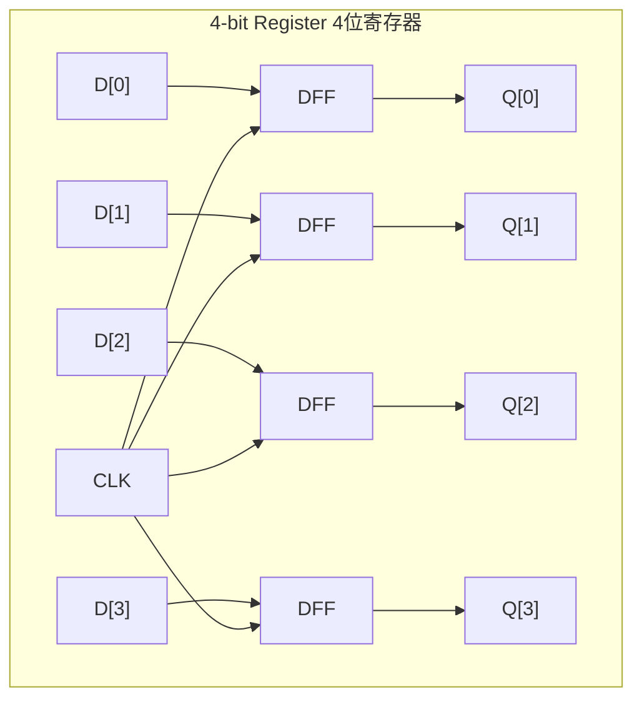
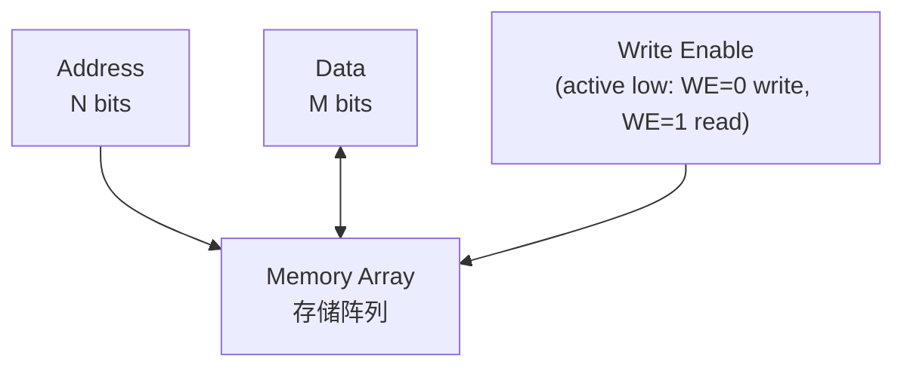
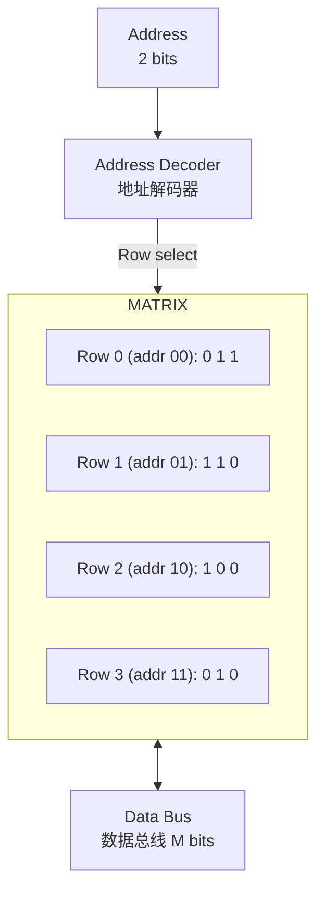

# 04 时序逻辑 (Sequential Logic)

> **课程**: COMP30660 Computer Architecture & Organisation
> **章节**: Ch 4 Sequential Logic (Professor Chris Bleakley, UCD)
> **参考**: Harris & Harris, Digital Design and Computer Architecture, Chapter 3

---

## 目录

1. [时序逻辑概述](#1-时序逻辑概述)
2. [基本存储单元 -- SR Latch](#2-基本存储单元----sr-latch)
3. [Gated SR Latch（门控锁存器）](#3-gated-sr-latch门控锁存器)
4. [D Latch（数据锁存器）](#4-d-latch数据锁存器)
5. [D Flip-Flop（D 触发器）](#5-d-flip-flopd-触发器)
6. [寄存器 Registers](#6-寄存器-registers)
7. [计数器 Counters](#7-计数器-counters)
8. [Memory Arrays（存储阵列）](#8-memory-arrays存储阵列)
9. [易混淆概念](#9-易混淆概念)
10. [高频考点](#10-高频考点)

---

## 1. 时序逻辑概述

### 定义

> "Sequential logic consists of logic gates which are connected together to produce a specified output for certain specified combinations of **current and previous inputs**."

- **核心特征**：时序逻辑拥有 **memory（记忆）**，输出不仅取决于当前的输入，还取决于过去的输入/历史状态。
- 组合逻辑 (Combinational Logic) 没有记忆，输出仅由当前输入决定。

### 组合逻辑 vs 时序逻辑

| 特性 | Combinational Logic | Sequential Logic |
|------|---------------------|-------------------|
| 记忆能力 | 无 (no memory) | 有 (has memory) |
| 输出依赖 | 仅当前输入 | 当前输入 + 历史状态 |
| 反馈回路 (Feedback) | 无 | 存在反馈回路 |
| 电路举例 | AND gate, Adder, MUX | Latch, Flip-Flop, Register, Counter |
| 描述方式 | 真值表 (Truth Table), 布尔表达式 | 状态表 (State Table), 状态图 (State Diagram) |


```mermaid
flowchart LR
    subgraph Combinational["Combinational Logic 组合逻辑"]
        I1["Inputs"] --> LG["Logic Gates\n逻辑门"] --> O1["Outputs"]
    end

    subgraph Sequential["Sequential Logic 时序逻辑"]
        I2["Inputs"] --> LG2["Logic Gates\n逻辑门"] --> O2["Outputs"]
        LG2 --> MEM["Memory\n存储单元"]
        MEM -->|"Feedback 反馈"| LG2
    end
```

### 反馈 (Feedback)

> "Feedback is connecting a circuit's output to its input."

一个最简单的 1-bit 存储可以由两个 NOT gate（反相器）串联并加入反馈构成：


```mermaid
flowchart LR
    A[" "] -->|"0 or 1"| N1["NOT"]
    N1 -->|"1 or 0"| N2["NOT"]
    N2 -->|"0 or 1"| N1
```

- **Bistable（双稳态）**：电路可以在两个稳定状态 (0 或 1) 之间保持任意一个。
- 问题是：**没有办法方便地改变或设置这个状态**。这就是 Latch 需要解决的核心问题。

---

## 2. 基本存储单元 -- SR Latch

> "A latch is a **level-sensitive** bistable circuit that stores one bit of data and holds its state until it is changed by an input signal."

### 2.1 SR Latch (NOR Gate Implementation)

SR Latch 使用两个交叉耦合的 NOR gate 构成：
#### 工作原理（NOR 实现）
!Q = !(S + Q)
Q  = !(R + !Q)
![[Pasted image 20260509230356.png|290]]


![[Pasted image 20260509230345.png|246]]
#### NOR Gate 真值表 (回顾)

| A | B | A NOR B |
|---|---|---------|
| 0 | 0 | 1 |
| 0 | 1 | 0 |
| 1 | 0 | 0 |
| 1 | 1 | 0 |


**SET 操作 (S=1, R=0):**
- S=1 使得 Gate X 输出 = 0（无论另一个输入是什么），因此 !Q = 0
- R=0 且 !Q=0，Gate Y 的两个输入都是 0，输出为 1，因此 Q = 1
- Latch 处于 **SET 状态** (Q=1, !Q=0)

**RESET 操作 (S=0, R=1):**
- R=1 使得 Gate Y 输出 = 0（无论另一个输入是什么），因此 Q = 0
- S=0 且 Q=0，Gate X 的两个输入都是 0，输出为 1，因此 !Q = 1
- Latch 处于 **RESET 状态** (Q=0, !Q=1)

**记忆模式/Memory Mode (S=0, R=0):**
- 两个 NOR gate 各有一个来自交叉耦合的输入为高电平时，维持当前状态不变
- 如果之前 SET (Q=1, !Q=0)：Gate X 输入 (S=0, Q=1)，输出 !Q=0 保持不变；Gate Y 输入 (R=0, !Q=0)，输出 Q=1 保持不变
- 如果之前 RESET (Q=0, !Q=1)：Gate X 输入 (S=0, Q=0)，输出 !Q=1 保持不变；Gate Y 输入 (R=0, !Q=1)，输出 Q=0 保持不变

**无效状态 (S=1, R=1):**
- 两个 NOR gate 输出均为 0：Q=0, !Q=0
- 这违反了互补输出的约定——**必须避免**


```mermaid
stateDiagram-v2
    direction LR
    state "Q=0 (Reset State)\nQ=0, !Q=1" as S0
    state "Q=1 (Set State)\nQ=1, !Q=0" as S1

    S0 --> S1 : S=1, R=0 (Set)
    S1 --> S0 : S=0, R=1 (Reset)
    S0 --> S0 : S=0, R=0 (No Change)
    S1 --> S1 : S=0, R=0 (No Change)
```

#### Characteristic Table 特性表

| S | R | State 描述 | Q(n+1) 下一状态 | !Q(n+1) | Comments |
|---|---|-----------|-----------------|----------|----------|
| 0 | 0 | 保持 No Change | Q(n) | !Q(n) | 记忆模式 Memory Mode |
| 1 | 0 | 置位 Set | 1 | 0 | 置位 |
| 0 | 1 | 复位 Reset | 0 | 1 | 复位 |
| 1 | 1 | 无效 Invalid | undefined | undefined | **禁止 (Forbidden)** |

### 2.2 SR Latch (NAND Gate Implementation)

在许多实际实现中，SR Latch 也可使用 NAND gate 构建：
**NAND 实现的区别：**
Q  = !(!S̄ · !Q̄)
!Q̄ = !(!R̄ · Q )
![[Pasted image 20260509231540.png|406]]

#### NAND Gate 真值表 (回顾)

| A   | B   | A NAND B |
| --- | --- | -------- |
| 0   | 0   | 1        |
| 0   | 1   | 1        |
| 1   | 0   | 1        |
| 1   | 1   | 0        |

- 输入为 **active-low**（低电平有效）：!S 和 !R
- !S = 0, !R = 1 时 SET (Q=1, !Q=0)
- !S = 1, !R = 0 时 RESET (Q=0, !Q=1)
- !S = 1, !R = 1 时 No Change
- **!S = 0, !R = 0 是禁止的无效状态**

| !S | !R | State | Q(n+1) | Comments |
|----|----|-------|--------|----------|
| 1 | 1 | 保持 | Q(n) | No Change |
| 0 | 1 | 置位 | 1 | Set |
| 1 | 0 | 复位 | 0 | Reset |
| 0 | 0 | 无效 | undefined | **Forbidden** |

---

## 3. Gated SR Latch（门控锁存器）

在基本 SR Latch 的基础上，增加一个 **Enable (E)** 信号来控制何时允许状态更新。
![[Pasted image 20260509231739.png|376]]


```mermaid
flowchart LR
    S["S"] --> AND1["AND"]
    E["Enable (E)"] --> AND1
    E --> AND2["AND"]
    R["R"] --> AND2
    AND1 -->|"S'"| SR["SR Latch\n(NOR-based)"]
    AND2 -->|"R'"| SR
    SR --> Q["Q"]
    SR --> QN["!Q"]
```

### 工作原理

- **Enable = 1 (Transparent Mode / 透明模式):**
  - AND gate 输出 = S 和 R 原值 (S' = S, R' = R)
  - SR Latch 正常响应 S 和 R 输入
  - 可以进行 Set、Reset、No Change 操作

- **Enable = 0 (Memory Mode / 记忆模式):**
  - AND gate 输出恒为 0 (S' = 0, R' = 0)
  - SR Latch 保持在 No Change 状态
  - **无论 S, R 如何变化，锁存器状态都不会改变**

### 关键特性

- **Level-Sensitive（电平敏感）**：当 E=1 的整个期间，输出会跟随输入变化
- 相比基本 SR Latch，增加了时间控制能力
- 仍然存在 S=1, R=1 的无效状态问题（当 E=1 时）

### SR Flip-Flop 与 Master-Slave 结构

**Latches are level-sensitive** whereas **flip-flops are edge-sensitive**（锁存器是电平敏感的，而触发器是边沿敏感的）。![[Pasted image 20260511134246.png|606]]

```mermaid
flowchart LR
    subgraph Master["Master Latch"]
        SM["S"] --> ANDM1["AND"]
        EMI["E_m"] --> ANDM1
        EMI --> ANDM2["AND"]
        RM["R"] --> ANDM2
        ANDM1 --> SRM["SR Latch"]
        ANDM2 --> SRM
        SRM --> QM["Q_m"]
        SRM --> QNM["!Q_m"]
    end

    subgraph Slave["Slave Latch"]
        QM --> ANDS1["AND"]
        ES["E_s"] --> ANDS1
        ES --> ANDS2["AND"]
        QNM --> ANDS2
        ANDS1 --> SRS["SR Latch"]
        ANDS2 --> SRS
        SRS --> QOUT["Q"]
        SRS --> QNOUT["!Q"]
    end

    CLK["CLK"] --> EMI
    CLK --> NOTC["NOT"]
    NOTC --> ES
```

#### Master-Slave 工作过程

| 时钟阶段          | Master                                               | Slave                | 输出 Q             |
| ------------- | ---------------------------------------------------- | -------------------- | ---------------- |
| CLK = 1 (正电平) | **Memory Mode** (E_m = 1? 通过 NOT: E_m = 实际为 1 使能...) | **Transparent Mode** | 输出来自 Master 保存的值 |
| CLK = 0 (负电平) | **Transparent Mode** (跟踪 SR 输入)                      | **Memory Mode** (保持) | Q 不变             |


**简言之：**
1. **CLK 正边沿 (0->1)**：Master 进入 Memory Mode 锁存输入stores the SR input，Slave 进入 Transparent Mode 将 Master 的值传到输出 passes the Master's state to the output Q
2. **CLK 高电平期间**：Master 锁存，Slave 透明（输出不变因 Master 输入不变）
3. **CLK 负边沿 (1->0)**：Slave 进入 Memory Mode 锁存输出，Master 进入 Transparent Mode 跟踪输入
4. **CLK 低电平期间**：Slave 锁存输出不变，Master 透明

---

## 4. D Latch（数据锁存器）

### 动机

SR Latch 的问题：当 S=1, R=1 时产生无效状态。D Latch 通过将 **R = NOT(S)** 来解决此问题，这样 S 和 R 永远不会同时为 1。


![[Pasted image 20260511135938.png]]

### 工作原理

- 电路确保 **S = D 且 R = !D**
- 当 S=D=1 时 R=0（合法的 Set 操作），当 S=D=0 时 R=1（合法的 Reset 操作）
- **永远不会有 S=1 且 R=1 的情况**

| E (Enable) | D | Q(n+1) | Comments |
|------------|---|--------|----------|
| 0 | X | Q(n) | Memory Mode (锁存) |
| 1 | 0 | 0 | Reset / 透明模式 |
| 1 | 1 | 1 | Set / 透明模式 |

**关键点**：D Latch 是 **level-sensitive**（电平敏感），当 E=1 时，Q 直接 = D。这仍然存在"透明"期间输入抖动会传到输出的问题。

---

## 5. D Flip-Flop（D 触发器）

> "A flip-flop is a **synchronous bistable memory device**."（触发器是同步的双稳态存储器件）
![[Pasted image 20260510211826.png|384]]
### 5.1 边沿触发机制 (Edge-Triggered)

D Flip-Flop 是 **edge-sensitive**（边沿敏感），仅在时钟边沿时采样输入。

**电路实现**：D Flip-Flop 内部使用一个 NOT gate 将 D 分为 S 和 R 输入，然后送入 Master-Slave SR Flip-Flop：


```mermaid
flowchart TB
    D["D (Data Input)"] --> NOTDF["NOT"]
    D -->|"S"| MSFF["Master-Slave\nSR Flip-Flop"]
    NOTDF -->|"R"| MSFF
    CLK["CLK"] --> MSFF
    MSFF --> Q["Q"]
    MSFF --> QN["!Q"]
```

### 5.2 符号与定时图

- **三角形符号 (Triangle indicator)** 表示：输入是 **positive edge sensitive**（上升沿敏感）
- 如果有小圆圈在时钟输入端，则表示 **negative edge sensitive**（下降沿敏感）

**Positive Edge D Flip-Flop 行为：**

```
CLK:     ──┐     ┌──┐     ┌──┐     ┌──┐     ┌──┐     ┌──
           │     │  │     │  │     │  │     │  │     │
           └─────┘  └─────┘  └─────┘  └─────┘  └─────┘
D:     ────1───1────1───1────0───0────0───0────1───0───0────
                              ↑           ↑           ↑
Q:     ────────1────1───1────1───  0────0───0────0───0───1───?
               ↑    ↑        ↑    ↑        ↑    ↑        ↑
            unknown  Q follows D   Q holds    Q follows D
                    at edge        until next  at edge
                                   edge
```

**关键观察：**
1. Q 仅在 CLK 的 **positive edge** (上升沿) 改变
2. Q 永远等于**上一时钟边沿时 D 的值**
3. 两个边沿之间，Q 完全不变化
4. 第一条边沿前状态为 **unknown（未知）**

### 5.3 Characteristic Table 特性表

| CLK Edge | D | Q(n+1) | Comments |
|----------|---|--------|----------|
| Positive Edge (0->1) | 0 | 0 | Reset at edge |
| Positive Edge (0->1) | 1 | 1 | Set at edge |
| Non-edge (any other time) | X | Q(n) | Hold (保持不变) |

### 5.4 Characteristic Equation 特征方程

$$Q(n+1) = D$$

这是所有触发器中最简单的特征方程——下一状态直接等于 D 输入。

### 5.5 Excitation Table 激励表

激励表描述的是：**为了实现指定的状态转换，输入需要是什么值**。

| Q(n) -> Q(n+1) | Required D |
|----------------|------------|
| 0 -> 0 | 0 |
| 0 -> 1 | 1 |
| 1 -> 0 | 0 |
| 1 -> 1 | 1 |

---

## 6. 寄存器 Registers

> "A register stores a word of data using flip-flops."
> "A data word is a fixed-size group of bits that are processed, transferred and stored as a group."

### 6.1 基本寄存器 (Parallel Load Register)

N-bit 寄存器由 N 个 D Flip-Flop 并联组成，共享同一个 CLK 信号。


```mermaid
flowchart TB
    subgraph "4-bit Register 4位寄存器"
        D0["D[0]"] --> FF0["DFF"]
        D1["D[1]"] --> FF1["DFF"]
        D2["D[2]"] --> FF2["DFF"]
        D3["D[3]"] --> FF3["DFF"]
        CLK["CLK"] --> FF0
        CLK --> FF1
        CLK --> FF2
        CLK --> FF3
        FF0 --> Q0["Q[0]"]
        FF1 --> Q1["Q[1]"]
        FF2 --> Q2["Q[2]"]
        FF3 --> Q3["Q[3]"]
    end
```

- 所有 Flip-Flop 在同一个 CLK positive edge 更新
- 一个 CLK cycle 可以存储/加载一个完整的 N-bit word
- **总线表示 (Bus Notation)**：用 `[N-1:0]` 表示 N-bit bus，用斜线 `/` 标注在线上表示 bit 宽度


---

## 7. 计数器 Counters

### 7.1 4-bit Counter

课程中的 4-bit counter 使用 **4-bit register + 4-bit adder** 实现。

```
                   +------+
        CLK ------>|      |  4-bit Register
                   |      |  (D FFs with reset)
        +--------->|      |------+----> Q[3:0]
        |          +------+      |
        |                        |
        |   +-------+            |
        +---| +1    |<-----------+
            | Adder |
            +-------+
```
![[Pasted image 20260511143027.png|463]]
每个 CLK positive edge，Q = Q + 1。当 Q = 1111 时，下一周期溢出回到 0000。

### 7.2 行为

- At every positive edge of the clock, the stored number is incremented by 1.
- When the number is 15 (`1111`), it overflows back to 0 (`0000`).
- `RESET` is used to clear the register state.

---

## 8. Memory Arrays（存储阵列）

### 8.1 基本概念

> Memory is organised as a two-dimensional array of cells. The memory reads or writes one word at a time based on its address.


```mermaid
flowchart TB
    ADDR["Address\nN bits"] --> MEM["Memory Array\n存储阵列"]
    DATA["Data\nM bits"] <--> MEM
    WE["Write Enable\n(active low: WE=0 write, WE=1 read)"] --> MEM
```

### 8.2 参数定义

| 参数              | 定义              | 公式                      |
| --------------- | --------------- | ----------------------- |
| **Depth 深度**    | 行数 = 字的数量       | Depth = 2^N（N = 地址位宽）   |
| **Width 宽度**    | 列数 = 每个字的 bit 数 | Width = M               |
| **Capacity 容量** | 总 bit 数         | Capacity = 2^N * M bits |

**示例：**
- 8-bit 地址，32-bit 字宽：
  - Depth = 2^8 = 256 行
  - Width = 32 bits
  - Capacity = 256 * 32 = 8192 bits = 1024 bytes = 1 KB

### 8.3 数据单位

**二进制制单位（IEC 1998 标准）-- Computer Science 常用：**

| 单位 | 缩写 | 大小 |
|------|------|------|
| Byte | B | 8 bits |
| Kibibyte | KiB | 1024 bytes (2^10) |
| Mebibyte | MiB | 1024 KiB (2^20) |
| Gibibyte | GiB | 1024 MiB (2^30) |
| Tebibyte | TiB | 1024 GiB (2^40) |

**十进制制单位（SI 标准 -- 硬盘厂商常用）：**

| 单位 | 缩写 | 大小 |
|------|------|------|
| Kilobyte | KB | 1000 bytes (10^3) |
| Megabyte | MB | 1000 KB (10^6) |
| Gigabyte | GB | 1000 MB (10^9) |

**考试中默认使用二进制制单位。**

### 8.4 DRAM 工作原理

> A single DRAM cell stores 1-bit using **1 transistor and 1 capacitor** (1T-1C cell).


```mermaid
flowchart TB
    ADDR["Address\n2 bits"] --> DEC["Address Decoder\n地址解码器"]
    DEC -->|"Row select"| MATRIX["Cell Matrix\n存储单元矩阵"]

    subgraph MATRIX
        direction LR
        R0["Row 0 (addr 00): 0 1 1"]
        R1["Row 1 (addr 01): 1 1 0"]
        R2["Row 2 (addr 10): 1 0 0"]
        R3["Row 3 (addr 11): 0 1 0"]
    end

    MATRIX <--> DATA["Data Bus\n数据总线 M bits"]
```

**读操作 (Read):**
- Address Decoder 激活对应地址的行（Row 信号 = 1）
- 其余行信号 = 0（deactivated）
- 被激活行的单元将其值加载到 Data Bus
- 例如：Read address 10 (2) -> 输出 "100"

**写操作 (Write):**
- Address Decoder 激活对应地址的行
- 被激活行的单元从 Data Bus 加载新值
- 其余行的单元不受影响
- 例如：Write "011" to address 00 -> Row 0 变为 "0 1 1"

### 8.5 多端口存储器 (Multi-Port Memory)

> "A memory port is an interface through which data can be read from, or written to, a memory array."

- **单端口 (Single Port)**：同一时间只能读或写一个字
- **双端口 (Dual Port)**：可同时进行两路操作（两个地址、两路数据）
- 用途：CPU Register File 通常为多端口，支持同时读两个操作数并写一个结果

### 8.6 RAM vs ROM

- **RAM (Random Access Memory)**：可以按任意顺序随机访问任意地址，可读可写
- **ROM (Read Only Memory)**：只能读，不能写
  - 注意：Random Access 指的是**可以随机顺序访问**（不是只能顺序访问）

---

## 9. 易混淆概念

### 9.1 Latch vs Flip-Flop

| 特性     | Latch (锁存器)              | Flip-Flop (触发器)         |
| ------ | ------------------------ | ----------------------- |
| 触发方式   | **Level-sensitive** 电平敏感 | **Edge-sensitive** 边沿敏感 |
| 状态更新时机 | Enable=1 整个期间            | 仅时钟边沿瞬间                 |
| 透明性    | 透明模式（Transparent）        | 不透明                     |
| 抗干扰    | 弱（输入 glitch 会传到输出）       | 强（仅在边沿采样）               |
| 功耗     | 较低                       | 较高                      |
| 使用场景   | 基本 1-bit 存储              | 寄存器、计数器                 |
| 代表器件   | SR Latch, D Latch        | D FF                    |
| 同步性    | 异步 (Asynchronous)        | 同步 (Synchronous)        |

**记忆口诀**：Latch 是透明的（门开着就看到里面），Flip-Flop 是不透明的（只有边沿那一瞬间偷看一眼）。

### 9.2 Combinational vs Sequential Logic

| 特性 | Combinational Logic | Sequential Logic |
|------|---------------------|-------------------|
| 记忆 | 无 | 有 |
| 输出 | 仅取决于当前输入 | 取决于当前输入和历史状态 |
| 电路结构 | 无反馈 | 有反馈回路 |
| 时间概念 | 瞬时（稳态值） | 有时序（时钟驱动状态转移） |
| 描述 | Truth Table, Boolean Eq. | State Table, State Diagram |
| 例子 | Adder, MUX, Decoder | Flip-Flop, Register, Counter |

### 9.3 SR Latch vs D Flip-Flop

| 特性 | SR Latch | D Flip-Flop |
|------|----------|-------------|
| 控制方式 | Level-sensitive | Edge-sensitive |
| 输入 | S, R | D, CLK |
| 状态更新 | 输入有效电平期间可能变化 | 只在时钟边沿采样 |
| 无效情况 | NOR 实现中 S=R=1 无效 | 无 S/R 同时有效问题 |
| 课程用途 | 解释反馈存储原理 | Register、Counter、CPU 状态存储 |

---

## 10. 高频考点

### 10.1 关键公式速记

| 内容 | 公式 |
|------|------|
| D FF 特征方程 | $Q(n+1) = D$ |
| 存储器容量 | $Capacity = 2^N \times M$ bits |

### 10.2 典型考题类型

**类型 1：给定 SR Latch 输入波形，画出 Q 和 !Q 波形**
- 考点：理解 NOR SR Latch 的保持、置位、复位、无效状态
- 注意：S=R=1 时 Q=!Q=0（无效）；之后 S=R=0 时状态不确定
- 注意：初始状态未知时先画 unknown

	**类型 2：给定 D Flip-Flop 电路，完成时序图**
- 考点：理解 positive/negative edge 触发
- Q 仅在有效边沿更新为当时 D 的值
- 两个边沿之间 Q 不变


**类型 4：4-bit Counter 行为**
- 考点：Register 保存当前值，Adder 产生 `Q+1`
- 每个 positive edge 更新一次
- `1111` 后 overflow 回 `0000`

**类型 5：SR Latch 内部结构分析**
- 给定 NOR/NAND SR Latch 电路图
- 要求逐级分析信号变化过程
- 解释为什么 S=1,R=1 是无效状态

**类型 6：Memory capacity 计算**
- $Capacity = 2^N \times M$ bits
- N 是 address bits，M 是 data word width

### 10.3 常见易错点

1. **Latch 和 Flip-Flop 的混淆**：Latch 是 level-sensitive，FF 是 edge-sensitive
2. **SR Latch 中 S=R=1 的处理**：NOR 实现输出 Q=!Q=0（无效），之后回到 S=R=0 时结果不确定
3. **D Flip-Flop 的 Q 在边沿之间的约束**：Q 在任何两个边沿之间绝对不会变化
4. **Counter 的本质**：课程中重点是 4-bit register + adder
5. **1 KB = 1024 bytes** (不是 1000 bytes, 除非题目指定使用 SI 单位)

### 10.4 快速核查表 (Quick Reference)

| 器件 | Level/Edge | 有无 Clock | 状态数 | 特征 |
|------|-----------|-----------|--------|------|
| SR Latch (NOR) | Level | 无 | 3 (Set/Reset/Hold) | Active High, S=R=1 invalid |
| SR Latch (NAND) | Level | 无 | 3 (Set/Reset/Hold) | Active Low, !S=!R=0 invalid |
| Gated SR Latch | Level | Enable | 3 | 增加时间控制 |
| D Latch | Level | Enable | 2 (0/1) | 消除无效状态 |
| D Flip-Flop | Edge | CLK | 2 (0/1) | 最常用 |

---

*Notes prepared for COMP30660 Computer Architecture, UCD. Updated April 2026.*
