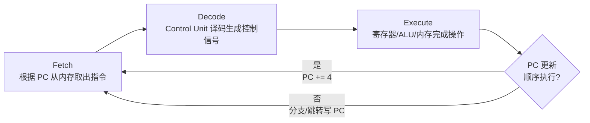
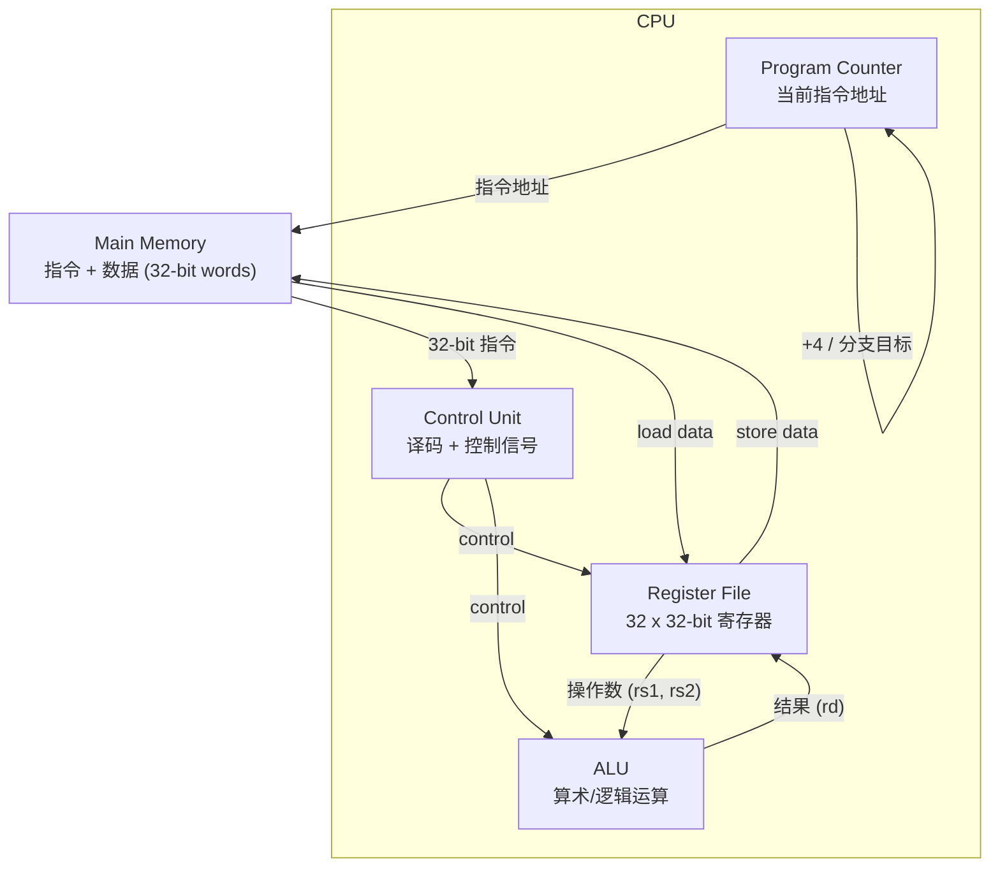
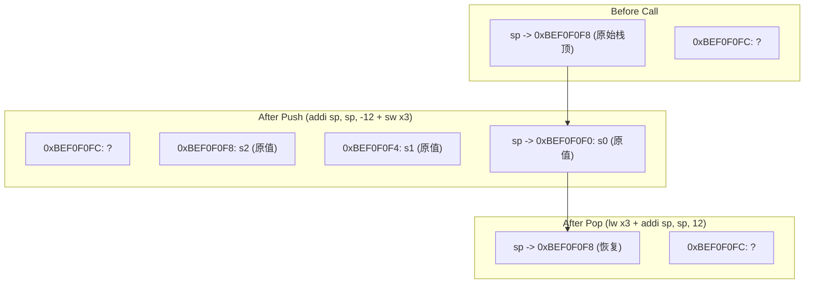
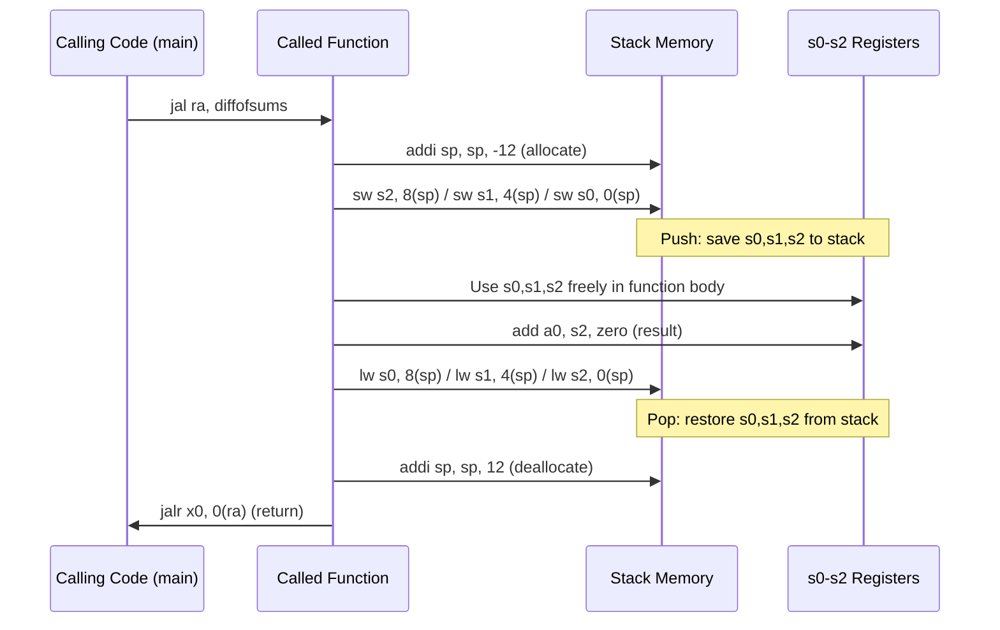
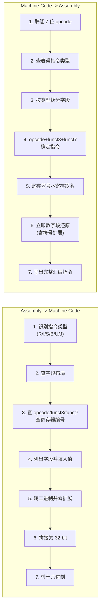

# 05 体系结构 Architecture

> 对应 Ch 5 Architecture (Prof. Chris Bleakley)
> 涵盖: Programming Languages, Processor Organisation, Assembly Language, Machine Language

---

## 目录

1. [设计层级与 Architecture 定义](#1-设计层级与-architecture-定义)
2. [编程语言与执行模型](#2-编程语言与执行模型)
3. [CPU 组织与 Fetch-Decode-Execute 循环](#3-cpu-组织与-fetch-decode-execute-循环)
4. [RISC-V 汇编: 算术、寄存器与逻辑指令](#4-risc-v-汇编-算术寄存器与逻辑指令)
5. [内存访问: 按字与按字节](#5-内存访问-按字与按字节)
6. [首个完整程序与汇编指示](#6-首个完整程序与汇编指示)
7. [指令与伪指令](#7-指令与伪指令)
8. [分支、循环与函数调用](#8-分支循环与函数调用)
9. [机器码编码与反汇编](#9-机器码编码与反汇编)
10. [完整指令参考表](#10-完整指令参考表)
11. [RISC-V 寄存器文件表](#11-risc-v-寄存器文件表)
12. [指令格式位域布局图](#12-指令格式位域布局图)
13. [详细编码/解码示例](#13-详细编码解码示例)
14. [易混淆概念](#14-易混淆概念)
15. [做题建议](#15-做题建议)

---

## 1. 设计层级与 Architecture 定义

### 1.1 设计层级 (Design Hierarchy)

从高到低:

| 层级 | 内容 |
|------|------|
| Application Software | 程序 |
| Operating Systems | 库、设备驱动等 |
| **Architecture** | **指令集、寄存器、格式** |
| Microarchitecture | 数据路径、控制器等 |
| Logic | 构建块、加法器、存储器等 |
| Digital Circuits | AND gates, NOT gates 等 |
| Analog Circuits | 放大器、滤波器等 |
| Devices | 晶体管等 |
| Physics | 电子 |

### 1.2 Architecture 定义

**Computer Architecture** 是程序员视角下的硬件-软件接口。它由以下内容定义:

- **指令集 (Instruction Set)**: 处理器可执行的机器级指令的完整集合
- **数据格式 (Data Formats)**
- **内存组织 (Memory Organisation)**
- **输入/输出机制 (I/O Mechanisms)**

最常见的三种架构:
- **x86 / x86-64** (Intel, AMD) -- CISC
- **ARM** (Apple, Qualcomm) -- RISC
- **RISC-V** (开源) -- RISC

由于指令集不同，为一种架构编译的软件不能不经修改或仿真在另一种架构上运行。

> **关键区分**: Architecture 定义的是"程序员看到的接口"，而 Microarchitecture 是具体的硬件实现方式。同一 Architecture (如 RISC-V) 可以有不同的 Microarchitecture 实现。

---

## 2. 编程语言与执行模型

### 2.1 低级语言 (Low-Level Languages)

| 术语 | 定义 |
|------|------|
| **Machine Instructions** (机器指令) | 处理器可直接执行的二进制编码指令 |
| **Assembly Instructions** (汇编指令) | 机器指令的人类可读助记符 (mnemonics) |
| **Assembler** (汇编器) | 将 `.asm` 汇编源文件翻译为 `.obj` 目标文件的软件工具 |
| **Linker** (链接器) | 将一个或多个 `.obj` 文件和库文件合并为单个可执行文件的软件工具 |

**工具链流程:**

```
.asm 文件 --> [Assembler] --> .obj 文件 (含机器指令及对外部引用的参考)
                                    |
                               (多个 .obj + 库文件)
                                    |
                                    v
                              [Linker] --> .exe 可执行文件
```

有时汇编器和链接器集成在一起，汇编和链接步骤作为单一过程自动完成。

### 2.2 高级语言 (High-Level Languages)

高级语言 (HLLs) 允许人类使用更具可读性和可理解性的指令进行编程。例如: Python, Java, C++, C, Rust。

#### 编译型语言 (Compiled Languages)

源码在执行前被翻译成机器码 (C++, C, Rust 等)。

```
HLL 源文件 --> [Compiler] --> .asm 文件 --> [Assembler] --> .obj 文件 --> [Linker] --> .exe 文件
```

**编译型语言优势**: 运行速度快 -- 处理器直接执行二进制机器码。
**编译型语言劣势**: 只能在其编译目标架构和操作系统上运行。

#### 解释型语言 (Interpreted Languages)

**Interpreter** (解释器): 不转换为机器码即可执行高级程序。解释器首先将程序编译为字节码 (bytecode)，然后在虚拟机 (Virtual Machine) 上运行字节码。

```
HLL 源文件 --> [Compiler] --> bytecode 文件 --> [Virtual Machine] 执行
```

- **Bytecode** (字节码): 一组中间级指令，可由虚拟机执行
- **Virtual Machine** (VM): 基于软件的计算机仿真，为执行程序提供如同运行在物理硬件上的环境

**解释型语言优势**: 可移植性 -- 字节码可在任何有兼容解释器的系统上运行。
**解释型语言劣势**: 通常运行速度比编译型程序慢。

### 2.3 RISC vs CISC

| | CISC (Complex Instruction Set Computer) | RISC (Reduced Instruction Set Computer) |
|--|------------------------------------------|------------------------------------------|
| 特征 | 大型、复杂、不规则的指令集 | 小型、基本、规则的指令集 |
| 例子 | x86, x86-64 | RISC-V, ARM, MIPS |
| 性能 | 同代同尺寸 RISC 通常更快更低功耗 | 同代同尺寸 CISC 通常更慢更高功耗 |

**关键事实**: 现代 CISC 处理器为保持软件兼容性支持 CISC 指令集，但内部会将复杂指令转换为 RISC-like 指令来执行。

**本模块聚焦**: RISC-V 架构的汇编语言与机器语言编程 (低级编程 + RISC 思维)。

---

## 3. CPU 组织与 Fetch-Decode-Execute 循环

### 3.1 CPU 组织结构

**Processor Organisation** 指处理器内部硬件功能单元的安排。

```
+-------------------------------------------------------+
|                    Main Memory                         |
|  (存储 32-bit 指令 word 和 32-bit 数据 word)            |
+-----^----------^------------^------------^-------------+
      | instruction|            |            |
      |   address  |  instruction address    |  data
      |            |            |            |
+-------------------------------------------------------+
|  CPU              |            |            |          |
|   +----------+    |   +-----------------+  |          |
|   |    PC    |----+   |  Register File  |  |          |
|   +----------+        |  (32个 32-bit    |  |          |
|       |                |   寄存器)        |  |          |
|       v                |  operands ----> |  |          |
|  +------------+        |          result |<-+          |
|  |  Control   |--------|                |             |
|  |   Unit     |  control signals    +-------+         |
|  +------------+                     |  ALU  |         |
|                                     +-------+         |
+-------------------------------------------------------+
```

### 3.2 各部件功能

| 部件 | 功能 |
|------|------|
| **PC (Program Counter)** | 保存当前正在执行的指令的地址 (32-bit)，指向指令最低字节地址 |
| **Control Unit** (控制器) | 译码机器指令，生成控制信号驱动其他功能单元 |
| **Register File** (寄存器文件) | 存储 CPU 当前正在操作的数据 (32 个 32-bit 寄存器) |
| **ALU** (算术逻辑单元) | 对寄存器文件中的数据进行算术与逻辑操作 |
| **Main Memory** (主存储器) | 存储指令和数据；按 32-bit word 组织，可按字节或按字访问 |

### 3.3 Fetch-Decode-Execute 循环

CPU 反复执行以下步骤:



**详细步骤**:
1. **Fetch (取指)**: PC 中保存地址，主内存查找该地址并输出对应的 32-bit 机器指令
2. **Decode (译码)**: Control Unit 解析指令并发送对应的控制信号到各功能单元
3. **Execute (执行)**: 功能单元执行指令 (寄存器读取操作数 --> ALU 计算 --> 结果写回寄存器或内存)
4. **PC 更新**: 顺序执行时 PC 自动递增到下一指令地址；分支或跳转时改写 PC

**关键约定**:
- 每个程序 (数据和指令) 被加载到主内存
- 数据按 32-bit word 存储
- 每条机器指令被汇编为 32-bit 数字
- 32-bit 机器指令 word 同样存储在主内存中
- PC 保存当前指令最低字节地址

### 3.4 CPU 数据流 Mermaid Diagram



---

## 4. RISC-V 汇编: 算术、寄存器与逻辑指令

### 4.1 语法核心

```
operation  destination,  source1,   source2
  操作     目标寄存器    源寄存器1   源寄存器2
```

汇编语法**非常刚性**: 必须恰好一个操作和三个操作数，没有灵活性。

**示例**: `a = b + c` 翻译为 `add s0, s1, s2`
- 变量 `a` 映射到寄存器 `s0`
- 变量 `b` 映射到寄存器 `s1`
- 变量 `c` 映射到寄存器 `s2`

### 4.2 处理器内部数据流示例 (add s0, s1, s2)

1. Register File 输出 `s1` 和 `s2` 中的数据 word
2. ALU 执行加法
3. Register File 将结果存入寄存器 `s0`

### 4.3 算术指令

| 指令 | 示例 | 操作 | Native |
|------|------|------|--------|
| Add | `add rd, rs1, rs2` | `rd = rs1 + rs2` | Y |
| Add Immediate | `addi rd, rs1, imm` | `rd = rs1 + SignExt[imm]` | Y |
| Subtract | `sub rd, rs1, rs2` | `rd = rs1 - rs2` | Y |
| Multiply (高32位) | `mulh rd1, rs1, rs2` | `(rd1,rd2) = rs1 * rs2` | Y |
| Multiply (低32位) | `mul rd2, rs1, rs2` | `(rd1,rd2) = rs1 * rs2` | Y |
| Load Upper Immediate | `lui rd, umm` | `rd = (upimm, 0x000)` | Y |

**注意事项**:
- `addi` 的立即数最大 12-bit，符号扩展
- `lui` 加载高 20-bit 并将低 12-bit 置零；`addi` 补低 12-bit
- 若 `addi` 立即数 MSB 为 1 (负数)，需将 `lui` 立即数减 1 进行偏移校正
- `mulh` 和 `mul` 配合获取 32x32 的 64-bit 完整结果

**复杂表达式分解**: `a = b + c - d` 需拆分为:
```asm
add t0, s1, s2    # t0 = b + c (s1=b, s2=c)
sub s0, t0, s3    # a  = t0 - d (s3=d, s0=a)
```

### 4.4 立即数操作

```asm
a = a + 4        -->   addi s0, s0, 4
b = a - 12       -->   addi s1, s0, -12
```

**初始化常量** (利用 `zero` 寄存器):
```asm
i = 4            -->   addi s4, zero, 4
x = 3032         -->   addi s5, zero, 3032
y = -78          -->   addi s6, zero, -78
```

支持多种进制格式:
```asm
x = 0b1101101    -->   addi s5, zero, 0b1101101    # 二进制
x = 0x6D         -->   addi s5, zero, 0x6D         # 十六进制
x = 109          -->   addi s5, zero, 109          # 十进制
# 这三条等价!
```

**32 位常量加载** (`lui` + `addi`):
```asm
# a = 0xABCDE123
lui s2, 0xABCDE       # s2 = 0xABCDE000 (高20位 + 低12位全0)
addi s2, s2, 0x123    # s2 = 0xABCDE123 (补低12位)
```

### 4.5 逻辑与移位指令

#### 逻辑运算 (Bitwise)

```asm
s1 = 0100 0110 1010 0001 1111 0001 1011 0111
s2 = 1111 1111 1111 1111 0000 0000 0000 0000

and s3, s1, s2   # s3 = 0100 0110 1010 0001 0000 0000 0000 0000
or  s4, s1, s2   # s4 = 1111 1111 1111 1111 1111 0001 1011 0111
xor s5, s1, s2   # s5 = 1011 1001 0101 1110 1111 0001 1011 0111
```

| 指令 | 示例 | 操作 | Native |
|------|------|------|--------|
| And | `and rd, rs1, rs2` | `rd = rs1 & rs2` | Y |
| Or | `or rd, rs1, rs2` | `rd = rs1 \| rs2` | Y |
| Xor | `xor rd, rs1, rs2` | `rd = rs1 ^ rs2` | Y |
| And Imm. | `andi rd, rs1, imm` | `rd = rs1 & imm` | Y |
| Or Imm. | `ori rd, rs1, imm` | `rd = rs1 \| imm` | Y |
| Xor Imm. | `xori rd, rs1, imm` | `rd = rs1 ^ imm` | Y |

#### 移位运算

| 指令 | 示例 | 操作 | Native |
|------|------|------|--------|
| Shift Left Logical | `sll rd, rs1, rs2` | `rd = rs1 << rs2` | Y |
| SLL Immediate | `slli rd, rs1, uimm` | `rd = rs1 << uimm` | Y |
| Shift Right Logical | `srl rd, rs1, rs2` | `rd = rs1 >> rs2` | Y |
| SRL Immediate | `srli rd, rs1, uimm` | `rd = rs1 >> uimm` | Y |
| Shift Right Arithmetic | `sra rd, rs1, rs2` | `rd = rs1 >>> rs2` (MSB 扩展) | Y |
| SRA Immediate | `srai rd, rs1, uimm` | `rd = rs1 >>> uimm` (MSB 扩展) | Y |

**关键点**:
- `slli`/`srli`/`srai` 的移位量在 `uimm` (unsigned immediate) 中
- 左移 1 位 = 乘以 2: `110(2) << 1 = 1100(2)` 即 6 -> 12
- 算术右移 2 位 = 除以 4: `1100(2) >>> 2 = 11(2)` 即 12 -> 3
- `srl` 是逻辑右移 (填 0)；`sra` 是算术右移 (保留符号位)
- 超出字边界的位会丢失

---

## 5. 内存访问: 按字与按字节

### 5.1 内存结构

主内存包含 32-bit (4-byte) words，可按字节或按字访问。

```
Byte Address            Memory
   3   2   1   0
  +----+----+----+----+
  | CD | 19 | A6 | 5B |    word at address 0
  +----+----+----+----+
  | 40 | F3 | 07 | 88 |    word at address 4
  +----+----+----+----+
  | 01 | EE | 28 | 42 |    word at address 8
  +----+----+----+----+
  | F2 | F1 | AC | 07 |    word at address 12
  +----+----+----+----+
  | AB | CD | EF | 78 |    word at address 16
  +----+----+----+----+
   MSB                LSB
         <-- 8-bit -->
  <-------- 32-bit -------->
```

### 5.2 Load Word (按字读取)

```asm
lw rd, imm(rs1)          # rd = Mem[rs1 + imm]
```

`lw s7, 4(zero)` 从地址 4+0=4 读取 32-bit word -> `s7 = 0x40F30788`

核心公式: **有效地址 = base register + offset**

### 5.3 Store Word (按字存储)

```asm
sw rs2, imm(rs1)         # Mem[rs1 + imm] = rs2
```

示例:
```asm
addi t3, zero, 0x2A      # t3 = 0x2A
sw   t3, 8(zero)         # 将 0x2A 写入地址 8
```

### 5.4 Load Byte / Load Byte Unsigned

```asm
lb  rd, imm(rs1)         # rd = SignExt(Mem[rs1 + imm][0:7])
lbu rd, imm(rs1)         # rd = ZeroExt(Mem[rs1 + imm][0:7])
```

**关键区别**:
- `lb` (Load Byte): 将读取的 8-bit 字节**符号扩展**到 32-bit
- `lbu` (Load Byte Unsigned): 将读取的 8-bit 字节**零扩展**到 32-bit

示例: `lbu s0, 5(zero)` 从地址 5 读取 `0x21` -> `s0 = 0x00000021`

### 5.5 Store Byte

```asm
sb rs2, imm(rs1)         # Mem[rs1 + imm][0:7] = rs2[0:7]
```

示例: `sb s0, 3(zero)` 将 `s0` 最低 8-bit `0x4C` 写入地址 3

### 5.6 内存访问指令汇总

| 指令 | 示例 | 操作 | Native |
|------|------|------|--------|
| Load Word | `lw rd, imm(rs1)` | `rd = Word[rs1 + imm]` | Y |
| Store Word | `sw rs2, imm(rs1)` | `Word[rs1 + imm] = rs2` | Y |
| Load Byte | `lb rd, imm(rs1)` | `rd = SignExt(Byte[rs1 + imm])` | Y |
| Load Byte Unsigned | `lbu rd, imm(rs1)` | `rd = ZeroExt(Byte[rs1 + imm])` | Y |
| Store Byte | `sb rs2, imm(rs1)` | `Byte[rs1 + imm] = rs2` | Y |

---

## 6. 首个完整程序与汇编指示

### 6.1 完整程序示例: 两数求和

```asm
# add.asm
# Loads two words from memory, add the numbers and store the result

            .data                      # start of data section
DataIn:     .word    1,2               # reserve two words with values 1 and 2
DataOut:    .word    0                 # reserve word with value 0

            .text                      # start of code section
            .globl   main              # make main label globally available

main:       la t0, DataIn              # t0 = address of DataIn
            lw t1, 0(t0)               # t1 = DataIn[0]
            lw t2, 4(t0)               # t2 = DataIn[1]
            add t3, t1, t2             # t3 = t1 + t2
            la t0, DataOut             # t0 = address of DataOut
            sw t3, 0(t0)               # store t3 at DataOut

            li a7, 10                  # ecall number for exit
            ecall                      # make the system call
```

### 6.2 逐行解释

**数据段 (Data Segment):**
- `.data` 告诉汇编器将后续内容放入数据段 (起始地址 `0x10010000`)
- `DataIn:` 标签代表 `0x10010000` 地址
- `.word 1,2` 存储两个连续的 32-bit 数值 1 和 2
- `DataOut: .word 0` 存储一个 32-bit 数值 0

数据段布局:
```
Label       Address        Data
DataIn      0x10010000     1
            0x10010004     2
DataOut     0x10010008     0
```

**代码段 (Text Segment):**
- `.text` 告诉汇编器将后续内容放入代码段 (起始地址 `0x00400000`)
- `.globl main` 使 `main` 标签对链接器全局可见
- `la t0, DataIn` (load address 伪指令): 将 DataIn 的地址存入 t0 -> `t0 = 0x10010000`
- `lw t1, 0(t0)`: 从 `t0 + 0` 地址读 word -> `t1 = 1`
- `lw t2, 4(t0)`: 从 `t0 + 4` 地址读 word -> `t2 = 2`
- `add t3, t1, t2`: `t3 = t1 + t2 = 3`
- `la t0, DataOut`: 将 DataOut 的地址存入 t0 -> `t0 = 0x10010008`
- `sw t3, 0(t0)`: 将 t3 存入 `t0 + 0` 地址 -> DataOut 位置变为 3
- `li a7, 10` (load immediate 伪指令): `a7 = 10`
- `ecall` (environment call): 调用系统子例程，由 `a7` 的值决定 (10 = 退出程序，返回码 0 表示成功)

### 6.3 汇编指示 (Assembler Directives)

**"An assembly directive is a command given to the assembler."**

| 指示 | 描述 |
|------|------|
| `.data` | 全局数据段开始 |
| `.word w1,w2,...,wN` | 存储 N 个 32-bit 数字 |
| `.ascii "str"` | 存储字符串 str |
| `.asciz "str"` | 存储字符串 str 后跟 null 终止符 `\0` |
| `.byte b1,b2,...,bN` | 存储 N 个 8-bit 数字 |
| `.space N` | 预留 N 字节 |
| `.align N` | 将下一条数据/指令对齐到 2^N 字节边界 |
| `.text` | 文本 (代码) 段开始 |
| `.globl sym` | 使标签 sym 对链接器全局可见 |

---

## 7. 指令与伪指令

### 7.1 定义

**Pseudo instructions** (伪指令) 是汇编语言命令，不由处理器硬件直接支持，而是由汇编器**翻译成一条或多条实际硬件指令的序列**。

这是 Native instructions (原生指令，硬件直接支持) 的反面。

### 7.2 `li` (Load Immediate) 展开

```asm
li a7, 10
```
展开为:
```asm
addi x17, x0, 10      # x17 = a7, x0 = zero
```
`addi` 将固定的零值寄存器 `x0` 与值 10 相加，结果存入 `x17` (aka `a7`)。

### 7.3 `la` (Load Address) 展开

```asm
la t0, DataIn
```
展开为:
```asm
auipc x5, 0x0000fc10    # x5 = PC + (0x0000fc10 << 12) = 0x00400000 + 0x0fc10000 = 0x10010000
addi  x5, x5, 0         # x5 = 0x10010000 + 0 = 0x10010000
```

`auipc` (Add Upper Immediate to PC): 将立即数左移 12 位，加上当前指令地址，结果存入寄存器。这里偏移为 0，`addi` 无操作。结果是 `t0` (x5) 包含 DataIn 的地址 `0x10010000`。

### 7.4 伪指令汇总

| 指令 | 示例 | 操作 | Native |
|------|------|------|--------|
| Load Immediate | `li rd, imm` | `rd = imm` | N |
| Load Address | `la rd, label` | `rd = Addr[label]` | N |
| Jump | `j label` | `goto label` | N (展开为 `jal x0, label`) |
| Branch if > | `bgt rs1, rs2, label` | `goto label if rs1 > rs2` | N (展开为 `blt rs2, rs1, label`) |
| Branch if <= | `ble rs1, rs2, label` | `goto label if rs1 <= rs2` | N (展开为 `bge rs2, rs1, label`) |

---

## 8. 分支、循环与函数调用

### 8.1 程序计数器 (PC)

- PC 保存当前正在执行的指令的地址
- PC 在当前指令完成时自动递增
- 可通过分支/跳转指令修改 PC 来改变程序流

```
PC        Memory       Assembly Instruction         Machine Instruction
          Address
0x53C     0x538        addi s1, s2, 10              0x00a90493
          0x53C        lw   t2, 8(s1)               0x0084a383
          0x540        sw   s2, 4(t6)               0x012fa223
```

### 8.2 条件分支

#### If 语句 Case 1: `a == b`

```asm
# if (a == b) c = c + 1;

bne s0, s1, skip:     # 如果 s0 != s1 (a != b)，跳到 skip
    addi s2, s2, 1    # c = c + 1
skip:
...
```

逆向逻辑: 用 `bne` (不等于时跳过) 实现 "等于时执行"。

#### If 语句 Case 2: `d != e`

```asm
# if (d != e) f = f - 11;

beq s0, s1, skip:     # 如果 s0 == s1 (d == e)，跳到 skip
    addi s2, s2, -11  # f = f - 11
skip:
...
```

#### If-Else 语句

```asm
# if (a == b) c = c + 1; else c = c - 1;

bne s0, s1, decrement  # a != b -> 跳到 decrement
    addi s2, s2, +1    # c = c + 1 (真分支)
    j    next_code      # 跳过后面的 else
decrement:
    addi s2, s2, -1    # c = c - 1 (假分支)
next_code:
...
```

#### AND 条件

```asm
# if (a == 0 && b == 0) c = c + 1;

bne s0, zero, skip:    # a != 0 -> skip
bne s1, zero, skip:    # b != 0 -> skip (短路求值)
    addi s2, s2, 1     # c = c + 1
skip:
...
```

#### OR 条件

```asm
# if (a == 0 || b == 0) c = c + 1;

beq s0, zero, do_add:  # a == 0 -> do_add
beq s1, zero, do_add:  # b == 0 -> do_add
j    skip:             # 都 != 0 -> skip
do_add:
    addi s2, s2, 1     # c = c + 1
skip:
...
```

### 8.3 分支指令汇总

| 指令 | 示例 | 操作 | Native |
|------|------|------|--------|
| Branch if = | `beq rs1, rs2, label` | `goto label if rs1 == rs2` | Y |
| Branch if != | `bne rs1, rs2, label` | `goto label if rs1 != rs2` | Y |
| Branch if > | `bgt rs1, rs2, label` | `goto label if rs1 > rs2` | N (-> blt rs2, rs1, label) |
| Branch if >= | `bge rs1, rs2, label` | `goto label if rs1 >= rs2` | Y |
| Branch if < | `blt rs1, rs2, label` | `goto label if rs1 < rs2` | Y |
| Branch if <= | `ble rs1, rs2, label` | `goto label if rs1 <= rs2` | N (-> bge rs2, rs1, label) |
| Jump | `j label` | `goto label` | N (-> jal x0, label) |

### 8.4 循环模板

#### While 循环

```asm
# x = 0;
# while (x != 3) {
#     x = x + 1;
# }

    addi s0, zero, 0       # 初始化: x = 0
    addi t0, zero, 3       # 退出条件: t0 = 3
while:
    beq s0, t0, done       # 等于时退出
    addi s0, s0, 1         # 循环体: x = x + 1
    j    while             # 返回循环头
done:
    ...
```

**执行轨迹**: 0!=3 (执行) -> 1!=3 (执行) -> 2!=3 (执行) -> 3==3 (退出)

#### For 循环

```asm
# sum = 0;
# for (i = 0; i < 2; i++) {
#     sum = sum + i;
# }

    addi s1, zero, 0       # sum = 0 (初始化)
    addi s0, zero, 0       # i = 0   (初始化)
    addi t0, zero, 2       # 上限 = 2
for:
    bge s0, t0, done       # i >= 2 时退出
    add s1, s1, s0         # sum = sum + i (循环体)
    addi s0, s0, 1         # i++ (迭代)
    j    for               # 返回循环头
done:
    ...
```

### 8.5 函数调用

#### 基础调用/返回

```asm
# Calling code (main):
    jal ra, simple         # 跳转到 simple，返回地址存入 ra
    ...

# Called function (simple):
simple:
    ...
    jalr x0, 0(ra)         # 返回 (return)
```

**关键理解**:
- `jal ra, simple`: **Jump and Link** -- 程序流跟随跳转目标 (simple 标签后的第一条指令地址)，**返回地址** (jal 指令后一条指令的地址) 存入寄存器 `ra`
- `jalr x0, 0(ra)`: **Jump and Link Register** -- 程序流跟随跳转目标 `0 + ra` (即返回地址)，返回地址"存入" `x0` (永不更新，等价于丢弃)

#### 参数传递与返回值

```asm
# y = sum(2, 3);

# Calling code:
    addi a0, zero, 2       # arg0 = 2
    addi a1, zero, 3       # arg1 = 3
    jal ra, sum            # 调用 sum
    add s7, a0, zero       # y = 返回值

# Called function:
sum:
    add a0, a0, a1         # a0 = a0 + a1 (结果)
    jalr x0, 0(ra)         # 返回
```

**参数/返回值约定**:
- `a0` - `a7` 用于向函数传递参数
- `a0` 也用于从被调函数向调函数传递返回值
- `a0` - `a1` 同时可作为返回值寄存器

### 8.6 保存寄存器与栈帧

**寄存器保存约定**:

| Preserved (需恢复) | Non-preserved (可破坏) |
|---------------------|------------------------|
| Saved registers: s0-s11 | Temporary registers: t0-t6 |
| Stack pointer: sp | Argument registers: a0-a7 |
| | Return address: ra |

**约定**: 子程序在返回前必须将所有 preserved registers 恢复为原值。Non-preserved registers 不需要恢复。

#### 栈帧 (Stack Frame)

**Stack** (栈) 是按 LIFO (Last-In, First-Out) 组织的特殊内存区域。



**完整栈帧操作示例**:

```asm
# def diff_of_sums(f, g, h, i):
#     result = (f+g) - (h+i)
#     return result

diffofsums:
    # --- 建立栈帧 Stack Frame Setup ---
    addi sp, sp, -12       # 分配 3 words (12 bytes) 栈空间 [栈向下增长]
    sw   s2, 8(sp)         # 保存 s2 -> sp+8
    sw   s1, 4(sp)         # 保存 s1 -> sp+4
    sw   s0, 0(sp)         # 保存 s0 -> sp+0

    # --- 函数体 (使用 saved registers) ---
    add s0, a0, a1         # s0 = f + g
    add s1, a2, a3         # s1 = h + i
    sub s2, s0, s1         # s2 = (f+g) - (h+i)
    add a0, s2, zero       # 返回值 -> a0

    # --- 栈帧拆除 Stack Frame Teardown ---
    lw   s0, 8(sp)         # 恢复 s0 (注意 LIFO: 入栈 s2,s1,s0 -> 出栈 s0,s1,s2)
    lw   s1, 4(sp)         # 恢复 s1
    lw   s2, 0(sp)         # 恢复 s2
    addi sp, sp, 12        # 回收 12 bytes 栈空间 [栈向上收缩]
    jalr x0, 0(ra)         # 返回
```



**入栈顺序**: s2 -> s1 -> s0
**出栈顺序**: s0 -> s1 -> s2 (LIFO: Last-In First-Out)

---

## 9. 机器码编码与反汇编

### 9.1 编码流程 (Assembly -> Machine Code)

```
Assembly Instruction -> Machine Instruction (32-bit)
```

**8 步通用方法**:

1. Look up the type for the instruction (查指令类型: R/I/S/B/U/J)
2. Look up the fields for the type (查该类型的字段布局)
3. Look up the encoding for the instructions and the registers (查指令编码和寄存器号)
4. List the fields for the instruction (列出该指令的字段)
5. Fill in the codes (填入编码值)
6. Convert the fields to binary and zero extend to fill the fields (转换为二进制，零扩展填满字段宽度)
7. Concatenate the codes (拼接所有位)
8. Convert the word to hexadecimal (转十六进制)

### 9.2 反汇编流程 (Machine Code -> Assembly)

**6 步通用方法**:

1. Extract the 7 least significant bits to obtain the opcode (取最低 7 位得到 opcode)
2. Look up the opcode in the reference tables to obtain the instruction type (查表获得指令类型)
3. Split the instruction into fields based on the instruction type (根据类型拆分字段)
4. Based on opcode + funct7 + funct3, identify the instruction (根据 opcode/funct7/funct3 确定指令)
5. Convert register numbers to register names (寄存器号 -> 寄存器名)
6. Convert immediate numbers to decimal (转换立即数为十进制)
7. State the complete instruction (写出完整指令)

### 9.3 汇编-机器码双向转换 Mermaid



---

## 10. 完整指令参考表

> 来源: RISC-V Reference Card (Simon Fraser University) + 课件

| Inst | Name | FMT | Opcode | funct3 | funct7 | Description (C) | Note |
|------|------|-----|--------|--------|--------|------------------|------|
| add | ADD | R | 0110011 | 0x0 | 0x00 | `rd = rs1 + rs2` | |
| sub | SUB | R | 0110011 | 0x0 | 0x20 | `rd = rs1 - rs2` | |
| xor | XOR | R | 0110011 | 0x4 | 0x00 | `rd = rs1 ^ rs2` | |
| or | OR | R | 0110011 | 0x6 | 0x00 | `rd = rs1 \| rs2` | |
| and | AND | R | 0110011 | 0x7 | 0x00 | `rd = rs1 & rs2` | |
| sll | Shift Left Logical | R | 0110011 | 0x1 | 0x00 | `rd = rs1 << rs2` | |
| srl | Shift Right Logical | R | 0110011 | 0x5 | 0x00 | `rd = rs1 >> rs2` | 填 0 |
| sra | Shift Right Arith* | R | 0110011 | 0x5 | 0x20 | `rd = rs1 >>> rs2` | MSB 扩展 |
| slt | Set Less Than | R | 0110011 | 0x2 | 0x00 | `rd = (rs1 < rs2) ? 1 : 0` | 有符号 |
| sltu | Set Less Than (U) | R | 0110011 | 0x3 | 0x00 | `rd = (rs1 < rs2) ? 1 : 0` | 无符号比较 |
| addi | ADD Immediate | I | 0010011 | 0x0 | - | `rd = rs1 + imm` | imm 符号扩展 |
| xori | XOR Immediate | I | 0010011 | 0x4 | - | `rd = rs1 ^ imm` | |
| ori | OR Immediate | I | 0010011 | 0x6 | - | `rd = rs1 \| imm` | |
| andi | AND Immediate | I | 0010011 | 0x7 | - | `rd = rs1 & imm` | |
| slli | Shift Left Logical Imm | I | 0010011 | 0x1 | imm[5:11]=0x00 | `rd = rs1 << imm[0:4]` | 高 7 位 imm 为 0x00 |
| srli | Shift Right Logical Imm | I | 0010011 | 0x5 | imm[5:11]=0x00 | `rd = rs1 >> imm[0:4]` | 高 7 位 imm 为 0x00 |
| srai | Shift Right Arith Imm | I | 0010011 | 0x5 | imm[5:11]=0x20 | `rd = rs1 >>> imm[0:4]` | MSB 扩展; 高 7 位为 0x20 |
| slti | Set Less Than Imm | I | 0010011 | 0x2 | - | `rd = (rs1 < imm) ? 1 : 0` | 有符号 |
| sltiu | Set Less Than Imm (U) | I | 0010011 | 0x3 | - | `rd = (rs1 < imm) ? 1 : 0` | 无符号比较 |
| lb | Load Byte | I | 0000011 | 0x0 | - | `rd = SignExt(M[rs1+imm][0:7])` | 符号扩展 |
| lh | Load Half | I | 0000011 | 0x1 | - | `rd = SignExt(M[rs1+imm][0:15])` | 符号扩展 |
| lw | Load Word | I | 0000011 | 0x2 | - | `rd = M[rs1+imm][0:31]` | |
| lbu | Load Byte (U) | I | 0000011 | 0x4 | - | `rd = ZeroExt(M[rs1+imm][0:7])` | 零扩展 |
| lhu | Load Half (U) | I | 0000011 | 0x5 | - | `rd = ZeroExt(M[rs1+imm][0:15])` | 零扩展 |
| sb | Store Byte | S | 0100011 | 0x0 | - | `M[rs1+imm][0:7] = rs2[0:7]` | |
| sh | Store Half | S | 0100011 | 0x1 | - | `M[rs1+imm][0:15] = rs2[0:15]` | |
| sw | Store Word | S | 0100011 | 0x2 | - | `M[rs1+imm][0:31] = rs2[0:31]` | |
| beq | Branch == | B | 1100011 | 0x0 | - | `if(rs1 == rs2) PC += imm` | |
| bne | Branch != | B | 1100011 | 0x1 | - | `if(rs1 != rs2) PC += imm` | |
| blt | Branch < | B | 1100011 | 0x4 | - | `if(rs1 < rs2) PC += imm` | 有符号 |
| bge | Branch >= | B | 1100011 | 0x5 | - | `if(rs1 >= rs2) PC += imm` | 有符号 |
| bltu | Branch < (U) | B | 1100011 | 0x6 | - | `if(rs1 < rs2) PC += imm` | 无符号比较 |
| bgeu | Branch >= (U) | B | 1100011 | 0x7 | - | `if(rs1 >= rs2) PC += imm` | 无符号比较 |
| jal | Jump And Link | J | 1101111 | - | - | `rd = PC+4; PC += imm` | |
| jalr | Jump And Link Reg | I | 1100111 | 0x0 | - | `rd = PC+4; PC = rs1 + imm` | |
| lui | Load Upper Imm | U | 0110111 | - | - | `rd = imm << 12` | 低 12-bit 为 0 |
| auipc | Add Upper Imm to PC | U | 0010111 | - | - | `rd = PC + (imm << 12)` | |
| ecall | Environment Call | I | 1110011 | 0x0 | imm=0x0 | 将控制权转交给 OS | 系统调用 |
| ebreak | Environment Break | I | 1110011 | 0x0 | imm=0x1 | 将控制权转交给调试器 | 断点 |

---

## 11. RISC-V 寄存器文件表

每个寄存器保存一个 32-bit word。共 32 个寄存器 (x0-x31)。

| ABI 名 | 编号 | 用途 | Preserved? |
|--------|------|------|------------|
| zero | x0 | 常数 0 (硬连线，写无效) | - |
| ra | x1 | Return Address (返回地址) | No |
| sp | x2 | Stack Pointer (栈指针) | Yes |
| gp | x3 | Global Pointer (全局指针) | - |
| tp | x4 | Thread Pointer (线程指针) | - |
| t0 | x5 | Temporary 0 (临时寄存器) | No |
| t1 | x6 | Temporary 1 | No |
| t2 | x7 | Temporary 2 | No |
| s0 / fp | x8 | Saved 0 / Frame Pointer (帧指针) | Yes |
| s1 | x9 | Saved 1 | Yes |
| a0 | x10 | Function Argument 0 / Return Value | No |
| a1 | x11 | Function Argument 1 / Return Value | No |
| a2 | x12 | Function Argument 2 | No |
| a3 | x13 | Function Argument 3 | No |
| a4 | x14 | Function Argument 4 | No |
| a5 | x15 | Function Argument 5 | No |
| a6 | x16 | Function Argument 6 | No |
| a7 | x17 | Function Argument 7 | No |
| s2 | x18 | Saved 2 | Yes |
| s3 | x19 | Saved 3 | Yes |
| s4 | x20 | Saved 4 | Yes |
| s5 | x21 | Saved 5 | Yes |
| s6 | x22 | Saved 6 | Yes |
| s7 | x23 | Saved 7 | Yes |
| s8 | x24 | Saved 8 | Yes |
| s9 | x25 | Saved 9 | Yes |
| s10 | x26 | Saved 10 | Yes |
| s11 | x27 | Saved 11 | Yes |
| t3 | x28 | Temporary 3 | No |
| t4 | x29 | Temporary 4 | No |
| t5 | x30 | Temporary 5 | No |
| t6 | x31 | Temporary 6 | No |

**寄存器分组记忆法**:

| 分组 | 编号范围 | ABI 前缀 | 用途 | 需保存? |
|------|----------|----------|------|---------|
| 零寄存器 | x0 | zero | 常数 0 | - |
| 返回地址 | x1 | ra | 函数返回地址 | No |
| 栈/全局/线程指针 | x2-x4 | sp, gp, tp | 特殊用途 | sp: Yes |
| 临时寄存器 (前) | x5-x7 | t0-t2 | 临时变量，调用后可破坏 | No |
| 保存寄存器 (前) | x8-x9 | s0/fp, s1 | 调用前后需一致 | Yes |
| 参数寄存器 | x10-x17 | a0-a7 | 函数参数 + a0/a1 返回值 | No |
| 保存寄存器 (后) | x18-x27 | s2-s11 | 调用前后需一致 | Yes |
| 临时寄存器 (后) | x28-x31 | t3-t6 | 临时变量，调用后可破坏 | No |

**记忆口诀**:
- **s*** (saved): 受保护，子程序结束前必须恢复原值
- **t*** (temporary): 临时的，子程序可以随意覆盖
- **a*** (argument): 传参用，返回值也用 a0/a1
- **ra**: Return Address，`jal` 自动写入

---

## 12. 指令格式位域布局图

### 12.1 R-Type (Register Type)

用于: `add, sub, xor, or, and, sll, srl, sra, slt, sltu`, `mul, mulh`

```
 31        25 24      20 19      15 14    12 11       7 6         0
+------------+----------+----------+--------+----------+-----------+
|   funct7   |    rs2   |    rs1   | funct3 |    rd    |   opcode  |
|   7 bits   |  5 bits  |  5 bits  | 3 bits |  5 bits  |  7 bits   |
+------------+----------+----------+--------+----------+-----------+
```

- `opcode`: 操作码大类 (如 `0110011` 表示 R-type 运算)
- `funct3` + `funct7`: 细分指令 (如 `funct3=000, funct7=0000000` -> `add`; `funct7=0100000` -> `sub`)
- `rd`: 目标寄存器 (Destination Register)
- `rs1`: 源寄存器 1 (Source Register 1)
- `rs2`: 源寄存器 2 (Source Register 2)

### 12.2 I-Type (Immediate Type)

用于: `addi, xori, ori, andi, slli, srli, srai, slti, sltiu`, `lb, lh, lw, lbu, lhu`, `jalr`

```
 31                                 20 19      15 14    12 11       7 6         0
+--------------------------------------+----------+--------+----------+-----------+
|             imm[11:0]                |    rs1   | funct3 |    rd    |   opcode  |
|              12 bits                 |  5 bits  | 3 bits |  5 bits  |  7 bits   |
+--------------------------------------+----------+--------+----------+-----------+
```

- `imm[11:0]`: 12-bit 立即数 (符号扩展到 32-bit 使用)
- `rs1`: 源寄存器 (基址寄存器/操作数寄存器)
- `rd`: 目标寄存器
- 对于 `slli/srli/srai`: 移位量在 `imm[4:0]`，`imm[11:5]` 为 `funct7` (0x00 或 0x20)

### 12.3 S-Type (Store Type)

用于: `sb, sh, sw`

```
 31        25 24      20 19      15 14    12 11       7 6         0
+------------+----------+----------+--------+----------+-----------+
| imm[11:5]  |    rs2   |    rs1   | funct3 | imm[4:0] |   opcode  |
|   7 bits   |  5 bits  |  5 bits  | 3 bits |  5 bits  |  7 bits   |
+------------+----------+----------+--------+----------+-----------+
```

- **注意**: immediate 被拆分为两部分: `imm[11:5]` 在高 7 位，`imm[4:0]` 在低 5 位
- `rs2`: 源寄存器 (要存储的数据来源)
- `rs1`: 基址寄存器

### 12.4 B-Type (Branch Type)

用于: `beq, bne, blt, bge, bltu, bgeu`

```
 31                           25 24      20 19      15 14    12 11                  7 6         0
+-------------------------------+----------+----------+--------+----------------------+-----------+
| imm[12] | imm[10:5] | rs2                            | funct3 | imm[4:1] | imm[11] |   opcode  |
+-------------------------------+----------+----------+--------+----------------------+-----------+
|   1 bit  |   6 bits  |  5 bits   |  5 bits  | 3 bits |  4 bits  |  1 bit  |  7 bits   |
+-------------------------------+----------+----------+--------+----------------------+-----------+
   imm[12]               imm[10:5]   rs2        rs1      funct3    imm[4:1]   imm[11]    opcode
```

- **注意**: B-type 的 immediate 是**最拆分的**: 13-bit 有符号立即数被拆成 4 段
- `imm[12]` 是符号位 (bit 31)
- `imm[11]` 在 bit 7
- `imm[10:5]` 在 bit 30:25
- `imm[4:1]` 在 bit 11:8
- **重要**: `imm[0]` 被省略 (恒为 0，因为分支目标总是 2-byte 对齐)
- 此 13-bit immediate 表示的是**字节偏移**，分支实际 PC 偏移 = immediate

### 12.5 U-Type (Upper Immediate Type)

用于: `lui, auipc`

```
 31                                                    12 11       7 6         0
+--------------------------------------------------------+----------+-----------+
|                       imm[31:12]                        |    rd    |   opcode  |
|                         20 bits                          |  5 bits  |  7 bits   |
+--------------------------------------------------------+----------+-----------+
```

- `imm[31:12]`: 20-bit 立即数 (表示高 20 位，对应结果的 `[31:12]`)
- `rd`: 目标寄存器
- `lui`: `rd = imm << 12` (低 12-bit 为 0)
- `auipc`: `rd = PC + (imm << 12)`

### 12.6 J-Type (Jump Type)

用于: `jal`

```
 31                                                                                                12 11       7 6         0
+-----------------------------------------------------------------------------------------------------+----------+-----------+
| imm[20] | imm[10:1] | imm[11] | imm[19:12] | rd                                                                                                                                                                      |
+-----------------------------------------------------------------------------------------------------+----------+-----------+
|   1 bit  |   10 bits |  1 bit  |   8 bits   |  5 bits  |  7 bits   |
+-----------------------------------------------------------------------------------------------------+----------+-----------+
   imm[20]               imm[10:1]  imm[11]    imm[19:12]     rd        opcode
```

- **注意**: J-type 的 21-bit 立即数被拆分为 4 段
- `imm[20]` 是符号位 (bit 31)
- `imm[19:12]` 在 bit 19:12
- `imm[11]` 在 bit 20
- `imm[10:1]` 在 bit 30:21
- `imm[0]` 被省略 (恒为 0，跳转目标 2-byte 对齐)
- 此 21-bit immediate 表示字节偏移，`PC` 更新为 `PC + imm`

### 12.7 六种格式排列表 (综合对照)

```
Bits     31:25    24:20    19:15    14:12    11:7     6:0
         7 bits   5 bits   5 bits   3 bits   5 bits   7 bits

R-Type   funct7    rs2      rs1     funct3    rd      opcode
I-Type   imm[11:0]           rs1     funct3    rd      opcode
S-Type   imm[11:5]  rs2      rs1     funct3   imm[4:0]  opcode
B-Type   imm[12,10:5] rs2    rs1     funct3   imm[4:1,11] opcode
U-Type   imm[31:12]                          rd      opcode
J-Type   imm[20,10:1,11,19:12]              rd      opcode
```

---

## 13. 详细编码/解码示例

### 13.1 示例 1: `add s2, s3, s4` -> `0x01498933` (R-Type)

```
指令: add s2, s3, s4
类型: R-Type
opcode = 0110011 = 51 (decimal)
funct3 = 0x0 = 000 (binary)
funct7 = 0x00 = 0000000 (binary)
rd = s2 = x18
rs1 = s3 = x19
rs2 = s4 = x20

R-Type 格式:
  funct7  |  rs2  |  rs1  | funct3 |  rd   | opcode
  31:25   | 24:20 | 19:15 |  14:12 | 11:7  |  6:0
  7 bits  | 5 bits| 5 bits|  3 bits| 5 bits| 7 bits

填入数值:
  funct7  = 0      = 0000000
  rs2     = x20    = 10100
  rs1     = x19    = 10011
  funct3  = 0      = 000
  rd      = x18    = 10010
  opcode  = 51     = 0110011

拼接 (32-bit):
  0000 0001 0100 1001 1000 1001 0011 0011

分组为 hex:
  0000 = 0
  0001 = 1
  0100 = 4
  1001 = 9
  1000 = 8
  1001 = 9
  0011 = 3
  0011 = 3

结果: 0x01498933
```

### 13.2 示例 2: `lw t0, 8(sp)` (I-Type 编码)

```
指令: lw t0, 8(sp)
类型: I-Type (Load)
opcode = 0000011 = 3 (decimal)
funct3 = 0x2 = 010
rd = t0 = x5
rs1 = sp = x2
imm = 8

I-Type 格式:
  imm[11:0] |  rs1  | funct3 |  rd   | opcode
  31:20     | 19:15 |  14:12 | 11:7  |  6:0
  12 bits   | 5 bits|  3 bits| 5 bits| 7 bits

填入数值:
  imm[11:0] = 8 = 0000 0000 1000
  rs1 = x2 = 00010
  funct3 = 2 = 010
  rd = x5 = 00101
  opcode = 3 = 0000011

拼接:
  0000 0000 1000 0001 0010 0010 1000 0011

输出: 0x00812283

验证:
  0000 0000 1000 0001 0010 0010 1000 0011
  ↓
  imm[11:0]=0x008, rs1=00010(sp/x2), funct3=010, rd=00101(t0/x5), opcode=0000011
  lw t0, 8(sp) ✓
```

### 13.3 示例 3: `beq t0, t1, label` 分支偏移计算

```
指令: beq t0, t1, label
类型: B-Type
opcode = 1100011 = 99 (decimal)
funct3 = 0x0 = 000

假设:
  beq 指令所在地址 = 0x00400010
  label 目标地址 = 0x00400020
  偏移 = label - PC = 0x00400020 - 0x00400010 = 0x10 = 16 (bytes)

B-Type immediate (13-bit, imm[0]=0):
  imm = 16 = 0b0000000010000

拆分 (注意 B-Type 的特殊排列):
  imm[12]    = 0          -> bit 31
  imm[10:5]  = 000000     -> bits 30:25
  imm[4:1]   = 1000       -> bits 11:8
  imm[11]    = 0          -> bit 7

rs2 = t1 = x6  = 00110
rs1 = t0 = x5  = 00101

填入:
  bit 31 (imm[12])       = 0
  bits 30:25 (imm[10:5]) = 000000
  bits 24:20 (rs2)       = 00110
  bits 19:15 (rs1)       = 00101
  bits 14:12 (funct3)    = 000
  bits 11:8 (imm[4:1])   = 1000
  bit 7 (imm[11])        = 0
  bits 6:0 (opcode)      = 1100011

拼接:
  0_000000_00110_00101_000_1000_0_1100011
  = 0000 0000 0110 0010 1000 1000 0110 0011

输出: 0x00628863
```

---

## 14. 易混淆概念

### 14.1 Architecture vs Microarchitecture

| | Architecture (架构) | Microarchitecture (微架构) |
|--|---------------------|----------------------------|
| 定义 | 硬件-软件接口，程序员可见 | CPU 内部硬件实现细节 |
| 内容 | 指令集、寄存器、数据格式、内存组织、I/O | 数据路径、控制器、流水线、缓存 |
| 可见性 | 程序员 (汇编层面) 可见 | 对程序员透明 |
| 关系 | 同一 Architecture 可有多种 Microarchitecture 实现 |

> **记忆**: Architecture = "说明书接口" (What)；Microarchitecture = "内部构造" (How)

### 14.2 `.data` vs `.text` Directives

| | `.data` | `.text` |
|--|---------|---------|
| 作用 | 数据段开始 | 代码段开始 |
| 内容 | 变量、常量、字符串 | 指令 (instructions) |
| 起始地址 | `0x10010000` | `0x00400000` |
| 常用搭配 | `.word`, `.byte`, `.ascii`, `.space` | 指令、`.globl` |

### 14.3 `lw` vs `sw` (Load vs Store)

| | `lw` (Load Word) | `sw` (Store Word) |
|--|------------------|-------------------|
| 数据方向 | Memory --> Register | Register --> Memory |
| 格式 | `lw rd, offset(base)` | `sw rs2, offset(base)` |
| 理解 | 读取内存到寄存器 | 写入寄存器到内存 |

> **记忆**: Load = 加载到寄存器，Store = 存到内存。`lw` 语法和 `addi` 类似 (目标在最前)。`sw` 语法源数据在中间。

### 14.4 `lb` vs `lbu` (Sign Extension vs Zero Extension)

| | `lb` (Load Byte) | `lbu` (Load Byte Unsigned) |
|--|------------------|----------------------------|
| 扩展方式 | **符号扩展** (Sign Extend) | **零扩展** (Zero Extend) |
| 效果 | 填充源字节的 MSB (bit 7) | 填充 0 |
| 示例 (读 0xFF) | `0xFFFFFFFF` | `0x000000FF` |
| 示例 (读 0x7F) | `0x0000007F` | `0x0000007F` |
| 适用场景 | 有符号字符处理 | 无符号字节处理 |

> **记忆**: `lb` = 保留符号 (Sign Extension)；`lbu` = 追加 0 (Zero Extension; "u" = unsigned)

### 14.5 `s*` (Saved) vs `t*` (Temporary) Registers

| | s0-s11 (Saved) | t0-t6 (Temporary) |
|--|----------------|-------------------|
| 保存约定 | **Preserved** (被调用者必须恢复) | **Non-preserved** (可随意覆盖) |
| 跨函数调用 | 调用后值不变 | 调用后值可能改变 |
| 栈操作 | 函数开头 push，末尾 pop | 不需要保存 |
| 使用场景 | 需要跨函数调用的变量 | 临时计算，不跨调用 |

> **记忆**: **s** = Safe across calls = "save on stack"；**t** = Throw away after call = "temporary"

### 14.6 `li` vs `la` (Load Immediate vs Load Address)

| | `li` (Load Immediate) | `la` (Load Address) |
|--|------------------------|----------------------|
| 含义 | 将立即数存入寄存器 | 将标签地址存入寄存器 |
| 展开 | `addi rd, x0, imm` | `auipc rd, hi20` + `addi rd, rd, lo12` |
| 使用场景 | `li a7, 10` | `la t0, DataIn` |
| 都是伪指令? | Yes | Yes |

> **记忆**: `li` = Load **I**mmediate (加载值)；`la` = Load **A**ddress (加载地址)

### 14.7 `jal` vs `jalr` (PC-relative vs Indirect Jump)

| | `jal` (Jump and Link) | `jalr` (Jump and Link Register) |
|--|------------------------|----------------------------------|
| 跳转方式 | **PC-相对**: `PC = PC + offset` | **间接**: `PC = rs1 + offset` |
| 格式 | `jal rd, label` | `jalr rd, offset(rs1)` |
| 典型用法 | `jal ra, func` 调用函数 | `jalr x0, 0(ra)` 函数返回 |
| 指令类型 | J-Type | I-Type |

> **记忆**: `jal` = 跳转到**标签** (汇编器算偏移)；`jalr` = 跳转到**寄存器**指向的地址

### 14.8 `beq/bne/blt/bge` vs `bgt/ble` (Native vs Pseudo)

| 指令 | Native? | 真实展开 |
|------|---------|----------|
| `beq` | Yes | - |
| `bne` | Yes | - |
| `blt` | Yes | - |
| `bge` | Yes | - |
| `bltu` | Yes | - |
| `bgeu` | Yes | - |
| `bgt` | **No** | `blt rs2, rs1, label` (交换操作数) |
| `ble` | **No** | `bge rs2, rs1, label` (交换操作数) |

> **记忆**: 只有 `beq, bne, blt, bge, bltu, bgeu` 是原生。`bgt, ble` 是伪指令，汇编器交换操作数后使用原生指令实现。

### 14.9 R/I/S/B/U/J 格式区分

| 格式 | 特征 | 典型指令 | 立即数组织 |
|------|------|----------|------------|
| **R** | 3 寄存器 | `add, sub, and, or, xor` | 无立即数 |
| **I** | 2 寄存器 + 12-bit imm | `addi, lw, lb, jalr` | 12-bit 连续 imm[11:0] |
| **S** | 2 寄存器 + 12-bit imm (拆分) | `sw, sb` | 拆为 imm[11:5], imm[4:0] |
| **B** | 2 寄存器 + 13-bit imm (拆分) | `beq, bne, blt` | 拆为 4 段，imm[0]=0 |
| **U** | 1 寄存器 + 20-bit imm | `lui, auipc` | 20-bit 连续 imm[31:12] |
| **J** | 1 寄存器 + 21-bit imm (拆分) | `jal` | 拆为 4 段，imm[0]=0 |

### 14.10 `ecall` (Environment Call)

```asm
li a7, 10       # 选择系统调用编号 (10 = exit)
ecall           # 触发环境调用
```

- `ecall` 将控制权转交给操作系统
- 子例程由寄存器 `a7` 中的值决定
- 常见系统调用: `a7=10` 退出程序 (返回码 0 表示成功)
- 实际编码: `ecall` 是 I-Type，opcode=`1110011`, funct3=`0x0`, imm=`0x0`

---

## 15. 做题建议

### 15.1 汇编编程题

1. **先画寄存器映射表**: 变量 -> 寄存器，一目了然
2. **复杂表达式先拆**: 三操作数限制 -> 用临时寄存器 (t*) 存中间结果
3. **条件翻译用反向逻辑**: `if (a == b)` -> `bne a, b, skip`
4. **循环三要素**: 初始化 / 退出条件判断 / 循环体 + 迭代
5. **函数调用套模板**:
   - 栈帧建立: `addi sp, sp, -N` + `sw` 保存 s*
   - 栈帧拆除: `lw` 恢复 s* + `addi sp, sp, N` + `jalr x0, 0(ra)`
6. **参数传递**: a0-a7 传参，a0 返回值

### 15.2 编码题 (Assembly -> Machine Code)

1. **先确定格式类型** (R/I/S/B/U/J)，写在纸上是关键
2. **画格式格子**: 用横线标出每个字段的位宽
3. **查表填数值**: opcode/funct3/funct7 查参考表，寄存器号查寄存器表
4. **立即数注意**: S/B/J 格式中立即数被拆分，需要按位映射
5. **零扩展填充**: 数值位数不够时前面补 0
6. **4 位一组转 hex**: 便于检查

### 15.3 解码题 (Machine Code -> Assembly)

1. **先抓 opcode** (低 7 位)，查表定类型
2. **按类型拆字段**，对照格式布局提取各字段
3. **定指令**: opcode + funct3 (+ funct7 if R-type) 确定具体指令
4. **寄存器号 -> 寄存器名**: 如 x18 -> s2, x10 -> a0
5. **立即数还原**: 拼接拆分字段，**注意符号扩展** (最高位复制填充)
6. **B/J 型立即数**: 别忘了 `imm[0] = 0`，结果乘以 2 才是实际字节偏移

### 15.4 常见陷阱

- **格式混淆**: `addi` 是 I-Type，不是 R-Type；`sw` 是 S-Type，立即数被拆分
- **寄存器名和编号混用**: 编码用 x 编号，汇编用 ABI 名
- **立即数符号扩展**: `addi` 的 12-bit 负数会符号扩展；`lbu` 是零扩展
- **分支偏移计算**: B-Type 的 imm 表示的是编码值，实际偏移 = imm (字节数)
- **`lui + addi` 负偏移**: 若 `addi` 的 imm MSB=1，`lui` 的值要减 1
- **伪指令不能直接编码**: `li`, `la`, `j`, `bgt`, `ble` 需先展开再编码
- **栈错序**: Push 顺序 vs Pop 顺序 (LIFO)，入 s2,s1,s0 -> 出 s0,s1,s2
- **返回地址忘记保存**: 嵌套调用时，`ra` 可能被内部 `jal` 覆盖，需 push 到栈

---

## 快速参考卡片

### 最常用指令速查

| 类别 | 指令 | 格式 | 含义 |
|------|------|------|------|
| 算术 | `add rd, rs1, rs2` | R | rd = rs1 + rs2 |
| | `addi rd, rs1, imm` | I | rd = rs1 + imm |
| | `sub rd, rs1, rs2` | R | rd = rs1 - rs2 |
| | `lui rd, imm20` | U | rd = imm20 << 12 |
| 访存 | `lw rd, off(rs1)` | I | rd = Mem[rs1 + off] |
| | `sw rs2, off(rs1)` | S | Mem[rs1 + off] = rs2 |
| | `lb rd, off(rs1)` | I | rd = SignExt(Mem[rs1+off][0:7]) |
| | `lbu rd, off(rs1)` | I | rd = ZeroExt(Mem[rs1+off][0:7]) |
| 分支 | `beq rs1, rs2, label` | B | if rs1==rs2 goto label |
| | `bne rs1, rs2, label` | B | if rs1!=rs2 goto label |
| | `blt rs1, rs2, label` | B | if rs1<rs2 goto label |
| | `bge rs1, rs2, label` | B | if rs1>=rs2 goto label |
| 跳转 | `jal rd, label` | J | rd=PC+4; goto label |
| | `jalr rd, off(rs1)` | I | rd=PC+4; goto rs1+off |
| 伪指令 | `li rd, imm` | - | rd = imm |
| | `la rd, label` | - | rd = address of label |
| | `j label` | - | goto label |
| 系统 | `ecall` | I | 环境调用 (a7 = 调用号) |

---

*Last updated: Chapter 5 Architecture, COMP30660, Prof. Chris Bleakley, UCD School of Computer Science*
