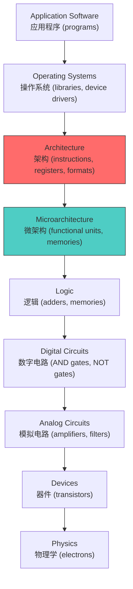
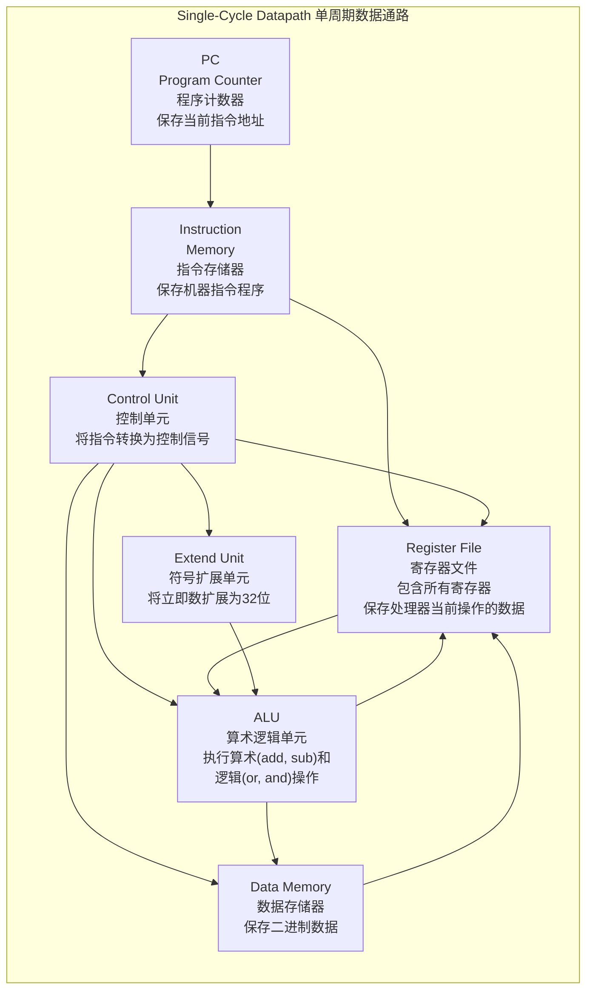
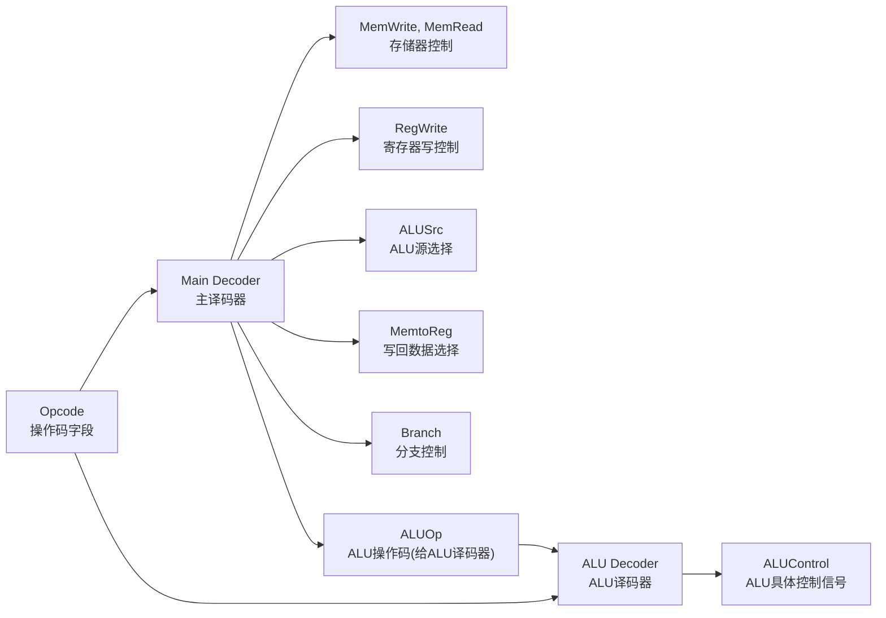
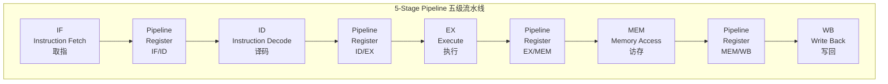
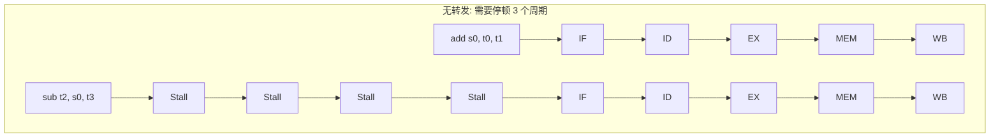
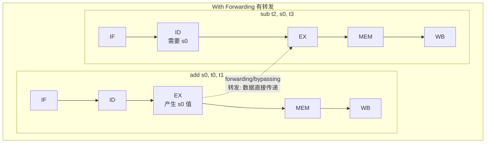
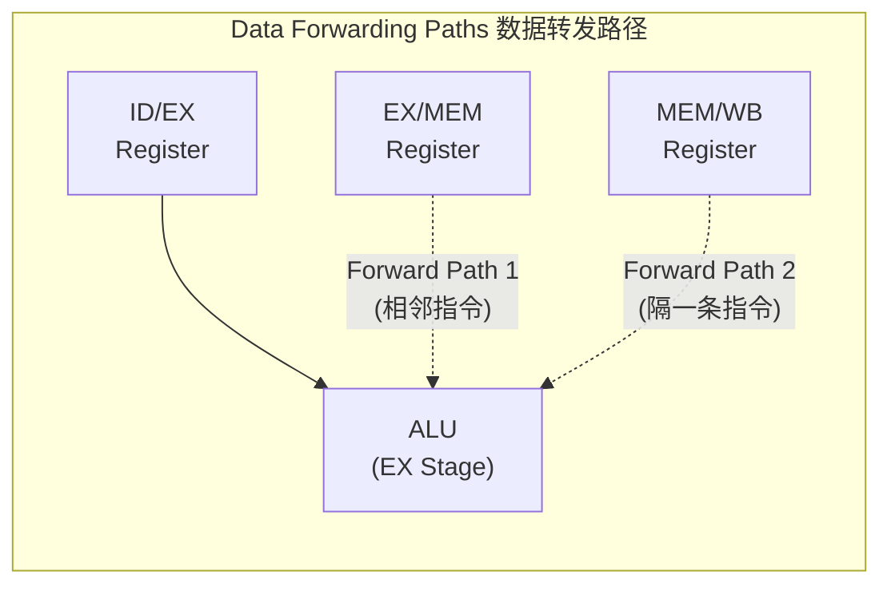
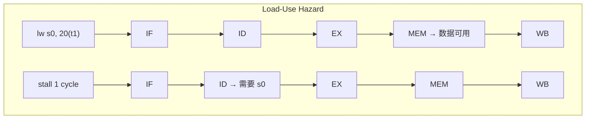
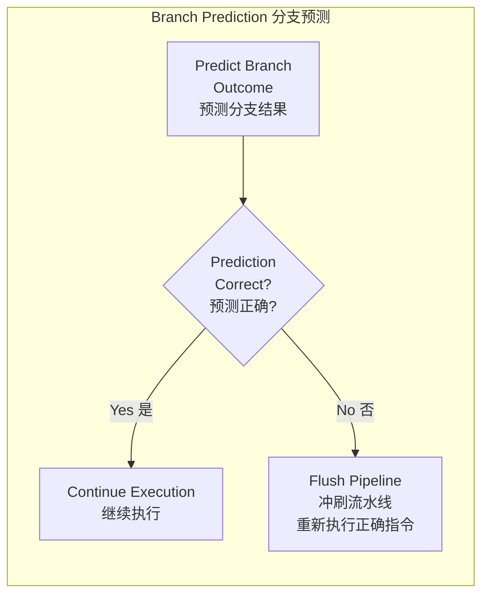

# 06 微架构 Microarchitecture

> COMP30660 Computer Architecture & Organisation
> Professor Chris Bleakley, UCD School of Computer Science
> 参考: Harris & Harris, Digital Design and Computer Architecture, RISC-V Edition, Chapter 7

---

## 目录

1. [设计层次 Design Hierarchy](#1-设计层次-design-hierarchy)
2. [微架构定义 Microarchitecture Definition](#2-微架构定义-microarchitecture-definition)
3. [单周期处理器 Single-Cycle Processor](#3-单周期处理器-single-cycle-processor)
4. [流水线处理器 Pipelined Processor](#4-流水线处理器-pipelined-processor)
5. [流水线冒险 Hazards](#5-流水线冒险-hazards)
6. [性能分析 Performance Analysis](#6-性能分析-performance-analysis)
7. [高级微架构 Advanced Microarchitectures](#7-高级微架构-advanced-microarchitectures)
8. [易混淆概念](#8-易混淆概念)
9. [高频考点](#9-高频考点)

---

## 1. 设计层次 Design Hierarchy

计算机系统的设计从高到低分为多个抽象层次:



**关键分区:**

| 层次 | 范围 | 关键概念 |
|------|------|----------|
| **Software (软件)** | Application Software + Operating Systems | programs, libraries, device drivers |
| **Architecture (架构)** | Architecture | **instructions, registers, formats** -- 程序员可见的接口 |
| **Hardware (硬件)** | Microarchitecture, Logic, Digital Circuits, Analog Circuits, Devices, Physics | 内部实现细节 |

> **核心要点**: Architecture 定义了处理器"能做什么"（What），Microarchitecture 定义了处理器"如何做"（How）。同一个 Architecture (如 RISC-V RV32I) 可以有多种不同的 Microarchitecture 实现。

---

## 2. 微架构定义 Microarchitecture Definition

### 2.1 正式定义

> "Computer microarchitecture is the design and organisation of the internal components of a processor that implements the architecture."

- **Architecture (架构)**: 定义处理器能做什么 -- 指令集、寄存器、指令格式（程序员的视角）
- **Microarchitecture (微架构)**: 定义硬件如何执行这些指令 -- 功能单元、存储器、互连方式（硬件设计师的视角）

### 2.2 本章关注的两种微架构

本章详细介绍 RISC-V 架构的两种微架构实现:

| 微架构类型 | 特点 | 执行模型 |
|------------|------|----------|
| **Single-cycle processor (单周期处理器)** | 每个时钟周期执行一条完整的指令 | 1 instruction / 1 clock cycle |
| **Pipelined processor (流水线处理器)** | 每个时钟周期执行多条指令的不同阶段 | 1 stage / 1 clock cycle (每个周期完成一条指令的一个阶段) |

---

## 3. 单周期处理器 Single-Cycle Processor

### 3.1 分析的指令集

本章以 RISC-V 中以下四条指令为例进行分析（构成一个无限循环的小程序）:

| Address | Instruction | Type | Machine Code |
|---------|-------------|------|--------------|
| 0x1000 | `lw x6, -4(x9)` | I-type | 0xFFC4A303 |
| 0x1004 | `sw x6, 8(x9)` | S-type | 0x0064A423 |
| 0x1008 | `or x4, x5, x6` | R-type | 0x0062E233 |
| 0x100C | `beq x4, x4, L7` | B-type | 0xFE420AE3 |

### 3.2 数据通路组件 Datapath Components



#### 3.2.1 各组件详解

| 组件 | 英文 | 功能 | 类型 |
|------|------|------|------|
| **PC (Program Counter)** | 程序计数器 | 保存当前机器指令的地址 | Sequential (时序元件) |
| **Instruction Memory** | 指令存储器 | 保存机器指令程序（只读） | Combinational (组合元件) |
| **Control Unit** | 控制单元 | 将当前机器指令转换为控制其他单元运行的信号 | Combinational |
| **Register File** | 寄存器文件 | 包含所有寄存器（如x0-x31），保存处理器当前操作的数据 | Sequential |
| **ALU (Arithmetic and Logic Unit)** | 算术逻辑单元 | 执行算术运算(add, subtract)和逻辑运算(or, and) | Combinational |
| **Data Memory** | 数据存储器 | 保存二进制数据（可读写） | Sequential |
| **Extend Unit** | 符号扩展单元 | 将较短立即数字段符号扩展为32位 | Combinational |
| **Multiplexers (MUX)** | 多路选择器 | 在多个输入源之间选择（数据通路图中未直接标注但广泛存在） | Combinational |

### 3.3 取指-译码-执行周期 Fetch-Decode-Execute Cycle

在每个时钟的**正边沿 (positive edge)**:
- PC 寄存器更新为下一条指令的地址
- 处理器硬件分三步执行指令:


**时序示意:**

```
Clock:    ┌───┐   ┌───┐   ┌───┐   ┌───┐
          │   │   │   │   │   │   │   │
          ┘   └───┘   └───┘   └───┘   └───

PC:      0x1000     0x1004     0x1008     0x100C
                                        → time
```

在正边沿时刻:
- **PC 更新**: 启动下一条指令的取指
- **Register File 更新**: 取决于当前指令的输出
- **Data Memory 更新**: 取决于当前指令的输出（仅 store 指令）

### 3.4 Load 指令执行流程 (lw x6, -4(x9))

#### 步骤 1: Fetch 取指

```
PC 寄存器更新为 0x1000
从 Instruction Memory 查找地址 0x1000
读取机器指令: 0xFFC4A303
```

#### 步骤 2: Decode 译码

```
将指令码 0xFFC4A303 拆分为字段:
  - opcode (操作码)
  - rd (目标寄存器): x6
  - rs1 (基址寄存器): x9
  - imm (立即数偏移): -4

Control Unit 根据 opcode 产生控制信号
```

#### 步骤 3: Execute 执行

**3a. 获取基地址 (Base Address):**
- Register File 端口 1 读取 x9 的值
- 得到 base address

**3b. 获取偏移地址 (Offset Address):**
- Extend Unit 将立即数 -4 符号扩展为 32 位
- 得到 offset address

**3c. 计算数据地址 (Data Address):**
- ALU 执行: base address + offset address
- 得到 data address (x9 - 4)

**3d. 读取数据存储器:**
- 用 data address 访问 Data Memory
- 读取数据字 (data word)

**3e. 准备 PC+4:**
- 计算 PC + 4 = 0x1000 + 4 = 0x1004 (下一条指令地址)

**3f. 正边沿更新:**
```
在时钟正边沿:
  - PC ← 0x1004 (下一条指令)
  - Register File[x6] ← 从内存读取的数据字
```

### 3.5 Store 指令执行流程 (sw x6, 8(x9))

Fetch 和 Decode 步骤与所有指令相同，以下只展示 Execute 步骤:

**3a. 获取基地址:**
- Register File 端口 1 读取 x9 = base address

**3b. 获取偏移地址:**
- Extend Unit 将立即数 8 符号扩展为 32 位 = offset address

**3c. 计算存储器地址:**
- ALU 执行: base + offset = memory address (x9 + 8)

**3d. 获取要存储的数据:**
- Register File 端口 2 读取 x6 = data word

**3e. 准备 PC+4:**
- 计算 PC + 4

**3f. 正边沿更新:**
```
在时钟正边沿:
  - PC ← PC+4
  - Data Memory[address] ← data word (存储操作)
```
注意: store 不写 Register File，只写 Data Memory

### 3.6 R-type 指令执行流程 (or x4, x5, x6)

**3a. 获取操作数:**
- Register File 端口 1 读取 x5 = data word 1
- Register File 端口 2 读取 x6 = data word 2

**3b. ALU 运算:**
- ALU 执行: data word 1 OR data word 2 = result

**3c. 准备 PC+4:**
- 计算 PC + 4

**3d. 正边沿更新:**
```
在时钟正边沿:
  - PC ← PC+4
  - Register File[x4] ← ALU result
```

### 3.7 Branch 指令执行流程 (beq x4, x4, L7)

**3a. 获取操作数:**
- Register File 端口 1 读取 x4 = data word 1
- Register File 端口 2 读取 x4 = data word 2

**3b. 执行比较:**
- ALU 执行比较运算
- 产生 flag: 1 = equal, 0 = not equal

**3c. 将 flag 转换为控制信号:**
- Control Unit 根据 flag 产生 PC 控制信号

**3d. 准备 PC+4:**
- 计算 PC + 4

**3e. 计算分支目标地址:**
- PC + relative branch offset = branch target address

**3f. 选择下一个 PC:**
- MUX 选择: PC+4 或 branch address
  - 如果 flag = equal (taken): 选择 branch address
  - 如果 flag = not equal (not taken): 选择 PC+4

**3g. 正边沿更新:**
```
在时钟正边沿:
  - PC ← 选定的地址 (branch address 或 PC+4)
  - Register File 和 Data Memory 都不更新
```

### 3.8 控制单元 Control Unit

控制单元将当前机器指令的 opcode 转换为控制信号:



#### 3.8.1 控制信号真值表

| Instruction | Opcode | RegWrite | ALUSrc | MemWrite | MemRead | MemtoReg | Branch | ALUOp |
|-------------|--------|----------|--------|----------|---------|----------|--------|-------|
| **lw** (I-type) | 0000011 | 1 | 1 (imm) | 0 | 1 | 1 | 0 | 00 (add) |
| **sw** (S-type) | 0100011 | 0 | 1 (imm) | 1 | 0 | X | 0 | 00 (add) |
| **R-type** (or, add, sub) | 0110011 | 1 | 0 (reg) | 0 | 0 | 0 | 0 | 10 (R-type) |
| **beq** (B-type) | 1100011 | 0 | 0 (reg) | 0 | 0 | X | 1 | 01 (sub/compare) |

**控制信号说明:**

| 控制信号 | 含义 | 值=0 | 值=1 |
|----------|------|------|------|
| **RegWrite** | 寄存器写使能 | 不写寄存器 | 写寄存器 |
| **ALUSrc** | ALU第二个源操作数 | 来自寄存器文件(reg2) | 来自立即数(imm) |
| **MemWrite** | 数据存储器写使能 | 不写存储器 | 写存储器 |
| **MemRead** | 数据存储器读使能 | 不读存储器 | 读存储器 |
| **MemtoReg** | 写回寄存器的数据源 | 来自ALU结果 | 来自数据存储器 |
| **Branch** | 分支控制 | PC ← PC+4 | PC ← 分支目标 (if equal) |
| **ALUOp** | ALU操作类型 | — | 00=add, 01=sub, 10=R-type由funct决定 |

#### 3.8.2 各指令类型的控制信号总结

| 指令类型 | 需要 ALUSrc=1? | 需要 MemWrite? | 需要 MemRead? | MemtoReg? | RegWrite? | Branch? | ALU操作 |
|----------|:--------------:|:--------------:|:-------------:|:---------:|:---------:|:-------:|:-------:|
| **R-type** (or, add, sub) | No (用reg2) | No | No | 0 (ALU结果) | Yes | No | R-type运算 |
| **lw** | Yes (用imm) | No | Yes | 1 (内存数据) | Yes | No | 加法(地址计算) |
| **sw** | Yes (用imm) | Yes | No | X (无关) | No | No | 加法(地址计算) |
| **beq** | No (用reg2) | No | No | X (无关) | No | Yes | 减法(比较) |

### 3.9 单周期处理器的关键特性

- **CPI = 1**: 每条指令恰好需要一个时钟周期
- **时钟周期 Tsc**: 必须足够长以完成最慢的指令 (通常是最长路径的 lw 指令)
- **缺点**: 时钟周期由最慢指令决定，快速指令也必须等待同样长的时间
- **优点**: 设计简单，控制逻辑直观

---

## 4. 流水线处理器 Pipelined Processor

### 4.1 从单周期到流水线

单周期处理器将指令执行分为 5 个功能步骤 (functional steps):

```
单周期执行模型 (add 指令, 1000ps):
┌─────────────────────────────────────────────────────────────┐
│  Fetch  │  Decode  │  Execute  │  Memory  │  Write Back     │
└─────────────────────────────────────────────────────────────┘
0ps                                                           1000ps
一次只能处理一条指令的所有阶段
```

**核心思想**: 让各阶段的硬件独立工作。一旦某条指令完成 Fetch，Decode 硬件可以立即开始该指令的 Decode，同时 Fetch 硬件可以开始下一条指令的 Fetch。

### 4.2 五级流水线 5-Stage Pipeline

流水线处理器的关键要素:

1. 每个步骤在一个时钟周期内完成（因此步骤被称为 **stage 阶段**）
2. 每个阶段的硬件必须独立（需要少量硬件复制）
3. 一个阶段的输出在时钟正边沿被 **pipeline registers (流水线寄存器)** 捕获
4. 这些寄存器的输出为下一阶段提供输入
5. 时钟周期设置为**最慢阶段所需时间**（因此各阶段的工作量需要均衡以最小化时钟周期）



#### 4.2.1 各阶段详解

| 阶段 | 缩写 | 全称 | 主要操作 | 涉及的功能单元 |
|------|------|------|----------|---------------|
| **IF** | Fetch | Instruction Fetch | 从指令存储器读取指令; PC ← PC+4 | PC, Instruction Memory |
| **ID** | Decode | Instruction Decode | 译码指令; 读取寄存器操作数; 符号扩展立即数 | Control Unit, Register File, Extend |
| **EX** | Execute | Execute | ALU 运算; 计算地址或结果 | ALU |
| **MEM** | Memory | Memory Access | 读/写数据存储器 | Data Memory |
| **WB** | Write Back | Write Back | 将结果写回寄存器文件 | Register File |

#### 4.2.2 流水线寄存器 Pipeline Registers

流水线寄存器位于相邻阶段之间，用于保存该阶段产生的结果并传递给下一阶段:

| 寄存器 | 位置 | 保存的关键信息 |
|--------|------|---------------|
| **IF/ID** | Fetch 和 Decode 之间 | 指令码、PC+4 |
| **ID/EX** | Decode 和 Execute 之间 | 控制信号、寄存器数据1和2、符号扩展立即数、PC+4、目标寄存器编号 |
| **EX/MEM** | Execute 和 Memory 之间 | ALU结果、要写入存储器的数据、目标寄存器编号、控制信号 |
| **MEM/WB** | Memory 和 Write Back 之间 | 从存储器读取的数据、ALU结果、目标寄存器编号、控制信号 |

### 4.3 流水线执行示例 (Pipelined Execution)

```mermaid
gantt
    title 5-Stage Pipeline Execution (无冒险)
    dateFormat X
    axisFormat %s

    section lw x6,-4(x9)
    IF  :done, 0, 1
    ID  :done, 1, 2
    EX  :done, 2, 3
    MEM :done, 3, 4
    WB  :done, 4, 5

    section sw x6,8(x9)
    IF  :done, 1, 2
    ID  :done, 2, 3
    EX  :done, 3, 4
    MEM :done, 4, 5
    WB  :done, 5, 6

    section or x4,x5,x6
    IF  :done, 2, 3
    ID  :done, 3, 4
    EX  :done, 4, 5
    MEM :done, 5, 6
    WB  :done, 6, 7

    section beq x4,x4,L7
    IF  :done, 3, 4
    ID  :done, 4, 5
    EX  :done, 5, 6
    MEM :done, 6, 7
    WB  :done, 7, 8
```



> **关键观察**: 在稳态下，每个时钟周期都有一条指令完成。每个周期每个阶段都在处理一条不同的指令。

### 4.4 流水线中的指令级并行 (ILP)

> **Instruction-Level Parallelism (ILP)** 指令级并行: 处理器同时执行多条指令的能力。

- **Throughput (吞吐率)**: 每秒完成的指令数 -- `number of instructions completed per second`
- 流水线是 ILP 的一种形式
- 5 级流水线中，最多有 5 条指令同时在处理器中（各处于不同阶段）

---

## 5. 流水线冒险 Hazards

### 5.1 冒险定义

> "A **hazard** occurs when an instruction is dependent on the results of a previous instruction that has not yet been completed."
> （冒险发生当一条指令依赖于前一条尚未完成的指令的结果。）

> "A **stall** occurs when instruction execution must be paused due to a hazard or resource conflicts."
> （停顿发生当指令执行必须因为冒险或资源冲突而暂停。）

### 5.2 数据冒险与转发 (Data Hazard & Forwarding)

#### 5.2.1 问题



#### 5.2.2 解决方案: Forwarding (转发 / Bypassing)

通过特殊的硬件电路将 ALU 输出结果直接转发到 ALU 的输入端:




**转发路径总结:**

| 转发来源 | 转发目标 | 场景 |
|----------|----------|------|
| EX/MEM 寄存器 (前一条指令的 ALU 结果) | EX 阶段 ALU 输入 | 相邻指令的数据依赖 (最常用) |
| MEM/WB 寄存器 (前两条指令的结果) | EX 阶段 ALU 输入 | 隔一条指令的数据依赖 |



#### 5.2.3 Load-Use Data Hazard (加载-使用数据冒险)

即使有转发，load 指令的数据在 MEM 阶段结束时才能获得:



**需要 1 个 stall cycle** 的原因是: lw 的数据在 MEM 阶段结束时才可用（时钟周期4结束），但 sub 在 EX 阶段开始时就需要（时钟周期3开始）。即使从 MEM 阶段转发到 EX 阶段，sub 的 EX 也需要等待到时钟周期4才能执行。

**解决方法**: 指令重排序 (code re-ordering)，在 lw 和 dependent instruction 之间插入一条不相关的有用指令。

### 5.3 控制冒险 (Control Hazard / Branch Hazard)

#### 5.3.1 问题

分支指令的条件在 EX 阶段才被评估，但此时下一条指令已经被 Fetch 了:

```
beq t1, t2, L1      IF    ID    EX    MEM   WB
Stall                                    stall
add t5, t1, t3                     IF    ID    EX    MEM   WB
                                        ← 需要等到分支结果确定
```

需要 1 个周期的 stall，因为分支决议(branch resolution)在 EX 阶段，需要将结果转发回 Fetch 阶段来选择正确的下一条指令。

#### 5.3.2 解决方案: Branch Prediction (分支预测)

现代处理器**预测**分支结果，并基于预测继续执行:



**分支预测技术:**

| 技术 | 英文 | 描述 |
|------|------|------|
| **静态分支预测** | Static Branch Prediction | 总是预测 backward branch (循环) taken; forward branch (if-else) not taken |
| **动态分支预测 (1-bit)** | Dynamic Branch Prediction (1-bit) | 记录最近一次该分支是否 taken，假设本次结果与上次相同 |
| **动态分支预测 (2-bit)** | Dynamic Branch Prediction (2-bit) | 使用有限状态机，需要连续两次预测错误才改变预测方向 |

### 5.4 三种冒险类型总结

| 冒险类型 | 英文 | 原因 | 解决方案 |
|----------|------|------|----------|
| **结构冒险** | Structural Hazard | 硬件资源冲突（多个指令同时需要同一功能单元） | 复制硬件资源; 设计独立的指令和数据存储器 |
| **数据冒险** | Data Hazard | 指令之间存在数据依赖 (RAW: Read After Write) | **Forwarding/bypassing** (转发); **Stalling** (停顿) |
| **控制冒险** | Control Hazard | 分支/跳转指令导致 PC 不确定 | **Branch Prediction** (分支预测); **Stalling** (停顿) |

---

## 6. 性能分析 Performance Analysis

### 6.1 MIPS (Million Instructions Per Second)

```
          N
Pmips = ─────
        10^6 E

其中: Pmips = 性能 (单位: MIPS)
      N     = 执行的指令数
      E     = 执行时间 (秒)
```

> 注意: MIPS 指标比较基础，不同处理器的指令集不同，MIPS 值不直接可比。更好的方式是使用 Benchmark 套件。

### 6.2 Benchmarks (基准测试)

- 运行一组程序套件（通常针对特定应用领域，如图形、音乐）
- 测量总执行时间
- 相对于参考计算机报告性能:

```
      Eref
B = ──────
     Ebench

其中: Eref   = 参考处理器的执行时间
      Ebench = 被测处理器的执行时间
      B 值越高越好
```

### 6.3 执行时间公式

#### 6.3.1 单周期处理器执行时间

```
Esc = Tsc × N

其中: Esc = 单周期处理器执行时间
      Tsc = 单周期处理器时钟周期
      N   = 指令数
```

> 单周期处理器的 CPI = 1（每条指令恰好一个周期）

#### 6.3.2 流水线处理器执行时间

```
Ep = 4Tp + Tp × N × (1 + S)

其中: Ep = 流水线处理器执行时间
      Tp = 流水线处理器时钟周期
      N  = 指令数
      S  = Stall Rate (停顿率)

解释:
  - 4Tp: 填充流水线 (pipeline fill) 需要 4 个周期
  - Tp × N × (1+S): N 条指令，每条平均 (1+S) 个周期
```

**Stall Rate (停顿率):**

```
     Ns
S = ───
     Nc

其中: Ns = 停顿的时钟周期数
      Nc = 总时钟周期数
```

#### 6.3.3 CPI (Cycles Per Instruction)

```
CPI = 1 + S (理想流水线 CPI=1，实际因 stall 而增大)
```

### 6.4 单周期 vs 流水线性能对比

**示例计算** (来自课件):

已知:
- 单周期处理器时钟频率: fsc = 100 MHz → Tsc = 10 ns
- 流水线处理器: 5 stages, fp = 450 MHz → Tp ≈ 2.22 ns
- Stall Rate: S = 0.05 (5%)

```
Pp     Esc     Tsc × N           Tsc          fp         450
──  =  ───  =  ────────────  →  ────────  →  ───────  →  ───────────  →  4.29
Psc    Ep     TpN(1+S)+4Tp      Tp(1+S)     fsc(1+S)    100(1+0.05)
```

**关键推导步骤:**
1. 对于大 N，填充管道的 4Tp 可以忽略
2. N 变量可以约掉
3. 时钟周期 T = 1/f（f 为频率）

**结论: 流水线处理器比单周期处理器快约 4.29 倍**，代价仅是增加了一些中间寄存器和少量额外逻辑。

**注意**:
- 由于中间寄存器 (pipeline registers) 的 overhead（建立时间和传播延迟），fp 并非恰好 fsc × 5
- 由于数据依赖导致的 stall，加速比小于理想的 5 倍

### 6.5 Speedup 公式

```
                   Execution Time (old)     Tsc × N          Tsc
Speedup = ────────────────────────────  =  ────────────  =  ────────
           Execution Time (new)            TpN(1+S)        Tp(1+S)
```

---

## 7. 高级微架构 Advanced Microarchitectures

### 7.1 Deep Pipelines (深度流水线)

- 基本流水线: 5 级
- 现代处理器: **8 ~ 20 级**
- 进一步加速处理器
- **收益递减**的原因:
  - 流水线中更多的指令导致更多的依赖关系 → **Stall Rate 增加**
  - 流水线寄存器的写入和读取有**固定的时间开销** (fixed overhead)

### 7.2 Branch Prediction (分支预测)

(详见 5.3.2 节)

- **静态预测**: 始终预测 backward branches taken, forward branches not taken
- **动态预测 (1-bit)**: 记录上次结果，预测本次相同
- **动态预测 (2-bit)**: 需要连续两次错误才切换预测

### 7.3 Superscalar Processor (超标量处理器)

> "A superscalar processor contains copies of the datapath hardware that executes multiple instructions simultaneously."
> （超标量处理器包含数据通路硬件的多个副本，同时执行多条指令。）

**2-way superscalar 相对于基本流水线的修改:**

| 修改 | 说明 |
|------|------|
| 同时取两条指令 | 每次 Fetch 取出 2 条指令 |
| Register File 端口翻倍 | 需要更多读/写端口 |
| 两个 ALU | 可以同时执行两条运算指令 |
| Data Memory 端口翻倍 | 支持同时的 load/store |
| 控制单元修改 | 处理同时执行两条指令的复杂情况 |

> 注意: 2-way superscalar 并非恰好是 1-way 的 2 倍速度，因为同时执行的指令增多导致 stall 增多。

### 7.4 Out-of-Order Processor (乱序执行处理器)

乱序处理器的工作原理:

1. **检查**即将到来的指令
2. **识别**操作数已经独立 (independent) 的指令 —— 即不依赖于尚未完成的较早指令的指令
3. **发射 (issue)** 这些独立指令，尽早开始处理，**不考虑它们原本在程序中的顺序**
4. **提交 (commit)**: 结果必须按程序顺序提交，以保证正确的程序行为

**优点**: 利用原本空闲的执行单元，提高处理器性能。

### 7.5 Multithreading Processor (多线程处理器)

- **Process (进程)**: 在计算机上运行的程序
- **Thread (线程)**: 进程内独立的执行单元，运行一系列指令
- 同一进程内的线程共享内存和资源，但独立执行

**传统处理器**: 在进程和线程之间切换 (单线程)
**多线程处理器**: 包含多份架构状态 (PC, registers, stack)，可以同时运行多个线程

**核心优势**: 线程在同步点之间是独立的，因此可以基本并行运行。

### 7.6 Multiprocessor (多处理器)

> "A multiprocessor system is a computer that contains multiple CPUs, each with its own local resources, as well as shared main memory and a method for communication between the CPUs."

- **Core (核心)**: 单个物理处理器芯片内的独立 CPU 单元
- 可以由多台计算机 (distributed systems)、单个计算机内的多个 CPU 芯片、或单个处理器内的多个 CPU 核心组成
- 实现**并行 (parallelism)**，不同处理器或核心同时执行多个进程和线程

---

## 8. 易混淆概念

### 8.1 Architecture vs Microarchitecture

| | Architecture (架构) | Microarchitecture (微架构) |
|---|---|---|
| **关注点** | What (做什么) | How (怎么做) |
| **视角** | 程序员视角 | 硬件设计师视角 |
| **内容** | 指令集、寄存器、指令格式、地址空间 | 功能单元、存储器组织、数据通路、控制逻辑 |
| **稳定性** | 相对稳定（跨代兼容） | 一代一变（持续优化） |
| **例子** | RISC-V RV32I, x86-64, ARMv8 | 单周期实现、流水线实现、超标量实现 |
| **设计层次** | Software-Hardware 边界 | Hardware 内部 |

### 8.2 Single-cycle vs Multi-cycle vs Pipelined

| 特性 | Single-cycle (单周期) | Multi-cycle (多周期) | Pipelined (流水线) |
|------|----------------------|---------------------|-------------------|
| **CPI** | 1 | >1 (每条指令多周期) | ~1 (理想) |
| **时钟周期** | 由最慢指令决定 (长) | 由最慢阶段决定 (中) | 由最慢阶段决定 (短) |
| **硬件复用** | 无 | 有 (功能单元在不同周期复用) | 无 (各阶段硬件独立) |
| **吞吐率** | 低 | 中 | 高 |
| **设计复杂度** | 低 | 中 | 高 |
| **控制复杂度** | 低 | 高 (需要FSM) | 中 (需要处理冒险) |
| **同时处理的指令** | 1 条 | 1 条 | 多条 (ILP) |

> 注: 课件主要对比 Single-cycle 和 Pipelined，Multi-cycle 是书中提到的一种中间方案（将指令分多个周期执行，复用功能单元）。

### 8.3 Structural Hazard vs Data Hazard vs Control Hazard

| 冒险类型 | 英文 | 根本原因 | 典型场景 | 解决方案 |
|----------|------|----------|----------|----------|
| **结构冒险** | Structural Hazard | 硬件资源不够用 | 单存储器存放指令+数据，同一周期需要同时取指和访存 | 分离 I-Mem 和 D-Mem (Harvard架构) |
| **数据冒险** | Data Hazard | 指令间数据依赖，前一条未写完 | `add x1,x2,x3` → `sub x4,x1,x5` (RAW) | Forwarding (转发); Stall (停顿) |
| **控制冒险** | Control Hazard | 分支/跳转导致 PC 不确定 | `beq x1,x2,L1` 后面取哪条指令? | Branch Prediction (分支预测); Stall (停顿) |

### 8.4 Forwarding vs Stalling

| | Forwarding (转发/Bypassing) | Stalling (停顿) |
|---|---|---|
| **原理** | 将数据从产生点直接路由到消费点，不走寄存器文件 | 暂停流水线一个或多个周期等待数据就绪 |
| **性能影响** | 几乎无性能损失 | 降低性能 (增加 CPI) |
| **硬件代价** | 增加多路选择器和数据通路 | 增加停顿检测和流水线暂停逻辑 |
| **适用场景** | 数据在流水线后方已产生，可转发 (如 ALU→ALU) | 数据尚未产生，无法转发 (如 Load-Use) |
| **例子** | `add→sub` 的 RAW 依赖可通过转发解决 | `lw→sub` 的 Load-Use 依赖需要 1 个 stall |

### 8.5 Combinational vs Sequential Elements in Datapath

| | Combinational (组合元件) | Sequential (时序元件) |
|---|---|---|
| **定义** | 输出仅取决于当前输入 | 输出取决于当前输入和历史状态 |
| **状态** | 无状态 (stateless) | 有状态 (stateful) |
| **数据通路中的例子** | ALU, Extend Unit, MUX, Adder, Control Unit | PC, Register File, Data Memory, Pipeline Registers |
| **时钟行为** | 连续操作，输出随时钟传播延迟变化 | 仅在时钟边沿更新 |

### 8.6 不同指令类型的控制信号对比

| 控制信号 | R-type (or, add, sub) | lw (load) | sw (store) | beq (branch) |
|----------|:---------------------:|:---------:|:----------:|:------------:|
| **RegWrite** | 1 | 1 | 0 | 0 |
| **ALUSrc** | 0 (reg2) | 1 (imm) | 1 (imm) | 0 (reg2) |
| **MemWrite** | 0 | 0 | 1 | 0 |
| **MemRead** | 0 | 1 | 0 | 0 |
| **MemtoReg** | 0 (ALU) | 1 (Mem) | X | X |
| **Branch** | 0 | 0 | 0 | 1 |
| **ALU 操作** | 由 funct 字段决定 | add | add | sub (compare) |
| **PCSrc** | PC+4 | PC+4 | PC+4 | PC+4 或 branch address |

---

## 9. 高频考点

### 9.1 核心公式

#### (1) 执行时间 (Execution Time)

| 处理器类型 | 公式 | 说明 |
|------------|------|------|
| Single-cycle | `Esc = Tsc × N` | CPI = 1 |
| Pipelined | `Ep = 4Tp + Tp × N × (1 + S)` | 4Tp 为填充管道; S 为 stall rate |
| 近似 (大 N) | `Ep ≈ Tp × N × (1 + S)` | 忽略管道填充的 4Tp |

#### (2) Stall Rate

```
S = Ns / Nc
```

- Ns: 停顿的时钟周期数 (number of stalled clock cycles)
- Nc: 总时钟周期数 (total number of clock cycles)

#### (3) CPI

```
CPI = 1 + S    (理想流水线 CPI=1)
```

#### (4) 加速比 (Speedup)

```
                  Tsc × N           Tsc        fp
Speedup = ────────────────────  =  ────────  = ────────
          Tp × N × (1 + S)        Tp(1+S)    fsc(1+S)
```

#### (5) 时钟频率与周期

```
T = 1 / f

Tsc = 1 / fsc  (单周期)
Tp  = 1 / fp   (流水线)
```

#### (6) MIPS

```
Pmips = N / (10^6 × E)
```

#### (7) Benchmark Score

```
B = Eref / Ebench    (数值越大性能越好)
```

### 9.2 典型计算题模板

**题目**: 比较单周期处理器与流水线处理器性能

**已知条件**:
- fsc = 100 MHz, Tsc = 10 ns
- 5-stage pipeline, fp = 450 MHz, Tp ≈ 2.22 ns
- S = 0.05
- N = 10^6 条指令

**解答**:

```
Step 1: 计算 Esc
  Esc = Tsc × N = 10 × 10^(-9) × 10^6 = 10 × 10^(-3) = 10 ms

Step 2: 计算 Ep
  Ep = 4Tp + Tp × N × (1 + S)
     = 4(2.22 × 10^(-9)) + (2.22 × 10^(-9)) × 10^6 × 1.05
     ≈ 8.88 × 10^(-9) + 2.331 × 10^(-3)
     ≈ 2.331 ms

Step 3: 计算 Speedup
  Speedup = Esc / Ep ≈ 10 / 2.331 ≈ 4.29

Step 4: 也可直接用简化公式
  Speedup = fp / (fsc × (1 + S)) = 450 / (100 × 1.05) = 450 / 105 = 4.29
```

### 9.3 流水线冒险解决方案示例

#### 场景 1: RAW 数据冒险 (可通过 Forwarding 解决)

```assembly
add x1, x2, x3   # x1 ← x2 + x3
sub x4, x1, x5   # x4 ← x1 - x5  ← 需要 x1 的值

流水线时序:
add:  IF | ID | EX | MEM | WB
sub:       IF | ID | EX  | MEM | WB
                 ↑
        x1 在 add 的 EX 阶段产生
        但 sub 的 EX 阶段需要 x1
        → Forward from EX/MEM of add to EX of sub
```

**解决方案**: 从 EX/MEM 流水线寄存器转发到 ALU 的输入。

#### 场景 2: Load-Use 数据冒险 (需要 Stall)

```assembly
lw  x1, 20(x2)  # x1 ← Mem[x2+20]
sub x4, x1, x5  # x4 ← x1 - x5  ← 需要 x1 的值

流水线时序:
lw:  IF | ID | EX | MEM | WB
sub:     IF | ID | EX  | MEM | WB
                     ↑
        x1 在 lw 的 MEM 阶段才从内存获得
        但 sub 的 EX 阶段就需要 x1
        → 即使从 MEM 转发到 EX，也需要 1 个 stall
```

**带 stall 的时序**:
```
lw:  IF | ID | EX | MEM | WB
sub:      IF | ID | stall | EX | MEM | WB
                    ↑ 等待 lw 的 MEM 完成
```

#### 场景 3: 控制冒险 (分支)

```assembly
beq x1, x2, L1   # if x1==x2 goto L1
add x5, x1, x3   # (假设 not taken 的路径)

流水线时序 (无预测):
beq:  IF | ID | EX | MEM | WB
add:      IF | ID | stall | IF(新PC) | ID | EX | MEM | WB
               ↑ 等待 beq 的 EX 确定是否 taken
```

**Branch Prediction 解决**:
- 预测 not taken → 继续执行 add
- 如果预测正确 (x1 != x2): 无性能损失
- 如果预测错误 (x1 == x2): flush add 指令，从 L1 重新取指

---

## 10. 总结

```mermaid
mindmap
  root((Microarchitecture<br/>微架构))
    Single-Cycle<br/>单周期处理器
      Datapath Components<br/>数据通路组件
        PC
        Instruction Memory
        Register File
        ALU
        Data Memory
        Extend Unit
        Control Unit
      Instruction Types<br/>指令类型
        lw (I-type): 5个步骤
        sw (S-type): 存储到内存
        R-type: ALU运算
        beq (B-type): 分支判断
      Control Signals<br/>控制信号
        RegWrite, ALUSrc
        MemWrite, MemRead
        MemtoReg, Branch
    Pipelined<br/>流水线处理器
      5-Stage Pipeline<br/>五级流水线
        IF: Fetch
        ID: Decode
        EX: Execute
        MEM: Memory
        WB: Write Back
      Pipeline Registers<br/>流水线寄存器
      Hazards<br/>冒险
        Data Hazard<br/>数据冒险
          Forwarding/Bypassing<br/>转发
          Stalling<br/>停顿
        Control Hazard<br/>控制冒险
          Branch Prediction<br/>分支预测
        Structural Hazard<br/>结构冒险
    Performance<br/>性能
      Execution Time<br/>执行时间
      CPI
      Stall Rate
      Speedup<br/>加速比
      MIPS
      Benchmarks
    Advanced<br/>高级微架构
      Deep Pipelines
      Superscalar
      Out-of-Order
      Multithreading
      Multiprocessor
```

---

## 附录: 关键术语中英对照

| 中文 | 英文 | 缩写 |
|------|------|------|
| 微架构 | Microarchitecture | -- |
| 架构 | Architecture | -- |
| 单周期处理器 | Single-Cycle Processor | -- |
| 流水线处理器 | Pipelined Processor | -- |
| 程序计数器 | Program Counter | PC |
| 指令存储器 | Instruction Memory | I-Mem |
| 数据存储器 | Data Memory | D-Mem |
| 寄存器文件 | Register File | RF |
| 算术逻辑单元 | Arithmetic and Logic Unit | ALU |
| 控制单元 | Control Unit | CU |
| 符号扩展 | Sign Extension / Extend | -- |
| 流水线寄存器 | Pipeline Register | -- |
| 冒险 | Hazard | -- |
| 停顿 | Stall | -- |
| 转发 / 旁路 | Forwarding / Bypassing | -- |
| 分支预测 | Branch Prediction | -- |
| 超标量 | Superscalar | -- |
| 乱序执行 | Out-of-Order Execution | OoO |
| 指令级并行 | Instruction-Level Parallelism | ILP |
| 吞吐率 | Throughput | -- |
| 每周期指令数 | Cycles Per Instruction | CPI |
| 每秒百万指令 | Million Instructions Per Second | MIPS |
| 时钟周期 | Clock Period | T |
| 停顿率 | Stall Rate | S |
