# 07 存储系统 (Memory Systems)

> COMP30660 Computer Architecture & Organisation
> Chapter 7: Memory Systems — Cache, Virtual Memory
> Reference: Harris & Harris, *Digital Design and Computer Architecture, RISC-V Edition*, Chapter 8

---

## 1. 设计层次 (Design Hierarchy)

从应用软件到底层物理的完整层次结构：

```
Application Software  --> 程序 (programs)
Operating Systems      --> 库、设备驱动 (libraries, device drivers)
Architecture           --> 指令、寄存器、格式 (instructions, registers, formats)
Microarchitecture      --> 功能单元、存储器 (functional units, memories)
Logic                  --> 加法器、存储器 (adders, memories, etc.)
Digital Circuits       --> AND gate, NOT gate, etc.
Analog Circuits        --> 放大器、滤波器 (amplifiers, filters)
Devices                --> 晶体管 (transistors)
Physics                --> 电子 (electrons)
```

---

## 2. 存储层次结构 (Memory Hierarchy)

### 2.1 核心理念

随着主存 (main memory) 容量的增加，内存访问变得更慢。设计的挑战是构建一个**既大又快**的存储系统。

**解决方案：存储层次结构 (Memory Hierarchy)**

> Memory hierarchy is the organisation of hardware memory units in levels, where faster, smaller, and more expensive memory is placed closer to the CPU, and slower, larger, and cheaper memory is placed farther away.

### 2.2 存储层次图

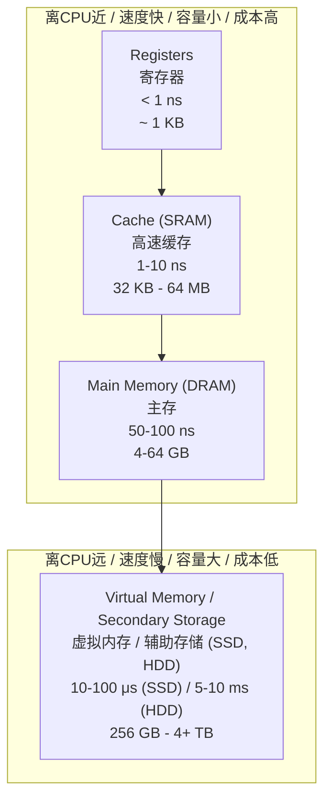

### 2.3 各级特征对比

| 层次 | 英文 | 技术 | 特性 | 容量 | 速度 | 成本 |
|------|------|------|------|------|------|------|
| Cache | 高速缓存 | SRAM | 小、快、昂贵 | KB-MB级 | 1-10 CPU cycles | 极高 |
| Main Memory | 主存 | DRAM | 大、较快、中等成本 | GB级 | 50-100 CPU cycles | 中等 |
| Virtual Memory | 虚拟内存 | SSD / HDD | 超大、慢、廉价 | TB级 | 10μs-10ms | 低 |

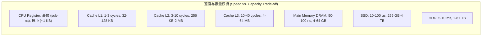

---

## 3. 存储技术 (Memory Technology)

### 3.1 SRAM vs DRAM vs SSD vs HDD

| 特性 | SRAM | DRAM | SSD | HDD |
|------|------|------|-----|-----|
| **全称** | Static Random Access Memory | Dynamic Random Access Memory | Solid-State Drive | Hard Disk Drive |
| **存储单元** | Flip-Flop (触发器, 6个晶体管) | Capacitor-Transistor (电容+晶体管, 1个) | NAND Flash memory cells | Magnetic rotating platters |
| **是否易失 (Volatile)** | 是 (Volatile) | 是 (Volatile) | 否 (Non-volatile) | 否 (Non-volatile) |
| **是否需要刷新** | 不需要 (No refresh needed) | 需要周期性刷新 (Periodic refresh required) | 不需要 | 不需要 |
| **速度** | 快 (1-10 ns) | 中等 (50-100 ns) | 慢 (10-100 μs) | 很慢 (5-10 ms) |
| **密度 / 容量** | 低 (lower density) | 高 (higher density) | 高 | 高 |
| **成本/bit** | 高 | 中 | 低 | 很低 |
| **机械部件** | 无 (纯电子) | 无 (纯电子) | 无 (纯电子, pure electronics) | 有 (机械臂+旋转磁盘) |
| **用途** | Cache (L1, L2, L3) | Main Memory (主内存) | 固态硬盘存储 | 传统硬盘存储 |

### 3.2 易失性 vs 非易失性

```
Memory (内存)    --> Volatile (易失性): 断电后数据丢失
Storage (存储)   --> Non-volatile (非易失性): 断电后数据保留
```

### 3.3 其他存储技术

| 类型 | 全称 | 特性 |
|------|------|------|
| ROM | Read-Only Memory | 只读，出厂时写入，不可改写 |
| PROM | Programmable ROM | 用户可编程一次 (一次性写入) |
| EPROM | Erasable Programmable ROM | 可用紫外光擦除后重新编程 |
| EEPROM | Electrically Erasable PROM | 可用电信号擦除和重新编程 |
| Flash | Flash Memory | 基于EEPROM，块级擦除，SSD和USB驱动的基础 |

---

## 4. 局部性原理 (Locality Principle)

### 4.1 为什么Cache有效

Cache之所以能在很小的容量下实现高命中率，是因为程序的内存访问具有局部性 (locality)：

#### 时间局部性 (Temporal Locality)
> A recently read address is likely to be read again soon.

- **例子**: 循环中的计数器 (counter in a loop) 被反复读写
- **Cache策略**: 将最近被读取的word保留在cache中
- **含义**: 如果一个数据被访问了，它很可能在不久的将来再次被访问

#### 空间局部性 (Spatial Locality)
> Addresses close to a recently read address are likely to be read soon.

- **例子**: 字符串中的字符一个接一个被读取；数组元素顺序访问
- **Cache策略**: 将包含被读地址的整个block从main memory复制到cache
- **含义**: 如果一个数据被访问了，其附近的数据也很可能被访问

### 4.2 局部性示意图

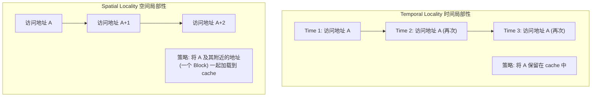

---

## 5. Cache 高速缓存

### 5.1 Cache 基础概念

> Cache memory is a small, fast on-chip memory closely connected to the CPU.

**Cache 的目标 (Purpose)**: 减少CPU读写内存所需的时间。

#### 读取流程 (Read from Memory)

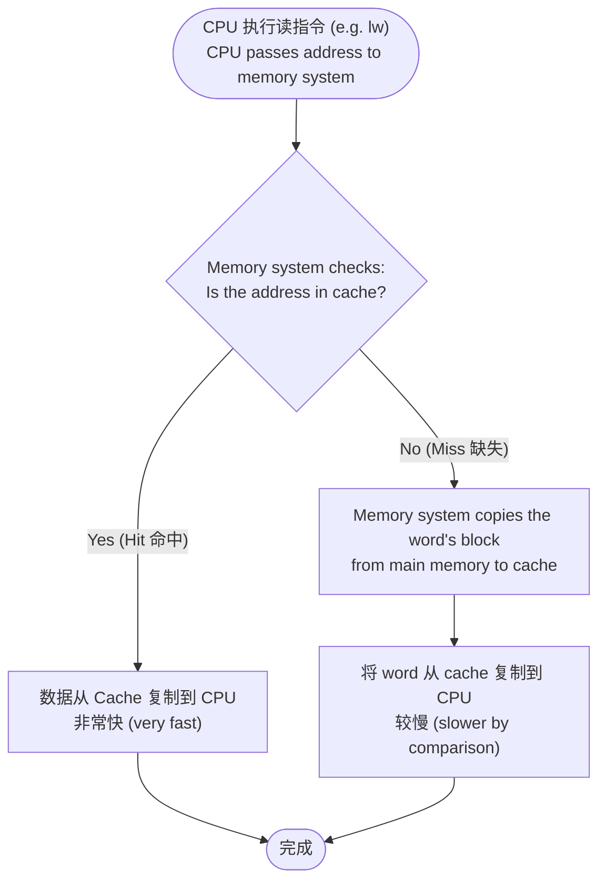

#### 写入流程 (Write to Memory)

当CPU执行写指令 (e.g. `sw`) 时，CPU将word和address传递给存储系统。存储系统将word存储在cache中（这是最快的方法，且该地址很可能很快再次被读写）。

---

### 5.2 Cache 写策略 (Write Policies)

#### 5.2.1 Write Hit 策略 (写命中)

当CPU写入的地址**已在cache中** (write hit)：

| 策略 | 英文 | 行为 | 优点 | 缺点 |
|------|------|------|------|------|
| **写穿透** | Write-through | 数据同时写入 Cache 和 Main Memory | 实现简单，主存始终是最新的 (up-to-date) | 产生大量内存流量 (memory traffic) |
| **写回** | Write-back | 数据只写入 Cache，标记为 dirty。当该数据被替换(evicted)时，才写回主存 | 通常性能更好 | 实现更复杂 |

#### 5.2.2 Write Miss 策略 (写缺失)

当CPU写入的地址**不在cache中** (write miss)：

| 策略 | 英文 | 行为 | 通常搭配 |
|------|------|------|----------|
| **不写分配** | No-write-allocate | 不将数据带入cache，直接在main memory中更新 | Write-through |
| **写分配** | Write-allocate | 先将block复制到cache，然后在cache中更新word | Write-back |

#### 5.2.3 写策略流程对比图

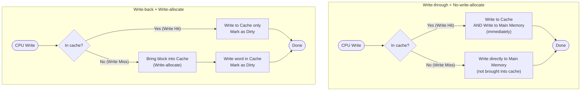

#### 5.2.4 Write-back 的 Dirty Bit

- **Dirty (脏)**: 数据被修改过（与主存不一致），标记为 dirty
- **Clean (干净)**: 数据未被修改（与主存一致）
- **替换脏数据时**: 必须先将脏数据写回main memory，再载入新数据
- **替换干净数据时**: 直接覆盖，不需写回main memory

---

### 5.3 Cache 替换策略 (Replacement Policies)

当cache已满且需要替换 (evict) 一个block时：

| 策略 | 英文 | 描述 | 实现复杂度 | 性能 |
|------|------|------|------------|------|
| **最近最少使用** | LRU (Least Recently Used) | 替换最长时间未被使用的block | 高 | 最佳 |
| **先进先出** | FIFO (First-In, First-Out) | 替换最早加载的block | 中 | 中 |
| **随机** | Random | 随机选择一个block替换 | 最低 | 不确定 |
| **最少使用** | LFU (Least Frequently Used) | 替换被使用次数最少的block | 高 | 较好 |

> Random is the simplest to implement. LRU usually gives the best performance.

---

### 5.4 Cache 组织结构 (Cache Organization)

#### 5.4.1 三种基本映射方式

| 类型 | 英文 | 描述 | Block放置 | 搜索方式 |
|------|------|------|-----------|----------|
| **直接映射** | Direct-mapped | 每个block只能映射到cache中的唯一位置 | 1个固定位置 | 只检查1个位置 |
| **全相联** | Fully-associative | 每个block可以放在cache中的任意位置 | 任意位置 | 搜索整个cache |
| **组相联** | N-way Set-associative | 每个block可以放在某个set中的任意way | N个可能位置 | 搜索set中的所有way |

> N-way set associative cache is the most common type of cache.

#### 5.4.2 2-Way Set Associative Cache 详解

**参数设定:**
- RISC-V处理器, 32-bit地址, 32-bit数据字
- 每个地址索引1 byte in main memory
- 最大地址空间: 2^32 bytes
- Cache容量: 8 words of data
- 2 ways, 每个way 4 words (共4 sets)

**Cache 术语 (Cache Jargon):**

| 术语 | 英文 | 定义 |
|------|------|------|
| 行/线 | Line (Block) | 可在cache和main memory间传输的最小数据单元 (这里: 1 word = 4 bytes) |
| 组 | Set | 共享相同index的一组line (这里: 2 bits = 4 sets) |
| 路 | Ways | 每个set中的line数量 (这里: 2 ways) |

**Cache 结构图:**

```
         Way 1                      Way 2
  V    Tag         Data      V    Tag         Data
Set 3   [ ]  [        ]        [ ]  [        ]
Set 2   [ ]  [        ]        [ ]  [        ]
Set 1   [ ]  [        ]        [ ]  [        ]
Set 0   [ ]  [        ]        [ ]  [        ]
```

每个line存储:
- **V (Valid bit)**: 指示该行是否有效 (1=valid/usable, 0=invalid/stale or empty)
- **Tag**: 地址的一部分，无法从所在位置推断出来的高位信息
- **Data**: 存储的实际数据 (1 word = 4 bytes)

---

### 5.5 地址划分 (Address Breakdown for 2-Way Set Associative Cache)

对于这个2-way set associative cache示例，32-bit地址被划分为三个字段：

```
Bit:  31 ...... 4   3  2    1  0
      [    Tag    ][ Set ][ Offset ]
      28 bits      2 bits   2 bits
```

| 字段 | 英文 | 位数 | 作用 |
|------|------|------|------|
| Tag | 标记 | 28 bits | 标识main memory中的set。与Set位置一起唯一确定地址 |
| Set/Index | 组索引 | 2 bits | 确定cache中的哪一个set (0-3) |
| Offset | 偏移 | 2 bits | 确定word内的哪一个byte (0-3) |

**为什么Offset是2 bits?**
- 每个word是32 bits = 4 bytes
- 需要有4种选择 (byte 0, byte 1, byte 2, byte 3)
- 2^2 = 4, 所以需要2 bits

**为什么Set/Index是2 bits?**
- Cache有4个sets (4 words per way)
- 2^2 = 4, 所以需要2 bits

**为什么Tag是28 bits?**
- 32 - 2 (offset) - 2 (set/index) = 28 bits

---

### 5.6 Cache 映射示例 (Detailed Cache Mapping Example)

#### 场景1: 初始 Miss (Cold Start / Compulsory Miss)

**CPU读取地址 0x00000024 (byte)**

地址 0x00000024 转换为二进制:
```
0x00000024 = 0000 0000 0000 0000 0000 0000 0010 0100
分成:     [000...00000010] [01] [00]
          Tag = 0x0000002 (2)  Set = 1  Offset = 0
```

**初始状态 (Cache为空):**

```
              Main Memory                          Cache
      Address         Data             Way 1              Way 2
                             V  Tag  Data  V  Tag  Data
    0x0000002C    0x000001AB     Set 3: 0  -   -    0  -   -
    0x00000028    0x00000423     Set 2: 0  -   -    0  -   -
    0x00000024    0x00000347     Set 1: 0  -   -    0  -   -
    0x00000020    0x00000A34     Set 0: 0  -   -    0  -   -
         ...           ...
    0x00000000    0x00000231
```

**步骤1: 复制word到cache** -- Set字段=1，word必须放到Set 1；两个Way都空闲，选择Way 1

```
      Way 1                    Way 2
Set 1: 0   -     0x00000347    0   -      -
```

**步骤2: 存储Tag** -- Tag=0x0000002，结合Set位置(1)可唯一确定地址

```
      Way 1                    Way 2
Set 1: 0   0x0000002 0x00000347 0  -      -
```

**步骤3: 设置Valid bit为1, 将Offset 0处的byte复制给CPU**

```
      Way 1                      Way 2
Set 1: 1   0x0000002  0x00000347  0   -      -
```

全部状态:

```
              Main Memory                          Cache
      Address         Data             Way 1              Way 2
                             V    Tag        Data   V  Tag  Data
    0x0000002C    0x000001AB     Set 3: 0    -        -     0  -   -
    0x00000028    0x00000423     Set 2: 0    -        -     0  -   -
    0x00000024    0x00000347     Set 1: 1  0x0000002 0x00000347  0  -   -
    0x00000020    0x00000A34     Set 0: 0    -        -     0  -   -
         ...           ...
    0x00000000    0x00000231
```

#### 场景2: 后续 Hit (利用 Spatial Locality)

**CPU读取地址 0x00000025 (byte)**

```
0x00000025 = ...0010 01_01
Tag = 0x0000002 (2), Set = 1, Offset = 1
```

Memory system检查Set 1寻找 Tag=2 且 Valid=1 的line:
- **Way 1**: Tag=0x0000002, V=1 --> **匹配! (Hit!)**
- 直接将offset 1处的byte复制到CPU -- **非常快!**

> 这是空间局部性的体现：相邻地址 (0x24) 的访问使得 (0x25) 能在cache命中。

#### 场景3: 地址到Cache的映射可视化

```
Address (binary)  --> Set field  --> Cache Slot

...0010_01_xx  --> Set=1 (01) --> Set 1, 任一Way
...0010_00_xx  --> Set=0 (00) --> Set 0, 任一Way
...0001_11_xx  --> Set=3 (11) --> Set 3, 任一Way
...0001_10_xx  --> Set=2 (10) --> Set 2, 任一Way
```

**关键理解**: 具有相同Set字段 (即相同 index bits) 的地址会映射到cache的同一个Set。

---

### 5.7 直接映射 Cache 访问流程

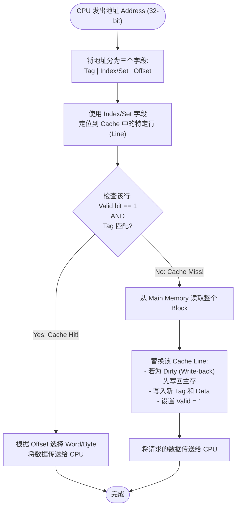

### 5.8 N-Way Set Associative Cache 访问流程

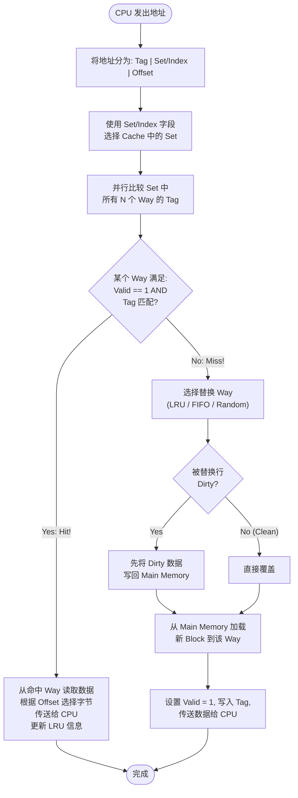

### 5.9 三种 Cache 映射方式对比

```mermaid
graph TD
    subgraph "Direct-Mapped Cache 直接映射"
        direction LR
        A1["Block 地址"] --> B1["唯一位置: Set X"]
        B1 --> C1["1个比较器"]
        C1 --> D1["优点: 简单, 快速, 硬件少<br/>缺点: 冲突缺失多 (conflict miss)<br/>每个地址只有一个可能位置"]
    end

    subgraph "Set-Associative Cache 组相联映射"
        direction LR
        A2["Block 地址"] --> B2["Set 中有 N 个位置<br/>(N Ways)"]
        B2 --> C2["N 个并行比较器"]
        C2 --> D2["优点: 冲突缺失少, 灵活性高<br/>缺点: 硬件复杂, 需要 N 个比较器<br/>最常用类型"]
    end

    subgraph "Fully-Associative Cache 全相联映射"
        direction LR
        A3["Block 地址"] --> B3["可以放在任意位置"]
        B3 --> C3["比较所有 Cache Line 的 Tag<br/>(大量比较器)"]
        C3 --> D3["优点: 无冲突缺失, 利用率最高<br/>缺点: 硬件昂贵, 速度慢<br/>仅用于小容量 TLB"]
    end
```

---

### 5.10 多级 Cache (Advanced Cache)

现代处理器为了提高性能，包含多级cache：

| Level | 名称 | 位置 | 速度 | 大小 |
|-------|------|------|------|------|
| L1 | Level-1 cache | Per core (每个核心独立) | 1-3 CPU cycles | 32-128 KB |
| L2 | Level-2 cache | Per core (每个核心独立) | 3-10 CPU cycles | 256 KB-2 MB |
| L3 | Level-3 cache | Shared across all cores (所有核心共享) | 10-40 CPU cycles | 4-64 MB |

**多级Cache的优点:**
- L1: 极致速度，最小容量
- L2: 平衡速度与容量
- L3: 共享大容量，减少访问主存次数

---

### 5.11 Cache 性能分析 (Performance Analysis)

#### 5.11.1 基本指标

| 指标 | 英文 | 公式 |
|------|------|------|
| 命中率 (Hit Rate) | Hit rate | H_cache = N_hit / N_access |
| 缺失率 (Miss Rate) | Miss rate | M_cache = N_miss / N_access = 1 - H_cache |
| 命中时间 | Hit Time (T_cache) | Cache访问所需的时间 (clocks) |
| 缺失代价 | Miss Penalty (T_main) | 从Main Memory加载数据的时间 (clocks) |
| 平均内存访问时间 | AMAT (Average Memory Access Time) | A = T_cache + M_cache * T_main |

其中:
- `N_hit`: number of cache hits
- `N_miss`: number of cache misses
- `N_access`: total number of memory accesses by CPU

#### 5.11.2 AMAT 计算示例

**Given:**
- Hit rate = 90% = 0.90
- T_cache = 1 clock cycle
- T_main = 100 clock cycles

```
Miss rate = 1 - 0.90 = 0.10

AMAT = T_cache + Miss_rate * T_main
     = 1 + (0.10) * 100
     = 1 + 10
     = 11 clock cycles
```

> 相比无cache时直接访问main memory的100 cycles，有了cache后平均只需要11 cycles -- 性能提升近10倍!

#### 5.11.3 多级 Cache 的 AMAT

对于有L1和L2 Cache的系统:
```
AMAT = T_L1 + M_L1 * [T_L2 + M_L2 * T_main]
```

其中 `M_L1` 是L1的缺失率，`M_L2` 是L2的缺失率 (注意: 这里的M_L2是L1 miss后L2的局部缺失率)。

#### 5.11.4 三种 Cache Miss 类型

| 类型 | 英文 | 原因 | 解决方法 |
|------|------|------|----------|
| **强制缺失** | Compulsory / Cold Miss | 第一次访问该block (cache为空) | 增大block size (prefetching) |
| **容量缺失** | Capacity Miss | Cache容量不够容纳所有需要的block | 增大cache容量 |
| **冲突缺失** | Conflict Miss | 多个block映射到同一个set (direct-mapped尤为严重) | 增加associativity (way数) |

---

## 6. 虚拟内存 (Virtual Memory)

### 6.1 核心理念

> Virtual memory gives the CPU the impression that there is more main memory than there really is.

**目的**: 让CPU以为拥有比实际物理内存大得多的主存，而无需实际花那么多钱。

**实现方式:**
- 分配一个大于物理地址空间的虚拟地址空间 (Virtual Address Space)
- CPU使用虚拟地址 (Virtual Addresses)
- 虚拟地址空间被组织成页 (pages/blocks)
- OS在main memory和storage之间交换页 (以响应CPU的内存访问请求)

### 6.2 虚拟内存读写流程

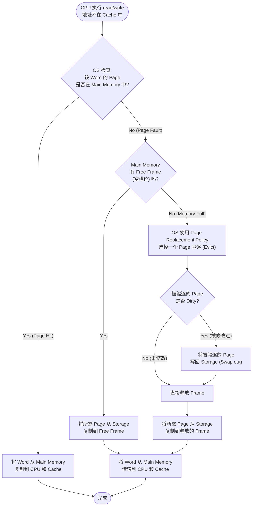

### 6.3 Page Table (页表)

#### 6.3.1 地址结构

```
Virtual Address (虚拟地址)
    [    VPN (Virtual Page Number)   ][   Page Offset   ]
     唯一标识包含该地址的Page          指定Page内的字节偏移

Physical Address (物理地址)
    [    PFN (Physical Frame Number) ][   Page Offset   ]
     唯一标识Main Memory中的Page Frame   指定Frame内的字节偏移
```

**关键点: Page Offset在转换前后保持不变!** 只有VPN被翻译成PFN。

#### 6.3.2 地址转换过程

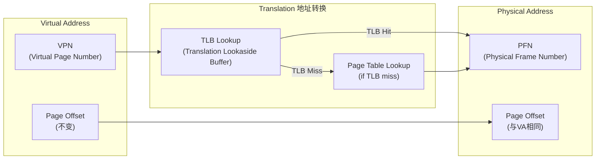

#### 6.3.3 Page Table 结构

Page Table 的每一行 (row) 对应一个VPN (即一个Page)，包含以下信息：

| 字段 | 英文 | 说明 |
|------|------|------|
| VPN | Virtual Page Number | 行索引，标识虚拟页面 |
| Valid bit | 有效位 | 1 = Page在Main Memory中; 0 = Page不在 (在storage中) |
| PFN | Physical Frame Number | Page在Main Memory中的物理帧位置 |
| Protection | 保护位 | 指示page的读写权限 (r=读, w=写, rw=读写) |
| Dirty bit | 脏位 | 1 = Page加载后被修改过; 0 = 未被修改 |
| Reference | 引用位 | 用于替换策略的信息 (e.g. 最近是否被访问) |

**Page Table 示例:**

```
VPN      Valid    PFN      Protection   Dirty    Reference
...      ...      ...      ...          ...      ...
0x0002   1        0x003A   rw           0        ...
0x0001   0        -        -            -        -
0x0000   1        0x004E   rw           1        ...
```

### 6.4 虚拟内存示例 (Virtual Memory Example)

**给定条件:**
- 每Page包含 256 bytes --> Page Offset 需要 8 bits (2^8 = 256)
- Physical Memory包含 16 pages --> PFN 需要 4 bits (2^4 = 16)
- Virtual Memory包含 512 pages --> VPN 需要 9 bits (2^9 = 512)
- Virtual Address = 9 + 8 = **17 bits**
- Physical Address = 4 + 8 = **12 bits**

#### 示例1: 读操作 (Page Hit)

CPU读取 Virtual Address = **0x000201** (17-bit)

```
VA = 0x000201

分解: VPN = 0x0002 (高9位)
       Page Offset = 0x01 (低8位, 即后2个hex digit)
```

查找 Page Table:

```
VPN      Valid   PFN    Dirty
...
0x0002   1       0x4    0
0x0001   0       -      0
0x0000   1       0x5    0
```

- VPN=0x0002: Valid=1 (在物理内存中), PFN=0x4
- Physical Address = PFN + Page Offset = 0x4 + 0x01 = **0x0401**
- 从物理地址 0x0401 复制数据到CPU和Cache

#### 示例2: 写操作 (设置Dirty bit)

CPU写入 Virtual Address = **0x0000FF**

```
VA = 0x0000FF --> VPN = 0x0000, Page Offset = 0xFF
```

Page Table Lookup:
- VPN=0x0000: Valid=1, PFN=0x5
- Physical Address = 0x5FF
- 写入到物理地址 0x5FF
- **将 Dirty bit 设置为 1** (因为数据被修改了)

**更新后的 Page Table:**

```
VPN      Valid   PFN    Dirty
...
0x0002   1       0x4    0
0x0001   0       -      0
0x0000   1       0x5    1    <-- Dirty bit 被设置
```

#### 示例3: Page Fault (缺页)

CPU读取 Virtual Address = **0x00010E**

```
VA = 0x00010E --> VPN = 0x0001, Page Offset = 0x0E
```

Page Table Lookup:
- VPN=0x0001: **Valid=0** (不在物理内存中! --> **Page Fault**)
- Physical Memory已满，OS需要驱逐一个Page
- OS选择驱逐 VPN=0x0002 (Frame 0x4)，因为它的 Dirty=0 (未被修改)
  --> 不需要写回storage，直接覆盖即可

**OS操作:**
1. 将Page 0x0001从storage加载到Frame 0x4
2. 更新Page Table: VPN 0x0002变为invalid, VPN 0x0001变为valid

**更新后的 Page Table:**

```
VPN      Valid   PFN    Dirty
...
0x0002   0       -      -       <-- 被驱逐, 变为 invalid
0x0001   1       0x4    0       <-- 新加载
0x0000   1       0x5    1
```

3. Physical Address = 0x4 + 0x0E = **0x040E**
4. 从 0x040E 复制数据到CPU和Cache

### 6.5 Page Table 地址转换流程图

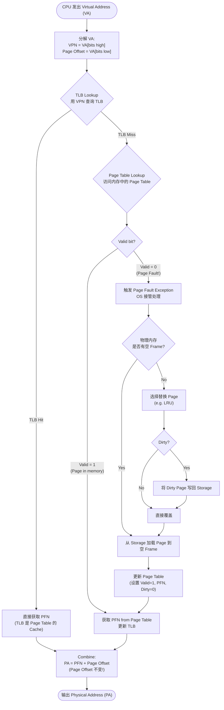

### 6.6 Translation Lookaside Buffer (TLB)

> A dedicated cache for the Page Table.

- TLB是Page Table的高速缓存 (cache)
- 只包含Page Table的一个小子集 -- 最近最常用的rows
- 加速VPN到PFN的转换，避免每次都访问slow main memory中的Page Table
- 通常采用**全相联 (fully-associative)** 或**高关联度组相联**设计 (因容量很小)

**TLB访问顺序:**
```
1. 先查 TLB (fast, 通常在L1 cache access的同时进行)
2. 如果 TLB Hit  --> 直接获取 PFN，快速完成地址转换
3. 如果 TLB Miss --> 需要访问内存中的 Page Table (慢)
4. 将 Page Table 查询结果加载到 TLB 中
```

---

## 7. 易混淆概念对比 (Comparison of Easily Confused Concepts)

### 7.1 SRAM vs DRAM

| 特性 | SRAM (Static RAM) | DRAM (Dynamic RAM) |
|------|-------------------|--------------------|
| 存储单元 | 6个晶体管构成的Flip-Flop (触发器) | 1个晶体管 + 1个电容 (capacitor) |
| 是否需要刷新 | **不需要** (静态存储) | **必须周期性刷新** (电容会漏电) |
| 速度 | 快 (1-10 ns) | 较慢 (50-100 ns) |
| 密度 | 低 (每个bit需要更多晶体管) | 高 (每个bit只需1个晶体管) |
| 成本/bit | 高 | 低 |
| 功耗 | 连续消耗 (但较低) | 刷新消耗额外功耗 |
| 用途 | **Cache (L1/L2/L3)** | **Main Memory (主存)** |
| 集成度 | 低 | 高 (相同面积可存储更多bit) |

**记忆口诀**: SRAM = **S**tatic = **S**imple cell but **S**mall density (不需要刷新，快但贵); DRAM = **D**ynamic = **D**ense but **D**raining (密度大便宜但需要刷新)

### 7.2 Direct-mapped vs Set-associative vs Fully-associative Cache

| 特性 | Direct-mapped (直接映射) | Set-associative (组相联) | Fully-associative (全相联) |
|------|--------------------------|--------------------------|----------------------------|
| Block放置位置 | 1个固定位置 (唯一) | N个位置 (Set内的Way) | 任意位置 |
| 比较器数量 | 1 | N | 所有cache line数 |
| 硬件复杂度 | 低 | 中 | 高 |
| 冲突缺失 (Conflict Miss) | 高 | 低 | 0 |
| 搜索速度 | 最快 | 较快 | 较慢 |
| 命中率 | 最低 | 较高 | 最高 |
| 实际应用 | 早期设计/L1 | **最常用** (L1/L2/L3) | 小容量TLB |
| 索引方式 | 仅通过Index定位 | Index定位Set, Tag识别Way | Tag识别所有 |

### 7.3 Write-through vs Write-back

| 特性 | Write-through (写穿透) | Write-back (写回) |
|------|------------------------|-------------------|
| 写入目标 | Cache + Main Memory (同时) | 仅写入 Cache |
| Main Memory一致性 | 始终最新 (always up-to-date) | 可能不一致 (stale) |
| 写入流量 | **高** (每次write都访问memory) | **低** (仅evict dirty时访问memory) |
| 实现复杂度 | **简单** | 复杂 (需要Dirty bit) |
| 性能 | 通常较差 (受memory bandwidth限制) | **通常更好** (write buffering) |
| Write miss搭配 | 通常与 No-write-allocate 搭配 | 通常与 Write-allocate 搭配 |
| Dirty bit | 不需要 | **需要** |

### 7.4 Write-allocate vs No-write-allocate

| 特性 | Write-allocate (写分配) | No-write-allocate (不写分配) |
|------|--------------------------|------------------------------|
| Write miss行为 | 将block先load进cache，再在cache中write | 直接在main memory中write，不载入cache |
| 后续访问 | Cache中有该block，后续read可能hit | Cache中无该block，后续read一定miss |
| 搭配策略 | **Write-back** | **Write-through** |
| 性能 | 后续读访问快 (利用了temporal locality) | 简单但可能牺牲后续读性能 |

### 7.5 Virtual Address vs Physical Address

| 特性 | Virtual Address (虚拟地址) | Physical Address (物理地址) |
|------|----------------------------|------------------------------|
| 使用者 | CPU (程序看到的是虚拟地址) | Memory System (内存控制器) |
| 地址空间大小 | 可以很大 (由ISA决定, e.g. 2^64) | 由实际安装的RAM容量决定 (较小) |
| 连续性 | 程序看到的连续地址 | 实际物理上可能不连续 (分散在不同frame) |
| 隔离性 | 每个进程有独立的虚拟地址空间 | 所有进程共享物理内存 |
| 转换 | 需要通过Page Table/TLB转换为物理地址 | 直接用于访问内存芯片 |

### 7.6 TLB vs Page Table

| 特性 | TLB (Translation Lookaside Buffer) | Page Table (页表) |
|------|------------------------------------|-------------------|
| 本质 | **Cache** of the Page Table | **完整的** VPN->PFN 映射表 |
| 位置 | On-chip (在CPU芯片内) | Main Memory (在内存中) |
| 容量 | 很小 (几十到几百个条目) | 很大 (覆盖整个虚拟地址空间) |
| 速度 | 极快 | 慢 (需要访问main memory) |
| 内容 | 最近使用的page mappings (subset) | 所有页面的映射 |
| 组织 | 通常全相联 (fully-associative) | 多级页表 (hierarchical) |
| 命中时 | 直接获取PFN (address translation done) | N/A |
| 缺失时 | 需要访问内存中的Page Table | N/A (由OS处理page fault) |

### 7.7 Volatile vs Non-volatile Memory

| 特性 | Volatile (易失性) | Non-volatile (非易失性) |
|------|-------------------|--------------------------|
| 断电后数据 | **丢失** (lost) | **保留** (retained) |
| 典型技术 | SRAM, DRAM | SSD (NAND Flash), HDD (磁性), ROM, EEPROM |
| 分类 | Memory (内存/主存) | Storage (存储/外存) |
| 速度 | 快 | 慢 |

### 7.8 Temporal vs Spatial Locality

| 特性 | Temporal Locality (时间局部性) | Spatial Locality (空间局部性) |
|------|-------------------------------|-------------------------------|
| 定义 | 最近访问过的地址很可能再次被访问 | 刚访问地址附近的地址很可能被访问 |
| 例子 | 循环中的变量被反复读写 | 数组顺序遍历; 字符串逐字符读取 |
| Cache利用 | 将最近访问的数据保留在cache中 | 将包含被访问地址的整个block加载到cache |
| 失效情况 | 程序一次性处理大量数据 (如streaming) | 随机内存访问 (如linked list traversal) |

---

## 8. 高频考点 (Key Exam Points)

### 8.1 核心公式

#### AMAT (Average Memory Access Time)

```
单级Cache:
    AMAT = T_cache + M_cache * T_main

其中:
    T_cache  = Cache访问时间 (命中时间, Hit Time)
    M_cache  = Cache缺失率 (Miss Rate) = 1 - Hit Rate
    T_main   = 主存访问时间 (Miss Penalty 缺失代价)
```

#### 多级Cache AMAT

```
    AMAT = T_L1 + M_L1 * [T_L2 + M_L2 * T_main]
```

#### Memory Stall Cycles (内存停顿周期)

```
    Memory Stall Cycles = Memory_Accesses * Miss_Rate * Miss_Penalty

    CPU Time = (CPU_Execution_Clocks + Memory_Stall_Clocks) * Clock_Cycle_Time
```

#### Hit Rate / Miss Rate

```
    Hit Rate  H = N_hit / N_access
    Miss Rate M = N_miss / N_access = 1 - H
```

### 8.2 地址字段划分计算

```
对于 Cache:
    Offset bits  = log2(Block_Size_in_bytes)
    Index bits   = log2(Number_of_Sets)
                   其中 Number_of_Sets = Cache_Size / (Block_Size * Ways)
    Tag bits     = Address_Width - Index_bits - Offset_bits

对于 Virtual Memory:
    Page Offset bits = log2(Page_Size)
    VPN bits = Virtual_Address_Width - Page_Offset_bits
    PFN bits = Physical_Address_Width - Page_Offset_bits
```

### 8.3 Cache 容量的计算

```
Cache 总容量 = Number_of_Sets * Ways * (1 + Tag_bits + Block_Size * 8) bits

其中:
    1 bit         = Valid bit
    + Tag_bits    = Tag 存储
    + Block_Size*8 = Data 存储 (Block_Size in bytes)
```

### 8.4 Page Table 大小计算

```
Page Table Size = Number_of_VPNs * Size_of_each_PTE

其中:
    Number_of_VPNs = 2^(VPN_bits)
    Size_of_each_PTE = Valid_bit + PFN_bits + Protection_bits + Dirty_bit + Reference_bits
```

### 8.5 考试必记

| 概念 | 关键点 |
|------|--------|
| **Memory Hierarchy 设计目标** | 平衡 速度(speed) - 容量(capacity) - 成本(cost) |
| **Cache 为什么有效** | Temporal Locality + Spatial Locality |
| **最常用的 Cache 类型** | N-way Set-associative |
| **LRU 替换策略** | 通常性能最佳 |
| **Write-back 搭配** | Write-allocate (最常见组合) |
| **Write-through 搭配** | No-write-allocate |
| **Virtual Memory 的目的** | 让CPU以为有更多主存 (illusion of larger memory) |
| **Page Offset** | 在虚拟地址转物理地址过程中**不变** |
| **TLB** | Page Table 的 Cache |
| **Page Fault** | 所需Page不在物理内存中，需要从storage加载 |
| **Dirty bit 的作用** | 指示Page是否被修改过; evict时需要写回storage |

---

## 9. 综合练习题

### 练习1: Cache 地址划分

给定条件: 32-bit地址, Cache为4-way set-associative, Block size = 16 bytes, Cache总大小 = 64 KB。 计算:
1. Offset bits = ?
2. Number of blocks = ? Number of sets = ?
3. Index bits = ?
4. Tag bits = ?

**解答:**
```
1. Offset bits = log2(16) = 4 bits
2. Number of blocks = 64KB / 16B = 4096 blocks
   Number of sets = 4096 / 4 = 1024 sets
3. Index bits = log2(1024) = 10 bits
4. Tag bits = 32 - 10 - 4 = 18 bits
```

### 练习2: AMAT 计算

给定: L1 Cache: Hit rate = 95%, T_L1 = 1 cycle; L2 Cache: Hit rate = 80% (L1 miss后在L2的命中率), T_L2 = 10 cycles; T_main = 100 cycles。计算AMAT。

**解答:**
```
AMAT = T_L1 + M_L1 * [T_L2 + M_L2 * T_main]
     = 1 + 0.05 * [10 + 0.20 * 100]
     = 1 + 0.05 * [10 + 20]
     = 1 + 0.05 * 30
     = 1 + 1.5
     = 2.5 cycles
```

### 练习3: Virtual Memory 地址转换

给定: 虚拟地址 = 16 bits, 每Page = 512 bytes, 物理内存有 8 frames。

1. Page Offset bits = ?
2. VPN bits = ? PFN bits = ?
3. 若 VA = 0x0A3F, 求 VPN 和 Page Offset (十六进制)

**解答:**
```
1. Page_Size = 512 bytes = 2^9, Page Offset bits = 9 bits
2. VPN bits = 16 - 9 = 7 bits (128个虚拟页)
   PFN bits = log2(8) = 3 bits (8个物理帧)
   Physical Address = 3 + 9 = 12 bits

3. VA = 0x0A3F = 0000 1010 0011 1111 (16 bits)
   VPN = 高7位 = 0000 101 = 0x05
   Page Offset = 低9位 = 0 0011 1111 = 0x03F
```

---

## 10. 总结

### 关键要点回顾

1. **存储层次 (Memory Hierarchy)**: CPU Register -> Cache (L1/L2/L3) -> Main Memory (DRAM) -> Secondary Storage (SSD/HDD)，从上到下速度递减、容量递增、每bit成本递减。

2. **局部性原理 (Locality)**: 程序的内存访问具有时间局部性和空间局部性，这是Cache能够用很小的容量实现高命中率的理论基础。

3. **Cache 设计核心参数**:
   - 映射方式: Direct-mapped, Set-associative, Fully-associative
   - 写策略: Write-through + No-write-allocate / Write-back + Write-allocate
   - 替换策略: LRU (最佳), FIFO, Random (最简单), LFU

4. **Cache 性能**: AMAT = T_cache + Miss_rate * Miss_penalty。多级Cache可以进一步降低AMAT。

5. **虚拟内存**: 通过Page Table实现VA->PA转换，TLB加速转换，Page Fault由OS处理。

6. **地址转换**: VPN译成PFN，Page Offset保持不变。Dirty bit用于判断evict时是否需要写回。

---

> **References**: D.M. Harris and S.L. Harris, *Digital Design and Computer Architecture, RISC-V Edition*, Morgan Kaufmann, Chapter 8.
