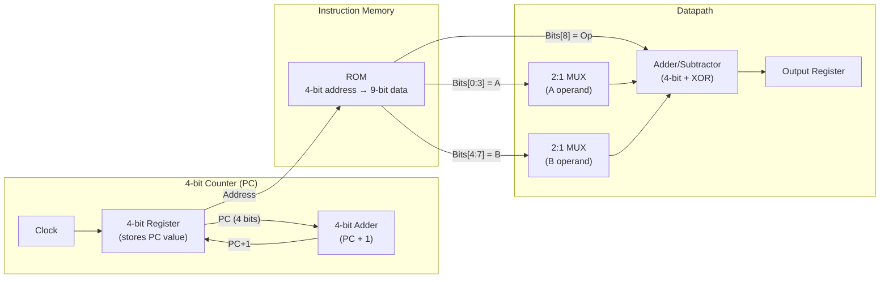
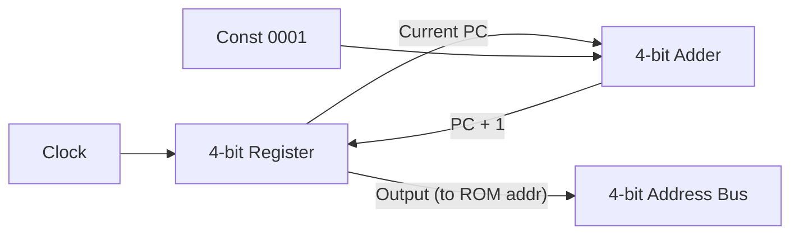
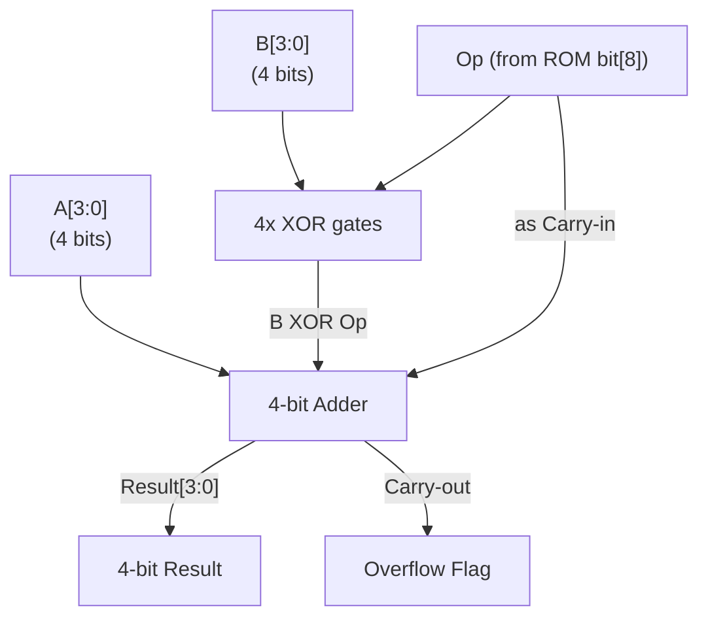
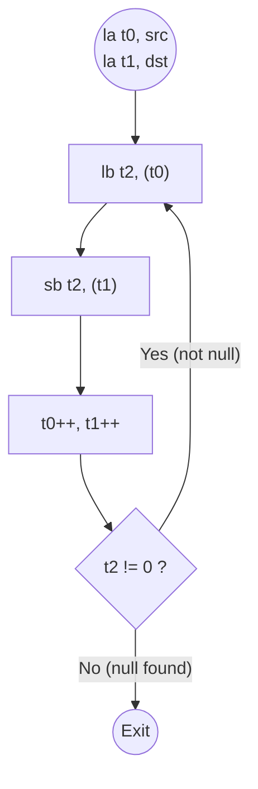
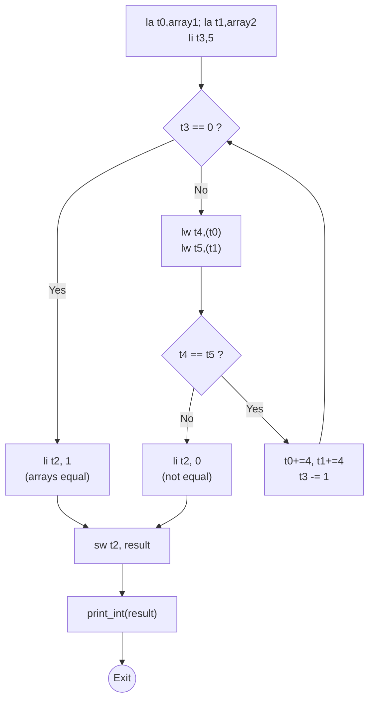

# COMP30660 计算机体系结构 -- 习题汇总

> **复习指南**：本文档汇总了 Worksheet 1-8 的所有题目与详细解答，涵盖数据表示、组合逻辑、微处理器构建、RARS 汇编编程、机器码编解码等核心内容。供期末考试复习使用。

---

## 目录

1. [Worksheet 1 -- 数据表示 (Data Representation)](#worksheet-1)
2. [Worksheet 2 -- 组合逻辑 (Combinational Logic)](#worksheet-2)
3. [Worksheet 4 -- 微型处理器 (Mini Processor)](#worksheet-4)
4. [Worksheet 5 -- RARS 入门 (RARS Introduction)](#worksheet-5)
5. [Worksheet 6 -- 汇编语言：字符串 (Assembly -- Strings)](#worksheet-6)
6. [Worksheet 7 -- 汇编语言：数组与子程序 (Assembly -- Arrays & Subroutines)](#worksheet-7)
7. [Worksheet 8 -- 机器码编码/解码 (Machine Code Encoding/Decoding)](#worksheet-8)
8. [解题技巧汇总](#tips)

---

## Worksheet 1 -- 数据表示 (Data Representation) {#worksheet-1}

本章共 **26 题**，涵盖进制转换、位宽概念、无符号/有符号运算、定点数/浮点数、以及 ASCII 编码。

---

### Q1：二进制转十进制 (Binary to Decimal)

**题目**：将二进制数 `10110110_2` 转换为十进制。

**解答**：

$$10110110_2 = 1 \times 2^7 + 0 \times 2^6 + 1 \times 2^5 + 1 \times 2^4 + 0 \times 2^3 + 1 \times 2^2 + 1 \times 2^1 + 0 \times 2^0$$

$$= 128 + 0 + 32 + 16 + 0 + 4 + 2 + 0 = 182_{10}$$

**答案**：`182`

---

### Q2：十进制转二进制 (Decimal to Binary)

**题目**：将十进制数 `217` 转换为 8-bit 二进制。

**解答** -- 短除法（连续除以 2，记录余数）：

| 除法 | 商 | 余数 |
|-------|---------|----------|
| 217 / 2 | 108 | 1 (LSB) |
| 108 / 2 | 54 | 0 |
| 54 / 2 | 27 | 0 |
| 27 / 2 | 13 | 1 |
| 13 / 2 | 6 | 1 |
| 6 / 2 | 3 | 0 |
| 3 / 2 | 1 | 1 |
| 1 / 2 | 0 | 1 (MSB) |

从下往上读余数：`11011001_2`

验证：$128+64+0+16+8+0+0+1 = 217$ ✓

**答案**：`11011001_2`

---

### Q3：二进制转十六进制 (Binary to Hex)

**题目**：将 `10111010_2` 转换为十六进制。

**解答**：从右往左每 4 bit 一组：

```
1011 1010
  ↓    ↓
  B    A
```

- `1011` = 8+0+2+1 = 11 = `B`
- `1010` = 8+0+2+0 = 10 = `A`

**答案**：`0xBA`

---

### Q4：十六进制转二进制 (Hex to Binary)

**题目**：将 `0x3F5` 转换为二进制。

**解答**：每位 hex 展开为 4 bit：

- `3` = `0011`
- `F` (15) = `1111`
- `5` = `0101`

拼接：`0011 1111 0101`，即 `001111110101_2`

**答案**：`001111110101_2`（或省略前导零：`1111110101_2`）

---

### Q5：十六进制转十进制 (Hex to Decimal)

**题目**：将 `0x3F5` 转换为十进制。

**解答**：

$$0x3F5 = 3 \times 16^2 + 15 \times 16^1 + 5 \times 16^0 = 3 \times 256 + 15 \times 16 + 5 = 768 + 240 + 5 = 1013_{10}$$

**答案**：`1013`

---

### Q6：八进制转十进制 (Octal to Decimal)

**题目**：将 `372_8` 转换为十进制。

**解答**：

$$372_8 = 3 \times 8^2 + 7 \times 8^1 + 2 \times 8^0 = 3 \times 64 + 7 \times 8 + 2 = 192 + 56 + 2 = 250_{10}$$

**答案**：`250`

---

### Q7：十进制转八进制 (Decimal to Octal)

**题目**：将十进制数 `156` 转换为八进制。

**解答** -- 短除法除以 8：

| 除法 | 商 | 余数 |
|-------|---------|----------|
| 156 / 8 | 19 | 4 |
| 19 / 8 | 2 | 3 |
| 2 / 8 | 0 | 2 |

从下往上读：`234_8`

验证：$2 \times 64 + 3 \times 8 + 4 = 128 + 24 + 4 = 156$ ✓

**答案**：`234_8`

---

### Q8：二进制转八进制 (Binary to Octal)

**题目**：将 `110110_2` 转换为八进制。

**解答**：从右往左每 3 bit 一组：

```
110 110
 ↓   ↓
 6   6
```

**答案**：`66_8`

---

### Q9：Bit、Byte、Nibble 概念

**题目**：解释 bit、byte、nibble 的含义，并比较其大小关系。

**解答**：

| 单位 | 定义 | 大小 |
|------|------|------|
| **bit** | 最小的数据单位，取值 0 或 1 | 1 bit |
| **nibble** | 半个字节 | 4 bits |
| **byte** | 一个字节 | 8 bits = 2 nibbles |

关系：**1 byte = 8 bits = 2 nibbles**

- 用 1 nibble 可以表示 $2^4 = 16$ 个不同值（正好一个 hex digit）
- 用 1 byte 可以表示 $2^8 = 256$ 个不同值

---

### Q10：LSB vs MSB

**题目**：解释 LSB 与 MSB 的区别。

**解答**：

| 术语 | 全称 | 含义 |
|------|------|------|
| **LSB** | Least Significant Bit | 最低有效位（最右边，权重 $2^0$） |
| **MSB** | Most Significant Bit | 最高有效位（最左边，权重 $2^{n-1}$） |

例如 `1011_2`：LSB = `1`（最右），MSB = `1`（最左）

在有符号数（two's complement）中，MSB 也是符号位：`0` 表示正数，`1` 表示负数。

---

### Q11：Byte 中的 bit 编号

**题目**：在一个 byte 中，bits 的编号范围是什么？

**解答**：

1 byte = 8 bits，编号为 **bit 0 到 bit 7**（从右向左）：

```
bit 7  bit 6  bit 5  bit 4  bit 3  bit 2  bit 1  bit 0
  ↓      ↓      ↓      ↓      ↓      ↓      ↓      ↓
 MSB                                                    LSB
 2^7    2^6    2^5    2^4    2^3    2^2    2^1    2^0
```

---

### Q12：无符号二进制加法 (Unsigned Binary Addition)

**题目**：计算 $35_{10} + 42_{10}$ 的 8-bit 无符号二进制加法。

**解答**：

**Step 1**：转二进制：
- $35_{10} = 00100011_2$
- $42_{10} = 00101010_2$

**Step 2**：逐位相加（进位标记在第三行）：

```
    00100011   (35)
  + 00101010   (42)
  -----------
  1 1    1     (进位)
    01001101   (77)
```

按位验证：bit0: 1+0=1(进位0), bit1: 1+1=0(进位1), bit3: 0+0+进位=1, bit5: 0+1=1, ...

**Step 3**：验证 $01001101_2 = 64+0+0+0+8+4+0+1 = 77_{10}$ ✓

**答案**：`01001101_2` = `77_{10}`

---

### Q13：无符号加法中的 Overflow

**题目**：判断 8-bit 无符号加法 `10101010_2 + 01100110_2` 是否产生 overflow。

**解答**：

**Step 1**：逐位相加：

```
    10101010   (170)
  + 01100110   (102)
  -----------
  1  11  11    (进位)
  1 00010000
     ↑
   多出一个进位bit到 bit 8
```

**Step 2**：结果需要 9 bits (`1 00010000`)，但由于我们只有 8-bit 存储位置，截断后得到 `00010000_2`。

**Step 3**：判断 overflow：
- 无符号加法 overflow 的条件：**结果超出 8-bit 表示范围 (0--255)**
- $170 + 102 = 272 > 255$，确实 overflow
- 硬件层面：**最高位产生进位 (carry out = 1)** 即表示无符号 overflow

**答案**：**有 overflow**。9-bit 精确结果 = $1 00010000_2 = 272_{10}$，8-bit 截断结果 = $00010000_2 = 16_{10}$

---

### Q14：无符号减法 (通过取反)

**题目**：解释无符号减法在二进制中如何实现。

**解答**：

无符号减法通过 **加补码** 实现：$A - B = A + (\sim B + 1)$，其中 $\sim B$ 是 B 的 bitwise NOT。

但实际上无符号二进制（非 two's complement）不使用补码。两种处理方式：

1. **直接借位法**：类似十进制笔算，不够减时向高位"借位"
2. **用 two's complement 体系**：$A - B = A + (-B)$，其中 $-B$ 用 two's complement 表示

在计算机中，减法统一使用 $A + (\overline{B} + 1)$ 的加法器实现。

---

### Q15：Signed Magnitude 表示法

**题目**：用 signed magnitude（原码）表示 $-43_{10}$（8-bit）。

**解答**：

**Step 1**：$43_{10}$ 的 7-bit 二进制：$43 = 32+8+2+1 = 0101011_2$

**Step 2**：符号位（bit 7）：负数用 `1`

**Step 3**：拼接：`1 0101011` → `10101011_2`

**答案**：`10101011_2`

**注意**：SIgned magnitude 有两个零：$+0 = 00000000_2$，$-0 = 10000000_2$，这是它的缺点。

---

### Q16：Two's Complement 转 Decimal

**题目**：将 8-bit two's complement `11011010` 转换为十进制。

**解答**：

**方法一** -- 符号位判断（MSB = `1` → 负数，先取补码再求值）：

**Step 1**：取 two's complement 求绝对值：
- 按位取反：`11011010` → `00100101`
- 加 1：`00100101 + 1 = 00100110`

**Step 2**：转十进制：$00100110_2 = 32+4+2 = 38_{10}$

**Step 3**：加上负号：$-38$

**方法二** -- 直接用公式（MSB 贡献为负）：$-128 + 64 + 0 + 16 + 8 + 0 + 2 + 0 = -38$

**答案**：`-38`

---

### Q17：Decimal 转 Two's Complement

**题目**：将 $-73$ 转换为 8-bit two's complement。

**解答**：

**Step 1**：$73_{10}$ 的 7-bit 二进制：$73 = 64+8+1 = 1001001_2$，补齐 8-bit：`01001001`

**Step 2**：取 two's complement：
- 按位取反：`01001001` → `10110110`
- 加 1：`10110110 + 1 = 10110111`

**答案**：`10110111_2`

**口诀**（快捷方法）：从右往左，保持连续的 0 以及第一个 1 不变，其余左边的 bits 全部取反。

$73 = 01001001$，从右：bit0=1（保留），bit1-2=00（保留），bit3=1（保留），bit4-6 及 bit7 全部取反 → `10110` + `111` → `10110111` ✓

---

### Q18：Two's Complement 加法

**题目**：计算 $-12 + 7$（8-bit two's complement），验证结果。

**解答**：

**Step 1**：转 two's complement：
- $-12$：$12 = 00001100_2$ → 取反 `11110011` → +1 → `11110100`
- $+7$：`00000111`

**Step 2**：加法：

```
    11110100   (-12)
  + 00000111   (+7)
  -----------
    11111011
```

**Step 3**：验证结果（MSB=`1` → 负数）：
- 取反：`11111011` → `00000100`
- +1：`00000101` = $5_{10}$ → $-5$

$-12 + 7 = -5$ ✓

**答案**：`11111011_2`（即 $-5$）

---

### Q19：Two's Complement 减法

**题目**：计算 $5 - 9$（8-bit two's complement）。

**解答**：

**Step 1**：$5 - 9 = 5 + (-9)$

**Step 2**：转 two's complement：
- $5$：`00000101`
- $-9$：$9 = 00001001_2$ → 取反 `11110110` → +1 → `11110111`

**Step 3**：加法：

```
    00000101   (5)
  + 11110111   (-9)
  -----------
    11111100
```

**Step 4**：验证（MSB=`1` → 负数）：
- 取反：`00000011` → +1 → `00000100` = $4$ → $-4$

$5 - 9 = -4$ ✓

**答案**：`11111100_2`（即 $-4$）

---

### Q20：Two's Complement Overflow 检测

**题目**：判断 $70 + 80$ 的 8-bit two's complement 加法是否 overflow。

**解答**：

```
    01000110   (70)
  + 01010000   (80)
  -----------
    10010110
```

**Overflow 检测规则**（two's complement）：

Overflow 发生在 **两个同号数相加得到异号结果** 时：
- 正数 (MSB=0) + 正数 (MSB=0) → 负数 (MSB=1) → **overflow！**

$70 + 80 = 150$，但 8-bit two's complement 范围是 $-128 \sim +127$，$150 > 127$，确实 overflow。

**硬件判断公式**：$Overflow = \text{carry\_into\_MSB} \oplus \text{carry\_out\_of\_MSB}$

这里 carry_into_MSB = 1（bit6 向 bit7 进位），carry_out_of_MSB = 0 → $1 \oplus 0 = 1$ → overflow

**答案**：**有 overflow**。正确结果 $150$ 超出 8-bit 有符号表示范围。

---

### Q21：Two's Complement 表示范围

**题目**：8-bit two's complement 能表示的数字范围是多少？为什么？

**解答**：

- 正数最大：`01111111_2` = $2^7 - 1 = 127$
- 负数最小：`10000000_2` = $-2^7 = -128$
- 总范围：**$-128 \sim +127$**

**为什么负数比正数多一个？**

因为 MSB 作符号位，正数占一半 $0 \sim 127$（`00000000` 到 `01111111`），负数占另一半 $-128 \sim -1$（`10000000` 到 `11111111`）。

0 只有一个（`00000000`），不像 signed magnitude 有 +0 和 -0。正数有 127 个，负数有 128 个，加上 0 共 256 个。

---

### Q22：Fixed-Point Binary（定点二进制）

**题目**：将 $12.75_{10}$ 转换为 **8-bit fixed-point** 格式（4-bit 整数部分 + 4-bit 小数部分，即 Q4.4）。

**解答**：

**整数部分** (4 bits)：$12_{10} = 1100_2$

**小数部分** (4 bits)：连乘法：
- $0.75 \times 2 = 1.5$ → 整数部分 `1`，剩余 $0.5$
- $0.5 \times 2 = 1.0$ → 整数部分 `1`，剩余 $0$，终止

小数部分：`.1100`

**拼接**：`1100.1100`

**验证**：$8+4+0+0 + 0.5+0.25+0+0 = 12.75$ ✓

**答案**：`11001100`（Q4.4 格式）

---

### Q23：Fixed-Point 转 Decimal

**题目**：将 Q4.4 fixed-point 二进制 `01100101` 转换为十进制。

**解答**：

拆分：整数部分 = `0110`（高 4 bits），小数部分 = `0101`（低 4 bits）

- 整数：$0110_2 = 4+2 = 6$
- 小数：$0101_2$ → bit 位权分别为 $\frac{1}{2}, \frac{1}{4}, \frac{1}{8}, \frac{1}{16}$
  - $0 \times \frac{1}{2} + 1 \times \frac{1}{4} + 0 \times \frac{1}{8} + 1 \times \frac{1}{16} = 0 + 0.25 + 0 + 0.0625 = 0.3125$

**答案**：$6.3125_{10}$

---

### Q24：Floating-Point -- Hex 转 Decimal（类似 IEEE 754 简化版）

**题目**：将 16-bit floating-point 表示 `0x4A60` 转换为十进制。假设格式为：bit15 符号位，bits[14:10] 指数（5-bit excess-15），bits[9:0] 尾数（10-bit，隐含 1）。

**解答**：

**Step 1**：Hex 转 Binary：
`0x4A60` = `0100 1010 0110 0000`

**Step 2**：拆分字段：

| 字段 | Bits | 值 | 含义 |
|------|------|-----|------|
| Sign | bit15 = 0 | 0 | 正数 |
| Exponent | bits[14:10] = `10010` = 18 | 18 | excess-15, 真指数 = 18-15 = 3 |
| Mantissa | bits[9:0] = `1001100000` | 0.59375 | 隐含 1，即 1.59375 |

**Step 3**：计算值：

$$\text{Value} = (-1)^0 \times 1.59375 \times 2^3 = 1.59375 \times 8 = 12.75$$

**答案**：$12.75$（正好和我们 Q22 的定点数结果一样）

---

### Q25：Floating-Point -- Decimal 转 Hex

**题目**：将 $-5.25$ 转换为与 Q24 相同格式的 16-bit floating-point hex 表示。

**解答**：

**Step 1**：规范化：
$-5.25 = -1 \times 5.25$

**Step 2**：将 $5.25$ 转为二进制：$5.25_{10} = 101.01_2$（整数 5=101，小数 0.25=.01）

**Step 3**：科学计数法（小数点左移到小数点前只有一位）：
$101.01_2 = 1.0101 \times 2^2$

- 指数真值 = 2
- excess-15 编码：$2 + 15 = 17 = 10001_2$（5 bits）

**Step 4**：尾数（去掉隐含的 1）：`0101`，补齐 10-bit → `0101000000`

**Step 5**：组装：

| Sign (1) | Exponent (5) | Mantissa (10) |
|----------|-------------|---------------|
| 1 (负数) | 10001 | 0101000000 |

`1 10001 0101000000` → `1100 0101 0100 0000` → `0xC540`

**答案**：`0xC540`

---

### Q26：ASCII 编码

**题目**：(a) `A` 的 ASCII 码值是多少？(b) 给定 `a` = `0x61`，计算 `g` 的 ASCII 值。(c) 数字字符 `5` 的 ASCII 值是多少？

**解答**：

**(a)** `A` = `0x41` = `65_{10}`

**(b)** `a` = `0x61`，则 `g` 在字母表中后移 6 位：
`0x61 + 6 = 0x67`（或 $97 + 6 = 103_{10}$）

**(c)** `5` = `0x35` = `53_{10}`（数字字符从 `0`=`0x30` 开始，`5` = `0x30 + 5`）

**常用 ASCII 速查**：

| 字符 | Hex | Dec |
|------|-----|-----|
| `0` | 0x30 | 48 |
| `9` | 0x39 | 57 |
| `A` | 0x41 | 65 |
| `Z` | 0x5A | 90 |
| `a` | 0x61 | 97 |
| `z` | 0x7A | 122 |
| Space | 0x20 | 32 |
| NUL (空终止符) | 0x00 | 0 |
| NL (换行) | 0x0A | 10 |

**关键规律**：
- 大写字母 + 32 = 对应的小写字母（如 `A` = 65, `a` = 97, 差 32）
- 大小写转换：大写 `A`-`Z` = `0x41`-`0x5A`，小写 `a`-`z` = `0x61`-`0x7A`，差 `0x20` = 32

---

## Worksheet 2 -- 组合逻辑 (Combinational Logic) {#worksheet-2}

本章共 **10 题**，涵盖真值表、时序图、电路图、布尔表达式、以及 Logisim 实现。

---

### Q1：从规格说明写真值表

**题目**：设计一个投票电路：3 个输入 (A, B, C)，当多数（>=2 个）输入为 1 时，输出 F = 1。写出真值表。

**解答**：

| A | B | C | F | 解释 |
|---|---|----|-----|
| 0 | 0 | 0 | 0 | 0 个 1 |
| 0 | 0 | 1 | 0 | 1 个 1 |
| 0 | 1 | 0 | 0 | 1 个 1 |
| 0 | 1 | 1 | 1 | 2 个 1 ✓ |
| 1 | 0 | 0 | 0 | 1 个 1 |
| 1 | 0 | 1 | 1 | 2 个 1 ✓ |
| 1 | 1 | 0 | 1 | 2 个 1 ✓ |
| 1 | 1 | 1 | 1 | 3 个 1 ✓ |

---

### Q2：从真值表推导 Boolean 表达式

**题目**：基于 Q1 的真值表，写出 F 的 Boolean 表达式（SOP 形式）。

**解答**：

**SOP (Sum of Products)** -- 列出所有 F=1 的 minterm：

| 行 | A B C | Minterm |
|----|-------|---------|
| 3 | 0 1 1 | $\overline{A}BC$ |
| 5 | 1 0 1 | $A\overline{B}C$ |
| 6 | 1 1 0 | $AB\overline{C}$ |
| 7 | 1 1 1 | $ABC$ |

$$F = \overline{A}BC + A\overline{B}C + AB\overline{C} + ABC$$

**简化后**：
$$F = AB + AC + BC$$

即：任意两个为 1 时输出 1。

---

### Q3：绘制电路图

**题目**：根据 $F = AB + AC + BC$ 画出 AND-OR 电路图（使用 2-input AND 和 3-input OR）。

**解答**：

```
 A ──────┬──── AND ──── A·B ──────┐
         │                         │
 B ──────┴────┐                    │
              │                    │
 A ──────┬──── AND ──── A·C ──────┤
         │                         │
 C ──────┴────┐                    ├── OR ─── F
              │                    │
 B ──────┬──── AND ──── B·C ──────┘
         │
 C ──────┘
```

电路结构：3 个 2-input AND gate + 1 个 3-input OR gate。

---

### Q4：绘制 Timing Diagram

**题目**：给定输入波形 A、B、C，画出 F 的 timing diagram（$F = AB + AC + BC$）。

假设以下输入波形：

```
A: ___─___─___─___─  (alternating)
B: __──__──__──__──  (double period)
C: _────_────_────_  (quadruple period)
```

**解答**：

根据 $F = AB + AC + BC$（多数投票），F 在每两个或更多输入为高的时段输出高电平。

```
Time: 0    1    2    3    4    5    6    7    8
A:    ─────┐    ┌────┐    ┌────┐    ┌────┐
           │    │    │    │    │    │    │
B:    ──────────┐    ┌──────────┐    ┌───
                │    │          │    │
C:    ───────────────┐         ┌────────────
                     │         │
F:    ─────┐    ┌────┐    ┌──────────┐
           │    │    │    │          │
```

**关键规则**：F 仅在 $\ge 2$ 个输入同时为高时为高。逐一检查每个时间段即可。

---

### Q5：Boolean 表达式化简（代数法）

**题目**：化简 $F = \overline{A}B + A\overline{B} + AB$

**解答**：

识别：$\overline{A}B + AB = B(\overline{A} + A) = B$ （因 $\overline{A}+A=1$）
$A\overline{B} + AB = A(\overline{B} + B) = A$

因此：
$$F = \overline{A}B + A\overline{B} + AB = \overline{A}B + AB + A\overline{B} = B + A\overline{B}$$

实际上这就是 XOR + AND：$F = A\overline{B} + \overline{A}B + AB$

简化还可以写成：$F = A + B$（因为 $AB$ 被 $A$ 和 $B$ 分别包含）

验证：$\overline{A}B + A\overline{B} + AB = \overline{A}B + A(\overline{B}+B) = \overline{A}B + A \neq A+B$？

重新检查：
$$\overline{A}B + A\overline{B} + AB = \overline{A}B + A(\overline{B} + B) = \overline{A}B + A$$

而 $A + \overline{A}B = A + B$（吸收律：$X + \overline{X}Y = X + Y$）

**最终答案**：$F = A + B$（即 OR gate）

---

### Q6：用 NAND 实现任意逻辑

**题目**：只用 2-input NAND gates 实现 function $F = AB + C$

**解答**：

NAND 是 universal gate。用 DeMorgan 定律转换：

$$F = AB + C = \overline{\overline{AB + C}} = \overline{\overline{AB} \cdot \overline{C}}$$

**电路连接**：
1. NAND1：输入 A, B → 输出 $\overline{AB}$
2. NAND2：输入 C, C → 输出 $\overline{C}$（NAND 当 NOT 用）
3. NAND3：输入 $\overline{AB}$, $\overline{C}$ → 输出 $\overline{\overline{AB} \cdot \overline{C}} = AB+C$ ✓

---

### Q7：多路复用器 (Multiplexer) 实现

**题目**：用 4-to-1 MUX 实现 $F(A,B,C) = \sum m(1,2,4,7)$

**解答**：

4-to-1 MUX 有 2 个 select lines（S1, S0）和 4 个 data inputs（D0-D3）。

选 A、B 作为 select，C 控制 data inputs：

| S1(A) | S0(B) | Minterms 对应 C=0,1 | D 输入 |
|-------|-------|---------------------|--------|
| 0 | 0 | m0, m1 → F(0,0,C) | D0 = C |
| 0 | 1 | m2, m3 → F(0,1,C) | D1 = $\overline{C}$ |
| 1 | 0 | m4, m5 → F(1,0,C) | D2 = $\overline{C}$ |
| 1 | 1 | m6, m7 → F(1,1,C) | D3 = C |

- D0 (A=0,B=0)：需要 F=1 在 $C=1$ (m1)，F=0 在 $C=0$ (m0) → D0 = C
- D1 (A=0,B=1)：需要 F=1 在 $C=0$ (m2)，F=0 在 $C=1$ (m3) → D1 = $\overline{C}$
- D2 (A=1,B=0)：需要 F=1 在 $C=0$ (m4)，F=0 在 $C=1$ (m5) → D2 = $\overline{C}$
- D3 (A=1,B=1)：需要 F=1 在 $C=1$ (m7)，F=0 在 $C=0$ (m6) → D3 = C

---

### Q8：Decoder 的应用

**题目**：用 3-to-8 decoder 和 OR gate 实现 $F(A,B,C) = \sum m(1,3,5,7)$

**解答**：

解释：minterms 1,3,5,7 对应所有奇数（LSB = C = 1）。

用 3-to-8 decoder + 4-input OR gate：
- Decoder 的输入 A,B,C（地址），输出 D0--D7（每个对应一个 minterm，仅那个地址有效时输出 1）
- OR gate 输入：D1, D3, D5, D7（即 F=1 的 minterm 们）
- OR 输出 = F

实际上 $F = C$（因为 m1+m3+m5+m7 = 所有 C=1 的情况）

---

### Q9：Karnaugh Map 化简

**题目**：用 K-map 化简 $F(A,B,C) = \sum m(0,2,4,6)$

**解答**：

```
     BC
A    00  01  11  10
0    1   0   0   1
1    1   0   0   1
```

只圈 C=0 的那一列（m0,m2,m4,m6 都在 C=0）：

$$F = \overline{C}$$

即：仅当 C=0 时 F=1。

---

### Q10：Logisim 实现

**题目**：在 Logisim 中实现 Q1 的投票电路，并验证真值表。

**解答**：

**步骤**：
1. 放置 3 个 Pin（Input）命名为 A, B, C
2. 放置 3 个 2-input AND gate
3. 连接：AND1 ← A,B；AND2 ← A,C；AND3 ← B,C
4. 放置 1 个 3-input OR gate，输入来自三个 AND 的输出
5. 放置 1 个 Pin（Output）命名为 F，连接 OR 输出

**验证**：在 Logisim 中依次改变 A,B,C 的值（000→111），检查 F 是否符合真值表（Q1）。

---

## Worksheet 4 -- 微型处理器 (Mini Processor in Logisim) {#worksheet-4}

本章共 **4 题**，要求在 Logisim 中构建一个可执行 **add/sub** 指令的微型处理器。

---

### 处理器架构总览



---

### Q1：4-bit Counter（程序计数器）

**题目**：用 Register + Clock + Adder 构建一个 4-bit Counter。

**解答**：

**组件**：
- **4-bit Register**：存储当前 PC 值
- **4-bit Adder**：一个输入为 Register 输出，另一输入为常量 `0001`
- **Clock**：连接到 Register 的时钟输入端

**数据流**：



**工作原理**：每个时钟上升沿，Register 加载 `PC+1`，实现从 0 到 15 的循环计数。

---

### Q2：Instruction Memory（指令存储器 ROM）

**题目**：设计 ROM：4-bit 地址输入，9-bit 数据输出，存储至少 4 条指令。

**解答**：

**ROM 规格**：
- Address 宽度：4 bits（可寻址 $2^4 = 16$ 条指令）
- Data 宽度：9 bits（指令格式见 Q4）

**预编程指令示例**：

| Address (Hex) | 指令 (Binary 9-bit) | 含义 |
|---------------|---------------------|------|
| 0x0 | `0010 0011 0` | A=2, B=3, Op=0 → ADD 2+3 |
| 0x1 | `0100 0001 1` | A=4, B=1, Op=1 → SUB 4-1 |
| 0x2 | `0110 0101 0` | A=6, B=5, Op=0 → ADD 6+5 |
| 0x3 | `0000 0000 0` | NOP (or halt) |

在 Logisim 中直接用 ROM 组件，按地址依次填入上述 9-bit 值。

---

### Q3：Adder/Subtractor（加减法器）

**题目**：设计一个 Adder/Subtractor，可执行 4-bit two's complement 加法或减法。

**解答**：

**核心思想**：减法 = 加法 + two's complement：$A - B = A + (\overline{B} + 1)$

**电路设计**：



**工作方式**：

| Op | XOR 效果 | Carry-in | ADDER 计算 |
|----|---------|----------|------------|
| 0 (ADD) | B XOR 0 = **B** | 0 | A + B + 0 = **A + B** |
| 1 (SUB) | B XOR 1 = **~B** | 1 | A + ~B + 1 = **A - B** |

每条 4-bit XOR gate 的输入：B[i] 和 Op（Op 对所有 B bits 相同）。

---

### Q4：指令格式设计

**题目**：设计 9-bit 指令格式，并说明两条指令 add 和 sub 如何编码。

**解答**：

**指令格式（9 bits 总长）**：

```
Bit:  8    7  6  5  4    3  2  1  0
     [Op] [  B  addr  ] [  A  addr  ]
```

| 字段 | Bits | 描述 |
|------|------|------|
| **A** | bits[0:3] | 第一个操作数的值（4-bit two's complement） |
| **B** | bits[4:7] | 第二个操作数的值（4-bit two's complement） |
| **Op** | bit[8] | 操作码：0 = ADD (A+B), 1 = SUB (A-B) |

**编码示例**：

| 指令 | A (bits 0-3) | B (bits 4-7) | Op (bit 8) | 完整 9-bit |
|------|-------------|-------------|-----------|-----------|
| ADD 3 + 5 | `0011` | `0101` | `0` | `0 0101 0011` = `0x0A3` |
| SUB 7 - 2 | `0111` | `0010` | `1` | `1 0010 0111` = `0x127` |
| ADD (-1) + 4 | `1111` | `0100` | `0` | `0 0100 1111` = `0x09F` |

**处理器执行流程**（一个时钟周期）：

1. PC 输出当前地址 → ROM
2. ROM 输出 9-bit 指令
3. bits[0:3] (A) → Adder/Subtractor 的 A 输入
4. bits[4:7] (B) → XOR gates 的 B 输入
5. bit[8] (Op) → XOR 控制 + Adder carry-in
6. Adder/Subtractor 计算 Result
7. Result → Output Register
8. 下一个时钟沿：PC ← PC+1

---

## Worksheet 5 -- RARS 入门 (RARS Introduction) {#worksheet-5}

本章介绍 RARS (RISC-V Assembler and Runtime Simulator) 的基本使用。

---

### Q1：安装 RARS 和 JRE

**题目**：下载并安装 RARS 和 Java Runtime Environment (JRE)。

**解答**：

1. 下载 RARS：https://github.com/TheThirdOne/rars/releases
2. 确保安装 JRE 8+：`java -version` 验证
3. 运行：`java -jar rars.jar`

---

### Q2：分析反转数组程序

**题目**：分析下面程序的每条指令。

```asm
.data
d_in:   .word 1,2,3
d_out:  .word 0,0,0

.text
.globl _start
_start: la t0, d_in
        la t1, d_out
        lw t2, 8(t0)
        sw t2, 0(t1)
        lw t2, 4(t0)
        sw t2, 4(t1)
        lw t2, 0(t0)
        sw t2, 8(t1)
        li a7, 10
        ecall
```

**解答**：

**数据段分析**：

```
地址         标签      值
0x10010000   d_in     .word 1      # 第一个元素
0x10010004            .word 2      # 第二个元素
0x10010008            .word 3      # 第三个元素
0x1001000C   d_out    .word 0      # 输出[0]
0x10010010            .word 0      # 输出[1]
0x10010014            .word 0      # 输出[2]
```

**逐条指令分析**：

| 行号 | 指令 | 操作 | 寄存器变化 |
|------|------|------|------------|
| 1 | `la t0, d_in` | 将 d_in 地址加载到 t0 | t0 = 0x10010000 |
| 2 | `la t1, d_out` | 将 d_out 地址加载到 t1 | t1 = 0x1001000C |
| 3 | `lw t2, 8(t0)` | 从地址 t0+8 加载字 → d_in[2]=3 | t2 = 3 |
| 4 | `sw t2, 0(t1)` | 将 t2 存入 t1+0 → d_out[0]=3 | 内存[0x1001000C] = 3 |
| 5 | `lw t2, 4(t0)` | 从地址 t0+4 加载字 → d_in[1]=2 | t2 = 2 |
| 6 | `sw t2, 4(t1)` | 将 t2 存入 t1+4 → d_out[1]=2 | 内存[0x10010010] = 2 |
| 7 | `lw t2, 0(t0)` | 从地址 t0+0 加载字 → d_in[0]=1 | t2 = 1 |
| 8 | `sw t2, 8(t1)` | 将 t2 存入 t1+8 → d_out[2]=1 | 内存[0x10010014] = 1 |
| 9 | `li a7, 10` | 设置退出系统调用号 | a7 = 10 |
| 10 | `ecall` | 触发环境调用（退出程序） | 程序终止 |

**结果**：d_out = {3, 2, 1}（d_in 的反转）

**`la` 伪指令展开**：
`la t0, d_in` 会被汇编器展开为两条实际指令（因为 32-bit 地址不能编码在一条 32-bit 指令中）：
```asm
auipc t0, 0x10010     # 将 PC+0x10010000 的高 20 位加载到 t0
addi  t0, t0, 0       # 加上低 12 位
```

**`lw` 机器码**：
`lw t2, 8(t0)` 的 I-type 格式：
- opcode: `0000011` (load)
- funct3: `010` (word)
- rs1: `00101` (t0 = x5)
- rd: `00111` (t2 = x7)
- imm: `000000001000` (offset = 8)
- 完整 32-bit: `0x0082A303`

---

### Q3：反转数组程序（w5q3.asm）

**题目**：编写并运行 w5q3.asm -- 将数组 `d_in: 1,2,3` 反转到 `d_out: 3,2,1`。

**解答**：

程序代码与 Q2 完全相同（见上）。这是题目给定的解法。

**执行步骤**（RARS 中）：
1. Assemble (F3)
2. 观察 Data Segment 确认 d_in 和 d_out 的初始值
3. Run (F5) 或 Step (F7) 逐条执行
4. 观察 Register 窗口（t0, t1, t2 的变化）
5. 检查 Data Segment：d_out 最终应为 {3, 2, 1}

---

### Q4：数组元素修改（w5q4.asm）

**题目**：编写程序：将 array1 的所有字加 2，将 array2 的所有字减 2。

```asm
.data
array1: .word 1, 2
array2: .word 10, 20

.text
.globl _start
_start:
    # --- 处理 array1[0]: 1 + 2 = 3 ---
    la t0, array1
    lw t1, 0(t0)
    addi t1, t1, 2
    sw t1, 0(t0)

    # --- 处理 array1[1]: 2 + 2 = 4 ---
    lw t1, 4(t0)
    addi t1, t1, 2
    sw t1, 4(t0)

    # --- 处理 array2[0]: 10 - 2 = 8 ---
    la t0, array2
    lw t1, 0(t0)
    addi t1, t1, -2
    sw t1, 0(t0)

    # --- 处理 array2[1]: 20 - 2 = 18 ---
    lw t1, 4(t0)
    addi t1, t1, -2
    sw t1, 4(t0)

    # --- 退出 ---
    li a7, 10
    ecall
```

**逐条详解**：

| 区块 | 指令序列 | 效果 |
|------|---------|------|
| array1[0] | la→lw→addi 2→sw | 内存[array1+0]: 1→3 |
| array1[1] | lw→addi 2→sw (t0 仍指向 array1) | 内存[array1+4]: 2→4 |
| array2[0] | la 重新加载→lw→addi -2→sw | 内存[array2+0]: 10→8 |
| array2[1] | lw→addi -2→sw | 内存[array2+4]: 20→18 |

**最终结果**：array1 = {3, 4}，array2 = {8, 18}

**注意**：
- `addi t1, t1, -2` 等价于 `addi t1, t1, 0xFFE`（-2 的 12-bit 补码）
- t0 重用于指向不同数组，先用完 array1 再加载 array2 地址
- 为什么要重新 la？因为这个版本用了直接寻址，没有自动递增

---

## Worksheet 6 -- 汇编语言：字符串 (Assembly -- Strings) {#worksheet-6}

本章共 **4 题**，涵盖字符串的逐字节拷贝、循环控制、大小写转换、以及系统调用打印。

---

### Q1：无循环字符串拷贝 (w6q1.asm)

**题目**：不用循环，将源字符串 "Chris" 拷贝到目标位置。

**解答**：

```asm
.data
src:    .asciiz "Chris"
dst:    .space  6               # 为 "Chris\0" 预留 6 bytes

.text
.globl _start
_start:
    # 加载地址
    la   t0, src               # t0 = src 地址
    la   t1, dst               # t1 = dst 地址

    # 逐个字节拷贝
    lb   t2, 0(t0)             # t2 = src[0] = 'C'
    sb   t2, 0(t1)             # dst[0] = 'C'

    lb   t2, 1(t0)             # t2 = src[1] = 'h'
    sb   t2, 1(t1)             # dst[1] = 'h'

    lb   t2, 2(t0)             # t2 = src[2] = 'r'
    sb   t2, 2(t1)             # dst[2] = 'r'

    lb   t2, 3(t0)             # t2 = src[3] = 'i'
    sb   t2, 3(t1)             # dst[3] = 'i'

    lb   t2, 4(t0)             # t2 = src[4] = 's'
    sb   t2, 4(t1)             # dst[4] = 's'

    lb   t2, 5(t0)             # t2 = src[5] = '\0' (null)
    sb   t2, 5(t1)             # dst[5] = '\0'

    # 退出
    li   a7, 10
    ecall
```

**逐行解释**：

| 指令 | 说明 |
|------|------|
| `lb t2, offset(t0)` | **L**oad **B**yte：从 t0+offset 地址读取 1 byte，存入 t2 低 8 位，符号扩展 |
| `sb t2, offset(t1)` | **S**tore **B**yte：将 t2 低 8 位存入 t1+offset 地址 |

**关键**：字符串以 null terminator `\0` (ASCII 0x00) 结尾，必须一并拷贝。

---

### Q2：循环字符串拷贝 (w6q2.asm)

**题目**：使用循环（while not null terminator）将 "Chris" 拷贝到目标。

**解答**：

```asm
.data
src:    .asciiz "Chris"
dst:    .space  6

.text
.globl _start
_start:
    la   t0, src               # t0 = 源指针
    la   t1, dst               # t1 = 目标指针

loop:
    lb   t2, 0(t0)             # t2 = *src (读取当前字符)
    sb   t2, 0(t1)             # *dst = t2  (写入当前字符)
    addi t0, t0, 1             # src 指针前移
    addi t1, t1, 1             # dst 指针前移
    bne  t2, x0, loop          # 若 t2 != '\0'，继续循环

    # 退出
    li   a7, 10
    ecall
```

**逐行解释**：

| 指令 | 说明 |
|------|------|
| `lb t2, 0(t0)` | 每次循环读一个 byte |
| `sb t2, 0(t1)` | 写一个 byte（包括最后的 \0） |
| `addi t0, t0, 1` | 指针递增（字符是 1 byte） |
| `bne t2, x0, loop` | x0 恒为 0，当 t2 == 0 (null) 时退出，否则跳回 loop |

**流程图**：



---

### Q3：拷贝 + 转大写 (w6q3.asm)

**题目**：拷贝字符串，同时将小写字母转换为大写（ASCII 差 32）。

**关键知识**：
- `'a'` = 0x61 = 97, `'z'` = 0x7A = 122
- `'A'` = 0x41 = 65
- 转换：`uppercase = lowercase - 32`（即 `lowercase - 0x20`）

**解答**：

```asm
.data
src:    .asciiz "Chris"
dst:    .space  6

.text
.globl _start
_start:
    la   t0, src
    la   t1, dst

loop:
    lb   t2, 0(t0)             # t2 = 当前字符
    # --- 检查是否需要转大写 ---
    li   t3, 'a'               # t3 = 0x61 = 97
    blt  t2, t3, skip          # 若 t2 < 'a'，跳过转换
    li   t3, 'z'               # t3 = 0x7A = 122
    bgt  t2, t3, skip          # 若 t2 > 'z'，跳过转换
    # --- 在范围内：小写转大写 ---
    addi t2, t2, -32           # 减去 32 (0x20)
skip:
    sb   t2, 0(t1)             # 存储字符（可能已转换）
    addi t0, t0, 1
    addi t1, t1, 1
    bne  t2, x0, loop

    li   a7, 10
    ecall
```

**逐行解释**：

| 指令 | 说明 |
|------|------|
| `li t3, 'a'` | 加载 'a' 的 ASCII 值 97 到 t3 |
| `blt t2, t3, skip` | 若 t2 < 'a'，说明不是小写字母，跳过转换 |
| `li t3, 'z'` | 加载 'z' 的 ASCII 值 122 到 t3 |
| `bgt t2, t3, skip` | 若 t2 > 'z'，说明不是小写字母，跳过转换 |
| `addi t2, t2, -32` | 范围内的小写字母 → 减去 32 转为大写 |

**转换逻辑判断范围**：只处理 `'a'--'z'`（97--122）范围内的字符，其他字符（大写、数字、符号、null）保持不变。

**结果**："Chris" → "CHRIS"

---

### Q4：拷贝 + 转大写 + 打印 (w6q4.asm)

**题目**：在 Q3 基础上，使用 syscall 4 打印源字符串和目标字符串。

**解答**：

```asm
.data
src:    .asciiz "Chris"
dst:    .space  6
newline:.asciiz "\n"

.text
.globl _start
_start:
    la   t0, src
    la   t1, dst

    # --- 拷贝 + 转大写 (同 Q3) ---
loop:
    lb   t2, 0(t0)
    li   t3, 'a'
    blt  t2, t3, skip
    li   t3, 'z'
    bgt  t2, t3, skip
    addi t2, t2, -32
skip:
    sb   t2, 0(t1)
    addi t0, t0, 1
    addi t1, t1, 1
    bne  t2, x0, loop

    # --- 打印源字符串 ---
    li   a7, 4                 # syscall 4 = print_string
    la   a0, src               # a0 = 字符串地址
    ecall

    # --- 打印换行 ---
    li   a7, 4
    la   a0, newline
    ecall

    # --- 打印目标字符串 ---
    li   a7, 4
    la   a0, dst
    ecall

    # --- 退出 ---
    li   a7, 10
    ecall
```

**关键 Syscall 说明**：

| Syscall 号 (a7) | 功能 | 参数 | 说明 |
|-----------------|------|------|------|
| **1** | print_int | a0 = 整数 | 打印寄存器中的整数 |
| **4** | print_string | a0 = 字符串地址 | 打印以 null 结尾的字符串 |
| **10** | exit | 无 | 终止程序 |

**输出效果**（RARS 控制台）：

```
Chris
CHRIS
```

---

## Worksheet 7 -- 汇编语言：数组与子程序 (Assembly -- Arrays & Subroutines) {#worksheet-7}

本章共 **2 题**，涵盖数组比较以及子程序（subroutine）的编写与调用。

---

### Q1：比较两个数组 (w7q1.asm)

**题目**：比较两个长度为 5 的数组（array1 和 array2），若完全相同则 result=1，否则 result=0。打印 result。

**解答**：

```asm
.data
array1: .word 1, 2, 3, 4, 5
array2: .word 1, 2, 3, 4, 5     # 相同 → result=1
result: .word 0

.text
.globl _start
_start:
    la   t0, array1            # t0 = array1 指针
    la   t1, array2            # t1 = array2 指针
    li   t3, 5                 # t3 = 计数器 (长度)

compare_loop:
    beqz t3, arrays_equal      # 若 t3==0，所有元素匹配
    lw   t4, 0(t0)             # t4 = array1[i]
    lw   t5, 0(t1)             # t5 = array2[i]
    bne  t4, t5, not_equal     # 不匹配 → 跳转
    addi t0, t0, 4             # 前进 4 bytes (一个 word)
    addi t1, t1, 4
    addi t3, t3, -1            # 计数器减 1
    j    compare_loop

arrays_equal:
    li   t2, 1                 # t2 = 1 (True)
    j    store_result

not_equal:
    li   t2, 0                 # t2 = 0 (False)

store_result:
    la   t6, result
    sw   t2, 0(t6)             # result = t2

    # --- 打印 result ---
    li   a7, 1                 # syscall 1 = print_int
    mv   a0, t2                # a0 = result
    ecall

    # --- 退出 ---
    li   a7, 10
    ecall
```

**逐行解释**：

| 指令 | 说明 |
|------|------|
| `beqz t3, arrays_equal` | 若计数器归零（所有元素检查完毕），跳转 |
| `lw t4, 0(t0)` | 从 array1 读取当前 word |
| `bne t4, t5, not_equal` | 发现不匹配时立即跳转，设置 result=0 |
| `addi t0, t0, 4` | 指针递增 **4 bytes**（word 是 4 bytes，不同于字符串的 1 byte！） |
| `j compare_loop` | 无条件跳回循环开始 |

**流程图**：



---

### Q2：用子程序比较数组 (w7q2.asm)

**题目**：将 Q1 的比较逻辑封装为子程序（subroutine）。main 调用子程序，子程序通过 a0--a2 接收数组地址和长度，在 a0 中返回比较结果。

**解答**：

```asm
.data
array1: .word 1, 2, 3, 4, 5
array2: .word 1, 2, 3, 7, 5     # 不相同 → result=0
result: .word 0

.text
.globl _start
_start:
    # --- 设置子程序参数 ---
    la   a0, array1            # a0 = array1 基地址
    la   a1, array2            # a1 = array2 基地址
    li   a2, 5                 # a2 = 数组长度

    # --- 调用子程序 ---
    jal  ra, compare_arrays    # ra ← PC+4, PC ← compare_arrays

    # --- 存储返回值 ---
    la   t0, result
    sw   a0, 0(t0)             # result = a0 (返回值)

    # --- 打印 ---
    li   a7, 1
    ecall                      # a0 仍是子程序返回值

    # --- 退出 ---
    li   a7, 10
    ecall

# ==========================================
# 子程序: compare_arrays
#   参数:
#     a0 = array1 基地址
#     a1 = array2 基地址
#     a2 = 数组长度 (字数量)
#   返回:
#     a0 = 1 (相同) 或 0 (不同)
# ==========================================
compare_arrays:
    mv   t0, a0                # t0 = array1 指针
    mv   t1, a1                # t1 = array2 指针
    mv   t3, a2                # t3 = 计数器

comp_loop:
    beqz t3, equal             # 所有元素检查完毕
    lw   t4, 0(t0)
    lw   t5, 0(t1)
    bne  t4, t5, not_equal
    addi t0, t0, 4
    addi t1, t1, 4
    addi t3, t3, -1
    j    comp_loop

equal:
    li   a0, 1                 # 返回值 = 1
    ret                        # jr ra (伪指令)

not_equal:
    li   a0, 0                 # 返回值 = 0
    ret                        # jr ra
```

**逐行解释**：

| 指令 | 说明 |
|------|------|
| `jal ra, compare_arrays` | **J**ump **A**nd **L**ink：将返回地址(PC+4)存入 ra，跳转到子程序 |
| `ret` | 伪指令，展开为 `jalr x0, ra, 0`：跳回 ra 中存储的地址 |

**RISC-V 调用约定 (Calling Convention)**：

| 寄存器 | 别名 | 用途 |
|--------|------|------|
| a0--a1 (x10--x11) | 函数参数/返回值 | a0=a1 用于传递前 2 个参数，a0 也用于返回值 |
| a2--a7 (x12--x17) | 函数参数 | 额外的函数参数 |
| ra (x1) | 返回地址 | `jal` 自动保存到 ra，`ret`/`jr ra` 用于返回 |
| t0--t6 (x5--x7, x28--x31) | 临时寄存器 | 子程序内可自由使用，调用者不期望保留 |
| s0--s11 (x8--x9, x18--x27) | 保存寄存器 | 子程序若使用必须先保存到栈，返回前恢复 |
| sp (x2) | 栈指针 | 指向当前栈顶 |

---

## Worksheet 8 -- 机器码编码/解码 (Machine Code Encoding/Decoding) {#worksheet-8}

本章共 **4 题**，涵盖手动汇编、RARS 验证、以及手动反汇编。

---

### RISC-V 指令格式速查

| 格式 | Bits 布局 | 指令类型 |
|------|-----------|---------|
| **R-type** | funct7[31:25] \| rs2[24:20] \| rs1[19:15] \| funct3[14:12] \| rd[11:7] \| opcode[6:0] | add, sub, and, or, xor, sll, srl, sra, slt, sltu |
| **I-type** | imm[31:20] \| rs1[19:15] \| funct3[14:12] \| rd[11:7] \| opcode[6:0] | addi, lw, lb, jalr, slli, srli |
| **S-type** | imm[11:5] \| rs2[24:20] \| rs1[19:15] \| funct3[14:12] \| imm[4:0] \| opcode[6:0] | sw, sb |
| **B-type** | imm[12\|10:5] \| rs2[24:20] \| rs1[19:15] \| funct3[14:12] \| imm[4:1\|11] \| opcode[6:0] | beq, bne, blt, bge |
| **U-type** | imm[31:12] \| rd[11:7] \| opcode[6:0] | lui, auipc |
| **J-type** | imm[20\|10:1\|11\|19:12] \| rd[11:7] \| opcode[6:0] | jal |

---

### 常用 Opcode 和 Funct 表

| 指令 | 格式 | opcode[6:0] | funct3[14:12] | funct7[31:25] |
|------|------|------------|--------------|--------------|
| `add` | R | 0110011 | 000 | 0000000 |
| `sub` | R | 0110011 | 000 | 0100000 |
| `lw` | I | 0000011 | 010 | -- (immediate) |
| `sw` | S | 0100011 | 010 | -- (immediate) |
| `addi` | I | 0010011 | 000 | -- (immediate) |
| `beq` | B | 1100011 | 000 | -- |
| `bne` | B | 1100011 | 001 | -- |
| `jal` | J | 1101111 | -- | -- |

---

### 寄存器编号表（部分）

| 寄存器 | ABI 名 | 编号 (x#) | 二进制 (5-bit) |
|--------|--------|----------|---------------|
| zero | x0 | 0 | 00000 |
| ra | x1 | 1 | 00001 |
| sp | x2 | 2 | 00010 |
| gp | x3 | 3 | 00011 |
| tp | x4 | 4 | 00100 |
| t0 | x5 | 5 | 00101 |
| t1 | x6 | 6 | 00110 |
| t2 | x7 | 7 | 00111 |
| s0/fp | x8 | 8 | 01000 |
| s1 | x9 | 9 | 01001 |
| a0 | x10 | 10 | 01010 |
| a1 | x11 | 11 | 01011 |
| a2 | x12 | 12 | 01100 |
| a3 | x13 | 13 | 01101 |
| a4 | x14 | 14 | 01110 |
| a5 | x15 | 15 | 01111 |
| a6 | x16 | 16 | 10000 |
| a7 | x17 | 17 | 10001 |
| s2 | x18 | 18 | 10010 |
| s3 | x19 | 19 | 10011 |
| s4 | x20 | 20 | 10100 |
| t3 | x28 | 28 | 11100 |
| t4 | x29 | 29 | 11101 |
| t5 | x30 | 30 | 11110 |
| t6 | x31 | 31 | 11111 |

---

### Q1：手动汇编 -- 将以下三条指令编码为 32-bit 机器码（十六进制）

**题目**：

```asm
lw t2, 4(t0)
add t3, t1, t2
sw t3, 8(t0)
```

**解答**：

---

#### 第 1 条：`lw t2, 4(t0)`

**Step 1**：识别指令格式
- `lw` 是 **I-type** 指令（load 操作）

**Step 2**：确定各字段值

| 字段 | 来源 | 值（二进制） | 说明 |
|------|------|------------|------|
| opcode | lw → load | `0000011` | 7 bits |
| rd | t2 = x7 | `00111` | 5 bits |
| funct3 | lw (word) | `010` | 3 bits |
| rs1 | t0 = x5 | `00101` | 5 bits |
| imm[11:0] | offset = 4 | `000000000100` | 12 bits |

**Step 3**：按位拼接

```
imm[31:20]        rs1[19:15]  funct3[14:12]  rd[11:7]    opcode[6:0]
000000000100      00101       010            00111       0000011
```

完整 32-bit：

```
0000 0000 0100 0010 1010 0011 1000 0011
```

**Step 4**：二进制 → 十六进制

```
0000 0000 0100 0010 1010 0011 1000 0011
  0    0    4    2    A    3    8    3
```

**答案**：`lw t2, 4(t0)` → **`0x0042A383`**

---

#### 第 2 条：`add t3, t1, t2`

**Step 1**：识别指令格式
- `add` 是 **R-type** 指令

**Step 2**：确定各字段值

| 字段 | 来源 | 值（二进制） | 说明 |
|------|------|------------|------|
| opcode | add → OP | `0110011` | 7 bits |
| rd | t3 = x28 | `11100` | 5 bits |
| funct3 | add | `000` | 3 bits |
| rs1 | t1 = x6 | `00110` | 5 bits |
| rs2 | t2 = x7 | `00111` | 5 bits |
| funct7 | add | `0000000` | 7 bits |

**Step 3**：按位拼接

```
funct7[31:25]  rs2[24:20]  rs1[19:15]  funct3[14:12]  rd[11:7]   opcode[6:0]
0000000        00111       00110       000            11100      0110011
```

完整 32-bit：

```
0000 0000 0111 0011 0000 1110 0011 0011
```

**Step 4**：二进制 → 十六进制

```
0000 0000 0111 0011 0000 1110 0011 0011
  0    0    7    3    0    E    3    3
```

**答案**：`add t3, t1, t2` → **`0x00730E33`**

---

#### 第 3 条：`sw t3, 8(t0)`

**Step 1**：识别指令格式
- `sw` 是 **S-type** 指令（store 操作，立即数拆分为两段）

**Step 2**：确定各字段值

| 字段 | 来源 | 值（二进制） | 说明 |
|------|------|------------|------|
| opcode | sw → STORE | `0100011` | 7 bits |
| funct3 | sw (word) | `010` | 3 bits |
| rs1 | t0 = x5 | `00101` | 5 bits (基址寄存器) |
| rs2 | t3 = x28 | `11100` | 5 bits (源数据寄存器) |
| imm[11:5] | offset=8 的高 7 位 | `0000000` | 7 bits |
| imm[4:0] | offset=8 的低 5 位 | `01000` | 5 bits |

**S-type 立即数拆分说明**（重点）：
- offset = 8 = `000000001000` (12-bit)
- imm[11:5] = `0000000`（高 7 位）
- imm[4:0] = `01000`（低 5 位）

**Step 3**：按位拼接

```
imm[11:5]  rs2[24:20]  rs1[19:15]  funct3[14:12]  imm[4:0]   opcode[6:0]
0000000    11100       00101       010            01000      0100011
```

完整 32-bit：

```
0000 0001 1100 0010 1010 0100 0010 0011
```

**Step 4**：二进制 → 十六进制

```
0000 0001 1100 0010 1010 0100 0010 0011
  0    1    C    2    A    4    2    3
```

**答案**：`sw t3, 8(t0)` → **`0x01C2A423`**

---

#### 汇编结果汇总

| 指令 | 格式 | 机器码 (Hex) |
|------|------|-------------|
| `lw t2, 4(t0)` | I-type | `0x0042A383` |
| `add t3, t1, t2` | R-type | `0x00730E33` |
| `sw t3, 8(t0)` | S-type | `0x01C2A423` |

---

### Q2：用 RARS 验证汇编结果

**题目**：在 RARS 中汇编以上三条指令，验证机器码是否与 Q1 手动计算结果一致。

**解答**：

1. 创建 `riscv1.asm` 文件，写入以下内容：

```asm
.text
.globl _start
_start:
    lw t2, 4(t0)
    add t3, t1, t2
    sw t3, 8(t0)
    li a7, 10
    ecall
```

2. 在 RARS 中汇编（F3）
3. 查看 **Text Segment** 窗口（F4），验证每条指令的 Code 列：

| Address | Code (Hex) | Basic | Source |
|---------|-----------|-------|--------|
| 0x00400000 | 0x0042A383 | lw t2, 4(t0) | ... |
| 0x00400004 | 0x00730E33 | add t3, t1, t2 | ... |
| 0x00400008 | 0x01C2A423 | sw t3, 8(t0) | ... |

在 RARS 中 Code 列显示的十六进制应与 Q1 的结果完全一致。

---

### Q3：手动反汇编 -- 将以下机器码解码为汇编指令

**题目**：反汇编以下三条机器码：

```
0x004fa303
0x406283b3
0x00a38e13
```

**解答**：

---

#### 第 1 条：`0x004FA303`

**Step 1**：十六进制 → 二进制

```
0    0    4    F    A    3    0    3
0000 0000 0100 1111 1010 0011 0000 0011
```

**Step 2**：按 I-type 格式拆分（先试 opcode 识别）

opcode[6:0] = `0000011` → **Load 指令**

```
imm[31:20]        rs1[19:15]  funct3[14:12]  rd[11:7]    opcode[6:0]
000000000100      11111       010            00110       0000011
```

**Step 3**：解码各字段

| 字段 | 二进制 | 十进制 | 含义 |
|------|--------|--------|------|
| opcode | `0000011` | -- | load |
| funct3 | `010` | -- | lw (word) |
| rd | `00110` | 6 | t1 |
| rs1 | `11111` | 31 | t6 |
| imm | `000000000100` | 4 | offset = 4 |

**Step 4**：写出汇编

$$0x004FA303 \rightarrow \texttt{lw t1, 4(t6)}$$

---

#### 第 2 条：`0x406283B3`

**Step 1**：十六进制 → 二进制

```
4    0    6    2    8    3    B    3
0100 0000 0110 0010 1000 0011 1011 0011
```

**Step 2**：opcode[6:0] = `0110011` → **R-type 指令**（OP）

```
funct7[31:25]  rs2[24:20]  rs1[19:15]  funct3[14:12]  rd[11:7]   opcode[6:0]
0100000        00101       10000       000            10111      0110011
```

**Step 3**：解码各字段

| 字段 | 二进制 | 十进制 | 含义 |
|------|--------|--------|------|
| opcode | `0110011` | -- | OP (R-type) |
| funct3 | `000` | -- | add/sub |
| funct7 | `0100000` | -- | sub (0x20) |
| rd | `10111` | 23 | s7 |
| rs1 | `10000` | 16 | a6 |
| rs2 | `00101` | 5 | t0 |

**注意**：funct7 = `0100000` + funct3 = `000` → **sub**（而不是 add，add 的 funct7 是 `0000000`）

**Step 4**：写出汇编

$$0x406283B3 \rightarrow \texttt{sub s7, a6, t0}$$

---

#### 第 3 条：`0x00A38E13`

**Step 1**：十六进制 → 二进制

```
0    0    A    3    8    E    1    3
0000 0000 1010 0011 1000 1110 0001 0011
```

**Step 2**：opcode[6:0] = `0010011` → **I-type 指令**（OP-IMM）

```
imm[31:20]        rs1[19:15]  funct3[14:12]  rd[11:7]    opcode[6:0]
000000001010      00111       000            11100       0010011
```

**Step 3**：解码各字段

| 字段 | 二进制 | 十进制 | 含义 |
|------|--------|--------|------|
| opcode | `0010011` | -- | OP-IMM |
| funct3 | `000` | -- | addi (funct3=000 for OP-IMM) |
| rd | `11100` | 28 | t3 |
| rs1 | `00111` | 7 | t2 |
| imm | `000000001010` | 10 | 立即数 = 10 |

**Step 4**：写出汇编

$$0x00A38E13 \rightarrow \texttt{addi t3, t2, 10}$$

---

#### 反汇编结果汇总

| 机器码 (Hex) | 汇编指令 | 格式 |
|-------------|---------|------|
| `0x004FA303` | `lw t1, 4(t6)` | I-type |
| `0x406283B3` | `sub s7, a6, t0` | R-type |
| `0x00A38E13` | `addi t3, t2, 10` | I-type |

---

### Q4：重新汇编验证反汇编结果

**题目**：将 Q3 反汇编得到的指令重新输入 RARS 汇编，检查机器码是否与原始一致。

**解答**：

创建验证程序：

```asm
.text
.globl _start
_start:
    lw   t1, 4(t6)
    sub  s7, a6, t0
    addi t3, t2, 10
```

在 RARS 中汇编，查看 Text Segment：

| Address | Code (Hex) | 是否匹配原始 |
|---------|-----------|------------|
| 0x00400000 | `0x004FA303` | ✓ 匹配 |
| 0x00400004 | `0x406283B3` | ✓ 匹配 |
| 0x00400008 | `0x00A38E13` | ✓ 匹配 |

**结论**：反汇编正确，三者完全匹配。

---

## 解题技巧汇总 {#tips}

### 1. 数据表示 (Worksheet 1)

| 技巧 | 说明 |
|------|------|
| **进制转换口诀** | 2→16：4 位一组；2→8：3 位一组；16→2：每位展开 4 bit；8→2：每位展开 3 bit |
| **Two's complement 取反快法** | 从右向左，保留连续的 0 和第一个 1，其余位全部取反 |
| **Two's complement overflow 判断** | 两个同号数相加得到异号结果 = overflow；或 $\text{carry\_in\_MSB} \oplus \text{carry\_out\_MSB} = 1$ |
| **Fixed-point 转换** | 整数部分用短除，小数部分用连乘。Qm.n 格式：m 位整数 + n 位小数 |
| **Floating-point 转换** | 先转二进制科学计数法，再编码：Sign + Excess-N Exponent + Mantissa（隐含 1） |
| **ASCII 大小写转换** | `uppercase = lowercase - 32` (0x20)；`'a'-'z'` 范围 0x61-0x7A |

---

### 2. 组合逻辑 (Worksheet 2)

| 技巧 | 说明 |
|------|------|
| **真值表 → SOP** | 列出所有输出=1 的行，每行写 minterm，全部 OR 起来 |
| **K-Map 化简法** | 画出 K-map，圈 1（每次圈 $2^n$ 个），写出最简 SOP |
| **MUX 实现任意函数** | 选 n-1 个变量做 select，剩下那个变量及其取反连入 data inputs |
| **NAND/NOR 万能性** | AND = NAND + NOT(NAND)；OR = NAND + NAND(NOT)；NOT = NAND(A,A) |
| **Timing Diagram 关键** | 组合逻辑无延迟假设下，输出随输入即时变化；一张图一张图地对时间轴检查 |

---

### 3. 微型处理器 (Worksheet 4)

| 技巧 | 说明 |
|------|------|
| **PC 计数器** | 标准模式：Register 存当前值 → +1 Adder → 下一周期写回 Register |
| **减法 = 加法 + 补码** | $A - B = A + \overline{B} + 1$，用 XOR gate 控制取反，Op 同时做 carry-in |
| **指令编码设计** | 设计指令时优先明确：操作码位置、操作数字段、操作数宽度、有无立即数 |
| **ROM 寻址** | ROM 地址来自 PC，ROM 输出解码为控制信号和数据路径选择 |

---

### 4. RISC-V 汇编编程 (Worksheet 5-7)

| 技巧 | 说明 |
|------|------|
| **字符串 vs 数组指针递增** | 字符串：`addi ptr, ptr, 1`（1 byte）；word 数组：`addi ptr, ptr, 4`（4 bytes） |
| **循环模式（while）** | `loop: lb ... ; 操作 ; addi ptr ; bne val, x0, loop` |
| **条件判断模式** | `bne t4, t5, not_equal`：发现不匹配立即跳出，不等的情况先处理 |
| **子程序（subroutine）** | 参数通过 a0--a7 传递，返回地址存在 ra，`jal ra, func` 调用，`ret` / `jr ra` 返回 |
| **伪指令展开** | `la` = `auipc + addi`；`li` 大立即数 = `lui + addi`；`ret` = `jalr x0, ra, 0` |
| **常用 syscall** | 1=print_int(a0), 4=print_string(a0=地址), 10=exit |

---

### 5. 机器码编解码 (Worksheet 8)

| 技巧 | 说明 |
|------|------|
| **6 步汇编法** | (1) 识别指令格式 (2) 查表确定各字段值 (3) 按格式拼接 32-bit (4) 每 4 bit 转 hex |
| **反汇编法** | (1) hex→binary (2) 取 opcode[6:0] 确定格式 (3) 按格式拆分字段 (4) 查寄存器表/立即数 |
| **opcode 识别优先级** | `0110011`→R-type, `0010011`→I-type(算数), `0000011`→I-type(load), `0100011`→S-type, `1100011`→B-type |
| **S-type 立即数拆分** | offset 12-bit 被拆成两段：`imm[11:5]` (bits[31:25]) 和 `imm[4:0]` (bits[11:7]) |
| **funct3 + funct7 区分 add/sub** | funct3 相同(=000)，funct7 不同：add=`0000000`, sub=`0100000` |
| **立即数符号扩展** | 12-bit 立即数在 I-type 中符号扩展到 32-bit；`addi rd, rs, -N` 的立即数 = $\text{2's complement}(-N)_{12bit}$ |

---

### 6. 通用考场技巧

| 技巧 | 说明 |
|------|------|
| **进制的快速验证** | 十进制转任何进制后，用原进制公式反算验证 |
| **汇编思路** | 先画数据流图（哪些寄存器放什么），再写代码；别急着动笔 |
| **编码/解码检查** | 注意 MSB 位置：bit 31 在最左边；拼接时检查各字段位数是否与格式一致 |
| **Overflow vs Carry** | 无符号看 carry-out（超出范围），有符号看 carry-in XOR carry-out（符号对不上） |
| **字符串别忘了 null** | `.asciiz` 自动加 `\0`，`.space` 要预留 null 空间（长度+1） |
| **子程序要保存 ra** | 若子程序内部还调用其他子程序，需先 `addi sp, sp, -N; sw ra, 0(sp)`，返回前 `lw ra, 0(sp); addi sp, sp, N` |

---

> **最后提醒**：考试时优先算好 Ws1 的进制转换和补码运算（计算量大、容易粗心），Ws8 的编解码要熟记 6 种指令格式的字段布局，汇编代码要多练习"读-写"循环和"条件分支"两种基本模式。

---

*文档生成日期：2026-04-30*
*课程：COMP30660 -- Computer Architecture (计算机体系结构)*
