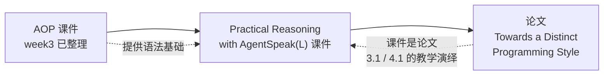

# Week 4 - Agent-Oriented Programming 课件（校订说明与索引）

> 来源：week3 的 `AgentOrientedProgramming.pptx`（50 页，Rem Collier）
>
> ⚠️ **2026-09-28 记录**：week4 的 `AgentOrientedProgramming - Copy.pptx` 副本已作为重复件**移除**。正文知识点见 [[Week3-AgentOrientedProgramming-知识点]]，本页仅保留勘误留痕。

## ⚠️ 结论：这份课件与 Week3 已整理过的是同一份

老奴把两份文件做了逐页文字比对，结果是：

| 项 | 数值 |
| --- | --- |
| 页数 | 两份**都是 50 页** |
| 文字完全相同的页 | **48 / 50** |
| 有差异的页 | **仅 p5、p6（各差一个冠词，属勘误）** |
| 文件 MD5 | 不同（week4 版 2252277 字节 vs week3 版 2252291 字节） |

**差异明细（week4 版是「改对了」的那一份）**：

| 页 | Week3 版 | Week4 版（本讲） |
| --- | --- | --- |
| p5 | the details of **program** as expressed in its listing | the details of **the program** as expressed in its listing |
| p6 | the details of **program** as expressed in its listing | the details of **the program** as expressed in its listing |

> 也就是说：week4 这份是同一课件的**校订副本（corrected copy）**——文件名里的 `- Copy` 也印证了这一点。**内容无新增、无删减。**（该副本已于 2026-09-28 移除，勘误内容以本表形式留痕。）

## ✅ 知识点看这里

完整知识点（362 行，含 McCarthy 1979 心理属性、Shoham 1993 的 AOP/Agent-0、AgentSpeak(L) 架构与语法、Alive Agent / Loops 示例、Light Switch 案例、勘误一节）已整理在：

→ [[Week3-AgentOrientedProgramming-知识点]]

## 本页不重复整理的理由

知识库里已有完整版本时再写一份，会造成**两处需要同步维护**（后续一旦改动很容易只改一处），对本课程复习是净损失。所以本页只承担「**指路 + 勘误留痕**」的职责。

## Week 4 材料全景（本讲三份材料的定位）

| 材料 | 页数 | 处理方式 | 笔记 |
| --- | --- | --- | --- |
| ~~`AgentOrientedProgramming - Copy.pptx`~~ | 50 | 与 week3 重复（仅 2 页勘误）→ **2026-09-28 已移除** | 见 [[Week3-AgentOrientedProgramming-知识点]] |
| `PracticalReasoningAgentSpeak.pptx` | 50 | 新内容，已整理 | [[Week4-PracticalReasoningAgentSpeak-知识点]] |
| `Towards_a_Distinct_Programming_Style_for_AgentSpeak_L_ (4).pdf` | 17 | 新内容，已整理 | [[Week4-AgentSpeakL-ProgrammingStyle-论文精读]] |

## 三份材料的关系（一张图）

> 一句话串联：**week3 的 AOP 课件给语法，week4 的课件把语法用「实践推理风格」重新组织一遍，论文则把这套风格凝练成 7 条可复用原则。**
