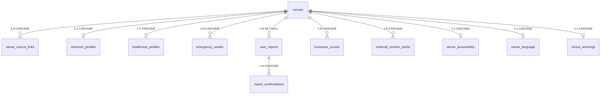

# ClearPath DB Framework — 数据库框架笔记

> **日期**: 2026-06-12
> **来源**: `database_build.ipynb` + `clearpath_db/` 模块
> **数据库**: MySQL 8.4 (Docker `mysql:8.4`)
> **Schema**: `clearpath` (utf8mb4)
> **表数量**: 19 张

---

## 1. 整体架构

```text
Frontend (React Native + Web)
        │ HTTP / JSON
Flask Backend API
        │
        ├── MySQL 8.4 clearpath (19 张表)
        ├── External APIs (NWS Weather)
        └── ML Pipeline (busyness scores)
```

---

## 2. 数据库表结构（19 张）

### 核心数据层
| 表名 | 说明 | 行数 |
|------|------|------|
| `venues` | 主表，所有场所 | 4,838 |
| `venue_source_links` | 来源追踪 | 4,838 |
| `restroom_profiles` | 卫生间详情 | 473 |
| `healthcare_profiles` | 医疗详情 | 1,086 |
| `emergency_assets` | AED 设备 | 3,279 |
| `pedestrian_ramps` | 行人坡道（独立） | 23,625 |

### 用户交互层
| 表名 | 说明 |
|------|------|
| `user_reports` | 用户上报事件 |
| `report_confirmations` | 上报确认/投票 |
| `users` | 用户账户 |

### 业务功能层
| 表名 | 说明 |
|------|------|
| `busyness_scores` | 拥挤度预测 |
| `busyness_forecasts` | 12h 预测序列 |
| `external_context_cache` | 外部 API 缓存 |
| `venue_accessibility` | 无障碍详情 |
| `venue_language` | 语言支持 |
| `venue_warnings` | 警告信息 |
| `venue_embeddings` | 语义向量 |
| `report_categories` | 问题类型字典 |
| `user_favorite_venues` | 用户收藏 |
| `notification_preferences` | 通知偏好 |

---

## 3. ER 关系图



### 关系说明

| 关系                                  | 类型      | 级联策略         | 原因                        |
| ----------------------------------- | ------- | ------------ | ------------------------- |
| venues → profiles (3 张)             | 1:1     | CASCADE      | 附属档案，venue 删则删            |
| venues → venue_source_links         | 1:N     | CASCADE      | 来源追踪，venue 删则删            |
| venues → emergency_assets           | 1:N     | CASCADE      | AED 设备，一个 venue 可能多台      |
| venues → busyness_scores            | 1:N     | CASCADE      | 预测记录随 venue 删除            |
| venues → external_context_cache     | 1:N     | CASCADE      | 缓存随 venue 删除              |
| venues → venue_accessibility        | 1:1     | CASCADE      | API 对齐表                   |
| venues → venue_language             | 1:1     | CASCADE      | API 对齐表                   |
| venues → venue_warnings             | 1:1     | CASCADE      | API 对齐表                   |
| **venues → user_reports**           | **1:N** | **SET NULL** | **报告是独立事件，venue 删除后报告保留** |
| user_reports → report_confirmations | 1:N     | CASCADE      | 确认随报告删除                   |
| pedestrian_ramps                    | 独立      | 无 FK         | 坡道不是目的地，用于路线计算            |

---

## 4. 数据源与 ETL

### 数据源（6 个 CSV/GeoJSON + 2 个 API）

| 类型 | 数据源 | 去重策略 | 目标表 |
|------|--------|---------|--------|
| Toilet | NYC Public Restrooms | 同名去重 | venues + restroom_profiles |
| Toilet | Parks Toilets | 同名去重 | venues + restroom_profiles |
| Healthcare | OSM + NYS Health | GPS <30m 跨源合并 | venues + healthcare_profiles |
| Healthcare | AED Inventory | Entity+Address+Floor | venues + emergency_assets |
| Accessibility | Pedestrian Ramps | ramp_id 去重 | pedestrian_ramps |
| Weather | NWS API | — | external_context_cache |
| Language | LASS CSV | GPS 匹配 | venue_language |

### ETL 设计模式

```
Phase 1: Dedup（内存）
    ├── 过滤无效记录
    └── 去重（按业务规则）

Phase 2: Import（数据库）
    ├── 生成唯一 ID (source_id → venue_id)
    ├── 构建 SQL 语句
    └── 事务执行 INSERT ON DUPLICATE
```

### Confidence 级别

| 数据源 | Confidence | 原因 |
|--------|------------|------|
| NYS Health | 0.9 | 官方政府数据 |
| AED Inventory | 0.8 | 已验证清单 |
| NYC Restrooms | 0.6 | 城市数据 |
| OSM Healthcare | 0.5 | 社区众包 |
| Parks Toilets | 0.3 | 无坐标数据 |

### 索引策略

| 表 | 索引 | 用途 |
|----|------|------|
| `venues` | `(venue_type)` | 类型筛选 |
| `venues` | `(latitude, longitude)` | 地图视口查询 |
| `venues` | `(borough)` | 行政区筛选 |
| `venue_source_links` | `(source_name, source_record_id)` UNIQUE | 导入幂等去重 |
| `venue_source_links` | `(venue_id)` | 来源溯源查询 |
| `user_reports` | `(venue_id, status)` | 活跃预警查询 |
| `user_reports` | `(status, expires_at)` | 过期清理 |
| `pedestrian_ramps` | `(latitude, longitude)` | 附近坡道查询 |
| `busyness_scores` | `(venue_id, forecast_start_time, forecast_end_time)` | 拥挤度查询 |
| `external_context_cache` | `(context_type, request_key)` UNIQUE | 缓存命中 |
| `external_context_cache` | `(context_type, expires_at)` | 缓存清理 |

---

## 5. API 映射

| API 端点 | 数据库行为 |
|----------|-----------|
| `GET /api/v1/venues` | 读 venues + profiles + busyness + active reports |
| `GET /api/v1/venues/{id}` | 读完整 venue 档案 + 来源 + 报告 + 拥挤度预测 |
| `POST /api/v1/reports` | 写 user_reports，默认 2 小时过期 |
| `POST /api/v1/reports/{id}/confirmations` | 写 report_confirmations |
| `GET /api/v1/integrations/status` | 检查数据库 + 外部服务可用性 |

---

## 6. 关键概念

### CASCADE vs SET NULL
- **CASCADE** = 主表删 → 从表也删（附属数据共存亡）
- **SET NULL** = 主表删 → 外键变 NULL（独立数据保留）

### JSON 列 vs 独立表
- **JSON 列** = 快速读取，适合列表展示
- **独立表** = 结构化查询，适合筛选过滤

---

## 7. 实现文件

| 文件 | 用途 |
|------|------|
| `docker/mysql/init/001_clearpath_schema.sql` | Docker 初始化 SQL |
| `Data+ML/test/6.2_DB/001_clearpath_schema.sql` | 开发用 Schema 副本 |
| `docker-compose.yml` | Docker 服务配置 |
| `src/mock_data.py` | API 模拟数据 |
| `Data+ML/test/6.2_DB/database_build.ipynb` | ETL Notebook |
| `Data+ML/test/6.2_DB/fix_plan.md` | 修复方案 |
| `Data+ML/test/6.2_DB/api_schema_gap_analysis_en.md` | Gap 分析 |
| `Data+ML/test/6.2_DB/fix_summary.md` | 修复执行摘要 |

---

## 8. clearpath_db 模块结构

```
clearpath_db/
├── __init__.py          # 模块入口，导出所有公共函数
├── config.py            # 配置：PROJECT_ROOT, DATA_ROOT, MYSQL_CONFIG
├── sources.py           # 数据加载：load_sources(), source_counts(), manhattan_counts()
├── schema.py            # Schema 管理：rebuild_schema(), schema_tables()
├── db.py                # 数据库工具：get_conn(), etl_execute(), etl_executemany()
├── validation.py        # 验证函数：is_manhattan(), gen_vid(), source_hash()
├── dedup.py             # 去重函数：dedup_restrooms/parks/aed/healthcare/ramps()
├── migrations.py        # 迁移管理：apply_migrations(), MIGRATIONS 列表
├── reporting.py         # 报告函数：table_counts(), database_integrity()
├── weather.py           # 天气 ETL：etl_weather(), classify_weather_risk()
├── venue_language.py    # 语言 ETL：etl_venue_language(), parse_lass_languages()
└── etl/                 # ETL 导入函数
    ├── restrooms.py     # etl_restrooms()
    ├── healthcare.py    # etl_healthcare()
    ├── aed.py           # etl_aed()
    └── ramps.py         # etl_ramps()
```

---

## 9. Notebook 运行顺序

```
Part 1-4: 数据验证（load_sources, schema_tables, source_counts）
Part 5: ETL 导入
    ├── rebuild_schema() → 删表重建
    ├── dedup_*() → 去重
    ├── etl_*() → 写入数据库
    ├── etl_weather() → 天气缓存
    └── etl_venue_language() → 语言支持
Part 6: 导入验证（table_counts）
Part 7-12: Schema 迁移（apply_migrations）
Part 13-14: 天气 + 语言 ETL
Part 15: 最终验证（table_counts + database_integrity）
```

---

## 10. 核心函数速查

| 函数                     | 文件                | 功能                       |
| ---------------------- | ----------------- | ------------------------ |
| `load_sources()`       | sources.py        | 加载所有数据源 → `SourceBundle` |
| `rebuild_schema()`     | schema.py         | 删表 + 重建（危险）              |
| `get_conn()`           | db.py             | 获取数据库连接                  |
| `etl_execute()`        | db.py             | 事务执行 SQL                 |
| `dedup_restrooms()`    | dedup.py          | 卫生间去重                    |
| `dedup_healthcare()`   | dedup.py          | 医疗跨源去重（GPS <30m）         |
| `etl_restrooms()`      | etl/restrooms.py  | 卫生间 ETL                  |
| `etl_healthcare()`     | etl/healthcare.py | 医疗 ETL                   |
| `etl_weather()`        | weather.py        | 天气 ETL                   |
| `etl_venue_language()` | venue_language.py | 语言 ETL                   |
| `apply_migrations()`   | migrations.py     | 数据库迁移                    |
| `table_counts()`       | reporting.py      | 统计各表行数                   |
| `database_integrity()` | reporting.py      | 数据完整性检查                  |

---

## 11. 关键变量

### SourceBundle 对象

```python
@dataclass
class SourceBundle:
    restrooms: list      # NYC 公共卫生间 (CSV → list[dict])
    parks: list          # 公园厕所 (CSV → list[dict])
    osm_features: list   # OSM 医疗设施 (GeoJSON → list[dict])
    nys: list            # 纽约州卫生设施 (CSV → list[dict])
    aed: list            # AED 除颤器清单 (CSV → list[dict])
    ramps: list          # 行人坡道 (CSV → list[dict])
```

### ETL 返回值

```python
# etl_restrooms, etl_aed, etl_healthcare, etl_ramps, etl_weather
{"imported": int, "skipped": int, "errors": int}

# etl_venue_language
{"imported": int, "skipped": int, "errors": int}
```

### 去重统计

```python
# _stats() 返回值
{
    "input": int,        # 输入记录数
    "unique": int,       # 去重后记录数
    "duplicates": int,   # 重复记录数
    "filtered": int      # 过滤掉的记录数
}
```

### ID 生成

```python
source_id = source_hash(name, lat, lng)    # 数据源级别 ID（追溯原始数据）
venue_id = gen_vid("nyc_restrooms", source_id)  # 系统级别 ID（全局唯一）
```

---

## 12. 数据流图

```
CSV/GeoJSON 文件
    │
    ▼ load_sources()
SourceBundle（内存）
    │
    ├── dedup_*() → 去重
    │
    ▼ etl_*()
MySQL 数据库
    │
    ▼ table_counts() + database_integrity()
验证
```

### 幂等设计

```sql
INSERT INTO venues (...) VALUES (...)
ON DUPLICATE KEY UPDATE name = VALUES(name)
```

重复运行不会产生重复数据。

---

## 13. Migration 系统

| 类型 | kind | 检查方式 |
|------|------|---------|
| 添加列 | `column` | 检查列是否存在 |
| 创建表 | `table` | 检查表是否存在 |
| 修改列 | `always` | 每次执行 |

共 27 个迁移（21 列 + 3 表 + 2 修改 + 1 索引）。

---

## 14. 实际运行结果（2026-06-12）

| Table | Rows |
|-------|------|
| venues | 4,838 |
| venue_source_links | 4,838 |
| restroom_profiles | 473 |
| healthcare_profiles | 1,086 |
| emergency_assets | 3,279 |
| pedestrian_ramps | 23,625 |
| venue_language | 412 |

**Data Integrity**: 0 failures（无缺失名称、无缺失坐标、无孤立链接）。

---

## 15. DQR 运行基线（2026-06-13）

> **范围**：`Data+ML/test/6.8-6.12_DB/dqr_cleaning_pipeline.ipynb`。本节记录 DQR 对数据库快照的质量评估；它不替代第 14 节的 ETL 建库完整性验证。

### 覆盖范围与流程

- DQR 配置声明 9 张分析表：`venues`、`restroom_profiles`、`healthcare_profiles`、`emergency_assets`、`pedestrian_ramps`、`venue_source_links`、`busyness_scores`、`external_context_cache`、`user_reports`。
- Notebook 已覆盖设计的配置、执行摘要、画像、质量检查、异常检测、评分、清洗、外部数据和导出流程，并额外包含 Busyness 数据概览与预测曲线分析。
- 质量评分采用完整性、准确性、一致性、唯一性、及时性和有效性六个维度；当前快照总分为 **80.4/100（Good）**。

### 当前快照

| 指标 | 结果 |
|------|------|
| `venues` 原始 / 清洗后 | 4,838 / 4,838 |
| 报告中的已分析记录 | 38,140 |
| 报告中的异常 / GPS 重复 | 315 / 9,425 |
| 导出的坐标异常 / GPS 重复对 | 183 / 701 |
| 自动行动项 | 2 |
| 已保存的模块测试 | 12 passed |

### 统计口径与待修复项

- `dqr_field_summary.csv` 实际覆盖 8 张表，未包含 `user_reports`；而审计报告写为 7 张表。后续报告须分别标注“已加载”“已画像”和“已计分”的表数与排除原因。
- 报告与导出文件的异常、重复数不同：前者应明确说明是原始检测数、记录数还是去重后的唯一对数。
- `check_fk_orphans()` 虽为 DQR 核心函数，但当前 Notebook 未调用；应在质量检查阶段接入并将结果纳入报告。
- `build_audit_report()` 已在模块中提供但 Notebook 未调用；应统一审计 CSV 的生成路径与字段定义。

### DQR 输出

`tests/output/` 保存清洗数据、字段与行级画像、异常/重复明细、交通与天气快照，以及维度评分、缺失热图和场馆散点图。医疗类别和设施类型分布用于识别 healthcare 子类失衡。

---

## 16. 待办事项

| 任务 | 优先级 |
|------|--------|
| venue_accessibility 填充 | Medium |
| Parks Toilets 地理编码 | Medium |
| venue_warnings 填充 | Low |
| OSM name 清洗 | Low |
| DQR 接入 `check_fk_orphans()` 并纳入审计报告 | High |
| 统一 DQR 已加载/画像/计分表数，以及异常与重复计数口径 | High |
| 重新运行并保存 Notebook、pipeline、模块测试的完整验证结果 | Medium |

---

