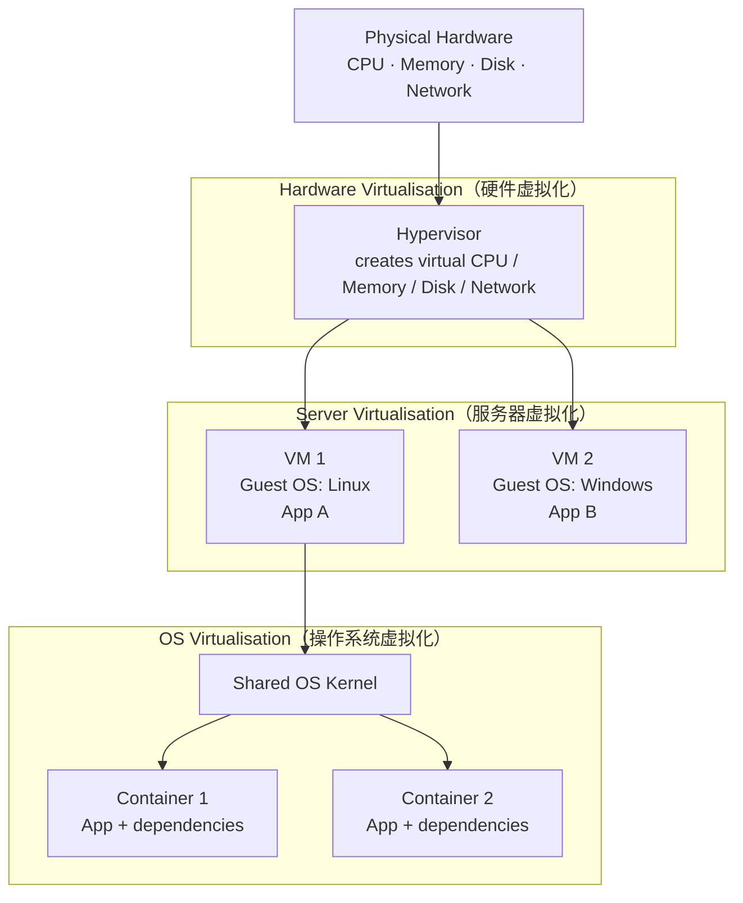

# W2 - Intro to Virtualisation

> 上一节：[[W1 - Introduction to Cloud Computing]]

本节围绕 **Virtualisation（虚拟化）** 展开：先用一张分层图建立整体框架，再讲定义与动因、Hypervisor、VM vs Container，然后区分 Server / Hardware / OS 三类虚拟化，接着是 Full / Para / Hybrid 三种方式，最后介绍 containerisation、unikernel、sandboxed container、microVM，并用一个 autograder 容量计算题练习选型。

## 1. Three virtualisation layers（三层结构）



### 关系总结

- **Hardware Virtualisation（硬件虚拟化）**：底层技术。**Hypervisor（虚拟机监控器）**将 physical hardware（物理硬件）抽象为 virtual hardware（虚拟硬件）。
- **Server Virtualisation（服务器虚拟化）**：使用 Hypervisor，把一台 physical server 分成多个 **VM / virtual server（虚拟服务器）**。
- **OS Virtualisation（操作系统虚拟化）**：在一个 OS 内，通过 shared **kernel（内核）**运行多个 **Container（容器）**。

### 常见叠加结构

```text
Physical Hardware
→ Hypervisor                    = Hardware Virtualisation
→ Multiple VMs                  = Server Virtualisation
→ One VM's Guest OS kernel
→ Multiple Containers           = OS Virtualisation
```

三者不是并列竞争关系，而是可以层层叠加。

## 2. 什么是 Virtualisation

**Virtualisation** 的定义：

> 在只有一个 physical entity 的系统中，制造出两个或多个 entity 的 illusion（假象）。

在（cloud）computing 语境中，virtualisation 技术可以让**一个 compute node（一台 server）看起来像多个**；也可以让一台 computer 同时运行多个 operating systems。其他用途包括 VPN（Virtual Private Network）和 Virtual Storage。

两个 Key Concepts：

- 提供 **virtual resources**；
- 为 application 提供 **portability（可移植性）**。

### 为什么要 virtualise（6 个原因）

1. Cost reduction（降低成本）
2. Isolation（隔离）
3. 测试和评估 applications、frameworks、low-level functionalities
4. Easy duplication（容易复制运行环境）
5. 运行 host 不支持的 software
6. Greener technology（更环保）

## 3. Hypervisor

**Hypervisor**（也叫 VMM，Virtual Machine Manager/Monitor）是一个很小的 software layer，让多个 operating systems 能并行运行，并共享同一份 physical computing resources。它负责把 VMs 相互隔离开，并分配 processor、memory 和 storage。

```text
传统结构                 虚拟化结构
app1 app2 ... appN       app1 app2 appN
------------------       ------------------
 Operating System        OS i OS j OS k
------------------       ------------------
    Hardware             Hypervisor
                         ------------------
                          Hardware
```

### 两种部署方式

- **Bare-metal hypervisor**：直接运行在 host machine 的 physical hardware 上（Type-1）。
- **Hosted hypervisor**：运行在已有的 OS 之上（Type-2）。

**VMM（Virtual Machine Manager/Monitor）** 是统一的、易用的 hypervisor 管理软件，负责 orchestration（编排）多个 VM，可以用多种方式安装以支持不同 virtualisation 技术。

## 4. VM vs Container

- **VM**：共享 hardware，但每个 VM 有独立 **Guest OS kernel**；isolation（隔离）更强，overhead（额外开销）更高。
- **Container**：共享 hardware，也共享 **Host OS kernel**；更 lightweight（轻量）、启动更快，但 isolation 通常弱于 VM。

### Virtual Machines（VMs）

- VM 是构建 virtualized computing environment 的技术，是第一代 cloud computing 的 foundation。
- VM 通过 **hypervisor** 与 physical computer 交互。
- 每个 VM 都包含自己的 **guest OS**、hardware 的 virtual copy、application 及其 libraries 和 dependencies。
- 不同 OS 的 VM 可以运行在同一台 physical server 上（VMware VM 可以和 Linux VM、Microsoft VM 并存）。
- 比较 heavy，启动较慢。

### Containers

- Container 是更轻量、更 agile 的 virtualisation 方式，**不使用 hypervisor**，因此 resource provisioning 更快、新 application 上线更快。
- Container 把运行单个 application 或 microservice 所需的一切打包在一起（包括 runtime libraries）：code、dependencies，甚至 operating system 本身。
- Container 使用 **OS virtualisation**：利用 host OS 的特性来隔离 processes，并控制 process 对 CPU、memory 和 disk space 的访问。
- 因为不包含完整 guest OS、直接复用 host OS 的 features 和 resources，所以 small、fast、portable。

### 对比表

| | Virtual Machine | Container |
|---|---|---|
| 虚拟化对象 | physical hardware（用 hypervisor） | operating system |
| 每个实例包含 | guest OS + virtual hardware + app + libraries | 只有 app + libraries + dependencies |
| Kernel | 每个 VM 有自己的 kernel | 共享 host OS kernel |
| 隔离程度 | 强 | 较弱（仍彼此隔离） |
| 资源占用 | heavy | lightweight |
| 启动速度 | 慢 | 快 |
| 适用场景 | 需要完整 OS、强隔离 | microservices、multi-cloud、CI/CD |

比喻：VM 像一整套 self-contained apartment，每套都有自己的厨房、水电、security；container 像 co-living space，每个 resident 有 private room，但共享 kitchen、bathroom、common area（host OS）。

## 5. 三类 Virtualisation 详解

### 5.1 Server Virtualisation

1. 在 server 上部署 VMM；
2. 把一台 physical server 划分成多个 virtual servers 来共享资源。

- (+) Efficient、reliable 的 backup 与 recovery；支持 IT operations automation 和 infrastructure scaling。
- (−) 前期成本高；可能不支持 proprietary business apps；因为共享 physical hardware，security 和 data protection 较弱。

### 5.2 Hardware Virtualisation

1. VMM 直接安装在 hardware system 上；
2. VM hypervisor 管理 memory、processor 和 hardware 相关资源。

- (+) 减少 maintenance overhead；delivery 速度快、ROI 高；对 guest OS 的改动极小。
- (−) 需要 host CPU 的 explicit support；CPU overhead 限制 scalability 和 efficiency；data 存在系统中有损坏风险。

### 5.3 OS Virtualisation

1. VMM 安装在 OS 上；
2. 适合并行模拟多个 environments。

- (+) 多个 VMs 独立运行并支持不同 OS；malfunction 影响有限（crash 只影响对应 VM）；支持 VM migration between servers。
- (−) 维护、更新、加固 host OS 的 admin overhead 大；file duplicates 导致 file system consumption 大；system resources 消耗大。

### 5.4 两两区别

- **OS vs Server**：OS virtualisation 中 container 共享 host OS kernel，所以 lightweight、efficient；server virtualisation 用 hypervisor 在同一台 server 上跑多个各自带 kernel 的 OS，因此 overhead 更大。
- **OS vs Hardware**：OS virtualisation 不直接 virtualise hardware，而是在 OS level 隔离 application；hardware virtualisation 则 virtualise 物理硬件（CPU、memory）来创建独立的 VM。
- **Server vs Hardware**：server virtualisation 关注在一台 physical server 上创建多个 virtual servers；hardware virtualisation 是底层技术，让 physical hardware 可以被抽象并共享给 virtual environments。现代平台中两者协同工作。

### 5.5 三类虚拟化对照表（重点）

| Aspect | OS Virtualisation | Server Virtualisation | Hardware Virtualisation |
|---|---|---|---|
| Focus | 在同一 OS 上运行隔离的 applications/environments | 在一台 physical server 上创建 virtual servers | 为多个 VMs virtualise hardware resources |
| Layer | OS level（共享 OS kernel） | server/OS level | hardware/CPU level |
| Technology | Containerization | Hypervisors | CPU and hardware extensions |
| Example Tech | Docker, LXC, OpenVZ | VMware, Hyper-V, KVM | Intel VT-x, AMD-V |
| Isolation | 共享 OS kernel，但彼此隔离 | 每个 VM 有自己的 OS | 每个 VM 有自己的 virtual hardware，并映射到 physical hardware |
| Resource Efficiency | High：lightweight，每个 container 无完整 OS | Medium：VM 比 container 更耗资源 | 依赖 hardware，但支持 full isolation |
| Common Use Case | Microservices、cloud-native apps、DevOps、CI/CD | Data center consolidation、单 server 跑多 VM | hardware level 上高效的 VM management |
| Startup time | Fast：秒级启动 | Slower：VM 需要启动自己的 OS | 依赖 hardware，通常比 container 慢 |

## 6. Full / Para / Hybrid Virtualisation

### 6.1 Full Virtualisation

Hypervisor 需要 **emulate 所有 hardware interactions**，会拖慢 performance，尤其是 memory management 和 I/O。Guest OS 不需要修改，它以为自己运行在专属 hardware 上。

### 6.2 Para-Virtualisation（半虚拟化）

Guest operating system 被 **modified**，使其 **aware of the hypervisor**，从而在某些操作上可以直接和 hypervisor 通信。

- Guest OS 中原本直接和 hardware 交互的某些 instructions 被替换成 **hypervisor calls**，避免 hardware emulation，因此更 efficient。
- 对 CPU 和 memory 相关任务的 performance 提升尤其明显。
- Hypervisor 不必花时间和资源去 emulate hardware，所以 hardware resources 利用得更好。

比喻：楼里的公司知道自己和别人共享 building，于是主动告诉 building manager（hypervisor）自己的需求，协调使用会议室、错峰用电，从而降低整体 load。

### 6.3 Hybrid Virtualisation（混合虚拟化）

结合 full virtualisation 和 para-virtualisation，兼顾 **compatibility** 和 **performance**。Hypervisor 同时支持两种 mode：

- **Fully Virtualized Mode**：对不支持 para-virtualisation 的 OS，使用 traditional full virtualisation，例如 hardware emulation 或 hardware-assisted virtualisation（Intel VT-x、AMD-V）。
- **Para-Virtualized Mode**：对支持的 guest OS，允许其直接和 hypervisor 通信，绕过 hardware emulation，提升 CPU、memory、I/O performance。

在 data centers 和 cloud environments 中很受欢迎，因为需要支持各种各样的 operating systems。

比喻：同一栋楼里，有些公司完全独立、互不感知（full）；有些公司知道共享并主动和楼管协作（para）；两种共存。

## 7. 其他类型的 Virtualisation

| Type | Focus | Purpose | Example Technology |
|---|---|---|---|
| Desktop | Virtualizing desktops for remote/local access | 无论 physical hardware 如何都能访问 virtual desktop | MS Remote Desktop Services |
| Application | 在 isolated environments 中运行 applications | 简化部署、避免 conflicts、提升 compatibility | MS App-V, VMware ThinApp |
| Network | Abstracting physical network resources | 创建独立于 physical network 的 virtual networks | Software-Defined Networking（SDN） |
| Storage | Pooling and abstracting physical storage devices | 简化 storage management、提升 scalability | MS Storage Spaces Direct |
| Data | 把 data 从 physical location 抽象出来 | 跨多个 sources 统一访问 data，无需 move 或 replicate | Red Hat Data Virtualization |
| GPU | Virtualizing GPU resources | 在多个 VMs 间共享 GPU，服务 graphics-intensive workloads | NVIDIA GRID, AMD MxGPU, Intel GVT-g |
| Memory | Abstracting physical memory resources | 优化 VMs/applications 间的 memory usage 和 allocation | VMware ESXi |
| I/O | Virtualizing input/output devices | 让 VMs 共享 I/O devices，提升 resource utilization | Single Root I/O Virtualization（SR-IOV） |
| Security | Virtualizing security functions | 在 virtual environments 中部署 scalable、flexible 的 security measures | Cisco Firepower Virtual Firewall |

## 8. Containerisation（容器化）

**Containerisation** 是一种 **operating system virtualisation**：把 software code 连 dependencies 一起 build 并 encapsulate 成一个 package，可以统一 deploy 到任何 cloud infrastructure 上。

它的价值：

- 加速 application development，并通过消除 single points of failure 提升 security；
- 有效解决 code 从一个 infrastructure **porting** 到另一个的问题；
- container package 独立于 host OS，因此容易在多个 clouds 上独立执行 code；
- 消除 cross-infrastructure code management 的问题：把 application code 和运行所需的 libraries 一起打包。

### 8.1 Container 的七个 Characteristics

| Characteristic | 说明 |
|---|---|
| Portability | Develop once, run multiple times |
| Lightweight and Efficient | 用 OS kernel 而不是完整 OS；size 更小、start-up time 更短 |
| Single Executable Package | 把 application code、libraries、dependencies 打包成一个 software bundle |
| Isolation | 在 dedicated process space 中执行；单 OS 上可跑多个 containers |
| Improved Security | 降低 malicious code 在 container 之间传播以及 host invasion 的风险 |
| Fault Isolation | 某个 container 出 fault 时，对相邻 containers 影响最小 |
| Easy Operational Management | 支持 containerised workloads and services 的 install、scale、management 自动化 |

### 8.2 Components of Containerised Apps

| Component | 说明 |
|---|---|
| Container Host | 执行 containerised processes 的系统软件；可以是 VM 上的 host，也可以是 cloud 上的 instance |
| Registry Server | 存储 container repositories 的 file server；container 通过 DNS designation 和 port number 建立的 connection interface 来 push/pull repositories |
| Container Image | executable package，包含 application code、runtime executables、libraries、dependencies；在 container engine 中执行后成为 active container |
| Container Engine/Runtime | 按 user requests 中的 commands 处理 container image，从 repositories pull images 并执行来 launch containers；内嵌 runtime component，负责 security policies、rules、mount points、metadata 以及与 kernel 通信的 channels |
| Container Orchestrator | 支持 development、QA、production 环境的 continuous testing；动态 schedule workloads，并提供 standardised application definition files |
| Namespace | 分离 repositories 组的设计；可以是 username、group name 或 logical name |
| Kernel Namespace | 为 containers 提供 dedicated OS features：mount points、network interfaces、process identifiers、user identifiers |
| Tag | 支持把 repositories 中不同版本的 container images 映射为 latest/best；builder 生成新 repository 时用来给 image 打标签 |
| Repositories | 存储不同版本 container images 的 container repository |
| Graph Driver | 把 repositories 中存储的 images 映射到 local storage |

一个 host OS kernel 可以同时支撑多个 containers；containers 运行在 container engine（如 Docker、containerd、CRI-O）之上，engine 负责把它们和额外的 OS components 连接起来。

## 9. Unikernels

**Unikernel** 是用 **library operating systems** 构建出来的 specialized、**single-address-space** machine image。

- 缩小 cloud services 的 **attack surface** 和 **resource footprint**。
- 通过把 high-level languages 直接 compile 成 specialized machine images，直接运行在 hypervisor（如 Xen）或 bare metal 上。
- 由于多数 public cloud infrastructure 由 hypervisors 驱动，unikernel 能让 services 运行得更便宜、更安全、控制更细。

关键特性：minimal OS、resource overhead 极低、startup 极快（毫秒级）、security 高、flexibility 低（single-purpose）。打包工具：UniK、MirageOS、Clive。

### Containers vs Unikernels：Key Differences

| Containers | Unikernels |
|---|---|
| Share the kernel of the host OS | 每个 deployment unit 内含一个小 kernel |
| Simple to create from an image | 创建需要 advanced skills |
| 设计为运行多个 processes | 设计为运行单个 process |
| OS 负责 resource allocation | Hypervisor 负责 resource allocation |

### 如何选择

**Choose containers if：**

- 想要 well-documented、有支持的 solution（Docker/Kubernetes 已 mainstream）；
- 运行 complex workloads：单线程性能 unikernel 更好，但 multi-thread workloads 用 containers 更快；
- 偏好 simple deployments：container platforms 几乎不需要额外技术知识。

**Choose unikernels if：**

- 要 **maximize security**：design 简单，attack surface 小；
- 要 **minimize resource consumption**：去掉抽象层，更 lightweight；
- 要 **complete platform independency**：containers 虽然 independent，但依赖 Linux kernel，在 Windows/macOS 上需要额外 virtualisation layer 而性能受损。

### Unikernels 与其他虚拟化类型对比

| Aspect | Unikernels | Other Virtualisation types |
|---|---|---|
| OS | Minimal OS，专为单个 application 构建 | Full OS（VM）或 shared OS kernel（container） |
| Resource Overhead | 极低：只包含 OS 的 essential parts | VM overhead 高；container lightweight 但仍高于 unikernel |
| Startup time | 极快：milliseconds | VM 慢；container 也快但慢于 unikernel |
| Security | 高：components 更少，attack surface 更小 | VM 隔离强；container 共享 kernel，存在 security concerns |
| Flexibility | Single-purpose，为 specific applications 优化 | VM 和 container 可运行多个 apps and services |
| Use case | Microservices、IoT、cloud-native apps、edge computing | VM 跑 full app stacks；container 跑 microservices 和 scalable apps |

## 10. Sandboxed Containers

- 在 container 外面再加一层 boundary（isolation 增强）。
- 每个 sandboxed container 运行在 **lightweight VM** 内，拥有**自己的 kernel**。
- Pros：隔离强得多（有 kernel boundary）→ 适合 untrusted / 3rd-party workloads。
- Cons：overhead 更大，startup 稍慢。
- Example：**Kata Containers**；另有 gVisor 这类在 user space 拦截 syscalls 的 kernel。

比喻：合租房里，每个 bedroom 再套一个防火、隔音的小 pod；仍然共享楼里的水电，但多一层保护壳，限制「爆炸半径」。

## 11. MicroVMs

**MicroVM** 是最小的、single-purpose 的 virtual machine，设计目标是 **start fast**、memory/CPU overhead 极小，并通过给每个 workload **自己的 kernel boundary** 来提供 strong isolation。

- 只保留 essentials（CPU、memory 等），通常实现在 **KVM**（Linux 的 hardware virtualisation）之上。
- Container 共享 host kernel（更轻、更快）；microVM 运行自己的 kernel（隔离更强、overhead 略高）。
- Sandboxed-container runtimes 常用 microVMs 在底层来加强 isolation。
- Traditional VM 模拟完整 PC、暴露很多 devices → boot 慢、footprint 大。
- MicroVM 去掉 non-essentials，是 headless、API-driven 的，为 short-lived、high-scale workloads 优化。
- Example：**Firecracker、Cloud Hypervisor**，device model 精简（virtio）。

比喻：同一地块上一排 tiny prefabricated cabins，各有自己的门和 essential utilities，去掉花哨部分，起得快、密度高，但彼此仍是独立住宅。

### MicroVM vs Unikernel

- **MicroVM 是 virtualisation mechanism**：minimal VM，start 快、overhead 小，但仍然运行一个**普通的 guest OS**（通常是小 Linux）。
- **Unikernel 是 software/OS architecture**：application 与 minimal OS parts compile 成一个 binary，直接运行在 hypervisor（或 hardware）上。

## 12. 案例：Autograder 选型与容量计算

**场景**：学生提交任意语言的 code，code 对 hidden tests 运行。

- Assumption 1：code 是 **untrusted** 的，有些甚至 hostile。
- Assumption 2：**Nothing may leak**，hidden tests 在同一 infrastructure 上。
- Assumption 3：**Tiny turns**，每次测试几秒，用完 resources 要归还。
- Assumption 4：**Spiky load**，几分钟内可能出现数千次 isolated runs。
- Assumption 5：**Pay for what you run**，没任务时不运行。

候选方案：A) Virtual Machine　B) Container　C) Sandboxed Container　D) MicroVM　E) Unikernel。核心 trade-off 是 **security/isolation ↔ startup speed/resource overhead**。

### 容量计算题

**Server**：32 vCPUs、128 GB RAM、4014 euros/year。
**Burst**：1800 次 isolated runs，每次 4 秒 test execution。
**Constraint**：每个学生在 **30 秒**内拿到结果。

每次 isolated run 的假设：

1. VMs：512 MB，boot 20 s
2. Containers：16 MB，start 0.1 s
3. Sandboxed containers：64 MB，start 0.25 s
4. MicroVMs：64 MB，boot 0.2 s
5. Unikernels：32 MB，run 0.02 s

> 容量**只按 memory 建模**（128 GB 视为 128000 MB）；CPU、I/O、network、storage 都忽略，所以每一行都是 optimistic 的。

| Option | Fit on the server | Seconds per run | Waves for 1800 runs | CPU ceiling | Time to clear 1800 runs | Servers needed | Cost per year |
|---|---|---|---|---|---|---|---|
| VM | 250 | 24.0 | 8 | 32 | 192 s | 8 | 32112 |
| Container | 8000 | 4.1 | 1 | 32 | 4.1 s | 1 | 4014 |
| Sandboxed Container | 2000 | 4.25 | 1 | 32 | 4.25 s | 1 | 4014 |
| MicroVM | 2000 | 4.2 | 1 | 32 | 4.2 s | 1 | 4014 |
| Unikernel | 4000 | 4.02 | 1 | 32 | 4.02 s | 1 | 4014 |

推导要点：

```text
Fit on the server       = 128000 MB / 单个 memory
Seconds per run         = startup/boot time + 4 s execution
Waves for 1800 runs     = ceil(1800 / Fit)
Time to clear           = Waves * Seconds per run
Servers needed          = ceil(Time to clear / 30)
Cost per year           = Servers needed * 4014
```

**结论**：只有 VM 需要 8 台 server、单机 192 s 才能清空，**超时**；其余四种单台 server 即可在 30 s 内完成全部 1800 次运行。

## 13. 核心逻辑总结

```text
Virtualisation
  -> 一个 physical entity 造出多个 virtual entities（resource + portability）
三层结构（可层层叠加）
  -> Hardware Virtualisation：Hypervisor 抽象 physical hardware
  -> Server Virtualisation：把一台 physical server 分成多个 VMs
  -> OS Virtualisation：在一个 OS 内用 shared kernel 跑多个 containers
Hypervisor 分两类
  -> bare-metal（跑 hardware）/ hosted（跑在 OS 上）
三种方式
  -> Full（emulate hardware）/ Para（改 guest OS，直接调 hypervisor）/ Hybrid（两者并存）
轻量化演进
  -> Container -> Sandboxed Container -> MicroVM -> Unikernel
     （越来越轻、启动越来越快、隔离与灵活性各有取舍）
Autograder 容量题
  -> 用 memory 算 Fit，Waves * per-run time = Time to clear，再除以 30 s 得 server 数
```

## 重要 vocabulary

- **virtualisation**：虚拟化
- **hypervisor / VMM**：虚拟机监控器，位于 hardware 与 VM 之间的软件层
- **bare-metal hypervisor**：直接跑在 physical hardware 上的 hypervisor
- **hosted hypervisor**：跑在已有 OS 之上的 hypervisor
- **guest OS**：VM 内部的 operating system
- **full virtualisation**：全虚拟化，需 emulate 所有 hardware
- **para-virtualisation**：半虚拟化，guest OS 被修改以直接调用 hypervisor
- **hybrid virtualisation**：混合虚拟化，两种 mode 并存
- **containerisation**：容器化，一种 OS virtualisation
- **kernel / kernel namespace**：内核；为 container 提供 dedicated OS features 的内核机制
- **registry / repository / image / tag**：镜像仓库、仓库、镜像、版本标签
- **container engine / runtime**：运行 container image 的引擎，如 Docker、containerd、CRI-O
- **orchestrator**：容器编排器，动态调度 workloads
- **unikernel**：single-address-space machine image，应用与最小 OS 编译在一起
- **library OS**：用来构造 unikernel 的库化 OS
- **sandboxed container**：带额外 isolation boundary（轻量 VM / 自己的 kernel）的 container
- **microVM**：极简 VM，启动快、overhead 小、有自己的 kernel boundary
- **attack surface**：攻击面，组件越少越小
- **resource footprint**：资源占用
- **overhead**：额外开销
- **isolation**：隔离
- **portability**：可移植性
- **provisioning**：资源分配、供给
- **optimistic**：乐观估计（此处指容量模型忽略了很多因素）
