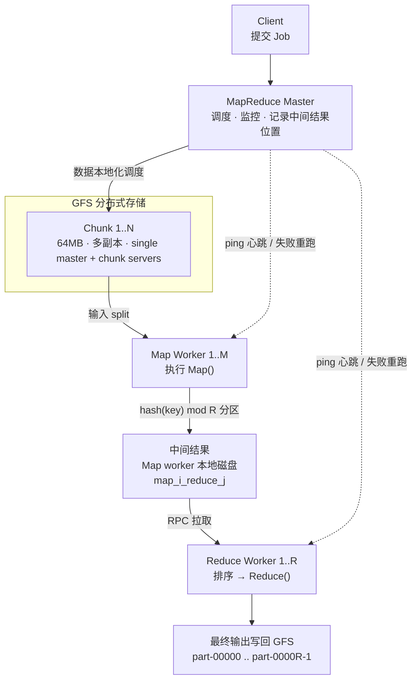

---
tags:
  - 6.824
  - 分布式系统
  - MapReduce
  - GFS
lecture: 1
---

# L1 - MapReduce 与 GFS 架构

> 上一节：[[L0 - Lecture 1 导论：什么是分布式系统]]
> 参考论文：MapReduce (Dean & Ghemawat, OSDI 2004) · GFS (Ghemawat et al., SOSP 2003)

本节主线：先用一张图建立 **GFS（存储）+ MapReduce（计算）** 的整体协作模型，再逐段拆解数据流、分区、数据本地化与容错。**最关键、也最容易记错的一点写在最前面。**

---

## ⚠️ 0. 先纠正一个高频错误

网上很多架构图（包括很多中文速览图）会写成：

> ❌ **"Map 输出的中间结果写入 GFS"**

**这是错的。** 论文里明确写的是：

> ✅ **Map 的中间输出写在 Map worker 的本地磁盘（local disk）上，不写入 GFS。**
> Reduce worker 通过 **RPC 从各 Map worker 的本地磁盘拉取**属于自己的分区。

原因（面试常问）：中间结果是一次性数据，job 结束后就丢，没必要占用 GFS 的复制带宽；放到本地磁盘可以省掉大量跨机写入开销。

**由此推出容错的关键推论：**

| 失败类型 | 后果 | Master 的动作 |
| --- | --- | --- |
| Map worker 挂了 | **它本地磁盘上的中间结果全部丢失** | 该 Map 任务需要**重新执行**（哪怕之前已完成） |
| Reduce worker 挂了 | 它的输出还没落盘 | 重新执行该 Reduce 任务 |
| 已完成 Map 任务的机器后来挂了 | 中间结果不可读 | 这些**已完成的 Map 任务也要重跑**（因为输出不在 GFS） |

> 一句话记忆：**输入在 GFS，中间结果在本地磁盘，最终输出在 GFS。**

---

## 1. MapReduce + GFS 完整架构图（修正版）

```
                 ┌──────────────────────────┐
                 │        Client 程序        │
                 │   提交 MapReduce Job      │
                 └─────────────┬────────────┘
                               │
                               ▼
        ┌──────────────────────────────────────────────┐
        │              MapReduce Master                 │
        │   调度 / 分配 Map·Reduce 任务 / 监控 worker    │
        │   记录每个 Map 任务中间结果的位置（M 个 split）│
        └──────────────────────┬───────────────────────┘
                               │ 按数据本地化调度
        ┌──────────────────────┼──────────────────────────┐
        │                      │                          │
        ▼                      ▼                          ▼
┌────────────────┐   ┌────────────────┐        ┌────────────────┐
│   GFS Chunk 1   │   │   GFS Chunk 2   │  ...   │   GFS Chunk N   │
│ (64MB, 多副本)  │   │ (64MB, 多副本)  │        │ (64MB, 多副本)  │
└───────┬────────┘   └───────┬────────┘        └───────┬────────┘
        │  输入 split 来自 GFS chunk（就近读取 / 数据本地化）
        ▼                    ▼                           ▼
┌────────────────┐   ┌────────────────┐        ┌────────────────┐
│   Map Worker 1  │   │   Map Worker 2  │  ...   │   Map Worker M  │
│  执行 Map()      │   │  执行 Map()      │        │  执行 Map()      │
└───────┬────────┘   └───────┬────────┘        └───────┬────────┘
        │                    │                           │
        ▼                    ▼                           ▼
┌──────────────────────────────────────────────────────────────┐
│  中间结果写入【Map worker 的本地磁盘 local disk】(不是 GFS!)  │
│  按 hash(key) mod R 分成 R 个分区：map_i_reduce_j 文件         │
│  位置回报给 Master                                             │
└──────────────────────────────────────────────────────────────┘
        │         │                    │                           │
        │         ▼                    ▼                           ▼
        │  ┌────────────────┐   ┌────────────────┐        ┌────────────────┐
        │  │ Reduce Worker 1 │   │ Reduce Worker 2 │  ...   │ Reduce Worker R │
        └─▶│ RPC 拉取属于自己 │◀──│ RPC 拉取属于自己的│        │ RPC 拉取属于自己 │
           │ 分区的中间文件    │   │ 分区的中间文件    │        │ 分区的中间文件    │
           │ 排序 → Reduce()  │   │ 排序 → Reduce()  │        │ 排序 → Reduce()  │
           └───────┬────────┘   └───────┬────────┘        └───────┬────────┘
                   │                    │                           │
                   ▼                    ▼                           ▼
┌──────────────────────────────────────────────────────────────┐
│           Reduce 输出写入 GFS（最终结果，多副本持久化）        │
│              part-00000, part-00001, ... part-0000R-1          │
└──────────────────────────────────────────────────────────────┘
```

### 同一张图的 Mermaid 版（Obsidian 可直接渲染）



---

## 2. 架构关键点逐条拆解

### 2.1 数据在哪？（四问四答）

| 数据类型 | 存放位置 | 是否被 GFS 复制 |
| --- | --- | --- |
| 输入文件 | GFS | ✅ |
| **Map 中间结果** | **Map worker 本地磁盘** | ❌ |
| Reduce 最终输出 | GFS | ✅ |

### 2.2 数据本地化（Data Locality）

Master 会尽量把 Map 任务分配到 **存有该输入 split 副本的机器**上，减少网络传输。论文里说，通常输入 split 就来自本机的 GFS chunk，因此大多数 Map 任务是**零网络读取**。

> 注意措辞：是"就近读取本地 GFS chunk 副本"，不是"从 GFS 拉取"。GFS 本身通过 chunk server 提供副本，MapReduce 调度器利用副本位置信息做亲和性调度。

### 2.3 Map 输出分区：`hash(key) mod R`

- R 是 Reduce 任务数（由用户指定），M 是 Map 任务数。
- 第 i 个 Map 任务产出 R 个文件：`map_i_reduce_0` ... `map_i_reduce_{R-1}`。
- 同一 key 必然落到同一分区 → 同一 Reduce worker 能拿到该 key 的**全部** value，这是 Reduce 正确性的前提。
- 用户可用自定义 `Partitioner` 覆盖默认的 hash 分区。

### 2.4 Reduce worker 的三步

1. **拉取（pull）**：通过 RPC 从每个 Map worker 拉取属于自己的分区文件。
2. **排序（sort）**：按中间 key 排序（因为一个 key 的 value 是分散在多个 Map 输出里的）。通常用外部排序，因为可能超过内存。
3. **归约（Reduce）**：遍历排序后的数据，对每个唯一 key 调用一次 `Reduce(key, values)`。

### 2.5 Master 的职责（并发版）

- 维护任务状态机：`idle → in-progress → completed`。
- 记录每个 Map 任务中间结果的**磁盘位置**，转发给 Reduce worker。
- 周期性 **ping** 所有 worker 做心跳。
- 失败处理：ping 超时的 worker 标记为 failed，其任务被**重新执行**。
- **Straggler（慢节点）处理**：当任务接近完成时，Master 会为剩余任务启动 **backup execution**（备份执行），谁先完成用谁的结果。这是论文里把总耗时从"最慢机器决定"里解救出来的关键技巧。

---

## 3. GFS 侧需要记住的四点

MapReduce 是 GFS 的"杀手级应用"，二者一起看：

1. **单 Master + 多 Chunk Server + Client** 架构；master 只存元数据（命名空间、文件→chunk 映射、chunk 位置），**不存数据**。
2. **Chunk 固定 64MB**（远大于普通文件系统的 block），减少 master 元数据量与客户端交互次数。
3. **每 chunk 默认 3 副本**，跨机架放置。
4. **Primary + Lease**：写入时 master 给某副本授租约作 primary，由它串行化该 chunk 的写顺序，其余为 secondary；这解决"多副本写顺序一致"问题。

> 面试题预告：为什么 64MB 这么大？为什么用 lease？如果 master 挂了怎么办？—— 留到 GFS 那一节展开。

---

## 4. 一句话总结

> **GFS 提供分布式存储，MapReduce 提供分布式计算。**
> 协作方式：**输入从 GFS 读 → 中间结果写 Map worker 本地磁盘 → Reduce 经 RPC 拉取并排序归约 → 最终结果写回 GFS。**
> 容错因为"中间结果在本地"而变得更强硬：**机器挂了，它上面已完成的 Map 任务也必须重跑。**

---

## 5. 自测清单

- [ ] 能说出为什么中间结果不放 GFS？
- [ ] 能解释为什么 Map 任务重跑会波及"已完成"的任务？
- [ ] 能写出分区公式并说明它对 Reduce 正确性的意义？
- [ ] 能说清 Master 的 ping、状态机、backup execution 分别解决什么问题？
- [ ] 能区分 MapReduce Master 与 GFS Master（两个不同组件）？

---

## 6. 下一站（可选）

- [x] [[L1.1 - MapReduce 数据流动画版（分帧时间线）]]
- [ ] GFS primary + replica 架构图（含 lease 与 append 流程）
- [ ] 为什么 Spark 取代 MapReduce（DAG vs 两阶段、内存中间结果）
- [ ] Go 版迷你 MapReduce（贴合 6.824 Lab 1）
