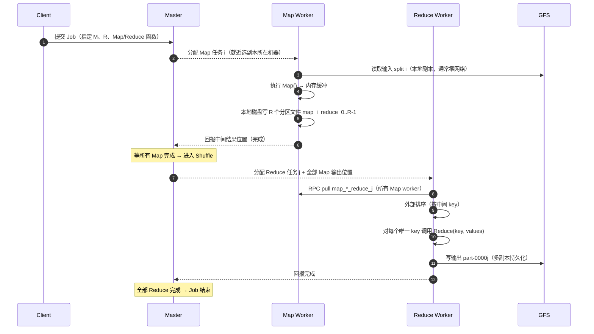

---
tags:
  - 6.824
  - 分布式系统
  - MapReduce
  - 数据流
lecture: 1
---

# L1.1 - MapReduce 数据流动画版（分帧时间线）

> 上一节：[[L1 - MapReduce 与 GFS 架构]]
> 本篇把静态架构图拆成 **一条时间线 + 分帧动画（Frame 0 → Frame 9）**，跟着数据一步步走。
> 每帧都标了 **发生在哪台机器 / 走不走网络 / 走不走 GFS**。

---

## 0. 参与角色（动画的"演员表"）

| 角色 | 数量 | 关键状态 | 存放什么 |
| --- | --- | --- | --- |
| Client | 1 | — | 用户程序 + Map/Reduce 函数 |
| Master | 1 | 任务状态机 `idle/in-progress/completed` | 任务分配 + 中间结果**位置**（不存数据） |
| Map Worker | M | 每个跑一个 Map 任务 | 本地磁盘上的中间文件 |
| Reduce Worker | R | 每个跑一个 Reduce 任务 | 输出文件 `part-*` |
| GFS | — | 1 master + 多 chunk server | 输入 + 最终输出（64MB chunk, 3 副本） |

**约定**：M = Map 任务数，R = Reduce 任务数，通常 M ≫ R（例如 M=200000, R=5000，论文案例）。

---

## 1. 一句话版数据流（先记住这条链）

```
GFS(输入) ──▶ Map Worker ──▶ 本地磁盘(中间结果, R 个分区)
                                      │ RPC pull
                                      ▼
                              Reduce Worker(排序→Reduce)
                                      │
                                      ▼
                                GFS(最终输出 part-*)
```

**没有一步是"中间结果写回 GFS"的。**

---

## 2. Sequence Diagram（Obsidian 直接渲染）



---

## 3. 分帧动画（Frame 0 → Frame 9）

### 🎞️ Frame 0 · 切分（Split）
```
输入文件在 GFS ──▶ 切成 M 个 split（16–64MB）
```
- **在哪**：Client / Master 决策
- **GFS**：只读元数据，不搬数据
- **考点**：split 大小 ≈ GFS chunk 大小，为了让一个 split 尽量落在**一台机器的一个 chunk**上。

### 🎞️ Frame 1 · 调度 Map
```
Master ──分配 map 任务 i──▶ 尽量选存有 split i 副本的机器
```
- **网络**：只有调度消息（很小）
- **考点**：这就是 **data locality**，论文说大多数 Map 是本地读。

### 🎞️ Frame 2 · Map 读输入
```
Map Worker i ──读──▶ GFS chunk（本机副本）
```
- **网络**：通常 0（本地磁盘）
- **输入格式**：`(key, value)` 对，例如 `(行号, 行内容)`

### 🎞️ Frame 3 · 执行 Map，内存缓冲
```
每读一对 (k,v) ──▶ Map(k,v) ──▶ 产生若干 (k', v') ──▶ 写进内存 buffer
```
- **在哪**：Map worker 内存
- **考点**：用户函数是纯逻辑，不碰 IO。

### 🎞️ Frame 4 · 溢写到本地磁盘（关键帧❗）
```
内存 buffer 满 ──▶ 按 hash(k') mod R 分区 ──▶ 溢写本地磁盘
最终每个 Map 任务产出 R 个文件：
  map_i_reduce_0 ... map_i_reduce_{R-1}
```
- **在哪**：**Map worker 本地磁盘（不是 GFS！）**
- **为什么**：中间结果是一次性数据，放本地省复制带宽 + 省跨机写。
- **考点**：分区函数保证 **同一 key 落在同一分区** → Reduce 能拿到该 key 全部 value。

### 🎞️ Frame 5 · 回报位置
```
Map Worker ──▶ Master: "map i 完成，中间文件在 我此处"
```
- **Master 存的是位置，不是数据。**

### 🎞️ Frame 6 · Barrier：等所有 Map 完成
```
Master 收集所有 M 个 Map 的完成 ──▶ 才能开始 Reduce
```
- **这是 MapReduce 的"同步屏障"**，也是它慢的根源之一（Spark DAG 就是来打破这个的）。

### 🎞️ Frame 7 · Shuffle：Reduce 拉取
```
Reduce Worker j ──RPC pull──▶ 每个 Map worker 的 map_*_reduce_j
```
- **网络**：❗真正的重网络阶段，`M×R` 量级的文件传输
- **考点**：这就是 **Shuffle**，也是面试爱问的性能瓶颈。

### 🎞️ Frame 8 · 排序 + Reduce
```
拉取的所有 (k',v') ──▶ 按 k' 排序（可能外部排序）──▶ 逐 key 调 Reduce(k', values)
```
- **为什么必须排序**：同一 key 的 value 分散在 M 个 Map 输出里，排序才能把它们聚到一起。
- **内存**：数据可能超过内存 → 外部排序 / 分块。

### 🎞️ Frame 9 · 写回 GFS
```
Reduce Worker j ──▶ GFS: part-0000j（原子 rename，多副本）
```
- **网络**：写 GFS（这才是真正的分布式持久化）
- **考点**：输出每个 Reduce 任务一个文件，**不合并**；下游 job 可以直接把它们当输入。

---

## 4. 一图流：每一帧的 IO 归属

| Frame | 动作 | 走网络？ | 走 GFS？ | 走本地磁盘？ |
| --- | --- | --- | --- | --- |
| 1 | 调度 | ✅(小) | ❌ | ❌ |
| 2 | 读输入 | 通常❌ | ✅(读) | ✅ |
| 3 | Map() | ❌ | ❌ | ❌ |
| 4 | **中间结果溢写** | ❌ | **❌** | ✅ |
| 7 | **Shuffle pull** | ✅✅✅ | ❌ | ✅ |
| 8 | 排序+Reduce | ❌ | ❌ | ✅(外部排序) |
| 9 | 写输出 | ✅ | ✅(写) | ❌ |

> 背下 Frame 4 和 7 两行，就等于背下了 MapReduce 的性能与容错核心。

---

## 5. 动画里的"意外剧情"：容错插帧

| 插入帧 | 剧情 | Master 反应 |
| --- | --- | --- |
| 插帧 A | Map worker 在 Frame 4 后挂了 | 它本地中间结果**全丢** → 重跑该 Map（Frame 2 重来） |
| 插帧 B | 已完成的 Map 所在机器挂了 | 这些**已完成**任务也必须重跑（输出不在 GFS） |
| 插帧 C | Reduce worker 在 Frame 9 前挂了 | 重跑该 Reduce（重新 Shuffle） |
| 插帧 D | 某 worker 很慢（straggler） | Master 启动 **backup execution**，先完成的算数 |

---

## 6. 自测（对着时间线答）

- [ ] 从输入到输出，数据经过了几次"跨机器"？分别在哪几帧？
- [ ] 第 4 帧如果不分区（只有一个文件）会怎样？
- [ ] 为什么第 6 帧的 barrier 会拖慢整个 job？
- [ ] 插帧 B 里，为什么"已完成"的 Map 也要重跑？

---

## 7. 下一站

- [ ] GFS primary + replica 架构图（lease / append 流程）
- [ ] 为什么 Spark 取代 MapReduce（正好解释第 6 帧 barrier）
- [ ] Go 版迷你 MapReduce（Lab 1）
