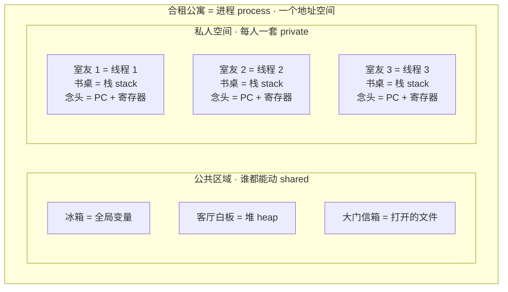
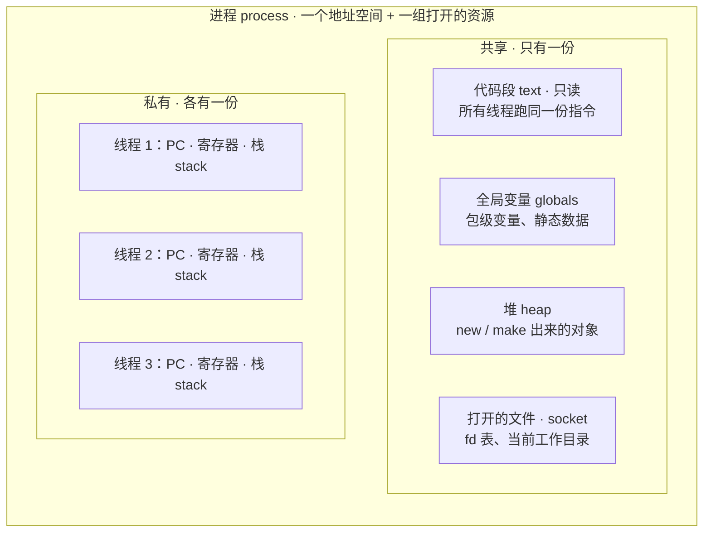
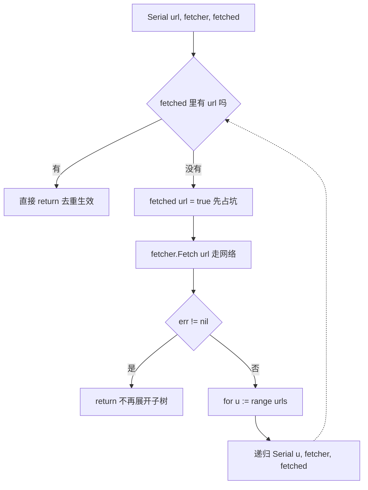
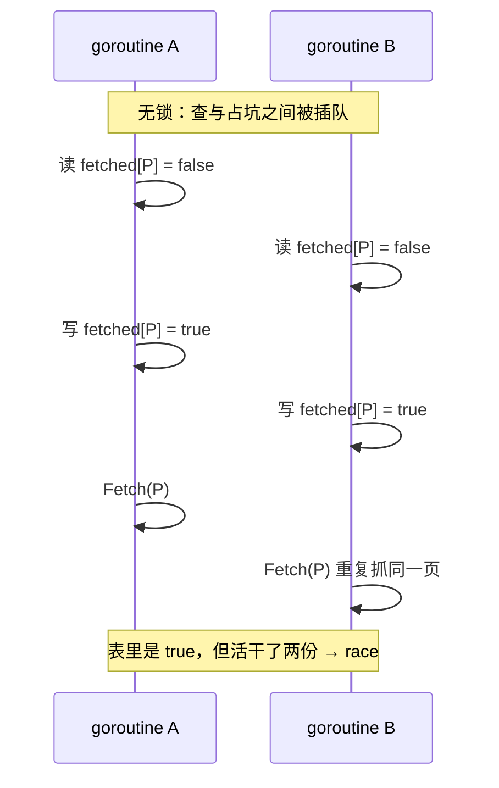
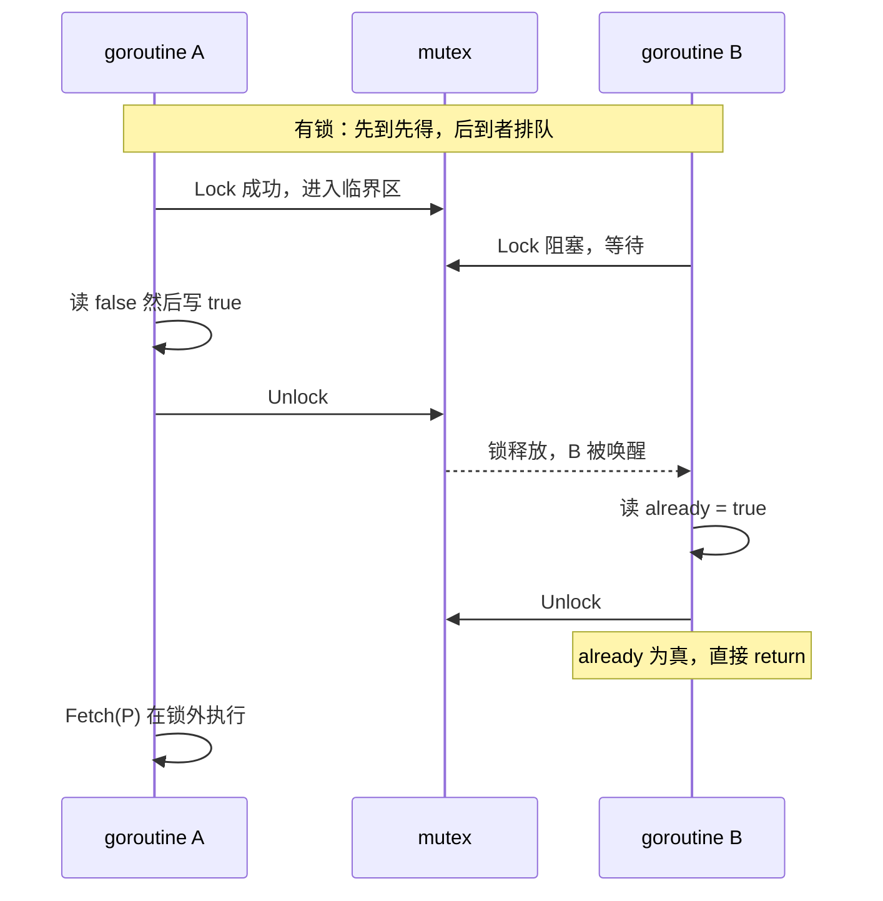

---
tags:
  - 6.824
  - 分布式系统
  - Go
  - 线程
  - 并发
lecture: 2
---

# L2 - Go 线程与并发编程：Goroutine、锁与爬虫实例

> 上一节：[[L1 - MapReduce 与 GFS 架构]]
> 来源：BV16M4m1m7YP（6.824 2020 Lecture 2 前半部分字幕稿，**RPC 部分未包含在本稿内**，另有助教演示）
> 官方代码：课程网站 crawler 目录（serial / mutex / channel 三个版本）

本节主线：**为什么用 Go → 线程（thread）是什么、为什么需要 → 线程带来的三大挑战（race、coordination、deadlock）→ 用三个版本的 Web Crawler 把并发编程拆开讲透 → race detector**。

---

## 1. 为什么这门课用 Go

| 特性 | 意义 |
| --- | --- |
| 线程 + 锁（threading & locking）支持好 | 分布式程序的核心工具 |
| 内置 RPC 包 | C++ 很难找到好用的 RPC（remote procedure call，远程过程调用）包 |
| 类型安全 & 内存安全（type-safe & memory-safe） | 消除一大类「乱写内存导致神秘行为」的 bug |
| 垃圾回收（garbage collection，GC） | **与线程组合尤其重要**：不用手写 reference counting（引用计数）来判断「最后一个线程何时用完共享对象」 |
| 语言简单 | C++ 报错信息复杂到不值得读；Go 相对直白 |

> 学习资料：官方文档 *Effective Go*。

---

## 2. 线程（Goroutine）

### 2.1 结构：什么共享、什么私有

**一句话**：线程 = *共享的地址空间* + *私有的执行流*（PC / 寄存器 / 栈）。共享的是「屋子里的东西」，私有的是「我此刻在干什么」。

#### 类比：一栋合租公寓



- 冰箱被谁动过，所有人一开门就知道 → **共享区的改动人人可见**，所以会 race，所以要锁。
- 他脑子里在想什么，别人看不见 → **私人区天然互不干扰**，不需要同步。

#### 机器里的真实布局



#### 对照表

| | 共享（一份，人人可见） | 私有（各一份，别人看不见） |
| --- | --- | --- |
| 内存 | 代码段 text、全局变量、**堆 heap** | **栈 stack**：局部变量、函数参数、返回地址 |
| 执行状态 | — | **PC（program counter，程序计数器）+ 寄存器组** |
| OS 资源 | 打开的文件 fd、socket、当前工作目录、信号处理 | — |
| 出问题的方式 | 一个线程改了，其他线程立刻看到 → **race** | 天然互不干扰 → 无需同步 |

#### 三条精要点

**① 「私有」是约定，不是隔离（最容易被误读的一点）**

讲座专门强调：**每个线程的栈，物理上也在这同一个地址空间里**。别的线程只要拿得到那个地址，就能读、甚至能改你的栈。所谓「私有」只是编程约定——编译器把栈指针局限在自己的栈区，正常情况不会越界。

> 实践含义：**不要把栈上变量的地址交给别的线程**。Go 的 escape analysis（逃逸分析）会把这类变量挪到堆上（`&x` 被闭包或别的 goroutine 捕获时）；C/C++ 里就是实打实的悬空指针 bug。

**② 共享内存的「酷」和代价是同一件事**

一个线程在堆上 `new` 出来的对象，其他线程可以直接用——这正是 `fetchState` 能被所有 goroutine 共享、`fetched` 能当全局去重表的前提。代价是：**任何人随时可能在你读它的时候改它**，而 OS 完全不介入、不检查、不报警，纪律只能靠程序员用锁提供。

**③ 「各自的寄存器」其实是「各自的寄存器快照」**

单核物理上只有一套寄存器组，多核是每核一套。线程数远多于核数，所以「私有寄存器」的本质是：**上下文切换（context switch）时把当前线程的 PC + 寄存器保存到内存，再把下一个线程的恢复回来**。栈之所以必须是「真的」每人一块，也正是因为在内存里互不覆盖才能来回切换。

#### 附带结论：为什么线程比进程「轻」

进程切换要换**页表（page table）**、刷新 TLB 缓存，整个地址空间映射全变；线程切换只需保存/恢复寄存器 + 换栈指针——**地址空间不变，所以便宜得多**。这也是讲座里「大量 goroutine 复用少量 OS 线程」这套设计的立足点。

Go 更进一步：goroutine 的栈初始只有**几 KB**（远小于 OS 线程通常 MB 级的固定栈），并按需增长，所以能同时开几十万个；但真实规模下仍要用 worker pool 限流，理由见 [[#4.4 缺陷与改进]]。

> 对照 §2.4：进程之间是**硬隔离**（各自一套地址空间，OS 来管）；线程之间**没有隔离**（OS 不检查谁在访问什么）。

**术语**：一个程序 = 一个地址空间，里面可以跑多个线程。Go 把线程叫 **goroutine**，本质就是别人说的 thread；主程序运行在 `main` 上，也只是一个普通 goroutine。

### 2.2 为什么需要线程（三大理由）

1. **IO 并发（IO concurrency）**：一个活动在等待时，其他活动可以推进。典型：为每个 RPC 请求开一个线程，同时等待多个服务器的回复。
2. **多核并行（multi-core parallelism）**：计算密集型任务能真正同时用上多个 CPU core（每秒可用 CPU 周期随线程数提升，直到物理核数上限）。课程里用得少，但真实服务器很重要。
3. **后台任务（background tasks）**：周期性任务（如 Master 每秒 ping worker「你还活着吗」）单独起一个线程循环：干活 → sleep 1s → 再干活，不必把检查逻辑掺进主流程。开销小；程序员时间 > 少量 CPU 成本。

### 2.3 对比：事件驱动（event-driven）编程

没有线程时，可用**单线程 + 单事件循环**：循环等待事件（请求到达、timer 到期、按键等），按事件来源查表恢复对应状态、执行一小段、再回到循环（JavaScript / 窗口系统就是这种风格）。

| 维度 | 线程 | 事件驱动 |
| --- | --- | --- |
| 编程方式 | 直线式顺序代码，好写 | 要把活动切碎成小块状态机，痛苦 |
| IO 并发 | ✅ | ✅ |
| CPU 并行 | ✅ | ❌（单循环只能用一个核；可每核一个事件循环折中） |
| 开销 | 每线程一个 stack（约几 KB），百万线程时内存和调度开销大 | 更精简、低开销，适合海量连接 |

### 2.4 线程 vs 进程（process）

- **进程**：一个运行中的程序 + 一个地址空间，由 OS 管理；进程之间内存隔离、互不干涉。
- **线程**：进程内部的多条控制流，**共享内存**，可用 mutex、channel 等同步。
- Go 程序运行 = 一个 UNIX 进程；goroutine 都在这个进程里。
- 调度是两层的：OS 在线程间上下文切换（context switch，硬件 timer 触发）；Go runtime 再把大量 goroutine **复用（multiplex）**到少量 OS 线程上以降低开销。

---

## 3. 线程的三大挑战

### 3.1 共享数据 → 竞争（race）

- 共享内存很酷（比如所有线程读写同一个 cache），但**很容易出 bug**。
- 经典例子：两个线程对全局变量 `n` 各自 `n = n + 1`，期望 2 实际得到 1。原因：`n = n + 1` 编译后是「load 到寄存器 → +1 → store 回内存」三步，两线程交错执行就丢更新。
- **race（竞争）**得名：像两个 CPU 赛跑，谁先完成 store，谁的结果就被对方覆盖。
- 哪些操作是原子的（atomic）？
  - 32 位 load/store 大概率原子（不会得到混合值）；
  - 字节级、以及 increment 这类复杂指令**通常不保证原子**（取决于 CPU）。
  - ⚠️ **不要依赖单条指令原子性来写并发代码**。
- **锁（mutex）**：Go 里 `mu.Lock()` … 访问共享数据 … `mu.Unlock()`，把多步操作序列对其他持锁者变得**原子**。
  - **锁和变量之间没有任何语言层面的关联，全在程序员脑子里**——`mu.Lock()` 只是获得这把锁对象本身，保护哪些数据由你制定策略（比如：一棵树一个锁、或每个树节点一个锁）。
  - Go 不知道你锁的是哪个变量；`f.mu` 放在 struct 里只是方便组合，没有深层含义。
  - 把锁封装进数据结构（方法内部自动加锁）是合理策略，但有两个坑：① 明知数据不被共享时白白付锁开销；② 数据结构互相调用时容易**死锁**（见 3.3）。
- 两大策略：**① 加锁**让一次只有一个线程碰数据；**② 不共享数据**（能不共享就不共享，通常更好、更简单）。

### 3.2 协调（coordination）

锁解决的是「互不干扰」；协调解决的是「有意等待/配合」：

- **channel（通道）**：在线程间传数据，发送/接收可以阻塞等待。
- **condition variable（条件变量）**：「如果别的线程在等我就踢它一下」。
- **WaitGroup**：等一批线程全部完成（内部是一个计数器：`Add(1)` 加、`Done()` 减、`Wait()` 等到 0）。

### 3.3 死锁（deadlock）

- 线程 1 等线程 2（释放锁 / 发 channel / 减 WaitGroup），同时线程 2 也在等线程 1 → 双双永久阻塞。
- 经典场景：线程 1 持锁 A 想要锁 B；线程 2 持锁 B 想要锁 A。
- 症状识别：**程序停住不崩、什么都不做 → 先查死锁**。

---

## 4. 实例：Web Crawler 三个版本

爬虫的三个并发要点：

1. **去重**：页面图有环（cyclic），必须记住已抓取的 URL 集合，否则永远爬不完（相当于把 Web 图强制成一棵树）。
2. **并行抓取**：抓一页很慢（服务器慢 + 网络 latency），要并行发多个请求，直到网络容量耗尽。
3. **知道何时结束**：某些方案里这是最难写的部分。

### 4.1 串行版（serial crawler）

- 对 Web 图做深度优先搜索（DFS），用 `fetched` map 记录已抓 URL，抓过就直接 return。
- 关键细节：map 通过**引用传递**（Go 的 map 本质是指向堆数据的指针，内置类型，总是按引用传，不用写 `*`）。
- ❌ 不并行，慢。

### 4.2 共享内存 + 锁版（mutex crawler）

结构：一个 `fetchState` struct 集中放 `mu`（mutex）和 `fetched` map；每个 URL 一个 goroutine，全部竞争同一张表。

```go
f.mu.Lock()
already := f.fetched[url]   // 查
f.fetched[url] = true       // 占坑
f.mu.Unlock()               // 查与占坑必须捆成一个原子动作
if already {
    return
}
```

> 完整逐行讲解见 [[#4.5 代码精读（Serial / ConcurrentMutex 逐行）]]。

- **43–44 行必须原子**：不加锁时，两个线程可能同时看到「没抓过」→ 都标记 → 都去抓同一页（这个 URL 在两个不同页面里都出现时就会发生）。
- **WaitGroup 用法**：外层函数要等所有子 goroutine 结束。helper goroutine 里先 `wg.Add(1)`，函数末尾 `wg.Done()`，外层 `wg.Wait()`。
  - ⚠️ **正确写法：`Done()` 要配 `defer`**（defer = 函数返回前必调，无论正常返回还是 panic），否则某个 goroutine 失败退出就会卡死 `Wait()`。
  - WaitGroup 自带内部 mutex，并发的 `Add/Done` 本身不是 race。
- **Go 闭包（closure）语义坑（lab 必踩）**：
  - 内部函数（`func` 字面量）引用外部变量时，引用的是**同一个变量**（如 `f`、`f.fetched`，这正是想要的）。
  - 但 for 循环变量 `u` 每次迭代被重新赋值 → 直接引用 `u` 的话，先启动的 goroutine 会读到**后面的 URL**。
  - 解法：把 `u` 作为**参数**传入内部函数 → 得到私有副本。
  - 延伸：如果外部函数返回后闭包还引用其变量，Go 编译器会做 escape analysis（逃逸分析），把该变量**移到堆**上，由 GC 负责在最后一个引用消失后释放。

### 4.3 channel 版（channel crawler）

结构完全不同：**只有一个 Master**，不递归创建线程树。

- Master 持有**私有**的 `fetched` map（不用加锁，因为只有它碰）和一个 **channel**。
- Master 循环：`for` 从 channel 收结果（每个 worker 抓完一页就发送「该页中的 URL 列表」）→ 逐个检查，没抓过的就再启动一个 worker goroutine。
- **worker 之间不共享任何对象** → 完全不用担心锁——这是 *communicating sequential processes*（CSP，靠传递消息而非共享内存）风格。
- 常见疑问澄清：
  - 多个 worker 同时往 channel 发、Master 同时收，**不是 race**：channel 内部实现自带 mutex，并发使用是安全的。不要用「worker 在改 ch 而 Master 在读 ch」的方式思考——channel 是发送/接收抽象，不是共享变量。
  - `for range channel` 会**阻塞等待**下一条消息（不是读一遍当前内容就退出）；爬完靠 `break` 跳出（Master 计数 `n`：每启动一个 worker +1，每收到一条结果 -1，减到 0 即结束）。
  - 结束后**不需要 close channel**：唯一引用只剩 Master 一侧，GC 会回收 channel。（需要 close 的场景很少，这门课里基本不用。）
  - 整个流程能启动，靠的是调用 master 前先把**第一个 URL 塞进 channel**，否则第一次读 channel 就永远阻塞。想「非阻塞探测 channel 有没有货」要用 `select` 语句。

### 4.4 缺陷与改进

- mutex 版会为每个 URL 开一个 goroutine，**数量无上限**——真实 Web 有数十亿 URL，线程再多也会吃光内存。
- 改进：**固定大小的 worker pool（工人池）**，worker 反复领任务，而不是一 URL 一线程。

### 4.5 代码精读（Serial / ConcurrentMutex 逐行）

#### 代码

```go
func Serial(url string, fetcher Fetcher, fetched map[string]bool) {
    if fetched[url] {
        return
    }
    fetched[url] = true
    urls, err := fetcher.Fetch(url)
    if err != nil {
        return
    }
    for _, u := range urls {
        Serial(u, fetcher, fetched)
    }
    return
}
```

```go
type fetchState struct {
    mu      sync.Mutex
    fetched map[string]bool
}

func ConcurrentMutex(url string, fetcher Fetcher, f *fetchState) {
    f.mu.Lock()
    already := f.fetched[url]
    f.fetched[url] = true
    f.mu.Unlock()

    if already {
        return
    }
    // ... Fetch(url)，然后为每个子 URL 启动 goroutine
}
```

#### Serial 的执行路径



#### 无锁 vs 有锁的交错过程





#### 逐行精读表

| 代码 | 作用 | 为什么这么写 |
| --- | --- | --- |
| `fetched map[string]bool` | 已抓 URL 的记录表 | Go 的 map 是**引用语义**，递归各层共享同一张表，去重才生效 |
| `if fetched[url] { return }` | 去重 | Web 图是**有环的**（cyclic），不查表就无限递归 |
| `fetched[url] = true` | 先占坑再抓 | 顺序不能反：A→B→A 的环里，反了就死循环 |
| `if err != nil { return }` | 抓失败就放弃这棵子树 | 注意这会**跳过**该页的所有子链接 |
| `for _, u := range urls` | 遍历页面里的出口链接 | `_` 丢弃下标，只要值 |
| `f.mu.Lock()` / `Unlock()` | 进出临界区 | 只有「查 + 占坑」被保护，别的都不在临界区里 |
| `already := f.fetched[url]` | 记录旧值 | **局部变量**，出了锁也是私有副本，所以后面能在锁外判断 |
| `if already { return }` | 别人抓过就不重复抓 | 放在锁外，让临界区尽量短 |
| `fetcher.Fetch(url)` | 真正的网络抓取 | **必须在锁外**，否则慢 I/O 把所有 goroutine 串成一队 |
| `f *fetchState` | 指针共享状态 | `sync.Mutex` **不可复制**，传值 = 每个 goroutine 一把自己的锁 = 锁失效 |

#### 五个必须记住的细节

1. **为什么 `Fetch` 要在锁外**：它是走网络的慢操作（服务器慢 + 光速延迟）。塞进临界区，所有 goroutine 就得排队一页一页抓，并发白做。锁只保护内存里的那张表，不保护 I/O。
2. **`fetchState` 必须传指针**：mutex 拷贝后就变成两把不同的锁，谁也保护不了谁。
3. **`already` 能在锁外判断**：它是局部变量，取值已完成。Go 里**锁和变量没有任何语言层面的绑定**，保护什么是程序员脑子里的约定。
4. **`if already { return }` 与 Serial 的 `if fetched[url] { return }` 语义相同**，区别只是前者读的是锁内取的快照。
5. **这版还不完整**：还缺两样东西 —— ① `defer f.done.Done()` 配合外层 `wg.Wait()`，否则函数提前返回（比如 Fetch 出错）会卡死等待；② **goroutine 数量无上限**，真实 Web 有数十亿 URL 会开爆线程，正解是固定大小的 **worker pool（工人池）**。

#### 常见错误

- ❌ 用 `if _, ok := f.fetched[url]; ok { return }` 之后**才** `Lock()` → 查和占坑之间还是有窗口，race 仍在。
- ❌ 忘记 `Unlock()`，或 `return` 写在 `Unlock()` 前面 → **死锁**（程序卡住不崩，先查这个）。
- ❌ `func ConcurrentMutex(..., f fetchState)` 传值 → 锁各自独立，`-race` 能测出来。
- ❌ 不限制 goroutine 数量，测试用 5 个 URL 侥幸跑通，真实数据直接 OOM（out of memory，内存耗尽）。

#### 术语小抄

| 英文 | 释义 |
| --- | --- |
| fetch (v.) | 抓取、取回 |
| recursion (n.) / recursive (adj.) | 递归 / 递归的 |
| dedup / deduplicate (v.) | 去重 |
| critical section (n.) | 临界区，被锁保护的代码段 |
| interleave (v.) | 交错执行 |
| serialize (v.) | 串行化，强制一个接一个 |
| blocking (adj.) | 阻塞的（锁等待、channel 等待） |
| reference semantics (n.) | 引用语义（map 是典型） |
| throughput (n.) | 吞吐量 |
| stale (adj.) | 过期的（读到旧值的说法） |

---

## 5. Race Detector（竞争检测器）

- 用法：`go run -race`。
- **强烈建议在所有 lab 中都开着用。**
- 原理（运行时动态检测，非静态分析）：为每个内存位置分配 shadow memory（影子内存），记录最近读写它的线程以及线程间的锁获取/释放等同步事件；发现「同一位置一写一读、且中间无同步（intervening lock）」就报错，并给出确切行号。
- ⚠️ 局限：它只看**这次运行实际执行的代码**。没执行到的 race 路径不会被发现——所以要认真用的话，测试要尽量覆盖所有代码路径。
- ⚠️ 关于 race 最坑的地方：**带 race 的代码往往大多数时候跑得完全正常**（交错概率低），但到了客户/测试机上就随机失败。不能靠「多跑几次没错」来证明没 race。

---

## 6. 本节速记卡

| 概念 | 一句话 |
| --- | --- |
| goroutine | Go 的线程；独立 PC/寄存器/栈，共享地址空间 |
| 线程共享什么 | 代码段、全局变量、堆、打开的文件 / socket —— 改动人人可见，所以要锁 |
| 线程独有什么 | PC + 寄存器 + 栈；但**栈仍在同一地址空间内**，「私有」是约定不是隔离 |
| 线程 vs 进程切换 | 进程切换要换页表 + 刷 TLB；线程切换只存/取寄存器 + 换栈指针，便宜得多 |
| IO concurrency vs parallelism | 前者是「等 A 时做 B」，后者是「多核同时干活」 |
| race | 多线程交错访问共享数据导致丢更新；`n = n + 1` 三步非原子 |
| mutex | 把代码段对其他持锁者变原子；**锁与变量无语言级关联，策略在程序员脑中** |
| WaitGroup | `Add(1)` / `defer Done()` / `Wait()`；等一批 goroutine 结束 |
| deadlock | 循环等待；程序卡住不崩先查它 |
| channel | 消息传递不共享内存；内部自带锁，并发收发安全；`for range` 会阻塞等待 |
| map | Go 内置引用语义，传参天然共享，无需 `*` |
| for 循环变量 | 闭包直接捕获会共享同一个变量，要私有副本就作参数传入 |
| `-race` | 必开的运行时竞争检测器；只覆盖实际执行到的路径 |
| worker pool | 限制并发 goroutine 数量的正确姿势 |
