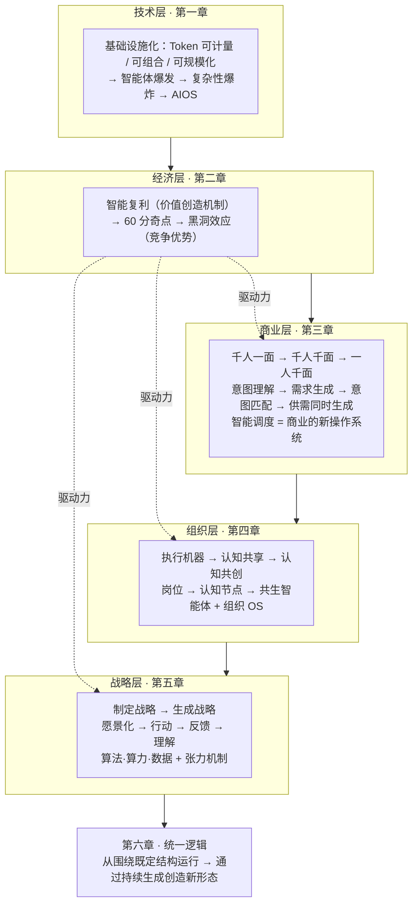

---
tags:
  - 读书笔记
  - MOC
  - 曾鸣
  - 智能商业
  - AI时代
title: 智能AI时代的商业、组织与战略的本质
author: 曾鸣
publisher: 中信出版集团
status: 已读
created: 2026-09-18
---

# 00 索引 - 智能AI时代的商业、组织与战略的本质

> **一句话总纲**：AI 第一次让"智能"成为可以被大规模调用的基础设施，于是**价值创造机制（智能复利）、商业逻辑（一人千面）、组织形态（共生智能体）、战略方法（战略生成）**同时发生范式转移；底层是同一个变化——**世界从围绕既定结构运行，转向通过持续生成来创造新形态**。

## 章节导航

| # | 章节 | 一句话核心 | 关键概念 |
|---|---|---|---|
| 1 | [[01 - AI 产业化的展开：从智能体爆发到系统级重构]] | AI 产业化三阶段：基础设施 → 智能体大爆发 → AIOS。竞争从能力竞争转向**系统竞争** | [[概念 - 三个基础设施判据]]、[[概念 - Token Factory]]、[[概念 - AIOS]] |
| 2 | [[02 - 智能复利和黑洞效应]] | 智能复利是 AI 时代的价值创造机制，黑洞效应是竞争优势来源。**60 分奇点**是飞轮启动的结构性转折点 | [[概念 - 智能复利]]、[[概念 - 黑洞效应]]、[[概念 - 60 分奇点]]、[[概念 - 认知虹吸]] |
| 3 | [[03 - 一人千面：智能商业范式大变革]] | 商业起点从**商品**迁移到**意图/任务**；商业首次参与需求生成；走向需求与供给同时生成 | [[概念 - 一人千面]]、[[概念 - 意图理解]]、[[概念 - 需求生成]]、[[概念 - 意图匹配]]、[[概念 - 智能调度]]、[[概念 - 调度壁垒]]、[[概念 - 点线面]] |
| 4 | [[04 - AI 时代的组织新逻辑]] | 组织从"围绕认知稀缺建立的执行机器"演化为"共生智能体"：创智人才 + AI 智能体的认知网络 | [[概念 - 认知压缩结构]]、[[概念 - 创智人才]]、[[概念 - 认知共创]]、[[概念 - 共生智能体]]、[[概念 - 组织操作系统]] |
| 5 | [[05 - 智能战略：愿景驱动的战略生成]] | 战略从"制定"变成"生成"：愿景→行动→反馈→理解 的循环 + 算法·算力·数据 + 张力机制 | [[概念 - 愿景化]]、[[概念 - 战略生成系统]]、[[概念 - 张力机制]]、[[概念 - 看十年想三年干一年]]、[[概念 - 战略共创会]]、[[概念 - 机制性理解]] |
| 6 | [[06 - 新文明的起点]] | 统一逻辑：从围绕既定结构运行 → 通过持续生成创造新形态。挑战"人类是唯一智能主体"这个文明级前提 | — |

## 全书骨架图

## 核心速查：10 个最重要的判断

1. **技术基础设施化才是转折点**，不是技术发明本身（蒸汽机 ≠ 工业体系；TCP/IP ≠ 平台经济）。
2. **技术决定商业结构的方式是改变约束条件**：工业→成本结构（规模经济）；互联网→连接成本（网络效应）；AI→智力供给（[[概念 - 智能复利]]）。
3. **智能复利是价值创造机制，不是优势生成机制**。要经过"能力→用户价值→竞争优势"两道转化，都可能被堵。
4. **黑洞效应需要 4 个条件同时成立**：学习空间足够大、能力差距能被持续感知、反馈强路径依赖、能力差距能影响任务分配。
5. **60 分奇点不是技术分数而是结构性转折**：从"人对 AI 负责"到"AI 对结果负责"；关键变化是**反馈不再被人为过滤**。
6. **用户行为 ≠ 用户意图**。"千人千面"回答"你属于哪类人"，"一人千面"回答"你正在面对什么问题"。
7. **商业第一次参与需求生成**，因此稀缺性从"供给能力"转向"需求优先级判断力"；品牌信任的新来源是"帮你识别真正重要的问题"。
8. **意图匹配是过渡态**（意图理解 + 库存匹配）；真正的分界线是**需求生成与供给生成同时发生**。
9. **组织的中层本质是"认知压缩与认知路由"**；AI 让认知可自由流动，因此层级/流程从必要机制变成额外成本。组织能力从"管理"转向"设计认知演化机制"。
10. **战略建立在对未来的预判上，但不能依赖预判的正确性**——这是全书最核心的张力；战略能力从"制定"变成"生成"。

## 关键对照表：三个时代的完整迁移

| 维度 | 工业时代 | 互联网时代 | AI 时代 |
|---|---|---|---|
| 基础设施 | 能源 | 信息网络 | 可被持续调用的通用智能（Token）|
| 增长机制 | 规模经济 | 网络效应 | **智能复利** |
| 优势来源 | 拥有资源（产能/渠道/资本）| 拥有连接节点（流量/网络）| **组织资源的能力（调度规则定义权）** |
| 企业壁垒 | 控制资源 | 网络效应 | **调度壁垒**（同样资源也达不到同样效率）|
| 商业起点 | 商品 | 商品（入口从货架到屏幕）| **任务 / 意图** |
| 商业单位 | 商品 | 匹配 | **动态解决方案** |
| 商业形态 | 工厂（重复生产标准答案）| 平台（高效连接已有答案）| **实时求解系统** |
| 供给逻辑 | 预测驱动 | 预测驱动（更快）| **反馈驱动 / 在生成中形成** |
| 供应链形态 | 链条 | 链条 + 平台 | **实时协同网络（像路由系统而非铁路）** |
| 组织隐喻 | 机器（机械系统）| 更快的机器 | **认知生命体（生物系统）** |
| 组织核心任务 | 规模化执行既有答案 | 更高效执行既有问题 | **持续形成新的理解** |
| 分工单元 | 岗位 | 岗位 | **认知节点 = 能力** |
| 战略 | 预测与规划 | 适应变化 | **在行动中生成** |
| 战略约束 | 规划与目标 | 敏捷迭代 | **持续存在的张力** |
| 领导力 | 管理人 | 管理人 + 敏捷 | **设计认知演化机制** |
| 竞争焦点 | 产品/效率/规模 | 网络效应与生态 | **组织智能** |
| 价值单位 | 复制价值 | 匹配价值 | **生成价值（动态最优解）** |

## 行动清单（跨章节汇总）

### 商业 / 战略
- [ ] 定位我的**商业起点**：商品？匹配？还是任务？
- [ ] 我的供给是**固定库存**还是**反馈产物**？（对照希音：小批量—反馈—放大）
- [ ] 我是否具备**需求判断力**（帮客户排序，而不是放大需求）？
- [ ] 我的战略定位是**点 / 线 / 面**？有没有混在一起？
- [ ] 我所在的行业，**谁在定义"资源如何被调用"**（调度规则定义权）？

### 组织 / 认知
- [ ] 哪些"认知压缩/认知路由"的工作可以被 AI 接管？我还在为它付费吗？
- [ ] 是否存在**端到端、无人干预的学习闭环**？还是在人工审核处断掉了反馈？
- [ ] 关键判断（为什么这么选、什么反馈改变了方向）**被系统沉淀了吗**？还是只在我的脑子里？
- [ ] 我是在**管理人**，还是在**设计认知演化机制**？
- [ ] 如果分工单元从"岗位"变成"认知节点"，团队该如何重组？

### 战略生成
- [ ] 写出**愿景化**表述（不是"我相信未来会怎样"，而是"我愿意基于怎样的判断持续行动"）
- [ ] 检查愿景是否退化为口号（对照三种退化路径）
- [ ] 检查重要决策是否**同时**回答：强化长期判断？基于真实反馈？
- [ ] 建立"想三年"的中期机制（季度战略共创会），而非直接从愿景跳到年度 KPI
- [ ] 找出当前**偏离预期的反馈**并追问"为什么"
- [ ] 把复盘从"结果好不好"改成"原来理解的问题是否需要被重写"
- [ ] 把数据从"结果指标"改造为"理解入口"

## 待回答的问题

- 如果"人类是唯一智能主体"这个前提松动，我所在行业里哪些**默认答案**需要被重新回答？
- 60 分奇点的门槛是**信任**而非技术——降低信任门槛的机制是什么（可回退、可审计、限额授权）？
- 商业参与塑造人生路径时，**谁来决定什么是更好的人生方向**？（[[03 - 一人千面：智能商业范式大变革]] 提出的伦理挑战）

## 元信息

- 原书：曾鸣 著，中信出版集团，123 页（PDF 已归档于 `~/Downloads`）
- 作者自述定位：本书是 2018–2019 年《智能商业》《智能战略》的**延伸思考**，是**面向未来的推论，大部分观点还缺乏完整的事实验证**。
- 作者方法论自觉："**重要的不是结论，而是思考过程本身是否有借鉴作用。**"

## 相关

- 同作者延伸：曾鸣《智能商业》（点—线—面、协同网络、网络效应）
- 概念卡片目录见下方标签 `#概念`
