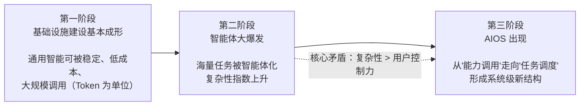

---
tags:
  - 读书笔记
  - 曾鸣
  - AI产业化
  - 智能体
  - AIOS
source: 《智能AI时代的商业、组织与战略的本质》曾鸣 著（中信出版集团）
chapter: 1
---

# 01 - AI 产业化的展开：从智能体爆发到系统级重构

> 上一节：[[00 索引 - 智能AI时代的商业、组织与战略的本质]]
> 下一节：[[02 - 智能复利和黑洞效应]]

本章是全书的判断基础：**AI 的产业化有自己的普遍规律**（由人性与社会发展的基本特征决定），可划分为三个阶段——基础设施成熟 → 智能体大爆发 → 系统级新结构（AIOS）出现。核心结论：**竞争会从"能力竞争"转向"系统竞争"**。

## 1. 总框架：AI 产业化三阶段

**为什么基础设施化才是转折点？**

> 所有重大且深刻的产业变化，通常都**不是**在技术刚被发明的时候发生的，而是发生在**技术的基础设施化之后**。

- 蒸汽机发明后没有立刻出现现代工业体系；
- 互联网 1990s 出现后没有立刻形成今天的平台经济；
- 真正推动社会重构的是：新技术变成**稳定、低成本、可大规模调用的公共能力**，社会围绕它重新组织。

## 2. 第一阶段：基础设施建设基本成形

### 2.1 新基础设施 = 可被持续调用的通用人工智能

| 时代 | 最重要的基础设施 |
|---|---|
| 工业时代 | 能源 |
| 互联网时代 | 信息网络 |
| **AI 时代** | **可被持续调用的通用人工智能（Token）** |

本质：**用越来越低的成本，生产越来越强大的人工智能**。智能第一次像电力、互联网、云计算一样被稳定调用，成为**生产资料**。

### 2.2 基础设施的三个判据（重要知识点）

| 特征 | 含义 | 产业后果 |
|---|---|---|
| **可计量性** | 每次调用可精确记录，Token 成为统一能力单位 | 具备工业化条件，成本结构清晰、规模效应明显 |
| **可组合性** | 生成/理解/推理/编程通过统一方式调用，开发者不必关心底层实现 | 构建新系统不再从零开始，而是"在已有能力之上做组织" |
| **可规模化使用** | 调用方式统一 + 成本结构清晰 → 用量在开发者与普通用户中快速增长 | 从"偶尔辅助"变成"长期驻留流程" |

> 当 AI 同时具备**可计量、可组合、可规模化使用**，它就具备了基础设施性质。**人类第一次把智力本身，转化成一种可以被大规模调用的能力。**

### 2.3 标志性事件与表述

- **ChatGPT**：2022 年底发布，2 个月月活破 1 亿，史上增长最快的消费级应用。
- **2026 年**：基于 Token 形成的共识，标志第一阶段初步成形。
- **黄仁勋 GTC 2026「Token Factory（词元工厂）」**：未来数据中心本质是在生产 Token，像工业时代的炼油厂持续输出能源。
- **萨姆·奥尔特曼**：OpenAI 提供的不是某个应用，而是 **Token 本身**（一种可被调用的基本能力）。

### 2.4 智力成为社会化生产能力

- 过去的边界：智力高度稀缺、难以复制，优秀判断/复杂分析/跨领域理解高度依赖长期受训的个体 → **组织发展速度受限于高水平认知能力的供给速度**。
- 突破后：AI 部分承担过去只能由高水平知识工作者完成的事（程序员长期与 ClaudeCode 协同、研究人员让智能体持续跟踪行业信息）。
- 结论：**AI 从工具逐渐变成基础运行能力**，这才是 AI 产业化真正成熟的标志。

> 工业革命改变的从来不只是工厂，互联网改变的也从来不只是媒体，而 AI 将改变的，很可能是**任务本身被完成的方式**。

## 3. 第二阶段：智能体大爆发

### 3.1 从"对话式 AI"到"行动式 AI"（2026 OpenClaw 大爆发）

跃迁由 **4 个支撑条件**共同促成：

1. 模型能力大幅提升
2. API 开放
3. 协议标准完善
4. 开源社区发展

OpenClaw 可调用软件、操作电脑、写代码，展现**持续在线、主动执行任务**的潜力 → 引发对 orchestration（编排）、harness（封装）、AIOS 的讨论。

### 3.2 为什么"对话"必然不够用

| 对话式 AI 的边界 | 后果 |
|---|---|
| 多步骤任务只能靠多轮对话推进 | 每步都要重新描述上下文，决策依赖用户手动连接；复杂度上升后成本迅速增加 |
| 对话不承担执行责任 | 只能给建议/方案，执行仍需用户在别的系统完成 → AI 停留在**辅助位置** |

**智能体的三个必备能力**：① 理解目标并拆解任务；② 调用外部能力或资源；③ 根据反馈不断调整路径。

> 智能体真正重要的地方**不是"更聪明"，而是它围绕目标、在时间维度上持续运行**。

### 3.3 三个关键定性（易考/易误用）

1. **传统软件 = 功能集合**（用户调用一个功能，完成一次操作）；**智能体 ≈ 持续存在的工作单元**（理解目标、拆解任务、调用能力、按反馈调整）。
2. **AI 第一次进入现实生产过程**：过去大模型停在"知识生成层"，智能体让 AI 进入"任务执行层"。
3. **智能体是价值创造单元，而不是能力单元**。能力（搜索、理解、生成、分析、代码执行、工具调用、页面操作、计划制订）本身不是用户关心的东西。

> 用户不会说"我今天要去使用一个能力"，用户关心的是有没有一个智能体**帮我把事情做成**。

### 3.4 复杂性爆炸：本章最容易被低估的问题

借用历史规律：**每一次能力的大规模释放，都会同时带来复杂性的急剧上升**。

| 技术释放 | 伴生复杂性 | 催生的新制度/系统 |
|---|---|---|
| 工业革命提高生产能力 | 前所未有的组织复杂性 | 现代企业制度 |
| 互联网提高信息流动效率 | 信息爆炸 | 搜索引擎、推荐系统、平台治理 |
| AI 释放智能能力 | 系统不可预测性 | 调度能力、AIOS（本书推论）|

**软件 vs 智能体的根本差别**：Excel 不会突然帮你改战略方向，ERP 不会主动重定义供应链逻辑——软件执行预设规则；而**智能体天然带有自主性**（根据上下文动态决策、主动调用资源、持续调整路径、不断生成新的中间状态）→ 系统行为越来越难以完全预定义。

**企业级真实问题清单**（多智能体进入运营后）：
- 不同智能体之间的上下文如何保持一致？
- 多个系统之间的信息如何避免失真？
- 一个智能体生成的错误，会不会被后续系统持续放大？
- 多个智能体同时调用资源时，成本如何控制？
- 系统做出错误决策，责任如何归属？

> 未来不会缺智能体，真正稀缺的将是**谁能够有效组织大量持续运行的智能系统**。
> 当复杂性超过用户自身的控制能力时，用户会天然寻找**新的组织中心**。
> **用户购买的从来不只是能力，更是确定性。**

### 3.5 智能体双边市场的形成

用户面临的不是一个"选择"问题，而是**在持续变化的智能体世界中的动态决策**问题：

| 选择困难 | 具体表现 |
|---|---|
| 能力差异不透明 | 都声称能完成任务，但能力/稳定性/边界差异使用前不可见 → 必须试错 |
| 试错成本高 | 生成文案无所谓，但参与运营、客服、财务、供应链时试错成本迅速上升 |
| 非标准化 | 特定场景好，换场景可能效果有限 |
| 连续选择 | 不只是选哪个，还要选"什么阶段用哪个、如何衔接" |
| 信任问题 | 从"哪个更好"变成"**哪个更安全可控**"（是否调用不必要资源、是否未经授权做决策）|
| 责任归属 | 出错/造成损失时，归开发者、平台还是用户？ |
| 成本结构与利益分配 | Token 计费 → API 调用费 → 工具使用费 → 应用层服务费；多智能体协同后价值如何分配？|

> 分配机制不清晰，开发者难以判断投入与回报；成本结构不透明，用户难以形成稳定预期。**这个问题不会随技术进步自动消失**。

**平台的本质动作**：降低探索成本，缩短"我有一个问题"→"我找到一个能解决问题的智能体"之间的距离。

> 工业时代，人们购买产品；互联网时代，人们获取信息；**AI 时代，人们会越来越直接地购买任务结果**。

## 4. 第三阶段：AIOS 的出现

### 4.1 从"浏览智能体"到"直接表达需求"

互联网从浏览走向搜索，因为浏览效率太低；AI 会进入第三阶段，因为**探索效率同样太低**。

用户真正的诉求不是买智能体、不是浏览能力清单，而是**把任务做成**。系统需要判断：

- 这个任务需要哪些能力
- 这些能力如何组合
- 哪些智能体先执行、哪些后执行
- 哪些步骤需要人工介入
- 哪些结果需要验证与回退

> 平台的核心能力不再是**信息排序**，而是**任务调度**。

### 4.2 「调度」的三个特征（区别于简单匹配）

| 特征 | 说明 |
|---|---|
| **是过程，不是瞬时决策** | 选择智能体只需一个时间点判断；调度贯穿整个执行过程，随状态不断调整 |
| **是组合，不是单点最优** | 问题不在"哪个能力最好"，而在"哪些能力组合起来更稳定"（无法用单一指标衡量）|
| **要处理不确定性** | 真实任务不可完全预测，需在变化中调整路径仍实现整体目标 |

> 调度不直接创造内容或执行动作，却在很大程度上**决定了整个系统的运行方式**。

### 4.3 AIOS 的三类角色

1. **与用户直接交互**：理解任务目标并转化为可执行过程（延续"入口"作用，但不再只是帮助选择，而是参与整个任务）。
2. **系统内部更大范围的调度**：不同智能体的调用不再局部编排，而在统一框架中被组织。
3. **对开发者侧的支撑**：统一接口方式、上下文管理机制、运行规范（不直接面向用户，但影响系统扩展方式）。

### 4.4 传统 OS vs AIOS

| | 传统操作系统 | AIOS |
|---|---|---|
| 核心管理对象 | 计算资源（CPU、内存、文件系统、进程调度）| **任务流、上下文、能力协同、长期状态** |
| 面对的程序 | 确定性程序 | 大量持续运行、动态协同的**智能体网络** |
| 交互逻辑 | 人需要理解软件 | **系统需要理解人的任务** |

### 4.5 真实任务推动系统走向"任务操作系统"

**案例：某新能源汽车企业 CEO 的战略制定**
- 过去：多部门协同，耗时数月。
- 未来：AI 系统理解任务结构 → 自动拆解目标 → 智能体持续跟踪政策、竞争态势、供应链、财务数据、消费者洞察 → 多智能体协同动态调整策略 → 形成**持续运行的组织记忆系统**。

**关键差异**：
- 今天软件 = 功能集合，**用户自己负责组织任务**；未来任务系统**主动组织整个工作过程**。
- 未来系统会**长期管理上下文**：真实战略任务不是一次性的，关键判断需持续数周/数月修正。
- **传统组织之所以需要大量会议，本质上是因为人类需要不断重新同步上下文。**

> 成熟 AI 任务系统会越来越像一个**持续运行的组织记忆系统**：知道当前任务是什么，保留过去的关键判断，记得不同方案为什么被放弃，哪些假设已变化，哪些风险在上升，哪些结论需要重新验证。

## 5. 落脚点：一个新时代真正开始的地方

**历史规律（三步递进）**：能力竞争 → 系统竞争 → 制度/秩序定义时代

| 时代 | 早期竞争 | 真正定义时代的 |
|---|---|---|
| 工业 | 蒸汽机、生产设备、制造能力 | 流水线、供应链、现代企业制度、全球制造网络 |
| 互联网 | 浏览器、服务器、数据库、网络协议 | 谷歌重组信息发现、脸书重组社交关系、阿里重组商业协同 |
| AI | 大模型能力 | **谁能围绕能力建立新系统** |

**AI 第一次进入组织认知层**：不只是支持工作，还参与任务拆解、信息组织、能力协同、动态调整、长周期执行、上下文管理。

> 为什么工业时代会形成庞大的管理体系、复杂的组织层级？本质是**复杂任务天然需要持续协调**。未来当任务由"人 + 智能体协同网络"完成时，很多过去必须靠层层管理实现的协同，可能被系统部分吸收。

**AI 原生 vs 传统企业用 AI**
- 传统企业：AI 是**附着在原有流程之上的工具**，组织结构、决策逻辑、协同方式没变。
- AI 原生组织：不是在给旧系统加 AI，而是**围绕 AI 重新组织任务本身**。
- 未来企业之间的差距不再是谁拥有 AI，而是**谁真正形成了 AI 原生的任务系统**。

**全书基调（作者在方法论上的自觉）**：
> 这些讨论的目的不是预测未来，而是帮助理解我们正在进入一个怎样的时代。真实世界的发展肯定比今天任何一种线性预测更加复杂。

## 6. 金句摘录

> - "人类第一次把智力本身，转化成一种可以被大规模调用的能力。"
> - "AI 将改变的，很可能是任务本身被完成的方式。"
> - "智能体真正重要的地方并不是'更聪明'，而是它围绕目标，在时间维度上持续运行。"
> - "用户购买的从来不只是能力，更是确定性。"
> - "未来不会缺智能体，真正稀缺的将是——谁能够有效组织大量持续运行的智能系统。"
> - "传统组织之所以需要大量会议，本质上就是因为人类需要不断重新同步上下文。"
> - "未来很多企业之间的差距，可能不再是谁拥有 AI，而是谁真正形成了 AI 原生的任务系统。"

## 7. 相关链接

- [[00 索引 - 智能AI时代的商业、组织与战略的本质]]
- [[02 - 智能复利和黑洞效应]]（AI 时代价值创造的基本机制）
- [[03 - 一人千面：智能商业范式大变革]]（智能商业范式）
- [[04 - AI 时代的组织新逻辑]]
- [[05 - 智能战略：愿景驱动的战略生成]]
- [[06 - 新文明的起点]]
- 概念卡片：[[概念 - Token Factory]] · [[概念 - AIOS]] · [[概念 - 任务调度]] · [[概念 - 三个基础设施判据]]
