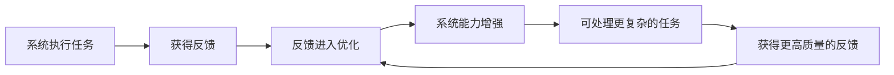
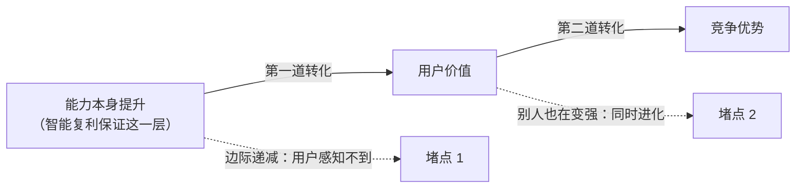

---
tags:
  - 读书笔记
  - 曾鸣
  - 智能复利
  - 黑洞效应
  - 60分奇点
source: 《智能AI时代的商业、组织与战略的本质》曾鸣 著（中信出版集团）
chapter: 2
---

# 02 - 智能复利和黑洞效应

> 上一节：[[01 - AI 产业化的展开：从智能体爆发到系统级重构]]
> 下一节：[[03 - 一人千面：智能商业范式大变革]]

本章是全书的经济学内核：**智能复利是 AI 时代价值创造的基本机制，黑洞效应是竞争优势的强大来源**——就像规模经济之于工业时代、网络效应之于互联网时代。

## 1. 分析范式：技术 → 约束条件 → 增长机制

> 技术本身并不会直接决定商业结构。**真正决定商业结构的，是技术改变了经济系统中的某些基本约束条件。一旦约束条件发生变化，一种新的增长机制就会涌现出来。**

| 时代 | 技术改变的关键约束 | 涌现的增长机制 | 直接后果 |
|---|---|---|---|
| 工业 | 生产**成本结构**（固定投入巨大、边际成本迅速下降） | **规模经济** | 规模本身成为竞争优势；不扩大规模就无法生存 → 大规模企业、集中化生产、全球供应链、资本重要性上升 |
| 互联网 | **连接成本**压到接近于零 | **网络效应** | 节点越多网络价值越大 → 用户规模至关重要，平台早期愿长期亏损换网络结构 |
| **AI** | **高质量智力的供给约束**被突破 | **智能复利** | 增长直接增强能力 |

> 并没有谁"发明"了规模经济。在农业时代的技术条件下，规模经济几乎不可能出现。**直到整个经济系统的约束条件改变了，这件事才成为可能。**

## 2. 智能复利（Intelligence Compounding）

### 2.1 提出路径

1. 过去几乎所有经济体系中，**高质量智力都是极其稀缺的资源**：优秀医生的判断难复制、顶级工程师的经验难规模化、资深投资人的决策无法同时服务多人。
2. 互联网也只是让专家**被更快找到**，并不能让专家**变多**。
3. AI 突破了该约束：智能以越来越低的边际成本被大规模调用，**普通认知能力的供给接近无穷**。

### 2.2 关键反差：使用 = 损耗 vs 使用 = 增值

| | 传统资产 / 组织 / 平台 | AI 系统 |
|---|---|---|
| 使用的后果 | 机器磨损、设备老化、人疲劳、组织随规模变迟缓——**增长意味着资源消耗** | 完成任务越多 → 接触场景越丰富 → 获得反馈越多 → 反馈进入模型优化 → **能力提升** |
| 结论 | 增长与能力提升是两条线 | **使用过程第一次同时成为学习过程和增值过程** |

> 一个平台的用户越多，网络价值越高，但平台本身的"判断能力"并不会因为用户增加而自动提升。AI 系统则不同。

### 2.3 定义与飞轮

> **智能复利**：AI 智能体系统会随着增长而变得更智能的现象。AI 第一次让**能力本身进入复利循环**——增长直接增强能力，能力推动增长，两者构成强大的反馈闭环。



**特斯拉自动驾驶案例**：传统汽车卖出后能力基本固定，驾驶经验属于驾驶者而不在车辆本身。特斯拉每一辆车在真实道路上的运行都持续产生反馈（复杂路况、极端天气、边界场景、异常行为、驾驶决策）→ 用于模型训练与策略优化。**每一次驾驶不仅是在完成任务，还是在训练系统。**

> 这里发生变化的并不是**工具效率**，而是**价值创造机制**。这样的价值创造底层逻辑的变化，必将改变竞争的基本规律。

## 3. 智能复利 ≠ 竞争优势：两道转化

> 智能复利描述的是一种**系统内部的能力演化机制**，竞争优势描述的是企业在市场中的**相对位置**。前者对后者有巨大影响，但两者之间**并不存在天然的对等关系**。

系统变强，但若无法被用户持续感知、或无法稳定拉开与对手的差距，带来的只是**行业整体能力提升**，而非某一企业的结构性优势。



### 第一道转化：能力提升 → 用户价值（边际递减）

- 一个推荐系统从"很不准"到"基本可用"，用户明显感受得到；但达到较高水平后，进一步优化进入**边际递减区间**。
- 模型在指标上持续进步，用户的主观体验变化却越来越小。自动驾驶、客服、内容生成同理：减少极端错误、提升复杂场景处理能力都很重要，但**未必转化为更高的使用频率或支付意愿**。
- 结论：**一旦这种转化关系减弱，智能复利带来的竞争优势就会大幅减弱**（注意：不是说智能复利失效了，而是它不再改变用户行为）。

### 第二道转化：用户价值 → 竞争优势（竞争优势永远是相对的）

- 如果多个企业建立了类似的学习闭环、在类似任务中持续获取反馈，它们会**同时变强**，差距未必拉开。
- 市场看到的不是"谁更强"，而是"大家都不错" → 竞争重新回到**价格、渠道、资源**等传统维度。
- 案例：国内多家自动驾驶公司在相近时间进入真实道路学习阶段，机制上智能复利正在发生，但用户体验上差距没有迅速拉开 → 竞争继续围绕价格、补贴、资源展开。
- **在"学习路径相似、数据结构相近、数据要求不高"时，智能复利更容易表现为同时进化，而不是差距放大。**
- 甚至可能**后发优势**：技术路径尚未稳定时，先行者的路线不一定最优，后来者可以观察后跳过部分试错，直接采用更优算法/系统结构/学习策略。**如果学习过程本身可观察、可模仿、可优化，那么先学到并不等于最终更强。**

> **智能复利是一种价值创造机制，而不是优势生成机制。**
> 以上讨论都建立在一个前提上——系统处理的是**相对标准化、可复制**的任务。一旦任务足够复杂，智能复利将释放出完全不同的力量。

## 4. 黑洞效应的形成

### 4.1 简单任务 vs 复杂任务

| | 简单任务（当下常见） | 复杂任务（未来主战场） |
|---|---|---|
| 反馈性质 | **标准化**：点击/采纳/可运行，判断标准清晰 | **连续性与全局性**：跨时间、跨步骤、跨场景的累积 |
| 学习路径 | **透明**：你通过这些任务获得的经验，对手也能通过类似任务获得 | **路径依赖**：经历过什么，决定了你能学到什么 |
| 差距 | 很难拉开智能体之间的差距 | 可能形成巨大且不可逆的差距 |
| 复利含义 | "做得越多，学得越多" | "**经历过什么，决定了你能学到什么**" |

**复杂任务例子**：策划并执行一场跨国商务旅行（理解偏好、动态航班信息、成本效率权衡、突发签证问题）——一系列决策在时间维度上的叠加，**每一次决策的对错都会改变后续所有路径**。

> 如果有两套 AI 系统：A 在真实商业环境中处理了 3 年复杂决策，B 刚从实验室用海量合成数据训练出来。即便 B 参数量更大、算力更强，面对真实世界的复杂性时，**A 的稳健性和"直觉"也会远超 B，因为 A 拥有那段"不可压缩的历史"**。在这种路径依赖的学习体系中，很多经验无法被直接购买，也无法被快速复制。

### 4.2 从"能力增强机制"到"能力差距放大机制"

**关键缺失环节：能力差距是否会影响后续任务分配。**

```
能力 → 任务 → 更高质量的反馈 → 更强的能力 → 更多任务
```
- 更强 → 用户把更复杂、更重要的任务交给更可靠的系统
- 更复杂的任务 → 更高质量的反馈
- 更高质量的反馈 → 进一步强化能力 → 吸引更多任务

> 这时发生的不再是能力增强，而是**能力开始吸附各种互补的资源**。

### 4.3 定义

> **黑洞效应**：在 AI 驱动的商业系统中，当智能复利跨越特定任务的**复杂性奇点**时，产生**不可逆的、越来越大的**竞争优势的现象。

"黑洞"比喻的关键是**引力增强**：黑洞并不主动扩张，而是因为自身质量足够大，周围一切自然向其聚集。
- 当能力差距持续放大且能吸引更多任务与反馈时，**资源流动的方向就会改变**：高价值任务流、稀缺反馈数据、开发者能力、用户信任，都会逐步向少数系统集中。

> 互联网有**网络效应**，AI 时代有**认知虹吸**。
> 一旦能力差距能被用户持续感知，用户会产生极强的心理惯性——将最复杂、最关键的任务交给最可靠的系统。
> **你不是在和一家公司竞争，而是在和整个生态的流向竞争。**

### 4.4 为什么后来者更难追赶

互联网时代的先发优势有时可通过**巨额补贴**撼动，因为用户迁移成本主要是改变习惯。

但在 AI 黑洞面前，后来者会遇到**路径排他性**阻力：如果一个黑洞系统已经经历了"A-B-C"的错误修正路径并形成了独特的决策权重，后来者即便拿到同样的数据，**没有经历同样的时间序列和反馈修正，也无法复现同样的能力**。这种经验结构是"活"的，**它带有时间的刻度**。

> 在 AI 时代，**领先一步往往意味着领先一个时代**，因为你占据了演化序列的先机。

### 4.5 黑洞效应的四个必要条件（重要）

| # | 条件 | 反面情形 |
|---|---|---|
| 1 | **学习空间足够大** | 任务复杂度不够高，短期内收敛到上限，没有持续探索空间 |
| 2 | **能力差距能被用户持续感知** | 改进只在边界条件而非核心体验 → 用户行为不改变 → 市场结构不改变 |
| 3 | **反馈具有强路径依赖** | 经验可被简单复制，时间不是关键变量 |
| 4 | **能力差距可以持续影响任务分配** | 更强也拿不到更多/更复杂的任务，无法自我强化 |

> 只有这 4 个条件**同时成立**，智能复利才可能从能力增强机制演化为能力差距放大机制。
> **未来商业上最大的赢家，将是最早进入能力差距持续扩大阶段的智能体系统。他们创造的是一种新型垄断结构。**
> 但必须强调：这**不是今天已经普遍存在的现实**，而是一种在特定条件下可能出现的演化路径。黑洞效应的意义不在于描述现在，而在于提供一个理解未来演化的框架。

## 5. 推动智能复利的飞轮：60 分奇点

### 5.1 问题：为什么现实中进入"越用越强"的系统非常少？

表面上条件似乎具备（大量企业部署 AI、每天执行任务、不断接触新输入），但大多数系统**没有表现出明显的复利特征**。断层在于：**系统是否真正进入了"对结果负责"的状态。**

**AI 客服的反例**：
- 能回答标准问题（订单、物流、退款），但一旦涉及跨规则冲突、异常情况、用户情绪就容易出错。
- 企业必须安排人工实时监控与介入（检查准确性、纠正、接管）。
- 后果 A：**任务规模无法扩大**——AI 处理得越多，人工需要盯的也越多，仍是接近线性的扩张。
- 后果 B（更本质）：**反馈质量被破坏**——AI 接触到的不是完整的真实反馈，而是被人为筛选、修正后的结果。系统看不到错误如何产生、用户真实反应是什么，**无法从完整因果链中学习**。

> 没有经历完整的"行动—结果—反馈"闭环，智能复利就无法成立，因为复利的本质是**每一次行动都成为下一轮能力提升的输入**。
> 这也是为什么大量企业**虽然在用 AI，却没有进入 AI 驱动增长的状态：它们使用的是 AI 工具，不是构建 AI 系统**。

**更深层的原因**：由**可靠性**决定。系统能力不稳定时，组织无法承担把关键任务完全交给它的风险，人类必须介入成为最终决策者。

### 5.2 定义

> **60 分奇点**：AI 能够直接对结果负责的突破。它不是技术上的分数，而是一个**结构性转折点**——从"人对 AI 负责"转变为"**AI 对结果负责**"。

因果链：
```
愿意把结果责任交给系统 → 任务规模扩大 → 持续获得高质量反馈 → 智能复利形成
```

### 5.3 跨过 60 分奇点，增长逻辑为什么发生质变？

**变化一：人与系统的分工关系反转**

| | 奇点之前 | 奇点之后 |
|---|---|---|
| 角色 | 人是决策者，AI 是辅助工具 | 系统是**默认执行者**，人退到**例外**的位置 |
| 流程 | 每个关键节点需人判断/确认/兜底 | 大多数任务由 AI 直接完成，仅少数异常需人工 |
| 扩展方式 | **线性**：任务↑ → 人工审核↑ → 成本同步上升 | 任务↑ → 异常案例↑（但比例下降）→ **人工成本不再线性增长** |
| 关键 | — | **不是 AI 更强了，而是人不再需要对每一次行动负责** |

**变化二：反馈结构变化（更关键）**
- 奇点前：反馈被过滤（人工审核、纠错、缓冲不满）→ AI 看到的是**被清洗过的结果**
- 奇点后：系统**直接面对结果**，成功与失败都成为可学习的输入，接触未经筛选的真实数据（边界情况、异常行为、复杂组合）
- **反馈不再只是管理信息，还会成为能力形成的一部分**

**GitHub Copilot 的演进例子**：
- 早期：开发者仔细检查每段代码，系统输出被大量修改甚至重写 → AI 参与过程但**不承担结果**
- 可靠性提升后：开发者直接接受建议并继续开发 → AI 生成的代码直接进入生产环境
- 于是真实结果持续回流：什么样的代码最终进入生产、什么方案导致崩溃、什么架构在真实业务中更稳定、什么问题会在长期运行中暴露风险

> **这样的循环形成的系统不是在展示能力，而是在通过真实任务持续形成能力。**
> 这也是为什么在一些 AI 原生产品中会出现典型现象：一旦跨过某个门槛，使用频率突然上升、黏性显著增强、**产品从可选工具变成默认入口**。这种变化不是线性的，而是结构性的。

## 6. 给企业发展的方向性指导

### 6.1 两条战略指引

1. **尽最大努力争取第一时间突破 60 分奇点**，让智能体可以独立完成一项任务，这时智能复利的飞轮才能转起来。
   - 早期艰难：需要结合 AI 技术发展 + 业务知识长期积累 + 有创造力的人才
   - **愿意让智能体承担独立决策后果，是一个巨大的信任门槛；任务商业价值越大，门槛往往越高**
   - 但独立上岗的智能体能带来智能复利的持续叠加 → 率先突破者很可能产生持续领先优势
2. **尽量解决尽可能复杂和全局性的问题**，让智能体有足够的学习和成长空间；并在**纵深与横向**两个方向发展，形成更强大的智能与黑洞效应。

### 6.2 案例：广告领域的创业选择（复杂度阶梯）

| 切入点 | 任务性质 | 判断 |
|---|---|---|
| 文生图/文生视频自动生成素材 | **局部、单点**任务 | 需求清楚、技术路径清晰 → 创业公司多；但**难往外扩展**，也**难形成独特学习路径** → 竞争激烈，难获大商业价值 |
| 广告投放 | 工作流环节多 + 需要理解什么因素带来好结果（行业知识 + 长期有效数据） | 价值更高；**"提供工具"到"承诺对效果负责"是质的飞跃**（后者才有智能复利的飞轮） |
| 直接管理客户的用户增长 | 客户核心诉求 | 复杂度再上一台阶，学习空间更大，**有可能创造黑洞效应** |
| 全面接管企业运营 | 终极目标 | 目前阶段受技术局限、场景知识稀疏、客户配合意愿低等限制，**很难完成闭环 → 无法突破 60 分奇点，发展速度反而大受限制** |

> 未来几年最大的战略挑战之一：**在问题的复杂度和智能体的闭环能力之间寻找动态平衡**——既能第一时间推动智能复利的飞轮，又有足够的空间学习成长，形成自己的生态，并最终创造黑洞效应。

### 6.3 指标体系的重构（最实用的一条）

> 在 AI 时代，**增长的目的不是规模，而是智能的不断提升，是智能复利的形成**。企业所有的投入和动作，目的都是智能的"升维"，是"谁在变强"。

| | 传统指标 | 新的核心变量 |
|---|---|---|
| 关注点 | 收入、市场份额、用户规模 | 系统是否拥有**真实的任务闭环**？能否**持续获得高质量反馈**？这些反馈是否在**改变能力边界**？ |
| 性质 | 越来越像**结果变量** | **决定未来的核心变量** |

> 如果这些问题的答案是否定的，那么企业**即使在增长，也可能错失最关键的积累窗口**。一旦行业进入智能能力竞争阶段，这种差距会迅速显现，而且往往难以弥补。
> 反过来，如果一个企业已建立起稳定的任务闭环、任务在不断强化系统能力，那么它所处的位置**可能比表面规模更加重要**。

**视角转换**：
> 过去，我们习惯从市场出发——看份额，看竞争对手；而现在，我们必须**同时从智能系统内部出发**——看学习机制，看反馈结构，看能力演化。
> 过去企业的战略首先是**定位和规模**，现在变成**从哪切入，以及尽快构建一个持续变强的学习系统**。

## 7. 金句摘录

> - "真正决定商业结构的，是技术改变了经济系统中的某些基本约束条件。"
> - "系统的使用过程第一次成为系统的学习过程和增值过程。"
> - "智能复利是一种价值创造机制，而不是优势生成机制。"
> - "在简单任务中，复利的含义是'做得越多，学得越多'；在复杂系统中，它变成了'经历过什么，决定了你能学到什么'。"
> - "A 系统拥有那段'不可压缩的历史'。"
> - "互联网有网络效应，AI 时代有认知虹吸。"
> - "你不是在和一家公司竞争，而是在和整个生态的流向竞争。"
> - "在 AI 时代，领先一步往往意味着领先一个时代，因为你占据了演化序列的先机。"
> - "大量企业虽然在用 AI，却没有进入 AI 驱动增长的状态：它们使用的是 AI 工具，不是构建 AI 系统。"
> - "跨过 60 分奇点，关键不是 AI 更强了，而是人不再需要对每一次行动负责。"

## 8. 我的追问（待思考）

- [ ] 我所在的业务/项目，**任务闭环**在哪里？反馈是否被人工"清洗"过？
- [ ] 60 分奇点的门槛是**信任**而非技术，那降低信任门槛的机制是什么（可回退、可审计、限额授权）？
- [ ] 我做的任务是"局部单点"（易被同时进化拉平）还是"复杂全局"（有路径依赖空间）？
- [ ] 如果用"能力边界是否在移动"替代"收入/规模"来评估项目，结论会怎么变？

## 9. 相关链接

- [[00 索引 - 智能AI时代的商业、组织与战略的本质]]
- [[01 - AI 产业化的展开：从智能体爆发到系统级重构]]
- [[03 - 一人千面：智能商业范式大变革]]
- 概念卡片：[[概念 - 智能复利]] · [[概念 - 黑洞效应]] · [[概念 - 60 分奇点]] · [[概念 - 认知虹吸]]
