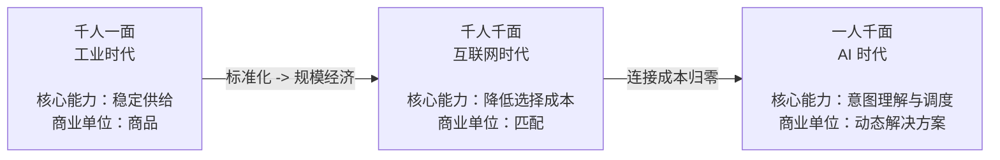

---
tags:
  - 读书笔记
  - 曾鸣
  - 智能商业
  - 一人千面
  - 智能调度
source: 《智能AI时代的商业、组织与战略的本质》曾鸣 著（中信出版集团）
chapter: 3
---

# 03 - 一人千面：智能商业范式大变革

> 上一节：[[02 - 智能复利和黑洞效应]]
> 下一节：[[04 - AI 时代的组织新逻辑]]

本章回答："AI 究竟改变了什么？企业该从哪里开始调整？"核心答案：**商业起点从"商品"迁移到"意图/任务"，商业首次参与需求生成，最终走向需求与供给同时生成的"一人千面"。**

## 0. 起点：为什么"大家都在用 AI，效果却没想象中那么好"

- 旧方法论失效：品牌越来越难与用户共鸣，产品创新越来越难获得认可，投放回报越来越差，线上线下渠道效率都在下降。
- AI 工具快速进入日常运营（内容、营销、产品），局部效率确实大幅提升，但**整体增长没有质的变化**：内容生成更快了，爆款越来越难预测；投放更精细了，转化提升越来越有限。
- 判断：**这是每一次商业范式大变革时的典型特征。**
  - 范式稳定时代，核心能力是把既有模式做到极致；
  - 范式转移阶段，最重要的能力是**看清变化如何发生、又将导向哪里**。

## 1. 三次跃迁的总框架

> **商业进步的本质是人类不断寻找更高效的客户价值实现方式。** 每一个时代真正改变格局的，是技术创新让社会拥有新的能力，能够更接近客户的真实需求，而新的商品和服务只是结果。



### 1.1 千人一面（标准化工业时代）

- 最重要的成就：**人类第一次解决大规模供给问题**。
- 核心逻辑：**只有标准化，才能规模化；只有规模化，才能低成本。**
- 企业面对的不是一个个具体的人，而是**平均用户**：
  - 市场调研 = 寻找大多数人的共性
  - 品牌建设 = 建立大规模统一认知
  - 爆款产品 = 用同一种产品满足尽可能多的人
- 为什么不能理解个体？**理解具体用户的成本太高**。只有私人银行、奢侈品、高端定制、私人医生、顶级顾问这类极少高端行业，能用大量高成本人工服务建立对客户的深度理解。
- 那个时代真正稀缺的能力不是"理解用户"，而是"稳定供给"。

### 1.2 千人千面（广泛连接的互联网时代）

- 触发条件：商品与信息越来越丰富 → 消费者面对**选择过多**的问题。
- 核心问题转移：**从"如何生产商品"转向"如何降低选择成本"。**
- 关键基础设施：**千人千面**的推荐系统（从简单规则"热门优先/评分优先/销量优先"→ 基于行为数据预测偏好）。
- 商业系统第一次开始大规模**"区分人"**：不再假设所有用户一样，而是根据行为理解差异，调整供给的呈现方式。
- 过去 20 年的主要增长来源：更精准的推荐、更高相关性的分发、更细颗粒度的人群匹配。

### 1.3 一人千面（意图实现的 AI 时代）

- 最重要的变化不是"推荐更精准了"，而是智能体可以通过**与用户持续、深入地互动，去理解用户真实的意图**。
- **商业第一次从商品匹配走向意图实现。**

## 2. 意图理解：商业起点的根本迁移

### 2.1 行为 ≠ 意图（关键辨析）

| | 行为 | 意图 |
|---|---|---|
| 可获取性 | 可以被捕捉（点击、停留时长、滑动节奏） | **仍然是隐性的**，不直接暴露在行为表面 |
| 反映的是 | **注意力的去向** | **问题的指向** |
| 平台能回答 | "你会继续看什么" | "这些内容是否接近你当下想解决的问题" |

**短视频例子**：连续观看七八个相似视频，系统可高度确信其兴趣并迅速调整分发——技术上非常成功。但用户的真实状态可能是放松、逃避压力、消磨时间，或只是短暂被吸引。

**电商例子**：一个用户连续浏览儿童绘本、收藏、反复对比版本 → 行为标签"儿童阅读/亲子教育/图书消费"极其清晰。但动机可能完全不同：
1. 新手父亲在培养孩子阅读习惯
2. 临时给朋友的孩子买礼物
3. 在研究某个市场准备进入该行业

> **在行为层面几乎没有区别，但在意图层面，它们指向完全不同的问题。**

**更复杂的例子**：家长面对孩子学习状态下降，很少直接说"我的孩子需要上数学辅导班"，他看到的是注意力不集中、作业拖延、情绪波动——**这些是问题的表现，不是需求的定义**。真正有效的解决方案往往不是最初选择的那个，而是在不断调整中才慢慢接近的。

**共性**：职业瓶颈、装修、企业增长——**用户拥有的是一个复杂状态，而不是一个可以直接匹配的需求。**

### 2.2 "千人千面"的边界

> 互联网时代的"千人千面"，本质上是一个**不断细化的分类系统**：用户被拆解为越来越细的标签组合，被归入某一类人群，从而获得更匹配的供给。
> 它无法突破的限制是：**它始终在回答"你属于哪一类人"，而不是"你正在面对什么问题"。**

即使分类再细，也无法覆盖个体在具体情境中的变化；即使预测再准，也只是基于过去的行为。

**起点的迁移**：
```
过去：起点 = 人群（先判断你是谁，再决定给你什么）
现在：起点 = 问题情境（你现在想解决什么问题）
```

### 2.3 商品只是工具，目的才是本体

- 真实世界里，大多数人类需求**本来就不是商品需求，而是解决问题的需求**：
  - 买空气净化器 → 关心家人的呼吸系统安全
  - 搜索在线课程 → 希望 3 个月后通过职业资格考试
- 为什么过去停在商品层面？**不是企业不想理解更深层需求，而是技术做不到。**
  - 偏好可以从行为直接推断（常买运动鞋 → 大概率喜欢运动品牌）
  - **意图并不直接暴露在行为表面**；传统推荐算法擅长寻找相关性，而大模型第一次让系统能通过自然语言持续互动理解用户背后的目标结构。

**对比示例**：
> 用户说："我想给刚退休的父母安排一次安静一点、不太累、天气舒服的旅行。"
> - 过去系统：抓取关键词——退休、父母、安静、旅行
> - AI 智能体：旅行对象的年龄结构、行程节奏限制、情感优先级、风险容忍边界、陪伴体验价值
>
> **这是质变，不是优化。**

### 2.4 商业起点的三个时代

| 时代 | 商业起点 | 核心能力 | 消费者负担 |
|---|---|---|---|
| 工业 | **商品**（先生产，再经渠道销售） | 制造与分销 | 面对已存在的商品目录 |
| 互联网 | **商品**（入口从货架迁移到屏幕：搜索框、推荐流） | 匹配效率 | **必须先把需求翻译成商品语言**——必须先知道自己要找什么 |
| 智能体 | **任务/意图**（从人的原始问题出发） | 定义解决路径 | **消费者不再承担问题定义的大部分工作** |

**年轻父亲的例子**：
- 过去：面对"工作压力增加、家庭责任变化、生活节奏失衡"，只能压缩成商品语言——"我要买一个助眠枕头"或"我要报一个减压课程"。
- 现在：可以直接说"最近总觉得很累，晚上睡不好，白天也很难集中注意力。"这句话里**没有商品、没有类别、没有搜索关键词**，只是一个真实的人类问题。但系统已开始工作：可能涉及睡眠质量、压力管理、作息规律甚至健康风险因素。

> **过去商业从商品开始，现在商业从任务开始。**
> 过去企业争夺的是**商品入口**（谁的货架最显眼、搜索排名更靠前、推荐位更精准）；未来企业争夺的是**谁最先进入用户任务形成的那一刻**。
> **谁先进入任务起点，谁就拥有定义解决路径的权力。**

**教育行业案例**：
- 传统在线教育入口是课程（消费者先决定学英语/提高数学，平台围绕课程组织供给）
- 智能体时代：消费者说"孩子最近做题越来越慢，也抗拒写作业"
- 系统识别问题可能不在课程不足，而在**概念断层、注意力下降、学习节奏失衡、情绪受挫**
- 组织出的路径：诊断评估、节奏调整、局部强化训练——**而不只是卖一门课**
- 结论：**商品退到后台，问题本身走到前台。**

## 3. 需求生成：商业第一次参与需求的创造

### 3.1 旧假设 vs 新现实

> 过去所有商业理论默认：**需求本身先存在，企业只是去识别它。** 市场调研、消费者洞察、用户画像、大数据分析、行为追踪、推荐算法，都建立在同一假设上。

**发现需求 vs 生成需求，是两种完全不同的商业逻辑**：

| | 发现需求 | 生成需求 |
|---|---|---|
| 前提 | 消费者已经知道自己要什么 | 需求处于**模糊、未成形、连消费者自己都无法准确表达**的状态 |
| 企业动作 | 更早识别 | **参与需求本身的生成** |
| 例子 | 消费者知道自己想买空调，企业判断哪类更合适 | 用户只说"最近总是半夜醒来，早晨起床很累，白天精神也差"，系统结合睡眠记录、作息、环境、健康数据，识别真正问题可能是**昼夜节律紊乱 + 光照环境不足 + 长期焦虑的综合作用** |

**什么是"尚未被定义的问题场"**：
- 一个人持续疲惫，不知是睡眠紊乱还是慢性压力积累
- 一个家庭觉得生活混乱，说不清是时间管理还是空间组织问题
- 一家企业感觉效率下降，不知是协同机制失灵还是流程结构问题

> **AI 第一次改变了这一点：需求是在交互中逐步清晰和生成的。**
> 未来越来越多的商业机会**不再是等待需求表达，而是帮助客户把模糊困境转化成清晰目标**。
> **谁定义需求，谁就定义了市场。**

**行业延伸**：医疗最明显（过去患者先决定挂哪个科、做什么检查；未来 AI 医疗系统根据零散症状发现尚未被意识到的风险）；教育、金融、家居、企业服务同理。

> AI 时代最深刻的变化不是系统更懂需求了，而是**商业成为需求生成机制的一部分**。

## 4. 需求判断力：识别真正重要的需求

### 4.1 稀缺性的转移

| | 过去 | 未来 |
|---|---|---|
| 最重要的问题 | 需求**是否存在**（规模、支付能力、可持续性） | 哪些需求**值得被定义** |
| 稀缺资源 | 供给能力（产能、库存、物流） | **注意力与优先级判断能力** |

> 理论上，每个人每天都可能被识别出无数潜在需求（健康改善、学习升级、情绪调节、家庭协同、时间管理……）。**如果所有潜在需求都被无限展开，商业系统将陷入过载。**

### 4.2 需求判断力 = 帮客户给人生问题排序

**健康平台例子**：系统发现某中年用户睡眠质量下降、体脂率上升、久坐、压力偏高、心血管风险略增。理论上可以生成 5 套服务方案，但优秀的系统**不会把这 5 个问题同时推给用户**，而必须判断当下哪个最值得优先解决、真正影响长期健康轨迹。
→ 答案可能不是卖 5 种产品，而是**先聚焦睡眠问题**，因为改善睡眠可能连带改善压力水平和体脂率，降低心血管风险。

**教育例子**：一个学生每天都有大量潜在学习需求（数学薄弱点、英语词汇、阅读理解、表达短板）——**系统若只是无限生成学习需求，学生只会越来越焦虑**。好的 AI 教育系统必须判断当前阶段最值得优先突破的**学习瓶颈**。

> 未来商业将从**满足需求的竞争**转向**定义优先级的竞争**。企业不只是服务市场，还在**塑造客户的行动路径**。

### 4.3 品牌信任的新来源

| | 过去 | 未来 |
|---|---|---|
| 赢得信任靠 | 产品稳定可靠 | **能帮你识别真正重要的问题** |

> 一个真正值得信赖的品牌，不是每天提醒你买更多东西，而是在复杂世界里帮你看清该优先解决什么问题。
> **低水平企业会无限放大需求、制造焦虑；高水平企业则能帮助客户在无限可能中找到真正值得投入资源的方向。**

### 4.4 隐藏的伦理挑战（重要）

当商业开始参与塑造人生路径，一个重大问题出现：**谁来决定什么是更好的人生方向？**
系统依据什么价值标准判断——健康优先还是效率优先？长期成长优先还是短期满足优先？

> 商业第一次进入一个过去主要属于教育系统、家庭、文化机构的领域：**人的长期发展方向**。这意味着未来商业不再只是经济问题，也开始成为**价值判断问题**。

作者的判断：AI 将拥有对所有细节的永久记忆、对全世界最完全的知识、最强大的推理能力，且没有任何情绪干扰；再加上我们对 AI 顾问、AI 个人保健医生、AI 生活管家、AI 教育专家、AI 情感陪伴的向往——**这些伦理问题无法回避**。

> 需求生成时代伟大的企业不会只是最聪明的数据公司，还是有**价值判断能力、有社会责任担当的复杂系统组织者**。
> **最难的问题不是发现更多需求，而是帮助人们走向真正值得的未来。**
> 社会责任不再是事后讨论的话题，而是一开始就需要和 AI 对齐的价值观。

## 5. 意图匹配：未来的过渡阶段（重要判断）

> **意图匹配 = 意图理解 + 库存匹配**

- AI 对商业的第一步冲击在**需求理解端**：识别复杂、多层次甚至模糊的人类目标，转化成结构化任务模型。
- 但一旦进入执行层，就受制于旧世界的基本约束：**供给仍然是预先存在的**。系统真正理解了人，但解决问题的方法仍停留在旧时代——**在现成库存里寻找最优组合**。

**旅行例子**：用户提出"下个月想带父母去一个凉爽、安静的地方旅行，老人腿脚不好，希望节奏慢一点，预算 3 万元"。
- 推荐时代：只能根据关键词推荐现成旅游产品
- 意图匹配时代：智能体理解"多代家庭同行、老年人行动能力有限、节奏必须舒缓、舒适度优先于景点密度、风险控制很重要"，并自动完成复杂筛选——**排除高海拔地区、过滤转机过多的航班、优先选择无障碍设施酒店**
- **但问题是：它仍然只能在已有航班、已有酒店、已有线路中做选择。**

> 如果供给仍然是固定库存，那么无论系统多聪明，它都只是**更高级的匹配者**——只是把"搜索商品"升级成了"搜索解决方案"，**没有真正进入生成时代**。

**作者判断**：意图匹配将是 **AI 产业化第二阶段的典型商业形态**，是一种非常典型的过渡结构，因为它刚好对应今天智能体能力的边界：**理解能力已经突破，组织能力快速增强，生成供给能力仍未成熟。**

## 6. "一人千面"的真正基础：需求与供给同时生成

**最容易产生的误解**：把"一人千面"理解成一种更高级的定制化服务（柔性制造、按需生产、个性化推荐的再进一步）。

**真正的革命性**：不是让供给变得更灵活，而是**第一次让需求生成和供给生成在一个系统里同时发生**。

> 在人类商业历史上，这两件事一直是彼此分离的。过去的基本假设是：**需求先存在，然后供给去响应**——工业时代如此，互联网时代如此，甚至意图匹配阶段仍然如此。
> "一人千面"打破的正是这种**先后关系**：系统最终组织出的可能不是一件商品，而是一套**动态生成的解决方案**——在理解具体个体之后临时生成出来的供给结构。

**左手刀例子**：
> "我想要一把左手用的厨房刀，因为我手腕有轻微关节炎，需要握柄特别舒适，能让我每天轻松切菜半小时。"
> - 意图匹配阶段：在现有商品库中找到最接近条件的一把刀（仍然只能从库存里挑）
> - 一人千面阶段：直接触发柔性制造网络，实时生成**左手握柄角度定制、刀身重量动态调整、材质按使用频率优化**的产品方案，然后直接生产一把新刀

> 一旦系统已经知道客户真正要什么，整个商业系统迟早会面对一个无法回避的问题：**为什么还要被困在旧库存里？**

**商业单位的迁移**：
```
工业时代：商业单位 = 商品
互联网时代：商业单位 = 匹配
一人千面时代：商业单位 = 动态解决方案
```

> 未来优秀的企业，最擅长的将是**把模糊问题转化成清晰需求，再把清晰需求转化成实时供给**。

## 7. 从供应链到实时协同网络

### 7.1 希音（Shein）：从预测驱动到反馈驱动

**传统服装供应链的核心是预测**：提前数月判断趋势、设计产品、安排生产、通过库存与渠道完成销售。天然限制——**一旦判断错误，后续无法调整**。

**希音的做法**：
- 每个新款初始生产量非常小 → 上线后用点击、转化、复购数据判断表现 → 表现好的迅速追加生产，表现差的迅速下架
- 流程对比：
  ```
  传统：需求 → 被预测 → 转为生产计划 → 形成供给
  希音：供给（小规模）→ 进入市场 → 产生反馈 → 再决定供给规模
  ```
- 表面看是"快反供应链"，结构上看是：**供给不再是预测结果，而是反馈过程的产物**——产品不是在进入市场之前就被确定，而是**在进入市场之后才逐步被筛选并放大的**

> **供给不再是对需求的提前回应，而是在与需求的持续互动中被不断调整与放大。这种结构更接近一种生成过程，而不是准备过程。**

### 7.2 同类扩散

| 领域 | 变化 |
|---|---|
| 内容生产 | 供给已明显从预先制作转向**实时生成** |
| 营销 | 创意不再一次性产出，而在投放过程中不断调整迭代 |
| 企业服务 | 解决方案越来越不以固定形式出现，而根据客户情况**动态组合** |

> 共同的底层方向：**供给正在从"被设计完成"走向"在使用中被生成"。**

### 7.3 从"链条"到"网络"

| | 传统供应链 | 生成式供给结构 |
|---|---|---|
| 形态 | 一条链（上游生产—中游加工—下游分发—用户消费） | **实时协同网络** |
| 稳定性来源 | 每个环节角色固定，信息流与物流同向流动 | 供给在多个阶段不断被调整；信息从用户侧持续反馈到各节点；能力组合按问题动态变化 |
| 节点角色 | 固定 | 每个节点**可能既是供给提供方也是信息接收方** |
| 决策 | 集中在某一环节 | **分布在整个系统中** |

**Shopify 生态**：不直接生产商品、不控制库存，而把供给能力**拆解为多个节点**：商家负责产品，开发者提供工具，第三方提供物流/支付/营销。这些能力以**模块形式**存在，可根据具体需求被组合。

> **供给正在经历一次"解构"：从完整产品拆解为能力模块，从提前定义转向动态生成，从线性链条转向协同网络。**

**一个精妙的比喻**：
> 传统供应链像**铁路系统**：线路固定、车站固定、方向固定。
> 供给生成时代的供应体系更像**互联网路由系统**：面对每一次请求，系统都会重新寻找最优路径，**路径不是预设好的，而是动态计算出来的**。

**企业关系与边界被重定义**：
- 过去：长期采购合同、固定代工厂、稳定物流伙伴——强调**确定性**（线性体系最怕不稳定）
- 未来：**动态节点关系**——这次需求选中你，下次可能选别人。企业不再主要依靠固定绑定关系生存，而是**把自己持续塑造为网络中的高价值节点**

## 8. 智能调度：商业世界的新操作系统

### 8.1 为什么调度取代生产成为核心

| 时代 | 最稀缺的东西 |
|---|---|
| 工业 | 把商品**制造出来**的能力 |
| 互联网 | 优化**已有供给的连接效率**（调度只是辅助能力） |
| 生成时代 | **组织好资源的能力** |

> 在供给生成体系里，制造资源普遍存在，甚至可能被开放调用：企业未必需要拥有自己的工厂（可调用外部柔性制造网络）、物流体系（开放物流节点），甚至设计能力也可能来自分布式设计平台。
> **资源本身不再稀缺，真正稀缺的是组织好资源的能力。**

**智能养老空间改造例子**：家庭提出"把一套老旧公寓改造成适合老年父母长期居住的智能养老空间"。
- 涉及资源：空间设计、适老化家具、智能照护设施、本地施工团队、医疗监测接口、家庭成员远程协同系统
- 传统：拆成若干独立购买行为（买家具、买设备、找装修公司、装软件），**消费者自己承担整合责任**
- 生成时代：把这看作一个**整体求解任务**——哪套设计方案最适合这个家庭结构？哪些设备最兼容现有住宅条件？哪个施工节点当前最空闲？哪种物流组合最快交付？如何在预算、时间和体验之间找到最佳平衡？
- **最困难的不是制造某件单独商品，而是在复杂实时约束中找到整体最优资源组合。**

**三种商业形态的比喻**：
| 时代 | 像什么 |
|---|---|
| 工业 | 工厂——重复生产标准答案 |
| 互联网 | 平台——高效连接已有答案 |
| 生成 | **大型实时求解系统**——每个消费者需求是一个方程式，答案不预先设置，而是在资源网络中被实时计算出来 |

### 8.2 AIOS 与商业世界的对应关系

> **AIOS 真正的意义，正是为商业世界提供了大规模智能调度能力。它是生成时代商业调度的技术底座。**
> 就像工业时代的电力系统支撑了大规模制造、互联网时代的网络协议支撑了全球连接，未来 AIOS 支撑的正是**全社会资源的实时智能编排**。

**为什么必须是 AIOS 而不是普通软件系统**：生成时代的调度复杂度远超传统软件能力。只有具备**持续理解意图能力、跨节点协同能力、实时动态求解能力**的系统才能承担这一角色。

> 前文讨论的 **AIOS 是技术世界的演化节点**，这里讨论的**智能调度是商业世界的演化结果**——两者是同一件事的两个侧面：技术基础设施升级，必然重塑商业组织形态。

### 8.3 从交易系统到实时协同系统

> 过去的商业世界本质上是一个**交易系统**：商业运行的基本单位是一次次相对独立的交换行为。消费者提出需求 → 企业提供商品 → 交易完成 → 关系暂时结束。

**AIOS 带来的变化**：
- 成都旅行例子：用户说"下周我要带父母去成都，希望行程舒适，不赶时间" → 系统不理解为一张机票交易，而是**一个持续展开的协同任务**：根据天气调整出发日期、根据老人健康状态调整航班时间、根据实时交通优化酒店位置、动态修改接送方案、途中延误自动重排整个行程。
- **商业关系不再在付款瞬间结束，而是在整个目标实现过程中持续存在。**

| | 交易系统 | 实时协同系统 |
|---|---|---|
| 价值创造时点 | **成交时刻** | **持续动态的优化过程中** |
| 企业卖什么 | 一个商品/服务/交付 | **一个持续被优化的目标实现过程** |
| 订单的意义 | 固定需求 → 固定供给 | **不断更新的动态任务流**，持续被重写 |
| 客户关系 | 交易生命周期：获客—成交—复购 | **长期协同关系管理**（持续参与客户目标实现） |
| 企业内部 | 按职能分工（销售、供应链、客服），因为交易**分段式发生** | 销售、服务、调度、交付**同时协作**的一体化过程 |

> 过去的商业总是在某个成交节点创造价值，未来的商业则是在**整个过程里持续创造价值**。
> 商业系统的基本单位将从**交易**转向**协同过程本身**。

### 8.4 重新定义平台

**互联网时代的平台**：第一次把市场本身数字化了——平台成为新的市场"场所"，最核心价值是让交易匹配效率达到前所未有的高度。**但仍然运行在交易逻辑上**：上架的是已存在的供给，消费者表达的是已形成的需求，平台只做最快最有效的连接。

**生成时代的平台**：
| | 互联网平台 | 生成时代新平台 |
|---|---|---|
| 像什么 | **数字市场** | **行业操作系统** |
| 作用 | 让交换更快发生 | 不仅让资源相遇，还负责**资源协同运转** |
| 价值来源 | 连接节点数量 | **是否掌握任务拆解与资源调度规则** |
| 核心资产 | **流量** | **调度规则定义权** |

**打车 vs 出行任务**：
> "今天下午我要带行动不便的母亲去医院，途中还需要顺路取药，希望等待时间尽量少，路线尽量简单。"
> 系统必须同时协调：最适合无障碍乘坐的车辆资源、医院预约时间、实时交通拥堵、药房配药节点、最优路线与时间重排。
> 此时平台**不再是司机与乘客之间的撮合者，而变成跨资源网络的实时任务协调中心**。

> **谁定义了资源如何被调用，谁就定义了整个行业的运行方式。**
> **网络效应控制的是连接关系，调度规则控制的是整个行业如何运转。**

### 8.5 竞争规则的改变：从"拥有资源"到"组织资源"

> 过去两个时代有一个共同逻辑：**优势首先来自资源占有。**
> - 工业：产能、工厂、渠道、资本
> - 互联网：关键资源形态从物理资产转向数字节点（谷歌控制搜索入口、亚马逊控制交易流量、微信控制社交关系网络）
> - 本质仍是**谁先占据关键资源，谁就拥有优势**

**智能调度时代打破了这一逻辑**：资源不再由任何单一企业长期独占，而是开放存在于整个社会网络中。**决定竞争优势的是谁更善于组织这些资源。**

| | 拥有资源 | 组织资源 |
|---|---|---|
| 商业哲学 | 强调**控制权** | 强调**编排调度能力** |
| 壁垒来源 | 控制资源 | **调度规则** |

**调度壁垒的定义**：不是别人没有资源，而是**即使拥有同样的资源，也无法达到同样的组织效率**。
> 这就像今天所有城市都拥有道路系统，但并不是所有导航系统都能找到最优路径。**道路是公开的，真正稀缺的是对复杂路径的实时求解能力。**

**调度壁垒天然具有累积性**：每完成一次任务就获得新反馈（哪些资源组合效率更高、哪些路径在高峰期更优、哪些节点在特定条件下更可靠）→ 不断沉淀进系统模型 → 调度能力持续增强 → **越强的调度能力越能获得反馈，反馈越频繁越可以优化调度**。

> 这其实正是**智能复利在商业结构中的具体体现**：
> - 工业时代，规模经济积累的是**成本优势**
> - 互联网时代，网络效应积累的是**连接优势**
> - 智能调度时代，积累的是**组织世界资源的能力优势**

**行业集中方式的变化**：
> 过去，行业集中表现为头部企业拥有越来越大的规模；未来，行业集中可能更多表现为**调度中心越来越少**。一旦某个平台成为最优调度者，资源自然会向它汇聚——**不是因为它垄断了资源，而是因为所有资源在它那里运行效率最高。** 这是**黑洞效应**的具体体现。

## 9. "一人千面"：新商业文明的底层逻辑

### 9.1 最容易犯的错误：把它看成局部行业创新

电商刚出现时被当成零售业新渠道；社交网络被当成媒体新产品；云计算被当成 IT 基础设施升级。
> 真正具有时代意义的变化，在早期总是先表现为某个局部现象，但它最终改变的是**整个商业文明的底层运行方式**。

**先出现的领域**：内容生成、在线教育、数字医疗、柔性制造、智能客服（因为本身已高度数字化）。

### 9.2 价值定义方式的第三次迁移

| 时代 | 价值建立在 | 价值单位 |
|---|---|---|
| 工业革命前 | 手工技能与局部经验 | — |
| 工业 | **标准化复制能力** | 商品生成效率 |
| 互联网 | **连接能力** | 匹配效率 |
| 一人千面 | **生成能力** | **动态最优解** |

> 从**复制价值**，到**匹配价值**，再到**生成价值**。"一人千面"把人理解成每一个独立而不可复制的具体存在，商业关注点从**商品中心**彻底转向**个体中心**：**先理解具体的人，再生成具体情境下的需求和对应的解决方案。**

### 9.3 行业边界将让位于意图边界

> 商品时代的行业划分是围绕**产品类别**建立的：汽车行业卖车、教育行业卖课程、医疗行业卖诊疗服务。
> 如果未来商业围绕**问题解决方案**运行，行业边界天然就会模糊。

**例子**：一个老龄家庭健康系统可能同时调用医疗资源、营养服务、智能家居设施、陪护网络和出行支持系统——过去分属 5 个不同产业，未来它们可能只是**一个解决方案的组成部分**。

> **行业边界将越来越让位于意图边界：谁围绕同一类意图组织资源，谁就属于同一个新商业系统。**

### 9.4 终局判断

> 正如工业时代所有行业都必须理解规模经济、互联网时代所有企业都必须理解网络效应，未来所有组织最终都必须面对同一个问题：**在一个动态生成最优解的时代，你如何重新定义自己的存在价值。**
> **"一人千面"不是一个趋势，而是一种新的文明结构正在形成。**

## 10. 给创业者的四条建议（行动清单）

| # | 建议 | 要点 |
|---|---|---|
| 1 | **陪伴客户长期成长** | 真正以客户为中心，理解意图，解决真实问题。**不是传统的销售和客服，而是真心诚意的陪伴。** 服务积累 → 对客户理解更深刻全面 → 信任度更高 → **这就是智能复利，是很高的竞争壁垒**。同时：**企业规模的重要性会大幅下降**，因为规模的价值建立在标准化产品和服务之上，很难对长期的个性化服务产生冲击 |
| 2 | **探索建立需求和供给同时生成的系统** | 最终智能商业会从**意图匹配**演化成**意图实现**，这要求一个能同时生成需求与匹配供给的调度系统 |
| 3 | **建立相匹配的技术能力** | AI 商业每一步发展都是技术发展驱动的。**AIOS 的商业价值在于：在提供高度个性化服务的同时，还能继续扩大复杂系统的规模。** 这是未来商业巨头的核心能力 |
| 4 | **想清楚自己的生态位（点—线—面）** | 面=生态平台；点=提供生态所需的大小能力，被平台集成；线=利用平台资源与能力，给客户提供完整解决方案并**直接对结果负责**。三种定位都可以很好发展，但是**不同的发展战略和路径，不能混在一起**。点与线战略中，**选对发展的面至关重要**；面的战略中，**如何整合各种点为线提供最好支持、形成比别的面更大的吸引力，才是赢的关键** |

> AI 时代的商业竞争，最终看谁能构建一个复杂的智能体系统，**可以同时生成需求和供给**：一方面理解用户真实意图并与用户一起定义当下需求；另一方面判断是否能调度资源、生成满足需求的解决方案。
> 随着用户数增长，系统复杂度**以几何级数上升**，这必然要求强大的技术能力。
> 这套系统一旦建成，就是一个不断自我学习、自我强化的 AI 系统，享受巨大的智能复利；**智能调度能力增长最快的系统，将形成强大的黑洞效应。**

> **这一轮变化对创始人的真正挑战，不是简单地如何用好 AI，而是是否能用一种复杂系统视角重新思考所有的业务逻辑。**

## 11. 金句摘录

> - "商业进步的本质是人类不断寻找更高效的客户价值实现方式。"
> - "只有标准化，才能规模化；只有规模化，才能低成本。"
> - "它始终在回答'你属于哪一类人'，而不是'你正在面对什么问题'。"
> - "商品只是工具，目的才是本体。"
> - "谁先进入任务起点，谁就拥有定义解决路径的权力。"
> - "谁定义需求，谁就定义了市场。"
> - "低水平企业会无限放大需求、制造焦虑；高水平企业则能帮助客户在无限可能中找到真正值得投入资源的方向。"
> - "如果供给仍然是固定库存，那么无论系统多聪明，它都只是更高级的匹配者。"
> - "一旦系统已经知道客户真正要什么，整个商业系统迟早会面对一个无法回避的问题：为什么还要被困在旧库存里？"
> - "传统供应链像铁路系统……供给生成时代的供应体系更像互联网路由系统。"
> - "资源本身不再稀缺，真正稀缺的是组织好资源的能力。"
> - "过去的平台最重要的资产是流量，未来的平台最重要的资产将是调度规则定义权。"
> - "网络效应控制的是连接关系，调度规则控制的是整个行业如何运转。"
> - "道路是公开的，真正稀缺的是对复杂路径的实时求解能力。"
> - "不是因为它垄断了资源，而是因为所有资源在它那里运行效率最高。"
> - "行业边界将越来越让位于意图边界。"

## 12. 我的追问（待思考）

- [ ] 我目前的产品，**商业起点**是商品、是匹配，还是任务？
- [ ] 我的"需求判断力"如何体现？我是放大需求还是帮客户排序？
- [ ] 我的供给是"固定库存"还是"反馈产物"？有没有希音式的小批量—反馈—放大的机制？
- [ ] 我的战略定位是**点、线还是面**？有没有混在一起？
- [ ] 调度规则定义权：我所在的行业里，谁在定义"资源如何被调用"？

## 13. 相关链接

- [[00 索引 - 智能AI时代的商业、组织与战略的本质]]
- [[02 - 智能复利和黑洞效应]]
- [[04 - AI 时代的组织新逻辑]]
- 概念卡片：[[概念 - 一人千面]] · [[概念 - 意图理解]] · [[概念 - 需求生成]] · [[概念 - 意图匹配]] · [[概念 - 智能调度]] · [[概念 - 调度壁垒]] · [[概念 - 点线面]]
