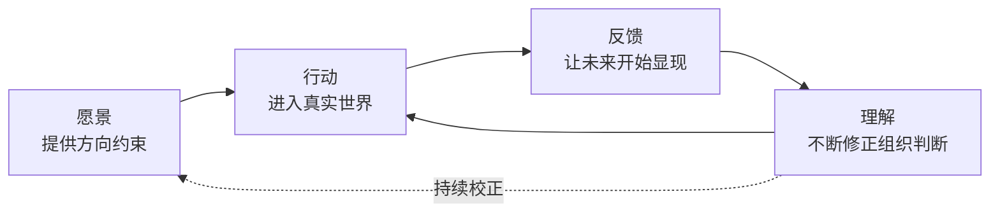

---
tags:
  - 读书笔记
  - 曾鸣
  - 智能战略
  - 战略生成
  - 愿景化
  - 张力机制
source: 《智能AI时代的商业、组织与战略的本质》曾鸣 著（中信出版集团）
chapter: 5
---

# 05 - 智能战略：愿景驱动的战略生成

> 上一节：[[04 - AI 时代的组织新逻辑]]
> 下一节：[[06 - 新文明的起点]]

本章是全书的战略方法论：**战略从"制定"变成"生成"**。核心结构是 **愿景 → 行动 → 反馈 → 理解** 的循环，加上 **算法·算力·数据** 三要素，以及维持循环不塌陷的 **张力机制**。

## 1. 从规划到发现：战略范式的历史跃迁

### 1.1 一个反常现象

> 那些**战略体系很完整、规划很清晰**的企业开始碰到大困难，而一些**看上去路径并不清晰、甚至在不断调整方向**的公司却发展得越来越好。

### 1.2 三个时代的战略逻辑

| 时代 | 环境特征 | 战略核心任务 |
|---|---|---|
| **工业** | 技术进步缓慢、产业结构稳定、需求增长线性 | **预测与规划**：尽可能准确描绘未来，围绕预判配置资源。认知前提是"提前把未来规划好" |
| **互联网** | 信息流动加快、用户行为多变、竞争边界模糊 | **适应变化**：敏捷、迭代、快速试错——承认变化存在，用更快反应保持竞争力 |
| **AI** | 技术能力跃迁式打开新可能性边界；用户行为非线性；商业从匹配需求转向意图实现 | **未来不再是一个等待被观察、被解释的对象，而成为一个在行动与反馈中不断生成的过程** |

> 很多关键变化**并不是先在外部环境中发生、然后被企业识别出来的，而是在企业的行动过程中逐步显现出来的**。
> 因此战略所面对的不再是一个可以通过更好分析来理解的未来，而是一个**在参与中不断生成的未来**。

**错位的本质**：
> 企业试图通过**预测**来获得确定性，通过**规划**来控制路径，但它所描述和控制的对象却**在不断变化甚至尚未形成**。

### 1.3 反面案例：Chegg

- 曾经是教科书式成功：清晰定位于学生学习支持市场，稳定的内容与服务体系，订阅模式持续增长；有明确用户群、清晰价值主张、可预测增长路径。
- 生成式 AI 出现后，当基于大模型的问答系统能以**接近零边际成本**提供即时、个性化解答时，学生获取知识的方式被根本改变。
- **"内容供给 + 订阅服务"模式在几个月内迅速失去吸引力。**

> **问题不在于 Chegg 没有战略，而在于它的战略建立在一个前提之上：学习支持的基本方式不会发生结构性变化。** 当这一前提被打破时，原本严密的战略体系几乎在一夜之间失效。
> 类似现象出现在法律服务、翻译、内容生产等多个领域。**许多企业并非没有战略，而是它们的战略试图在一个已经发生变化的世界中依然用原有的逻辑来定义未来。**

### 1.4 正面案例：在行动中让路径显现

**OpenAI**：
- 明确方向是探索通用人工智能，但一开始并不清楚路径 → 在**即时战略游戏、机械手、强化学习测试平台**等多个领域不断尝试
- 看到 Transformer 的潜力后**马上聚焦**大模型训练，推出 GPT-1，摸索出 **Scaling Law**，带来大模型领域爆发
- **ChatGPT 的成功同样不是战略规划的结果**：最初只是研究人员用于测试模型能力的尝试，并未被明确定义；产品推出后用户快速涌入，使用行为释放的信号**远超原有预期**，公司因此在极短时间内调整重点方向

**亚马逊**：AWS 的诞生、后续多个核心业务的形成，都不是一次性规划的结果，而是在长期实践中逐步走出来的。**愿景提供了方向约束，但具体路径始终处于开放状态。**

> 真正起作用的并不是某一次看对未来的判断，而是**公司能够在行动中捕捉反馈，并据此快速调整方向的能力**。
> 战略不再能够通过一次性的分析与规划来完成，而**必须在持续的行动中被不断修正和生成**。
> 如果说工业时代的战略是先看清未来再组织行动、互联网时代的战略是在变化中不断调整，那么在 AI 时代，**战略的本质正在转向：在高度不确定性中持续进行高质量选择**。

## 2. 愿景：给出解释框架与方向约束

### 2.1 传统愿景为什么只是符号

> 许多公司把愿景理解成一句鼓舞人心的表达、一种组织动员的语言，或一个长期目标的高度概括。愿景被写在墙上，出现在年会和融资材料里，**但在真正的战略讨论中，它往往并不参与实际战略取舍**。
> 企业做选择时依靠的仍然是：市场规模、竞争格局、财务模型、资源能力和短期机会。

在稳定世界里这不奇怪：产业边界清晰、增长路径可预测时，战略可以主要依靠分析形成，**愿景更多承担激励作用，而不是判断作用**。

> 然而在生成性世界中，这一切发生了根本变化：**企业最缺的不是信息，而是理解信息的框架。**
> 信息越多，组织越容易陷入混乱；选择越多，组织越容易被短期机会牵引；反馈越密集，组织越容易在局部信号中失去方向。

### 2.2 第一重作用：解释框架

> 面对同样的技术突破、用户反馈和市场信号，**不同愿景下的组织会看到完全不同的意义**。

| 愿景 | 看到大模型能力提升时的反应 |
|---|---|
| 把 AI 理解为**效率工具**的公司 | 最自然的反应是**降本增效** |
| 把 AI 理解为**新商业系统入口**的公司 | 思考的可能是**用户意图、任务完成、供给重构和新的平台形态** |

> 信号本身并不会自动告诉你它意味着什么。**真正决定组织如何解读信号的，是组织对未来的基本理解。**
> 愿景不是告诉组织未来一定会发生什么，而是**我们选择相信什么样的未来**。

**没有解释框架的后果**：
> 今天看到一个热点，就成立一个项目；明天看到一个竞品的动作，就调整一个方向；后天看到资本市场的变化，又重新定义战略重点。
> **表面上看，这样的组织反应很快，实际上它并没有战略，只是在被动响应变化。**

### 2.3 第二重作用：方向约束

> 战略从来都是在**资源有限、时间有限、认知有限**的情况下，决定什么更值得做、什么必须暂时放弃。**越是不确定，取舍越难。**
> 没有愿景，组织会把**"可能正确"误认为"应该投入"**，结果是资源被摊薄、团队被分散、长期能力无法积累。

> **在 AI 时代，愿景不是战略之外的表达，而是战略内部的判断机制。** 它既不是目标，也不是预测，而是一种**方向性的预判**。

### 2.4 核心张力（本章最关键的一段）

> **战略建立在对未来预判的基础上，但不能依赖这种预判的正确性。**

| 极端 | 后果 |
|---|---|
| **没有预判** | 就没有方向。"拒绝判断未来的组织，就像放弃判断风向的船。" 而这些判断不可能等未来完全清楚之后再做出——**等一切都被证明，战略机会也就消失了** |
| **盲目相信自己的预判** | 未来越是生成性的，具体判断越可能被现实证伪（技术路径改变、用户行为跳变、竞争格局重组、监管转向、生态关系被新平台重写）→ **故步自封、战略僵化** |

**成熟的战略能力**：
> 既敢于给出方向，又不迷信自己的判断；既愿意做长期选择，又始终让现实反馈来修正自己的预判；既不因为不确定而放弃行动，又不因为已有判断而拒绝学习。

### 2.5 愿景化（visioning）> 愿景（vision）

> **愿景是一个结果，容易被固化；愿景化则是一个过程**，它要求组织不断回到现实中，重新理解其含义。

- **阿里案例**：2007 年提出未来十年愿景是"打造开放、协同、繁荣的电子商务生态系统"。**这句话十年没变，但我们对其中每一个词的含义的理解都是在不断变化和深入的。**
- 结论：**愿景的表述可以相对稳定，但组织对愿景的理解必须不断深化。**

> 这也可以解释为什么许多公司并不缺愿景描述，却缺乏真正的战略方向：它们有漂亮的使命宣言、宏大的长期目标、关于未来的热情表达，**但这些并没有成为战略决策的有机部分，没有成为取舍标准，也没有在现实反馈中被不断修正。这样的愿景只是符号，不是系统。**

**愿景如何改变机会的判断标准**：
> 一个机会是否值得做，**不再只看市场空间有多大，也不看短期回报有多高**，而要看：它是否**强化了组织对未来的长期判断**？是否帮助组织**积累了面向未来的关键能力**？是否让组织**更接近它所相信的那个方向**？
> **真正重要的战略选择并不是那些看起来最赚钱的事情，而是最能把组织带向未来的事情。**

- **淘宝案例**：2008—2012 年不少重大选择都是围绕"**是否开放**"这个原则展开的激烈讨论而做出的。
- **特斯拉**：原始愿景不是做一家成功的电动车公司，而是**推动世界向利用可持续能源转型**。它不能只满足于在高端汽车市场找到细分定位，必须证明电动车**不仅环保，而且可以在性能、体验和技术上超越燃油车**；必须不断推动电池、软件、制造、充电网络和能源系统的协同演进。
- **SpaceX**：愿景是**实现人类多星球生存**。它强烈约束了对技术、成本和工程组织方式的选择——为什么必须大幅降低发射成本？为什么火箭重复使用不是可选项而是核心方向？为什么要以极高密度进行工程迭代？**这些选择孤立看风险巨大，但放在这个长期愿景下，就变成了组织必须持续逼近的方向。**

> **愿景绝不是脱离现实的空想；相反，愿景越远大，越需要通过现实反馈不断校正。**
> 传统战略把愿景当作美好目标，并不对规划产生直接影响；智能战略则把愿景**放在循环之中**，作为持续解释、持续取舍、持续修正的起点。

### 2.6 强愿景的最大风险

> **很多失败并不是因为组织没有愿景，而是因为愿景逐渐变成了组织解释一切的唯一框架。所有反馈都被用来证明原有判断正确，所有反常信号都被解释为短期波动。**
> **长期主义如果失去现实反馈，就可能从拥有明确方向滑向认知封闭。**
> 一个强愿景最大的风险，并不是方向不够坚定，而是**组织越来越难以承认现实正在挑战自己原来的理解**。

**必须记住的表述**：
> 愿景不应被理解为"我们相信未来一定会怎样"，而应被理解为 **"我们愿意基于怎样的未来判断持续行动，并愿意让行动反馈不断修正这一判断"**。
> **方向必须有，但方向不能变成执念；判断必须做，但判断不能被神化；行动必须坚定，但行动之后必须学习。**
> 这就决定了**愿景不再是创始人的表达能力，而是要成为组织的认知能力**。

### 2.7 第二重战略作用：认知对齐

> 在传统战略体系中，组织的共识建立在**答案一致性**之上。但在生成性世界中，这种共识结构很难成立，**原因很简单：没有人知道答案**。
> 真正可行的是另一种更深层的共识形式：**不是答案的一致，而是认知模式的对齐。**

- 对齐**并不要求**所有人都有一样的认知模式，而是**大家对各自的认知模式都有充分的理解，从而对各自决策的原因有很好的理解**——即**知其然，更知其所以然**。
- 当 AI 可以很好地帮助大家共享完整的上下文时，**决策的差别很大程度上源于各自认知模式的差别**。所以认知模式的对齐会极大提高整个系统认知共创的质量。

> 当一个组织对未来的基本理解一致时，它在面对不同具体问题时虽然给出的答案可能不同，**但判断的方向不会偏离**；产品团队、技术团队、业务团队在各自的局部决策中会自然朝着同一方向收敛。**这种收敛并不是来自指令，而是来自对愿景的共同理解。**

### 2.8 愿景退化为口号的三种典型路径（自检清单）

| # | 路径 | 表现 |
|---|---|---|
| 1 | **愿景与真实决策脱节** | 公开场合讲长期使命，内部决策真正起作用的是短期财务指标或局部业务目标。团队形成隐性认知："愿景是对外讲的，决定资源分配的是另一套逻辑" → **不但不能提供方向，反而削弱组织对战略的信任** |
| 2 | **愿景被当作固定答案，而不是持续过程** | 早期确立方向，环境变化后需要被重新理解甚至修正。若当作不可改变的信条，团队要么忽略新信号，要么通过各种解释证明原有判断仍然成立 → **降低对变化的敏感度** |
| 3 | **愿景过于抽象，无法转化为具体判断** | "成为行业领导者""为用户创造价值"几乎适用于任何公司，**却无法帮助团队在两个具体方案之间做出取舍** |

> 共同本质：**愿景没有成为一个可以在行动中被不断验证、修正和深化的过程，也就是缺乏愿景化。**

**Anthropic 案例**：从成立之初就把"构建安全、可控的通用人工智能系统"作为核心方向。
- 它不能直接转化为短期商业目标，也无法在早期通过市场反馈快速验证，但对所有关键决策产生深远影响：模型训练方法的选择、对齐机制的设计、产品发布节奏的控制、与合作伙伴的关系，甚至面对资本市场时的策略。
- **而且这一愿景并不是静态的**：随着模型能力提升，其对"安全"的理解也在变化——从早期的风险控制，到后来的对齐机制，再到如何在大规模应用中维持可控性。
- **关键不在于愿景是否发生了变化，而在于组织是否持续在行动中深化对愿景的理解。**

### 2.9 愿景的三重角色（小结）

1. **解释框架**——决定我们如何理解变化
2. **方向约束**——决定我们如何做出取舍
3. **一个持续被重构的过程**——使战略能够在行动与反馈中不断生成

> 战略的起点不再是分析，也不是规划，而是一个**可以被持续运作的愿景化过程**。
> **它不再是战略工具，而正在变成智能组织的认知基础设施。**
> 一旦愿景进入这样的过程，战略就**不再是想清楚再执行的结果，而是从行动开始，然后被一步步生成出来**。

## 3. 行动：战略生成的起点机制

### 3.1 行动的角色反转

| | 传统 | 生成性世界 |
|---|---|---|
| 行动的角色 | **执行**（先分析判断形成战略，再分解落实；衡量的是执行力）| **生成战略的起点机制** |
| 问题 | — | 如果仍把行动理解为执行，组织就在**执行一个尚未真正成立的战略** |

**许多公司的典型困境**：
> 花大量时间做分析、写方案、制定路线图，希望在行动之前降低不确定性；但进入市场后发现关键变量变了：用户行为与预期不符、技术路径出现新可能性、原有规划需要被推翻。
> 于是**战略不断重写、行动不断中断，组织在"重新规划—再执行"的循环中消耗大量资源，却始终难以形成持续积累**。

> **问题不在于分析得不够，而在于分析无法替代行动带来的认知增量。**

### 3.2 为什么行动不可替代

> 任何一个尚未成熟的领域，其关键变量都隐藏在真实使用场景中：用户在什么情境下产生需求、需求如何被表达、产品如何被理解、价值如何被感知、哪些细节决定留存、哪些体验触发扩散——**这些问题很难通过调研或推理提前完全掌握**。
> **行动的价值不在于把事情做完，而在于让原本不可见的未来开始以具体信号的形式显现出来。**

**AWS 案例**：
- 并非战略规划中提前确定的方向，而是源于内部技术能力在实践中的不断积累；能力逐渐稳定后，团队在实际使用中意识到它们具有对外开放的潜力，于是**凭借非常有限的功能进入市场**。
- 按传统逻辑，这一步会被认为"信息不充分、风险过高"。但正是这一有限的行动，让一系列关键反馈开始显现：**开发者是否愿意为这种基础设施付费？他们最在意的是成本、灵活性还是稳定性？哪些功能是真正的刚需，哪些只是技术团队的想象？**
- **行动并不是战略的后续步骤，而是战略逐渐浮现的前提条件。**

### 3.3 两种节奏

> 有的公司倾向于**等待更多信息**，试图在行动之前降低风险；有的公司则**更早开展行动**，通过实际尝试来获得认知优势。
> 前者看似稳健，但往往**错过关键窗口**；后者看似激进，但通过更高频的行动与反馈循环，能更快逼近有效路径。

> **行动是连接组织与未来的唯一接口。** 没有行动，愿景无法被检验；没有行动，反馈无法出现；没有行动，战略就只能停留在假设层面。

### 3.4 对组织的新要求

- 行动不再是执行部门的责任，而应成为**整个战略系统的组成部分**
- 需要设计机制，使行动能够**被快速启动，同时又能被有效观察**
- 需要**允许一定程度的试错，同时确保试错可以转化为认知积累**
- 需要在**局部探索与整体方向之间保持平衡**，使行动既不失控，也不被过早收敛

> 战略与行动的关系被重新定义：**战略不再通过行动被执行，而是在行动中被不断生成。**
> 愿景提供初始方向，行动触达真实世界，反馈揭示未来信号，理解逐步修正判断。**整个过程不是线性的，而是循环的。**

## 4. 反馈：未来显现的真实信号

### 4.1 反馈的意义反转

| | 传统 | 生成性世界 |
|---|---|---|
| 反馈的用途 | **评估执行效果**（收入、份额、留存、成本是否达成目标）| **揭示未来是如何形成的**——它不是对过去的总结，而是**对未来的提示** |
| 隐含前提 | 预期本身相对可靠（战略一开始就对未来做出较清晰判断）| 预期只是一个**暂时性假设** |

> 如果仍然把反馈理解为"是否达成预期"，组织就会**不断在验证一个本来就不稳定的目标，而忽略了更重要的信息——现实正在发生变化**。

### 4.2 最有价值的是"偏离预期"的信号

> 最重要的反馈**不是符合预期的信号，而是那些偏离预期、甚至与预期相矛盾的信号**。
> 这些信号在传统管理中往往被视为问题、需要被纠正或消除，但在生成式战略中，**它们恰恰可能是最有价值的信息来源**——因为正是这些偏差，揭示了**原有判断的局限性，以及新的可能路径**。

**ChatGPT 案例（反馈驱动产品的极致样本）**：
- 上线后短短几周，大量此前从未被预设过的使用方式涌现：写代码、改论文、做作业、生成营销文案、当搜索引擎、协助制订商业计划、当持续对话的工作伙伴……
- **Prompt Engineering 几乎是用户自发创造出来的**：从像聊天一样输入问题，到给模型设定角色、要求分步骤推理、提供上下文、用 few-shot examples 引导输出，逐渐形成一套接近**自然语言编程**的交互方式。
  - **深刻信号**：用户并不是在使用一个软件工具，而是**在学习如何调用一种新的智能能力**。
  - **在传统软件时代，用户需要学习软件的操作逻辑；在 ChatGPT 这里，用户开始学习如何表达自己的意图。系统与人，逐渐从操作界面变成意图交互的对象。**
- **很多真正重要的产品方向并不是 OpenAI 先定义出来的，而是用户先"用"出来的**：大量开发者直接用它写代码、调试、解释复杂逻辑；后来广泛流行的 **AI coding workflow**，本质上不是某个产品经理提前规划出来的，而是在用户的不断试探、反馈中逐渐形成的

> OpenAI 原本看到的也许还是一个**更强的模型**，但用户"用"出来的却是一种**新的交互范式**：自然语言可能正在成为新的通用接口。
> 一旦人与数字世界之间的主要交互方式从**菜单、按钮、搜索框**转向**表达意图**，那么很多原本稳定的软件结构、产品边界和平台关系都可能被重新定义。

> 组织真正需要的并不是一开始就具备看对未来的能力，而是**在进入真实世界之后，能够不断从用户行为中重新理解未来的能力**。
> 反馈的价值**不在于告诉组织现在做得好不好，而在于帮助组织理解未来的使用模式正在如何演化**。

### 4.3 生成式战略对反馈的更高要求

> 不仅要求组织能够**收集数据**，还要求能够**识别哪些信号具有意义**；不仅要看到**结果**，还要理解**结果背后的机制**；不仅要关注**平均情况**，还要对**反常现象**保持敏感。
> **反馈不再只是信息，还是一种需要被解释的输入。**

**反馈的三大作用**：① 揭示未来正在如何形成；② 暴露原有判断的局限性；③ 为新的理解提供原始材料。
→ **但这些作用只有在被有效解释时才会发挥价值。**

## 5. 理解：在反馈中重构对未来的判断

> **理解才是战略真正发生的地方。**

| | 传统 | 生成性世界 |
|---|---|---|
| 理解的位置 | **行动之前**（收集信息、研究市场、判断趋势、形成结论，然后制定战略）| **只能在行动、反馈与再行动的循环中不断形成** |
| 理解的性质 | 分析的结果、对已有信息的总结 | **在不完整、变化中，甚至在相互矛盾的反馈里持续重构对未来的判断** |

**很多公司的症状**：
> 拥有大量数据，但并没有形成战略理解：可以看到无数指标变化，却不知道这些变化背后代表什么；可以做出很多复盘，却没有更新对未来的判断；可以迅速响应用户反馈，却不知道哪些反馈应该被放大、哪些应该被忽略。
> **数据越多，组织越容易陷入局部最优**——每一个局部数据都在要求组织行动，每一个用户声音都看似合理，每一个短期机会都似乎值得尝试。
> 如果没有更深层的理解，**组织就会被反馈牵着走，而不是在反馈中生成战略**。

### 5.1 第一层：重新定义问题的能力

> 在不确定环境中，企业经常以**错误的问题**开始行动。不是因为管理者不聪明，而是因为**问题本身尚未稳定**。

**大模型刚出现时的"旧框架问题"**：能不能提高写作效率？能不能降低客服成本？能不能替代一些知识工作？
**更重要的可能是**：AI 会不会成为新的任务入口？自然语言会不会成为新的操作界面？企业软件会不会从**流程驱动**转向**意图驱动**？组织中的决策和执行边界会不会被重新划分？

**亚马逊的 6 页叙事文档机制（极重要的方法论）**：
- 做法：重要业务会议**不能用 PPT**，要求团队提前写好完整的 **6 页叙事文档**；会议开始时所有人先**安静阅读 20–30 分钟**，再进入讨论。
- **机制最有意思的地方不是形式，而是它代表一种完全不同的战略观**：
  - 传统会议目标通常是**达成决策**，强调效率——谁逻辑更强、数据更充分、职位更高，谁就更容易推动决策
  - 叙事文档机制**本质上并不是为了更快形成答案，而是为了让组织更深入地理解问题**
- **为什么**："在生成性世界中，真正困难的从来不是选哪个答案，而是问题本身到底是什么。"
- PPT 天然倾向于**展示结论**，而真正复杂、不确定、尚未稳定的问题**恰恰不能太快进入结论**。6 页叙事文档要求完整展开：为什么会出现这个变化；背后的机制是什么；用户行为为什么会这样；哪些假设成立、哪些可能无法成立；如果关键条件变化会发生什么。
- **本质是在倒逼组织把理解过程显性化**：真正困难的不是写结论，而是**写清楚"为什么"**——只要开始展开"为什么"，很多原本看似确定的判断很快就会暴露出问题。

**问题重构的威力（AWS 例子）**：
| 问题 | 讨论重心 | 结果 |
|---|---|---|
| "云计算市场有多大？" | TAM 多大、收费模式、哪些行业先采用 | 停留在市场测算 |
| **"开发者为什么愿意放弃自己管理服务器？"** | 企业真正痛点是什么、技术团队为什么讨厌采购服务器、为什么弹性扩展重要、为什么 API 化调用会改变开发方式、为什么计算资源会从**资产**变成**服务** | **进入更深层的理解** |

> **问题一旦改变，战略就改变了。**
> 贝佐斯经常连续追问"为什么"，很多看上去已经很完整的方案，在连续追问之后会突然暴露出一个惊人的事实：**团队其实在用旧世界的逻辑理解新世界。**

> 这也是亚马逊强调 **mechanism-based understanding（机制性理解）** 的原因：在一个高度变化的环境中，**单纯的数据和结果其实很危险**。
> 一个指标上涨了，可能是长期趋势，也可能只是短期噪声；一个产品增长了，可能是结构性机会，也可能只是渠道红利；一个用户行为出现了，可能代表未来，也可能只是偶然现象。
> **所以特别强调不只是"发生了什么"，更重要的是"为什么会发生"。**
> 叙事文档本质上就是一个**组织化的机制性理解**——它的价值不在于提高表达质量，而在于让不同团队对现实的理解能够被**持续暴露、碰撞、修正和重构**。
> **传统战略会议很多时候是在销售观点，而亚马逊更像是在共同生成理解。**

### 5.2 第二层：识别反馈背后的结构，而不是停留在反馈表面

> 在生成性世界中，反馈通常是杂乱的。**用户说想要某个功能，并不一定意味着这个功能重要；用户不使用某个功能，也不一定意味着这个方向没有价值。**
> **许多真正重要的机会，最初都不会以清晰需求的形式出现，而是以误用、绕路、反常行为、极端用户案例的形式出现。**

**关键区分**：

| 表面 | 更深一层 |
|---|---|
| 用户不断用对话框完成超出原设计范围的任务 → "用户乱用" | 用户**并不想在多个软件之间跳转**，而是希望用自然语言直接表达意图，让系统帮助完成任务 |
| 企业软件中某个自动化功能使用率不高 → "功能失败" | 用户**不是不需要自动化，而是不信任系统在关键节点上替自己做决定** |

> **这两种理解会带来完全不同的产品方向。战略理解的核心，就在于能不能穿透表面反馈，看到背后的机制。**

**洞察 ≠ 理解**：
> 组织往往会先获得大量**零散的洞察**（关于某个用户行为、某种使用方式、某个局部成功或失败的解释），但这些洞察本身是碎片化的，甚至可能相互矛盾。
> **战略的关键不在于收集更多洞察，而在于从这些洞察中提炼出具有稳定性的结构性理解。**

> **理解永远离不开愿景**：没有愿景，反馈只是无数碎片；有了愿景，组织才知道哪些反馈值得深入解释。
> 愿景**不是用来压制反馈的**，而是帮助组织从反馈中识别意义的。它让团队不至于被每一个局部信号带偏，也不至于因为平均指标不好看而**错过真正重要的反常信号**。

> 组织带着一个方向进入现实，然后让现实不断修正自己对方向的理解。
> **理解不是"我原来判断对了"的证明，而是"我原来的判断需要怎样被修正"的过程。**
> 一个成熟的战略系统，最重要的不是不断证明自己正确，而是**不断发现自己对哪里理解得还不够**。

> **这一点听起来容易，实践起来却极难，因为组织天然倾向于寻找支持原有判断的证据。**
> 一个强愿景如果没有反馈机制，很容易变成**自我确认**；一个强创始人如果没有组织化的理解机制，也容易把反馈解释成对自己判断的支持。
> **真正高质量的战略理解，要求组织既有方向感，又有自我修正能力。**

> **战略生成系统要解决的问题：不是让组织永远做出正确判断，而是让组织持续提高判断质量。**

## 6. 战略生成系统 = 算法 + 算力 + 数据

### 6.1 从"能力"升级为"系统"

> 愿景、行动、反馈与理解本来就一直存在于企业经营之中，过去的优秀企业同样会观察用户、调整产品、修正方向。**真正发生变化的不是这些要素第一次出现，而是它们之间的关系正在被 AI 彻底重构。**

**为什么不能靠个体**：
> 在传统战略体系中，战略能力高度依赖个体（优秀创始人、经验丰富的高管、敏锐的战略团队）。
> 但在生成性世界中，**反馈的数量与复杂度已经远超个体可以处理的范围**（高频、多维甚至相互矛盾）。没有任何个人能在有限时间内全面理解并持续更新判断。
> 如果战略依赖个体判断，就会产生两个后果：**要么所有信息因为必须集中处理，所以决策过慢；要么信息在传递过程中被简化或过滤，导致决策失真。**

> **战略循环必须从能力升级为系统**——一个可以持续吸收信息、生成理解、更新判断并指导行动的结构。它不依赖某一次灵感，而是依赖持续运行；不依赖某一个人，而是依赖整体机制；不追求一次性正确，而是追求不断逼近。

### 6.2 类比：大模型的能力 = 算法 + 算力 + 数据

> 一个大模型的能力并非来自某一个聪明的算法或某一组优质数据，而是三者的结合。算法决定如何学习与推理，算力决定能处理多大规模的信息，数据不断提供新输入。**战略生成系统，本质上也是类似的结构。**

#### （1）算法：战略的方法论

> 算法是组织面对不确定性时进行判断的基本逻辑：如何提出问题、如何设计行动、如何解释反馈、如何更新理解、如何进行取舍。
> 核心能力包括：**是否能够区分信号和噪声、是否能够识别反常反馈的价值、是否能够把局部洞察整合为结构性理解、是否能够在不确定中保持方向约束。**

**算法如何落地**：把方法固化为**可重复执行的决策协议**。
- **亚马逊叙事文档机制**：表面上只是沟通形式改变，实质上是在强制执行一套战略算法——必须明确问题定义而不是直接给结论；必须写清楚关键假设而不是隐含在逻辑中；必须区分事实与判断；必须解释因果关系而不是罗列数据。
- 讨论重点不是**是否同意结论**，而是不断**拆解假设、挑战逻辑、重构问题**。这一机制的关键价值在于把"认知模式对齐"**结构化、流程化**了。
- **更轻量的落地方式**：
  - 每个重要实验前，明确写下所要验证的**核心假设**是什么，一旦被否定又意味着什么
  - 复盘时不要只问结果好不好，而要问**原来理解的问题是否需要被重写**
  - 做资源决策时，要说明**这个投入强化了对未来的哪一个判断**

#### （2）算力：参与决策的能力规模

> 在传统组织中，战略判断集中在高层，**算力是稀缺的**；在 AI 时代，决策输入来自组织各个层面：一线团队掌握用户反馈，工程团队掌握技术边界，产品团队理解使用场景，数据团队分析行为模式。**如果这些能力不能被纳入同一系统，组织就会出现有信息、无判断的状态。**

- 扩大算力 = **让更多节点参与理解过程**，但**并不意味着人人独立决策**，而是通过机制使不同层面的认知被汇聚、碰撞与修正
- 英伟达的直接汇报设计：减少信息在层级中的损耗，让决策层共享同样的信息
- **AI 时代算力可以进一步扩大**：越来越多"**硅基员工**"（AI 智能体）开始参与信息处理与初步判断——自动从用户行为中提取异常模式、在大量实验中识别潜在结构性变化、对不同假设进行模拟与对比
- **但算力的扩展并不等于去中心化**，关键在于让更多**高质量判断**进入系统，同时通过机制进行**整合与收敛**

#### （3）数据：持续输入的真实反馈

> 没有真实世界的数据，战略就只能停留在假设层。数据不仅包括量化指标，还包括**用户行为、使用路径、异常案例、失败实验**等多种形式。
> **关键不在于数据量本身，而在于是否能够持续、真实地反映组织与环境的互动。**

- 传统管理中数据主要用于**绩效评估**（是否达成目标、哪个指标升降）——在稳定环境中有效，但在生成性世界中**只能反映结果，无法揭示变化的方向**
- 特斯拉自动驾驶是极致体现：每一辆车持续产生真实世界数据，这些数据**不仅用于评估系统表现，还用于识别新的问题与场景**——哪些情况系统无法处理、哪些极端情况具有代表性、哪些行为模式需要被重新建模
- **关键也不在于数据量，而在于数据是否能够被转化为问题**
- 产品与商业场景中的同类做法：不仅看整体留存，还要**持续追踪异常高留存的小群体**；不仅看功能使用率，还要**观察被用户反复绕用的路径**；不仅看转化率变化，还要**分析用户决策逻辑是否发生改变**
  → **本质是把数据从"结果指标"转化为"理解入口"**

#### （4）三者统一

> 当算法、算力与数据形成统一时，战略循环就会变成**战略生成系统**：
> - 愿景不再是一种表达，而是成为**算法的一部分**
> - 行动不再是单纯的执行，而是成为**数据生成机制**
> - 反馈不再是评估的一部分，而是成为**持续的输入**
> - 理解不再依赖个体，而是成为**算力运作的结果**

> **真正有用的不是制定一个更好的战略，而是打造一个能够持续生成好战略的系统。**
> 没有系统，战略就只能依赖个体判断；有了系统，战略才可能在不确定中不断逼近真实结构。

#### （5）为什么只有现在才可能

> 这样的战略生成系统在过去是不可能的，**原因很简单——运营成本太高**：反馈信息的及时收集、全面整理、细颗粒度分析需要巨大的信息处理能力；信息的快速分享与理解需要高效的组织协同机制；高质量的决策与行动需要持续的认知投入。
> **只有 AI 技术的进步才使得这一切成为可能**：大模型能处理海量非结构化信息，智能体可以持续跟踪用户行为与环境变化，AIOS 可以支撑复杂信息的实时协同。

## 7. 张力机制：在长期方向与现实反馈之间保持一致

### 7.1 约束机制的变化

| | 传统战略 | 智能战略 |
|---|---|---|
| 约束机制 | **规划与目标**（长期规划、年度预算、关键指标，把未来拆解为可执行任务）| **持续存在的张力** |
| 前提 | 未来可以被拆解 | 未来本身在不断生成 → 要么拆解出的路径很快过时，要么组织被既定目标锁定，无法对新信号做出反应 |

> **所谓张力，是接受两种力量的同时存在**：一方面，组织必须有**长期方向**，否则行动会碎片化；另一方面，组织必须持续根据**现实反馈**修正判断，否则方向会脱离现实。
> **这两种力量之间不可能通过一次性选择来解决，只能通过持续探索来平衡。**

> 很多传统管理工具试图把这种张力"**消除**"：要么强调长期、坚持既定方向不被短期波动干扰；要么强调灵活、快速响应变化随时调整策略。**但真正有效的智能战略并不偏重任何一方，而是在两者之间建立一种动态平衡。**

### 7.2 看十年、想三年、干一年

| 层 | 对应 | 真正的含义 |
|---|---|---|
| **看十年** | **方向约束** | 不是预测细节，而是**选择方向**（我们相信什么趋势、愿意在哪个方向持续投入、希望成为什么样的存在）——这就是**愿景化** |
| **想三年** | **两者之间的张力区** | **不是简单的中期规划，而是不断把长期方向与短期行动对齐的过程**：当前行动是否在逼近我们对未来的判断；如果继续这样做三年后会走到哪里；现实反馈是否意味着我们对未来的理解需要调整。**这个中期层本质上就是战略生成发生的地方** |
| **干一年** | **现实行动** | 面对当前资源、能力与环境做出具体选择：今年做什么、不做什么、优先级如何安排。**必须完全嵌入现实，接受反馈约束** |

> **很多公司容易把它理解成 3 个独立时间维度的规划（十年是愿景、三年是战略、一年是执行）——如果这样理解，就回到了传统线性逻辑。重要的不是 3 个时间维度，而是三者之间持续存在的张力。**
> - "看十年"**不是为了把未来定下来，而是为了约束当下的选择**
> - "干一年"**不是为了完成任务，而是为了获取反馈**
> - "想三年"**不是为了制订中期计划，而是为了不断校正两者之间的关系**

**特斯拉的具体印证**：
- 愿景（推动世界向可持续能源转型）在较长时间内保持稳定 → "看十年"层级，为所有重大决策提供方向约束
- 具体路径上并没有按既定计划线性推进，而是不断调整：**先从高端车型切入再逐步下沉；在自动驾驶上不断试探不同技术路径；在电池与能源体系上持续迭代**
- 这些调整**并不是方向的摇摆，而是在张力中的动态校正**。每一轮行动都在检验原有判断（用户是否愿意为电动车付费、性能与体验能否超越燃油车、自动驾驶实现路径是否需要调整），这些反馈又反过来影响它对未来的理解

> **如果只有长期方向而缺乏反馈校正，愿景很容易变成口号；如果只有短期行动而缺乏方向约束，组织则会陷入机会主义。**
> **张力不是不稳定，而是一种更高层的稳定：方向稳定，路径动态；原则稳定，选择演化。**

### 7.3 组织天然倾向于消除张力

> **组织天然倾向于消除张力，而不是维持张力。**
> 长期方向带来的不确定性，会让人希望通过**明确目标**获得确定感；现实反馈带来的复杂性，则会让人倾向于**快速调整**，避免持续的不一致。
> 在这两种压力之下，张力很容易被简化为某种极端：**要么变成僵化执行，要么变成随波逐流。**

**真正挑战在于设计机制，让张力成为组织的常态而不是例外。三个层面**：

| # | 层面 | 做法 |
|---|---|---|
| 1 | **把张力嵌入决策，而不是留在讨论中** | 让每一个重要决策都同时面对两个问题：① 这个决策是否强化了我们对**长期方向**的判断？② 这个决策是否基于**当前真实反馈**，而不是抽象假设？ **大多数决策只能面对其中一个**：要么项目看起来符合长期愿景但没有真实用户验证就提前投入大量资源；要么某个短期机会带来快速增长但与长期方向无关。 具体落地：资源评审时不仅要求说明 ROI，还要求说明**这个投入如何强化我们对未来结构的理解**；评估新机会时不仅看市场空间，还要看它是否让我们更接近长期判断 |
| 2 | **通过中期层（"想三年"）持续校正** | 最容易忽视的一层。很多公司要么直接从愿景跳到年度执行，要么把中期规划做成静态文件 → 结果是长期方向与短期行动之间缺乏连接，**愿景变成口号，执行变成任务**。 运作形式：**周期性的战略共创会**，讨论重点不是汇报进度，而是围绕：如果我们继续当前路径三年后会走到哪里；最近的关键反馈是否挑战了我们对未来的理解；是否出现了新变量使原有判断需要被调整；当前资源配置是否仍然反映我们的方向选择。**这些问题没有标准答案，也不要求快速形成共识，价值在于让组织持续感知张力** |
| 3 | **创始人与高管的角色：不是做选择，而是维持张力** | 传统战略中创始人的核心角色是**做出关键选择**；智能战略中他们不再只是选择者，还是**张力的维护者**。 需要同时做两件看似矛盾的事： ① **持续强化方向**（反复解释愿景、明确优先级、在关键节点上做出取舍、让团队知道什么是不能动的） ② **持续引入现实**（鼓励不同声音、重视反常反馈、允许对既有判断提出挑战，甚至在必要时主动推动方向修正） |

> 在特斯拉和 SpaceX 的实践中，长期方向非常明确，但具体路径会不断通过实验与反馈调整。**关键在于，这些调整始终在一个强方向下进行，而不是在多个方向之间摇摆。**
> **创始人的作用不是替组织消除不确定性，而是让组织能够在不确定性中持续运转。**

### 7.4 张力作为战略的持续引擎

> 战略在 AI 时代的核心，**不再是做出某个正确选择，而是在方向与反馈之间持续维持张力，并在这种张力中不断提高决策质量**。
> **张力并不是战略中的问题，而是战略的引擎。**

> "看十年、想三年、干一年"**并不是一个时间管理工具，而是一个持续运行的约束结构**。它让组织始终同时面对 3 个问题：我们相信的方向是什么？我们正在做的事情是什么？这两者之间的关系是否需要被重新理解？
> **只要持续追问这 3 个问题，战略就不会停滞。**

## 8. 战略共创

### 8.1 共创文化

> 共创的初级版本就是**创业公司早期的样子**：大家随时随地可以展开讨论，知道什么问题可以找谁，没有什么层级和部门的阻碍，每个人都主动担当。只是随着规模扩大，科层制、规范的职业管理逐渐取代了共创模式。
> 这两年常被提到的"**回到创始人**"模式，其实要求的不仅是创始人回到公司亲自管理，更重要的是**整个公司回到初创的状态**。亚马逊反复强调的 **Day 1**，就是提醒全公司尽量保持创业时的状态和做法。

**为什么共创在 AI 时代成为必需**：
1. AI 技术的发展使得共创成为可能
2. AI 原生组织人数大幅缩减，有利于保持共创文化
3. 更重要的是：**AI 替代一般脑力劳动的速度会加快 → 组织中创智人才的比例会上升，重要性也在提高**
4. 案例：2026 年 5 月刚创立的 **Recursive Superintelligence（RSI）估值 46.5 亿美元，员工不到 30 人，但联合创始人就有 8 位**——代表硅谷的一种新趋势：公司发展对每个人的依赖、以及每个人之间的依赖大幅增加

> **就像愿景以前是奢侈品、现在是必需品一样，共创也在变成 AI 原生组织的标配。**

**传统"少数高层判断、多数人执行"的两个根本限制**：
| 限制 | 说明 |
|---|---|
| **信息分布不均** | 最接近用户和真实场景的信息往往掌握在一线团队手中；技术边界的变化更多由工程与研究团队感知；市场与生态变化分散在不同业务单元。**如果只有高层参与，绝大多数关键反馈在进入决策层之前就已经被过滤甚至丢失。组织看到的不是现实本身，而是经过多层加工后的摘要** |
| **反馈更新速度远超集中决策的处理速度** | 每一次循环都必须经过集中讨论和统一决策 → 组织很快被节奏拖慢。**等到结论形成，环境已经发生变化，理解和决策本身又需要被重新修正** |

> **一线员工的理解和判断，是战略生成系统的有机组成部分。**
> 黄仁勋要求员工**定期提交他们工作中最重要的 5 件事情**，就是试图了解员工的一手反馈和判断。公司尽可能给员工提供决策所需的**完整上下文**，就是让他们的分布式决策尽可能和公司的整体认知与信息对齐。

**共创的核心**：让不同层级、不同角色的员工用不同的方法，参与公司关于战略的各种讨论和决策。**组织既有集中的共识讨论和高层决策，也有各种分布式的决策。**

**Anthropic 的"篝火"模式**（谷歌知名程序员史蒂夫·雅吉采访几十名员工后的观察）：
> 这家公司如此成功的原因是其很特别的运行模式。员工**很像一群快乐的蜜蜂**，都在积极工作、贡献想法，每个人都尽可能透明协作。他们愿意这么做，因为他们知道自己在改变世界，而且周边都是同样优秀的同事。
> 公司**没有中心化的决策系统，也没有常规的组织结构**，表面上很混乱，但实际上非常高效。
> **一旦有个想法被认同，资源就会快速向这里集中，大家就像围坐在一堆篝火旁，即兴创作，一起把产品雕琢出来。员工通常围绕着几堆"篝火"在流动**，新的想法也不断产生并被尝试和选择。
> Anthropic 2026 年推出的大爆品 **Claude Cowork，就是在有了最初的想法后 10 天就上线了**。

**DeepSeek 案例**（引自甲子光年《DeepSeek 还有多少个"郭达雅"？》）：
- 内部**没有固定部门墙**，超半数研发作者在跨界，横跨 3 个及以上方向的有 79 人（总共 328 位研发作者）
- **组织层级很薄**，能让一批年轻人迅速在多个技术方向之间组队、探索、获取资源，较少受到约束和限制
- **顺序是反过来的**：大多数大厂会先设部门、定 KPI、分预算，再启动项目；DeepSeek 是**先有人觉得一个问题值得做，再围绕这个问题找人和资源**
- 梁文峰（2024 年 7 月接受暗涌 Waves 采访）："我们一般不前置分工，而是自然分工……当一个 idea 显示出潜力（时），我们也会自上而下地去调配资源。"

### 8.2 战略共创会（可操作的方法）

> **需要专门强调，战略生成系统中也需要有线下人和人的高强度、高质量的互动，而不能仅仅依靠 AI 系统。**
> 对于已经有一定规模的企业，如果想推动战略共创和生成，**开好线下的战略共创会是一个比较有效的冷启动方法**，也能够把共创文化推广开来。

**目的**：通过高质量、高强度的深度碰撞，产生**超出所有人预期的战略洞察和认知**。共创会是**群体智慧涌现的真实场域**，本质是释放创造力、共同创造新的认知；关键是**通过深度互动，让很难用文字清楚表达的场景知识和模糊认知得到充分的讨论**。

> 成功的共创会往往会形成强大的团队凝聚力。我有时半开玩笑地说，**没有比共创会更好的团建了**。
> 因为一般的团建都是用相对表面的方式试图实现情感连接；而关于战略的讨论**事关每个人的利益和公司未来的生死**，在这个过程中如果能产生实质性的深度讨论，所有人都有很强烈的参与感，必然会让大家产生很深的情感连接。
> 同时，大家由于深度参与了这些战略决策，**不但知道要做什么，还对为什么做有了很深的理解**，因此在执行过程中就可以创造性地发挥，让当下的战略结合自身工作要求，提出创造性的解决方案，执行效率也会有很大提升。

**共创会的门槛**：
> 共创会其实是**身心灵的极限运动**，所以开好共创会需要**以文化为基石**，要求参会者具备**真诚、求真、开放**的态度，以及足够的**勇气、深度与全身心的投入**。

**人员挑选：一场 20 多人的共创会，往往涵盖 5 类人群**

| # | 人群 | 代表什么 |
|---|---|---|
| 1 | **创始人和联合创始人** | 全局和长远方向 |
| 2 | **专业团队高管** | 该专业领域的深度和对专业未来的预判 |
| 3 | **关键的执行中层** | 确保决策的上传下达和跨部门协同沟通 |
| 4 | **民间的意见领袖** | 多为资深员工，虽未居高位，但与基层员工平等连接，可反映员工的真实感受和认知 |
| 5 | **业绩突出但可能直言不讳的一线员工** | 直面用户，能敏锐捕捉用户的痛点和长期得不到解决的问题 |

> 所有参会者都必须**真正有意愿、有信息、有兴趣、有能力**，唯有如此，思想火花的碰撞才有价值。这样精心的挑选，就是为了保证**参会者的多样性**。
> **共创会的核心就是丰富多样的输入和积极高质量的互动。**

**共创会 ≠ 常规战略会**：
> 它的目的是解决公司面临的**重大战略难题**——这个时候创始人和高管往往也没有什么好想法，所以**群策群力才很重要**。
> 经验之谈：如果选对了参会者，经过 **3 天**高效的思想与心灵的碰撞，**大概率都会出现一些意想不到的惊喜**。它的价值就在于**认知的突破和洞见的涌现**。

## 9. 战略新能力：从制定战略到生成战略

| | 工业时代 | AI 时代 |
|---|---|---|
| 战略能力 | 通过分析环境、判断趋势、选择定位，**在未来尚未到来之前找到正确方向** | **持续生成高质量决策的能力** |
| 本质 | **阶段性决策能力**（少数高层负责思考未来，组织围绕判断持续执行）| **一种学习过程**：持续进入真实世界，持续获取反馈，持续修正理解，持续更新判断 |
| 关键 | 某一次判断是否正确 | **组织能否持续做出高质量的决策** |

> 企业需要不断做出重要的战略决策，**因为前面的战略决策会严重影响后面战略选择的空间**，所以**连续决策的质量、快速纠错的能力**等变得非常重要。

**循环结构**：

> **战略不再只是一个规划未来的工具，它开始成为组织持续生成新认知的能力。**

**竞争层次的迁移**：
| 时代 | 竞争焦点 |
|---|---|
| 工业 | 产品、效率与规模 |
| 互联网 | 网络效应与生态 |
| **AI** | **组织智能之间的竞争**——谁能更快理解变化，谁能更快从反馈中学习，谁能更持续生成高质量的决策，谁能让整个组织在复杂环境中持续生成共同理解 |

> **战略从少数高层的工作变成整个组织的能力。**
> AI 时代的组织正在从传统机械系统演化为**共生智能体**；而本章讨论的**生成式战略，本质上正是这一组织形态的认知运行机制**。

> **过去，战略更像组织之上的大脑；未来，战略嵌入在系统中，体现在日常决策中，并随着时间不断积累，形成一种深层的差异。**
> 当技术越来越普及、工具越来越强、信息越来越透明时，**单次判断的优势会迅速被复制**，但一个组织的学习、理解和在不确定中持续生成方向等能力**却很难被简单模仿**。
> **未来的竞争不只是产品与市场的竞争，更是战略生成系统的竞争。**
> **未来真正强大的企业，也不再只是拥有一个好战略，还要拥有一个能够持续生成好战略的组织。**

## 10. 金句摘录

> - "许多企业并非没有战略，而是它们的战略试图在一个已经发生变化的世界中依然用原有的逻辑来定义未来。"
> - "企业最缺的不是信息，而是理解信息的框架。"
> - "表面上看，这样的组织反应很快，实际上它并没有战略，只是在被动响应变化。"
> - "拒绝判断未来的组织，就像放弃判断风向的船。"
> - "战略建立在对未来预判的基础上，但不能依赖这种预判的正确性。"
> - "等一切都被证明，战略机会也就消失了。"
> - "长期主义如果失去现实反馈，就可能从拥有明确方向滑向认知封闭。"
> - "一个强愿景最大的风险，并不是方向不够坚定，而是组织越来越难以承认现实正在挑战自己原来的理解。"
> - "方向必须有，但方向不能变成执念；判断必须做，但判断不能被神化；行动必须坚定，但行动之后必须学习。"
> - "不是答案的一致，而是认知模式的对齐——知其然，更知其所以然。"
> - "问题不在于分析得不够，而在于分析无法替代行动带来的认知增量。"
> - "过去商业从商品开始，现在商业从任务开始。"（见 [[03 - 一人千面：智能商业范式大变革]]）
> - "行动是连接组织与未来的唯一接口。"
> - "用户并不是在使用一个软件工具，而是在学习如何调用一种新的智能能力。"
> - "组织看到的不是现实本身，而是经过多层加工后的摘要。"
> - "传统战略会议很多时候是在销售观点，而亚马逊更像是在共同生成理解。"
> - "理解不是'我原来判断对了'的证明，而是'我原来的判断需要怎样被修正'的过程。"
> - "组织天然倾向于寻找支持原有判断的证据。"
> - "不是让组织永远做出正确判断，而是让组织持续提高判断质量。"
> - "真正有用的不是制定一个更好的战略，而是打造一个能够持续生成好战略的系统。"
> - "方向稳定，路径动态；原则稳定，选择演化。"
> - "张力并不是战略中的问题，而是战略的引擎。"
> - "创始人的作用不是替组织消除不确定性，而是让组织能够在不确定性中持续运转。"
> - "没有比共创会更好的团建了。"
> - "未来的竞争不只是产品与市场的竞争，更是战略生成系统的竞争。"

## 11. 我的行动清单

- [ ] 写出我自己的**愿景化**表述：不是"我相信未来会怎样"，而是"我愿意基于怎样的判断持续行动"
- [ ] 检查我的愿景是否已退化为口号（对照三种典型路径）
- [ ] 检查我的每一个重要决策是否**同时**回答了两个问题（强化长期判断？基于真实反馈？）
- [ ] 建立"想三年"的中期机制（如季度战略共创会），而不是直接从愿景跳到年度 KPI
- [ ] 识别当前**偏离预期的反馈**，并追问"为什么"
- [ ] 把关键复盘从"结果好不好"改成"原来理解的问题是否需要被重写"
- [ ] 把数据从"结果指标"改造为"理解入口"（追踪反常高留存小群体、被绕用的路径、决策逻辑变化）
- [ ] 组织一次 3 天共创会，按 5 类人群挑人

## 12. 相关链接

- [[00 索引 - 智能AI时代的商业、组织与战略的本质]]
- [[04 - AI 时代的组织新逻辑]]
- [[06 - 新文明的起点]]
- 概念卡片：[[概念 - 愿景化]] · [[概念 - 战略生成系统]] · [[概念 - 张力机制]] · [[概念 - 看十年想三年干一年]] · [[概念 - 战略共创会]] · [[概念 - 机制性理解]]
