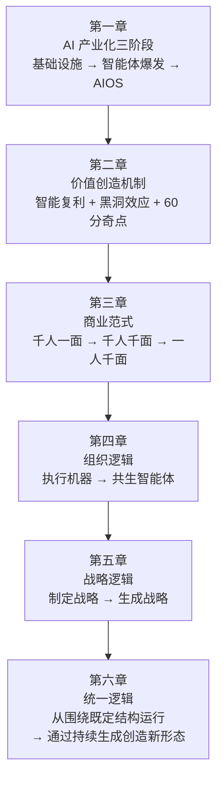

---
tags:
  - 读书笔记
  - 曾鸣
  - 新文明
  - 智能主体
  - 持续生成
source: 《智能AI时代的商业、组织与战略的本质》曾鸣 著（中信出版集团）
chapter: 6
---

# 06 - 新文明的起点

> 上一节：[[05 - 智能战略：愿景驱动的战略生成]]
> 返回索引：[[00 索引 - 智能AI时代的商业、组织与战略的本质]]

本章是全书的收束：前面几章讨论的**并不是几个彼此独立的变化**，它们本质上都在回应同一个更深层的系统性转变——**世界从围绕既定结构运行，转向通过持续生成来创造新形态**。

## 1. 新文明的根本变化：人类第一次开始创造智能本身

### 1.1 过去所有技术革命的共同前提

> 无论是蒸汽机、电力、计算机还是互联网，它们背后其实都有一个共同前提：**人类始终是唯一的智能主体**。
> 机器可以提高效率，系统可以提升连接，但**理解世界、形成判断、创造知识、制定目标、组织协作**等能力始终被默认属于人类自身。

**过去所有的商业制度、组织理论与管理体系，本质上都建立在这个前提之上**：

| 问题 | 过去的答案（因为人类是唯一智能主体）|
|---|---|
| 公司为什么会形成层级结构？ | 因为组织需要依赖**人类**进行判断与协调 |
| 战略为什么长期被视为规划？ | 因为未来默认是由**人类**分析并定义的 |
| 管理为什么强调流程与控制？ | 因为**系统本身并不具备这样的理解能力** |

> **过去的技术革命虽然不断改变工具，但并没有真正改变智能本身在人类社会中的位置。**

### 1.2 AI 突破了这一边界

> 当大模型与智能体进入真实世界时，**智能不再只是附着在人身上的能力，还会成为一种可以被创造、复制、调用、协同和持续演化的基础能力**；系统第一次不仅能够执行指令，还具备**理解、生成、推理、调整与学习**的能力。

### 1.3 被挑战的是一个文明级的默认前提

> 这一变化挑战的并不只是某一个行业、某一种商业模式、某一种组织结构，它还挑战了一个最深层的文明级默认前提：**人类是否仍然是唯一的智能主体。**

一旦这个前提开始松动，过去很多默认成立的东西都需要被重新理解：

```
什么是工作 · 什么是创造 · 什么是组织 · 什么是协作
什么是学习 · 什么是决策
更深一层：什么是人的独特性 · 未来人类靠什么生存 · 生命的意义何在
```

> 这些问题在过去很少被真正追问，**并不是因为它们不重要，而是因为过去的人类社会默认已经拥有稳定答案**。
> 但在通用人工智能迅速向超级人工智能演进的过程中，这些问题会变得越来越急迫。

## 2. 社会大变革：一条统一逻辑

**如果只是分别去看技术、商业、组织与战略，我们看到的会是一组并列变化**：AI 能力在提升，商业模式在变化，组织结构在重构，战略方法在失效。
→ 但这会让人很容易把 AI 时代理解成"很多领域正在同时发生变化"，而**没有真正理解为什么这些变化会在同一时间出现，并呈现出如此强烈的内在一致性**。

> **统一逻辑：世界从围绕既定结构运行，转向了通过持续生成来创造新形态。**

### 2.1 四个层次的变化（全书的一张总表）

| 层次 | 工业/互联网时代 | AI 时代 | 对应章节 |
|---|---|---|---|
| **技术** | **执行既定功能**：工具的功能边界相对稳定（蒸汽机、电力、流水线、ERP 都是执行既定功能）→ **静态能力系统** | **持续生成能力**：系统不再按既定规则运行，而是在使用过程中不断拓展自身能力；能力边界随上下文、反馈与真实任务持续变化，很多能力**不是被提前设计出来，而是在系统与环境的互动过程中涌现的** → **能力生成系统** | [[01 - AI 产业化的展开：从智能体爆发到系统级重构\|第一章]] |
| **商业** | **匹配既有供需**：企业先生产产品，再通过渠道触达需求；供需相对独立存在；核心问题是如何以更低成本、更高效率完成匹配（互联网只是极大提升了匹配效率）| **动态生成供需关系**：需求本身不是稳定明确的，而是在系统互动中逐渐被理解、被塑造甚至被重新定义；供给也不是预先存在的，而是在需求确定过程中实时生成的 | [[03 - 一人千面：智能商业范式大变革\|第三章]] |
| **组织** | **稳定执行**：为稳定任务设计，靠层级、流程与分工把复杂任务拆解为可执行的标准动作 → 结构一旦建立，最重要的任务就是维持稳定运行 | **持续生成新认知**：当智能不再只属于人类个体，而是分布在大量智能体、工具与协同网络中时，问题变成**如何让系统持续形成新的认知** | [[04 - AI 时代的组织新逻辑\|第四章]] |
| **战略** | **预先定义路径**：分析行业、预测趋势、评估资源与竞争，在多个可能性中选择一条最优路径，再围绕判断配置资源 | **在行动中生成路径**：很多重要机会在早期根本无法被准确识别；很多关键能力不是被提前设计出来的，而是在真实反馈中逐渐形成的；**路径本身成为一种生成结果** | [[05 - 智能战略：愿景驱动的战略生成\|第五章]] |

**关键的因果链**：
> 技术系统从**工具集合**逐渐演化为**能力生成系统**——这也是为什么今天 AI 对商业与组织的影响会如此深远：**因为它改变的不只是怎么做，还有人工智能能够做什么。这一变化会改变所有的社会结构。**

### 2.2 为什么传统组织难以适应 AI 时代

> 过去大部分组织能力都是围绕**稳定结构**建立的；但当外部环境开始持续生成新问题、新能力与新协作关系时，**固定结构本身会逐渐变成系统最大的约束**。
> **很多企业并不是不知道 AI 重要，而是原有组织结构已经无法承载新的智能协同方式。**

> "AI 原生组织""组织操作系统""共生智能体"本质上**都不是简单的组织优化**，它们真正回应的问题是：**当系统中出现多个智能体协同时，组织应如何持续形成新的认知。**
> 过去组织最大的任务是管理人、管理流程、管理资源；未来越来越重要的可能是**如何让不同智能体之间持续形成有效协同**。

### 2.3 共同的驱动力：智能复利

> 当智能开始参与系统自身的演化时，**每一次行动、每一次反馈、每一次理解更新都在推动系统向更高质量的方向收敛**。

```
技术能力的生成  ┐
供需关系的生成  ├─ 本质上都是「智能复利」在不同层面的体现
组织认知的生成  │
战略路径的生成  ┘
```
> 也就是说，**世界进入一种持续生成的状态。**

## 3. 创业者的角色变化

### 3.1 过去：在既有的世界中建立优势

> 行业有边界，需求有定义，技术有路径，组织有模板。成功属于那些能够**更快、更准、更有效地进行规模化执行**的人。
> 即使是重大创新，大多数时候也只发生在一个相对稳定的框架之内。创业者需要洞察未来，但这个未来更多是一个**等待被发现、等待被占领的机会空间**。

### 3.2 现在：稳定的东西重新进入开放状态

| | 过去 | 今天 |
|---|---|---|
| 产品 | 一个产品往往对应一个明确的功能 | **一个智能体本身就可能不断学习、不断演化、不断长出新的能力** |
| 组织 | 核心功能更多是稳定执行 | 越来越多的 AI 原生组织**像动态协同网络一样运行** |
| 战略 | 更多是在规划未来 | 越来越多的方向**是在行动与反馈中逐渐浮现的** |

> **创业者面对的不再是一张已经被测绘好的地图，而是一个处于生成过程中的世界。**

### 3.3 角色的深刻变化

> 过去，创业者更多的是在**创造一家企业**：设计产品，组织团队，寻找市场，建立竞争优势。这些事情今天依然重要。
> 但今天越来越多的创业者开始意识到，自己正在参与的**已经不是商业竞争**，而是：
> - 重新定义**人如何工作**
> - **人与智能如何协作**
> - **组织如何形成认知**
> - **商业如何生成价值**
> - **未来社会如何运行**

> 很多过去被当作**背景**的东西，今天正在重新变成**创业本身的一部分**。

**前沿 AI 创业公司的探索看上去已经不是在做产品**：
- 有的在重新定义**搜索与知识获取**
- 有的在重新定义**软件与工作流**
- 有的在重新定义**组织协作**
- 有的在重新定义**人与智能之间的关系**
- 还有的在重新定义**什么才是一个"公司"**

> 这些变化表面上看是产品与技术创新，但更深层地看，**它们其实都在参与同一件事：下一代社会运行方式的形成。**

### 3.4 为什么这一轮革命最特殊

| 技术革命 | 改变的东西 |
|---|---|
| 前几次（蒸汽机、电力、互联网） | 改变人类**如何生产、如何连接、如何提升效率** |
| **AI** | 进入了更核心的位置——**智能本身**。智能从一种**附着在人身上的能力**，变成一种可以被**创造、复制、调用和持续演化**的基础能力 |

> 于是，过去很多默认稳定的东西重新进入开放状态：**商业如何运行，组织如何协作，战略如何形成，人与系统之间如何分工，甚至"创造力"本身，都被重新定义。**

> **今天的创业者面对的已经不是一场普通的产业升级，他们开始真实参与一个新文明阶段的早期形成。**
> 这听起来宏大，但它正在以极其具体的方式发生：**每个人与智能体之间新的协作方式，每个 AI 原生组织的实验，每一种从生成式战略中生长出来的新商业模式，都可能成为未来社会运行结构的一部分。**

> **过去，创业者是在一个既有世界中寻找机会；今天，越来越多的创业者开始参与一个新世界本身的生成。**
> **因此，我们正在进入的，不只是一个新的技术时代，还是一个新的文明阶段。**

## 4. 全书结构一览（用于回顾）



## 5. 金句摘录

> - "过去所有的商业制度、组织理论与管理体系，本质上都建立在'人类是唯一智能主体'这个前提之上。"
> - "过去的技术革命虽然不断改变工具，但并没有真正改变智能本身在人类社会中的位置。"
> - "什么是人的独特性，未来人类靠什么生存，生命的意义何在。"
> - "世界从围绕既定结构运行，转向了通过持续生成来创造新形态。"
> - "它改变的不只是怎么做，还有人工智能能够做什么。"
> - "固定结构本身会逐渐变成系统最大的约束。"
> - "很多企业并不是不知道 AI 重要，而是原有组织结构已经无法承载新的智能协同方式。"
> - "创业者面对的不再是一张已经被测绘好的地图，而是一个处于生成过程中的世界。"
> - "过去，创业者是在一个既有世界中寻找机会；今天，越来越多的创业者开始参与一个新世界本身的生成。"
> - "我们正在进入的，不只是一个新的技术时代，还是一个新的文明阶段。"

## 6. 读完全书的三个追问

- [ ] 如果"人类是唯一智能主体"这个前提松动，我所在的行业里，**哪些默认答案需要被重新回答**？
- [ ] 我的业务处在四层变化的哪一层？技术（能力生成）、商业（供需生成）、组织（认知生成）、战略（路径生成）——哪一层我还没动？
- [ ] 我是在**既有的世界里寻找机会**，还是在**参与新世界本身的生成**？

## 7. 相关链接

- [[00 索引 - 智能AI时代的商业、组织与战略的本质]]
- [[01 - AI 产业化的展开：从智能体爆发到系统级重构]]
- [[02 - 智能复利和黑洞效应]]
- [[03 - 一人千面：智能商业范式大变革]]
- [[04 - AI 时代的组织新逻辑]]
- [[05 - 智能战略：愿景驱动的战略生成]]
